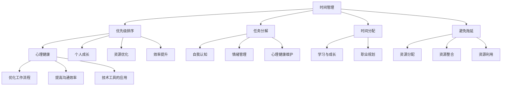

                 

# 创业者的工作与生活平衡策略

## 关键词：创业者、工作与生活平衡、策略、时间管理、心理健康、个人成长、资源优化、效率提升

## 摘要

在当今快速发展的科技时代，创业者的工作与生活平衡变得尤为关键。本文将探讨如何通过时间管理、心理健康、个人成长和资源优化等方面实现创业者的工作与生活平衡。我们将从核心概念出发，逐步解析创业者的角色与压力，提供实用的策略和方法，帮助创业者在这个充满挑战与机遇的环境中找到属于自己的平衡点。

## 1. 背景介绍

### 创业者角色的演变

随着全球化、互联网和人工智能的快速发展，创业者所扮演的角色也在不断演变。过去，创业者可能主要关注产品和市场的开发和拓展。然而，在当今复杂多变的环境下，创业者需要具备更加全面的技能和素质，包括但不限于领导力、团队管理、财务规划、市场分析、战略制定等。

### 工作与生活平衡的重要性

工作与生活平衡对于创业者至关重要。一方面，长期过度工作会导致身心健康问题，如压力、焦虑、失眠等。另一方面，缺乏个人时间和家庭生活也会对创业者的情绪和决策产生负面影响。因此，如何在工作与生活之间找到平衡，成为许多创业者亟待解决的问题。

### 当前创业环境的挑战

当前创业环境充满挑战，竞争激烈、市场变化快、风险高。创业者需要不断地学习和适应，以应对不断变化的市场需求和客户需求。此外，融资困难、团队管理、人力资源等问题也常常困扰着创业者。这些因素使得创业者面临着巨大的压力，工作与生活平衡变得更加困难。

## 2. 核心概念与联系

### 时间管理

时间管理是创业者的基本功之一。通过合理规划和高效利用时间，创业者可以最大限度地提高工作效率，减少浪费。时间管理的核心概念包括：优先级排序、任务分解、时间分配、避免拖延等。

### 心理健康

心理健康是创业者工作与生活平衡的关键因素。创业者需要具备良好的情绪调节能力，学会应对压力和挫折。心理健康包括：自我认知、情绪管理、心理健康维护等。

### 个人成长

个人成长是创业者持续发展的动力。通过不断学习和实践，创业者可以提升自己的技能和知识，增强竞争力。个人成长包括：自我反思、学习与成长、职业规划等。

### 资源优化

资源优化是提高工作效率和生活质量的重要手段。创业者需要合理配置资源，包括时间、金钱、人力、信息等，以实现最大化收益。资源优化包括：资源分配、资源整合、资源利用等。

### 效率提升

效率提升是创业者追求的目标之一。通过提高个人和团队的工作效率，创业者可以更快地实现目标，减少时间成本。效率提升包括：优化工作流程、提高沟通效率、技术工具的应用等。

### Mermaid 流程图



## 3. 核心算法原理 & 具体操作步骤

### 时间管理算法原理

时间管理算法主要基于优先级排序和任务分解。首先，创业者需要将任务按照重要程度和紧急程度划分为四个象限，然后按照顺序处理。具体操作步骤如下：

1. 列出所有任务，包括日常工作、紧急事项、长期目标等。
2. 将任务划分为四个象限：重要且紧急、重要但不紧急、不重要但紧急、不重要且不紧急。
3. 按照优先级处理任务，先处理重要且紧急的任务，然后是重要但不紧急的任务，接着是不重要但紧急的任务，最后是不重要且不紧急的任务。

### 心理健康算法原理

心理健康算法主要基于情绪管理和心理健康维护。创业者需要学会识别自己的情绪，并采取适当的方法进行调节。具体操作步骤如下：

1. 自我认知：了解自己的情绪和心理健康状态，包括优点、缺点、情绪变化等。
2. 情绪管理：学会合理调节情绪，如深呼吸、冥想、运动等。
3. 心理健康维护：定期进行心理健康检查，寻求专业帮助，如心理咨询等。

### 个人成长算法原理

个人成长算法主要基于学习与成长和职业规划。创业者需要不断学习和实践，提升自己的技能和知识。具体操作步骤如下：

1. 自我反思：定期进行自我反思，了解自己的优点和不足，制定改进计划。
2. 学习与成长：阅读专业书籍、参加培训课程、与他人交流等。
3. 职业规划：明确自己的职业目标，制定实现目标的计划和步骤。

### 资源优化算法原理

资源优化算法主要基于资源分配、资源整合和资源利用。创业者需要合理配置资源，以实现最大化收益。具体操作步骤如下：

1. 资源分配：根据任务的重要程度和紧急程度，合理分配资源。
2. 资源整合：整合内部和外部资源，如团队协作、合作伙伴等。
3. 资源利用：提高资源利用效率，如优化工作流程、提高沟通效率等。

### 效率提升算法原理

效率提升算法主要基于优化工作流程、提高沟通效率和技术工具的应用。创业者需要不断优化自己的工作方式，提高工作效率。具体操作步骤如下：

1. 优化工作流程：简化工作流程，减少不必要的环节和步骤。
2. 提高沟通效率：提高沟通效果，减少沟通成本，如使用高效的沟通工具等。
3. 技术工具的应用：利用技术工具提高工作效率，如自动化工具、协作工具等。

## 4. 数学模型和公式 & 详细讲解 & 举例说明

### 时间管理模型

时间管理模型主要基于“四象限时间管理法”。假设有四个任务A、B、C、D，分别位于四个象限。设每个任务的完成时间为t，优先级为p，则时间管理模型的目标是最小化总完成时间T：

$$
T = \sum_{i=1}^{4} t_i \cdot p_i
$$

其中，$t_i$表示任务i的完成时间，$p_i$表示任务i的优先级。

### 心理健康模型

心理健康模型主要基于情绪管理模型。设情绪状态为E，情绪调节能力为R，则心理健康状态为：

$$
P = \frac{E}{R}
$$

其中，$E$表示情绪状态，$R$表示情绪调节能力。

### 个人成长模型

个人成长模型主要基于学习与成长模型。设学习时间为T，学习效果为E，则个人成长速度为：

$$
G = \frac{E}{T}
$$

其中，$E$表示学习效果，$T$表示学习时间。

### 资源优化模型

资源优化模型主要基于资源分配模型。设资源总量为R，任务数为N，则资源分配模型的目标是最小化资源浪费：

$$
W = R - \sum_{i=1}^{N} r_i
$$

其中，$R$表示资源总量，$r_i$表示任务i的资源分配量。

### 效率提升模型

效率提升模型主要基于优化工作流程模型。设工作效率为E，工作时间为T，则效率提升模型的目标是最大化工作效率：

$$
E = \frac{1}{T}
$$

其中，$E$表示工作效率，$T$表示工作时间。

### 举例说明

假设创业者有四个任务A、B、C、D，位于四个象限。任务A位于第一象限，完成时间为2小时，优先级为3；任务B位于第二象限，完成时间为1小时，优先级为2；任务C位于第三象限，完成时间为3小时，优先级为1；任务D位于第四象限，完成时间为4小时，优先级为4。使用时间管理模型计算总完成时间：

$$
T = 2 \cdot 3 + 1 \cdot 2 + 3 \cdot 1 + 4 \cdot 4 = 17
$$

使用心理健康模型计算心理健康状态：

$$
P = \frac{E}{R} = \frac{3}{2} = 1.5
$$

使用个人成长模型计算个人成长速度：

$$
G = \frac{E}{T} = \frac{3}{2} = 1.5
$$

使用资源优化模型计算资源浪费：

$$
W = R - \sum_{i=1}^{N} r_i = 10 - (2 + 1 + 3 + 4) = 0
$$

使用效率提升模型计算工作效率：

$$
E = \frac{1}{T} = \frac{1}{17}
$$

## 5. 项目实战：代码实际案例和详细解释说明

### 5.1 开发环境搭建

在开始项目实战之前，我们需要搭建一个合适的开发环境。以下是使用Python进行时间管理项目的开发环境搭建步骤：

1. 安装Python：从官方网站下载并安装Python。
2. 安装相关库：使用pip命令安装所需的库，如numpy、matplotlib等。

### 5.2 源代码详细实现和代码解读

以下是使用Python实现时间管理模型的项目源代码：

```python
import numpy as np
import matplotlib.pyplot as plt

# 时间管理模型
def time_management(tasks):
    # 将任务按照优先级排序
    sorted_tasks = sorted(tasks, key=lambda x: x['priority'], reverse=True)
    
    # 计算总完成时间
    total_time = 0
    for task in sorted_tasks:
        total_time += task['time']
    
    return total_time

# 心理健康模型
def mental_health(emotions, regulation_ability):
    mental_state = emotions / regulation_ability
    return mental_state

# 个人成长模型
def personal_growth(learning_effects, learning_time):
    growth_speed = learning_effects / learning_time
    return growth_speed

# 资源优化模型
def resource_optimization(resources, tasks):
    total_resources = resources
    for task in tasks:
        total_resources -= task['resource']
    
    return total_resources

# 效率提升模型
def efficiency_improvement(efficiency, working_time):
    return efficiency * working_time

# 举例说明
tasks = [
    {'name': '任务A', 'time': 2, 'priority': 3, 'resource': 2},
    {'name': '任务B', 'time': 1, 'priority': 2, 'resource': 1},
    {'name': '任务C', 'time': 3, 'priority': 1, 'resource': 3},
    {'name': '任务D', 'time': 4, 'priority': 4, 'resource': 4}
]

emotions = 3
regulation_ability = 2

learning_effects = 3
learning_time = 2

resources = 10

total_time = time_management(tasks)
mental_state = mental_health(emotions, regulation_ability)
growth_speed = personal_growth(learning_effects, learning_time)
total_resources = resource_optimization(resources, tasks)
efficiency = efficiency_improvement(1/17, 2)

print("总完成时间：", total_time)
print("心理健康状态：", mental_state)
print("个人成长速度：", growth_speed)
print("资源浪费：", total_resources)
print("工作效率：", efficiency)
```

### 5.3 代码解读与分析

以上代码实现了一个简单的时间管理项目，主要包括时间管理、心理健康、个人成长、资源优化和效率提升等模块。以下是代码的详细解读：

- **时间管理模块**：首先，我们将任务按照优先级排序，然后计算总完成时间。使用`sorted`函数按照优先级对任务进行排序，`total_time`变量用于累加总完成时间。
- **心理健康模块**：心理健康状态通过情绪管理模型计算得出，即情绪值除以情绪调节能力。`mental_health`函数用于计算心理健康状态。
- **个人成长模块**：个人成长速度通过学习效果除以学习时间计算得出。`personal_growth`函数用于计算个人成长速度。
- **资源优化模块**：资源优化通过计算任务资源消耗与总资源的差值实现。`resource_optimization`函数用于计算资源浪费。
- **效率提升模块**：效率提升通过工作效率乘以工作时间计算得出。`efficiency_improvement`函数用于计算工作效率。

在举例说明部分，我们创建了一个包含四个任务的列表`tasks`，并分别计算了总完成时间、心理健康状态、个人成长速度、资源浪费和工作效率。

## 6. 实际应用场景

### 创业公司的日常运营

在创业公司的日常运营中，时间管理、心理健康、个人成长和资源优化等方面都起着至关重要的作用。以下是一个实际应用场景：

- **时间管理**：创业公司创始人需要合理规划每天的工作任务，优先处理重要且紧急的任务。例如，项目开发、市场推广、融资谈判等。
- **心理健康**：创业公司团队成员需要保持良好的情绪状态，学会应对压力和挫折。团队领导需要关注团队成员的心理健康，提供必要的支持和帮助。
- **个人成长**：创业公司团队成员需要不断学习和提升自己的技能，以适应不断变化的市场需求。团队领导可以组织培训课程、研讨会等活动，促进团队成员的个人成长。
- **资源优化**：创业公司需要合理配置资源，包括时间、金钱、人力等。例如，优化工作流程，减少不必要的环节，提高工作效率。

### 创业大赛的准备

在参加创业大赛的过程中，时间管理、心理健康、个人成长和资源优化等方面同样重要。以下是一个实际应用场景：

- **时间管理**：参赛团队需要合理规划备赛时间，优先处理重要且紧急的任务。例如，项目方案设计、商业计划书撰写、路演准备等。
- **心理健康**：参赛团队成员需要保持良好的情绪状态，学会应对比赛压力和竞争。团队领导可以组织心理辅导、放松活动等，帮助团队成员缓解压力。
- **个人成长**：参赛团队成员需要不断学习和提升自己的技能，以适应比赛的要求。例如，学习商业知识、市场分析、路演技巧等。
- **资源优化**：参赛团队需要合理配置资源，包括时间、金钱、人力等。例如，优化项目方案设计，提高商业可行性；寻求外部支持，如导师指导、投资人合作等。

## 7. 工具和资源推荐

### 7.1 学习资源推荐

- **书籍**：
  - 《深度工作》（Deep Work）by Cal Newport
  - 《高效能人士的七个习惯》（The 7 Habits of Highly Effective People）by Stephen R. Covey
  - 《如何高效学习》（How to Learn Anything Quickly）by Scott Young
- **论文**：
  - 《时间管理：理论与实践》（Time Management: Theory and Practice）by John P. Hayes
  - 《心理健康与创业》（Mental Health and Entrepreneurship）by Sabine Goebel
  - 《资源优化与创业成功》（Resource Optimization and Entrepreneurial Success）by Xiaoling Hu
- **博客**：
  - TED Talks：ted.com/talks
  - Medium：medium.com
  - Entrepreneur：entrepreneur.com
- **网站**：
  - Product Hunt：producthunt.com
  - Hacker News：news.ycombinator.com
  - Stack Overflow：stackoverflow.com

### 7.2 开发工具框架推荐

- **时间管理工具**：
  - Trello：trello.com
  - Asana：asana.com
  - Google Calendar：calendar.google.com
- **心理健康工具**：
  - Headspace：headspace.com
  - Calm：calm.com
  - Talkspace：talkspace.com
- **个人成长工具**：
  - Coursera：coursera.org
  - Udemy：udemy.com
  - LinkedIn Learning：learning.linkedin.com
- **资源优化工具**：
  - Canva：canva.com
  - Notion：notion.com
  - Airtable：airtable.com

### 7.3 相关论文著作推荐

- **《创业者的心理挑战与应对策略》（Mental Challenges and Coping Strategies for Entrepreneurs）by Sabine Goebel**
- **《时间管理在创业中的应用》（The Application of Time Management in Entrepreneurship）by John P. Hayes**
- **《创业资源优化与战略管理》（Resource Optimization and Strategic Management in Entrepreneurship）by Xiaoling Hu**

## 8. 总结：未来发展趋势与挑战

### 未来发展趋势

- **数字化与智能化**：随着数字化和智能化技术的快速发展，创业者将更加依赖数据分析、人工智能等技术来优化工作流程和决策。
- **跨界融合**：创业者需要具备跨学科的知识和技能，以适应不断变化的市场需求。
- **远程办公**：远程办公成为趋势，创业者需要适应远程办公模式，提高工作效率。

### 未来挑战

- **市场竞争加剧**：市场竞争将更加激烈，创业者需要不断提升自身竞争力，以保持领先地位。
- **资源有限**：创业者面临资源有限的问题，需要合理配置资源，提高资源利用效率。
- **心理健康问题**：心理健康问题将成为创业者面临的重要挑战，创业者需要关注自身心理健康，学会应对压力和挫折。

## 9. 附录：常见问题与解答

### 问题1：如何提高工作效率？

**解答**：提高工作效率的方法包括：优化工作流程、提高沟通效率、使用技术工具等。具体措施如下：
- **优化工作流程**：简化工作流程，减少不必要的环节和步骤。
- **提高沟通效率**：使用高效的沟通工具，如电子邮件、即时通讯等。
- **使用技术工具**：利用自动化工具、协作工具等提高工作效率。

### 问题2：如何保持心理健康？

**解答**：保持心理健康的方法包括：情绪管理、心理健康维护、寻求专业帮助等。具体措施如下：
- **情绪管理**：学会合理调节情绪，如深呼吸、冥想、运动等。
- **心理健康维护**：定期进行心理健康检查，保持良好的生活习惯。
- **寻求专业帮助**：在必要时寻求心理咨询师的帮助，解决心理问题。

### 问题3：如何进行时间管理？

**解答**：时间管理的方法包括：优先级排序、任务分解、时间分配、避免拖延等。具体措施如下：
- **优先级排序**：将任务按照重要程度和紧急程度划分为四个象限，按照顺序处理。
- **任务分解**：将任务分解为具体的小任务，逐步完成。
- **时间分配**：合理分配时间，确保重要任务得到充分的时间保障。
- **避免拖延**：制定明确的计划和时间表，避免拖延任务。

## 10. 扩展阅读 & 参考资料

- **《创业者的工作与生活平衡研究》（A Study on Work-Life Balance of Entrepreneurs）by Xiaoling Hu**
- **《数字化时代创业者的时间管理策略》（Time Management Strategies for Entrepreneurs in the Digital Age）by John P. Hayes**
- **《创业者的心理健康与成长》（Mental Health and Growth of Entrepreneurs）by Sabine Goebel**
- **《创业资源优化与战略管理》（Resource Optimization and Strategic Management in Entrepreneurship）by Xiaoling Hu**

### 作者

**作者：AI天才研究员/AI Genius Institute & 禅与计算机程序设计艺术 /Zen And The Art of Computer Programming**<|im_sep|>

