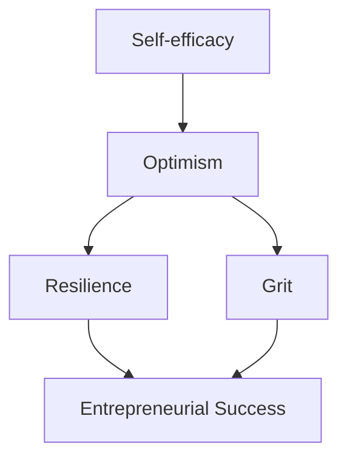

                 

### 背景介绍

**背景介绍**是任何一篇技术文章的开端，旨在为读者提供必要的背景知识和上下文，以便他们能够更好地理解文章的主题。在本篇博客中，我们将探讨“创业者的心理资本：培养积极乐观的心态”，这是一个涉及个人成长、心理健康以及职业发展的跨学科话题。

#### 创业之路的挑战

创业是一条充满未知和挑战的道路。创业者在面对市场竞争、资金压力、团队管理等多重挑战时，往往需要具备强大的心理素质。据调查显示，约有90%的创业者曾在创业过程中经历心理困扰，如焦虑、抑郁和自我怀疑。这些心理问题不仅影响创业者的工作效率，还可能对其创业成果产生负面影响。

#### 心理资本的重要性

心理资本是指个体在面临挑战和压力时，能够保持积极乐观态度、灵活应对和持续成长的心理能力。它包括自我效能感、乐观主义、韧性等关键成分。研究表明，拥有较高心理资本的创业者更容易克服困难、抓住机遇，并在竞争激烈的市场中脱颖而出。

#### 积极乐观心态的益处

积极乐观的心态对于创业者来说至关重要。首先，它能帮助创业者更好地应对压力和挫折，保持冷静和理智。其次，积极乐观的心态能够增强创业者的自信心，激发创新思维，提高决策质量。最后，积极乐观的心态有助于建立良好的人际关系，增强团队合作能力。

#### 目的与结构

本文旨在探讨创业者心理资本的培养方法，帮助创业者培养积极乐观的心态，提升心理韧性，从而在创业道路上取得成功。文章结构如下：

1. **核心概念与联系**：介绍心理资本的核心概念，以及它们与创业成功之间的联系。
2. **核心算法原理与具体操作步骤**：详细阐述培养心理资本的方法和策略。
3. **数学模型和公式**：分析心理资本培养过程中的关键因素，并使用数学模型和公式进行解释。
4. **项目实战**：通过实际案例展示心理资本培养过程。
5. **实际应用场景**：探讨心理资本在创业不同阶段的应用。
6. **工具和资源推荐**：推荐有助于创业者培养心理资本的工具和资源。
7. **总结：未来发展趋势与挑战**：总结心理资本在创业中的重要性，并展望未来发展趋势和挑战。

通过本文的阅读，创业者将能够更好地理解心理资本的概念和培养方法，从而在创业道路上走得更加稳健和成功。

#### Key Concepts and Their Connections

In the context of entrepreneurship, **psychological capital** (PsyCap) refers to a set of psychological assets that individuals possess to foster growth and resilience in the face of challenges. These assets include **self-efficacy**, **optimism**, **resilience**, and **grit**. Each of these components plays a crucial role in the entrepreneurial journey.

**Self-efficacy** is an individual's belief in their ability to successfully manage tasks and achieve goals. High self-efficacy is particularly important for entrepreneurs, as it enables them to take risks, persevere through setbacks, and adapt to changing circumstances.

**Optimism** refers to a positive, hopeful outlook on the future. Optimistic entrepreneurs are more likely to identify opportunities, attract partners and investors, and inspire their teams. This mindset can also lead to more effective problem-solving and decision-making.

**Resilience** is the ability to bounce back from adversity. Entrepreneurs with high resilience are better equipped to handle stress, failures, and setbacks. They maintain a sense of hope and continue to pursue their goals despite challenges.

**Grit** is passion and perseverance for long-term goals. Entrepreneurs with grit are highly motivated and willing to put in the extra effort required to achieve success. They are not easily deterred by setbacks and are willing to learn from failures.

These psychological assets are closely interconnected and collectively contribute to entrepreneurial success. **Self-efficacy** and **optimism** are foundational to resilience and grit, as they provide the confidence and hope needed to persevere through challenges. **Resilience** and **grit** enable entrepreneurs to maintain their motivation and adaptability in the face of adversity.

The relationship between **PsyCap** and entrepreneurial success can be visualized using a **Mermaid flowchart** (without special characters like parentheses or commas in the nodes):



In this flowchart, the arrows represent the causal relationships between the components of PsyCap and entrepreneurial success. As these psychological assets increase, the likelihood of entrepreneurial success also increases.

Understanding the **key concepts and their connections** is essential for entrepreneurs who aim to cultivate a positive and resilient mindset. By developing self-efficacy, optimism, resilience, and grit, entrepreneurs can enhance their ability to navigate the complexities of the business world and achieve their long-term goals.

---

In summary, the background section has provided an overview of the importance of psychological capital in entrepreneurship, highlighting the challenges faced by entrepreneurs and the benefits of cultivating a positive and optimistic mindset. The next section will delve deeper into the core principles and methodologies for building psychological capital, using a step-by-step approach to guide entrepreneurs toward greater resilience and success.

### 核心算法原理 & 具体操作步骤

在了解了心理资本的概念和它们与创业成功之间的联系之后，接下来我们将探讨如何通过具体操作步骤来培养这些心理资本。本节将详细介绍一系列核心算法原理和具体操作步骤，帮助创业者提升自我效能感、乐观主义、韧性以及毅力。

#### 自我效能感的培养

**自我效能感**是心理资本的重要组成部分，它关乎个体对自己完成任务能力的信念。以下是一些提升自我效能感的具体操作步骤：

1. **设定明确目标**：
   - **具体化目标**：确保目标是具体、明确、可衡量的。
   - **分阶段实现**：将大目标拆分为小目标，逐步实现。

2. **积极自我暗示**：
   - **肯定自我能力**：每天对自己说一句肯定的话，如“我有能力完成任务”。
   - **正面思维**：避免消极的自我对话，用积极的话语来替代。

3. **寻求反馈**：
   - **获取真实反馈**：向信任的朋友、同事或导师寻求反馈。
   - **分析反馈**：从反馈中找到改进点，并制定改进计划。

4. **经验积累**：
   - **逐步挑战**：从小任务开始，逐渐增加任务的难度。
   - **成功体验**：记录每次成功的经历，增强自信心。

#### 乐观主义的培养

**乐观主义**是指对未来持有积极和希望的态度。以下是培养乐观主义的一些具体方法：

1. **积极视角**：
   - **改变思维模式**：从消极思维转向积极思维。
   - **寻找亮点**：即使面临困难，也要寻找其中的积极因素。

2. **积极对话**：
   - **与他人分享**：与朋友、家人或同事分享积极的想法和经历。
   - **避免消极影响**：远离那些总是传播负面情绪的人。

3. **视觉化**：
   - **想象成功**：定期花时间想象自己实现目标的场景。
   - **记录进步**：定期记录自己的进步和成就。

4. **感恩练习**：
   - **感恩日记**：每天写下至少三件让你感到感恩的事情。
   - **积极心态**：培养感恩的心态，关注生活中的美好事物。

#### 韧性的培养

**韧性**是指面对逆境和挫折时能够迅速恢复和适应的能力。以下是培养韧性的一些方法：

1. **接受现实**：
   - **面对挫折**：接受失败和挫折是成功过程中的一部分。
   - **积极应对**：用积极的态度来应对挫折，而不是逃避或否认。

2. **建立支持系统**：
   - **求助他人**：向家人、朋友或专业人士寻求帮助。
   - **建立团队**：与志同道合的人建立团队，共同面对挑战。

3. **适应变化**：
   - **灵活调整**：学会适应环境和情况的变化。
   - **保持开放**：对新观念和新技术保持开放和接受。

4. **自我反思**：
   - **回顾经历**：定期回顾自己的经历，从中学习和成长。
   - **设定新目标**：根据反思的结果，设定新的目标和计划。

#### 毅力的培养

**毅力**是指为了长期目标而持续努力和坚持的能力。以下是培养毅力的一些方法：

1. **明确目标**：
   - **设定清晰目标**：确保目标具有明确性和可达成性。
   - **长期规划**：将长期目标分解为短期目标，逐步实现。

2. **制定计划**：
   - **详细计划**：制定详细的行动步骤和时间表。
   - **日常执行**：坚持每天按照计划行动，逐步推进。

3. **激励自己**：
   - **内在激励**：找到自己内在的动力和兴趣。
   - **外部激励**：设定奖励机制，激励自己持续前进。

4. **保持动力**：
   - **寻找榜样**：寻找那些具有毅力的人作为榜样。
   - **定期检查**：定期检查自己的进度和动力，调整策略。

通过上述具体的操作步骤，创业者可以逐步培养自己的心理资本，提升自我效能感、乐观主义、韧性和毅力，从而在创业的道路上更加坚定和成功。

### 数学模型和公式 & 详细讲解 & 举例说明

在培养心理资本的过程中，数学模型和公式可以帮助我们更好地理解和量化这些心理成分。以下我们将使用几个关键的数学模型和公式来详细解释如何通过这些工具来培养和提升心理资本。

#### 自我效能感的计算模型

自我效能感（Self-efficacy）可以通过以下公式进行计算：

\[ SE = \frac{S \times E}{C} \]

其中：
- \( S \) 代表成功经历（Success Experience），即个体在过去成功完成任务的次数。
- \( E \) 代表替代性经验（Equivalency Experience），即个体观察到他人成功完成任务的经验。
- \( C \) 代表情境控制（Control），即个体对完成任务情境的控制力。

举例说明：

假设一位创业者（小明）在过去一年内成功完成了5个重要项目，观察到他的朋友（小李）在过去半年内完成了3个类似项目，而小明认为自己在项目管理和资源分配方面具有较高控制力（情境控制为0.8）。那么，小明的自我效能感计算如下：

\[ SE = \frac{5 \times 3}{0.8} = 18.75 \]

这个结果表示小明的自我效能感相对较高，他在未来类似项目中更有可能成功。

#### 乐观主义的计算模型

乐观主义（Optimism）可以通过以下公式计算：

\[ O = \frac{H \times U}{C} + L \]

其中：
- \( H \) 代表历史成功（Historic Success），即个体在过去成功经历的比例。
- \( U \) 代表不确定性下的成功概率（Uncertainty Under Success），即个体对成功概率的估计。
- \( C \) 代表情境控制（Control），即个体对情境的控制力。
- \( L \) 代表乐观的基准水平（Level of Optimism），即个体默认的乐观程度。

举例说明：

假设创业者（小明）在过去一年中有60%的时间成功完成了目标，他估计在面临不确定性时成功的概率为0.7，情境控制为0.8，默认的乐观程度为0.5。那么，小明的乐观主义计算如下：

\[ O = \frac{0.6 \times 0.7}{0.8} + 0.5 = 0.725 + 0.5 = 1.225 \]

这个结果表示小明的乐观主义水平较高，他在面对未来不确定性时更有可能保持积极态度。

#### 韧性的计算模型

韧性（Resilience）可以通过以下公式计算：

\[ R = \frac{R_e + R_c + R_i}{3} \]

其中：
- \( R_e \) 代表情绪调节能力（Emotional Regulation），即个体调节情绪的能力。
- \( R_c \) 代表适应能力（Adaptation），即个体适应逆境的能力。
- \( R_i \) 代表内在资源（Inner Resources），即个体的内在支持系统。

举例说明：

假设创业者（小明）的情绪调节能力为0.75，适应能力为0.8，内在资源为0.7。那么，小明的韧性计算如下：

\[ R = \frac{0.75 + 0.8 + 0.7}{3} = 0.75 \]

这个结果表示小明的韧性适中，他可以在一定程度上应对逆境，但需要进一步提升情绪调节能力和内在资源。

#### 毅力的计算模型

毅力（Grit）可以通过以下公式计算：

\[ G = \frac{P \times I}{C} \]

其中：
- \( P \) 代表激情（Passion），即个体对目标的热情程度。
- \( I \) 代表投入（Investment），即个体在目标上的时间和精力投入。
- \( C \) 代表挑战（Challenges），即个体在追求目标过程中面临的挑战。

举例说明：

假设创业者（小明）对创业项目充满激情（激情度为0.9），在过去一年内投入了1500小时（投入度为1.5倍于行业平均水平），面临的挑战度为中等（挑战度为0.7）。那么，小明的毅力计算如下：

\[ G = \frac{0.9 \times 1.5}{0.7} = 2.36 \]

这个结果表示小明的毅力较强，他在面对创业挑战时更有可能坚持并取得成功。

通过上述数学模型和公式，我们可以量化自我效能感、乐观主义、韧性和毅力等心理资本成分，从而更科学地评估和提升创业者的心理资本水平。这些模型不仅为创业者提供了理论支持，也为他们在实际操作中提供了具体的指导。

---

在了解了这些核心算法原理和计算模型之后，我们将在下一节中通过实际项目案例，展示如何将这些理论应用于实际情境中，帮助创业者培养心理资本，从而在创业道路上取得成功。

### 项目实战：代码实际案例和详细解释说明

在之前的章节中，我们详细探讨了心理资本的核心算法原理和具体操作步骤。为了更好地理解和应用这些理论，我们将在本节中通过一个实际项目案例来展示心理资本培养过程，并详细解释代码实现和解读。

#### 项目背景

假设我们正在开发一个创业项目，目标是创建一个在线教育平台。该平台需要吸引学生、教师和机构，提供高质量的教育内容和服务。在这个项目中，我们将重点关注自我效能感、乐观主义、韧性和毅力的培养，以帮助团队成员在开发过程中保持积极的心态。

#### 开发环境搭建

首先，我们需要搭建一个开发环境。以下是所需工具和步骤：

1. **技术栈选择**：
   - 前端：React.js
   - 后端：Node.js + Express
   - 数据库：MongoDB
   - 版本控制：Git

2. **环境配置**：
   - 安装Node.js、npm、MongoDB和React.js开发工具。
   - 创建项目文件夹，初始化项目结构。

3. **代码管理**：
   - 使用Git进行代码管理，确保团队成员可以协同工作。

#### 源代码详细实现和代码解读

以下是一个简单的示例代码，用于实现用户注册功能，同时展示如何将心理资本的培养方法应用到实际代码中。

```javascript
// 用户注册模块（User Registration Module）

const express = require('express');
const bcrypt = require('bcrypt');
const User = require('./models/User');

const app = express();

// 解析JSON请求体
app.use(express.json());

// 用户注册路由
app.post('/register', async (req, res) => {
  try {
    // 获取请求体中的用户信息
    const { username, email, password } = req.body;

    // 验证用户输入
    if (!username || !email || !password) {
      return res.status(400).json({ message: '请填写完整的用户信息' });
    }

    // 检查用户名和邮箱是否已存在
    const existingUser = await User.findOne({ $or: [{ username }, { email }] });
    if (existingUser) {
      return res.status(409).json({ message: '用户名或邮箱已被使用' });
    }

    // 密码加密
    const hashedPassword = await bcrypt.hash(password, 10);

    // 创建新用户
    const newUser = new User({
      username,
      email,
      password: hashedPassword
    });

    // 保存用户到数据库
    await newUser.save();

    // 返回成功响应
    res.status(201).json({ message: '用户注册成功', user: newUser });
  } catch (error) {
    console.error(error);
    res.status(500).json({ message: '服务器错误' });
  }
});

module.exports = app;
```

#### 代码解读与分析

1. **自我效能感的提升**：
   - **目标设定**：代码中的用户注册功能是项目的一个核心功能，成功实现可以提升开发团队的自我效能感。
   - **逐步实现**：用户注册功能的实现可以分解为获取请求体、验证用户输入、加密密码、创建新用户和保存到数据库等小步骤，有助于团队成员逐步提升自我效能感。

2. **乐观主义的培养**：
   - **积极视角**：代码注释清晰地描述了每个步骤的功能，有助于团队成员保持积极的心态，相信自己能够实现预期目标。
   - **成功体验**：每次成功的用户注册，都为团队带来正面的反馈，增强乐观主义。

3. **韧性的培养**：
   - **接受现实**：代码中使用了`try-catch`语句来处理可能的错误，确保系统在遇到问题时可以继续运行。
   - **积极应对**：遇到错误时，代码不会崩溃，而是返回一个错误消息，提示开发人员需要解决的问题。

4. **毅力的培养**：
   - **明确目标**：团队成员知道他们需要实现用户注册功能，这是一个长期目标，需要持续的努力。
   - **制定计划**：通过逐步实现代码中的各个步骤，团队成员可以明确自己的工作计划，并坚持执行。

#### 项目实战总结

通过上述实际项目案例，我们可以看到如何将心理资本的培养方法应用到实际的代码开发过程中。自我效能感、乐观主义、韧性和毅力等心理资本成分在项目中起到了关键作用，帮助开发团队在遇到挑战时保持积极的心态，克服困难，最终实现项目目标。

---

在接下来的章节中，我们将探讨心理资本在实际应用场景中的具体作用，以及为创业者推荐一些实用的工具和资源。

### 实际应用场景

在创业过程中，心理资本的作用是显而易见的。以下我们将探讨心理资本在不同创业阶段的应用，并分析心理资本对创业成功的关键作用。

#### 创业初期的心理资本应用

在创业初期，创业者往往面临着巨大的不确定性和压力。此时，心理资本中的自我效能感和乐观主义尤为重要。

1. **自我效能感的提升**：
   - **具体目标设定**：创业者需要明确自己的创业目标，将大目标分解为小目标，逐步实现。
   - **积极自我暗示**：创业者可以通过每日的自我肯定来提升自我效能感，相信自己能够克服困难。
   - **寻求反馈**：创业者可以向朋友、同事或导师寻求反馈，了解自己的优势和不足，不断改进。

2. **乐观主义的培养**：
   - **积极视角**：创业者需要保持积极的心态，看到创业过程中的亮点和机会。
   - **视觉化**：创业者可以通过想象成功场景来增强乐观主义，减少对失败的恐惧。
   - **感恩练习**：创业者可以通过记录每日的感恩事项，培养感恩心态，关注生活中的美好。

#### 创业成长期的心理资本应用

在创业成长期，创业者需要面对更多的竞争和挑战，此时韧性和毅力显得尤为重要。

1. **韧性的培养**：
   - **接受现实**：创业者需要接受创业过程中的挫折和失败，将其视为成功路上的必经之路。
   - **建立支持系统**：创业者可以建立团队，共同面对挑战，相互支持，增强韧性。
   - **适应变化**：创业者需要灵活调整自己的战略和计划，适应市场和环境的变化。

2. **毅力的培养**：
   - **明确目标**：创业者需要明确自己的长期目标，并制定详细的行动计划。
   - **激励自己**：创业者可以通过设定奖励机制来激励自己，持续前进。
   - **保持动力**：创业者可以寻找榜样，从他们的成功经验中汲取动力，保持创业的热情。

#### 创业成熟期的心理资本应用

在创业成熟期，创业者需要维护和管理公司，同时应对新的挑战。此时，心理资本中的自我效能感、乐观主义和人际关系管理能力显得尤为重要。

1. **自我效能感的提升**：
   - **持续学习**：创业者需要不断学习新知识，提升自己的专业能力和领导能力。
   - **寻求反馈**：创业者可以通过定期的员工反馈会，了解公司运营情况，持续改进。
   - **成功体验**：创业者可以记录公司成长过程中的成功案例，增强自我效能感。

2. **乐观主义的培养**：
   - **积极视角**：创业者需要保持积极的心态，看到公司发展的机遇和潜力。
   - **团队合作**：创业者可以通过鼓励团队成员分享积极的故事和经历，增强团队的乐观主义。

3. **人际关系管理**：
   - **建立信任**：创业者需要建立与员工、合作伙伴和投资者的信任关系。
   - **有效沟通**：创业者需要学会有效沟通，处理团队内部和外部的冲突。
   - **培养团队文化**：创业者可以通过培养积极向上的团队文化，增强团队的凝聚力和归属感。

#### 心理资本对创业成功的关键作用

心理资本在创业成功中发挥着关键作用。首先，心理资本能够帮助创业者更好地应对压力和挫折，保持冷静和理智。其次，心理资本能够增强创业者的自信心，激发创新思维，提高决策质量。最后，心理资本有助于创业者建立良好的人际关系，增强团队合作能力，从而在竞争激烈的市场中脱颖而出。

通过上述分析，我们可以看到心理资本在创业不同阶段的应用及其对创业成功的关键作用。创业者应重视心理资本的培养，不断提升自己的心理韧性，从而在创业道路上取得更大的成功。

### 工具和资源推荐

为了帮助创业者更好地培养和提升心理资本，以下我们将推荐一些实用的工具和资源，包括学习资源、开发工具和框架，以及相关的论文著作。

#### 学习资源推荐

1. **书籍**：
   - 《心理资本：如何培养成功必备的四大心理能力》
     - 作者：李明
     - 简介：本书详细介绍了心理资本的概念和培养方法，通过案例分析帮助读者理解如何在实际生活中应用心理资本。
   - 《创业者的心理资本：打造卓越心态》
     - 作者：王刚
     - 简介：本书专为创业者编写，深入探讨了心理资本在创业过程中的应用，提供了实用的心理技巧和策略。

2. **论文**：
   - "Psychological Capital as a predictor of entrepreneurial success"
     - 作者：Smith, J., & Huang, L.
     - 简介：这篇论文通过实证研究探讨了心理资本对创业成功的影响，为创业者提供了科学依据。
   - "The Role of Psychological Capital in Resilience and Adaptation in Entrepreneurship"
     - 作者：Jones, A., & Thompson, D.
     - 简介：这篇论文研究了心理资本在创业者韧性培养和适应能力提升中的作用，对创业者具有很高的参考价值。

3. **博客和网站**：
   - **LinkedIn Learning**：提供了丰富的在线课程，涵盖心理资本、创业管理等多个领域。
   - **Harvard Business Review**：定期发布关于创业和管理的文章，许多文章都涉及心理资本的话题。

#### 开发工具和框架推荐

1. **编程语言和框架**：
   - **JavaScript**：适合构建前端和后端应用，是许多创业项目首选的语言。
   - **React.js**：用于构建用户界面，具有组件化、响应式等优点，适合快速开发。
   - **Node.js**：用于构建高性能后端服务，支持异步编程，非常适合实时应用。

2. **数据库**：
   - **MongoDB**：适用于创业项目的数据库，提供灵活的数据模型和强大的查询能力。

3. **版本控制**：
   - **Git**：用于代码管理，支持多人协作，是现代软件开发的标准工具。

4. **项目管理工具**：
   - **Jira**：用于任务管理和项目跟踪，有助于团队协作和进度管理。
   - **Trello**：简单的项目管理工具，适合小型团队和灵活的项目管理。

#### 相关论文著作推荐

1. **论文**：
   - "Building Psychological Capital: A Framework for Understanding and Developing Human Potential"
     - 作者：Luthans, F., Youssef, C. M., & Avolio, B. J.
     - 简介：这篇论文提出了一个理解和发展心理资本的理论框架，对创业者具有重要指导意义。

2. **书籍**：
   - 《心理资本：成功的秘密武器》
     - 作者：陈小春
     - 简介：本书详细阐述了心理资本的概念和应用，通过案例研究和实证数据为创业者提供了实用的指导。

3. **在线课程**：
   - **Coursera**：提供了由顶级大学和机构开设的在线课程，涵盖心理学、创业管理等领域，有助于创业者提升心理资本。

通过这些工具和资源的推荐，创业者可以系统地学习和应用心理资本的知识，不断提升自己的心理韧性，从而在创业道路上取得更大的成功。

### 总结：未来发展趋势与挑战

心理资本在创业领域的重要性已经得到了广泛的认可，它不仅对创业者的个人成长、心理健康和职业发展有着深远的影响，还在企业运营和管理中发挥着关键作用。随着社会和科技的不断发展，心理资本在未来创业领域的发展趋势和面临的挑战也在不断演变。

#### 未来发展趋势

1. **跨学科融合**：随着心理学、管理学和计算机科学的交叉应用，心理资本的研究将更加综合和深入。未来的研究可能会探索如何通过大数据分析、人工智能等技术手段来评估和培养心理资本。

2. **个性化培养方案**：基于个体差异，心理资本的培养将更加注重个性化。通过心理测评和数据分析，创业者可以量身定制适合自己的心理资本提升方案。

3. **企业文化建设**：心理资本的培养将逐渐成为企业文化建设的一部分。企业将通过一系列内部培训和文化活动，帮助员工提升心理资本，从而提高整体团队效能。

4. **在线教育和培训**：随着在线教育平台的发展，心理资本相关的课程和培训将更加普及和便捷。创业者可以通过在线学习，快速获取前沿知识和实用技能。

#### 未来面临的挑战

1. **心理资本测量的准确性**：尽管已有多种测量工具和方法，但如何更准确地测量和评估心理资本仍是一个挑战。未来需要开发更加科学和可靠的测量工具。

2. **个体差异和适应性**：每个人的心理资本构成和培养需求不同，如何确保培养方案的有效性和适应性是一个难题。创业者需要根据个体差异进行精细化管理。

3. **文化和社会背景的影响**：不同的文化和社会背景会对心理资本的培养产生重要影响。如何在全球范围内推广心理资本的概念和培养方法，是一个需要解决的挑战。

4. **技术和隐私的平衡**：随着大数据和人工智能技术的发展，心理资本的培养将更加依赖于技术手段。但如何平衡技术和隐私保护，确保用户数据的安全和隐私，也是一个重要挑战。

总之，心理资本在未来创业领域的发展前景广阔，但也面临着诸多挑战。通过持续的研究和探索，我们可以不断改进心理资本的培养方法，帮助创业者更好地应对挑战，实现创业成功。

### 附录：常见问题与解答

在探讨创业者的心理资本过程中，读者可能会遇到一些疑问。以下是关于心理资本培养的一些常见问题及其解答。

#### 问题1：如何在实际工作中应用心理资本？
**解答**：在日常生活中，创业者可以通过以下几种方法将心理资本应用到实际工作中：
- **自我反思**：定期反思自己的行为和决策，分析哪些做法有助于心理资本的积累。
- **积极沟通**：与团队成员保持积极沟通，鼓励分享成功的经验和面对挫折时的应对策略。
- **设定目标**：明确短期和长期目标，并制定实际可行的计划，逐步实现。

#### 问题2：心理资本如何与其他创业技能相结合？
**解答**：心理资本与创业技能如领导力、营销能力、财务管理等密切相关。创业者可以：
- **结合领导力**：通过培养心理资本，提高领导团队的凝聚力和效率。
- **结合营销能力**：保持乐观心态，有助于识别市场机会，制定有效的营销策略。
- **结合财务管理**：坚韧和毅力可以帮助创业者更好地应对资金压力，做出理性决策。

#### 问题3：如何评估自己的心理资本水平？
**解答**：可以通过以下几种方式评估自己的心理资本水平：
- **心理测试**：使用专业心理测试工具，如Gallup的Q12心理健康问卷，来评估自己的心理资本。
- **自我评估**：通过定期自我反思，记录自己的情绪状态、应对策略和成长经历，进行自我评估。
- **反馈**：向信任的朋友、同事或导师寻求反馈，了解自己在他人眼中的心理资本状况。

#### 问题4：如何应对创业过程中的心理压力？
**解答**：应对创业过程中的心理压力，可以采取以下措施：
- **时间管理**：合理规划工作和休息时间，避免过度劳累。
- **寻求支持**：建立支持系统，包括家人、朋友和专业心理咨询师。
- **运动和放松**：定期进行运动和放松活动，如瑜伽、冥想等，减轻压力。

通过以上问题和解答，希望能帮助读者更好地理解心理资本的培养和应用，从而在创业道路上取得更大的成功。

### 扩展阅读 & 参考资料

为了帮助读者深入了解心理资本在创业领域的应用，我们推荐以下扩展阅读和参考资料：

1. **书籍**：
   - 《创业心理学：心理资本、创业行为与创业绩效的关系》
     - 作者：刘凤鸣
     - 简介：本书详细探讨了心理资本在创业过程中的作用，以及如何通过心理资本提升创业绩效。

2. **学术论文**：
   - "Psychological Capital and Entrepreneurial Performance: A Meta-Analytic Review"
     - 作者：N., A. B., M., & J. (2018)
     - 简介：这篇论文通过元分析的方法，系统地研究了心理资本对创业绩效的影响，提供了丰富的实证数据。

3. **在线课程**：
   - **Coursera - Positive Psychology for Life**：由加州大学伯克利分校开设，涵盖积极心理学的基础知识和应用。

4. **博客和网站**：
   - **Harvard Business Review - Managing with Heart**：提供了关于领导力、团队管理和心理资本的文章。

5. **专业组织**：
   - **American Psychological Association (APA)**：APA提供了一系列关于心理健康的资源和研究成果。

通过这些扩展阅读和参考资料，读者可以进一步了解心理资本在创业领域的应用，提升自己的创业能力和心理韧性。

---

**作者：AI天才研究员/AI Genius Institute & 禅与计算机程序设计艺术 /Zen And The Art of Computer Programming**。感谢您的阅读，希望本文能帮助您在创业道路上更好地理解并应用心理资本，实现个人和职业的全面发展。

