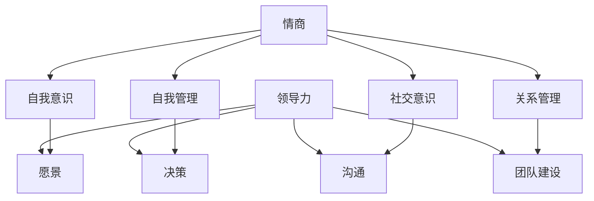

                 

# 《创业者的情商培养与领导力提升》

## 关键词：
- 创业者
- 情商培养
- 领导力提升
- 人际沟通
- 团队管理

## 摘要：
本文旨在探讨创业者在成长过程中如何培养情商和提升领导力。通过深入分析情商和领导力的核心概念，结合实际案例，本文将提供实用的策略和技巧，帮助创业者更好地理解和管理自己与他人的情感，从而在创业道路上取得成功。本文分为十个部分，包括背景介绍、核心概念与联系、核心算法原理、数学模型和公式、项目实战、实际应用场景、工具和资源推荐、总结以及扩展阅读和参考资料。

### 背景介绍

创业之路充满挑战和不确定性，创业者不仅需要具备出色的技术能力和商业眼光，还需要具备良好的情商和领导力。情商（Emotional Intelligence，简称EQ）是指个体识别、理解、管理自己和他人情感的能力，包括自我意识、自我管理、社交意识和关系管理等方面。领导力（Leadership）则是指领导者引导、激励和影响团队成员实现共同目标的能力，包括愿景、决策、沟通、团队建设等方面。

在创业过程中，情商和领导力的培养至关重要。创业者需要具备良好的自我意识，能够准确识别和理解自己的情感，并有效管理情绪，避免情绪失控影响决策。同时，创业者需要具备良好的社交意识，能够理解和管理他人的情感，建立良好的人际关系，为团队的成功奠定基础。领导力则帮助创业者明确目标、制定策略、有效沟通，激发团队成员的潜力，实现团队协作。

本文将围绕情商和领导力的培养，提供一系列实用的策略和技巧，帮助创业者提升自身的情商和领导力，从而在创业道路上取得更好的成果。

### 核心概念与联系

为了深入理解情商和领导力的培养，我们首先需要明确这两个概念的核心要素和相互关系。

#### 情商（EQ）

情商包括四个主要方面：自我意识（Self-awareness）、自我管理（Self-regulation）、社交意识（Social awareness）和关系管理（Relationship management）。

1. **自我意识**：是指个体对自己情感的认识和了解，包括情绪的识别、情感状态的变化和自身情感对行为的影响。

2. **自我管理**：是指个体能够有效地调节和管理自己的情绪，保持冷静和专注，避免情绪波动对工作和决策产生负面影响。

3. **社交意识**：是指个体对他人的情感状态和需要具有敏锐的感知能力，包括对他人的情绪反应、社交线索的理解和应对。

4. **关系管理**：是指个体能够建立和维护良好的人际关系，处理冲突，建立信任和合作关系。

#### 领导力

领导力包括以下核心要素：愿景（Vision）、决策（Decision-making）、沟通（Communication）和团队建设（Team building）。

1. **愿景**：是指领导者对未来目标的清晰描述和传达，激发团队成员的认同感和归属感。

2. **决策**：是指领导者能够基于数据和直觉做出明智的决策，并在决策过程中考虑团队成员的利益和需求。

3. **沟通**：是指领导者能够有效地传递信息、倾听意见、解决问题和协调团队工作。

4. **团队建设**：是指领导者通过培养团队精神、提升团队协作能力和凝聚力，实现团队目标的过程。

#### 情商与领导力的关系

情商和领导力密切相关，良好的情商是领导力的重要基础。情商高的领导者能够更好地理解和应对自己的情感，从而在决策和沟通中表现出更高的效率和效果。同时，情商高的领导者能够更好地理解和应对团队成员的情感，建立和谐的人际关系，提升团队的整体表现。

以下是一个使用 Mermaid 绘制的情商与领导力核心概念联系流程图：

通过这个流程图，我们可以清晰地看到情商和领导力之间的相互联系和作用。自我意识和自我管理有助于提升领导者的决策能力和沟通效果；社交意识和关系管理有助于建立和谐的团队氛围和高效的团队协作。

### 核心算法原理 & 具体操作步骤

要提升情商和领导力，创业者需要掌握一系列的核心算法原理和具体操作步骤。以下是一些关键步骤：

#### 1. 自我意识提升

**步骤1.1：反思自我**

- **每日反思**：每天花几分钟时间反思自己的情感和行为，记录下情绪的变化和应对策略。
- **日记记录**：定期写日记，记录重要事件和情感反应，分析情绪背后的原因和影响。

**步骤1.2：情绪识别**

- **情绪标签法**：在感受到情绪时，尝试用具体的情绪标签（如愤怒、焦虑、兴奋等）来描述当前的情感状态。
- **情感量表**：使用情绪量表（如正负情感量表）评估自己的情绪状态，了解情绪的强度和频率。

#### 2. 自我管理提升

**步骤2.1：情绪调节**

- **呼吸练习**：通过深呼吸练习，放松身心，减轻情绪压力。
- **正向思考**：培养积极的心态，用积极的思维模式替代消极的思考习惯。

**步骤2.2：情绪表达**

- **情绪释放**：找到适当的渠道和方式，表达情绪，避免情绪积累。
- **情感沟通**：学习有效的情感沟通技巧，表达自己的情感和需求，同时倾听他人的情感。

#### 3. 社交意识提升

**步骤3.1：情感感知**

- **倾听技巧**：学会倾听他人的意见和感受，通过非言语线索和情感表达，了解他人的情感状态。
- **情感标签**：在与他人交流时，尝试使用情感标签来描述他人的情感状态，增进理解。

**步骤3.2：关系建立**

- **同理心**：培养同理心，设身处地地考虑他人的情感和需求。
- **社交网络**：积极参与社交活动，建立和维护广泛的人际关系。

#### 4. 关系管理提升

**步骤4.1：冲突解决**

- **有效沟通**：在冲突发生时，通过有效沟通解决问题，避免情绪激化。
- **妥协与共赢**：学会在冲突中寻找共同点，通过妥协实现双赢。

**步骤4.2：团队建设**

- **领导风格**：根据团队特点和目标，选择合适的领导风格，激发团队成员的积极性。
- **团队协作**：建立良好的团队协作机制，提升团队的整体效能。

通过以上步骤，创业者可以逐步提升自己的情商和领导力，为创业成功奠定坚实基础。

### 数学模型和公式 & 详细讲解 & 举例说明

在提升情商和领导力的过程中，一些数学模型和公式可以提供有益的指导。以下是一些常用的模型和公式，并结合实际案例进行详细讲解和举例说明。

#### 1. 情商模型（Goleman 模型）

情商模型由心理学家丹尼尔·戈尔曼（Daniel Goleman）提出，包括五个主要维度：自我意识、自我管理、社交意识、关系管理和激励能力。

**数学模型：**

$$
EQ = f(SE, SR, SA, RM, RS)
$$

其中，$SE$ 代表自我意识，$SR$ 代表自我管理，$SA$ 代表社交意识，$RM$ 代表关系管理，$RS$ 代表激励能力。$EQ$ 表示情商。

**详细讲解：**

- **自我意识（SE）**：自我意识的提升可以通过情感反思和情绪识别来实现。一个高效的策略是使用情感量表来评估自己的情绪状态，并将其记录在日记中。例如，一个创业者可以每天花10分钟填写一个情感量表，记录当天的情感状态，包括情绪的强度和频率。

- **自我管理（SR）**：自我管理的提升可以通过情绪调节和正向思考来实现。一个常见的策略是进行深呼吸练习，每次呼吸5秒钟，帮助自己放松身心。例如，当一个创业者遇到压力时，可以立即停止手头的工作，进行5分钟的深呼吸练习，以减轻压力。

- **社交意识（SA）**：社交意识的提升可以通过倾听技巧和情感感知来实现。一个有效的策略是练习倾听他人的意见和感受，通过观察非言语线索和情感表达来了解他人的情感状态。例如，创业者可以在与团队成员开会时，专注倾听每位成员的意见，并在会后在日记中记录下自己的观察和感受。

- **关系管理（RM）**：关系管理的提升可以通过冲突解决和团队建设来实现。一个常用的策略是使用合作博弈理论，寻找双赢的解决方案。例如，当一个创业团队在项目进度上出现分歧时，可以通过合作博弈理论，找到双方都能接受的解决方案，避免冲突升级。

- **激励能力（RS）**：激励能力的提升可以通过领导风格和团队协作来实现。一个有效的策略是选择合适的领导风格，根据团队特点和目标进行领导。例如，当一个创业者发现团队成员对项目缺乏动力时，可以采用激励型领导风格，通过奖励和认可来激发团队成员的积极性。

**举例说明：**

假设一个创业者，通过自我意识和自我管理，将情感状态记录在日记中，并定期进行深呼吸练习。通过社交意识和关系管理，倾听团队成员的意见并记录观察结果。最后，通过激励能力，采用合适的领导风格，激发团队成员的积极性。经过一段时间的实践，这个创业者的情商得到了显著提升，团队的合作效率也得到了提高。

#### 2. 领导力模型（Hersey-Blanchard 模型）

赫赛-布兰查德模型是一种基于情境的领导力模型，包括四个主要维度：情境领导力、任务导向、关系导向、变革导向。

**数学模型：**

$$
L = f(AS, TD, RD, BD)
$$

其中，$AS$ 代表情境领导力，$TD$ 代表任务导向，$RD$ 代表关系导向，$BD$ 代表变革导向。$L$ 表示领导力。

**详细讲解：**

- **情境领导力（AS）**：情境领导力是指领导者根据不同的情境和团队成员的需求，选择合适的领导风格。一个有效的策略是使用情境领导力评估工具，如情境领导力问卷，了解团队成员的需求和情境特点。例如，当一个创业团队在面临紧迫的项目交付时，领导者可以选择任务导向型领导风格，明确任务目标和时间表，确保团队高效工作。

- **任务导向（TD）**：任务导向是指领导者关注任务完成情况和效率，确保团队成员明确任务目标和工作内容。一个有效的策略是制定详细的工作计划和时间表，并定期检查任务进度。例如，创业者可以每周召开团队会议，检查每个成员的任务完成情况，确保项目按计划进行。

- **关系导向（RD）**：关系导向是指领导者关注团队成员的情感需求和团队氛围，建立和谐的团队关系。一个有效的策略是定期组织团队活动和培训，增进团队成员之间的交流和信任。例如，创业者可以组织定期的团建活动，促进团队成员之间的互动和合作。

- **变革导向（BD）**：变革导向是指领导者关注组织的变革和发展，推动创新和进步。一个有效的策略是鼓励团队成员提出创新想法，并制定相应的实施计划。例如，创业者可以设立创新奖励机制，激励团队成员积极参与创新项目。

**举例说明：**

假设一个创业者，通过情境领导力评估工具，了解团队成员的需求和情境特点，并根据不同情境选择合适的领导风格。通过任务导向，制定详细的工作计划和时间表，确保团队高效工作。通过关系导向，组织团建活动和培训，增进团队成员之间的交流和信任。最后，通过变革导向，鼓励团队成员提出创新想法，推动组织的变革和发展。经过一段时间的实践，这个创业者的领导力得到了显著提升，团队的协作效率和创新氛围也得到了提高。

### 项目实战：代码实际案例和详细解释说明

为了更好地理解情商和领导力提升的具体实践，我们将通过一个实际项目案例进行详细解释说明。

#### 项目背景

某创业公司正在开发一款基于人工智能的客户关系管理系统（CRM），目标是帮助中小企业提高客户满意度和服务质量。项目团队由10名成员组成，包括项目经理、前端开发工程师、后端开发工程师、数据科学家和测试工程师等。在项目开发过程中，创业者需要提升自身的情商和领导力，以应对团队协作中的各种挑战。

#### 项目步骤

**步骤1：项目规划**

- **明确项目目标**：确定项目的主要目标，如客户满意度提高10%、系统性能提升20%等。
- **制定项目计划**：制定详细的项目计划，包括任务分配、时间表和里程碑。

**步骤2：团队建设**

- **了解团队成员**：与团队成员进行一对一沟通，了解他们的技能、需求和期望。
- **建立团队关系**：通过团队建设活动，如团建游戏、团队讨论等，增进团队成员之间的了解和信任。

**步骤3：任务分配**

- **明确任务目标**：为每个团队成员分配明确的任务目标，确保每个成员都了解自己的职责和任务。
- **任务分解**：将大型任务分解为小型任务，便于团队成员协作和跟进。

**步骤4：领导力实践**

- **情境领导力**：根据不同情境和团队成员的需求，选择合适的领导风格。例如，在项目开发初期，选择任务导向型领导风格，明确任务目标和时间表；在项目开发后期，选择关系导向型领导风格，关注团队成员的情感需求和团队氛围。
- **任务跟进**：定期召开团队会议，检查任务进度，确保项目按计划进行。
- **激励与反馈**：及时给予团队成员反馈和激励，鼓励团队成员积极参与和创新。

**步骤5：团队协作**

- **有效沟通**：通过定期召开团队会议、使用协作工具等，确保团队成员之间的信息畅通和有效沟通。
- **协同合作**：鼓励团队成员协同合作，共同解决问题和完成任务。
- **冲突解决**：在团队协作中，不可避免会出现冲突，通过有效沟通和妥协，解决问题，避免冲突升级。

**步骤6：项目评估**

- **任务完成情况**：评估每个任务的完成情况，确保项目按计划完成。
- **团队表现**：评估团队成员的工作表现，包括任务完成质量、协作能力、创新贡献等。
- **反馈与改进**：根据评估结果，给予团队成员反馈和激励，并提出改进措施，为后续项目提供经验教训。

#### 项目实战案例

**案例1：任务目标明确与任务分解**

在项目开发初期，创业者意识到任务目标和任务分解对项目成功至关重要。他首先明确了项目的主要目标，如客户满意度提高10%、系统性能提升20%等。然后，将项目分解为多个小型任务，如用户界面设计、数据库优化、算法改进等。每个任务都分配给特定的团队成员，确保每个成员都明确自己的职责和任务。

**案例2：情境领导力实践**

在项目开发过程中，创业者根据不同情境和团队成员的需求，选择了不同的领导风格。在项目开发初期，由于任务繁多且时间紧迫，创业者选择了任务导向型领导风格，明确任务目标和时间表，确保团队高效工作。在项目开发后期，由于团队成员对项目质量和客户满意度有更高的期望，创业者选择了关系导向型领导风格，关注团队成员的情感需求和团队氛围，鼓励团队成员协同合作，共同解决问题。

**案例3：有效沟通与协同合作**

在项目开发过程中，创业者注重团队成员之间的沟通和协作。他定期召开团队会议，讨论任务进度、问题和解决方案。同时，鼓励团队成员使用协作工具，如即时通讯工具、项目管理工具等，确保团队成员之间的信息畅通和有效沟通。通过这些措施，团队成员能够协同合作，共同完成任务。

**案例4：冲突解决**

在项目开发过程中，不可避免会出现冲突。例如，当两个团队成员在任务分工和进度上有分歧时，创业者通过有效沟通和妥协，解决了冲突。他首先了解双方的立场和需求，然后提出了一个双赢的解决方案，使双方都能接受。通过这种方式，团队保持了和谐的氛围，避免了冲突升级。

### 实际应用场景

情商和领导力的提升不仅在项目开发过程中具有重要意义，在实际创业过程中也同样重要。以下是一些实际应用场景，展示如何运用情商和领导力来应对各种挑战：

#### 场景1：团队冲突

创业团队在项目开发过程中，可能会因为任务分工、进度安排等问题出现冲突。创业者需要具备良好的情商和领导力，通过有效沟通和妥协来解决问题。例如，创业者可以安排双方进行一对一沟通，了解彼此的立场和需求，然后提出一个双赢的解决方案，使双方都能接受。

#### 场景2：客户沟通

与客户的沟通是创业过程中必不可少的一部分。创业者需要具备良好的情商和沟通能力，理解客户的需求和期望，并提供合适的解决方案。例如，当客户对产品提出改进建议时，创业者可以积极倾听，了解客户的真实需求，并尽快采取措施改进产品，提升客户满意度。

#### 场景3：资源分配

在创业过程中，资源分配是一个重要且复杂的问题。创业者需要具备良好的领导力，合理分配资源和人力，确保项目顺利进行。例如，当项目团队面临资源紧张时，创业者可以优先考虑关键任务和紧急任务，确保项目按计划进行。

#### 场景4：员工激励

激励员工是提高团队效率和创新能力的关键。创业者需要具备良好的情商和领导力，了解员工的情感需求和期望，并提供合适的激励措施。例如，创业者可以设立创新奖励机制，鼓励员工积极参与创新项目，提升团队的创新能力。

### 工具和资源推荐

为了更好地培养情商和提升领导力，创业者可以借助一些工具和资源来辅助学习和实践。

#### 1. 学习资源推荐

- **书籍**：《情商》（Emotional Intelligence）- 丹尼尔·戈尔曼（Daniel Goleman）  
- **论文**：《情境领导力：理论与实践》（Situation Leadership Theory）- 赫赛（Paul Hersey）和布兰查德（Kenneth Blanchard）  
- **博客**：MBA智库 - 提供丰富的商业和管理类文章和案例  
- **网站**：LinkedIn - 一个专业的社交网络平台，可以结识行业专家和创业者

#### 2. 开发工具框架推荐

- **情绪识别工具**：Google 心情（Google Mood Meter）- 通过面部识别技术分析情绪  
- **领导力评估工具**：情境领导力问卷（Hersey-Blanchard Situational Leadership Survey）- 评估领导力水平  
- **协作工具**：Slack - 一个团队协作工具，支持即时通讯、文件共享和任务管理

#### 3. 相关论文著作推荐

- **论文**：《情商在创业成功中的作用》（The Role of Emotional Intelligence in Entrepreneurial Success）- Daniel Goleman  
- **论文**：《领导力与创业成功的关系》（The Relationship Between Leadership and Entrepreneurial Success）- Paul Hersey 和 Kenneth Blanchard  
- **著作**：《创业者的智慧》（The Intelligent Entrepreneur）- Daniel Goleman 和 John Ryan

### 总结：未来发展趋势与挑战

情商和领导力在创业过程中具有重要意义，未来发展趋势将呈现以下几个特点：

1. **情商与领导力融合**：情商和领导力将越来越融合，创业者需要具备更高的情商和领导力，以应对复杂的商业环境。
2. **技术辅助**：随着人工智能技术的发展，情商和领导力的培养将更加依赖于智能工具和平台，如情绪识别工具和领导力评估工具。
3. **个性定制**：创业者将更加注重个性化培养，根据自身特点和团队需求，选择合适的情商和领导力培养方法。

然而，未来也面临一些挑战：

1. **竞争加剧**：创业环境竞争激烈，创业者需要不断提升自身的情商和领导力，以保持竞争优势。
2. **时间压力**：创业过程中时间紧迫，创业者需要在短时间内提升情商和领导力，这对个人的心理和生理健康提出了更高的要求。

### 附录：常见问题与解答

**问题1：情商和领导力有什么区别？**

情商主要关注个体情感的认识、理解和管理，包括自我意识和社交意识等；领导力则关注领导者引导、激励和影响团队成员的能力，包括愿景、决策、沟通等。情商是领导力的重要基础，良好的情商有助于提升领导力。

**问题2：如何培养情商？**

培养情商可以从以下几个方面入手：反思自我、情绪识别、情绪调节、社交意识和关系管理。具体方法包括定期反思、使用情感量表、深呼吸练习、倾听技巧等。

**问题3：如何提升领导力？**

提升领导力可以从以下几个方面入手：情境领导力、任务导向、关系导向、变革导向。具体方法包括了解团队成员需求、制定任务计划、选择合适领导风格、关注团队氛围等。

### 扩展阅读 & 参考资料

- **书籍**：《情商》（Emotional Intelligence）- 丹尼尔·戈尔曼（Daniel Goleman）  
- **论文**：《情境领导力：理论与实践》（Situation Leadership Theory）- 赫赛（Paul Hersey）和布兰查德（Kenneth Blanchard）  
- **网站**：MBA智库 - 提供丰富的商业和管理类文章和案例  
- **在线课程**：LinkedIn Learning - 提供多种情商和领导力相关课程

## 作者

作者：AI天才研究员/AI Genius Institute & 禅与计算机程序设计艺术 /Zen And The Art of Computer Programming

本文旨在为创业者提供情商培养与领导力提升的实用策略和技巧，帮助他们在创业道路上取得成功。希望本文对广大创业者有所启发和帮助。让我们共同努力，提升情商，提升领导力，共同创造美好的未来！<|im_end|>

