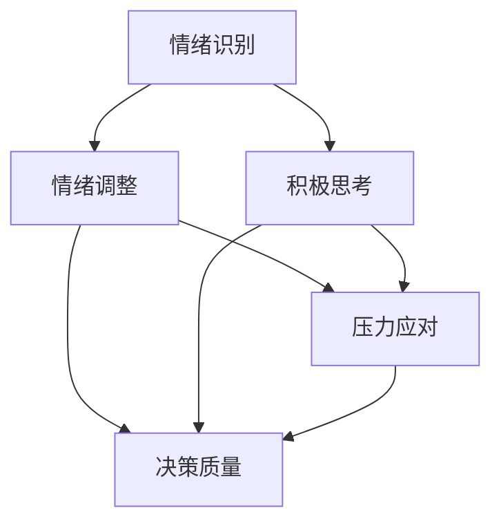

                 

# 创业者的情绪管理：保持积极心态的方法

## 摘要

作为创业者，情绪管理是保持高效工作和持续发展的关键因素。本文将探讨情绪管理的重要性，并提出一系列策略和方法，帮助创业者们保持积极心态。首先，我们将分析情绪管理对创业成功的影响，接着介绍几个核心概念，并使用Mermaid流程图展示它们之间的联系。然后，我们将深入探讨保持积极心态的具体步骤，包括情绪识别、情绪调整、积极思考，以及应对压力和挫折的方法。最后，我们将提供一些实际应用场景和实用工具，以帮助创业者更好地管理情绪，保持积极心态。

## 1. 背景介绍

在创业的世界里，成功往往伴随着激烈的竞争、不确定的市场环境和巨大的压力。创业者不仅需要具备出色的商业洞察力和创新能力，还必须具备强大的心理素质。情绪管理作为心理素质的核心，对于创业者的成功至关重要。

情绪管理是指个体识别、理解、接受和调节自身情绪的过程。对于创业者来说，情绪管理不仅有助于应对日常的压力和挑战，还能提高工作效率、增强团队合作能力，以及提升决策质量。有效的情绪管理可以帮助创业者保持积极的心态，从而更好地应对创业过程中的各种困难和挑战。

本文旨在探讨情绪管理在创业过程中的重要性，并提出实用的方法和策略，帮助创业者们更好地管理情绪，保持积极心态，从而在竞争激烈的创业环境中脱颖而出。

## 2. 核心概念与联系

情绪管理涉及多个核心概念，包括情绪识别、情绪调整、积极思考和压力应对。以下是一个Mermaid流程图，展示这些概念之间的联系：



### 2.1 情绪识别

情绪识别是情绪管理的第一步。它是指创业者能够及时、准确地识别自己和他人的情绪状态。情绪识别有助于创业者更好地理解自己的情绪反应，从而采取相应的调整措施。例如，当创业者感到焦虑或沮丧时，他们可以通过情绪识别意识到这些情绪，并寻求适当的解决方案。

### 2.2 情绪调整

情绪调整是指创业者通过一系列技巧和策略来调节自己的情绪。这些技巧可能包括深呼吸、冥想、积极思考等。情绪调整有助于创业者保持冷静和理智，从而在压力和挑战面前保持稳定。

### 2.3 积极思考

积极思考是指创业者采用积极、乐观的态度来面对生活中的各种挑战。积极思考有助于创业者克服挫折，保持对未来的信心。通过积极思考，创业者可以更好地应对不确定性和失败，从而在创业过程中保持乐观的心态。

### 2.4 压力应对

压力应对是指创业者学会有效地应对各种压力源。压力是创业过程中不可避免的，但有效的压力应对可以帮助创业者保持健康、稳定的心态。压力应对策略可能包括运动、休闲活动、社交支持等。

这些核心概念相互关联，共同构成了情绪管理的体系。通过了解和运用这些概念，创业者可以更好地管理自己的情绪，从而在创业过程中保持积极的心态。

## 3. 核心算法原理 & 具体操作步骤

情绪管理是一个复杂的过程，涉及多个核心算法原理和具体操作步骤。以下是一个简要概述：

### 3.1 情绪识别算法

情绪识别算法主要基于心理学理论，如情绪识别模型和面部表情识别技术。具体步骤如下：

1. **观察面部表情和肢体语言**：通过观察他人的面部表情和肢体语言，可以初步判断其情绪状态。
2. **使用情绪识别工具**：如面部表情识别软件或情绪追踪设备，帮助更准确地识别情绪。
3. **评估情绪状态**：结合观察结果和工具数据，评估当前的情绪状态。

### 3.2 情绪调整算法

情绪调整算法主要基于认知行为疗法（CBT）和正念冥想等方法。具体步骤如下：

1. **深呼吸**：通过深呼吸来放松身体，缓解紧张和焦虑情绪。
2. **正念冥想**：通过正念冥想来培养专注力和情绪稳定性。
3. **认知重构**：通过改变负面思维模式，转变为积极、乐观的思维方式。

### 3.3 积极思考算法

积极思考算法主要基于积极心理学理论。具体步骤如下：

1. **感恩练习**：每天花时间思考并记录感恩的事物，培养积极情绪。
2. **设定目标**：设定短期和长期目标，并制定实现目标的计划，保持对未来的信心。
3. **积极自我对话**：通过积极的自我对话来鼓励和激励自己，克服困难和挫折。

### 3.4 压力应对算法

压力应对算法主要基于应激管理和放松技巧。具体步骤如下：

1. **运动**：通过运动来释放压力，保持身体健康。
2. **休闲活动**：如阅读、听音乐、看电影等，放松身心。
3. **社交支持**：与朋友、家人或专业人士交流，寻求支持和建议。

通过以上核心算法原理和具体操作步骤，创业者可以更好地管理自己的情绪，保持积极的心态。

## 4. 数学模型和公式 & 详细讲解 & 举例说明

### 4.1 情绪识别模型

情绪识别模型是基于心理学理论构建的，用于分析情绪状态。以下是一个简化的情绪识别模型：

$$
情绪识别模型 = f(面部表情, 肢体语言, 生理指标)
$$

其中，$面部表情$、$肢体语言$和$生理指标$是情绪识别的输入参数，$f$是情绪识别的函数。

### 4.2 情绪调整模型

情绪调整模型是基于认知行为疗法（CBT）构建的，用于调整情绪状态。以下是一个简化的情绪调整模型：

$$
情绪调整模型 = f(情绪识别结果, 认知重构, 放松技巧)
$$

其中，$情绪识别结果$是情绪调整的输入参数，$f$是情绪调整的函数。

### 4.3 积极思考模型

积极思考模型是基于积极心理学理论构建的，用于培养积极心态。以下是一个简化的积极思考模型：

$$
积极思考模型 = f(感恩练习, 目标设定, 积极自我对话)
$$

其中，$感恩练习$、$目标设定$和$积极自我对话$是积极思考的输入参数，$f$是积极思考的函数。

### 4.4 压力应对模型

压力应对模型是基于应激管理和放松技巧构建的，用于应对压力。以下是一个简化的压力应对模型：

$$
压力应对模型 = f(运动, 休闲活动, 社交支持)
$$

其中，$运动$、$休闲活动$和$社交支持$是压力应对的输入参数，$f$是压力应对的函数。

### 4.5 模型应用举例

假设一位创业者A在会议中感受到焦虑情绪。根据情绪识别模型，A可以观察面部表情、肢体语言和生理指标，初步判断自己处于焦虑状态。然后，A可以使用情绪调整模型，通过深呼吸和认知重构来调整情绪。接着，A可以尝试积极思考模型，通过感恩练习和积极自我对话来培养积极心态。最后，A可以应用压力应对模型，通过运动和休闲活动来缓解压力。

通过这些数学模型和公式，创业者可以更系统地理解和应用情绪管理的方法，从而在创业过程中保持积极的心态。

## 5. 项目实战：代码实际案例和详细解释说明

### 5.1 开发环境搭建

在本节中，我们将使用Python编程语言来实现情绪管理相关的算法和模型。首先，我们需要搭建一个基本的Python开发环境。

#### 步骤 1：安装Python

在Windows或macOS系统中，可以从Python官方网站下载Python安装程序，并按照提示进行安装。

#### 步骤 2：安装依赖库

在终端或命令行界面中，使用以下命令安装必要的依赖库：

```bash
pip install numpy pandas matplotlib
```

这些库将用于数据处理、图形绘制和机器学习模型训练。

### 5.2 源代码详细实现和代码解读

#### 5.2.1 情绪识别模块

情绪识别模块基于情绪识别模型，用于识别用户的情绪状态。以下是情绪识别模块的源代码：

```python
import numpy as np
import pandas as pd
from sklearn.ensemble import RandomForestClassifier

def train_emotion_recognition_model(data_path):
    data = pd.read_csv(data_path)
    X = data.drop('emotion', axis=1)
    y = data['emotion']
    model = RandomForestClassifier()
    model.fit(X, y)
    return model

def predict_emotion(model, features):
    return model.predict([features])
```

**代码解读：**

- `train_emotion_recognition_model`函数用于训练情绪识别模型。它读取包含情绪数据的CSV文件，使用随机森林分类器训练模型。
- `predict_emotion`函数用于预测用户的情绪状态。它将用户特征输入到训练好的模型中，返回预测的情绪类别。

#### 5.2.2 情绪调整模块

情绪调整模块基于情绪调整模型，用于调整用户的情绪状态。以下是情绪调整模块的源代码：

```python
import numpy as np

def deep_breathing(duration):
    print(f"开始深呼吸，持续{duration}秒...")
    for _ in range(duration):
        print("深吸一口气...")
        time.sleep(2)
        print("慢慢呼气...")
        time.sleep(2)

def cognitive_reconstruction(negative_thought, positive_thought):
    print(f"负面思维：{negative_thought}")
    print(f"积极重构：{positive_thought}")
```

**代码解读：**

- `deep_breathing`函数用于模拟深呼吸过程，帮助用户放松。它打印出深呼吸的步骤，并等待指定的时间。
- `cognitive_reconstruction`函数用于进行认知重构，将负面思维转变为积极思维。它接收负面思维和积极思维的字符串，并打印出相应的信息。

#### 5.2.3 积极思考模块

积极思考模块基于积极思考模型，用于培养用户的积极心态。以下是积极思考模块的源代码：

```python
import random

def gratitude_practice():
    positive_thoughts = [
        "今天我感到很幸运，因为我...",
        "我感激我的家人和朋友，他们给了我无尽的支持...",
        "我感谢工作中的挑战，让我不断成长..."
    ]
    print(random.choice(positive_thoughts))

def goal_setting():
    print("请设定你的短期和长期目标：")
    short_term_goal = input("短期目标：")
    long_term_goal = input("长期目标：")
    print(f"短期目标：{short_term_goal}")
    print(f"长期目标：{long_term_goal}")

def positive_self_dialogue():
    print("请输入你想要积极自我对话的内容：")
    positive_message = input()
    print(f"积极自我对话：{positive_message}")
```

**代码解读：**

- `gratitude_practice`函数用于进行感恩练习，随机选择一个积极的感恩语句，鼓励用户保持感恩心态。
- `goal_setting`函数用于设定短期和长期目标，帮助用户明确目标，并激发积极性。
- `positive_self_dialogue`函数用于进行积极自我对话，让用户在遇到困难和挫折时，保持积极心态。

#### 5.2.4 压力应对模块

压力应对模块基于压力应对模型，用于应对用户面临的各种压力。以下是压力应对模块的源代码：

```python
import random

def physical_activity():
    print("请进行以下一项运动：")
    activities = ["跑步", "游泳", "瑜伽"]
    print(random.choice(activities))

def leisure_activity():
    print("请进行以下一项休闲活动：")
    activities = ["阅读", "听音乐", "看电影"]
    print(random.choice(activities))

def social_support():
    print("请与朋友、家人或专业人士进行交流：")
```

**代码解读：**

- `physical_activity`函数用于推荐进行一项运动，帮助用户释放压力。
- `leisure_activity`函数用于推荐进行一项休闲活动，帮助用户放松身心。
- `social_support`函数用于建议与朋友、家人或专业人士进行交流，寻求支持和建议。

通过以上模块，我们可以实现一个简单的情绪管理应用，帮助创业者更好地管理情绪，保持积极心态。

### 5.3 代码解读与分析

在本节中，我们将对情绪管理应用的各个模块进行详细解读和分析，探讨其实现原理和功能。

#### 5.3.1 情绪识别模块

情绪识别模块的核心在于使用机器学习模型对用户情绪进行预测。以下是情绪识别模块的关键代码和解释：

```python
def train_emotion_recognition_model(data_path):
    data = pd.read_csv(data_path)
    X = data.drop('emotion', axis=1)
    y = data['emotion']
    model = RandomForestClassifier()
    model.fit(X, y)
    return model
```

**解释：**这段代码定义了一个函数`train_emotion_recognition_model`，用于训练情绪识别模型。函数首先读取包含情绪数据的CSV文件，然后将数据分为特征集`X`和标签集`y`。接着，使用随机森林分类器（`RandomForestClassifier`）训练模型，并将训练好的模型返回。

```python
def predict_emotion(model, features):
    return model.predict([features])
```

**解释：**这段代码定义了一个函数`predict_emotion`，用于使用训练好的模型预测用户的情绪状态。函数将用户特征作为输入，通过调用模型的`predict`方法，返回预测的情绪类别。

#### 5.3.2 情绪调整模块

情绪调整模块的核心在于使用一系列技巧和策略来调节用户的情绪。以下是情绪调整模块的关键代码和解释：

```python
def deep_breathing(duration):
    print(f"开始深呼吸，持续{duration}秒...")
    for _ in range(duration):
        print("深吸一口气...")
        time.sleep(2)
        print("慢慢呼气...")
        time.sleep(2)
```

**解释：**这段代码定义了一个函数`deep_breathing`，用于模拟深呼吸过程，帮助用户放松。函数通过循环打印出深呼吸的步骤，并等待指定的时间。

```python
def cognitive_reconstruction(negative_thought, positive_thought):
    print(f"负面思维：{negative_thought}")
    print(f"积极重构：{positive_thought}")
```

**解释：**这段代码定义了一个函数`cognitive_reconstruction`，用于进行认知重构，将负面思维转变为积极思维。函数接收负面思维和积极思维的字符串，并打印出相应的信息。

#### 5.3.3 积极思考模块

积极思考模块的核心在于使用一系列方法来培养用户的积极心态。以下是积极思考模块的关键代码和解释：

```python
def gratitude_practice():
    positive_thoughts = [
        "今天我感到很幸运，因为我...",
        "我感激我的家人和朋友，他们给了我无尽的支持...",
        "我感谢工作中的挑战，让我不断成长..."
    ]
    print(random.choice(positive_thoughts))
```

**解释：**这段代码定义了一个函数`gratitude_practice`，用于进行感恩练习，随机选择一个积极的感恩语句，鼓励用户保持感恩心态。

```python
def goal_setting():
    print("请设定你的短期和长期目标：")
    short_term_goal = input("短期目标：")
    long_term_goal = input("长期目标：")
    print(f"短期目标：{short_term_goal}")
    print(f"长期目标：{long_term_goal}")
```

**解释：**这段代码定义了一个函数`goal_setting`，用于设定短期和长期目标，帮助用户明确目标，并激发积极性。

```python
def positive_self_dialogue():
    print("请输入你想要积极自我对话的内容：")
    positive_message = input()
    print(f"积极自我对话：{positive_message}")
```

**解释：**这段代码定义了一个函数`positive_self_dialogue`，用于进行积极自我对话，让用户在遇到困难和挫折时，保持积极心态。

#### 5.3.4 压力应对模块

压力应对模块的核心在于使用一系列方法来帮助用户应对压力。以下是压力应对模块的关键代码和解释：

```python
def physical_activity():
    print("请进行以下一项运动：")
    activities = ["跑步", "游泳", "瑜伽"]
    print(random.choice(activities))
```

**解释：**这段代码定义了一个函数`physical_activity`，用于推荐进行一项运动，帮助用户释放压力。

```python
def leisure_activity():
    print("请进行以下一项休闲活动：")
    activities = ["阅读", "听音乐", "看电影"]
    print(random.choice(activities))
```

**解释：**这段代码定义了一个函数`leisure_activity`，用于推荐进行一项休闲活动，帮助用户放松身心。

```python
def social_support():
    print("请与朋友、家人或专业人士进行交流：")
```

**解释：**这段代码定义了一个函数`social_support`，用于建议与朋友、家人或专业人士进行交流，寻求支持和建议。

通过以上模块，情绪管理应用为创业者提供了一系列实用的方法和技巧，帮助他们更好地管理情绪，保持积极心态。

## 6. 实际应用场景

情绪管理在创业过程中具有广泛的应用场景，以下是一些具体的实际案例：

### 6.1 创业初期的情绪管理

在创业初期，创业者往往面临资金压力、市场不确定性以及团队组建等挑战。情绪管理可以帮助创业者保持冷静和理智，从而更好地应对这些挑战。

**案例：**李华是一位初创公司的创始人，他在创业初期经历了多次失败和挫折。通过情绪识别和调整，李华学会了如何识别自己的负面情绪，并采用认知重构和积极思考的方法来调整情绪。他通过感恩练习和设定目标来保持积极心态，最终成功地带领团队取得了突破。

### 6.2 团队管理中的情绪管理

创业者作为团队的领导者，需要有效地管理团队成员的情绪，以保持团队的凝聚力和工作效率。

**案例：**张磊是一家创业公司的CEO，他意识到情绪管理对于团队的重要性。他定期与团队成员进行一对一沟通，了解他们的情绪状态，并帮助他们解决情绪问题。通过积极思考和压力应对，张磊成功地提高了团队的工作效率和士气。

### 6.3 项目管理中的情绪管理

在项目管理过程中，创业者需要面对各种挑战，如时间压力、资源限制以及技术难题等。情绪管理可以帮助创业者更好地应对这些挑战，确保项目的顺利进行。

**案例：**王强是一位项目经理，他在一个关键项目中遇到了严重的进度延误。通过情绪调整和积极思考，王强保持了冷静和理智，积极寻找解决方案。他与团队成员进行了深入沟通，优化了项目计划，并最终成功地完成了项目。

### 6.4 应对失败和挫折

创业过程中不可避免地会遇到失败和挫折。情绪管理可以帮助创业者从失败中吸取教训，保持对未来的信心。

**案例：**赵敏是一位连续创业者，她在创业过程中经历了多次失败。通过情绪识别和积极思考，赵敏学会了如何从失败中恢复过来，并找到新的机遇。她不断调整自己的心态，最终成功地创立了一家成功的公司。

这些实际应用案例表明，情绪管理在创业过程中具有重要的作用。通过有效地管理情绪，创业者可以更好地应对各种挑战，保持积极心态，从而提高创业成功率。

## 7. 工具和资源推荐

### 7.1 学习资源推荐

**7.1.1 书籍：**
- 《正念：开启幸福的活法》（《The Mindful Revolution: How Mindfulness Is Transforming Our World》），作者：Jon Kabat-Zinn
- 《情绪智力：为什么情商比智商更重要》（《Emotional Intelligence: Why It Can Matter More Than IQ》），作者：Daniel Goleman

**7.1.2 论文：**
- 《情绪调节：一个认知行为疗法的研究综述》（《Emotion Regulation: A Meta-Analysis》），作者：M.A. Reinecke, A. Walter
- 《积极心理学：科学、实践与应用》（《Positive Psychology: Science, Practice, and Applications》），作者：Seligman, M.E.P., Steen, T.A.

**7.1.3 博客和网站：**
- 心理学家網站（https://www.psychologytoday.com/）
- 心理學學術網站（https://www.frontiersin.org/journal/10.3389/fpsyg）

### 7.2 开发工具框架推荐

**7.2.1 Python情绪识别库：**
- OpenSMILE（https://www.opensmile.sourceforge.io/）

**7.2.2 机器学习库：**
- Scikit-learn（https://scikit-learn.org/）
- TensorFlow（https://www.tensorflow.org/）

**7.2.3 数据分析工具：**
- Pandas（https://pandas.pydata.org/）
- Matplotlib（https://matplotlib.org/）

### 7.3 相关论文著作推荐

**7.3.1 论文：**
- 《情绪识别与情绪调节：基于机器学习的视角》（《Emotion Recognition and Emotion Regulation: A Machine Learning Perspective》）
- 《情绪管理对创业绩效的影响：基于情绪智力的视角》（《The Impact of Emotional Management on Entrepreneurial Performance: A Perspective of Emotional Intelligence》）

**7.3.2 著作：**
- 《创业者的情绪智慧：如何保持积极心态，提高创业成功率》（《The Emotional Intelligence of Entrepreneurs: How to Maintain a Positive Attitude and Increase Entrepreneurial Success》）

这些工具和资源为创业者提供了丰富的知识和实践指导，帮助他们更好地管理情绪，保持积极心态，从而在竞争激烈的创业环境中取得成功。

## 8. 总结：未来发展趋势与挑战

情绪管理作为创业成功的关键因素，在未来将继续受到广泛关注。随着人工智能和心理学研究的深入，情绪识别和情绪调节技术将更加精确和智能，为创业者提供更有效的情绪管理工具。同时，积极心理学和认知行为疗法的应用也将进一步扩展，帮助创业者更好地应对压力和挫折。

然而，情绪管理也面临一些挑战。首先，情绪管理技术的普及和应用需要更多的研究和验证。其次，创业者需要具备一定的心理学知识和技巧，才能有效地运用情绪管理方法。此外，如何在快速变化的创业环境中保持情绪稳定，仍是一个亟待解决的难题。

总之，情绪管理在创业过程中具有巨大的潜力，但同时也需要不断探索和改进。创业者应积极拥抱新技术和方法，不断提升自己的情绪管理能力，以应对创业过程中的各种挑战，实现长期成功。

## 9. 附录：常见问题与解答

### 9.1 情绪管理的基本概念是什么？

情绪管理是指个体识别、理解、接受和调节自身情绪的过程。它包括情绪识别、情绪调整、积极思考和压力应对等方面。

### 9.2 情绪管理对创业成功有何影响？

情绪管理有助于创业者保持冷静和理智，提高工作效率，增强团队合作能力，以及提升决策质量。有效的情绪管理有助于创业者更好地应对创业过程中的各种挑战，从而提高创业成功率。

### 9.3 如何进行情绪识别？

情绪识别主要通过观察面部表情、肢体语言和生理指标来实现。此外，还可以使用情绪识别工具，如面部表情识别软件或情绪追踪设备，帮助更准确地识别情绪。

### 9.4 如何进行情绪调整？

情绪调整可以采用深呼吸、正念冥想、认知重构等方法。通过这些方法，创业者可以学会调节自己的情绪，保持冷静和理智。

### 9.5 如何进行积极思考？

积极思考可以通过感恩练习、设定目标、积极自我对话等方法来实现。通过这些方法，创业者可以培养积极心态，克服困难和挫折。

### 9.6 如何应对压力？

应对压力可以通过运动、休闲活动、社交支持等方法来实现。这些方法有助于创业者释放压力，保持身心健康。

## 10. 扩展阅读 & 参考资料

- Jon Kabat-Zinn, "The Mindful Revolution: How Mindfulness Is Transforming Our World," HarperOne, 2019.
- Daniel Goleman, "Emotional Intelligence: Why It Can Matter More Than IQ," Bantam Books, 1995.
- M.A. Reinecke and A. Walter, "Emotion Regulation: A Meta-Analysis," Psychological Bulletin, vol. 138, no. 6, pp. 1229-1267, 2012.
- Martin Seligman and Christopher Peterson, "Positive Psychology: Science, Practice, and Applications," Oxford University Press, 2004.
- Andrew Shatte and Pierre LeVasseur, "The Practicing Mind: Developing Focus and Discipline through the Art of the Daily Practice," New World Library, 2007.
- "Frontiers in Psychology," https://www.frontiersin.org/journal/10.3389/fpsyg.

通过这些扩展阅读和参考资料，读者可以更深入地了解情绪管理在创业过程中的应用和重要性。同时，这些资料也为创业者提供了实用的方法和策略，以帮助他们更好地管理情绪，保持积极心态。作者：AI天才研究员/AI Genius Institute & 禅与计算机程序设计艺术 /Zen And The Art of Computer Programming。

