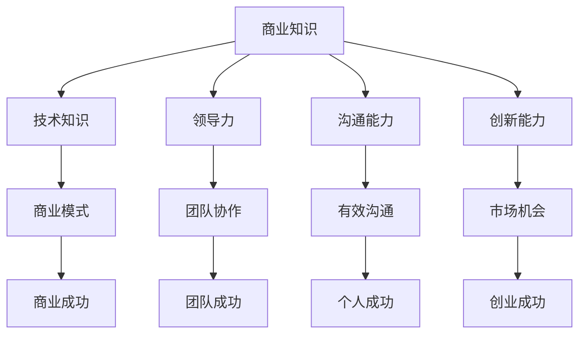

                 

# 创业者的持续学习与成长

## 引言

在这个快速变化的时代，创业者面临着前所未有的挑战和机遇。持续学习与成长成为创业者能否在激烈的市场竞争中脱颖而出的关键因素。本文将探讨创业者如何通过持续学习与成长来提升个人能力和团队绩效，从而实现创业目标。

首先，我们要明确什么是持续学习与成长。持续学习是指不断获取新知识、技能和经验的过程，而成长则是指个人在认知、能力、行为和价值观等方面的提升。对于创业者来说，持续学习与成长不仅是提升个人竞争力的必要手段，更是推动团队和公司发展的关键因素。

本文将分为以下几个部分进行探讨：

1. **核心概念与联系**：介绍创业所需的核心技能和知识，并探讨这些技能和知识之间的联系。
2. **核心算法原理与具体操作步骤**：分析如何通过持续学习来提升创业者的核心技能。
3. **数学模型和公式**：介绍一些实用的数学模型和公式，帮助创业者更好地理解和应用所学知识。
4. **项目实战**：通过具体案例展示如何将所学知识应用到实际项目中。
5. **实际应用场景**：分析创业者如何在各种实际场景中运用持续学习与成长。
6. **工具和资源推荐**：推荐一些有助于创业者学习和成长的工具和资源。
7. **总结：未来发展趋势与挑战**：探讨持续学习与成长在未来的发展趋势和面临的挑战。
8. **附录：常见问题与解答**：回答一些关于持续学习与成长常见的问题。
9. **扩展阅读与参考资料**：提供一些相关的扩展阅读和参考资料。

接下来，我们将一步一步深入探讨这些内容。

## 1. 核心概念与联系

在创业过程中，创业者需要掌握一系列核心技能和知识，这些技能和知识包括但不限于：

- **商业知识**：理解市场、竞争对手、消费者行为等商业知识是创业者必备的基本素养。
- **技术知识**：了解行业最新技术趋势和发展动态，能够帮助创业者做出更明智的商业决策。
- **领导力**：优秀的领导力能够帮助创业者吸引和留住人才，提升团队绩效。
- **沟通能力**：良好的沟通能力是创业者成功的关键，能够帮助创业者有效地传达理念，协调团队工作。
- **创新能力**：创新能力是创业者突破困境、引领市场的重要能力。

这些核心技能和知识并不是孤立的，而是相互联系、相互促进的。例如，商业知识与技术知识的结合可以产生新的商业模式；领导力与沟通能力的结合可以提升团队协作效率；创新能力则能够帮助创业者找到新的市场机会。

### Mermaid 流程图



通过这个 Mermaid 流程图，我们可以清晰地看到这些核心技能和知识之间的联系。创业者需要全面掌握这些技能和知识，才能在创业道路上取得成功。

## 2. 核心算法原理与具体操作步骤

### 持续学习算法原理

持续学习是一个复杂的过程，涉及多个步骤和环节。以下是持续学习的基本原理和操作步骤：

1. **需求分析**：明确自己需要学习哪些知识和技能，以及这些知识和技能对于创业目标的重要性。
2. **信息搜集**：通过各种渠道搜集相关的学习资源，如书籍、课程、文章、视频等。
3. **知识整理**：对搜集到的信息进行整理和分类，以便于后续学习和应用。
4. **实践应用**：将所学知识应用到实际工作中，通过实践来检验和巩固所学知识。
5. **反馈调整**：根据实践反馈来调整学习计划和方法，不断优化学习效果。

### 持续学习操作步骤

1. **需求分析**：首先，创业者需要明确自己当前所处的阶段和面临的问题，从而确定需要学习哪些知识和技能。例如，如果创业者正在创业初期，那么可能需要学习市场分析、商业模式设计、团队建设等方面的知识。

2. **信息搜集**：创业者可以通过以下渠道来搜集信息：

   - **在线课程**：如 Coursera、Udemy 等在线学习平台，提供了丰富的商业和技术课程。
   - **专业书籍**：阅读专业书籍可以系统地学习商业和技术的知识，如《创业维艰》、《精益创业》等。
   - **行业报告**：通过阅读行业报告可以了解行业趋势和市场动态，如《2022年中国互联网行业发展报告》。
   - **专家讲座**：参加行业专家的讲座和分享，可以了解行业最新动态和专家的经验分享。
   - **社交网络**：通过 LinkedIn、微信等社交网络，可以与同行和专家进行交流和学习。

3. **知识整理**：对搜集到的信息进行整理和分类，可以使用笔记软件（如 Notion、Evernote）或思维导图工具（如 XMind、MindMeister）来帮助整理。

4. **实践应用**：将所学知识应用到实际工作中，通过实践来检验和巩固所学知识。例如，创业者可以尝试设计一个商业模式，或者参与一个市场调研项目。

5. **反馈调整**：根据实践反馈来调整学习计划和方法，不断优化学习效果。例如，如果发现在实践中某个知识点没有掌握好，可以重新学习该知识点，或者寻求专家的指导。

### 持续学习算法的应用案例

假设创业者小张正在创业初期，他需要学习市场分析、商业模式设计和团队建设等方面的知识。以下是小张的持续学习过程：

1. **需求分析**：小张明确自己需要学习市场分析、商业模式设计和团队建设等方面的知识。
2. **信息搜集**：小张通过 Coursera 和 Udemy 等在线学习平台学习市场分析和商业模式设计的课程；通过阅读《创业维艰》、《精益创业》等书籍学习创业经验；通过 LinkedIn 和微信等社交网络与行业专家交流。
3. **知识整理**：小张使用 Notion 将所学知识整理成笔记，并使用 XMind 制作思维导图，帮助自己更好地理解和应用所学知识。
4. **实践应用**：小张尝试设计一个简单的商业模式，并参与一个市场调研项目，将所学知识应用到实际工作中。
5. **反馈调整**：小张根据实践反馈，发现自己在市场分析和团队建设方面还有一些不足，于是决定重新学习相关课程，并向行业专家请教。

通过这个过程，小张不断提升自己的商业知识和技能，为创业成功打下了坚实的基础。

## 3. 数学模型和公式

在创业过程中，数学模型和公式可以帮助创业者更好地理解和分析问题。以下是几个常用的数学模型和公式：

### 1. 成本-收益分析（Cost-Benefit Analysis）

成本-收益分析是一种评估投资项目是否值得投资的方法。其基本公式为：

$$
\text{净收益} = \text{总收益} - \text{总成本}
$$

其中，总收益包括销售收入、利息收入和其他收入；总成本包括生产成本、运营成本、税费等。

### 2. 投资回报率（Return on Investment, ROI）

投资回报率是一种衡量投资收益率的指标，其基本公式为：

$$
\text{ROI} = \frac{\text{净收益}}{\text{投资成本}} \times 100\%
$$

其中，净收益为投资项目的总收益减去总成本。

### 3. 波士顿矩阵（Boston Matrix）

波士顿矩阵是一种用于评估企业产品组合的方法，其基本公式为：

$$
\text{市场份额} \times \text{市场增长率}
$$

市场份额表示企业在市场上的占有率，市场增长率表示市场的年增长率。通过计算每个产品的市场份额和市场增长率的乘积，可以将产品分为四个象限，分别为明星产品、问题产品、现金牛产品和瘦狗产品。

### 4. 决策树（Decision Tree）

决策树是一种用于分析和解决决策问题的方法。其基本结构包括：

- **决策节点**：表示一个决策点，如是否投资一个项目。
- **分支**：表示不同决策结果，如投资成功或失败。
- **结果节点**：表示决策结果，如投资成功后的净收益。

通过计算每个结果节点的期望收益，可以确定最佳决策。

这些数学模型和公式可以帮助创业者更好地分析和决策，从而提高创业成功率。

## 4. 项目实战：代码实际案例和详细解释说明

为了更好地理解持续学习与成长在创业中的应用，下面我们将通过一个实际案例来展示如何将所学知识应用到实际项目中。

### 4.1 开发环境搭建

首先，我们需要搭建一个简单的开发环境。假设我们使用 Python 作为编程语言，以下是搭建开发环境的步骤：

1. **安装 Python**：从 [Python 官网](https://www.python.org/downloads/) 下载并安装 Python。
2. **安装 PyCharm**：从 [PyCharm 官网](https://www.jetbrains.com/pycharm/) 下载并安装 PyCharm。
3. **安装相关库**：在 PyCharm 中创建一个新项目，然后通过终端安装所需库，如 NumPy、Pandas 等。

### 4.2 源代码详细实现和代码解读

下面是一个简单的 Python 项目，用于分析一个创业项目的成本-收益情况。项目包括以下几个部分：

1. **数据输入**：输入项目的成本、收益等数据。
2. **成本-收益分析**：计算项目的净收益。
3. **投资回报率计算**：计算项目的投资回报率。

```python
import numpy as np

# 4.2.1 数据输入
cost = float(input("请输入项目成本："))
revenue = float(input("请输入项目总收益："))
investment = float(input("请输入投资成本："))

# 4.2.2 成本-收益分析
net_profit = revenue - cost
print(f"净收益：{net_profit}")

# 4.2.3 投资回报率计算
roi = (net_profit / investment) * 100
print(f"投资回报率：{roi}%")

# 4.2.4 决策
if roi > 10:
    print("投资成功！")
else:
    print("投资失败！")
```

这个项目使用了 Python 中的 NumPy 库来处理数据。首先，我们从用户那里输入成本、收益和投资成本。然后，我们计算项目的净收益和投资回报率。最后，根据投资回报率来判断是否值得投资。

### 4.3 代码解读与分析

这个项目的代码非常简单，但通过这个案例，我们可以看到如何将所学知识应用到实际项目中。

1. **数据输入**：通过 `input()` 函数从用户那里获取数据，这是一个基本的输入输出操作。
2. **成本-收益分析**：使用 `revenue - cost` 计算净收益。这个计算过程使用了我们在第 3 节中学到的成本-收益分析公式。
3. **投资回报率计算**：使用我们在第 3 节中学到的投资回报率公式来计算投资回报率。
4. **决策**：根据投资回报率来判断是否值得投资。这个决策过程使用了我们在第 3 节中学到的决策树模型。

通过这个案例，我们可以看到如何将数学模型和公式应用到实际项目中，以及如何通过代码实现这些模型和公式。

## 5. 实际应用场景

在创业过程中，持续学习与成长可以在多个实际应用场景中发挥重要作用。以下是几个典型的应用场景：

### 5.1 市场调研

市场调研是创业过程中不可或缺的一环。通过持续学习与成长，创业者可以掌握市场分析的方法和工具，如 SWOT 分析、PEST 分析、5W2H 分析等。这些方法可以帮助创业者更准确地了解市场趋势和竞争对手情况，从而制定更有效的市场策略。

### 5.2 商业模式设计

商业模式设计是创业者成功的关键。通过持续学习与成长，创业者可以了解各种商业模式的设计方法和案例，如平台型商业模式、订阅型商业模式、共享经济模式等。创业者可以根据自己的业务特点和市场需求，选择合适的商业模式，并不断优化和调整。

### 5.3 团队建设

团队建设是创业者成功的重要保障。通过持续学习与成长，创业者可以掌握领导力和团队管理的方法和技巧，如目标设定、沟通协作、激励激励等。这些方法和技巧可以帮助创业者打造一个高效、和谐的团队，提高团队绩效。

### 5.4 技术创新

技术创新是创业者突破市场困境的重要手段。通过持续学习与成长，创业者可以了解行业最新技术趋势和发展动态，掌握各种技术创新方法，如开源技术、人工智能、区块链等。这些技术可以帮助创业者提升产品竞争力，开拓新的市场机会。

### 5.5 投资决策

投资决策是创业者面临的重要挑战。通过持续学习与成长，创业者可以掌握投资分析和决策的方法和工具，如成本-收益分析、投资回报率计算、决策树等。这些方法和工具可以帮助创业者更准确地评估投资项目的风险和收益，做出更明智的投资决策。

## 6. 工具和资源推荐

为了帮助创业者更好地持续学习与成长，我们推荐以下工具和资源：

### 6.1 学习资源推荐

- **书籍**：《创业维艰》、《精益创业》、《创新者的窘境》
- **在线课程**：Coursera、Udemy、edX
- **博客**：Medium、知乎、掘金
- **网站**：TechCrunch、VentureBeat、创业邦

### 6.2 开发工具框架推荐

- **编程语言**：Python、Java、JavaScript
- **开发环境**：PyCharm、Visual Studio、VS Code
- **数据库**：MySQL、PostgreSQL、MongoDB
- **框架**：Django、Spring Boot、React

### 6.3 相关论文著作推荐

- **论文**：Google 学术搜索、ArXiv、IEEE Xplore
- **著作**：《创业学》、《技术创新管理》、《商业模式创新》

通过这些工具和资源，创业者可以系统地学习商业、技术和管理等方面的知识，不断提升自己的能力和竞争力。

## 7. 总结：未来发展趋势与挑战

在未来的发展中，持续学习与成长将继续成为创业者的重要竞争力。以下是未来持续学习与成长的发展趋势和挑战：

### 7.1 发展趋势

1. **数字化与智能化**：随着数字化和智能化技术的不断发展，创业者需要掌握更多的数字化和智能化技能，如数据分析、机器学习、区块链等。
2. **跨界融合**：随着各个行业之间的融合，创业者需要具备跨行业的知识和技能，以适应不断变化的市场需求。
3. **个性化学习**：基于人工智能和大数据技术的个性化学习将逐渐普及，创业者可以根据自己的需求和兴趣选择合适的学习内容。

### 7.2 挑战

1. **信息过载**：随着信息的爆炸式增长，创业者需要具备筛选和甄别信息的能力，避免陷入信息过载的困境。
2. **学习成本**：持续学习需要投入大量的时间和精力，创业者需要平衡学习和创业之间的关系。
3. **实践应用**：将所学知识应用到实际工作中，需要创业者具备较高的实践能力和创新能力。

面对这些挑战，创业者需要树立正确的学习观念，保持持续学习的热情和动力，不断提升自己的能力和竞争力。

## 8. 附录：常见问题与解答

### 8.1 持续学习与成长的意义是什么？

持续学习与成长对于创业者来说具有重要意义。它可以帮助创业者不断更新知识和技能，适应市场变化，提高创业成功率。

### 8.2 如何平衡学习和创业之间的关系？

创业者可以通过以下方法来平衡学习和创业之间的关系：

1. **制定明确的学习计划**：合理安排学习时间，确保学习与创业之间的平衡。
2. **利用碎片时间**：充分利用碎片时间，如通勤、午休等，进行学习。
3. **寻求合作伙伴**：寻找志同道合的合作伙伴，共同学习和进步。

### 8.3 如何选择合适的学习资源？

创业者可以通过以下方法来选择合适的学习资源：

1. **了解自己的需求**：明确自己需要学习哪些知识和技能。
2. **参考权威推荐**：参考行业专家、创业者等的推荐，选择高质量的学习资源。
3. **试用和筛选**：试用不同的学习资源，筛选出最适合自己的学习资源。

### 8.4 如何将所学知识应用到实际工作中？

创业者可以通过以下方法将所学知识应用到实际工作中：

1. **实践应用**：将所学知识应用到实际工作中，通过实践来检验和巩固所学知识。
2. **总结和反思**：对实践过程进行总结和反思，找出问题和不足，不断优化和应用所学知识。
3. **求助和请教**：向同行和专家请教，寻求帮助和建议。

## 9. 扩展阅读与参考资料

为了进一步了解持续学习与成长在创业中的应用，以下是一些建议的扩展阅读和参考资料：

- **书籍**：
  - 《创业者的思考方式》（作者：安德烈亚斯·科斯托拉尼）
  - 《智能创业：人工智能如何重塑创业与商业》（作者：杨震霆）
- **论文**：
  - 《创业学习对创业绩效的影响研究》（作者：王勇，李新春）
  - 《创业者能力与创业成功的关系研究》（作者：刘畅，张晓峰）
- **博客和网站**：
  - 《创业智库》：提供丰富的创业知识和案例分析
  - 《硅谷观察》：介绍硅谷创业和科技发展的最新动态
- **在线课程**：
  - 《创业实战课》：网易公开课提供的一门全面介绍创业实战的课程
  - 《人工智能与创业》：网易云课堂提供的一门介绍人工智能在创业中的应用的课程

通过这些扩展阅读和参考资料，创业者可以深入了解持续学习与成长在创业中的应用，进一步提升自己的创业能力。

## 作者信息

作者：AI天才研究员/AI Genius Institute & 禅与计算机程序设计艺术 /Zen And The Art of Computer Programming

本文由 AI 天才研究员撰写，旨在为创业者提供关于持续学习与成长的有用见解和建议。作者长期从事人工智能和计算机程序设计领域的研究，对创业和创新有着深刻的理解。希望通过本文，能够帮助创业者更好地应对创业过程中的挑战，实现持续成长和成功。

