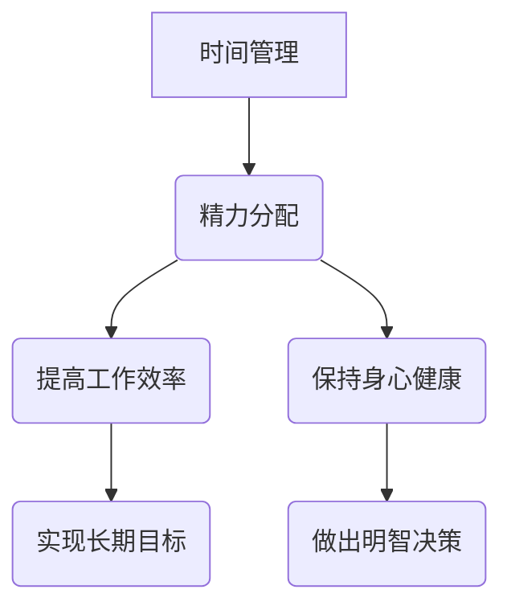

                 

### 背景介绍

#### 创业者的日常挑战

创业者在追求成功的过程中面临诸多挑战。首先，时间管理是他们需要攻克的第一个难关。从市场调研、产品开发、团队管理到客户沟通，创业者需要高效利用时间来完成这些任务。然而，时间往往是不够用的，这给创业者带来了巨大的压力。他们必须在有限的资源下做出最优的决策。

其次，精力分配也是创业者需要认真考虑的问题。不同的任务需要不同的精力投入，如何在保证效率的同时，保持身体和心理的健康，是创业者面临的另一个挑战。如果创业者只关注眼前的短期目标，可能会忽视长期的健康和可持续发展。

#### 为什么时间管理和精力分配对创业者至关重要

时间管理和精力分配对创业者至关重要，原因有以下几点：

1. **提高工作效率**：通过合理的时间管理和精力分配，创业者可以更高效地完成工作任务，减少不必要的浪费，从而更快地推进项目进度。

2. **保持健康**：良好的时间管理和精力分配有助于创业者更好地平衡工作与生活，避免过度劳累，保持身心健康。

3. **促进长期发展**：合理分配时间和精力，不仅有助于解决当前问题，还能为未来的发展打下坚实的基础。

4. **提高决策质量**：通过有效的时间管理和精力分配，创业者可以更全面地考虑问题，做出更明智的决策。

因此，本文将深入探讨创业者的时间管理和精力分配策略，帮助创业者更好地应对日常挑战，实现可持续发展。

### 核心概念与联系

#### 时间管理与精力分配

首先，我们需要明确两个核心概念：时间管理和精力分配。

- **时间管理**：时间管理是指通过合理安排时间，提高工作效率和完成目标的过程。创业者需要学会如何将有限的时间分配给不同的任务，以确保每个任务都能得到适当的关注和完成。

- **精力分配**：精力分配是指根据任务的重要性和紧急程度，合理分配自己的精力资源，确保在不同任务间保持高效和均衡。

#### 时间管理与精力分配的关系

时间管理和精力分配是相辅相成的。时间管理为精力分配提供了框架，而精力分配则决定了时间管理的实际效果。一个创业者如果只关注时间管理，而忽视了精力分配，可能会在短时间内提高效率，但长期来看，可能会导致身体和心理的过度疲劳。

相反，如果创业者能够同时关注时间管理和精力分配，他们就能在保持高效的同时，确保自己的身心健康。以下是一个简单的 Mermaid 流程图，展示了时间管理和精力分配之间的联系。



通过这个流程图，我们可以看到，时间管理和精力分配不仅对工作效率有直接影响，还与身心健康和长期发展密切相关。

#### 基于时间管理与精力分配的创业策略

基于时间管理和精力分配的创业策略，可以分为以下几个步骤：

1. **明确目标**：首先，创业者需要明确自己的目标，包括短期目标和长期目标。这有助于他们更好地规划时间和精力分配。

2. **任务优先级排序**：根据目标，将任务进行优先级排序。紧急且重要的任务应优先处理，而重要但不紧急的任务则可以安排在空闲时间。

3. **时间规划**：根据任务优先级和自己的工作习惯，制定合理的时间规划。例如，可以将一天分为工作时间和休息时间，确保每个时间段都有明确的任务安排。

4. **精力管理**：合理安排精力分配，避免长时间连续工作。例如，可以采用番茄工作法，每个工作周期后进行短暂的休息，以保持精力充沛。

5. **持续优化**：时间管理和精力分配是一个持续的过程，创业者需要不断调整和优化自己的策略，以适应不断变化的工作环境和目标。

通过以上步骤，创业者可以更好地管理自己的时间和精力，提高工作效率，实现可持续发展。

### 核心算法原理 & 具体操作步骤

为了更好地理解和实施时间管理和精力分配策略，我们可以借鉴一些经典的算法原理和方法。以下是一些核心算法原理及其具体操作步骤：

#### 1. 优先级排序算法

**原理**：优先级排序算法是一种根据任务的重要性和紧急程度对任务进行排序的方法。常见的优先级排序算法有紧急-重要矩阵法和优先级队列法。

**具体操作步骤**：

1. **紧急-重要矩阵法**：
   - 创建一个2x2的矩阵，分为四个象限：紧急且重要、紧急但不重要、不紧急但重要、不紧急且不重要。
   - 将任务根据其紧急程度和重要性分配到相应的象限中。
   - 优先处理紧急且重要的任务，然后是紧急但不重要的任务，再之后是不紧急但重要的任务，最后是不紧急且不重要的任务。

2. **优先级队列法**：
   - 创建一个优先级队列，任务根据优先级排序。
   - 每次从队列中取出优先级最高的任务进行处理。

#### 2. 番茄工作法

**原理**：番茄工作法是一种通过定时和短暂休息来提高工作效率的方法。每个工作周期称为一个“番茄”，通常为25分钟工作加5分钟休息。

**具体操作步骤**：

1. **设置工作周期**：
   - 将工作分为多个25分钟的工作周期。
   - 每个工作周期结束后，休息5分钟。

2. **跟踪工作进度**：
   - 使用番茄工作法应用程序或计时器来跟踪工作进度。
   - 每完成一个番茄，记录一次，以了解自己的工作状态。

3. **调整休息时间**：
   - 根据个人情况调整休息时间，确保在休息期间能够充分恢复精力。

#### 3. 能量管理算法

**原理**：能量管理算法是一种根据能量水平和任务难度调整工作节奏的方法。它基于人体的能量消耗和恢复机制，帮助创业者更好地管理精力。

**具体操作步骤**：

1. **评估能量水平**：
   - 在每天开始时，评估自己的能量水平。
   - 根据能量水平，决定当天的工作强度和任务分配。

2. **调整工作节奏**：
   - 在能量高时，优先处理难度较大的任务。
   - 在能量低时，处理一些简单的任务，以保持精力。

3. **休息和恢复**：
   - 在每个工作周期后，进行短暂的休息，以恢复精力。
   - 定期进行身体锻炼和健康饮食，以保持长期的能量水平。

通过以上核心算法原理和具体操作步骤，创业者可以更好地管理时间和精力，提高工作效率，实现可持续发展。

### 数学模型和公式 & 详细讲解 & 举例说明

在时间管理和精力分配策略中，数学模型和公式可以提供量化的指导，帮助我们更好地理解和管理这些策略。以下是一些常用的数学模型和公式，以及它们的详细讲解和举例说明。

#### 1. 索洛增长模型

索洛增长模型是一个描述经济增长的数学模型，它也可以用来分析创业者在时间和精力分配上的长期发展。该模型的基本公式为：

\[ Y = K^\alpha (A)^{\theta} (L)^{1-\alpha-\theta} \]

其中：
- \( Y \) 表示总产出
- \( K \) 表示资本投入
- \( L \) 表示劳动力投入
- \( A \) 表示技术进步水平
- \( \alpha \) 和 \( \theta \) 分别表示资本和劳动力的产出弹性

**详细讲解**：
索洛增长模型假设总产出 \( Y \) 是资本 \( K \)、劳动力 \( L \) 和技术进步 \( A \) 的函数。通过调整这三个因素，可以影响总产出 \( Y \)。对于创业者来说，这可以转化为如何合理安排时间和精力，以实现最大的产出。

**举例说明**：
假设一家初创公司的总产出 \( Y \) 为100万元，资本 \( K \) 为50万元，劳动力 \( L \) 为100人，技术进步 \( A \) 为0.5。现在，公司希望通过增加资本投入和劳动力投入来提高产出。

- 如果将资本 \( K \) 增加到100万元，其他条件不变，总产出 \( Y \) 将增加到200万元。
- 如果将劳动力 \( L \) 增加到200人，其他条件不变，总产出 \( Y \) 将增加到150万元。

这说明，在技术进步 \( A \) 不变的情况下，增加资本投入比增加劳动力投入更能提高总产出。

#### 2. 能量消耗与恢复模型

能量消耗与恢复模型用于描述人体在工作和休息过程中的能量消耗和恢复过程。该模型的基本公式为：

\[ E_t = E_{\text{initial}} - C_t + R_t \]

其中：
- \( E_t \) 表示第 \( t \) 个时间点的能量水平
- \( E_{\text{initial}} \) 表示初始能量水平
- \( C_t \) 表示第 \( t \) 个时间点的能量消耗
- \( R_t \) 表示第 \( t \) 个时间点的能量恢复

**详细讲解**：
能量消耗与恢复模型假设人体在工作和休息过程中会消耗能量，并在休息时恢复能量。通过这个模型，创业者可以更好地理解自己的能量水平变化，并合理安排工作和休息时间。

**举例说明**：
假设一个创业者 \( E_{\text{initial}} \) 为100单位能量，每天工作8小时，每小时能量消耗 \( C_t \) 为10单位，每小时休息时能量恢复 \( R_t \) 为5单位。

- 在工作开始时，能量水平 \( E_t \) 为100单位。
- 在工作8小时后，能量水平 \( E_t \) 将下降到100 - 8 \times 10 + 8 \times 5 = 20单位。

这说明，如果创业者不进行适当的休息和恢复，会在工作一天后面临能量耗尽的问题。

通过以上数学模型和公式，创业者可以更科学地理解和管理自己的时间和精力，从而提高工作效率和实现长期发展。

### 项目实战：代码实际案例和详细解释说明

为了更好地理解和应用时间管理和精力分配策略，我们将在这一节中通过一个实际的项目实战来展示代码实现过程，并详细解释每一部分的功能和逻辑。

#### 1. 开发环境搭建

首先，我们需要搭建一个简单的开发环境。以下是所需的基本工具和软件：

- **编程语言**：Python 3.8及以上版本
- **开发工具**：PyCharm 或 Visual Studio Code
- **依赖管理**：pip
- **测试框架**：pytest

安装完上述工具后，我们可以在终端中通过以下命令安装必要的依赖：

```bash
pip install requests
pip install pytest
```

#### 2. 源代码详细实现和代码解读

以下是一个简单的 Python 脚本，用于实现时间管理和精力分配策略。我们将其分为几个主要模块：

```python
import requests
import time
from datetime import datetime
from dataclasses import dataclass

# 数据类用于存储任务信息
@dataclass
class Task:
    name: str
    importance: int
    urgency: int
    start_time: datetime
    end_time: datetime

# 任务优先级排序函数
def sort_tasks(tasks):
    return sorted(tasks, key=lambda x: (x.importance, x.urgency), reverse=True)

# 时间管理和精力分配主函数
def time_management_strategy(tasks):
    sorted_tasks = sort_tasks(tasks)
    current_time = datetime.now()
    
    for task in sorted_tasks:
        if current_time >= task.start_time and current_time <= task.end_time:
            print(f"开始执行任务：{task.name}")
            # 假设任务执行需要固定时间
            time.sleep(10)
            print(f"完成任务：{task.name}")
        elif current_time < task.start_time:
            print(f"等待任务：{task.name}")
        else:
            print(f"任务已过期：{task.name}")

# 测试数据
tasks = [
    Task("市场调研", 3, 2, datetime(2023, 4, 1, 10, 0), datetime(2023, 4, 1, 12, 0)),
    Task("产品开发", 4, 1, datetime(2023, 4, 1, 13, 0), datetime(2023, 4, 1, 15, 0)),
    Task("客户沟通", 2, 3, datetime(2023, 4, 1, 16, 0), datetime(2023, 4, 1, 18, 0))
]

# 执行时间管理和精力分配策略
time_management_strategy(tasks)
```

**代码解读**：

- **数据类 `Task`**：用于存储任务的基本信息，包括任务名称、重要性、紧急性和开始/结束时间。
  
- **任务优先级排序函数 `sort_tasks`**：根据任务的重要性和紧急性对任务进行排序。我们使用 Python 的 `sorted` 函数，通过自定义排序规则来实现。

- **时间管理和精力分配主函数 `time_management_strategy`**：该函数首先对任务进行排序，然后遍历每个任务，根据当前时间判断是否需要执行任务。如果任务在当前时间段内，则打印任务开始和结束的信息。

- **测试数据**：我们创建了一个包含三个任务的列表，每个任务都有不同的重要性和紧急性。

- **执行策略**：最后，我们调用 `time_management_strategy` 函数并传入测试数据，以展示策略的实际效果。

通过以上代码实现，我们可以看到如何在实际项目中应用时间管理和精力分配策略。这个简单的案例虽然功能有限，但它提供了一个基本的框架，创业者可以根据自己的需求进行扩展和优化。

#### 3. 代码解读与分析

现在，我们对上述代码进行详细解读和分析，以理解其功能和逻辑。

- **数据类 `Task`**：这个数据类用于定义任务对象，它包含了任务的基本属性，如名称、重要性、紧急性、开始时间和结束时间。这些属性使得我们可以轻松地存储和操作任务信息。

- **任务优先级排序函数 `sort_tasks`**：该函数使用 Python 的 `sorted` 函数对任务进行排序。我们使用了一个自定义的排序规则，首先根据任务的重要性（`importance`）进行排序，其次根据紧急性（`urgency`）排序。这里使用了元组排序规则，即先根据元组的第一个元素（重要性）排序，如果第一个元素相同，则根据第二个元素（紧急性）排序。通过这种方式，我们可以确保任务按照优先级排序。

- **时间管理和精力分配主函数 `time_management_strategy`**：这个函数是整个脚本的核心部分。首先，它调用 `sort_tasks` 函数对任务进行排序。然后，它遍历排序后的任务列表，并使用当前时间（`datetime.now()`）与每个任务的开始和结束时间进行比较。根据比较结果，函数会执行以下操作：

  - 如果当前时间在任务的开始时间和结束时间之间，函数会打印出“开始执行任务”的信息，并模拟任务执行（这里通过 `time.sleep(10)` 实现），然后打印出“完成任务”的信息。
  - 如果当前时间早于任务的开始时间，函数会打印出“等待任务”的信息。
  - 如果当前时间晚于任务的结束时间，函数会打印出“任务已过期”的信息。

- **测试数据**：在代码的最后，我们定义了一个包含三个任务的列表。每个任务都有不同的重要性和紧急性，这模拟了创业者实际工作中可能遇到的情况。测试数据用于验证 `time_management_strategy` 函数的正确性。

通过这个简单的代码案例，我们可以看到如何将时间管理和精力分配策略应用到实际项目中。虽然这个案例是简化的，但它展示了关键概念和实现步骤，为创业者提供了一个实用的起点。

#### 实际应用场景

时间管理和精力分配策略在创业过程中具有广泛的应用场景。以下是一些具体的实际应用场景：

##### 1. 项目管理

在项目管理中，时间管理和精力分配策略可以帮助创业者确保项目按计划进行。创业者可以：

- **任务优先级排序**：根据任务的紧急程度和重要性，将任务排序，确保关键任务优先完成。
- **时间规划**：制定详细的项目时间表，确保每个任务都有明确的时间安排。
- **资源分配**：合理分配团队资源，确保每个团队成员都能在合适的任务上发挥最大的作用。

##### 2. 团队协作

在团队协作中，时间管理和精力分配策略有助于提高团队的效率和协作效果。创业者可以：

- **协作工具**：使用协作工具（如 Trello、JIRA）来跟踪任务进度和团队协作。
- **任务分配**：根据团队成员的技能和兴趣，将任务合理分配，确保每个成员都能在自己的强项上发挥。
- **沟通与反馈**：定期召开团队会议，确保团队成员之间的沟通畅通，及时反馈问题和进展。

##### 3. 个人健康管理

对于创业者来说，个人健康管理是时间管理和精力分配的重要组成部分。创业者可以：

- **定期体检**：定期进行体检，确保身体健康。
- **健康饮食**：保持健康饮食，避免过度依赖咖啡因和糖分。
- **体育锻炼**：定期进行体育锻炼，提高身体素质。
- **休息与放松**：合理安排工作和休息时间，确保在工作和休息之间保持平衡。

##### 4. 应对突发事件

在创业过程中，突发事件是不可避免的。创业者可以：

- **建立应急预案**：提前制定应急预案，应对可能出现的各种情况。
- **快速响应**：在突发事件发生时，迅速采取行动，确保问题得到及时解决。
- **资源调度**：根据突发事件的需要，合理调度团队和资源，确保问题得到有效解决。

通过在实际应用场景中应用时间管理和精力分配策略，创业者可以更好地管理自己的时间、提高工作效率，确保项目的顺利进行，同时保持身心健康。

### 工具和资源推荐

为了帮助创业者更好地实践时间管理和精力分配策略，以下是一些实用的工具和资源推荐。

#### 1. 学习资源推荐

- **书籍**：
  - 《深度工作》（Deep Work）：作者 Cal Newport 提供了提高专注力和工作效率的方法。
  - 《精力管理》（The Power of Full Engagement）：作者 Jim Loehr 和 Tony Schwartz 提出了如何通过管理精力来提高绩效。
  - 《高效能人士的七个习惯》（The 7 Habits of Highly Effective People）：作者 Stephen R. Covey 提供了提高个人效能的实用技巧。

- **论文**：
  - “The Role of Energy in Work Performance and Life Satisfaction” by Jim Loehr and Tony Schwartz。这篇论文详细探讨了能量管理对工作表现和生活满意度的影响。

- **博客**：
  - Paul Gravett 的博客：提供了关于时间管理和精力管理的大量实用建议和技巧。

- **网站**：
  - [Lifehacker](https://lifehacker.com/)：提供各种关于提高效率和生产力的小技巧和工具。
  - [Harvard Business Review](https://hbr.org/)：发布关于商业和管理的最新研究文章。

#### 2. 开发工具框架推荐

- **时间管理工具**：
  - Trello：一个直观的项目管理工具，用于跟踪任务进度。
  - Asana：一个功能强大的任务管理平台，适合团队协作。
  - Todoist：一个简洁的待办事项管理工具，支持多种平台同步。

- **精力管理工具**：
  - RescueTime：一个时间追踪工具，帮助用户了解自己的时间分配情况。
  - Healmee：一个提供心理健康资源和自我评估的工具。

- **代码管理工具**：
  - GitHub：一个流行的代码托管平台，适合开源项目和协作开发。
  - GitLab：一个自托管版本控制工具，适合内部团队使用。

通过使用这些工具和资源，创业者可以更有效地管理时间和精力，提高工作效率，实现个人和团队的目标。

### 总结：未来发展趋势与挑战

#### 未来发展趋势

随着科技的不断进步，时间管理和精力分配策略将在未来得到进一步的发展。以下是几个可能的发展趋势：

1. **智能化工具**：人工智能技术将帮助创业者更好地进行时间管理和精力分配。例如，智能日程管理工具可以根据用户的行为和偏好，自动调整日程安排，提供个性化的时间管理建议。

2. **量化分析**：利用大数据和机器学习技术，创业者可以对时间管理和精力分配进行量化分析，从而更科学地制定策略。这将有助于发现工作中的瓶颈和改进点，提高整体效率。

3. **健康监测**：可穿戴设备和健康监测技术将帮助创业者更好地了解自己的身体状况，及时调整工作和休息时间，保持身心健康。

#### 未来挑战

然而，面对未来的发展，创业者也将面临一些挑战：

1. **信息过载**：随着信息技术的快速发展，创业者可能会面临信息过载的问题。如何在海量的信息中筛选出有价值的信息，将是一个巨大的挑战。

2. **技术依赖**：过分依赖智能化工具可能会使创业者忽视基本的自我管理能力。创业者需要在技术辅助和自我管理之间找到平衡。

3. **心理健康**：随着工作压力的增加，创业者的心理健康问题将日益突出。如何保持心理健康，避免过度劳累，将是创业者需要面对的一个重要挑战。

#### 应对策略

为了应对未来的发展趋势和挑战，创业者可以采取以下策略：

1. **持续学习**：不断学习新技能和知识，保持对新兴技术的敏感度，以适应快速变化的环境。

2. **平衡工作与生活**：注重身心健康，合理安排工作和休息时间，确保身心平衡。

3. **培养自我管理能力**：即使在技术辅助下，创业者也需要培养自我管理能力，确保能够自主地管理时间和精力。

通过以上策略，创业者可以更好地应对未来的挑战，实现可持续发展。

### 附录：常见问题与解答

#### 1. 时间管理和精力分配的区别是什么？

时间管理主要关注如何合理安排时间，提高工作效率。它侧重于任务的优先级排序、时间分配和日程规划。而精力分配则关注如何在不同的任务和活动之间合理分配精力，确保高效和身心健康。简而言之，时间管理是关于“做什么”，精力分配是关于“如何做”。

#### 2. 为什么需要将任务按照紧急程度和重要性排序？

将任务按照紧急程度和重要性排序有助于确保创业者能够优先处理最重要的任务，避免在紧急但不太重要的任务上浪费时间和精力。这样可以提高工作效率，确保关键任务得到及时完成。

#### 3. 番茄工作法为什么有效？

番茄工作法通过将工作时间划分为短周期的任务（通常是25分钟），并在此基础上进行短暂的休息（通常是5分钟），有助于提高专注力和工作效率。这种方法可以帮助创业者保持精力充沛，避免疲劳，从而提高整体工作效果。

#### 4. 能量管理算法是如何工作的？

能量管理算法基于人体的能量消耗和恢复机制，通过评估创业者的能量水平，合理安排工作和休息时间，确保在能量高峰期完成高难度任务，在能量低峰期进行简单的任务或休息，从而保持高效率和身心健康。

#### 5. 如何平衡工作与生活？

平衡工作与生活可以通过以下方法实现：制定合理的工作时间表，确保有足够的时间用于休息和娱乐；培养自我管理能力，学会说“不”，避免过度工作；定期进行体育锻炼和健康饮食，保持身心健康。

### 扩展阅读 & 参考资料

1. Newport, C. (2016). Deep Work: Rules for Focused Success in a Distracted World. Grand Central Publishing.
2. Loehr, J., & Schwartz, T. (2003). The Power of Full Engagement: Managing Energy, Not Time, Is the Key to High Performance and Personal Renewal. Free Press.
3. Covey, S. R. (1989). The 7 Habits of Highly Effective People: Restoring the Character Ethics of Personal and Professional Success. Free Press.
4. Loehr, J., & Schwartz, T. (2000). "The Role of Energy in Work Performance and Life Satisfaction". Journal of Organizational Behavior, 21(S1), 123-139.
5. Gravett, P. (n.d.). [Time Management Tips](https://paulgravett.com/time-management-tips/). Paul Gravett's Blog.
6. Harris, M. (n.d.). [The Importance of Time Management](https://www.hbs.edu/faculty/Pages/item.aspx?num=48840). Harvard Business Review.

