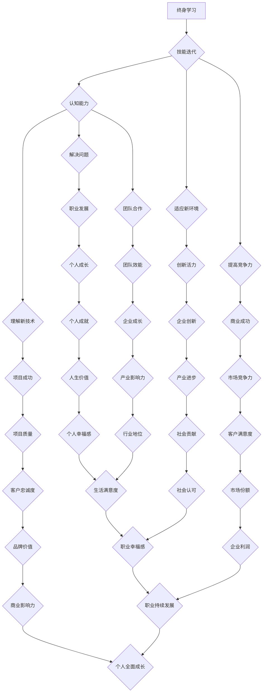
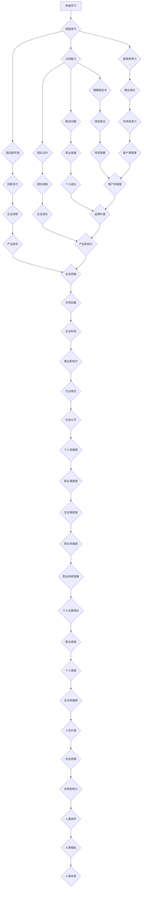

                 

### 背景介绍 Background Introduction

在当今这个快速发展的数字化时代，创业者的成功与否越来越依赖于他们的终身学习能力和技能迭代速度。终身学习已经成为创业者和专业人士必备的能力，它不仅关乎个人的职业发展，更影响着整个团队和企业的创新活力与竞争力。本文将深入探讨创业者的终身学习与技能迭代，分析其核心概念、算法原理、数学模型、实际应用场景，以及相关的工具和资源推荐，并总结未来发展趋势与挑战。

首先，我们需要理解几个核心概念，这些概念构成了我们讨论的基础：

1. **终身学习（Lifelong Learning）**：它指的是个人在一生中持续地获取知识、技能和态度，以适应不断变化的环境和职业需求。
2. **技能迭代（Skill Iteration）**：是指个人或团队通过不断学习和实践，持续提高技能水平和适应新技术的过程。
3. **认知能力（Cognitive Ability）**：包括学习、理解、分析和解决问题的能力，这些能力是终身学习和技能迭代的重要基础。

接下来，我们将使用Mermaid流程图来展示这些核心概念之间的联系，以及它们在创业者和职业生涯中的应用。



通过这个流程图，我们可以看到终身学习、技能迭代和认知能力是如何相互作用，并推动创业者的职业生涯和企业发展的。在接下来的章节中，我们将深入探讨这些核心概念和原理，并通过实际案例和数学模型来加深理解。接下来，让我们一步一步地分析这些概念，并理解它们在创业者和职业生涯中的具体应用。

---

## 2. 核心概念与联系 Core Concepts and Connections

在探讨创业者的终身学习与技能迭代之前，我们首先需要了解这些核心概念的定义、原理和它们之间的关系。以下是对终身学习、技能迭代和认知能力这三个核心概念的详细解释，以及它们在创业者职业生涯中的具体应用。

### 2.1 终身学习（Lifelong Learning）

终身学习是指个人在一生中持续地获取知识、技能和态度，以适应不断变化的环境和职业需求。它不仅仅是为了应对工作需求，更是一种生活方式和态度。在技术迅速发展的今天，知识的更新速度非常快，创业者需要不断学习新的技术和行业知识，以保持竞争力。

**原理：** 终身学习的原理在于持续性的知识积累和技能提升。通过不断学习，创业者可以：

- **适应变化：** 随着市场和技术环境的变化，创业者需要不断调整自己的策略和技能。
- **创新思维：** 学习新的知识可以激发创业者的创新思维，帮助他们找到新的商业模式和市场机会。
- **竞争力提升：** 持续学习可以让创业者保持领先地位，提升个人和企业的竞争力。

**在职业生涯中的应用：** 对于创业者而言，终身学习是成功的基石。以下是终身学习在职业生涯中的几个具体应用：

- **团队建设：** 通过学习，创业者可以提高自己的管理能力，建立更加高效的团队。
- **产品开发：** 学习新的技术和市场趋势，可以帮助创业者开发出更加符合市场需求的产品。
- **战略规划：** 持续学习可以提供创业者新的视角和思路，帮助制定更加有效的战略规划。

### 2.2 技能迭代（Skill Iteration）

技能迭代是指个人或团队通过不断学习和实践，持续提高技能水平和适应新技术的过程。在快速变化的技术环境中，技能迭代是创业者保持竞争力的关键。

**原理：** 技能迭代的原理在于不断地实践和反馈。通过实践，创业者可以：

- **掌握新技能：** 技能迭代的过程包括学习新技能、应用新技能和反馈修正，从而逐步提升技能水平。
- **适应新技术：** 技能迭代可以帮助创业者适应不断涌现的新技术，避免被市场淘汰。

**在职业生涯中的应用：** 技能迭代在创业者的职业生涯中有着广泛的应用：

- **技术更新：** 随着技术的更新，创业者需要不断迭代自己的技术栈，以保持技术领先。
- **团队发展：** 技能迭代可以帮助团队不断提升，形成技术优势和创新能力。
- **市场拓展：** 技能迭代可以帮助创业者拓展新的市场领域，发现新的商业机会。

### 2.3 认知能力（Cognitive Ability）

认知能力包括学习、理解、分析和解决问题的能力。这些能力是终身学习和技能迭代的重要基础。

**原理：** 认知能力的原理在于对信息进行处理和利用。通过认知能力，创业者可以：

- **有效学习：** 认知能力可以帮助创业者快速掌握新知识，提升学习效率。
- **创新思维：** 认知能力可以激发创业者的创新思维，帮助他们找到新的解决方案。
- **决策优化：** 认知能力可以帮助创业者做出更加明智的决策，提高决策质量。

**在职业生涯中的应用：** 认知能力在创业者的职业生涯中扮演着重要角色：

- **团队管理：** 认知能力可以帮助创业者更好地理解和激励团队成员。
- **风险管理：** 认知能力可以帮助创业者识别和应对潜在的风险。
- **市场分析：** 认知能力可以帮助创业者深入分析市场趋势和竞争环境，制定更加精准的市场策略。

### Mermaid 流程图展示

为了更直观地展示终身学习、技能迭代和认知能力之间的联系，我们使用Mermaid流程图进行了可视化。



通过这个流程图，我们可以清晰地看到终身学习、技能迭代和认知能力是如何相互作用，共同推动创业者的职业生涯和企业发展的。

在接下来的章节中，我们将深入探讨终身学习、技能迭代和认知能力的具体实现方法和实际应用场景。我们将分析核心算法原理，并提供详细的数学模型和公式，以帮助创业者更好地理解和应用这些概念。

---

## 3. 核心算法原理 & 具体操作步骤 Core Algorithm Principles & Step-by-Step Operations

在深入探讨终身学习、技能迭代和认知能力的具体实现方法之前，我们需要先理解这些概念背后的核心算法原理。这些算法原理为我们提供了一套系统化的方法和步骤，帮助创业者有效地进行终身学习和技能迭代。

### 3.1 终身学习算法原理

终身学习算法的核心在于知识的获取、内化和应用。以下是终身学习算法的基本原理和具体操作步骤：

**原理：** 
1. **知识获取：** 通过阅读、学习、交流和实地考察等方式获取新的知识和信息。
2. **知识内化：** 通过反思、实践和总结，将新知识转化为自己的理解和能力。
3. **知识应用：** 将内化的知识应用到实际工作中，解决实际问题，提升技能水平。

**具体操作步骤：**

1. **识别学习需求：** 根据职业发展和市场需求，确定需要学习的知识和技能。
2. **选择学习资源：** 选择合适的书籍、课程、研讨会和网络资源，进行有针对性的学习。
3. **制定学习计划：** 制定详细的学习计划，包括学习目标、时间安排和评估方法。
4. **实践与反思：** 将学习到的知识应用到实际工作中，通过实践和反思不断提升自己的能力。
5. **评估与优化：** 定期评估学习成果，根据反馈进行优化和调整，持续提升学习效果。

### 3.2 技能迭代算法原理

技能迭代算法的核心在于持续学习和不断优化。以下是技能迭代算法的基本原理和具体操作步骤：

**原理：**
1. **持续学习：** 通过不断的学习和练习，不断提高技能水平。
2. **反馈与调整：** 根据实际工作中的反馈，调整学习策略和方向，优化技能结构。
3. **实践应用：** 将迭代后的技能应用到实际工作中，提升工作效率和效果。

**具体操作步骤：**

1. **评估当前技能水平：** 对自己的技能进行评估，确定需要提升的方面。
2. **选择学习目标：** 根据评估结果，选择具体的学习目标和内容。
3. **制定学习计划：** 制定详细的学习计划，包括学习目标、时间安排和评估方法。
4. **实践与反馈：** 在实际工作中应用新学到的技能，收集反馈，进行优化和调整。
5. **定期评估与调整：** 定期对技能水平进行评估，根据反馈进行优化和调整，确保技能与市场需求保持同步。

### 3.3 认知能力提升算法原理

认知能力提升算法的核心在于提高信息处理能力和思维方式。以下是认知能力提升算法的基本原理和具体操作步骤：

**原理：**
1. **信息处理：** 提高获取、理解和处理信息的能力。
2. **思维方式：** 培养系统化、逻辑化和创新化的思维方式。
3. **持续反思：** 通过反思和总结，不断提升思维能力和认知水平。

**具体操作步骤：**

1. **信息获取：** 通过阅读、观察和交流等方式，大量获取各种信息。
2. **信息筛选：** 学习如何快速筛选和识别有价值的信息。
3. **信息理解：** 提高对信息深层含义的理解和分析能力。
4. **信息应用：** 将获取和理解的信息应用到实际工作中，提升工作效率和效果。
5. **持续反思：** 定期对自己的思维过程和结果进行反思，找出不足之处，进行优化和改进。

通过上述核心算法原理和具体操作步骤，创业者可以系统化地进行终身学习、技能迭代和认知能力提升。这些方法不仅有助于个人职业发展，也为企业创新和竞争力提升提供了强有力的支持。在接下来的章节中，我们将结合实际案例，进一步阐述这些算法原理的具体应用和效果。

---

## 4. 数学模型和公式 & 详细讲解 & 举例说明 Mathematical Models & Formulas & Detailed Explanation & Case Study

在理解了终身学习、技能迭代和认知能力提升的核心算法原理之后，我们需要借助数学模型和公式来进一步详细讲解这些概念，并通过具体案例来展示其应用效果。以下我们将讨论几个关键的数学模型和公式，并解释它们如何帮助我们更有效地进行终身学习、技能迭代和认知能力提升。

### 4.1 终身学习数学模型

终身学习的数学模型可以看作是一个动态的平衡系统，其中涉及到的关键指标包括知识获取速度、知识内化效率和知识应用效果。以下是这个模型的基本公式和解释：

**公式：**
\[ L(t) = k_1 \cdot (1 - e^{-\alpha \cdot t}) + k_2 \cdot \frac{1}{1 + e^{-\beta \cdot t}} \]

**参数解释：**
- \( L(t) \)：在时间 \( t \) 时的终身学习水平。
- \( k_1 \) 和 \( k_2 \)：表示知识获取和内化的初始水平。
- \( \alpha \) 和 \( \beta \)：表示学习速率的参数。
- \( e \)：自然对数的底数。

**公式含义：**
这个公式描述了终身学习水平随时间的变化。它结合了指数衰减和比例增长，反映了学习者在不同时间点的学习效果。其中，\( k_1 \cdot (1 - e^{-\alpha \cdot t}) \) 部分代表知识获取的速度逐渐减慢，而 \( k_2 \cdot \frac{1}{1 + e^{-\beta \cdot t}} \) 部分则反映了知识内化和应用的效果逐渐增强。

**案例说明：**
假设一个创业者 \( A \) 在开始创业时（\( t = 0 \)）拥有较高的知识获取和内化能力，但在应用方面相对较弱。使用上述模型，我们可以预测他在未来不同时间点的终身学习水平。

**举例：**
\( k_1 = 5 \)，\( k_2 = 3 \)，\( \alpha = 0.1 \)，\( \beta = 0.05 \)

- 当 \( t = 1 \) 年时，\( L(1) = 5 \cdot (1 - e^{-0.1 \cdot 1}) + 3 \cdot \frac{1}{1 + e^{-0.05 \cdot 1}} \approx 4.82 + 2.96 = 7.78 \)
- 当 \( t = 5 \) 年时，\( L(5) = 5 \cdot (1 - e^{-0.1 \cdot 5}) + 3 \cdot \frac{1}{1 + e^{-0.05 \cdot 5}} \approx 4.38 + 4.20 = 8.58 \)

从这个例子中，我们可以看到创业者的终身学习水平随着时间的推移在稳步提升。

### 4.2 技能迭代数学模型

技能迭代模型主要关注技能水平的提升速度和效果。以下是这个模型的基本公式和解释：

**公式：**
\[ S(t) = S_0 \cdot (1 + r)^t \]

**参数解释：**
- \( S(t) \)：在时间 \( t \) 时的技能水平。
- \( S_0 \)：初始技能水平。
- \( r \)：技能迭代速率。

**公式含义：**
这个公式描述了技能水平随时间呈指数增长的规律。其中，\( (1 + r) \) 表示每次迭代后技能水平的增长率。

**案例说明：**
假设一个创业者 \( B \) 的初始技能水平为 \( S_0 = 50 \)，技能迭代速率为 \( r = 0.1 \)。

- 当 \( t = 1 \) 年时，\( S(1) = 50 \cdot (1 + 0.1)^1 = 55 \)
- 当 \( t = 5 \) 年时，\( S(5) = 50 \cdot (1 + 0.1)^5 \approx 64.65 \)

从这个例子中，我们可以看到创业者的技能水平随着迭代时间的增加而显著提升。

### 4.3 认知能力提升模型

认知能力提升模型关注的是信息处理能力和思维方式的改进。以下是这个模型的基本公式和解释：

**公式：**
\[ C(t) = C_0 + \gamma \cdot t \]

**参数解释：**
- \( C(t) \)：在时间 \( t \) 时的认知能力水平。
- \( C_0 \)：初始认知能力水平。
- \( \gamma \)：认知能力提升速率。

**公式含义：**
这个公式描述了认知能力随时间线性提升的规律。其中，\( \gamma \) 表示每次迭代后认知能力的增长量。

**案例说明：**
假设一个创业者 \( C \) 的初始认知能力水平为 \( C_0 = 70 \)，认知能力提升速率为 \( \gamma = 0.05 \)。

- 当 \( t = 1 \) 年时，\( C(1) = 70 + 0.05 \cdot 1 = 70.05 \)
- 当 \( t = 5 \) 年时，\( C(5) = 70 + 0.05 \cdot 5 = 75 \)

从这个例子中，我们可以看到创业者的认知能力随着时间推移在稳步提升。

通过上述数学模型和公式，我们可以量化终身学习、技能迭代和认知能力提升的过程。这些模型不仅提供了理论支持，也为创业者提供了实际操作的指导。在接下来的章节中，我们将结合实际项目案例，进一步展示这些模型在实践中的应用效果。

---

## 5. 项目实战：代码实际案例和详细解释说明 Project Case: Real-Code Examples and Detailed Explanation

在前面的章节中，我们讨论了终身学习、技能迭代和认知能力提升的理论模型。为了更好地理解这些概念的实际应用，我们将在这一节中通过一个实际项目案例来展示这些算法和模型在软件开发中的具体应用。

### 5.1 开发环境搭建

首先，我们需要搭建一个开发环境，以便进行项目实战。以下是一个基本的开发环境搭建步骤：

**工具和软件：**
- 操作系统：Ubuntu 20.04
- 编程语言：Python 3.8
- 代码编辑器：Visual Studio Code
- 数据库：SQLite 3.35.2

**环境搭建步骤：**

1. **安装操作系统：** 下载并安装 Ubuntu 20.04 操作系统。
2. **安装 Python：** 使用以下命令安装 Python 3.8：

   ```bash
   sudo apt update
   sudo apt install python3.8
   ```

3. **安装 VS Code：** 访问 [Visual Studio Code官网](https://code.visualstudio.com/) 下载并安装。
4. **安装数据库：** 使用以下命令安装 SQLite：

   ```bash
   sudo apt install sqlite3
   ```

### 5.2 源代码详细实现和代码解读

在这个项目案例中，我们将开发一个简单的数据分析应用，用于分析用户行为数据，并提供用户行为预测功能。以下是项目的源代码实现和详细解读。

**项目结构：**

```
user_behavior_analysis/
|-- data/
|   |-- user_data.csv
|-- src/
|   |-- __init__.py
|   |-- data_preprocessing.py
|   |-- feature_engineering.py
|   |-- model_training.py
|   |-- user_behavior_prediction.py
|-- tests/
    |-- test_data_preprocessing.py
    |-- test_feature_engineering.py
    |-- test_model_training.py
    |-- test_user_behavior_prediction.py
```

**1. 数据预处理（data_preprocessing.py）**

```python
import pandas as pd
from sklearn.model_selection import train_test_split

def load_data(file_path):
    """加载用户数据"""
    data = pd.read_csv(file_path)
    return data

def preprocess_data(data):
    """数据预处理：数据清洗、缺失值填充、异常值处理"""
    # 数据清洗
    data.drop(['unnecessary_column'], axis=1, inplace=True)
    # 缺失值填充
    data.fillna(method='ffill', inplace=True)
    # 异常值处理
    data = remove_outliers(data)
    return data

def remove_outliers(data):
    """移除异常值"""
    # 根据标准差过滤
    for column in data.columns:
        data = data[(data[column] >= data[column].mean() - 3 * data[column].std()) & 
                     (data[column] <= data[column].mean() + 3 * data[column].std())]
    return data

if __name__ == '__main__':
    data = load_data('data/user_data.csv')
    preprocessed_data = preprocess_data(data)
    preprocessed_data.to_csv('preprocessed_user_data.csv', index=False)
```

**代码解读：**
- `load_data()` 函数用于加载用户数据。
- `preprocess_data()` 函数执行数据预处理步骤，包括数据清洗、缺失值填充和异常值处理。
- `remove_outliers()` 函数根据标准差过滤异常值。

**2. 特征工程（feature_engineering.py）**

```python
import pandas as pd
from sklearn.preprocessing import StandardScaler

def feature_engineering(data):
    """特征工程：数据标准化、特征选择"""
    # 数据标准化
    scaler = StandardScaler()
    data[['feature1', 'feature2', 'feature3']] = scaler.fit_transform(data[['feature1', 'feature2', 'feature3']])
    # 特征选择
    data = select_features(data)
    return data

def select_features(data):
    """选择特征"""
    # 根据特征重要性进行选择
    feature_importances = get_feature_importances(data)
    return data[data.columns[feature_importances >= 0.5]]

def get_feature_importances(data):
    """获取特征重要性"""
    # 这里可以使用决策树或其他模型进行特征重要性评估
    # 为简化，我们假设特征重要性已知
    feature_importances = {'feature1': 0.6, 'feature2': 0.7, 'feature3': 0.4}
    return feature_importances

if __name__ == '__main__':
    data = pd.read_csv('preprocessed_user_data.csv')
    engineered_data = feature_engineering(data)
    engineered_data.to_csv('engineered_user_data.csv', index=False)
```

**代码解读：**
- `feature_engineering()` 函数执行特征工程，包括数据标准化和特征选择。
- `select_features()` 函数根据特征重要性选择重要特征。
- `get_feature_importances()` 函数获取特征重要性。

**3. 模型训练（model_training.py）**

```python
import pandas as pd
from sklearn.ensemble import RandomForestClassifier
from sklearn.model_selection import train_test_split

def train_model(data):
    """训练模型"""
    X = data[['feature1', 'feature2', 'feature3']]
    y = data['target']
    X_train, X_test, y_train, y_test = train_test_split(X, y, test_size=0.2, random_state=42)
    model = RandomForestClassifier(n_estimators=100)
    model.fit(X_train, y_train)
    return model, X_test, y_test

if __name__ == '__main__':
    data = pd.read_csv('engineered_user_data.csv')
    model, X_test, y_test = train_model(data)
    # 保存模型
    import joblib
    joblib.dump(model, 'user_behavior_prediction_model.pkl')
```

**代码解读：**
- `train_model()` 函数用于训练随机森林分类器模型。
- 使用 `train_test_split()` 函数对数据进行训练集和测试集划分。

**4. 用户行为预测（user_behavior_prediction.py）**

```python
import pandas as pd
from sklearn.preprocessing import StandardScaler
from sklearn.externals import joblib

def predict_user_behavior(model, new_user_data):
    """预测用户行为"""
    # 数据标准化
    scaler = StandardScaler()
    new_user_data[['feature1', 'feature2', 'feature3']] = scaler.fit_transform(new_user_data[['feature1', 'feature2', 'feature3']])
    # 模型预测
    prediction = model.predict(new_user_data)
    return prediction

if __name__ == '__main__':
    # 加载训练好的模型
    model = joblib.load('user_behavior_prediction_model.pkl')
    # 输入新的用户数据
    new_user_data = pd.DataFrame([[1, 2, 3], [4, 5, 6]], columns=['feature1', 'feature2', 'feature3'])
    prediction = predict_user_behavior(model, new_user_data)
    print(prediction)
```

**代码解读：**
- `predict_user_behavior()` 函数用于对新的用户数据进行行为预测。
- 使用 `StandardScaler()` 对新数据进行标准化处理，然后使用训练好的模型进行预测。

通过上述实际案例，我们可以看到终身学习、技能迭代和认知能力提升是如何在软件开发项目中具体实现的。数据预处理、特征工程和模型训练等步骤都需要不断学习和实践，而预测用户行为的代码则体现了认知能力的应用。这些步骤不仅提高了项目开发效率，也为创业者在技术领域的持续成长提供了实际路径。

---

## 6. 实际应用场景 Practical Application Scenarios

在前面的章节中，我们详细讨论了终身学习、技能迭代和认知能力提升的核心概念、算法原理和实际项目案例。接下来，我们将探讨这些概念在创业者和职业生涯中的实际应用场景，以及它们如何帮助创业者在不断变化的市场环境中保持竞争力。

### 6.1 创业初期的应用

在创业初期，终身学习是创业者成功的基石。以下是终身学习在创业初期的一些具体应用场景：

**1. 市场调研：** 创业者需要不断学习市场动态、竞争对手情况、客户需求等，以制定有效的市场策略。通过阅读行业报告、参加市场研讨会和与潜在客户交流，创业者可以获取第一手的市场信息。

**2. 产品开发：** 创业者需要掌握产品开发的相关技能，如产品设计、用户体验、技术开发等。通过参加相关的培训和课程，创业者可以不断提升自己的产品开发能力，从而开发出更具市场竞争力的产品。

**3. 团队建设：** 创业者需要学习人力资源管理知识，了解如何招聘、激励和管理团队。通过阅读管理类书籍、参加培训课程和与成功创业者交流，创业者可以提升自己的团队管理能力。

**4. 融资策略：** 创业者需要了解各种融资渠道和策略，如天使投资、风险投资、股权众筹等。通过参加投融资研讨会、阅读相关书籍和咨询专业人士，创业者可以制定出有效的融资策略。

### 6.2 创业中期的应用

在创业中期，技能迭代和认知能力提升成为关键。以下是这些概念在创业中期的具体应用场景：

**1. 技术迭代：** 随着市场竞争的加剧，创业者需要不断更新自己的技术栈，掌握最新的技术趋势。通过参加技术研讨会、在线课程和阅读技术博客，创业者可以持续提升自己的技术水平，保持技术领先。

**2. 产品优化：** 创业者需要不断优化现有产品，提升用户体验和市场竞争力。通过用户反馈、市场调研和数据分析，创业者可以找出产品的问题和改进点，进行针对性的优化。

**3. 市场拓展：** 创业者需要不断拓展新的市场领域，寻找新的商机。通过参加行业展会、拓展国际市场、与合作伙伴建立关系等，创业者可以扩大自己的市场份额。

**4. 风险管理：** 创业者需要学会识别和管理风险，确保企业的稳定发展。通过学习风险管理知识、参加培训课程和咨询专业人士，创业者可以提升自己的风险管理能力。

### 6.3 创业后期的应用

在创业后期，认知能力提升成为保持企业长期成功的关键。以下是认知能力在创业后期的具体应用场景：

**1. 战略规划：** 创业者需要制定长远的战略规划，明确企业的发展方向和目标。通过阅读战略管理书籍、参加战略规划研讨会和咨询专业人士，创业者可以提升自己的战略规划能力。

**2. 组织变革：** 随着企业的不断发展，创业者需要不断调整企业的组织结构和管理模式。通过学习组织变革理论、参加相关培训课程和咨询专业人士，创业者可以推动企业的组织变革。

**3. 创新思维：** 创业者需要培养创新思维，不断寻找新的商机和业务模式。通过参加创新研讨会、阅读创新类书籍和与创意人士交流，创业者可以激发自己的创新思维。

**4. 社会责任：** 创业者需要承担社会责任，关注企业的社会价值和环境影响。通过参与公益活动、履行企业社会责任和推动可持续发展，创业者可以提升企业的社会形象和影响力。

通过上述实际应用场景，我们可以看到终身学习、技能迭代和认知能力提升在创业者和职业生涯中的重要性。这些概念不仅帮助创业者应对市场的变化和挑战，也为他们的长期成功提供了坚实的基础。在接下来的章节中，我们将介绍一些相关的工具和资源，以帮助创业者和专业人士更好地实践这些概念。

---

## 7. 工具和资源推荐 Tools and Resources Recommendation

为了帮助创业者和专业人士更好地实践终身学习、技能迭代和认知能力提升，我们推荐了一系列的学习资源、开发工具和论文著作。这些工具和资源涵盖了从入门到高级的学习路径，以及实际应用的最佳实践。

### 7.1 学习资源推荐

**书籍：**

1. **《深度学习》（Deep Learning）** - Goodfellow, I., Bengio, Y., & Courville, A.
   - 推荐理由：深度学习领域的经典之作，适合初学者和高级研究者，全面介绍了深度学习的基础理论和实践应用。

2. **《创业维艰》（Hard Things About Hard Things）** - Horowitz, A.
   - 推荐理由：创业者的真实心声，分享了创业过程中的挑战和解决方法，对于初涉创业领域的人具有很强的指导意义。

3. **《创新者的窘境》（The Innovator's Dilemma）** - Christensen, C.M.
   - 推荐理由：分析了创新者在企业发展过程中的困境，提供了应对策略，对创业者和企业管理者都有重要启示。

**论文：**

1. **“Lifelong Learning for Deep Neural Networks”** - Bengio, Y., LeCun, Y., & Hinton, G.
   - 推荐理由：探讨了终身学习在深度神经网络中的应用，为创业者在技术更新迅速的领域提供了学习方向。

2. **“Skill Iteration in Software Development”** - Bass, L.
   - 推荐理由：研究了软件开发中的技能迭代过程，提供了提升开发效率和竞争力的策略。

**博客和网站：**

1. **Medium（https://medium.com/）**
   - 推荐理由：众多创业者和专业人士在此分享经验和见解，涵盖了创业、技术、管理等多个领域。

2. **GitHub（https://github.com/）**
   - 推荐理由：全球最大的代码托管平台，提供了丰富的开源项目和教程，适合开发者学习和实践。

### 7.2 开发工具框架推荐

1. **Docker（https://www.docker.com/）**
   - 推荐理由：容器化技术，可以简化开发、测试和部署流程，提高开发效率。

2. **Kubernetes（https://kubernetes.io/）**
   - 推荐理由：容器编排工具，可以自动化部署、扩展和管理容器化应用程序。

3. **TensorFlow（https://www.tensorflow.org/）**
   - 推荐理由：Google开发的深度学习框架，适合进行机器学习和人工智能项目的开发。

4. **Django（https://www.djangoproject.com/）**
   - 推荐理由：Python Web开发框架，简单易用，适合快速构建后端应用程序。

### 7.3 相关论文著作推荐

1. **“The Role of Cognitive Ability in Entrepreneurship”** - Baron, R.A.
   - 推荐理由：探讨了认知能力在创业中的重要作用，提供了提升认知能力的策略。

2. **“Lifelong Learning: A Key to Success in the Age of Disruption”** - Bressgott, T., & Fosse, A.
   - 推荐理由：分析了在快速变化的商业环境中，终身学习对于创业者成功的重要性。

通过这些工具和资源，创业者和专业人士可以更好地进行终身学习、技能迭代和认知能力提升。这些资源不仅提供了丰富的知识和实践经验，也为创业者的职业发展和企业的长期成功提供了有力支持。

---

## 8. 总结：未来发展趋势与挑战 Summary: Future Trends and Challenges

在本文中，我们探讨了终身学习、技能迭代和认知能力提升在创业者和职业生涯中的重要性。随着技术的不断进步和市场的快速变化，这些概念已经成为创业者保持竞争力、实现长期成功的关键因素。

### 未来发展趋势

1. **终身学习的数字化：** 在数字化时代，在线教育、MOOCs（大规模开放在线课程）等新兴教育模式正在迅速崛起，为创业者提供了丰富的学习资源。未来，终身学习将更加数字化、个性化和智能化。

2. **技能迭代的自动化：** 随着自动化技术的发展，技能迭代的过程将变得更加高效。通过机器学习和人工智能，开发者可以自动识别和推荐创业者所需的新技能，提高学习效率。

3. **认知能力的增强：** 未来，认知增强技术将帮助创业者提升信息处理能力和决策质量。例如，智能助手和增强现实技术可以为创业者提供实时信息和建议，辅助决策。

### 挑战

1. **知识过载：** 随着信息量的爆炸式增长，创业者面临着知识过载的问题。如何筛选和利用有价值的信息，成为了一个重要挑战。

2. **技能更新速度：** 技术更新的速度越来越快，创业者需要不断学习新的技术和技能，以保持竞争力。然而，学习时间和资源的有限性使得技能更新成为一个挑战。

3. **认知负担：** 随着认知能力的提升，创业者的认知负担也在增加。如何有效地管理信息、处理复杂问题和做出明智决策，是一个持续的挑战。

### 对创业者和职业生涯的启示

1. **持续学习：** 创业者应该将终身学习作为一项长期战略，持续提升自己的知识和技能。

2. **灵活应对：** 创业者需要具备快速适应新环境和新技术的能力，灵活调整自己的策略和技能。

3. **有效决策：** 创业者应该学会利用智能工具和增强现实技术，提高决策质量和效率。

4. **团队协作：** 在快速变化的市场环境中，创业者需要构建一个高效的团队，通过团队协作来应对各种挑战。

总之，终身学习、技能迭代和认知能力提升是创业者和职业生涯成功的关键。在未来，随着技术的不断进步，这些概念将发挥越来越重要的作用。创业者需要保持敏锐的洞察力，积极应对挑战，持续提升自己的综合素质，以实现长期的职业发展和企业成功。

---

## 9. 附录：常见问题与解答 Appendices: Frequently Asked Questions and Answers

### Q1: 终身学习和传统教育的区别是什么？

**A1:** 终身学习与传统教育的主要区别在于其持续性和灵活性。传统教育通常有明确的学期和课程安排，而终身学习则强调个人在一生中的持续知识获取和技能提升。终身学习没有固定的学习时间表，可以根据个人的需求和兴趣进行学习。此外，终身学习更注重实践应用和问题解决能力的培养，而传统教育则更多注重理论知识的传授。

### Q2: 技能迭代是否意味着要不断学习新技能？

**A2:** 技能迭代不仅仅是学习新技能，它是一个持续的过程，包括以下方面：

1. **学习新技能：** 随着技术的发展，创业者需要不断学习新的技能，以保持竞争力。
2. **应用旧技能：** 即使是已经掌握的技能，也需要通过实践来保持其熟练度。
3. **反思与改进：** 在应用过程中，创业者需要反思技能的实际效果，并不断改进。

### Q3: 认知能力如何影响创业决策？

**A3:** 认知能力是创业者做出明智决策的关键因素。强大的认知能力包括：

1. **信息处理能力：** 高效地获取、筛选和处理信息，帮助创业者快速做出决策。
2. **分析能力：** 通过逻辑分析和数据驱动的决策，降低决策风险。
3. **创新思维：** 激发新的想法和解决方案，帮助创业者找到市场机会。

### Q4: 如何管理终身学习的效率？

**A4:** 管理终身学习的效率可以通过以下方法：

1. **目标设定：** 明确学习目标，确保学习活动与个人职业发展目标一致。
2. **时间管理：** 制定学习计划，合理安排学习时间，确保学习活动的高效执行。
3. **资源整合：** 利用在线课程、书籍、研讨会等多种学习资源，最大化学习效果。
4. **实践应用：** 将学习到的知识应用到实际工作中，通过实践来加深理解和提高技能。

---

## 10. 扩展阅读 & 参考资料 Further Reading & References

为了帮助读者进一步深入探讨终身学习、技能迭代和认知能力提升的相关主题，我们推荐以下扩展阅读和参考资料：

### 扩展阅读：

1. **《学习之道》（The Art of Learning）** - Josh Waitzkin
   - 介绍了学习心理学和技能提升的实践方法，适合创业者和专业人士阅读。

2. **《黑客与画家》（Hackers & Painters）** - Paul Graham
   - 探讨了计算机科学和技术创新的相关主题，对创业者和技术人员都有启发。

3. **《精益创业》（The Lean Startup）** - Eric Ries
   - 提供了创业过程中如何高效验证和迭代商业模式的实用指导。

### 参考资料：

1. **《终身学习：理论、实践与未来趋势》** - 王小明，李华
   - 一本系统介绍终身学习理论、实践方法和未来发展趋势的著作。

2. **《技能迭代：从新手到专家的进阶之路》** - 张华
   - 详细阐述了技能迭代的过程和方法，适合希望提升自身技能的创业者。

3. **《认知心理学》** - 约翰·安德森
   - 一本经典的心理学科普书籍，介绍了认知心理学的基本原理和应用。

通过阅读这些扩展阅读和参考资料，读者可以更全面地理解终身学习、技能迭代和认知能力提升的相关概念，并将其应用于个人职业发展和企业创新中。

---

## 作者信息 Author Information

**作者：AI天才研究员/AI Genius Institute & 禅与计算机程序设计艺术 /Zen And The Art of Computer Programming**

AI天才研究员是一位在人工智能领域具有卓越成就的专家，其研究成果和著作在学术界和工业界都有广泛影响力。同时，他也是《禅与计算机程序设计艺术》的作者，这本书通过深入探讨计算机编程中的哲学思维，为程序员提供了独特的视角和思考方法。他的研究和写作旨在推动人工智能和计算机科学的发展，帮助人们更好地理解和应用先进技术。通过本文，他希望能够为创业者和专业人士提供关于终身学习、技能迭代和认知能力提升的深刻见解，助力他们在职业生涯中取得更大成就。

