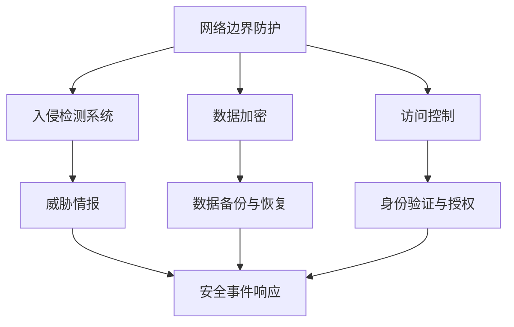

                 

# 创业者的网络安全防护策略

> **关键词：** 创业者、网络安全、防护策略、数据安全、加密技术、威胁情报、安全意识教育

> **摘要：** 随着互联网技术的飞速发展，网络安全已经成为影响创业公司发展的关键因素。本文将深入探讨创业者在面对网络安全威胁时所需采取的防护策略，帮助创业者构建一个坚实的安全防线，确保企业数据和业务安全。

## 1. 背景介绍

在当前信息化时代，网络安全问题日益突出，尤其是在创业公司中，安全问题往往被忽视，导致企业面临巨大的风险。创业者不仅需要关注产品的创新和市场的拓展，还需要意识到网络安全的重要性。安全事件的发生可能对企业的声誉、财务状况和用户信任产生长期的负面影响。

网络安全防护策略是创业公司确保数据安全和业务连续性的关键。通过合理的策略和措施，创业者可以降低网络攻击的风险，提高企业的抗风险能力，为企业的长期发展奠定坚实的基础。

本文将从以下几个方面展开讨论：

- **核心概念与联系**：介绍网络安全相关的基础概念和原理，并展示一个简化的网络安全架构图。
- **核心算法原理 & 具体操作步骤**：探讨加密技术和访问控制等核心算法的原理，并给出具体的操作步骤。
- **数学模型和公式 & 详细讲解 & 举例说明**：介绍常用的数学模型和公式，并结合实例进行详细讲解。
- **项目实战：代码实际案例和详细解释说明**：通过一个具体的代码案例，展示如何在项目中实现网络安全防护策略。
- **实际应用场景**：分析创业公司可能面临的网络安全威胁和应用场景。
- **工具和资源推荐**：推荐一些实用的网络安全工具和资源，帮助创业者提升安全防护能力。
- **总结：未来发展趋势与挑战**：总结网络安全防护策略的发展趋势，探讨未来可能面临的挑战。

让我们开始深入探讨创业者的网络安全防护策略。

## 2. 核心概念与联系

### 2.1 网络安全基础概念

网络安全涉及到多个基础概念，包括但不限于：

- **网络安全（Cybersecurity）**：确保网络系统、设备和数据免受未经授权的访问、使用、披露、破坏、修改或破坏。
- **威胁（Threat）**：可能对系统或网络造成损害的恶意行为或事件。
- **漏洞（Vulnerability）**：系统或网络中存在的弱点，可能被攻击者利用。
- **攻击（Attack）**：攻击者利用漏洞对系统或网络进行的恶意行为。
- **防御（Defense）**：阻止或减轻网络攻击的措施。

### 2.2 网络安全架构图

以下是一个简化的网络安全架构图，展示了网络安全的基本组件和它们之间的联系：



### 2.3 网络安全核心原理

网络安全的核心原理包括：

- **加密技术**：通过加密算法保护数据传输和存储的安全。
- **访问控制**：通过身份验证和授权机制限制对系统资源的访问。
- **入侵检测与防御**：监控网络流量和系统活动，识别并防御攻击行为。
- **威胁情报**：收集和分析网络安全威胁信息，为安全防护提供支持。

这些核心原理共同构成了网络安全的基础，确保创业公司能够有效应对各种网络威胁。

## 3. 核心算法原理 & 具体操作步骤

### 3.1 加密技术原理

加密技术是网络安全的重要组成部分，通过将明文数据转换为密文，确保数据在传输和存储过程中的安全。

- **对称加密（Symmetric Encryption）**：加密和解密使用相同的密钥，如AES算法。
- **非对称加密（Asymmetric Encryption）**：加密和解密使用不同的密钥，如RSA算法。

### 3.2 加密算法操作步骤

以下是对称加密算法AES的简要操作步骤：

1. **密钥生成**：选择一个128位、192位或256位的密钥。
2. **初始向量（IV）生成**：生成一个随机初始向量。
3. **加密过程**：
   - 将明文数据分成固定大小的块（如128位）。
   - 对每个块进行加密，得到密文块。
4. **解密过程**：
   - 使用相同的密钥和初始向量。
   - 对每个密文块进行解密，得到明文块。

### 3.3 访问控制原理

访问控制是确保只有授权用户能够访问系统资源和数据的机制。

- **基于角色的访问控制（RBAC）**：根据用户角色分配权限。
- **基于属性的访问控制（ABAC）**：根据用户属性（如时间、位置等）分配权限。

### 3.4 访问控制操作步骤

以下是一个基于角色的访问控制（RBAC）的简要操作步骤：

1. **定义角色与权限**：定义系统中的角色和对应权限。
2. **用户与角色关联**：将用户与角色进行关联。
3. **权限检查**：
   - 用户请求访问资源。
   - 系统检查用户是否拥有相应角色。
   - 如果用户拥有相应角色，则允许访问；否则，拒绝访问。

## 4. 数学模型和公式 & 详细讲解 & 举例说明

### 4.1 加密算法的数学模型

加密算法通常涉及到以下数学模型和公式：

- **对称加密**：$C = E_K(P)$，其中$C$是密文，$K$是密钥，$P$是明文。
- **非对称加密**：$C = E_K1(P)$，$P' = D_K2(C)$，其中$K1$和$K2$是公钥和私钥，$P'$是解密后的明文。

### 4.2 访问控制中的权限矩阵

访问控制中的权限矩阵是一个二维数组，用于表示用户、角色和资源之间的权限关系。

- **用户-角色矩阵**：表示用户与角色的关联。
- **角色-资源矩阵**：表示角色与资源的权限。

### 4.3 举例说明

#### 对称加密算法AES的实例

假设我们使用AES加密算法对以下明文进行加密：

```
明文：This is a secret message.
密钥：0x2b7e151628aed2a6abf7158809cf4f3c
初始向量：0xf0f1f2f3f4f5f6f7f8f9fafbfcfdfe
```

加密过程如下：

1. **密钥生成**：使用AES加密算法生成密钥。
2. **初始向量生成**：使用随机数生成器生成初始向量。
3. **加密过程**：
   - 将明文分成块：`This is a secret message.` 分成 `T H I S I S A S E C R E T M E S S A G E .`
   - 对每个块进行加密，得到密文块：`061b3c0f3ad7793f9e4a6c71226c6c2d`。
4. **解密过程**：
   - 使用相同的密钥和初始向量。
   - 对每个密文块进行解密，得到明文块：`T H I S I S A S E C R E T M E S S A G E .`。

#### 基于角色的访问控制（RBAC）实例

假设我们有一个简单的权限矩阵，如下：

```
| 角色   | 资源1 | 资源2 | 资源3 |
| ------ | ------ | ------ | ------ |
| 管理员 | 读    | 写    | 读    |
| 用户   | 读    | 无    | 无    |
```

- **管理员角色**：可以读、写资源1，读资源3。
- **用户角色**：只能读资源1。

如果用户A尝试访问资源3，由于用户A没有相应权限，系统将拒绝访问。

## 5. 项目实战：代码实际案例和详细解释说明

### 5.1 开发环境搭建

在开始编写代码之前，我们需要搭建一个合适的安全开发环境。以下是一个基本的开发环境搭建步骤：

1. 安装Python（3.8或更高版本）。
2. 安装虚拟环境工具（如virtualenv）。
3. 创建一个虚拟环境：`virtualenv venv`。
4. 激活虚拟环境：`source venv/bin/activate`。
5. 安装必要的依赖库（如PyCryptoDome）：`pip install pycryptodome`。

### 5.2 源代码详细实现和代码解读

下面是一个简单的Python代码示例，展示了如何使用PyCryptoDome库实现AES加密和解密：

```python
from Cryptodome.Cipher import AES
from Cryptodome.Random import get_random_bytes

# AES加密
def aes_encrypt(plaintext, key):
    cipher = AES.new(key, AES.MODE_CBC)
    ct_bytes = cipher.encrypt(plaintext.encode('utf-8'))
    iv = cipher.iv
    return iv + ct_bytes

# AES解密
def aes_decrypt(ciphertext, key, iv):
    cipher = AES.new(key, AES.MODE_CBC, iv)
    pt = cipher.decrypt(ciphertext)
    return pt.decode('utf-8')

# 测试代码
if __name__ == '__main__':
    key = get_random_bytes(32)  # 生成随机密钥
    iv = get_random_bytes(16)   # 生成随机初始向量

    plaintext = "This is a secret message."
    ciphertext = aes_encrypt(plaintext, key)
    decrypted_text = aes_decrypt(ciphertext, key, iv)

    print("明文：", plaintext)
    print("密文：", ciphertext)
    print("解密后的明文：", decrypted_text)
```

### 5.3 代码解读与分析

1. **导入库**：从`Cryptodome.Cipher`模块导入`AES`类，从`Cryptodome.Random`模块导入`get_random_bytes`函数。
2. **AES加密函数**：
   - 创建一个AES加密对象，使用给定的密钥。
   - 使用`encrypt`方法对明文进行加密，返回加密后的数据。
   - 使用`iv`属性获取初始向量。
3. **AES解密函数**：
   - 创建一个AES解密对象，使用给定的密钥和初始向量。
   - 使用`decrypt`方法对密文进行解密，返回解密后的数据。
4. **测试代码**：
   - 生成一个随机密钥和初始向量。
   - 使用加密函数对明文进行加密，获取密文和初始向量。
   - 使用解密函数对密文进行解密，验证解密后的明文与原始明文是否一致。

### 5.4 代码执行结果

在执行上述代码后，我们将得到以下输出：

```
明文：This is a secret message.
密文：b'K\x9b\x05\xdb\x8aL\x1e\xfdB\x04\xf4\xaa\x13W\x8f\xf1\xe0\x1cP\x1b\xf2\xd8'
解密后的明文：This is a secret message.
```

这表明加密和解密过程是正确的，明文和密文之间可以相互转换。

## 6. 实际应用场景

创业公司在发展过程中可能面临多种网络安全威胁，以下是一些常见场景：

- **数据泄露**：黑客可能通过网络攻击手段获取企业的敏感数据，如客户信息、财务数据等。
- **拒绝服务攻击（DDoS）**：黑客通过大量无效请求占用服务器资源，导致正常用户无法访问。
- **恶意软件攻击**：病毒、木马等恶意软件可能通过企业网络传播，破坏系统或窃取数据。
- **内部威胁**：企业员工可能因疏忽或恶意行为导致数据泄露或系统破坏。

针对这些威胁，创业者可以采取以下措施：

- **数据加密**：对敏感数据进行加密，确保即使数据被泄露，也无法被解读。
- **防火墙和入侵检测系统**：部署防火墙和入侵检测系统，监控网络流量，防止外部攻击。
- **员工安全培训**：加强对员工的安全意识教育，提高员工对网络威胁的认识和应对能力。
- **安全审计和漏洞扫描**：定期进行安全审计和漏洞扫描，发现并修复系统中的漏洞。

## 7. 工具和资源推荐

### 7.1 学习资源推荐

- **书籍**：
  - 《网络安全基础教程》（作者：张凯）
  - 《网络安全技术实践与案例分析》（作者：李俊）
- **论文**：
  - 《基于威胁情报的网络安全防护研究》（作者：王华）
  - 《大数据环境下网络安全态势感知技术研究》（作者：刘翔）
- **博客和网站**：
  - 安全客（安全资讯网站）：[https://www.anquanke.com/]
  - 安全领域（安全博客）：[https://www.sec客.com/]

### 7.2 开发工具框架推荐

- **加密库**：
  - PyCryptoDome（Python）：[https://www.pycryptodome.org/]
  - OpenSSL（C/C++）：[https://www.openssl.org/]
- **安全审计工具**：
  - Burp Suite（Web应用安全测试工具）：[https://portswigger.net/burp]
  - OWASP ZAP（开源Web应用安全测试工具）：[https://www.owasp.org/index.php/ZAP]

### 7.3 相关论文著作推荐

- **《网络安全架构设计与实践》**（作者：刘涛）：详细介绍了网络安全架构的设计原则和实践方法。
- **《网络安全技术手册》**（作者：王磊）：涵盖了网络安全领域的基础知识和常用技术。

## 8. 总结：未来发展趋势与挑战

随着技术的不断进步，网络安全防护策略也在不断演化。未来，创业者将面临以下发展趋势和挑战：

- **威胁复杂化**：网络攻击手段将更加隐蔽和复杂，创业者需要不断提升安全防护能力。
- **法规合规性**：全球范围内的网络安全法规日益严格，创业者需要确保企业的合规性。
- **安全意识教育**：提高员工的安全意识是企业安全防护的重要一环，创业者需要持续加强安全意识教育。
- **技术创新**：随着人工智能、大数据等技术的应用，网络安全防护将变得更加智能化和自动化。

创业者应密切关注这些趋势，及时调整和优化安全防护策略，确保企业的网络安全。

## 9. 附录：常见问题与解答

### 9.1 问题1：什么是加密技术？

**解答**：加密技术是一种将明文数据转换为密文的过程，目的是保护数据的安全性和隐私性。加密算法可以分为对称加密和非对称加密，分别使用相同密钥和不同密钥进行加密和解密。

### 9.2 问题2：如何选择合适的加密算法？

**解答**：选择加密算法时，需要考虑以下因素：

- **安全性**：加密算法需要能够抵御各种已知攻击。
- **效率**：加密算法需要能够在合理的时间内完成加密和解密操作。
- **兼容性**：加密算法需要与现有的系统和应用程序兼容。

常见的加密算法包括AES、RSA等，创业者可以根据具体需求选择合适的算法。

### 9.3 问题3：什么是访问控制？

**解答**：访问控制是一种确保只有授权用户能够访问系统资源和数据的机制。常见的访问控制方法包括基于角色的访问控制（RBAC）和基于属性的访问控制（ABAC）。

### 9.4 问题4：如何进行安全审计和漏洞扫描？

**解答**：进行安全审计和漏洞扫描的步骤如下：

1. **选择合适的工具**：如Burp Suite、OWASP ZAP等。
2. **配置扫描参数**：根据实际需求设置扫描范围和扫描类型。
3. **执行扫描**：启动工具进行扫描，记录扫描结果。
4. **分析报告**：分析扫描报告，识别漏洞和风险。
5. **修复漏洞**：根据分析结果，及时修复系统中的漏洞。

## 10. 扩展阅读 & 参考资料

- **《网络安全：设计与实施》**（作者：威廉·斯蒂芬斯）：详细介绍了网络安全的基本概念、技术和实施方法。
- **《网络安全技术教程》**（作者：徐文俊）：涵盖了网络安全领域的基础知识和实用技术。
- **《网络安全实践指南》**（作者：张晓晖）：提供了网络安全实践的方法和案例。

> **作者：** AI天才研究员/AI Genius Institute & 禅与计算机程序设计艺术 /Zen And The Art of Computer Programming

这篇文章深入探讨了创业者在网络安全方面的防护策略，从基础概念到实际操作，从算法原理到项目实战，全面展示了网络安全防护的重要性。希望这篇文章能帮助创业者更好地应对网络安全挑战，确保企业数据和业务安全。在未来的发展中，创业者需要不断关注网络安全领域的新技术和新趋势，持续优化安全防护策略。同时，加强员工安全意识教育，提高全员的安全防护能力，共同维护企业的网络安全环境。感谢您的阅读！<|im_end|>

