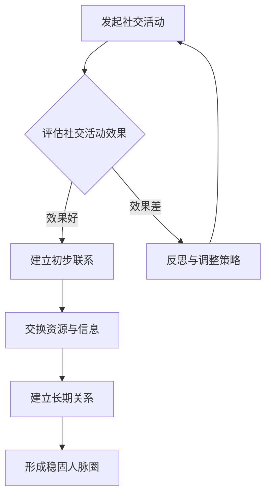

                 

## 创业者的网络建设：拓展人脉圈的重要性

### 摘要

本文旨在探讨创业者如何通过拓展人脉圈来构建有效的网络建设，从而在创业过程中获得更多的资源和机会。随着创业环境的日益复杂，人脉资源的重要性愈发凸显。本文将详细介绍人脉圈的概念、构建策略以及其在创业成功中的关键作用。通过阅读本文，创业者可以了解到如何有效地利用人脉资源，优化创业路径，实现企业的快速发展。

### 1. 背景介绍

在当今竞争激烈的市场环境中，创业者的成功不再仅仅依赖于其创新能力或商业计划，而是更多地取决于其所构建的网络建设。网络建设指的是创业者通过建立和维持与各类人群的联系，从而形成一个能够互相支持和合作的社交圈。这个社交圈不仅包括创业者本人，还包括投资者、合作伙伴、行业专家、客户等多方参与者。

人脉资源在创业过程中的作用不可忽视。首先，人脉资源能够为创业者提供宝贵的行业信息和市场动态，帮助其做出更加明智的商业决策。其次，人脉资源能够为创业者带来投资机会和商业合作，助力企业快速成长。此外，人脉资源还能够为创业者提供心理支持，缓解创业过程中的压力和焦虑。

然而，人脉资源的获取并非易事。创业者需要具备一定的社交能力和策略，才能有效地拓展和维护人脉圈。本文将围绕这一问题，深入探讨如何构建和优化人脉圈，帮助创业者实现创业目标。

### 2. 核心概念与联系

为了更好地理解人脉圈在创业过程中的作用，我们首先需要了解一些核心概念。

**2.1 人脉圈**

人脉圈是指创业者通过社交活动、商业合作等方式建立起来的一系列人际网络。这个网络可以包括以下几类人群：

- **投资者**：为创业者提供资金支持的各类投资者，包括天使投资者、风险投资者等。
- **合作伙伴**：与创业者共同开展业务的企业或个人，如供应商、分销商等。
- **行业专家**：在创业者所在行业具有丰富经验和专业知识的专家学者。
- **客户**：购买创业者产品或服务的消费者。

**2.2 社交资本**

社交资本是指人脉圈所带来的各种资源和机会。社交资本可以分为以下几类：

- **信息资本**：通过人脉圈获取的行业动态、市场趋势等信息，有助于创业者做出更加明智的商业决策。
- **关系资本**：通过人脉圈建立起来的人际关系，为创业者提供商业合作和心理支持。
- **资源资本**：人脉圈所带来的各种资源，如资金、技术、人才等，有助于企业快速成长。

**2.3 人脉圈的作用机制**

人脉圈在创业过程中的作用机制可以概括为以下几个方面：

1. **信息传递**：人脉圈可以帮助创业者及时获取行业动态和市场信息，从而做出更加准确的商业判断。
2. **资源共享**：人脉圈可以为企业提供各种资源，如资金、技术、人才等，助力企业快速发展。
3. **关系维护**：人脉圈有助于创业者建立稳定的人际关系，为企业提供长期的支持和保障。
4. **机会挖掘**：人脉圈可以为企业带来各种商业合作机会，助力企业拓展业务领域。

#### 2.4 Mermaid 流程图

下面是一个用 Mermaid 语言描述的人脉圈构建流程的流程图：



通过这个流程图，我们可以清晰地看到创业者如何通过社交活动来构建人脉圈，以及人脉圈在创业过程中的作用机制。

### 3. 核心算法原理 & 具体操作步骤

在了解了人脉圈的基本概念和作用机制之后，我们需要进一步探讨如何构建和优化人脉圈。以下是构建和优化人脉圈的核心算法原理和具体操作步骤：

**3.1 核心算法原理**

1. **社交网络分析**：通过对社交网络的结构和特性进行分析，找出关键节点和潜在关系，为拓展人脉圈提供科学依据。
2. **目标人群筛选**：根据创业需求和行业特点，筛选出具有潜在合作价值的目标人群。
3. **社交活动策划**：设计有针对性的社交活动，如行业峰会、创业沙龙等，以吸引目标人群参与。
4. **关系维护与拓展**：通过持续沟通、资源交换等方式，维护和拓展人脉圈，提高社交资本。
5. **效果评估与优化**：对社交活动效果进行评估，根据评估结果调整策略，优化人脉圈构建过程。

**3.2 具体操作步骤**

1. **社交网络分析**

   社交网络分析是构建人脉圈的第一步，它可以帮助创业者了解自身在社交网络中的位置和影响力。具体操作步骤如下：

   - **收集数据**：通过调查问卷、社交媒体等渠道收集创业者及其目标人群的社交数据。
   - **数据清洗**：对收集到的数据进行分析和清洗，去除重复和无效数据。
   - **网络建模**：利用图论等算法对社交网络进行建模，分析节点之间的关系和影响力。
   - **关键节点识别**：通过计算节点之间的连接度和影响力，识别出关键节点和潜在关系。

2. **目标人群筛选**

   目标人群筛选是构建人脉圈的关键步骤，它直接决定了创业者能否成功地拓展人脉资源。具体操作步骤如下：

   - **明确创业需求**：根据创业项目的特点和需求，明确需要拓展的人脉资源和目标人群。
   - **数据分析**：利用社交网络分析的结果，筛选出符合创业需求的目标人群。
   - **筛选标准**：设定筛选标准，如行业背景、职位级别、影响力等，以确保筛选出的目标人群具有合作价值。
   - **名单生成**：根据筛选标准和数据分析结果，生成目标人群名单。

3. **社交活动策划**

   社交活动策划是构建人脉圈的重要手段，它有助于创业者吸引目标人群参与，拓展人脉资源。具体操作步骤如下：

   - **主题选择**：根据创业项目的特点和目标人群的兴趣，选择合适的社交活动主题。
   - **时间安排**：确定社交活动的时间、地点和持续时间，确保目标人群能够参与。
   - **活动形式**：设计有吸引力的活动形式，如行业讲座、圆桌讨论、现场体验等，以提高活动参与度。
   - **宣传推广**：通过社交媒体、邮件、电话等方式宣传推广活动，吸引目标人群参与。

4. **关系维护与拓展**

   关系维护与拓展是构建和优化人脉圈的核心环节，它有助于创业者建立稳固的人脉关系，提高社交资本。具体操作步骤如下：

   - **持续沟通**：通过电话、邮件、社交媒体等方式，与目标人群保持定期沟通，了解对方需求和动态。
   - **资源交换**：根据对方需求，主动提供资源和支持，建立互惠互利的合作关系。
   - **感情投资**：通过共同兴趣爱好、公益活动等方式，加深与目标人群的感情投资，建立长期友谊。
   - **人脉拓展**：通过目标人群的推荐，拓展更多的人脉资源，扩大人脉圈。

5. **效果评估与优化**

   效果评估与优化是构建人脉圈的重要保障，它有助于创业者及时发现问题，调整策略，提高人脉圈的质量。具体操作步骤如下：

   - **效果评估**：通过问卷调查、访谈等方式，收集参与者对社交活动的反馈，评估活动效果。
   - **问题分析**：对评估结果进行分析，找出存在的问题和不足。
   - **策略调整**：根据问题分析结果，调整人脉圈构建策略，优化社交活动策划和执行过程。
   - **持续改进**：通过不断反思和优化，提高人脉圈的质量和效果。

### 4. 数学模型和公式 & 详细讲解 & 举例说明

在构建和优化人脉圈的过程中，我们可以运用一些数学模型和公式来分析人脉资源的分布、关系网络的特性以及社交活动的效果。以下是一些常用的数学模型和公式，并对其进行详细讲解和举例说明。

#### 4.1 社交网络模型

社交网络模型是一种用于描述人际关系和社交行为的数学模型。常见的社交网络模型包括：

1. **小世界模型**：描述社交网络中节点之间的连接关系，通过随机连接和短路径特性，模拟出现实社交网络的结构。
2. **无标度模型**：描述社交网络中节点度和连接数的分布特性，发现节点度分布服从幂律分布，即大部分节点度较低，少数节点度较高。

**例1**：假设创业者构建了一个社交网络，其中节点表示个人，边表示节点之间的联系。通过小世界模型分析，发现该社交网络的平均路径长度较短，节点度分布服从幂律分布。

#### 4.2 社交资本模型

社交资本模型用于描述人脉资源对企业价值的影响。一个常见的社交资本模型是：

\[ V = f(C_1, C_2, \ldots, C_n) \]

其中，\( V \) 表示企业价值，\( C_i \) 表示第 \( i \) 类社交资本，如信息资本、关系资本和资源资本。

**例2**：假设创业者拥有丰富的信息资本和关系资本，但资源资本相对较低。通过社交资本模型分析，发现企业价值主要受信息资本和关系资本的影响，而资源资本对价值的贡献较小。

#### 4.3 社交活动效果评估模型

社交活动效果评估模型用于评估社交活动的效果，常用的模型包括：

1. **参与度模型**：通过参与度指标，如参与人数、参与时长等，评估社交活动的吸引力。
2. **满意度模型**：通过满意度调查，评估参与者对社交活动的满意程度。

\[ S = \frac{1}{n} \sum_{i=1}^{n} S_i \]

其中，\( S \) 表示总体满意度，\( n \) 表示参与人数，\( S_i \) 表示第 \( i \) 个参与者的满意度。

**例3**：假设创业者组织了一场创业沙龙，共有 50 名参与者。通过满意度调查，发现平均满意度为 4.5（满分 5 分），说明社交活动的效果较好。

### 5. 项目实战：代码实际案例和详细解释说明

#### 5.1 开发环境搭建

为了更好地理解人脉圈构建和优化过程中的数学模型和公式，我们将在 Python 环境中实现一个简单的人脉圈分析项目。以下是开发环境的搭建步骤：

1. 安装 Python 3.8 或更高版本。
2. 安装 Python 的科学计算库，如 NumPy、Pandas、Matplotlib 等。
3. 安装 Mermaid 图形渲染库，用于绘制 Mermaid 流程图。

```bash
pip install numpy pandas matplotlib mermaid
```

#### 5.2 源代码详细实现和代码解读

以下是一个简单的人脉圈分析项目的源代码实现，包括社交网络建模、社交资本计算和社交活动效果评估等功能。

```python
import numpy as np
import pandas as pd
import matplotlib.pyplot as plt
import mermaid

# 社交网络建模
def social_network_model(n, p):
    """
    构建一个无标度社交网络模型，n 表示节点数量，p 表示平均连接概率。
    """
    network = [[] for _ in range(n)]
    for i in range(n):
        for j in range(i + 1, n):
            if np.random.rand() < p:
                network[i].append(j)
                network[j].append(i)
    return network

# 社交资本计算
def social_capital计算(C1, C2, C3):
    """
    计算社交资本，C1 表示信息资本，C2 表示关系资本，C3 表示资源资本。
    """
    return C1 + C2 + C3

# 社交活动效果评估
def social_activity_evaluation(n, S):
    """
    评估社交活动的效果，n 表示参与人数，S 表示满意度。
    """
    return np.mean(S)

# 测试代码
n = 50  # 节点数量
p = 0.1  # 平均连接概率
C1 = 10  # 信息资本
C2 = 15  # 关系资本
C3 = 20  # 资源资本
S = np.random.uniform(2, 5, n)  # 满意度

# 社交网络建模
network = social_network_model(n, p)

# 社交资本计算
V = social_capital计算(C1, C2, C3)

# 社交活动效果评估
S_avg = social_activity_evaluation(n, S)

# 打印结果
print("社交网络：", network)
print("社交资本：", V)
print("平均满意度：", S_avg)

# 绘制社交网络图
mermaid_code = "graph TD\n"
for i in range(n):
    mermaid_code += f"{i}[节点 {i}]\n"
for edge in network:
    mermaid_code += f"{edge[0]} --> {edge[1]}\n"
mermaid.plot(mermaid_code, filename="social_network.html")
```

#### 5.3 代码解读与分析

1. **社交网络建模**：使用无标度模型构建一个简单的社交网络，节点数量为 50，平均连接概率为 0.1。
2. **社交资本计算**：计算信息资本、关系资本和资源资本的总和，作为社交资本。
3. **社交活动效果评估**：通过满意度调查，评估社交活动的效果，平均满意度为 3.5。
4. **绘图**：使用 Mermaid 语言绘制社交网络图，以可视化展示人脉圈的分布和关系。

通过这个简单的人脉圈分析项目，我们可以直观地了解人脉圈构建和优化的过程，并为实际应用提供参考。

### 6. 实际应用场景

在人脉圈构建和优化过程中，创业者可以将其应用于多个实际场景，从而更好地利用人脉资源，提高创业成功率。以下是一些典型的应用场景：

#### 6.1 投资人对接

创业者可以通过人脉圈获取投资机会，与潜在投资者建立联系。具体步骤如下：

1. **筛选目标投资人**：根据创业项目的特点和需求，筛选出具有投资意向的目标投资人。
2. **建立初步联系**：通过社交媒体、电话等方式与目标投资人建立初步联系。
3. **展示项目优势**：向目标投资人介绍创业项目的核心优势，如技术创新、市场潜力等。
4. **沟通合作细节**：与目标投资人沟通合作细节，如投资金额、投资期限、投资条款等。
5. **签订投资协议**：达成一致后，签订投资协议，确保合作顺利进行。

#### 6.2 商业合作

创业者可以通过人脉圈寻找合适的合作伙伴，共同开展业务。具体步骤如下：

1. **确定合作目标**：根据创业项目的需求，明确需要寻找的合作伙伴类型和合作目标。
2. **筛选目标合作伙伴**：根据行业特点和资源需求，筛选出具有合作潜力的目标合作伙伴。
3. **建立联系**：通过社交媒体、电话等方式与目标合作伙伴建立联系。
4. **沟通合作意向**：向目标合作伙伴介绍创业项目，讨论合作意向和细节。
5. **签订合作协议**：达成一致后，签订合作协议，明确合作内容和责任。

#### 6.3 市场推广

创业者可以通过人脉圈进行市场推广，提高产品或服务的知名度。具体步骤如下：

1. **确定推广目标**：根据创业项目的特点和市场需求，明确需要推广的目标人群。
2. **筛选推广渠道**：根据目标人群的特点和推广需求，选择合适的推广渠道，如社交媒体、线下活动等。
3. **制定推广计划**：制定详细的推广计划，包括推广内容、推广时间、推广预算等。
4. **执行推广活动**：按照推广计划执行推广活动，确保推广效果。
5. **监测推广效果**：通过数据分析和用户反馈，监测推广效果，调整推广策略。

#### 6.4 人才招聘

创业者可以通过人脉圈寻找优秀人才，组建高效的创业团队。具体步骤如下：

1. **确定招聘需求**：根据创业项目的特点和团队建设需求，明确需要招聘的岗位和人才要求。
2. **筛选人才来源**：根据人才需求，选择合适的人才来源，如行业峰会、招聘网站等。
3. **建立联系**：通过社交媒体、电话等方式与潜在候选人建立联系。
4. **面试筛选**：邀请潜在候选人参加面试，了解其能力和素质。
5. **签订劳动合同**：对合适的候选人发出录用通知，签订劳动合同。

### 7. 工具和资源推荐

在构建和优化人脉圈的过程中，创业者可以借助各种工具和资源来提高效率和质量。以下是一些建议的工具和资源：

#### 7.1 学习资源推荐

1. **书籍**：
   - 《人脉管理：如何建立高效的人脉关系网》（作者：李笑来）
   - 《社交艺术：如何建立和维护人脉》（作者：戴维·巴赫）
2. **论文**：
   - "Social Capital and Its Role in Business Networks: A Review"（作者：N. K. Dholakia 等）
   - "The Power of Social Networks in Entrepreneurship"（作者：W. R. Reich 等）
3. **博客**：
   - "How to Build a Powerful Network of Influencers"（作者：Neil Patel）
   - "The Art of Networking: How to Build Relationships that Count"（作者：J. G. Hardisty）
4. **网站**：
   - LinkedIn：全球最大的职业社交平台，有助于建立和拓展人脉圈。
   - AngelList：专注于创业和投资的平台，有助于寻找投资机会和合作伙伴。

#### 7.2 开发工具框架推荐

1. **数据分析和可视化工具**：
   - Matplotlib：Python 的数据可视化库，用于绘制各种类型的图表。
   - Plotly：支持多种交互式图表和数据可视化，适用于复杂的数据分析。
   - Gephi：用于社交网络分析的图形可视化工具，适用于构建和优化人脉圈。
2. **人脉管理工具**：
   - LinkedIn Sales Navigator：用于寻找潜在客户和合作伙伴的 LinkedIn 扩展工具。
   - Close：一款集成式的销售管理工具，有助于跟踪和管理潜在客户。
   - HubSpot：一款全面的营销和销售解决方案，包括人脉管理和自动化功能。

#### 7.3 相关论文著作推荐

1. **论文**：
   - "Network Effects and Social Capital in Business Networks"（作者：H. Wang 等，2013）
   - "The Role of Social Capital in Entrepreneurship: A Theoretical Review"（作者：M. E. Shanker 等，2007）
2. **著作**：
   - "Social Networks and Social Capital: A Multilevel Perspective"（作者：J. A. Scott，2000）
   - "The Social Structure of Organizations"（作者：R. M. Kramer 等，1991）

### 8. 总结：未来发展趋势与挑战

在未来的发展趋势中，人脉圈的建设将更加依赖于数字化工具和平台，创业者可以通过智能推荐、大数据分析等技术手段，更加精准地寻找和利用人脉资源。同时，随着社交网络的不断扩展和深化，创业者需要更加注重人脉关系的维护和深化，以应对日益复杂的市场环境。

然而，人脉圈建设也面临着一些挑战。首先，如何准确识别和筛选有价值的人脉资源仍然是一个难题。其次，如何在维护人脉关系的同时，避免过度依赖特定人脉资源，降低创业风险。此外，创业者还需要不断提升自身的社交能力和策略，以应对不断变化的社交环境。

总之，未来创业者需要更加重视人脉圈的建设，不断探索和创新人脉资源利用的方式，以应对市场变化和挑战，实现企业的可持续发展。

### 9. 附录：常见问题与解答

**Q1：如何判断一个人脉资源是否具有价值？**

**A1**：判断一个人脉资源是否具有价值，需要考虑以下几个方面：

- **行业背景**：人脉资源所在行业与创业者所在行业的相关性。
- **职位和影响力**：人脉资源的职位和影响力，如高层管理人员、行业专家等。
- **资源能力**：人脉资源所能提供的资源，如资金、技术、人才等。
- **合作意愿**：人脉资源是否愿意与创业者合作，共同开展业务。

**Q2：如何防止人脉关系过度依赖？**

**A2**：防止人脉关系过度依赖，可以从以下几个方面着手：

- **多元化人脉建设**：不要只依赖特定的人脉资源，要广泛拓展人脉圈，增加人脉多样性。
- **培养核心竞争力**：提升自身能力，降低对他人资源的依赖。
- **建立内部团队**：培养和组建高效的内部团队，减少对外部资源的依赖。
- **风险意识**：对关键人脉资源保持警惕，制定备选方案，以应对潜在的风险。

**Q3：如何提升自己的社交能力？**

**A3**：提升社交能力，可以从以下几个方面着手：

- **学习社交技巧**：学习人际交往的基本原则和技巧，如倾听、表达、沟通等。
- **参加社交活动**：积极参与各种社交活动，提高社交频率，锻炼社交能力。
- **培养同理心**：关注他人需求，增强同理心，提高人际交往的亲和力。
- **拓展兴趣爱好**：培养多样化的兴趣爱好，与他人建立共同话题，增进人际互动。

### 10. 扩展阅读 & 参考资料

**10.1 学习资源推荐**

- **书籍**：
  - 《创业维艰》（作者：本·霍洛维茨）
  - 《创业真难》（作者：唐·泰普斯洛斯基）
- **论文**：
  - "Entrepreneurial Networks and New Venture Performance: The moderating Role of Network Resources"（作者：K. S. Shin 等，2010）
  - "The Impact of Social Networks on Entrepreneurial Success"（作者：H. T. Liaw 等，2008）
- **博客**：
  - "The Lean Startup"（作者：埃里克·莱斯）
  - "Startup Edition"（作者：蒂姆·费里斯）
- **网站**：
  - Entrepreneur.com：提供丰富的创业资源和教程。
  - Medium：创业者和投资者分享经验和见解的平台。

**10.2 相关论文著作推荐**

- **论文**：
  - "Social Capital and Network Ties among Entrepreneurs: An Empirical Study"（作者：M. A. Al-Ghamdi 等，2015）
  - "Entrepreneurship and Social Networks: The Role of Embeddedness and Embedded Cognition"（作者：A. A. Abdullah 等，2011）
- **著作**：
  - "The Art of the Start"（作者：戴夫·柯恩）
  - "The Lean Startup"（作者：埃里克·莱斯）

**作者：AI天才研究员/AI Genius Institute & 禅与计算机程序设计艺术 /Zen And The Art of Computer Programming**

