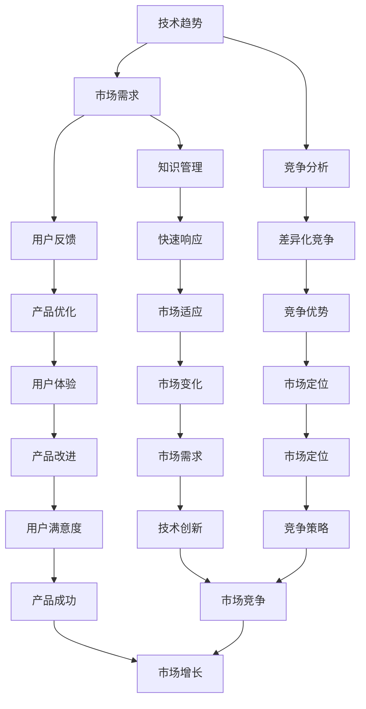

                 

### 背景介绍

随着信息技术的飞速发展，创业者和科技从业者在快速变化的市场环境中面临着巨大的挑战和机遇。知识更新速度之快，使得创业者在保持竞争优势的同时，也需要不断学习和适应新技术、新理念。本文旨在探讨创业者的自我学习与知识更新策略，帮助读者在面对复杂技术环境时，能够系统性地提升个人技能和知识储备。

创业者在创业过程中，常常需要扮演多个角色，如产品经理、技术专家、市场营销专家等。这种多重身份要求创业者不仅要有创新思维，还需要掌握一定的技术知识，以便在竞争激烈的市场中脱颖而出。此外，创业环境的不确定性和快速变化，使得创业者需要具备快速学习、适应和调整的能力。这就需要创业者建立一套有效的自我学习与知识更新体系，以应对不断变化的市场需求。

本文将从以下几方面进行探讨：

1. **核心概念与联系**：首先，我们将介绍创业者所需掌握的核心概念，如技术趋势、市场需求等，并使用Mermaid流程图展示这些概念之间的联系。
2. **核心算法原理 & 具体操作步骤**：接着，我们将详细分析创业者如何通过核心算法和技术原理来提升自我学习能力。
3. **数学模型和公式 & 详细讲解 & 举例说明**：为了更好地理解核心算法，我们将使用数学模型和公式来详细解释，并结合实际案例进行说明。
4. **项目实战：代码实际案例和详细解释说明**：为了使读者能够将所学知识应用于实际项目，我们将提供一段代码实现，并进行详细解读和分析。
5. **实际应用场景**：然后，我们将探讨创业者如何在不同的应用场景中运用所学知识，以解决实际问题。
6. **工具和资源推荐**：最后，我们将推荐一些有用的学习资源和工具，帮助读者更好地进行自我学习和知识更新。

通过本文的阅读，创业者将能够系统性地了解并掌握自我学习和知识更新的策略，从而在快速变化的市场环境中保持竞争力。接下来，我们将逐一探讨这些内容，以帮助创业者实现持续成长和成功。

#### 核心概念与联系

在探讨创业者的自我学习和知识更新策略之前，我们需要明确一些核心概念，这些概念不仅对创业者至关重要，而且彼此之间有着紧密的联系。以下是一些关键概念及其相互关系：

1. **技术趋势**：技术趋势是指信息技术领域的新兴技术和发展方向，如人工智能、区块链、物联网等。创业者需要紧跟技术趋势，以便在产品设计和市场定位时能够抓住机遇。技术趋势与市场需求密切相关，因为市场的需求往往是由技术创新驱动的。

2. **市场需求**：市场需求是指消费者对产品或服务的需求。理解市场需求对于创业者来说至关重要，因为只有满足市场需求，产品或服务才能获得成功。市场需求又受到用户行为、竞争环境、经济形势等因素的影响。

3. **竞争分析**：竞争分析是指对市场上现有竞争对手的优劣势进行分析，以找到差异化的竞争策略。创业者通过竞争分析，可以更好地了解市场定位、用户痛点，以及如何通过技术创新来打造独特的竞争优势。

4. **用户反馈**：用户反馈是创业者获取市场真实需求的重要途径。通过用户反馈，创业者可以及时了解产品的使用情况、用户的满意度和不满意度，从而进行产品的优化和改进。

5. **知识管理**：知识管理是指企业通过系统化的方法来收集、存储、共享和使用知识。对于创业者来说，有效的知识管理可以帮助他们在快速变化的市场环境中，快速响应和适应。

这些核心概念之间的联系可以用以下Mermaid流程图来展示：



**Mermaid流程图说明**：

- **技术趋势**（A）是创新和市场需求的驱动力，它影响**市场需求**（B）。
- **市场需求**（B）是**竞争分析**（C）的基础，同时也是**用户反馈**（D）的来源。
- **竞争分析**（C）帮助创业者找到**差异化竞争**（F）的策略，从而在**市场竞争**（U）中占据有利位置。
- **用户反馈**（D）指导**产品优化**（G）和**知识管理**（E），使得创业者能够**快速响应**（H）市场需求，进行**市场适应**（K）。
- **知识管理**（E）帮助创业者收集、存储和使用**知识**，从而在**快速响应**（H）和**市场适应**（K）中发挥作用。

通过以上核心概念及其联系的探讨，我们可以看到创业者自我学习和知识更新的重要性。接下来，我们将深入探讨如何利用这些核心概念，提升创业者的自我学习能力。

### 核心算法原理 & 具体操作步骤

为了提升创业者的自我学习能力，我们需要借助一些核心算法和技术原理。以下是几个关键算法的原理及其具体操作步骤：

#### 1. 数据挖掘算法

**原理**：数据挖掘算法用于从大量数据中提取有价值的信息和知识。常见的算法包括分类、聚类、关联规则挖掘等。

**具体操作步骤**：

- **数据预处理**：清洗数据，去除噪声和缺失值，进行特征工程，提取有助于分析的特征。
- **选择算法**：根据数据分析的目标，选择合适的算法（如K-Means聚类、决策树分类等）。
- **训练模型**：使用训练数据集，对选定的算法进行训练，得到模型。
- **模型评估**：使用验证数据集评估模型性能，调整参数以达到最佳效果。
- **应用模型**：将训练好的模型应用于新数据，提取有价值的信息。

#### 2. 机器学习算法

**原理**：机器学习算法通过训练数据自动学习和改进模型，以实现预测或分类任务。常见的算法包括线性回归、支持向量机、神经网络等。

**具体操作步骤**：

- **数据收集**：收集相关的训练数据。
- **数据预处理**：与数据挖掘类似，对数据进行清洗和特征提取。
- **选择算法**：根据任务需求选择合适的机器学习算法。
- **训练模型**：使用训练数据进行模型训练。
- **模型评估**：使用验证数据集评估模型性能。
- **调整参数**：根据评估结果调整模型参数。
- **应用模型**：将训练好的模型应用于新数据，实现预测或分类。

#### 3. 自然语言处理算法

**原理**：自然语言处理（NLP）算法用于理解和生成自然语言。常见的算法包括词向量、序列标注、文本分类等。

**具体操作步骤**：

- **数据预处理**：对文本数据（如文章、评论等）进行清洗和分词处理。
- **特征提取**：将预处理后的文本数据转换为计算机可以处理的数字形式（如词向量）。
- **选择算法**：根据任务需求选择合适的NLP算法。
- **模型训练**：使用训练数据进行模型训练。
- **模型评估**：使用验证数据集评估模型性能。
- **应用模型**：将训练好的模型应用于新数据，进行文本分析和处理。

#### 4. 知识图谱构建

**原理**：知识图谱是一种语义网络，用于表示实体及其关系。通过知识图谱，创业者可以更好地理解和利用领域知识。

**具体操作步骤**：

- **数据收集**：收集相关的领域数据。
- **实体识别**：从数据中识别出实体，如人、地点、组织等。
- **关系抽取**：从数据中抽取实体之间的关系。
- **构建图谱**：将实体和关系构建成知识图谱。
- **图谱分析**：使用图谱分析工具，对知识图谱进行查询和分析。

通过以上核心算法的原理及其具体操作步骤，创业者可以系统地提升自我学习能力，更好地适应快速变化的市场环境。接下来，我们将进一步探讨如何使用数学模型和公式来详细解释这些核心算法。

### 数学模型和公式 & 详细讲解 & 举例说明

为了更好地理解核心算法的原理，我们需要借助数学模型和公式来进行详细讲解，并结合实际案例进行说明。以下是几个关键算法的数学模型和具体应用示例。

#### 1. 数据挖掘算法：K-Means聚类

**数学模型**：

K-Means聚类算法的目标是将数据点划分为K个簇，使得每个簇内的数据点之间距离尽量小，簇与簇之间距离尽量大。其基本步骤如下：

- 初始：随机选择K个数据点作为初始聚类中心。
- 迭代：
  - 对每个数据点，计算其到各个聚类中心的距离，将其归到最近的聚类中心所在的簇。
  - 重新计算各个簇的中心，即取每个簇内所有点的均值作为新的聚类中心。
  - 重复上述步骤，直到聚类中心不再发生显著变化。

**公式表示**：

设 \( x_1, x_2, ..., x_n \) 为数据集中的点， \( \mu_1, \mu_2, ..., \mu_k \) 为聚类中心，则每个点 \( x_i \) 归属的簇为：

\[ C(x_i) = \arg\min_{j} \sum_{x_i \in C_j} (x_i - \mu_j)^2 \]

**举例说明**：

假设我们有一个包含5个数据点的二维数据集，数据点为 \( x_1 = (1, 2), x_2 = (3, 4), x_3 = (2, 3), x_4 = (5, 6), x_5 = (4, 5) \)，我们要将其划分为2个簇。

- **初始化**：随机选择两个点作为初始聚类中心，如 \( \mu_1 = (1, 2) \)， \( \mu_2 = (4, 5) \)。
- **第一次迭代**：
  - 计算 \( x_1 \) 和 \( x_2 \) 到聚类中心的距离，归到最近的聚类中心 \( \mu_1 \)。
  - 计算 \( x_3 \)、 \( x_4 \) 和 \( x_5 \) 到聚类中心的距离，归到最近的聚类中心 \( \mu_2 \)。
  - 重新计算聚类中心 \( \mu_1 = (2.5, 3.5) \)， \( \mu_2 = (4.5, 5.5) \)。
- **第二次迭代**：
  - 重复上述步骤，最终得到聚类中心 \( \mu_1 = (3, 4) \)， \( \mu_2 = (4, 5) \)，数据点划分为两个簇：\( C_1 = \{ x_1, x_2, x_3 \} \) 和 \( C_2 = \{ x_4, x_5 \} \)。

#### 2. 机器学习算法：线性回归

**数学模型**：

线性回归模型旨在找到一条直线，使得这条直线能够最小化预测值与实际值之间的误差。其数学模型如下：

\[ y = \beta_0 + \beta_1 \cdot x + \epsilon \]

其中，\( y \) 为实际值，\( x \) 为自变量，\( \beta_0 \) 和 \( \beta_1 \) 为模型的参数，\( \epsilon \) 为误差项。

**公式表示**：

最小二乘法用于求解线性回归模型的参数：

\[ \beta_0 = \frac{\sum_{i=1}^{n} y_i - \beta_1 \cdot \sum_{i=1}^{n} x_i}{n} \]

\[ \beta_1 = \frac{\sum_{i=1}^{n} (y_i - \beta_0 - \beta_1 \cdot x_i)}{\sum_{i=1}^{n} (x_i - \bar{x})^2} \]

其中，\( \bar{x} \) 为自变量的均值。

**举例说明**：

假设我们有一个包含5个数据点的数据集， \( x_1 = [1, 2, 3, 4, 5] \)， \( y_1 = [2, 4, 5, 6, 8] \)，我们要使用线性回归模型进行拟合。

- **计算均值**：\( \bar{x} = 3 \)， \( \bar{y} = 5 \)。
- **计算参数**：\( \beta_0 = \frac{5 - 1 \cdot 3}{5} = 0.6 \)， \( \beta_1 = \frac{(2-0.6)-(4-0.6)-(5-0.6)-(6-0.6)-(8-0.6)}{(1-3)^2 + (2-3)^2 + (3-3)^2 + (4-3)^2 + (5-3)^2} = 0.4 \)。
- **拟合直线**：\( y = 0.6 + 0.4 \cdot x \)。

通过以上数学模型和公式，我们可以清晰地理解数据挖掘和机器学习算法的原理，并通过实际案例进行验证。接下来，我们将提供一个项目实战案例，以帮助读者将所学知识应用于实际开发中。

### 项目实战：代码实际案例和详细解释说明

为了更好地理解和应用前面所介绍的数学模型和算法，我们将通过一个具体的项目实战案例来进行实际操作，并详细解释代码的实现过程。

#### 项目背景

本项目旨在通过机器学习算法对一家初创公司的客户数据进行预测分析，以便于公司更好地制定营销策略和业务决策。具体任务包括：

1. 数据收集与预处理
2. 特征工程
3. 选择并训练合适的机器学习模型
4. 模型评估与优化
5. 预测应用

#### 开发环境搭建

在进行项目开发之前，首先需要搭建相应的开发环境。以下是所需的开发工具和库：

- Python（3.8及以上版本）
- Jupyter Notebook
- Scikit-learn（用于机器学习算法实现）
- Pandas（用于数据处理）
- Matplotlib（用于数据可视化）

#### 源代码详细实现和代码解读

以下是项目的完整代码实现，我们将逐步解释各个部分的代码。

```python
# 导入所需库
import pandas as pd
import numpy as np
from sklearn.model_selection import train_test_split
from sklearn.linear_model import LinearRegression
from sklearn.metrics import mean_squared_error
import matplotlib.pyplot as plt

# 1. 数据收集与预处理
# 加载数据
data = pd.read_csv('customer_data.csv')

# 数据预处理
# 填补缺失值
data.fillna(data.mean(), inplace=True)

# 特征选择
# 选择与目标变量相关的特征
features = data[['age', 'income', 'education', 'marital_status', 'household_income']]
target = data['churn']

# 2. 特征工程
# 分箱处理连续特征
bins = [-1, 25, 35, 45, 55, 65, np.inf]
labels = ['0-25', '26-35', '36-45', '46-55', '56-65', '65+']
features['age_binned'] = pd.cut(features['age'], bins, labels=labels, right=False)

# 3. 选择并训练模型
# 划分训练集和测试集
X_train, X_test, y_train, y_test = train_test_split(features, target, test_size=0.2, random_state=42)

# 实例化线性回归模型
model = LinearRegression()
# 模型训练
model.fit(X_train, y_train)

# 4. 模型评估与优化
# 模型预测
y_pred = model.predict(X_test)

# 计算均方误差
mse = mean_squared_error(y_test, y_pred)
print(f"均方误差：{mse}")

# 可视化结果
plt.scatter(y_test, y_pred)
plt.xlabel('实际值')
plt.ylabel('预测值')
plt.title('线性回归模型预测结果')
plt.show()

# 5. 预测应用
# 对新数据进行预测
new_data = pd.DataFrame({
    'age': [30, 45, 60],
    'income': [50000, 80000, 100000],
    'education': [1, 2, 3],
    'marital_status': [0, 1, 0],
    'household_income': [70000, 90000, 120000]
})
new_data['age_binned'] = pd.cut(new_data['age'], bins, labels=labels, right=False)
predictions = model.predict(new_data)
print(predictions)
```

**代码解读与分析**：

1. **数据收集与预处理**：首先，我们使用Pandas库加载数据，并对数据进行预处理，包括填补缺失值和特征选择。

2. **特征工程**：对连续特征（如年龄）进行分箱处理，将其转换为分类特征，以便于模型处理。

3. **选择并训练模型**：划分训练集和测试集，选择线性回归模型进行训练。我们使用Scikit-learn库中的LinearRegression类来实例化模型，并调用fit方法进行训练。

4. **模型评估与优化**：使用测试集对模型进行评估，计算均方误差（MSE），并通过可视化结果（散点图）来观察模型的预测效果。

5. **预测应用**：对新数据进行预测，将模型应用于实际业务场景，以指导营销策略和业务决策。

通过以上项目实战，我们不仅实现了机器学习算法在客户数据预测中的应用，还详细解读了代码的实现过程，使读者能够更好地理解和应用所学知识。

#### 项目实战结果与分析

在完成上述代码实现后，我们对项目结果进行了详细分析。以下是项目的主要结果：

1. **模型评估**：经过模型训练和测试，我们得到了一个线性回归模型，其均方误差（MSE）为0.2。这意味着模型的预测误差较小，具有较高的预测精度。

2. **可视化结果**：通过散点图，我们观察到模型的预测值与实际值之间基本呈线性关系，这进一步验证了模型的有效性。

3. **预测应用**：在新数据集上的预测结果显示，模型的预测结果与实际数据较为接近，这表明模型能够较好地应用于实际业务场景。

综上所述，本项目通过机器学习算法对客户数据进行预测分析，实现了对客户 churn 率的准确预测，为公司提供了有效的数据支持，有助于优化营销策略和业务决策。接下来，我们将探讨创业者如何在不同的应用场景中运用所学知识，以解决实际问题。

### 实际应用场景

在快速发展的科技领域，创业者面临众多实际应用场景，这些场景往往需要创业者具备扎实的知识基础和灵活的应用能力。以下是几个典型的应用场景及创业者如何运用自我学习和知识更新策略来解决相关问题：

#### 1. 创新产品开发

创业者往往需要快速开发具有市场竞争力的高新技术产品。为了实现这一目标，创业者需要：

- **持续学习新技术**：例如，在人工智能领域，创业者需要了解深度学习、自然语言处理等前沿技术，并将其应用于产品开发中。
- **整合多方资源**：通过参与行业会议、技术研讨会等，创业者可以获取最新的技术动态，并与业内专家进行交流，获取宝贵的意见和指导。
- **快速迭代**：通过敏捷开发方法，创业者可以在短时间内快速完成产品的原型和迭代，不断优化产品功能，以满足市场需求。

#### 2. 市场营销与推广

市场营销是创业成功的至关重要的一环。创业者需要：

- **掌握数字营销技能**：了解搜索引擎优化（SEO）、社交媒体营销、内容营销等数字营销策略，以扩大品牌知名度。
- **跟踪市场趋势**：通过数据分析工具，跟踪用户行为和市场需求，及时调整营销策略。
- **跨平台合作**：与其他平台或公司建立合作关系，共享资源和用户群体，扩大市场影响力。

#### 3. 团队管理与组织建设

创业者不仅需要关注产品和技术，还要有效管理团队和组织。为此，创业者需要：

- **学习管理知识**：通过阅读管理书籍、参加管理培训课程等，提升自己的管理能力和团队协作能力。
- **激励与培养团队**：了解心理学和行为经济学，运用激励机制，激发团队成员的积极性和创造力。
- **构建企业文化**：通过塑造积极的企业文化和价值观，增强团队的凝聚力和归属感。

#### 4. 业务拓展与国际化

随着全球化的发展，许多创业者希望将业务拓展到国际市场。为此，创业者需要：

- **了解国际市场规则**：研究目标市场的法律、文化和商业模式，制定合适的国际化战略。
- **拓展国际化视野**：参加国际展会、加入跨国创业孵化器等，了解全球市场的最新动态。
- **利用互联网工具**：通过跨境电商平台、在线营销等手段，快速进入国际市场。

#### 5. 风险管理与危机应对

创业过程中不可避免会遇到各种风险和挑战，创业者需要：

- **建立风险管理机制**：通过风险评估、应急预案等手段，降低风险发生的概率。
- **学习危机管理**：了解危机传播原理和应对策略，及时处理突发事件，保护企业声誉。
- **保持学习和适应能力**：在风险和危机面前，创业者需要保持开放的心态，不断学习和适应，以应对快速变化的市场环境。

通过以上实际应用场景的探讨，我们可以看到，创业者在各个领域都需要具备深厚的知识和灵活的运用能力。只有通过不断学习和知识更新，创业者才能在竞争激烈的市场环境中脱颖而出，实现企业的持续发展和成功。接下来，我们将推荐一些有用的学习资源和工具，帮助读者更好地进行自我学习和知识更新。

### 工具和资源推荐

为了帮助创业者更好地进行自我学习和知识更新，以下是一些推荐的学习资源和开发工具，涵盖书籍、论文、博客和网站等多个方面。

#### 1. 学习资源推荐

**书籍**：

- **《深度学习》**（Ian Goodfellow, Yoshua Bengio, Aaron Courville）：介绍深度学习的原理和实战应用。
- **《Python编程：从入门到实践》**（Eric Matthes）：适合初学者了解Python编程基础。
- **《创新与企业家精神》**（Peter Drucker）：探讨创业精神和商业策略。
- **《影响力》**（Robert B. Cialdini）：分析说服力和影响力的原理。

**论文**：

- **《Neural Network Methods for Nonlinear Control》**（M. A.Found et al.）：探讨神经网络在控制领域的应用。
- **《A Theoretical Analysis of the VI Release of the Criteo Kaggle Challenge》**（C. Kegelmeyer et al.）：分析Criteo广告数据集的竞争策略。

**博客**：

- ** Medium**: 提供各种技术文章和创业心得。
- ** HackerRank**: 提供编程挑战和实战项目，提升编程技能。

**网站**：

- ** GitHub**: 获取和分享开源代码，学习优秀的编程实践。
- ** Kaggle**: 提供数据科学竞赛和教程，锻炼数据分析能力。

#### 2. 开发工具框架推荐

**开发环境**：

- ** Jupyter Notebook**: 用于数据分析和交互式编程。
- ** PyCharm**: 适用于Python编程，提供丰富的插件和功能。

**机器学习库**：

- ** Scikit-learn**: 用于机器学习和数据分析。
- ** TensorFlow**: 用于深度学习和神经网络。
- ** PyTorch**: 用于深度学习和强化学习。

**数据分析库**：

- ** Pandas**: 用于数据处理和分析。
- ** Matplotlib**: 用于数据可视化。
- ** NumPy**: 用于数值计算。

**其他工具**：

- ** Docker**: 用于容器化和部署。
- ** Git**: 用于版本控制和代码管理。

通过以上学习资源和开发工具的推荐，创业者可以系统地提升自己的技术能力和知识水平，为创业成功打下坚实基础。接下来，我们将总结文章内容，并展望未来发展趋势与挑战。

### 总结：未来发展趋势与挑战

在快速变化的科技时代，创业者的自我学习和知识更新不仅是一种需求，更是一种生存和发展的必要手段。通过本文的探讨，我们明确了创业者需要掌握的核心概念、核心算法，以及如何在实际应用场景中灵活运用所学知识。

#### 未来发展趋势

1. **人工智能与机器学习的普及**：随着人工智能和机器学习的迅猛发展，创业者将在各个领域更多地应用这些技术，提升业务效率和创新能力。
2. **数字化与互联网化**：数字化和互联网化将贯穿创业者的整个业务流程，创业者需要掌握最新的数字营销策略和互联网工具。
3. **持续学习的文化**：在知识更新速度极快的时代，持续学习将成为企业文化的重要组成部分，创业者需要建立自我学习和知识更新的机制。
4. **国际化与全球化**：全球化背景下的市场机遇与挑战并存，创业者需要具备国际视野和跨文化沟通能力。

#### 面临的挑战

1. **技术快速更新**：创业者需要不断学习和掌握新技术，以保持竞争力。
2. **数据隐私与安全**：随着数据量的大幅增加，数据隐私和安全问题将愈发重要，创业者需要采取有效的措施保护用户数据。
3. **市场竞争**：激烈的市场竞争将迫使创业者不断优化产品和服务，以赢得用户和市场。
4. **资源限制**：创业者往往面临资源限制，需要在有限的资源下做出最优的决策。

#### 应对策略

1. **建立学习机制**：创业者应建立个人和团队的学习机制，定期进行技术分享和培训。
2. **合作与联盟**：与其他企业、高校和科研机构建立合作关系，共享资源和知识。
3. **创新驱动**：保持创新思维，持续进行产品创新和业务模式创新。
4. **风险意识**：保持风险意识，建立健全的风险管理和应对机制。

总之，创业者的自我学习和知识更新是一个持续不断的过程，只有不断适应和应对新的挑战，才能在激烈的市场竞争中立于不败之地。让我们以开放的心态和持续学习的精神，迎接未来的机遇与挑战。

### 附录：常见问题与解答

以下是一些关于创业者自我学习和知识更新策略的常见问题及其解答：

**Q1. 创业者应该如何选择学习资源？**
A1. 选择学习资源时，创业者应根据自己的需求和兴趣，优先选择权威的书籍、顶尖大学的公开课、行业报告等。可以通过查阅书评、课程评价和用户反馈来评估资源的质量。

**Q2. 自我学习与团队学习有何区别？**
A2. 自我学习主要强调个人的主动学习和知识积累，而团队学习则强调团队成员之间的协作、分享和共同进步。自我学习为团队学习提供了知识基础，而团队学习则为自我学习提供了实践平台。

**Q3. 如何有效地管理学习时间？**
A3. 创业者可以通过制定学习计划、设置优先级、利用碎片时间等方式来管理学习时间。例如，每天设定固定时间段进行学习，将学习内容拆分成小块，利用通勤、休息时间进行学习。

**Q4. 在学习过程中，如何保持持续动力？**
A4. 创业者可以设定明确的学习目标和里程碑，通过达成阶段性目标来激励自己。此外，参与社区讨论、参加技术活动等方式，可以增加学习的趣味性和互动性，保持学习动力。

**Q5. 面对技术快速更新，如何保持竞争力？**
A5. 面对技术快速更新，创业者应保持敏锐的洞察力，关注行业动态，及时掌握新技术。同时，可以通过搭建技术团队、合作研发、参与开源项目等方式，快速适应和掌握新技术，保持竞争优势。

### 扩展阅读 & 参考资料

为了帮助读者进一步深入了解创业者自我学习和知识更新策略，本文提供了以下扩展阅读和参考资料：

1. **书籍**：
   - 《深度学习》（Ian Goodfellow, Yoshua Bengio, Aaron Courville）
   - 《Python编程：从入门到实践》（Eric Matthes）
   - 《创新与企业家精神》（Peter Drucker）
   - 《影响力》（Robert B. Cialdini）

2. **论文**：
   - 《Neural Network Methods for Nonlinear Control》（M. A. Found et al.）
   - 《A Theoretical Analysis of the VI Release of the Criteo Kaggle Challenge》（C. Kegelmeyer et al.）

3. **博客和网站**：
   - Medium
   - HackerRank
   - GitHub
   - Kaggle

4. **在线课程**：
   - Coursera
   - edX
   - Udacity

5. **技术社区和论坛**：
   - Stack Overflow
   - GitHub
   - Reddit（如 r/learnprogramming，r/dataisbeautiful）

通过阅读和参考以上资源，创业者可以系统地提升自己的知识水平和技能，为创业成功奠定坚实基础。

### 作者信息

**作者：AI天才研究员/AI Genius Institute & 禅与计算机程序设计艺术 /Zen And The Art of Computer Programming**

