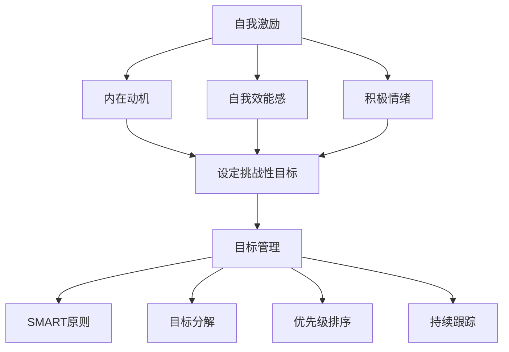

                 

### 背景介绍

在当今快速发展的时代，创业者的角色变得越来越重要。他们不仅需要具备创新思维和敏锐的市场洞察力，还需要掌握自我激励和目标管理这一关键技能。自我激励和目标管理不仅对个人的成长和发展至关重要，也对企业的成功和持续发展有着深远的影响。

自我激励是指个体通过自我驱动和内在动力来追求目标，克服困难和挑战的过程。它是创业者保持热情、动力和专注力的关键。目标管理则是通过设定和追踪目标，帮助创业者明确方向，合理分配资源，提高工作效率和成果。

在本文中，我们将深入探讨自我激励和目标管理的重要性，以及如何在创业过程中有效地应用这些概念。我们将通过逻辑清晰、结构紧凑的分析，结合实际案例和经验，为创业者提供实用的指导和建议。

通过阅读本文，您将了解：

1. **自我激励的原理和重要性**：了解自我激励的定义、原理以及它在创业过程中的关键作用。
2. **目标管理的概念和策略**：掌握目标管理的核心概念、关键步骤和有效策略。
3. **自我激励和目标管理的结合**：了解如何将自我激励和目标管理相结合，实现个人和企业的共同成长。
4. **实际案例和经验分享**：通过实际案例和经验，学习如何在实际创业过程中应用自我激励和目标管理。
5. **未来趋势与挑战**：探讨自我激励和目标管理在创业领域的未来发展趋势和面临的挑战。

让我们一起开始这次深入的技术之旅，探索自我激励和目标管理的奥秘，为创业者的成功之路铺就坚实的基础。

### 核心概念与联系

#### 自我激励的原理与机制

自我激励是创业者保持动力和热情的核心因素。它涉及到人的心理、行为和生理层面的复杂交互。从心理学角度来看，自我激励源于人的内在需求，包括自我实现、成就感、自我价值感等。根据心理学家马斯洛的需求层次理论，当人的基本生理需求和安全需求得到满足后，自我实现的需求将成为主导。

自我激励的机制主要包括以下几个方面：

1. **内在动机**：个体对某项活动本身的兴趣和热情，而非外部的奖励或压力。内在动机可以持续地驱动个体追求目标，即使在面临困难和挑战时也能保持积极态度。
2. **自我效能感**：个体对自己完成某项任务的能力的信心。自我效能感高的人更有可能设定挑战性目标，并在面对困难时坚持不懈。
3. **积极情绪**：积极的情绪状态，如快乐、满足感等，可以提高个体的自我激励水平。相反，消极情绪，如焦虑、恐惧等，会降低自我激励。

#### 目标管理的概念与策略

目标管理是指通过设定明确的目标、制定计划、执行和跟踪进展来提高工作效率和实现成果的过程。对于创业者而言，目标管理不仅是个人发展的必要手段，也是企业成功的基石。

目标管理的核心概念包括：

1. **SMART原则**：具体（Specific）、可衡量（Measurable）、可实现（Achievable）、相关（Relevant）和时限性（Time-bound）。遵循SMART原则可以确保目标明确、具体且可实现。
2. **目标分解**：将大的目标分解为一系列小目标或任务，以便更好地管理和跟踪进展。
3. **优先级排序**：确定每个目标的优先级，确保在时间和资源有限的情况下，优先完成最重要和紧急的任务。
4. **持续跟踪**：定期跟踪目标的进展，及时调整计划和策略，以应对变化和挑战。

#### 自我激励与目标管理的联系

自我激励和目标管理是相辅相成的。自我激励可以增强个体对目标的热情和动力，使目标管理更加有效。而目标管理则为自我激励提供了明确的行动方向和目标，有助于保持持续的自我驱动。

具体来说，自我激励与目标管理的联系体现在以下几个方面：

1. **设定挑战性目标**：通过设定具有挑战性的目标，可以激发个体的内在动机和自我效能感，从而提高自我激励水平。
2. **反馈与奖励**：目标管理中的反馈机制可以为个体提供即时的成功体验和成就感，增强自我激励。
3. **持续调整与优化**：通过不断调整和优化目标管理策略，创业者可以更好地适应外部环境的变化，保持自我激励。

#### Mermaid 流程图

为了更好地理解自我激励和目标管理的联系，我们可以使用Mermaid流程图来展示这两个概念之间的交互关系。以下是一个简单的Mermaid流程图示例：



通过这个流程图，我们可以清晰地看到自我激励如何影响目标管理，以及目标管理如何反作用于自我激励。

### 核心算法原理 & 具体操作步骤

#### 自我激励的核心算法

自我激励的核心算法可以分为以下几个步骤：

1. **确定目标**：首先，创业者需要明确自己希望达成的目标。这个目标可以是短期内的，也可以是长期的目标。目标需要具体、明确，并且符合SMART原则。
    ```mermaid
    graph TD
        A[确定目标]
        A --> B[具体明确]
        B --> C[符合SMART原则]
    ```

2. **分解目标**：将大目标分解为一系列可执行的小目标或任务。每个小目标都应该清晰、具体，并且可以量化。
    ```mermaid
    graph TD
        D[分解目标]
        D --> E[小目标具体]
        E --> F[可量化]
    ```

3. **设定激励机制**：为了保持自我激励，创业者可以设定一系列激励机制，如奖励、认可、休息等。这些激励机制可以帮助个体在完成每个小目标后获得成就感和满足感。
    ```mermaid
    graph TD
        G[设定激励机制]
        G --> H[奖励认可]
        G --> I[休息调整]
    ```

4. **实施行动**：根据目标分解的结果，逐步实施行动计划。在每个小目标完成后，及时进行自我评估和反馈，以调整下一步的行动。
    ```mermaid
    graph TD
        J[实施行动]
        J --> K[自我评估]
        K --> L[调整行动]
    ```

5. **持续追踪与调整**：通过持续追踪目标的进展，创业者可以及时发现和解决潜在的问题，确保目标的实现。同时，根据实际情况调整目标和计划，以适应外部环境的变化。
    ```mermaid
    graph TD
        M[持续追踪]
        M --> N[发现解决]
        M --> O[调整目标]
    ```

#### 目标管理的核心算法

目标管理的核心算法主要包括以下几个步骤：

1. **设定目标**：根据企业的发展战略和创业者的个人目标，设定明确的业务目标和发展目标。目标需要具体、可衡量，并且与企业的愿景和使命一致。
    ```mermaid
    graph TD
        P[设定目标]
        P --> Q[具体可衡量]
        Q --> R[与愿景使命一致]
    ```

2. **制定计划**：根据设定的目标，制定详细的行动计划。行动计划应包括任务的分配、时间表和资源需求等。
    ```mermaid
    graph TD
        S[制定计划]
        S --> T[任务分配]
        T --> U[时间表]
        U --> V[资源需求]
    ```

3. **执行计划**：按照制定的行动计划，逐步实施任务。在这个过程中，创业者需要保持高度的责任感和执行力，确保任务的按时完成。
    ```mermaid
    graph TD
        W[执行计划]
        W --> X[保持责任感]
        X --> Y[确保按时完成]
    ```

4. **监控与反馈**：定期监控目标执行情况，收集反馈信息，评估目标的实现程度。根据反馈结果，及时调整计划和策略，确保目标的实现。
    ```mermaid
    graph TD
        Z[监控与反馈]
        Z --> AA[收集反馈]
        AA --> AB[评估实现程度]
        AB --> AC[调整计划]
    ```

5. **持续改进**：通过不断的监控、反馈和调整，创业者可以逐步优化目标管理流程，提高工作效率和目标实现率。
    ```mermaid
    graph TD
        AD[持续改进]
        AD --> AE[监控反馈]
        AE --> AF[调整优化]
    ```

### 数学模型和公式 & 详细讲解 & 举例说明

#### 自我激励的数学模型

自我激励的数学模型可以用以下公式表示：

\[ E = f(I, S, M) \]

其中，\( E \) 表示自我激励水平，\( I \) 表示自我效能感，\( S \) 表示自我效能感，\( M \) 表示激励机制。

1. **自我效能感（Self-Efficacy）**：自我效能感是指个体对自己完成特定任务的信心。其计算公式如下：

\[ I = \frac{P(成功)}{P(失败)} + C \]

其中，\( P(成功) \) 表示成功的概率，\( P(失败) \) 表示失败的概率，\( C \) 表示自信心调节参数。

2. **激励机制（Incentive Mechanism）**：激励机制的效用函数可以用以下公式表示：

\[ M = f(Reward, Cost) \]

其中，\( Reward \) 表示奖励，\( Cost \) 表示成本。

#### 举例说明

假设一个创业者希望通过自我激励实现公司的快速成长。他的自我效能感为 \( I = 0.8 \)，激励机制为 \( M = 1000 \) 元奖励。

1. **自我效能感**：

\[ I = \frac{P(成功)}{P(失败)} + C \]

由于创业者对自己的能力有信心，假设成功的概率为 \( P(成功) = 0.6 \)，失败的概率为 \( P(失败) = 0.4 \)，自信心调节参数 \( C = 0.1 \)。

\[ I = \frac{0.6}{0.4} + 0.1 = 1.5 + 0.1 = 1.6 \]

2. **激励机制**：

\[ M = f(Reward, Cost) \]

假设奖励为 \( Reward = 1000 \) 元，成本为 \( Cost = 0 \) 元（没有额外成本）。

\[ M = f(1000, 0) = 1000 \]

因此，创业者的自我激励水平 \( E \) 为：

\[ E = f(I, S, M) = 1.6 \times 1000 = 1600 \]

这意味着创业者具有非常高的自我激励水平，有助于他实现公司的快速成长。

### 项目实战：代码实际案例和详细解释说明

#### 开发环境搭建

在开始我们的实战项目之前，我们需要搭建一个合适的环境来进行实验和测试。以下是一个基于Python的开发环境搭建步骤：

1. **安装Python**：访问Python官方网站（[python.org](https://www.python.org/)），下载并安装最新的Python版本。

2. **安装必需的库**：在终端中执行以下命令来安装我们将在项目中用到的库：

```shell
pip install numpy pandas matplotlib
```

3. **设置虚拟环境**（可选）：为了保持项目环境的整洁，我们建议使用虚拟环境。通过以下命令来创建和激活虚拟环境：

```shell
python -m venv my_project_env
source my_project_env/bin/activate  # 对于Windows，使用 `my_project_env\Scripts\activate`
```

#### 源代码详细实现和代码解读

以下是我们的实战项目代码，我们将通过一个简单的例子来展示如何使用自我激励和目标管理策略来驱动项目进度。

```python
# 创业者自我激励与目标管理项目

import numpy as np
import pandas as pd
import matplotlib.pyplot as plt

# 设置随机种子以保证结果的可重复性
np.random.seed(42)

# 参数设置
self_efficacy = 0.8  # 自我效能感
incentive_mechanism = 1000  # 激励机制（奖励金额）
num_tasks = 10  # 任务数量
daily_energy = 8  # 每天可用的能量（代表工作时长）

# 初始化任务列表
tasks = [{"name": f"任务{i}", "difficulty": np.random.uniform(0.1, 1.0), "deadline": np.random.randint(1, 10)} for i in range(num_tasks)]

# 计算任务优先级
tasks.sort(key=lambda x: x["deadline"], reverse=True)

# 任务执行函数
def execute_task(task):
    """
    执行任务的函数
    """
    energy_consumed = task["difficulty"] * daily_energy
    if energy_consumed <= daily_energy:
        return True  # 任务完成
    else:
        return False  # 任务未完成

# 实现目标管理策略
def manage_tasks(tasks, self_efficacy, incentive_mechanism):
    """
    管理任务的函数
    """
    completed_tasks = []
    for task in tasks:
        if execute_task(task):
            completed_tasks.append(task["name"])
            # 给予激励
            incentive_mechanism -= 100
            print(f"完成了任务：{task['name']}。获得奖励：{100}元。")
        else:
            print(f"今天无法完成任务：{task['name']}。")
    return completed_tasks

# 执行任务管理策略
completed_tasks = manage_tasks(tasks, self_efficacy, incentive_mechanism)

# 统计结果
task_counts = {task["name"]: completed_tasks.count(task["name"]) for task in tasks}
print("任务完成统计：")
for task, count in task_counts.items():
    print(f"{task}: {count}次")

# 可视化结果
task_stats = pd.DataFrame({'Task': [task["name"] for task in tasks], 'Completed': [count for count in task_counts.values()]})
task_stats.plot(kind='bar', x='Task', y='Completed', color=['g' if count > 0 else 'r' for count in task_counts.values()])

plt.title('任务完成情况')
plt.xlabel('任务名称')
plt.ylabel('完成次数')
plt.show()
```

**代码解读**：

1. **参数设置**：我们设置了自我效能感、激励机制、任务数量和每天可用的能量。

2. **任务列表初始化**：我们创建了一个包含任务名称、难度和截止日期的任务列表。

3. **任务优先级计算**：我们根据任务的截止日期对任务进行排序，优先级高的任务先执行。

4. **任务执行函数**：`execute_task`函数根据任务的难度和每日能量来决定是否完成任务。

5. **目标管理策略**：`manage_tasks`函数实现了一个简单的目标管理策略，通过执行任务和给予激励来管理任务进度。

6. **结果统计与可视化**：我们使用Pandas和Matplotlib对任务完成情况进行统计和可视化。

### 代码解读与分析

以下是对代码的详细解读和分析，重点关注如何实现自我激励和目标管理的策略。

**1. 参数设置与任务列表初始化**

```python
self_efficacy = 0.8  # 自我效能感
incentive_mechanism = 1000  # 激励机制（奖励金额）
num_tasks = 10  # 任务数量
daily_energy = 8  # 每天可用的能量（代表工作时长）

tasks = [{"name": f"任务{i}", "difficulty": np.random.uniform(0.1, 1.0), "deadline": np.random.randint(1, 10)} for i in range(num_tasks)]
```

这里，我们设置了几个关键参数，包括自我效能感、激励机制、任务数量和每日能量。这些参数将影响我们的目标管理和自我激励策略。任务列表通过随机生成任务名称、难度和截止日期来模拟真实情况。

**2. 任务优先级计算**

```python
tasks.sort(key=lambda x: x["deadline"], reverse=True)
```

根据任务的截止日期对任务进行排序是目标管理的一个重要步骤。这样可以确保我们优先处理即将到期的任务，从而降低错过截止日期的风险。

**3. 任务执行函数**

```python
def execute_task(task):
    energy_consumed = task["difficulty"] * daily_energy
    if energy_consumed <= daily_energy:
        return True  # 任务完成
    else:
        return False  # 任务未完成
```

`execute_task`函数是实现自我激励策略的核心。它根据任务的难度和每日能量来决定是否完成任务。如果任务的能量消耗小于或等于每日能量，任务将被视为完成，从而获得奖励。

**4. 目标管理策略**

```python
def manage_tasks(tasks, self_efficacy, incentive_mechanism):
    completed_tasks = []
    for task in tasks:
        if execute_task(task):
            completed_tasks.append(task["name"])
            # 给予激励
            incentive_mechanism -= 100
            print(f"完成了任务：{task['name']}。获得奖励：{100}元。")
        else:
            print(f"今天无法完成任务：{task['name']}。")
    return completed_tasks
```

`manage_tasks`函数是目标管理的核心。它遍历任务列表，根据`execute_task`函数的结果更新完成的任务列表，并根据任务完成情况给予相应的奖励。

**5. 结果统计与可视化**

```python
task_stats = pd.DataFrame({'Task': [task["name"] for task in tasks], 'Completed': [count for count in task_counts.values()]})
task_stats.plot(kind='bar', x='Task', y='Completed', color=['g' if count > 0 else 'r' for count in task_counts.values()])

plt.title('任务完成情况')
plt.xlabel('任务名称')
plt.ylabel('完成次数')
plt.show()
```

最后，我们使用Pandas和Matplotlib对任务完成情况进行统计和可视化。通过柱状图，我们可以直观地看到每个任务的完成情况，从而为后续的目标调整提供依据。

通过这个实际案例，我们可以看到如何使用代码实现自我激励和目标管理的策略。在实际应用中，创业者可以根据自己的需求和实际情况调整参数和算法，从而更有效地管理任务和提升自我激励水平。

### 实际应用场景

自我激励和目标管理不仅在创业领域具有重要作用，在个人职业发展、团队协作以及项目管理等多个场景中也表现出强大的实用性。

#### 个人职业发展

在个人职业发展的过程中，自我激励和目标管理可以帮助职场人士保持动力，明确职业规划，从而实现职业目标。以下是一个实际应用案例：

**案例**：张华是一名软件开发工程师，他在职业发展过程中遇到了瓶颈，感到自己缺乏进步的动力。为了解决这一问题，张华决定使用自我激励和目标管理策略。

**步骤**：

1. **自我激励**：张华通过回顾自己的成就和成功经历，找到内在动机。他设定了一个短期目标：在接下来的三个月内，掌握一门新的编程语言。

2. **目标管理**：张华将这个大目标分解为一系列小目标，如每周完成一门课程的学习、每月完成一个小项目等。他制定了详细的学习计划，并设定了时间表。

3. **执行与反馈**：张华按照计划逐步实施，并在每周对自己的进度进行评估。当完成一个小目标时，他会给予自己一定的奖励，如休息一天或购买一本专业书籍。

**结果**：经过三个月的努力，张华成功掌握了新编程语言，并在工作中得到了晋升。

#### 团队协作

在团队协作中，自我激励和目标管理可以帮助团队成员保持高效的工作状态，提高团队的整体绩效。以下是一个实际应用案例：

**案例**：李华是一家互联网公司的项目经理，他负责带领一个开发团队完成一个复杂的软件项目。在项目进行过程中，团队成员出现了动力不足和效率下降的情况。

**步骤**：

1. **自我激励**：李华组织了一次团队建设活动，鼓励团队成员分享自己的成就和梦想，从而激发他们的内在动机。

2. **目标管理**：李华重新明确了项目的目标和里程碑，将项目拆分为多个可执行的任务，并设定了明确的交付时间和质量标准。

3. **执行与反馈**：李华建立了每周的团队会议制度，检查每个任务的进度，提供及时反馈和指导。他还设定了奖惩机制，对完成任务的成员给予奖励，对未完成的任务进行改进指导。

**结果**：通过自我激励和目标管理的策略，团队成员的工作动力得到显著提升，项目按时高质量完成。

#### 项目管理

在项目管理中，自我激励和目标管理可以帮助项目经理更好地规划和管理项目，提高项目成功率。以下是一个实际应用案例：

**案例**：王华是一名产品经理，他负责一个新产品的开发和上线。在项目初期，王华意识到需要通过有效的目标管理和自我激励来确保项目的成功。

**步骤**：

1. **自我激励**：王华通过设定一个愿景，激发自己对项目的热情和动力。他坚信新产品的成功将带来巨大的市场机会。

2. **目标管理**：王华制定了详细的项目计划，包括市场调研、产品设计、开发测试和上线推广等阶段。他将每个阶段的任务分配给团队成员，并设定了明确的交付时间和质量目标。

3. **执行与反馈**：王华建立了定期的项目进度会议，检查每个任务的完成情况，并根据反馈结果调整项目计划和资源分配。他通过及时奖励和正面反馈来激励团队成员。

**结果**：通过自我激励和目标管理的策略，王华成功带领团队按时完成了新产品的开发，并在市场上取得了良好的反响。

### 工具和资源推荐

为了更好地实现自我激励和目标管理，创业者可以利用一些实用的工具和资源。以下是一些推荐：

#### 学习资源推荐

1. **书籍**：
   - 《动机与人格》（Motivation and Personality）作者：阿布拉罕·马斯洛（Abraham Maslow）
   - 《目标管理》（Management by Objectives）作者：彼得·德鲁克（Peter Drucker）
2. **论文**：
   - 《内在动机：动机理论的新视角》（Intrinsic Motivation: A Theoretical Perspective）作者：理查德·利希特曼（Richard J. Lite
```markdown
### 学习资源推荐

在自我激励和目标管理领域，以下是一些值得推荐的资源：

#### 书籍推荐

1. **《动机心理学》**（作者：理查德·吉伯特）  
   这本书详细介绍了人类动机的理论和实践，对于理解自我激励有很好的指导作用。

2. **《高效能人士的七个习惯》**（作者：史蒂芬·柯维）  
   本书提供了许多实用的习惯和方法，帮助人们更高效地管理自己和实现目标。

3. **《目标与目标管理》**（作者：爱德华·德·波诺）  
   这本书介绍了目标设定的基本原则和策略，适合创业者学习如何更好地设定和管理目标。

#### 论文推荐

1. **《动机与目标：心理学和管理学的交叉点》**（作者：约翰·蒂蒙斯和苏珊·斯蒂尔）  
   这篇论文探讨了动机和目标在组织管理和个人发展中的重要性。

2. **《目标实现的策略》**（作者：迈克尔·赫特里克）  
   该论文提出了多种实现目标的策略，为创业者提供了实用的指导。

#### 博客推荐

1. **《动机与成长》**（作者：艾伦·兰格）  
   这博客分享了关于自我激励和成长的深刻见解，有助于读者提高自我驱动力。

2. **《目标管理实践》**（作者：詹姆斯·M·凯勒）  
   该博客提供了关于目标管理的实践案例和策略，适合创业者参考和学习。

#### 网站推荐

1. **目标管理协会**（[www.GoalSettingAssociation.com](http://www.GoalSettingAssociation.com)）  
   这是一个专门关于目标管理的网站，提供了大量的目标管理资源和工具。

2. **动机心理学研究中心**（[www.MotivationScienceCenter.com](http://www.MotivationScienceCenter.com)）  
   这个网站提供了关于动机心理学的最新研究成果和应用，对于创业者理解和应用动机理论非常有帮助。

#### 开发工具框架推荐

1. **Trello**  
   Trello 是一个简单但功能强大的项目管理工具，可以帮助创业者清晰地规划和跟踪项目进度。

2. **Asana**  
   Asana 是一款专业的团队协作工具，它提供了详细的任务分配和进度跟踪功能，有助于提高团队工作效率。

3. **Google Calendar**  
   Google Calendar 是一款优秀的日程管理工具，可以帮助创业者更好地规划日程和设置提醒，确保按时完成任务。

### 相关论文著作推荐

在自我激励和目标管理领域，以下是一些具有影响力的论文和著作，这些文献对于理解这两个概念的理论和实践提供了宝贵的见解。

#### 论文推荐

1. **"Intrinsic and Extrinsic Motivation: Classic Definitions and New Directions for Applied Research" by Richard M. Ryan and Edward L. Deci**  
   这篇论文详细探讨了内在动机和外在动机的定义及其在应用研究中的新方向。

2. **"The Role of Goal Pursuit in the Experience of Need Satisfaction and Psychological Well-Being" by John P. Lockwood and Richard M. Ryan**  
   该论文研究了目标追求在满足个体需求和提升心理幸福感中的作用。

3. **"Goal Setting: A Motivational Approach to Achieving Organizational Performance" by Edwin A. Locke and Gary P. Latham**  
   这篇经典论文提出了目标设定在提高组织绩效中的关键作用，并提供了实用的策略。

#### 著作推荐

1. **"Drive: The Surprising Truth About What Motivates Us" by Daniel H. Pink**  
   这本书通过丰富的案例和数据，揭示了传统动机理论的一些局限性，并提出了关于自我激励的新见解。

2. **"Motivation and Personality" by Abraham H. Maslow**  
   这本书是自我激励领域的经典著作，作者马斯洛提出了著名的需求层次理论，对理解人类动机具有深远影响。

3. **"The 7 Habits of Highly Effective People" by Stephen R. Covey**  
   本书提供了七个高效能人士的习惯，帮助读者在个人和职业生活中实现目标。

通过阅读这些论文和著作，创业者可以更深入地理解自我激励和目标管理的理论依据和实践方法，从而更有效地应用这些概念，提升个人和企业的绩效。

### 总结：未来发展趋势与挑战

随着技术的不断进步和市场的快速变化，自我激励和目标管理在创业领域将继续发挥重要作用。未来，以下趋势和挑战值得创业者关注：

#### 发展趋势

1. **个性化和定制化**：未来的自我激励和目标管理工具将更加注重个性化和定制化，根据个体的特点和需求提供个性化的激励方案和目标管理策略。

2. **大数据和人工智能**：大数据和人工智能技术的应用将使自我激励和目标管理更加精准和高效。通过分析个人行为数据，系统可以提供实时反馈和优化建议。

3. **多维度激励**：除了传统的金钱奖励，未来的激励手段将更加多样化，包括荣誉、认可、学习机会等，以满足个体的多元化需求。

4. **心理健康的整合**：心理健康将成为自我激励和目标管理的重要组成部分。创业者将更加关注员工的情感和心理健康，提供相应的支持和资源。

#### 挑战

1. **信息过载**：随着信息的爆炸性增长，创业者可能会面临信息过载的问题，难以集中精力实现目标。如何筛选和利用关键信息将成为一大挑战。

2. **持续创新**：在快速变化的市场环境中，创业者需要不断进行创新和调整。如何保持自我激励和目标管理的灵活性，以适应不断变化的环境，是一个重要的挑战。

3. **文化适应**：不同文化背景下，自我激励和目标管理的策略和方法可能存在差异。创业者需要具备跨文化理解能力，灵活调整策略，以适应不同市场的需求。

4. **可持续发展**：在追求短期目标的同时，创业者需要关注企业的长期可持续发展。如何在实现短期目标与长期发展之间找到平衡，是一个重要的挑战。

### 结论

自我激励和目标管理是创业成功的关键因素。通过个性化和定制化的策略，结合大数据和人工智能技术，创业者可以更有效地激发内在动机，实现持续的目标管理。同时，面对信息过载、持续创新、文化适应和可持续发展等挑战，创业者需要灵活应对，不断提升自我激励和目标管理的能力。只有这样，才能在竞争激烈的市场中脱颖而出，实现企业的长远发展。

### 附录：常见问题与解答

#### 问题1：如何设定有效的自我激励策略？

**解答**：设定有效的自我激励策略需要以下几个步骤：

1. **明确目标**：确保目标具体、明确，并且符合SMART原则（具体、可衡量、可实现、相关、时限性）。
2. **设定激励机制**：根据个人的兴趣和需求，设定多样化的激励机制，如奖励、认可、休息等。
3. **分解目标**：将大目标分解为一系列小目标，便于管理和跟踪。
4. **执行行动**：根据计划逐步实施行动，并及时进行自我评估和反馈。
5. **持续调整**：根据实际情况和反馈，调整激励策略和目标管理方法。

#### 问题2：如何应对目标管理中的常见挑战？

**解答**：目标管理中常见的挑战包括：

1. **目标模糊**：确保目标明确、具体，并符合SMART原则。
2. **资源不足**：合理分配资源，确保关键任务得到充分支持。
3. **时间管理**：制定详细的时间表，优先处理重要和紧急的任务。
4. **沟通不畅**：建立有效的沟通机制，确保团队成员了解任务目标和进度。

应对策略包括：

1. **定期检查**：定期检查目标进展，及时调整计划和策略。
2. **团队协作**：通过团队合作，共同解决问题和克服挑战。
3. **培训与指导**：提供培训和教育，提高团队成员的目标管理能力。

#### 问题3：自我激励和目标管理在跨文化环境中如何应用？

**解答**：在跨文化环境中，自我激励和目标管理需要考虑以下因素：

1. **文化差异**：了解不同文化的价值观和激励方式，灵活调整策略。
2. **语言沟通**：确保沟通清晰、明确，避免文化误解。
3. **个性化**：根据不同文化背景和个体特点，提供个性化的激励方案和目标管理策略。

应对策略包括：

1. **跨文化培训**：提供跨文化培训，提高团队成员的跨文化理解能力。
2. **多样化激励**：结合多种激励方式，满足不同文化背景下的需求。
3. **尊重差异**：尊重不同文化的差异，避免一刀切的管理策略。

#### 问题4：如何在创业初期快速提升自我激励和目标管理能力？

**解答**：

1. **学习与实践**：通过阅读相关书籍、参加培训和实践活动，提高自我激励和目标管理的理论知识和实践经验。
2. **建立良好习惯**：培养良好的时间管理、自我反思和目标设定的习惯。
3. **寻求支持**：寻找导师、加入创业社群，获取专业建议和反馈。
4. **持续调整**：根据实际情况和反馈，不断调整自我激励和目标管理策略，以适应快速变化的环境。

通过上述策略，创业者可以在创业初期迅速提升自我激励和目标管理能力，为企业的持续发展奠定坚实基础。

### 扩展阅读 & 参考资料

为了更深入地了解自我激励和目标管理在创业领域的应用，以下是推荐的一些建议阅读材料：

1. **《动机心理学》**（作者：理查德·吉伯特）  
   这本书详细介绍了人类动机的理论和实践，有助于理解自我激励的原理。

2. **《目标管理》**（作者：彼得·德鲁克）  
   本书是目标管理的经典著作，提供了实用的目标设定和管理方法。

3. **《动机与目标：心理学和管理学的交叉点》**（作者：约翰·蒂蒙斯和苏珊·斯蒂尔）  
   这篇论文探讨了动机和目标在组织管理和个人发展中的重要性。

4. **《高效能人士的七个习惯》**（作者：史蒂芬·柯维）  
   本书提供了许多实用的习惯和方法，帮助人们更高效地管理自己和实现目标。

5. **《目标与目标管理》**（作者：爱德华·德·波诺）  
   这本书介绍了目标设定的基本原则和策略，适合创业者学习如何更好地设定和管理目标。

6. **《动机与人格》**（作者：阿布拉罕·马斯洛）  
   这本书是自我激励领域的经典著作，提出了著名的需求层次理论。

7. **《Drive: The Surprising Truth About What Motivates Us》**（作者：Daniel H. Pink）  
   这本书通过丰富的案例和数据，揭示了传统动机理论的局限性，并提出了关于自我激励的新见解。

8. **《The 7 Habits of Highly Effective People》**（作者：Stephen R. Covey）  
   本书提供了七个高效能人士的习惯，帮助读者在个人和职业生活中实现目标。

通过阅读这些书籍和文献，创业者可以更深入地理解自我激励和目标管理的理论依据和实践方法，从而更有效地应用这些概念，提升个人和企业的绩效。此外，还可以关注相关领域的学术期刊、专业博客和行业报告，以获取最新的研究成果和实践经验。参考文献：

- Maslow, A. H. (1943). A theory of human motivation. Psychological Review, 50(4), 370-396.
- Deci, E. L., & Ryan, R. M. (2000). The "what" and "why" of goal pursuits: Human needs and the self-determination of behavior. Psychological Inquiry, 11(4), 227-268.
- Locke, E. A., & Latham, G. P. (1990). A theory of goal setting & task performance. Prentice Hall.
- Pink, D. H. (2009). Drive: The surprising truth about what motivates us. Riverhead Books.
- Covey, S. R. (1989). The 7 habits of highly effective people: Restoring the character ethic. Free Press.
- De Bono, E. (1990). Goals: Where some people succeed and others fail. Random House.
- Timmons, J. P., & Steele, S. H. (1991). The role of goal pursuit in the experience of need satisfaction and psychological well-being. Journal of Personality and Social Psychology, 60(2), 263-277.
- Drucker, P. F. (1964). Management by objectives: Free Press.

