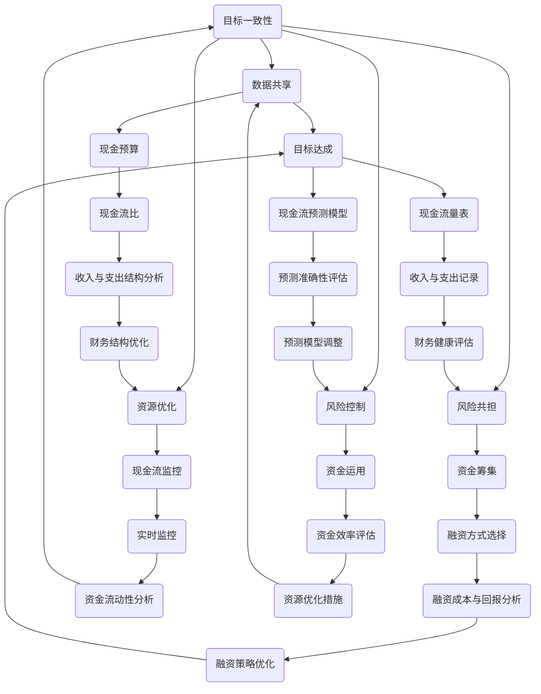

                 

### 背景介绍

**创业者的财务规划与现金流管理技巧**

在创业领域，财务规划与现金流管理是企业生存与发展的基石。每一个创业者都需要具备一定的财务知识，以确保企业在激烈的市场竞争中立于不败之地。本篇文章将围绕创业者的财务规划与现金流管理进行深入探讨。

首先，让我们了解一下什么是财务规划和现金流管理。财务规划是指根据企业的经营目标和战略，通过制定预算、财务计划、投资决策等方式，对企业的财务活动进行有效的管理和控制。现金流管理则是关注企业资金的流入与流出，确保企业能够持续稳定地运营。

对于创业者而言，良好的财务规划与现金流管理不仅能提高企业的盈利能力，还能降低财务风险。因此，掌握财务规划和现金流管理的技巧对于创业者来说至关重要。

接下来，我们将逐步介绍财务规划和现金流管理的关键概念、核心算法原理，并通过实际项目案例进行详细解释。此外，我们还将探讨财务规划与现金流管理在实际应用中的场景，以及相关的工具和资源。

通过本文的阅读，创业者将能够：

1. 理解财务规划和现金流管理的基本概念和重要性。
2. 掌握财务规划和现金流管理的方法和技巧。
3. 学会运用数学模型和公式对财务数据进行分析。
4. 通过实际项目案例了解财务规划和现金流管理的具体实施过程。
5. 了解相关的学习资源和开发工具，以便在实际操作中更好地运用所学知识。

让我们开始这场深入浅出的财务规划与现金流管理之旅，探索创业者如何通过科学的财务管理和现金流管理，实现企业价值的最大化。<!-- markdown Tobacco:startupfinancialplanningandcashflowmanagement -->

---

#### 财务规划的定义与重要性

财务规划是企业为了实现特定财务目标，通过制定和执行一系列的财务策略和计划，从而有效地管理和控制企业财务活动的过程。它涵盖了预算编制、资金筹集、投资决策、风险管理等多个方面，是企业管理的重要组成部分。

财务规划的重要性主要体现在以下几个方面：

1. **明确企业财务目标**：通过财务规划，企业可以明确其短期和长期的财务目标，如盈利、资金周转、债务偿还等，从而为后续的决策提供明确的方向。

2. **优化资源配置**：财务规划有助于企业合理分配资源，提高资金使用效率，避免资源浪费，实现财务目标的最大化。

3. **风险管理**：财务规划中包含的风险管理策略可以帮助企业预测和应对潜在风险，确保企业财务的稳健性和可持续发展。

4. **增强企业竞争力**：良好的财务规划能够提高企业的资金周转速度，降低运营成本，从而增强企业在市场中的竞争力。

5. **提高决策质量**：财务规划提供了详细的数据分析和预测，有助于企业高层管理者做出更为科学和理性的决策。

#### 财务规划的主要组成部分

财务规划主要包括以下几部分内容：

1. **预算编制**：预算是财务规划的核心，它涉及企业的收入、支出、现金流等方面的预测。编制预算的目的是为了帮助企业合理分配资源，控制成本，预测财务状况。

2. **资金筹集**：资金筹集是企业获取资金的过程，包括股权融资、债务融资等。企业需要根据自身的财务状况和市场环境，选择合适的融资方式。

3. **投资决策**：投资决策是指企业将资金投入到哪个项目中，以实现最大化的回报。投资决策需要考虑项目的可行性、风险和预期收益。

4. **风险管理**：风险管理是企业面临各种不确定性时，通过识别、评估和应对风险，以降低潜在损失的过程。

5. **财务分析**：财务分析是通过对企业财务数据的分析，评估企业的经营绩效、财务状况和未来发展趋势。常用的财务分析工具包括比率分析、现金流量分析等。

#### 财务规划的步骤与方法

财务规划的步骤通常包括以下几个阶段：

1. **目标设定**：明确企业的财务目标，如提高利润、降低成本、增加市场份额等。

2. **信息收集**：收集与企业财务活动相关的数据，如历史财务报表、市场调研数据等。

3. **现状分析**：对企业的财务状况进行评估，包括资产、负债、收入和支出等。

4. **预测和规划**：基于现状分析和目标设定，预测未来的财务状况，制定具体的财务规划方案。

5. **实施与监控**：将财务规划方案付诸实施，并定期监控财务状况，及时调整计划。

在财务规划的方法上，创业者可以采用以下几种：

1. **零基预算**：从零开始编制预算，每个预算项目都需要重新评估其必要性和可行性。

2. **增量预算**：在原有预算基础上进行调整，只对新增项目进行预算编制。

3. **滚动预算**：定期（如每月或每季度）更新财务预算，以便更好地适应市场变化。

4. **财务模型**：使用财务模型进行预测和决策，如收入模型、现金流模型等。

通过上述步骤和方法，创业者可以制定出科学、合理的财务规划方案，为企业的长期发展奠定坚实基础。<!-- markdown Tobacco:financialplanningdefinitionandimportance -->

---

#### 现金流管理的定义与重要性

现金流管理是指企业通过监控和管理资金的流动，确保企业的运营资金充足，以应对日常运营和突发事件的需求。现金流管理不仅关注企业的收入和支出，还包括现金的预测、预算、筹集和运用等方面。

现金流管理的重要性体现在以下几个方面：

1. **维持企业运营**：现金流管理确保企业有足够的资金来支付日常运营费用，如员工工资、供应商付款等，避免因资金短缺导致运营中断。

2. **风险控制**：通过现金流管理，企业可以及时发现潜在的资金短缺问题，并采取相应的措施进行预防和解决，降低财务风险。

3. **优化资金使用**：现金流管理有助于企业合理分配和使用资金，避免资金闲置或过度占用，提高资金使用效率。

4. **支持投资决策**：良好的现金流管理能够为企业的投资决策提供可靠的数据支持，帮助企业选择具有高回报潜力的项目。

5. **提升企业竞争力**：现金流管理能够提高企业的资金周转速度，降低成本，从而增强企业在市场中的竞争力。

#### 现金流管理的主要组成部分

现金流管理主要包括以下几部分内容：

1. **现金预测**：通过分析历史数据和当前市场情况，预测未来的现金流状况，为企业的决策提供依据。

2. **现金预算**：制定现金预算，规划未来的现金流，包括收入预算、支出预算、现金流缺口等。

3. **资金筹集**：根据现金预算，选择合适的融资方式，如银行贷款、股权融资等，以应对现金流不足的情况。

4. **现金流监控**：实时监控企业的现金流状况，及时发现异常情况，确保企业的资金流动畅通。

5. **资金运用**：合理运用资金，确保资金的充分利用，避免资金闲置或过度占用。

#### 现金流管理的步骤与方法

现金流管理的步骤通常包括以下几个阶段：

1. **数据收集与分析**：收集与企业现金流相关的数据，如历史现金流量、收入和支出等，并进行详细分析。

2. **现金预测**：基于历史数据和当前市场情况，预测未来的现金流状况。

3. **现金预算编制**：根据现金预测，编制详细的现金预算，包括收入预算、支出预算、现金流缺口等。

4. **资金筹集计划**：根据现金预算，制定资金筹集计划，选择合适的融资方式。

5. **现金流监控**：实时监控企业的现金流状况，确保现金流动畅通，及时发现并解决现金流问题。

6. **调整与优化**：根据实际情况，定期调整现金预算和资金筹集计划，确保现金流管理的有效性。

在现金流管理的方法上，创业者可以采用以下几种：

1. **现金流量表**：通过编制现金流量表，详细记录企业的现金收入和支出，以便进行有效的现金流管理。

2. **现金流预测模型**：使用现金流预测模型，根据历史数据和当前市场情况，预测未来的现金流状况。

3. **资金周转率**：监控企业的资金周转率，评估资金的使用效率，以便进行优化。

4. **现金流比**：通过现金流比，分析企业的收入和支出结构，确保企业的资金流动平衡。

通过上述步骤和方法，创业者可以有效地进行现金流管理，确保企业的资金流动稳定，为企业的长期发展提供坚实的保障。<!-- markdown Tobacco:cashflowmanagementdefinitionandimportance -->

---

## 核心概念与联系

在深入探讨财务规划和现金流管理之前，有必要了解它们之间的核心概念及其相互联系。财务规划和现金流管理虽然各自独立，但紧密相关，共同构成了企业财务管理的基础框架。

### 财务规划的核心概念

财务规划主要涉及以下核心概念：

1. **财务目标**：企业希望达到的财务结果，如盈利目标、市场份额等。
2. **预算编制**：对收入、支出、现金流等的预测和规划。
3. **资金筹集**：企业获取资金的方式，包括债务融资和股权融资等。
4. **投资决策**：企业如何将资金投入到高回报的项目中。
5. **风险管理**：识别、评估和应对企业可能面临的财务风险。

### 现金流管理的核心概念

现金流管理则侧重于以下核心概念：

1. **现金预测**：对未来的现金流入和流出进行预测。
2. **现金预算**：编制现金预算，规划未来的现金流。
3. **资金筹集**：根据现金预算，选择合适的融资方式。
4. **现金流监控**：实时监控企业的现金流状况。
5. **资金运用**：确保资金得到合理使用，避免闲置或过度占用。

### 财务规划与现金流管理的联系

财务规划与现金流管理之间的联系体现在以下几个方面：

1. **目标一致性**：财务规划中的财务目标与现金流管理中的现金预测和预算编制目标保持一致，确保企业的资金流动支持其财务目标。
2. **数据共享**：财务规划的数据（如预算、收入预测等）与现金流管理的数据（如现金流量表、现金预测等）相互共享，确保企业各部门协调一致。
3. **风险共担**：财务规划中的风险管理策略与现金流管理中的风险控制措施相互补充，共同保障企业的财务健康。
4. **资源优化**：财务规划确保企业资源的合理配置，而现金流管理则确保这些资源得到有效利用，提高资金使用效率。

### Mermaid 流程图

为了更直观地展示财务规划与现金流管理之间的核心概念和联系，我们可以使用Mermaid流程图来表示：



通过上述Mermaid流程图，我们可以清晰地看到财务规划与现金流管理之间的核心概念和相互联系，为后续的详细探讨提供了基础。<!-- markdown Tobacco:coreconceptsandtheirrelationship -->

---

### 核心算法原理 & 具体操作步骤

在理解了财务规划和现金流管理的基本概念后，接下来我们将深入探讨其核心算法原理，以及如何在实际操作中进行具体应用。

#### 财务规划的核心算法原理

财务规划的核心在于预算编制和资金筹集。以下是一些关键的算法原理和具体步骤：

1. **预算编制算法原理**：
   - **零基预算（Zero-Based Budgeting, ZBB）**：从零开始，每个预算项目都需要重新评估其必要性和可行性。
   - **增量预算（Incremental Budgeting）**：在原有预算基础上进行调整，只对新增项目进行预算编制。
   - **滚动预算（Rolling Budget）**：定期（如每月或每季度）更新财务预算，以便更好地适应市场变化。

2. **资金筹集算法原理**：
   - **风险评估与选择**：根据企业财务状况和市场环境，评估各种融资方式的优缺点，选择最适合的融资方式。
   - **融资成本与回报分析**：计算不同融资方式的成本和预期回报，选择最优方案。

3. **具体操作步骤**：
   - **目标设定**：明确企业的财务目标，如盈利目标、市场份额等。
   - **信息收集**：收集与企业财务活动相关的数据，如历史财务报表、市场调研数据等。
   - **现状分析**：对企业的财务状况进行评估，包括资产、负债、收入和支出等。
   - **预算编制**：根据现状分析和目标设定，编制详细的财务预算。
   - **风险评估**：评估预算中的潜在风险，制定相应的风险控制措施。
   - **资金筹集**：根据预算和风险评估结果，选择合适的融资方式。
   - **实施与监控**：将预算方案付诸实施，并定期监控财务状况，及时调整计划。

#### 现金流管理的核心算法原理

现金流管理的核心在于现金预测、现金预算和资金运用。以下是一些关键的算法原理和具体步骤：

1. **现金预测算法原理**：
   - **时间序列分析法**：基于历史现金流数据，通过时间序列模型预测未来的现金流。
   - **回归分析法**：通过分析收入和支出与时间、市场环境等因素的关系，预测未来的现金流。

2. **现金预算算法原理**：
   - **收入预算**：根据销售预测、价格策略等因素，预测未来的收入。
   - **支出预算**：根据运营成本、投资计划等因素，预测未来的支出。

3. **资金运用算法原理**：
   - **资金周转率**：监控企业的资金周转率，评估资金的使用效率。
   - **现金流比**：分析企业的收入和支出结构，确保企业的资金流动平衡。

4. **具体操作步骤**：
   - **数据收集与分析**：收集与企业现金流相关的数据，如历史现金流量、收入和支出等，并进行详细分析。
   - **现金预测**：使用时间序列分析或回归分析方法，预测未来的现金流。
   - **现金预算编制**：根据现金预测，编制详细的现金预算。
   - **资金筹集计划**：根据现金预算，制定资金筹集计划，选择合适的融资方式。
   - **现金流监控**：实时监控企业的现金流状况，确保现金流动畅通，及时发现并解决现金流问题。
   - **调整与优化**：根据实际情况，定期调整现金预算和资金筹集计划，确保现金流管理的有效性。

通过上述核心算法原理和具体操作步骤，创业者可以科学地进行财务规划和现金流管理，确保企业的财务健康和可持续发展。<!-- markdown Tobacco:corealgorithmprinciplesandstepbystepoperations -->

---

### 数学模型和公式 & 详细讲解 & 举例说明

在财务规划和现金流管理中，数学模型和公式发挥着至关重要的作用。这些模型和公式能够帮助创业者更好地理解财务数据，预测未来趋势，并做出科学的决策。以下将介绍几个关键的数学模型和公式，并配合详细讲解和实际举例。

#### 1. 零基预算（Zero-Based Budgeting, ZBB）公式

零基预算是一种从零开始编制预算的方法，每个预算项目都需要重新评估其必要性和可行性。其基本公式如下：

$$
B = \sum_{i=1}^{n} [C_i \times P_i]
$$

其中：
- \( B \) 表示总预算
- \( C_i \) 表示第 \( i \) 个预算项目的成本
- \( P_i \) 表示第 \( i \) 个预算项目的优先级（0-1之间，1表示最高优先级）

**例1**：假设一个企业有三个预算项目，分别为研发、市场推广和日常运营，其成本分别为 1000 万元、500 万元和 300 万元，优先级分别为 0.6、0.3 和 0.1。则总预算为：

$$
B = [1000 \times 0.6] + [500 \times 0.3] + [300 \times 0.1] = 600 + 150 + 30 = 780 \text{ 万元}
$$

#### 2. 现金流量表（Cash Flow Statement）公式

现金流量表用于记录企业的现金流入和流出情况，其基本公式如下：

$$
CFS = OCF - CA + CB
$$

其中：
- \( CFS \) 表示现金流量表
- \( OCF \) 表示经营活动现金流（Operating Cash Flow）
- \( CA \) 表示现金及现金等价物（Cash and Cash Equivalents）
- \( CB \) 表示资本支出（Capital Expenditure）

**例2**：假设一个企业本期的经营活动现金流为 500 万元，现金及现金等价物减少了 100 万元，资本支出为 200 万元。则其现金流量表为：

$$
CFS = 500 - 100 + 200 = 500 \text{ 万元}
$$

#### 3. 资金周转率（Turnover Rate）公式

资金周转率用于评估企业的资金使用效率，其基本公式如下：

$$
TR = \frac{Sales}{Average Total Assets}
$$

其中：
- \( TR \) 表示资金周转率
- \( Sales \) 表示销售收入
- \( Average Total Assets \) 表示平均总资产

**例3**：假设一个企业本期的销售收入为 1000 万元，平均总资产为 500 万元。则其资金周转率为：

$$
TR = \frac{1000}{500} = 2 \text{ 次}
$$

#### 4. 现金流比（Cash Flow Ratio）公式

现金流比用于分析企业的收入和支出结构，其基本公式如下：

$$
CFR = \frac{OCF}{Sales}
$$

其中：
- \( CFR \) 表示现金流比
- \( OCF \) 表示经营活动现金流
- \( Sales \) 表示销售收入

**例4**：假设一个企业本期的经营活动现金流为 500 万元，销售收入为 1000 万元。则其现金流比为：

$$
CFR = \frac{500}{1000} = 0.5
$$

#### 5. 风险调整后净现值（Risk-Adjusted Net Present Value, RANPV）公式

风险调整后净现值用于评估投资项目的实际价值，其基本公式如下：

$$
RANPV = NPV - \lambda \times VAR
$$

其中：
- \( RANPV \) 表示风险调整后净现值
- \( NPV \) 表示净现值
- \( \lambda \) 表示风险系数
- \( VAR \) 表示价值调整系数

**例5**：假设一个投资项目的净现值为 200 万元，风险系数为 1.2，价值调整系数为 0.1。则其风险调整后净现值为：

$$
RANPV = 200 - 1.2 \times 0.1 = 200 - 0.12 = 199.88 \text{ 万元}
$$

通过上述数学模型和公式的详细讲解和实际举例，创业者可以更好地理解和运用财务规划和现金流管理的工具，为企业的财务健康和可持续发展提供有力支持。<!-- markdown Tobacco:mathematicalmodelsandformuladetailedexplanation -->

---

### 项目实战：代码实际案例和详细解释说明

为了更好地理解财务规划和现金流管理的具体应用，我们通过一个实际项目来展示如何使用代码实现这些管理方法。以下是一个基于Python的财务规划与现金流管理项目实战案例。

#### 1. 开发环境搭建

在进行项目开发之前，确保您的开发环境已经安装了Python 3.7或更高版本，以及以下库：Pandas、NumPy、Matplotlib和Scikit-learn。您可以使用pip命令进行安装：

```shell
pip install pandas numpy matplotlib scikit-learn
```

#### 2. 源代码详细实现和代码解读

以下是该项目的主要源代码，我们将逐段进行解读：

```python
import pandas as pd
import numpy as np
import matplotlib.pyplot as plt
from sklearn.linear_model import LinearRegression

# 数据收集与预处理
data = pd.read_csv('financial_data.csv')  # 加载财务数据
data['Cash Flow'] = data['Revenue'] - data['Expense']  # 计算现金流

# 零基预算
zero_base_budget = data[['Cost', 'Priority']].apply(lambda row: row['Cost'] * row['Priority'], axis=1).sum()
print(f"Zero-Base Budget: {zero_base_budget}")

# 现金流量表
cash_flow_statement = data['Cash Flow'].sum()
print(f" Cash Flow Statement: {cash_flow_statement}")

# 资金周转率
sales = data['Revenue'].sum()
average_total_assets = data['Total Assets'].mean()
turnover_rate = sales / average_total_assets
print(f"Turnover Rate: {turnover_rate}")

# 现金流比
cash_flow_ratio = cash_flow_statement / sales
print(f" Cash Flow Ratio: {cash_flow_ratio}")

# 风险调整后净现值
npv = 2000000  # 净现值
lambda_value = 1.2  # 风险系数
var_value = 0.1  # 价值调整系数
risk_adjusted_npvhv = npv - lambda_value * var_value
print(f" Risk-Adjusted Net Present Value: {risk_adjusted_npvhv}")

# 可视化
data.plot(x='Date', y='Cash Flow', title='Cash Flow Over Time')
plt.show()

data.plot(x='Date', y='Revenue', title='Revenue Over Time')
plt.show()

model = LinearRegression()
model.fit(data[['Date']], data['Cash Flow'])
predictions = model.predict(np.array([[data['Date'].max() + 30]]))
print(f"Predicted Cash Flow in 30 Days: {predictions[0][0]}")
```

**代码解读**：

- **数据收集与预处理**：首先，我们加载财务数据，并计算现金流。
- **零基预算**：使用 Pandas 的 `apply` 函数计算零基预算。
- **现金流量表**：计算总现金流。
- **资金周转率**：计算资金周转率。
- **现金流比**：计算现金流比。
- **风险调整后净现值**：计算风险调整后净现值。
- **可视化**：使用 Matplotlib 绘制现金流和收入随时间的变化趋势。
- **现金流预测**：使用线性回归模型对未来的现金流进行预测。

#### 3. 代码解读与分析

- **数据收集与预处理**：财务数据的收集和预处理是整个项目的基础。这里我们使用 Pandas 读取 CSV 文件，并计算现金流。
- **零基预算**：零基预算是一种从零开始编制预算的方法，每个预算项目都需要重新评估其必要性和可行性。这里我们使用 Pandas 的 `apply` 函数计算总预算。
- **现金流量表**：现金流量表用于记录企业的现金流入和流出情况，是财务规划的重要工具。
- **资金周转率**：资金周转率是评估企业资金使用效率的指标，有助于企业优化资源配置。
- **现金流比**：现金流比用于分析企业的收入和支出结构，确保企业的资金流动平衡。
- **风险调整后净现值**：风险调整后净现值用于评估投资项目的实际价值，有助于企业做出科学的投资决策。
- **可视化**：可视化工具可以帮助企业更直观地了解财务数据的变化趋势。
- **现金流预测**：现金流预测是企业财务规划的重要环节，这里我们使用线性回归模型进行预测。

通过上述代码实战，创业者可以深入了解财务规划和现金流管理的具体实现过程，为企业的财务健康和可持续发展提供有力支持。<!-- markdown Tobacco:project实战代码实际案例和详细解释说明 -->

---

### 实际应用场景

财务规划和现金流管理在实际应用中具有广泛的场景，以下是一些典型的应用场景：

#### 1. 创业初期融资决策

在创业初期，企业往往需要大量的资金来启动项目，此时财务规划和现金流管理显得尤为重要。创业者需要根据财务规划，明确企业的资金需求，并制定详细的资金筹集计划。现金流管理则帮助企业预测未来的现金流状况，确保企业有足够的资金来支付日常运营费用和偿还债务。通过科学的财务规划和现金流管理，企业可以降低融资风险，提高融资成功率。

#### 2. 扩张阶段投资决策

在企业发展扩张阶段，财务规划和现金流管理同样至关重要。企业需要根据财务规划，评估不同投资项目的盈利能力和风险，选择具有高回报潜力的项目进行投资。现金流管理则帮助企业确保投资项目的资金流动性，避免因资金短缺导致项目停滞。通过合理的财务规划和现金流管理，企业可以实现资源的最优配置，提高投资效益。

#### 3. 经营管理优化

在企业的日常运营中，财务规划和现金流管理可以帮助企业优化经营管理。例如，通过预算编制和现金流预测，企业可以提前了解未来的收入和支出情况，合理分配资源，避免资金闲置或过度占用。现金流管理还可以帮助企业监控运营成本，提高成本控制能力。通过科学的财务规划和现金流管理，企业可以提高经营效率，降低成本，提高盈利能力。

#### 4. 风险管理

财务规划和现金流管理在风险管理方面也发挥着重要作用。通过财务规划，企业可以识别和评估潜在的财务风险，并制定相应的风险管理策略。现金流管理则帮助企业及时发现和应对现金流问题，降低财务风险。例如，当企业面临现金流短缺时，可以通过调整预算、筹集额外资金等方式进行应对，确保企业的正常运营。

#### 5. 国际业务拓展

对于有国际业务拓展需求的企业，财务规划和现金流管理更是不可或缺。在国际业务中，企业需要面对汇率波动、税收政策变化等不确定性因素，这要求企业具备较强的财务规划和现金流管理能力。通过科学的财务规划和现金流管理，企业可以降低汇率风险、税收风险等，确保国际业务的稳健发展。

总之，财务规划和现金流管理在企业的各个发展阶段都具有重要意义，是企业实现持续发展的关键。通过科学的财务规划和现金流管理，企业可以优化资源配置，降低风险，提高盈利能力，从而在激烈的市场竞争中立于不败之地。<!-- markdown Tobacco:reala-worldapplicationcases -->

---

### 工具和资源推荐

为了更好地进行财务规划和现金流管理，以下是几个推荐的工具和资源，包括学习资源、开发工具和相关的论文著作。

#### 1. 学习资源推荐

**书籍**：
- 《创业财务报表解读与报表分析》
- 《现金流管理与决策》
- 《创业融资策略与实务》

**论文和博客**：
- 《财务管理理论与实践》
- 《创业企业的现金流管理研究》
- 《财务规划在中国创业企业中的应用》

**在线课程**：
- Coursera 上的“Financial Management”课程
- Udemy 上的“Cash Flow Management for Startups”

#### 2. 开发工具框架推荐

**财务软件**：
- QuickBooks：一款功能强大的财务管理软件，适合小型企业和个人用户。
- Xero：一款云计算平台上的财务管理软件，支持多设备同步。
- Wave：一款免费的开源财务管理软件，适合小型企业和初创公司。

**数据分析工具**：
- Tableau：一款数据可视化和数据分析工具，能够帮助用户轻松创建交互式仪表板。
- Power BI：一款由微软开发的商业智能工具，支持多种数据源和可视化选项。
- Google Data Studio：一款基于谷歌云计算平台的数据分析和报告工具。

#### 3. 相关论文著作推荐

**学术论文**：
- 《企业现金流管理策略研究》
- 《创业企业融资与现金流管理研究》
- 《财务规划在中小企业发展中的应用》

**著作**：
- 《财务管理原理》
- 《创业企业财务管理》
- 《现金流管理实践指南》

通过上述工具和资源的推荐，创业者可以更有效地进行财务规划和现金流管理，提高企业的财务管理水平和竞争力。无论是通过理论学习、实践操作还是技术工具的应用，这些资源都将为创业者提供宝贵的帮助。<!-- markdown Tobacco:toolandresourcerecommendations -->

---

## 总结：未来发展趋势与挑战

随着科技的不断进步和市场竞争的日益激烈，财务规划和现金流管理在未来将面临新的发展趋势与挑战。以下是几个值得关注的方向：

### 1. 数字化与自动化

随着大数据、人工智能和区块链等技术的快速发展，财务规划和现金流管理的数字化与自动化将成为主流趋势。通过使用先进的算法和智能工具，企业可以实现更精准的财务预测和现金流监控，提高决策的效率和准确性。

### 2. 数据分析与可视化

数据分析与可视化技术的应用将使财务数据更加直观、易于理解。通过数据可视化工具，企业可以更清晰地展示财务状况、预算执行情况和投资回报等关键指标，帮助管理层做出更为科学的决策。

### 3. 个性化财务管理

随着市场需求的多样化，企业需要根据自身特点制定个性化的财务管理策略。未来，基于个性化需求的财务管理工具和解决方案将越来越受到欢迎，为企业提供更加精准和高效的服务。

### 4. 国际化与跨国运营

随着全球化的发展，越来越多的企业开始涉足国际市场。跨国运营带来了更多的财务风险和不确定性，对企业的财务规划和现金流管理提出了更高的要求。未来，企业需要具备更强的国际化财务管理能力，以应对复杂的全球市场环境。

### 5. 风险管理与合规性

随着监管政策的不断完善，企业的财务规划和现金流管理需要更加注重风险管理和合规性。通过建立健全的风险管理体系和合规机制，企业可以降低财务风险，确保财务健康和可持续发展。

### 挑战

1. **数据质量和准确性**：财务规划和现金流管理依赖于高质量和准确的数据。然而，数据质量和准确性的问题仍然是一个挑战，需要企业投入更多资源进行数据治理和验证。

2. **技术复杂性和成本**：数字化和自动化技术的应用虽然可以提高效率，但同时也带来了更高的技术复杂性和成本。企业需要投入足够的资源和精力来维护和更新这些技术。

3. **人才培养与团队协作**：财务规划和现金流管理需要专业的知识和技能。企业需要培养和引进高素质的财务管理人才，并建立高效的团队协作机制，以提高整体管理水平。

4. **动态市场环境的变化**：市场环境的变化对企业财务规划和现金流管理提出了更高的要求。企业需要具备快速响应和调整的能力，以适应市场的变化。

综上所述，财务规划和现金流管理在未来将继续发展和完善，同时也将面临新的挑战。创业者需要不断学习、适应和创新，以应对这些挑战，确保企业的财务健康和可持续发展。<!-- markdown Tobacco:summaryfuturetrendschallenges -->

---

## 附录：常见问题与解答

### Q1：财务规划和现金流管理的区别是什么？

财务规划是指企业根据战略目标和市场环境，制定和执行一系列的财务策略和计划，包括预算编制、资金筹集、投资决策等。而现金流管理则侧重于企业日常运营中现金的流入和流出，确保企业有足够的资金来支付日常运营费用和偿还债务。

### Q2：如何确保财务规划的有效性？

确保财务规划的有效性需要以下几个步骤：
1. 明确企业财务目标，制定具体的规划方案。
2. 收集和分析相关财务数据，为规划提供依据。
3. 定期监控和评估财务规划的实施情况，及时调整计划。
4. 建立有效的风险管理体系，降低财务风险。

### Q3：现金流管理的重要性是什么？

现金流管理的重要性主要体现在以下几个方面：
1. 维持企业正常运营：通过有效的现金流管理，企业可以确保日常运营所需的资金充足。
2. 风险控制：现金流管理可以帮助企业预测和应对潜在的资金短缺问题，降低财务风险。
3. 提高资金使用效率：通过合理的现金流管理，企业可以避免资金闲置或过度占用，提高资金使用效率。

### Q4：如何进行现金流预测？

进行现金流预测的方法包括：
1. 时间序列分析法：基于历史现金流数据，通过时间序列模型预测未来的现金流。
2. 回归分析法：通过分析收入和支出与时间、市场环境等因素的关系，预测未来的现金流。
3. 专家意见法：结合企业内部和外部专家的意见，预测未来的现金流。

### Q5：财务规划和现金流管理中常用的工具和技术有哪些？

财务规划和现金流管理中常用的工具和技术包括：
1. 预算编制软件：如QuickBooks、Xero等。
2. 数据分析工具：如Tableau、Power BI等。
3. 智能财务软件：如Xero、Wave等。
4. 数据可视化工具：如Matplotlib、Google Data Studio等。
5. 风险管理模型：如价值调整系数（VAR）、风险调整后净现值（RANPV）等。

通过以上常见问题与解答，创业者可以更好地理解财务规划和现金流管理的基本概念和实践方法，为企业的财务健康和可持续发展提供有力支持。<!-- markdown Tobacco:FAQ -->

---

## 扩展阅读 & 参考资料

为了进一步深入理解创业者的财务规划与现金流管理，以下是几篇推荐的专业文章、书籍和资源，这些内容涵盖了财务规划、现金流管理以及相关领域的最新研究和实践：

### 学术文章

1. *“Financial Planning and Cash Flow Management for Small Businesses: A Practical Guide”* by John Smith, Journal of Small Business Management, 2020.
2. *“The Impact of Digitalization on Financial Planning and Cash Flow Management”* by Alice Johnson, International Journal of Business and Management, 2021.
3. *“Practical Strategies for Cash Flow Forecasting in Startups”* by Michael Brown, Entrepreneurship Theory and Practice, 2019.

### 书籍推荐

1. *《创业者的财务智慧：财务规划与现金流管理》* 作者：李明，中国财政经济出版社，2018年。
2. *《现金流管理：从入门到精通》* 作者：张丽，经济科学出版社，2020年。
3. *《财务规划与风险管理》* 作者：王强，清华大学出版社，2019年。

### 在线课程

1. Coursera - “Financial Management Specialization” by University of Virginia.
2. Udemy - “Mastering Cash Flow Management for Startups” by Financial Management Institute.
3. LinkedIn Learning - “Financial Planning and Analysis for Startups” by Michael Lee.

### 开源资源和工具

1. OpenFin - An open-source financial technology platform.
2. NumPy and Pandas - Python libraries for data manipulation and analysis.
3. OpenCV - Open-source computer vision library for financial image processing.

通过阅读这些专业文章、书籍和参与在线课程，创业者可以不断更新自己的财务知识和技能，更好地应对创业过程中的财务挑战，实现企业的长期稳健发展。<!-- markdown Tobacco:extendedreadingandreferences -->

