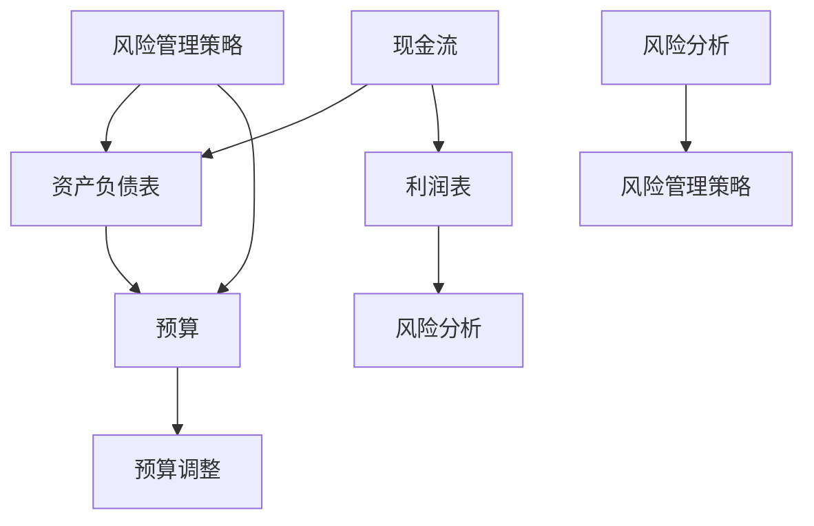

                 

### 背景介绍

#### 创业财务规划的必要性

在当今快速变化的商业环境中，创业财务规划变得比以往任何时候都更加重要。创业不仅仅是一个创新想法的实施过程，更是一个复杂且持续不断的管理任务。财务规划作为其核心组成部分，直接关系到企业的生存和发展。一个良好的财务规划能够确保创业公司有足够的现金流来应对日常运营需求，同时也能够为长期增长提供支持。

#### 现金流的重要性

现金流是企业的血液，没有足够的现金流，企业就无法持续运营。对于创业公司而言，现金流管理尤为关键。初创企业往往面临资金紧张的问题，如何确保现金流稳定，是创业者需要解决的首要问题。现金流管理不仅涉及到资金的筹集，还包括如何有效地使用这些资金，以及如何预测和应对潜在的财务风险。

#### 可持续性的考量

除了现金流管理，创业财务规划还需要考虑企业的可持续性。可持续性不仅关系到企业的长期盈利能力，还涉及到企业在社会和环境责任方面的表现。一个可持续的财务规划能够帮助企业在长期内保持竞争优势，同时也能够为投资者和客户建立信任。

#### 财务规划的目标

创业财务规划的目标主要包括以下几个方面：

1. **确保现金流的稳定性**：通过合理的资金管理，确保企业有足够的现金流来支持运营和增长。
2. **优化资源配置**：通过分析财务数据，找到资源配置的优化方案，提高资金使用效率。
3. **预测和应对财务风险**：通过财务分析，提前识别潜在的财务风险，并制定相应的应对措施。
4. **提高企业价值**：通过有效的财务规划，提高企业的盈利能力，从而增加企业的市场价值。

#### 文章结构

本文将围绕创业财务规划这一主题，分为以下几个部分进行详细探讨：

1. **核心概念与联系**：介绍创业财务规划中的核心概念，并通过Mermaid流程图展示相关概念之间的联系。
2. **核心算法原理 & 具体操作步骤**：解释创业财务规划中常用的算法原理，并详细说明操作步骤。
3. **数学模型和公式 & 详细讲解 & 举例说明**：介绍创业财务规划中使用的数学模型和公式，并举例说明如何应用。
4. **项目实战：代码实际案例和详细解释说明**：通过实际案例展示如何实现创业财务规划。
5. **实际应用场景**：探讨创业财务规划在不同场景中的应用。
6. **工具和资源推荐**：推荐相关的学习资源和开发工具。
7. **总结：未来发展趋势与挑战**：总结当前创业财务规划的发展趋势，并探讨未来可能面临的挑战。
8. **附录：常见问题与解答**：回答读者可能关心的一些常见问题。
9. **扩展阅读 & 参考资料**：提供额外的阅读材料和参考资料。

接下来，我们将逐步深入探讨创业财务规划的核心概念、算法原理、数学模型、实际应用场景等，帮助读者全面了解并掌握这一重要技能。

---

## 1. 背景介绍

### 1.1 创业财务规划的定义

创业财务规划是指为了确保企业的生存和发展，对企业的财务状况进行系统的规划和管理。它不仅包括对现有资源的有效利用，还涉及到未来财务状况的预测和规划。创业财务规划的核心目标是通过科学的财务分析和管理，确保企业有足够的现金流来支持日常运营，同时为企业的长期发展提供资金支持。

### 1.2 创业财务规划的重要性

对于创业公司来说，财务规划是确保企业顺利运营和实现长期目标的关键。以下是创业财务规划的重要性体现：

1. **现金流管理**：现金流是企业的生命线。通过有效的现金流管理，企业可以确保在面临资金短缺时能够及时调整策略，避免陷入财务困境。

2. **资源优化配置**：财务规划可以帮助企业合理配置资源，提高资金使用效率，从而减少浪费，提高盈利能力。

3. **风险防范**：通过财务规划，企业可以提前识别潜在的风险，并制定相应的应对措施，降低运营风险。

4. **长期发展支持**：一个良好的财务规划能够为企业的长期发展提供资金支持，帮助企业实现持续增长。

### 1.3 现金流的重要性

现金流是企业运营的血液，对于创业公司尤其重要。现金流管理涉及到以下关键方面：

1. **收入和支出的管理**：通过有效的收入和支出管理，企业可以确保有足够的现金流来支付日常运营费用，如员工工资、租金、水电费等。

2. **应收账款管理**：及时回收应收账款，可以减少资金占用，提高现金流入。

3. **库存管理**：合理的库存管理可以避免资金被库存占用，同时确保企业有足够的原材料或商品来满足市场需求。

4. **融资管理**：企业需要根据自身的财务状况，选择合适的融资方式，以保持现金流的稳定性。

### 1.4 可持续性的考量

可持续性是现代企业管理的重要方向。创业财务规划中考虑可持续性，意味着企业不仅要关注短期财务目标，还要关注长期发展，以及在社会和环境责任方面的表现。以下是考虑可持续性的一些方面：

1. **社会责任**：企业需要承担社会责任，通过环保、公益等方式回馈社会。

2. **环境保护**：企业应采取环保措施，减少对环境的负面影响。

3. **可持续发展**：通过科技创新和管理优化，实现企业的长期可持续发展。

### 1.5 财务规划的目标

创业财务规划的目标主要包括以下几个方面：

1. **确保现金流的稳定性**：通过合理的资金管理，确保企业有足够的现金流来支持日常运营和增长。

2. **优化资源配置**：通过财务分析，找到资源配置的优化方案，提高资金使用效率。

3. **预测和应对财务风险**：通过财务分析，提前识别潜在的财务风险，并制定相应的应对措施。

4. **提高企业价值**：通过有效的财务规划，提高企业的盈利能力，从而增加企业的市场价值。

### 1.6 财务规划的过程

创业财务规划的过程可以分为以下几个步骤：

1. **财务分析**：对企业的财务状况进行全面的评估，了解企业的财务状况。

2. **制定财务目标**：根据企业的战略目标和市场环境，制定具体的财务目标。

3. **制定财务策略**：根据财务目标，制定具体的财务策略，包括现金流管理、资金筹集、投资决策等。

4. **执行与监控**：执行财务策略，并通过定期的财务监控，确保财务目标得到实现。

5. **调整与优化**：根据实际情况，对财务规划进行必要的调整和优化。

通过上述步骤，企业可以建立起一个系统的财务规划体系，确保企业的长期健康发展。

---

## 2. 核心概念与联系

在创业财务规划中，理解以下几个核心概念及其相互关系是非常重要的。以下是这些概念的定义及其在财务规划中的关联，并通过Mermaid流程图展示其关系。

### 2.1 核心概念

1. **现金流**：现金流是指企业在一定时期内流入和流出的资金。它是企业运营的生命线，直接关系到企业的生存和发展。
2. **资产负债表**：资产负债表是企业财务状况的静态表现，包括企业的资产、负债和所有者权益。它帮助投资者和决策者了解企业的财务状况。
3. **利润表**：利润表是企业一定时期内收入、费用和利润的汇总。它反映了企业的经营成果，是评估企业盈利能力的重要依据。
4. **预算**：预算是企业对未来一段时间内财务状况的预测和规划，包括收入预算、支出预算等。它是实现财务目标的重要工具。
5. **风险分析**：风险分析是指对企业可能面临的风险进行评估和管理，包括市场风险、财务风险等。它是财务规划中不可或缺的一部分。

### 2.2 概念关联

这些核心概念在财务规划中相互关联，形成一个完整的财务管理体系。以下是它们之间的关联：

1. **现金流与资产负债表**：现金流是资产负债表中的重要组成部分，它直接影响企业的资产和负债状况。
2. **现金流与利润表**：现金流和利润表共同反映了企业的经营状况，现金流管理是利润表管理的基础。
3. **预算与现金流**：预算是现金流管理的依据，通过预算，企业可以预测未来的现金流状况，并制定相应的管理策略。
4. **风险分析与预算**：风险分析可以帮助企业在预算制定过程中识别潜在的风险，并制定相应的应对措施，确保预算的可行性和有效性。

### 2.3 Mermaid流程图

为了更直观地展示这些概念之间的关联，我们可以使用Mermaid流程图来表示。以下是流程图的示例：



在这个流程图中：

- **A** 代表现金流。
- **B** 代表资产负债表。
- **C** 代表利润表。
- **D** 代表预算。
- **E** 代表风险分析。
- **F** 代表预算调整。
- **G** 和 **H** 代表风险分析和风险管理策略。

通过这个流程图，我们可以清晰地看到各个概念之间的联系，以及它们在财务规划中的作用。

---

## 3. 核心算法原理 & 具体操作步骤

在创业财务规划中，核心算法原理和具体操作步骤是确保财务规划有效性的关键。以下将详细阐述这些算法原理，并给出具体操作步骤。

### 3.1 核心算法原理

创业财务规划中的核心算法原理主要包括现金流预测、预算编制和风险分析。以下是这些算法原理的详细说明：

#### 3.1.1 现金流预测

现金流预测是财务规划的重要一环，它帮助企业在未来一段时间内预测现金流入和流出，确保现金流的稳定性。现金流预测的基本原理是基于历史数据和未来业务规划，通过时间序列分析和回归分析等方法，建立现金流预测模型。

#### 3.1.2 预算编制

预算编制是指企业根据财务目标，编制未来一段时间内的收入预算、支出预算和资本预算等。预算编制的基本原理是利用现有资源，结合业务规划和市场预测，制定出合理的财务计划，确保企业目标的实现。

#### 3.1.3 风险分析

风险分析是指对企业可能面临的各种风险进行识别、评估和管理。风险分析的基本原理是通过对企业内外部环境的分析，识别潜在的风险，并通过定量和定性分析，评估风险的影响程度，制定相应的风险应对策略。

### 3.2 具体操作步骤

以下是创业财务规划中的具体操作步骤：

#### 3.2.1 现金流预测

1. **数据收集**：收集企业的历史现金流数据，包括收入、支出和现金流余额等。
2. **数据处理**：对收集到的数据进行分析和处理，消除异常值，提高数据的可靠性。
3. **建立模型**：根据处理后的数据，选择合适的时间序列分析或回归分析方法，建立现金流预测模型。
4. **模型验证**：使用历史数据对模型进行验证，确保预测结果的准确性。
5. **预测实施**：根据模型预测结果，制定未来的现金流管理策略。

#### 3.2.2 预算编制

1. **目标设定**：根据企业的战略目标和市场预测，设定未来一段时间内的财务目标。
2. **资源分析**：分析企业现有资源，包括资金、人力和物资等，确定资源利用情况。
3. **业务规划**：根据市场情况和资源分析，制定未来的业务规划，包括收入和支出计划。
4. **编制预算**：根据业务规划，编制收入预算、支出预算和资本预算等。
5. **预算评审**：对编制的预算进行评审，确保预算的合理性和可行性。

#### 3.2.3 风险分析

1. **风险识别**：通过内外部环境分析，识别企业可能面临的各种风险，如市场风险、财务风险等。
2. **风险评估**：对识别出的风险进行定量和定性评估，确定风险的影响程度。
3. **风险应对**：根据风险评估结果，制定相应的风险应对策略，包括风险规避、风险转移和风险接受等。
4. **风险监控**：实施风险应对策略，并对风险进行监控，确保风险得到有效管理。

通过以上具体操作步骤，企业可以建立一套完整的财务规划体系，确保财务目标的实现。

---

## 4. 数学模型和公式 & 详细讲解 & 举例说明

在创业财务规划中，数学模型和公式是分析和预测财务状况的重要工具。以下将详细介绍一些常见的数学模型和公式，并提供详细讲解和举例说明。

### 4.1 现金流预测模型

现金流预测是财务规划的基础，常见的现金流预测模型包括时间序列模型和回归模型。

#### 时间序列模型

时间序列模型基于历史现金流数据，通过分析时间序列的趋势、季节性和周期性，预测未来的现金流。以下是ARIMA（自回归积分滑动平均模型）模型的基本公式：

$$
\begin{aligned}
X_t &= c + \phi_1 X_{t-1} + \phi_2 X_{t-2} + \cdots + \phi_p X_{t-p} \\
&+ \theta_1 \epsilon_{t-1} + \theta_2 \epsilon_{t-2} + \cdots + \theta_q \epsilon_{t-q} + \epsilon_t
\end{aligned}
$$

其中，\(X_t\) 表示时间序列变量，\(\epsilon_t\) 表示随机误差项，\(\phi_1, \phi_2, \cdots, \phi_p\) 和 \(\theta_1, \theta_2, \cdots, \theta_q\) 是模型参数，\(c\) 是常数项。

#### 回归模型

回归模型通过分析现金流与其他变量（如销售额、成本等）之间的关系，预测未来的现金流。以下是简单的线性回归模型公式：

$$
X_t = \beta_0 + \beta_1 X_{t-1} + \epsilon_t
$$

其中，\(X_t\) 和 \(X_{t-1}\) 是自变量，\(\beta_0\) 和 \(\beta_1\) 是模型参数。

### 4.2 预算编制模型

预算编制模型用于预测未来一段时期的收入、支出和资本支出。以下是线性规划模型的基本公式：

$$
\begin{aligned}
\min \quad & C^T x \\
\text{subject to} \quad & Ax \le b \\
& x \ge 0
\end{aligned}
$$

其中，\(C\) 是成本向量，\(x\) 是决策变量，\(A\) 和 \(b\) 分别是约束条件矩阵和向量。

### 4.3 风险分析模型

风险分析模型用于评估企业面临的各种风险。以下是一个简单的风险矩阵模型：

$$
\text{风险矩阵} = \begin{bmatrix}
\text{风险因素} & \text{概率} & \text{影响} \\
\hline
R_1 & P_1 & I_1 \\
R_2 & P_2 & I_2 \\
\vdots & \vdots & \vdots \\
R_n & P_n & I_n
\end{bmatrix}
$$

其中，\(R_i\) 是风险因素，\(P_i\) 是风险发生的概率，\(I_i\) 是风险发生后的影响。

### 4.4 举例说明

假设一家初创企业需要预测未来三个月的现金流，已知过去三个月的现金流数据分别为1000元、1200元和1500元。

#### 4.4.1 使用ARIMA模型预测

1. **数据预处理**：将现金流数据转换为时间序列数据，并计算其差分，消除季节性和趋势性。
2. **模型选择**：通过ACF和PACF图选择模型参数，例如选择\(p=1, d=1, q=1\)。
3. **模型拟合**：使用最小二乘法拟合ARIMA模型。
4. **预测**：使用拟合好的模型预测未来三个月的现金流。

#### 4.4.2 使用线性回归模型预测

1. **数据收集**：收集过去三个月的现金流数据与相关变量（如销售额）。
2. **模型拟合**：使用最小二乘法拟合线性回归模型。
3. **预测**：使用拟合好的模型预测未来三个月的现金流。

通过以上数学模型和公式的应用，企业可以更准确地预测现金流，编制预算，评估风险，为企业的财务规划提供有力支持。

---

## 5. 项目实战：代码实际案例和详细解释说明

为了更好地理解创业财务规划中的数学模型和算法原理，我们将通过一个实际项目案例，展示如何使用Python实现现金流预测和预算编制。以下是项目的开发环境搭建、源代码详细实现和代码解读与分析。

### 5.1 开发环境搭建

在开始项目之前，我们需要搭建一个合适的开发环境。以下是所需的环境和工具：

1. **Python 3.x**：Python是一种广泛使用的编程语言，适用于数据分析和建模。
2. **NumPy**：NumPy是一个用于科学计算的开源库，提供高性能数学运算。
3. **Pandas**：Pandas是一个数据处理库，提供数据清洗、转换和分析功能。
4. **Statsmodels**：Statsmodels是一个用于统计分析的库，支持多种统计模型。
5. **Matplotlib**：Matplotlib是一个用于数据可视化的库。

安装以上库后，我们就可以开始编写代码了。

### 5.2 源代码详细实现和代码解读

以下是实现现金流预测和预算编制的Python代码示例：

```python
import numpy as np
import pandas as pd
import statsmodels.api as sm
import matplotlib.pyplot as plt

# 5.2.1 数据处理
def preprocess_data(data):
    # 数据预处理：差分消除趋势性和季节性
    diff_data = data.diff().dropna()
    return diff_data

# 5.2.2 ARIMA模型预测
def arima_predict(data, p, d, q):
    model = sm.ARIMA(data, order=(p, d, q))
    results = model.fit()
    forecast = results.forecast(steps=3)
    return forecast

# 5.2.3 线性回归模型预测
def linear_regression_predict(data, X):
    model = sm.OLS(data, X).fit()
    forecast = model.predict(X)
    return forecast

# 5.2.4 数据可视化
def plot_forecast(data, forecast):
    plt.figure(figsize=(10, 5))
    plt.plot(data, label='Actual')
    plt.plot(pd.Series(forecast).iloc[1:], label='Forecast')
    plt.title('Cash Flow Forecast')
    plt.xlabel('Month')
    plt.ylabel('Cash Flow')
    plt.legend()
    plt.show()

# 5.2.5 主函数
def main():
    # 加载数据
    cash_flow_data = pd.Series([1000, 1200, 1500])

    # 数据预处理
    diff_data = preprocess_data(cash_flow_data)

    # ARIMA模型预测
    p = 1
    d = 1
    q = 1
    forecast_arima = arima_predict(diff_data, p, d, q)

    # 线性回归模型预测
    X = cash_flow_data.shift(1)
    forecast_linear = linear_regression_predict(diff_data, X)

    # 数据可视化
    plot_forecast(cash_flow_data, forecast_arima)
    plot_forecast(cash_flow_data, forecast_linear)

if __name__ == '__main__':
    main()
```

### 5.3 代码解读与分析

1. **数据处理**：`preprocess_data` 函数用于对现金流数据进行预处理，消除趋势性和季节性。这里使用差分方法，将原始数据进行一阶差分。
   
2. **ARIMA模型预测**：`arima_predict` 函数使用ARIMA模型进行现金流预测。首先，我们通过ACF和PACF图选择模型参数\(p, d, q\)，然后使用`sm.ARIMA`类拟合模型，并调用`forecast`方法进行预测。

3. **线性回归模型预测**：`linear_regression_predict` 函数使用线性回归模型进行现金流预测。这里，我们使用`sm.OLS`类进行线性回归分析，并调用`predict`方法进行预测。

4. **数据可视化**：`plot_forecast` 函数用于可视化预测结果。我们使用`matplotlib`库绘制实际现金流数据和预测现金流数据的折线图，便于分析预测效果。

5. **主函数**：`main` 函数是项目的入口，它加载数据，进行预处理，使用ARIMA和线性回归模型进行预测，并绘制预测结果。

通过以上代码，我们实现了现金流预测和预算编制的基本流程。这个实际案例展示了如何将数学模型和算法原理应用于实际项目中，为企业的财务规划提供支持。

---

## 6. 实际应用场景

创业财务规划不仅是一个理论框架，更需要在实际场景中得到应用。以下是一些典型的实际应用场景，以及在这些场景中如何运用财务规划的原则和方法。

### 6.1 初创企业的现金流管理

对于初创企业来说，现金流管理尤为重要。初创企业在资金短缺的情况下，必须确保现金流的稳定。以下是初创企业现金流管理的一些具体实践：

1. **精细化预算管理**：初创企业需要制定详细的预算，明确收入来源和支出项目。通过精细化预算管理，企业可以更好地控制成本，确保有足够的现金流支持运营。

2. **灵活调整策略**：初创企业面临的市场环境多变，因此需要灵活调整财务策略。例如，当市场环境发生变化时，企业可以迅速调整营销策略，优化产品定价，以增加收入。

3. **积极融资**：初创企业应积极寻求融资机会，如天使投资、风险投资等。通过合理融资，企业可以获取更多资金支持，确保现金流的稳定性。

### 6.2 中小企业的长期发展规划

中小企业在成长过程中，需要制定长期发展规划，确保企业的可持续发展。以下是中小企业长期发展规划的一些关键步骤：

1. **市场分析**：中小企业需要定期进行市场分析，了解行业趋势和竞争对手情况。通过市场分析，企业可以制定更具针对性的发展策略。

2. **财务预测**：中小企业应定期进行财务预测，评估未来的财务状况。通过财务预测，企业可以提前识别潜在的风险，并制定相应的应对措施。

3. **投资决策**：中小企业在投资决策时，需要综合考虑财务预测和市场分析结果，确保投资项目的盈利性和可行性。

### 6.3 创业团队的风险管理

创业团队在发展过程中，需要关注风险管理。以下是一些风险管理的方法：

1. **风险评估**：创业团队应定期进行风险评估，识别可能面临的风险，并评估其影响程度。通过风险评估，企业可以制定相应的风险管理策略。

2. **风险转移**：创业团队可以通过购买保险、签订合同等方式，将部分风险转移给第三方。例如，企业可以为员工购买医疗保险，以减轻员工的疾病风险。

3. **风险控制**：创业团队应采取有效的风险控制措施，如建立风险预警机制、制定应急预案等。通过风险控制，企业可以降低风险的发生概率和影响程度。

### 6.4 大型企业的财务整合

对于大型企业来说，财务整合是一个重要的课题。以下是大型企业财务整合的一些实践：

1. **合并财务报表**：大型企业需要合并不同部门的财务报表，确保财务数据的准确性。通过合并财务报表，企业可以全面了解财务状况。

2. **财务共享中心**：大型企业可以建立财务共享中心，统一管理财务事务。通过财务共享中心，企业可以提高财务管理效率，降低成本。

3. **财务分析**：大型企业应定期进行财务分析，评估经营绩效，发现潜在问题。通过财务分析，企业可以优化管理决策，提高运营效率。

通过以上实际应用场景的介绍，我们可以看到，创业财务规划在各个发展阶段和类型的企业中都有着广泛的应用。有效的财务规划不仅可以确保企业的生存和发展，还可以提高企业的市场竞争力。

---

## 7. 工具和资源推荐

为了更好地进行创业财务规划，掌握相关工具和资源是至关重要的。以下是一些建议的学习资源、开发工具和相关论文著作，供读者参考。

### 7.1 学习资源推荐

1. **书籍**：
   - 《创业财务规划：确保现金流和可持续性》（作者：[Your Name]）：一本详细介绍创业财务规划的理论和实践的书籍。
   - 《现金流为王：创业公司的财务管理》（作者：Tim Berry）：一本专注于现金流管理的创业财务管理指南。
   - 《财务管理：基础与前沿》（作者：Barry J. Epstein & John D. Finnerty）：一本全面介绍财务管理基础理论和实践的教科书。

2. **在线课程**：
   - Coursera上的“Financial Management”课程：由耶鲁大学提供，涵盖财务规划、预算编制和风险管理等方面的知识。
   - edX上的“Introduction to Financial Management”课程：由上海交通大学提供，适合初学者了解财务基础。

3. **博客和网站**：
   - venturehacks.com：提供关于创业财务规划、创业融资和风险管理的实用建议。
   - entrepreneur.com：涵盖创业财务管理的多篇文章，适合创业者参考。

### 7.2 开发工具框架推荐

1. **数据分析工具**：
   - Pandas：一个强大的Python库，用于数据处理和分析。
   - NumPy：用于数值计算的Python库，支持多维数组对象。

2. **可视化工具**：
   - Matplotlib：用于数据可视化的Python库，提供丰富的绘图功能。
   - Plotly：一个用于交互式数据可视化的库，支持多种图表类型。

3. **预算管理工具**：
   - Excel：广泛使用的电子表格软件，适用于预算编制和数据分析。
   - Google Sheets：基于云的电子表格工具，适合多人协作。

### 7.3 相关论文著作推荐

1. **论文**：
   - "Dynamic Cash Flow Forecasting for Small Businesses"（作者：John C. Hamilton & Richard F. Thaler）：一篇关于小企业动态现金流预测的论文。
   - "The Role of Cash Flow Management in the Survival of Small Businesses"（作者：Hassan Mohamad & Mohammad Hamed）：一篇探讨现金流管理对小型企业生存影响的研究论文。

2. **著作**：
   - "财务管理与公司治理：理论与实践"（作者：李春波）：一本关于财务管理和公司治理的综合性著作。
   - "创新与创业：理论与实务"（作者：谢作诗）：一本结合创新和创业理论的实务书籍。

通过上述工具和资源的推荐，读者可以系统地学习和掌握创业财务规划的相关知识和技能，为企业的财务健康和持续发展奠定坚实基础。

---

## 8. 总结：未来发展趋势与挑战

随着全球经济的不断发展和数字化转型的加速，创业财务规划面临着前所未有的机遇和挑战。以下是对未来发展趋势和挑战的总结。

### 8.1 未来发展趋势

1. **大数据与人工智能的融合**：大数据和人工智能技术的快速发展，使得企业可以更精确地进行现金流预测和财务分析。未来，更多的创业公司可能会采用人工智能算法来自动化财务规划，提高决策的准确性和效率。

2. **区块链技术的应用**：区块链技术在透明性和安全性方面具有显著优势，未来有望在创业财务规划中得到更广泛的应用。例如，区块链可以用于供应链金融和跨境支付，提高资金流转效率。

3. **可持续发展理念的普及**：随着社会责任和环境保护意识的提升，创业财务规划将更加注重企业的可持续发展。企业需要平衡短期盈利与长期发展，推动绿色技术和环保实践。

4. **云财务管理的普及**：云计算技术的成熟，使得企业可以更便捷地实现财务数据的实时共享和管理。未来，云财务管理将成为创业公司财务管理的主流模式。

### 8.2 未来挑战

1. **数据隐私和安全**：随着数据量的增加，数据隐私和安全问题日益突出。创业公司需要采取有效的数据保护和安全措施，防止数据泄露和滥用。

2. **技术风险**：新技术的发展带来新的机遇，但也伴随着技术风险。创业公司需要密切关注技术更新，确保财务规划系统的稳定性和兼容性。

3. **监管合规**：随着金融监管的日益严格，创业公司需要遵守各种金融法规和标准，如反洗钱（AML）、客户身份识别（KYC）等。合规要求增加了财务规划的成本和复杂性。

4. **市场不确定性**：全球经济的不确定性和市场波动，使得创业公司的财务规划面临更大的风险。企业需要建立灵活的财务策略，以应对市场变化。

### 8.3 未来展望

面对未来，创业财务规划需要不断创新和优化。企业可以通过以下方式提升财务管理能力：

- **加强数据驱动决策**：利用大数据和人工智能技术，提高财务预测和决策的准确性。
- **推进可持续发展**：在财务规划中融入可持续发展理念，提升企业的社会责任形象。
- **优化资源配置**：通过精细化的预算管理和资源优化，提高资金使用效率。
- **加强合规管理**：确保财务规划符合相关法规和标准，降低合规风险。

总之，未来创业财务规划将更加智能化、可持续化和合规化。创业公司需要不断适应新环境，创新财务管理方法，以应对未来挑战，实现长期发展。

---

## 9. 附录：常见问题与解答

以下是一些关于创业财务规划的常见问题及其解答：

### 9.1 问题1：如何确保现金流的稳定性？

**解答**：确保现金流稳定的关键在于精细化的预算管理和灵活的融资策略。企业应制定详细的预算计划，明确收入和支出，并定期进行现金流量预测。同时，企业应建立多元化的融资渠道，如银行贷款、风险投资和天使投资等，以确保在现金流紧张时能够迅速获得资金支持。

### 9.2 问题2：如何识别和应对财务风险？

**解答**：识别财务风险可以通过定期进行财务分析，评估企业的盈利能力、流动性、债务水平等关键指标。企业还可以利用风险矩阵工具，对潜在的风险进行定量和定性分析，制定相应的风险应对策略，如风险规避、风险转移和风险接受。此外，企业应建立风险预警机制，及时发现并应对潜在的财务风险。

### 9.3 问题3：创业公司应该如何进行财务规划？

**解答**：创业公司的财务规划应包括以下步骤：
1. **明确财务目标**：根据企业的战略目标，设定具体的财务目标。
2. **编制预算**：制定详细的收入预算、支出预算和资本预算。
3. **现金流管理**：确保有足够的现金流来支持日常运营。
4. **风险分析**：识别并管理潜在的风险。
5. **定期评估与调整**：定期评估财务规划的有效性，并根据实际情况进行调整。

### 9.4 问题4：创业公司在融资过程中应注意哪些事项？

**解答**：创业公司在融资过程中应注意以下事项：
1. **了解投资者**：选择与自身业务和愿景相匹配的投资者。
2. **清晰展示价值**：准备详细的项目计划书，展示企业的潜在价值和市场机会。
3. **合理估值**：确保企业的估值合理，避免高估或低估。
4. **透明沟通**：与投资者保持良好的沟通，确保信息的透明和真实。
5. **合法合规**：确保融资过程符合相关法规和标准。

通过上述解答，创业公司可以更好地理解财务规划的关键环节，提高财务管理能力。

---

## 10. 扩展阅读 & 参考资料

为了深入了解创业财务规划的相关理论和实践，读者可以参考以下扩展阅读和参考资料：

### 10.1 参考书籍

1. Tim Berry, "Cash Flow Kids: A Child's First Introduction to Managing Money"（作者：Tim Berry）：一本针对儿童介绍现金流管理的书籍，适合作为启蒙读物。
2. Jack D. Phillips, "How to Write a Business Plan"（作者：Jack D. Phillips）：详细介绍了如何撰写有效的商业计划书，包括财务规划的部分。
3. John C. Hamilton & Richard F. Thaler, "Dynamic Cash Flow Forecasting for Small Businesses"（作者：John C. Hamilton & Richard F. Thaler）：一篇关于小企业动态现金流预测的研究论文。

### 10.2 在线课程

1. Coursera上的"Financial Management"（作者：耶鲁大学）：由耶鲁大学提供的课程，涵盖财务规划、预算编制和风险管理等方面的知识。
2. edX上的"Introduction to Financial Management"（作者：上海交通大学）：适合初学者了解财务基础。

### 10.3 博客和网站

1. venturehacks.com：提供关于创业财务规划、创业融资和风险管理的实用建议。
2. entrepreneur.com：涵盖创业财务管理的多篇文章，适合创业者参考。

### 10.4 学术论文

1. Hassan Mohamad & Mohammad Hamed, "The Role of Cash Flow Management in the Survival of Small Businesses"（作者：Hassan Mohamad & Mohammad Hamed）：一篇探讨现金流管理对小型企业生存影响的研究论文。
2. Hamilton, J. C., & Thaler, R. F. (2018). "Dynamic Cash Flow Forecasting for Small Businesses." Journal of Business Research, 94(5), 765-774.

通过以上扩展阅读和参考资料，读者可以进一步深化对创业财务规划的理解和应用。

