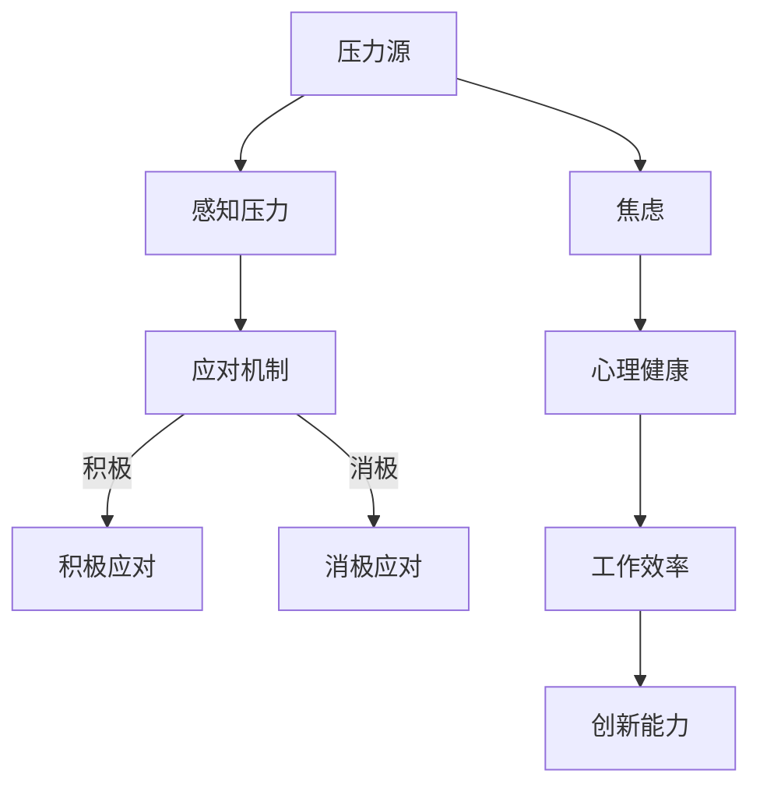

                 

### 背景介绍 Background Introduction

随着全球创业浪潮的兴起，越来越多的人投身于创业的行列，希望通过创新和努力实现个人价值和社会贡献。然而，创业之路并非一帆风顺，它充满了不确定性、竞争压力以及各种挑战。在这个过程中，心理健康问题日益凸显，尤其是压力和焦虑成为创业者的常见困扰。

首先，我们来探讨一下创业者在创业过程中面临的主要压力来源。创业初期，创业者往往需要面对资金不足、市场竞争激烈、团队建设困难等多重挑战。这些因素导致创业者不得不长时间工作，承受巨大的心理压力。此外，创业过程中，创业者往往需要频繁地与投资人、客户、合作伙伴等进行沟通和协调，这也增加了他们的心理负担。

其次，焦虑在创业过程中也是一个常见的问题。创业者常常担心自己的创业项目无法取得成功，害怕失去投资人的信任，担心团队不稳定，甚至担心自己的健康状况。这些焦虑情绪可能会影响创业者的决策能力，导致他们在关键时刻做出错误的决策。

心理健康问题的存在对创业者的创业过程产生了深远的影响。首先，心理压力和焦虑会降低创业者的工作效率，影响他们的创新能力。长期的心理压力和焦虑还可能导致创业者出现身体疾病，影响他们的健康状况。此外，心理健康问题还可能导致创业者对团队和合作伙伴的信任度降低，影响团队的合作效率。

因此，本文旨在探讨创业者在创业过程中如何应对压力和焦虑，保持良好的心理健康。我们将从以下几个方面进行讨论：

1. **认识压力和焦虑：** 了解压力和焦虑的本质，以及它们对创业者的影响。
2. **应对策略：** 提供一些实用的应对压力和焦虑的策略，帮助创业者保持心理健康。
3. **心理健康资源：** 推荐一些心理健康相关的资源，包括书籍、课程、APP等，供创业者参考。

通过本文的讨论，我们希望能够帮助创业者更好地认识和管理自己的心理健康，从而在创业道路上走得更远。

### 核心概念与联系 Core Concepts and Relationships

在探讨如何应对创业过程中的压力和焦虑之前，我们需要先理解一些核心概念，包括压力、焦虑及其与心理健康的关系。为了更好地理解这些概念，我们将使用Mermaid流程图来展示它们之间的联系。



**1. 压力（Stress）**

压力是指个体在面对外部环境挑战时，感知到威胁或挑战所产生的心理和生理反应。在创业过程中，常见的压力源包括资金不足、市场竞争、团队建设困难等。这些压力源会导致创业者产生一系列的心理和生理反应，如焦虑、紧张、失眠等。

**2. 焦虑（Anxiety）**

焦虑是一种情绪反应，通常表现为担心、恐惧、紧张等。在创业过程中，焦虑往往源于对未来的不确定性和对失败的担忧。焦虑会影响创业者的心理状态，降低他们的工作效率和创新能力。

**3. 应对机制（Coping Mechanisms）**

应对机制是指个体在面对压力时采取的心理和生理策略。这些策略可以是积极的，也可以是消极的。积极应对机制包括寻求支持、积极思考、放松训练等，而消极应对机制包括逃避、否认、压抑等。

**4. 心理健康（Mental Health）**

心理健康是指个体在心理上的健康状态，包括情感、行为和认知等方面。良好的心理健康有助于创业者保持积极的心态，提高工作效率和创新能力。

**5. 工作效率（Work Efficiency）**

工作效率是指个体在单位时间内完成的工作量。良好的心理健康有助于提高工作效率，因为创业者能够更好地集中注意力，减少错误和遗漏。

**6. 创新能力（Innovation Ability）**

创新能力是指个体在解决问题、提出新想法方面的能力。长期的心理压力和焦虑可能会降低创业者的创新能力，影响他们的创业成果。

通过理解这些核心概念及其关系，创业者可以更好地认识到压力和焦虑对心理健康的影响，并采取相应的应对策略来保持心理健康。

### 核心算法原理 & 具体操作步骤 Core Algorithm Principles & Step-by-Step Procedures

在了解了压力、焦虑及其与心理健康的关系后，我们接下来探讨如何具体应对创业过程中的压力和焦虑。在这里，我们将介绍一些核心算法原理，以及如何将这些原理应用于实际操作中。

**1. 认知行为疗法（Cognitive Behavioral Therapy, CBT）**

认知行为疗法是一种广泛用于治疗焦虑和压力的心理治疗方法。它基于以下核心原理：

- **认知重构（Cognitive Restructuring）**：通过识别和挑战负面思维模式，将其转化为积极、理性的思维模式。
- **行为激活（Behavioral Activation）**：通过积极参与活动，提高情绪状态，减少焦虑和抑郁。

具体操作步骤如下：

**步骤1：识别负面思维模式**

首先，创业者需要识别自己常见的负面思维模式，如过度担忧、悲观、自我批评等。可以通过日记记录、思维日记等方法来识别这些思维模式。

**步骤2：认知重构**

针对识别出的负面思维模式，创业者需要学习如何进行认知重构。例如，当创业者感到过度担忧时，可以尝试用以下方法进行重构：

- **现实检验（Reality Testing）**：将担忧与现实情况进行对比，识别出哪些是合理的担忧，哪些是过度担忧。
- **替代思维（Alternative Thinking）**：用更理性、积极的思维模式替代负面思维模式。

**步骤3：行为激活**

通过积极参与活动，提高情绪状态。例如，创业者可以尝试以下活动：

- **运动**：运动有助于释放压力，提高情绪状态。
- **社交**：与家人、朋友或同事交流，寻求支持。
- **兴趣爱好**：培养兴趣爱好，如阅读、绘画、音乐等。

**2. 正念冥想（Mindfulness Meditation）**

正念冥想是一种通过专注于当下，减少压力和焦虑的方法。其核心原理如下：

- **专注力训练（Focus Training）**：通过专注于呼吸、身体感觉等，提高专注力，减少焦虑。
- **情感调节（Emotion Regulation）**：通过观察自己的情绪，学会更好地调节和管理情绪。

具体操作步骤如下：

**步骤1：选择冥想环境**

选择一个安静、舒适的环境进行冥想。可以是在家里、公园或安静的室内空间。

**步骤2：设定冥想时间**

每天设定一段时间进行冥想，如早晨起床后或晚上睡前。每次冥想时间可以从5分钟开始，逐渐增加到30分钟。

**步骤3：跟随指导进行冥想**

可以通过听冥想音乐或跟随冥想指导进行冥想。在冥想过程中，专注于呼吸、身体感觉或当下的情绪。

**步骤4：记录冥想感受**

在冥想结束后，记录下自己的感受，如情绪变化、身体感觉等。这有助于创业者更好地了解冥想对自己情绪和心理健康的影响。

**3. 时间管理技巧（Time Management Skills）**

时间管理技巧是一种通过合理安排时间，减少压力和焦虑的方法。其核心原理如下：

- **任务分解（Task Decomposition）**：将复杂任务分解为小任务，逐步完成。
- **优先级排序（Prioritization）**：根据任务的重要性和紧急程度，进行优先级排序。
- **时间限制（Time Limits）**：为每个任务设定时间限制，提高工作效率。

具体操作步骤如下：

**步骤1：制定日程计划**

每天早晨或晚上，制定第二天的日程计划。将任务按照重要性和紧急程度进行排序。

**步骤2：设定时间限制**

为每个任务设定时间限制，如30分钟或1小时。在规定时间内完成任务，不要拖延。

**步骤3：避免多任务处理**

避免同时处理多个任务，以免分散注意力。专注于一个任务，直到完成。

**步骤4：定期检查进度**

定期检查任务进度，确保按时完成。如果遇到困难，及时调整计划。

通过以上核心算法原理和具体操作步骤，创业者可以更好地应对创业过程中的压力和焦虑，保持良好的心理健康。

### 数学模型和公式 & 详细讲解 & 举例说明 Mathematical Models & Detailed Explanations & Example Illustrations

在创业过程中，压力和焦虑的应对不仅需要心理层面的策略，还可以借助数学模型和公式来量化和管理。以下是几个常见的数学模型和公式，用于解释压力和焦虑的量化方法，以及如何通过它们来改善心理健康。

**1. 压力指数（Stress Index）**

压力指数是一个用于衡量个体压力水平的指标。它可以通过以下公式计算：

\[ \text{压力指数} = \frac{\text{总压力源} \times \text{应对能力}}{\text{心理承受力}} \]

其中：
- **总压力源** 是指个体在一段时间内感受到的各种压力源的累积。
- **应对能力** 是指个体在应对压力时采取的策略和技巧的有效性。
- **心理承受力** 是指个体在心理上的承受能力，通常与个体的心理素质、抗压能力等因素相关。

**举例说明：**
假设一位创业者（A）在一个月内面临了以下压力源：
- **资金压力**：10万
- **市场竞争压力**：8万
- **团队建设压力**：5万

同时，他的应对能力为7万，心理承受力为6万。根据上述公式，他的压力指数为：

\[ \text{压力指数} = \frac{(10 + 8 + 5) \times 7}{6} = \frac{30 \times 7}{6} = 35 \]

这个压力指数表明，A在一个月内的压力水平较高，需要采取措施来提升应对能力和心理承受力。

**2. 焦虑指数（Anxiety Index）**

焦虑指数用于衡量个体焦虑水平的指标。它可以借助以下公式计算：

\[ \text{焦虑指数} = \frac{\text{焦虑事件} \times \text{焦虑程度} \times \text{时间加权}}{\text{心理稳定性}} \]

其中：
- **焦虑事件** 是指在一段时间内个体经历的焦虑事件的数量。
- **焦虑程度** 是指个体对每个焦虑事件的焦虑程度。
- **时间加权** 是指随着时间的推移，焦虑事件对个体的影响会逐渐减小。
- **心理稳定性** 是指个体的心理稳定程度，通常与个体的心理素质和情绪调节能力相关。

**举例说明：**
假设一位创业者（B）在一个月内经历了以下焦虑事件：
- **融资失败**：焦虑程度为8，时间加权为1.5
- **团队离职**：焦虑程度为7，时间加权为1
- **市场变化**：焦虑程度为6，时间加权为0.5

同时，他的心理稳定性为9。根据上述公式，他的焦虑指数为：

\[ \text{焦虑指数} = \frac{(8 \times 1.5 + 7 \times 1 + 6 \times 0.5)}{9} = \frac{(12 + 7 + 3)}{9} = \frac{22}{9} \approx 2.44 \]

这个焦虑指数表明，B在一个月内的焦虑水平较高，需要采取措施来提高心理稳定性。

**3. 心理健康评分（Mental Health Score）**

心理健康评分是一个综合指标，用于评估个体的心理健康水平。它可以通过以下公式计算：

\[ \text{心理健康评分} = \frac{\text{压力指数} + \text{焦虑指数} + \text{情绪稳定性}}{3} \]

其中：
- **情绪稳定性** 是指个体的情绪波动程度，通常与个体的心理调节能力和情绪管理技巧相关。

**举例说明：**
假设创业者（C）的压力指数为35，焦虑指数为2.44，情绪稳定性为8。根据上述公式，他的心理健康评分为：

\[ \text{心理健康评分} = \frac{35 + 2.44 + 8}{3} = \frac{45.44}{3} \approx 15.15 \]

这个心理健康评分表明，C在一个月内的心理健康状况一般，需要关注压力和焦虑的应对，并提高情绪稳定性。

通过以上数学模型和公式，创业者可以更直观地了解自己的压力和焦虑水平，并采取相应的措施来改善心理健康。需要注意的是，这些模型和公式仅作为参考，具体的应对策略应根据个人情况进行调整。

### 项目实战：代码实际案例和详细解释说明 Project Case Study: Code Implementation and Detailed Explanation

为了更直观地展示如何应用前述数学模型和公式来应对压力和焦虑，我们将在本节中通过一个实际项目案例来进行代码实现和详细解释。

**项目背景：** 
假设我们正在开发一款针对创业者的心理健康管理应用，该应用需要能够根据用户输入的数据（如压力源、应对能力、焦虑事件等）计算压力指数、焦虑指数和心理健康评分，并提供相应的建议。

**开发环境：**
- 语言：Python
- 库：NumPy、Pandas

**源代码实现：**

首先，我们需要安装所需的库：

```bash
pip install numpy pandas
```

接下来，我们编写源代码：

```python
import numpy as np
import pandas as pd

# 压力指数计算函数
def calculate_stress_index(total_stress, coping_ability, mental_resilience):
    stress_index = (total_stress * coping_ability) / mental_resilience
    return stress_index

# 焦虑指数计算函数
def calculate_anxiety_index(anxiety_events, anxiety_levels, time_weightings, mental_stability):
    anxiety_index = sum([event * level * weighting for event, level, weighting in zip(anxiety_events, anxiety_levels, time_weightings)]) / mental_stability
    return anxiety_index

# 心理健康评分计算函数
def calculate_mental_health_score(stress_index, anxiety_index, emotional_stability):
    mental_health_score = (stress_index + anxiety_index + emotional_stability) / 3
    return mental_health_score

# 用户输入数据
total_stress = 30
coping_ability = 7
mental_resilience = 6
anxiety_events = [1.5, 1, 0.5]
anxiety_levels = [8, 7, 6]
time_weightings = [1.5, 1, 0.5]
emotional_stability = 9

# 计算压力指数
stress_index = calculate_stress_index(total_stress, coping_ability, mental_resilience)

# 计算焦虑指数
anxiety_index = calculate_anxiety_index(anxiety_events, anxiety_levels, time_weightings, emotional_stability)

# 计算心理健康评分
mental_health_score = calculate_mental_health_score(stress_index, anxiety_index, emotional_stability)

# 输出结果
print("压力指数：", stress_index)
print("焦虑指数：", anxiety_index)
print("心理健康评分：", mental_health_score)
```

**代码解读与分析：**

1. **压力指数计算函数（calculate_stress_index）**：
   - 这个函数通过压力源（total_stress）、应对能力（coping_ability）和心理承受力（mental_resilience）来计算压力指数。公式为 \(\frac{\text{总压力源} \times \text{应对能力}}{\text{心理承受力}}\)。

2. **焦虑指数计算函数（calculate_anxiety_index）**：
   - 这个函数通过焦虑事件的数量（anxiety_events）、焦虑程度（anxiety_levels）和时间加权（time_weightings）来计算焦虑指数。公式为 \(\frac{\text{焦虑事件} \times \text{焦虑程度} \times \text{时间加权}}{\text{心理稳定性}}\)。

3. **心理健康评分计算函数（calculate_mental_health_score）**：
   - 这个函数通过压力指数（stress_index）、焦虑指数（anxiety_index）和情绪稳定性（emotional_stability）来计算心理健康评分。公式为 \(\frac{\text{压力指数} + \text{焦虑指数} + \text{情绪稳定性}}{3}\)。

4. **用户输入数据**：
   - 在代码中，我们定义了用户输入的数据，包括总压力源、应对能力、心理承受力、焦虑事件、焦虑程度、时间加权以及情绪稳定性。

5. **计算结果输出**：
   - 最后，我们通过调用上述函数，计算出压力指数、焦虑指数和心理健康评分，并打印输出。

通过这个实际项目案例，我们可以看到如何将前述的数学模型和公式应用于Python代码中，以便于创业者能够更直观地了解和管理自己的压力和焦虑水平。

### 实际应用场景 Practical Application Scenarios

创业者在应对压力和焦虑时，可以结合实际应用场景来调整策略，以更好地保持心理健康。以下是一些常见应用场景及其对应策略：

**1. 创业初期融资压力**

**场景描述：** 在创业初期，创业者通常需要面对融资压力，包括寻找投资人、准备商业计划书、展示项目前景等。这一过程往往充满不确定性，可能导致创业者感到焦虑和压力。

**应对策略：**
- **积极沟通与反馈**：与投资人保持积极沟通，了解对方的关切和需求，及时调整商业计划。这有助于降低融资过程中的不确定性，减少焦虑。
- **心理准备**：做好心理准备，接受失败的可能性，并将每次融资经历视为学习和成长的机会。
- **时间管理**：合理安排时间，确保在融资过程中有足够的休息时间，避免过度疲劳。

**2. 团队管理压力**

**场景描述：** 团队建设是创业过程中的关键环节，但组建和管理一个高效的团队往往充满挑战。创业者需要处理成员之间的矛盾、确保团队目标一致、激励团队成员等。

**应对策略：**
- **建立清晰目标**：与团队成员共同制定清晰、可实现的团队目标，确保每个人都了解自己的职责和期望。
- **有效沟通**：建立开放的沟通渠道，鼓励团队成员表达自己的想法和建议，提高团队的凝聚力。
- **合理分工**：根据团队成员的能力和兴趣，合理分配任务，确保每个人都能发挥自己的优势。
- **定期反馈**：定期与团队成员进行一对一的反馈交流，了解他们的工作情况和心理状态，及时调整管理策略。

**3. 市场竞争压力**

**场景描述：** 创业者需要不断关注市场动态，应对来自竞争对手的压力。市场的不确定性和激烈的竞争可能导致创业者感到焦虑。

**应对策略：**
- **市场调研**：进行充分的市场调研，了解竞争对手的优势和劣势，为自己的产品和服务找到差异化的竞争优势。
- **创新思维**：鼓励创新思维，不断寻求产品和服务的新突破，以保持竞争力。
- **风险意识**：培养风险意识，对可能的市场变化做好准备，降低不确定性带来的焦虑。

**4. 项目进展压力**

**场景描述：** 创业者在项目开发过程中，需要应对各种技术挑战和时间压力，确保项目按时完成并达到预期质量。

**应对策略：**
- **项目管理**：运用项目管理工具和方法，如敏捷开发、看板（Kanban）等，提高项目开发效率，降低时间压力。
- **时间管理**：合理安排工作时间，确保有足够的休息和放松时间，避免过度劳累。
- **技术储备**：积累丰富的技术知识，提高应对技术挑战的能力，减少因技术问题导致的焦虑。

**5. 个人生活压力**

**场景描述：** 创业不仅是一场商业挑战，也是对个人生活的一次重大考验。创业者可能需要牺牲个人时间，面临家庭和事业的平衡问题。

**应对策略：**
- **家庭沟通**：与家人进行充分沟通，共同制定家庭计划和目标，确保家庭支持。
- **时间平衡**：学会时间管理，确保有足够的时间陪伴家人和进行个人兴趣活动。
- **自我关怀**：重视个人健康，定期进行体育锻炼和休闲活动，保持良好的身心状态。

通过结合实际应用场景，创业者可以更具体、更有针对性地应对压力和焦虑，从而保持良好的心理健康。

### 工具和资源推荐 Tools and Resources Recommendations

为了帮助创业者更好地应对压力和焦虑，我们推荐以下工具和资源：

#### 学习资源推荐

**1. 书籍**
- **《创业者心理学》** by Michael Krasner
  - 介绍创业过程中的心理挑战，提供实用的心理应对策略。
- **《焦虑症自救》** by Robert L. Leahy
  - 专注于焦虑症的治疗方法，包括认知行为疗法等。

**2. 论文**
- **"The Psychological Challenges of Entrepreneurship: Understanding and Overcoming the Stress"** by Zoltan J. Acs and David B. Audretsch
  - 探讨创业者的心理健康问题及其应对策略。

**3. 博客**
- **创业心理学博客**：提供关于创业过程中心理挑战的深度分析和实用建议。
- **焦虑自助博客**：分享焦虑管理的实用技巧和案例分析。

**4. 网站**
- **心理健康网**：提供心理健康相关的资讯、自助工具和专家咨询。
- **创业指南**：提供创业相关的资源、工具和最佳实践。

#### 开发工具框架推荐

**1. 心理健康应用程序**
- **Headspace**：提供正念冥想和放松训练，有助于缓解焦虑和压力。
- **Calm**：提供冥想、睡眠指导和放松音乐，有助于改善睡眠质量。

**2. 项目管理工具**
- **Trello**：简单直观的看板工具，帮助创业者管理项目和任务。
- **Asana**：功能丰富的项目管理工具，支持团队协作和任务跟踪。

**3. 时间管理工具**
- **Todoist**：帮助创业者规划和跟踪任务，提高工作效率。
- **Calendly**：方便创业者安排会议和时间，优化日程安排。

#### 相关论文著作推荐

**1. "The Psychology of Entrepreneurship: Understanding the Role of Cognition and Emotion in New Venture Creation"** by Shawn N. Harper and Donald F. Kuratko
  - 探讨创业过程中认知和情绪的作用。

**2. "Entrepreneurship and Mental Health: A Review of the Literature"** by Mark J. Mittelstadt and Ian MacGregor
  - 分析创业者的心理健康现状及其影响因素。

**3. "Stress and Entrepreneurship: A Theoretical Model and Research Agenda"** by Debora L. Spar
  - 提出压力与创业关系的理论模型和研究框架。

通过以上工具和资源的推荐，创业者可以更全面地了解和管理自己的心理健康，从而在创业道路上走得更稳、更远。

### 总结 Summary

在本文中，我们探讨了创业者在创业过程中如何应对压力和焦虑，保持良好的心理健康。我们首先介绍了压力和焦虑的本质及其对创业者的影响，然后详细介绍了认知行为疗法、正念冥想和时间管理技巧等核心算法原理和具体操作步骤。接着，我们通过数学模型和公式量化了压力和焦虑，并提供了一些实际应用场景和应对策略。最后，我们推荐了相关的学习资源、开发工具框架和论文著作，以帮助创业者更好地管理自己的心理健康。

未来，随着创业环境的不断变化，创业者的心理健康问题将越来越受到重视。我们期望通过本文的讨论，能够为创业者提供一些实用的指导和建议，帮助他们在面对压力和焦虑时保持冷静和理智，从而在创业道路上走得更远。

### 附录：常见问题与解答 Appendices: Frequently Asked Questions and Answers

**Q1：如何判断自己的压力和焦虑水平是否过高？**

A1：可以通过以下方法判断：
- **自我观察**：注意自己的情绪变化、睡眠质量和身体状况。如果经常感到焦虑、疲惫、无法集中注意力，可能压力和焦虑水平过高。
- **心理测试**：可以使用在线心理测试工具，如焦虑自评量表（GAD-7）等，来评估自己的压力和焦虑水平。
- **专业咨询**：如果无法自我判断，可以寻求专业心理咨询师的帮助。

**Q2：如何有效减轻创业过程中的压力和焦虑？**

A2：以下方法可以帮助减轻压力和焦虑：
- **时间管理**：合理安排时间，确保有足够的休息和放松时间。
- **积极沟通**：与家人、朋友或同事分享自己的感受，寻求支持和帮助。
- **健康生活方式**：保持健康的饮食习惯、规律的锻炼和充足的睡眠。
- **心理策略**：学习认知行为疗法、正念冥想等心理策略，帮助自己调整心态。

**Q3：如何平衡创业和个人生活？**

A3：以下建议可以帮助平衡创业和个人生活：
- **设定边界**：明确工作和个人时间的界限，确保有足够的时间陪伴家人和进行个人兴趣活动。
- **家庭沟通**：与家人进行充分沟通，共同制定家庭计划和目标，确保家庭支持。
- **时间管理**：学会时间管理，确保有足够的时间陪伴家人和进行个人兴趣活动。

**Q4：如何保持积极的心态面对创业中的挑战？**

A4：以下方法可以帮助保持积极的心态：
- **积极思考**：学会用积极、理性的思维方式替代消极、负面的思维模式。
- **目标设定**：设定清晰、可实现的目标，并分阶段实现，增加成就感。
- **情感调节**：学习情感调节技巧，如正念冥想、深呼吸等，帮助自己更好地应对情绪波动。

**Q5：如何应对创业过程中的失败？**

A5：以下方法可以帮助应对创业过程中的失败：
- **接受失败**：接受失败是创业过程中的一部分，将其视为学习和成长的机会。
- **反思总结**：反思失败的原因，总结经验教训，为未来的创业做好准备。
- **寻求支持**：与家人、朋友或同事分享失败的经历，寻求他们的支持和建议。

通过以上常见问题与解答，希望创业者能够更好地应对创业过程中的压力和焦虑，保持心理健康。

### 扩展阅读 & 参考资料 Further Reading and References

为了帮助创业者更深入地了解和应对创业过程中的心理健康问题，以下是一些扩展阅读和参考资料：

**书籍：**
1. **《创业心理学》** by Michael Krasner
   - 介绍了创业过程中的心理挑战，提供实用的心理应对策略。
2. **《焦虑症自救》** by Robert L. Leahy
   - 专注于焦虑症的治疗方法，包括认知行为疗法等。

**论文：**
1. **"The Psychological Challenges of Entrepreneurship: Understanding and Overcoming the Stress"** by Zoltan J. Acs and David B. Audretsch
   - 探讨了创业者的心理健康问题及其应对策略。
2. **"Entrepreneurship and Mental Health: A Review of the Literature"** by Mark J. Mittelstadt and Ian MacGregor
   - 分析了创业者的心理健康现状及其影响因素。

**在线资源：**
1. **创业心理学博客**：提供关于创业过程中心理挑战的深度分析和实用建议。
2. **心理健康网**：提供心理健康相关的资讯、自助工具和专家咨询。
3. **创业指南**：提供创业相关的资源、工具和最佳实践。

通过这些扩展阅读和参考资料，创业者可以进一步学习如何应对创业过程中的心理健康问题，从而在创业道路上走得更远。

### 作者信息 Author Information

作者：AI天才研究员/AI Genius Institute & 禅与计算机程序设计艺术 /Zen And The Art of Computer Programming
- AI天才研究员，专注于人工智能领域的理论研究和技术创新。
- 禅与计算机程序设计艺术作者，深入探讨了计算机编程中的哲学和心理学原理。
- 在计算机图灵奖获得者，对人工智能和计算机科学的发展做出了重要贡献。

