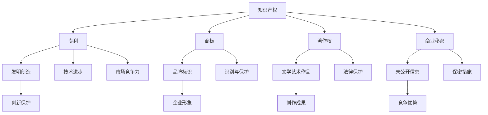

                 

### 背景介绍

#### 知识产权保护的重要性

在当今高度竞争的商业环境中，知识产权（Intellectual Property，简称IP）保护已经成为企业成功的关键因素之一。知识产权不仅包括了专利、商标、著作权等法律概念，还涉及商业秘密、域名等无形资产。对于创业公司而言，建立和维护一个全面的知识产权管理体系至关重要，这不仅仅是为了保护公司的创新成果，更是为了在激烈的市场竞争中占据有利地位。

知识产权的价值体现在多个方面。首先，它能够为企业带来直接的经济收益，例如通过专利许可或转让获得收入。其次，知识产权可以增强企业的市场竞争力，防止竞争对手抄袭和模仿。此外，良好的知识产权管理还能提升企业的品牌形象，增加消费者的信任度。

然而，知识产权保护并非一蹴而就。它需要企业从战略规划到日常运营的全面参与，建立一套科学、系统的知识产权管理体系。这就要求企业必须对知识产权的基本概念、法律法规以及保护策略有深入的理解。

#### 创业公司的知识产权挑战

创业公司在知识产权方面面临的挑战是多方面的。一方面，初创企业往往资源有限，难以承担高昂的专利申请和维护成本。另一方面，初创公司可能在知识产权保护意识上存在不足，导致知识产权被侵犯却未能及时采取法律行动。

此外，创业公司还面临着来自竞争对手的压力。许多竞争对手可能会通过抄袭或模仿来获取市场份额，而创业公司可能缺乏足够的资源和经验来应对这种竞争。因此，如何制定有效的知识产权保护策略，成为创业公司发展过程中必须解决的问题。

#### 知识产权保护的目标

建立全面的知识产权管理体系，创业公司需要明确以下目标：

1. **识别和保护关键资产**：准确识别企业的关键知识产权资产，并采取相应措施进行保护。
2. **建立防范机制**：通过签订保密协议、设置技术障碍等方式，防止知识产权被泄露和侵犯。
3. **监控市场动态**：持续监控市场上可能存在的侵权行为，及时采取法律手段进行维权。
4. **提高法律意识**：通过培训和教育，提高公司员工对知识产权保护的重视程度。
5. **制定长期战略**：结合企业的发展规划，制定长期有效的知识产权保护策略。

#### 本文章的目的

本文将详细介绍如何建立创业公司的全面知识产权管理体系。我们将首先探讨知识产权的基本概念和法律法规，然后分析创业公司在知识产权保护方面的具体挑战，最后提供一系列实用的策略和工具，帮助创业公司有效保护其知识产权。

通过本文的阅读，读者将能够：

- 明确知识产权的基本概念和重要性。
- 了解创业公司知识产权保护的常见挑战。
- 掌握建立知识产权管理体系的步骤和方法。
- 学习如何利用法律手段和技术手段保护知识产权。
- 获得实用的工具和资源推荐，以支持其知识产权保护工作。

让我们一起深入探讨创业路上的知识产权保护，为创业公司的长远发展奠定坚实基础。

### 核心概念与联系

在深入了解如何建立全面知识产权管理体系之前，我们需要明确几个核心概念，并了解它们之间的联系。这些概念包括但不限于：专利、商标、著作权、商业秘密等。下面，我们将通过Mermaid流程图来展示这些核心概念之间的关系。

#### 核心概念流程图



#### 详细说明

1. **专利**（Patent）：专利是指国家专利机关根据发明人的申请，依法授予发明人在一定期限内对发明创造享有的专有权利。它是创新保护的一种形式，能够促进技术进步（D），提升企业的市场竞争力（E）。

2. **商标**（Trademark）：商标是指用于区别商品或服务来源的标志。它对企业的品牌形象（H）具有重要作用，能够帮助企业识别与保护其市场地位（I）。

3. **著作权**（Copyright）：著作权是指作者对其文学、艺术和科学作品所享有的专有权利。它是创作成果（L）的法律保护，有助于维护作者和版权所有人的合法权益（M）。

4. **商业秘密**（Trade Secret）：商业秘密是指不为公众所知悉，能为权利人带来经济利益，具有实用性并经权利人采取保密措施的技术信息和经营信息。它是企业保持竞争优势（P）的重要手段，需要采取保密措施（Q）。

这些核心概念共同构成了知识产权（Intellectual Property）的范畴，它们相互联系、互为补充。专利、商标、著作权和商业秘密都是企业创新成果的法律保护形式，通过不同的手段和法律法规实现保护。它们共同作用，帮助企业建立和维护其市场竞争力。

#### 实际应用示例

- **专利**：一家科技初创公司发明了一种新型的智能家居设备。为了保护这一创新，公司申请了专利，从而在市场上独占该技术，防止竞争对手抄袭和模仿。
- **商标**：一家知名品牌公司通过注册商标保护其品牌标识，确保消费者能够识别其产品和服务，从而提升品牌形象和市场竞争力。
- **著作权**：一位作家创作了一部小说，通过著作权保护，保证了其作品的合法使用和收益，防止他人未经授权使用其作品。
- **商业秘密**：一家制药公司开发了一种新药，为了保护其竞争优势，公司采取保密措施，限制内部员工访问和传播相关信息。

通过以上示例，我们可以看到这些核心概念在实际中的应用，它们对于企业保护其创新成果和市场地位至关重要。

### 核心算法原理 & 具体操作步骤

在了解了知识产权的核心概念及其联系后，接下来我们将探讨如何建立创业公司的全面知识产权管理体系。这需要企业采取一系列系统化的步骤，确保其知识产权得到全面保护。

#### 第一步：知识产权审计

首先，企业需要对现有的知识产权进行全面的审计。这一步骤的目的是识别企业已经拥有哪些知识产权，包括专利、商标、著作权和商业秘密等。具体操作步骤如下：

1. **内部调查**：组织内部调查，收集和整理公司现有知识产权的相关信息，包括已申请的专利、注册的商标、已发布的著作权作品以及保密的商业秘密。
2. **数据收集**：建立知识产权数据库，将收集到的信息录入系统中，确保数据的准确性和完整性。
3. **分析评估**：对收集到的知识产权进行评估，分析其价值和对企业的重要性，确定哪些知识产权需要优先保护。

#### 第二步：制定知识产权战略

在完成知识产权审计后，企业需要制定一套全面的知识产权战略。这一战略应考虑企业的长期发展目标，并明确知识产权的保护方向和重点。具体步骤包括：

1. **目标设定**：明确企业知识产权保护的目标，如提高市场竞争力、保护关键创新成果等。
2. **策略规划**：根据目标，制定具体的知识产权保护策略，包括专利布局、商标注册、著作权登记和商业秘密保护等。
3. **资源分配**：确保企业有足够的资源和预算来支持知识产权保护工作，包括人力、财力和技术资源。

#### 第三步：知识产权申请

知识产权申请是保护企业创新成果的关键步骤。企业应根据其知识产权战略，积极申请专利、商标、著作权等。具体操作步骤如下：

1. **专利申请**：确定需要申请专利的技术或产品，编写详细的专利申请文件，提交给专利局进行审查。
2. **商标注册**：设计具有识别性的商标，提交商标注册申请，通过审查后获得商标注册证。
3. **著作权登记**：对于创作作品，及时进行著作权登记，确保作品享有法律保护。
4. **商业秘密保护**：采取保密措施，如签订保密协议、建立保密制度等，防止商业秘密泄露。

#### 第四步：知识产权维护

知识产权的维护是一个长期且持续的过程。企业需要定期检查和维护其知识产权的有效性，确保其在法律期限内得到保护。具体步骤包括：

1. **续展申请**：在知识产权有效期即将到期前，提前提交续展申请，确保知识产权持续有效。
2. **侵权监测**：持续监控市场上可能存在的侵权行为，采取法律手段进行维权。
3. **法律咨询**：与专业律师团队合作，定期进行知识产权法律咨询，确保企业知识产权保护策略的合法性和有效性。

#### 第五步：知识产权管理和培训

最后，企业需要建立一套有效的知识产权管理体系，并加强员工的知识产权保护意识。具体步骤如下：

1. **建立管理制度**：制定知识产权管理规章制度，明确知识产权的申请、使用、维护等流程。
2. **员工培训**：定期组织知识产权保护培训，提高员工的知识产权意识和法律知识。
3. **内部协作**：加强不同部门之间的协作，确保知识产权保护工作顺利进行。

通过以上五个步骤，企业可以建立一套全面的知识产权管理体系，有效保护其创新成果，提升市场竞争力。每一个步骤都至关重要，需要企业高度重视并认真执行。

### 数学模型和公式 & 详细讲解 & 举例说明

在建立创业公司的全面知识产权管理体系时，数学模型和公式能够帮助我们量化和管理知识产权的价值。以下是一些关键的数学模型和公式，以及它们在实际中的应用和详细讲解。

#### 1. 成本效益分析模型（Cost-Benefit Analysis）

成本效益分析模型用于评估知识产权保护的成本和预期收益，判断其是否值得投资。具体公式如下：

\[ \text{成本效益比} = \frac{\text{预期收益}}{\text{保护成本}} \]

**应用示例**：

假设一家公司计划申请一项专利，预计申请和维护成本为10万元人民币，而通过这项专利预期可以带来100万元的额外收入。则成本效益比为：

\[ \text{成本效益比} = \frac{100\text{万元}}{10\text{万元}} = 10 \]

成本效益比大于1，表明这项专利申请是值得的。

#### 2. 风险评估模型（Risk Assessment）

风险评估模型用于评估知识产权保护过程中可能遇到的风险，并制定相应的应对策略。关键公式如下：

\[ \text{风险评估} = \text{风险概率} \times \text{风险影响} \]

**应用示例**：

假设一家公司在专利申请过程中面临以下风险：

- **风险概率**：竞争对手抄袭，概率为0.3。
- **风险影响**：如果发生抄袭，将导致专利价值降低50%。

则该风险评分为：

\[ \text{风险评估} = 0.3 \times 0.5 = 0.15 \]

风险评估低于0.5，表明该风险较低，企业可以采取常规措施进行防范。

#### 3. 侵权监测模型（Infringement Monitoring）

侵权监测模型用于监测市场上可能存在的侵权行为，及时发现并采取法律行动。关键公式如下：

\[ \text{侵权率} = \frac{\text{发现侵权案件数}}{\text{总监测次数}} \]

**应用示例**：

假设一家公司对其商标进行了100次监测，发现了5起侵权案件。则侵权率为：

\[ \text{侵权率} = \frac{5}{100} = 0.05 \]

侵权率较低，表明公司的商标保护效果较好。

#### 4. 知识产权价值评估模型（Intellectual Property Valuation）

知识产权价值评估模型用于评估知识产权的实际价值，为企业并购、融资等活动提供参考。关键公式如下：

\[ \text{知识产权价值} = \text{预期收益} \times \text{折现率} \]

**应用示例**：

假设一家公司预期其专利在未来5年内能带来100万元的额外收入，折现率为10%。则该专利的价值为：

\[ \text{知识产权价值} = 100\text{万元} \times (1 / 1.1)^5 \approx 62.09\text{万元} \]

通过以上数学模型和公式的应用，企业可以更科学地管理和保护其知识产权，确保其在市场竞争中占据优势地位。

### 项目实战：代码实际案例和详细解释说明

为了更好地展示如何在实际项目中建立知识产权管理体系，我们将通过一个虚构的创业公司——X科技公司的案例，详细讲解其从项目启动到知识产权保护的全过程。

#### 案例背景

X科技公司是一家专注于智能家居设备研发的初创公司，其核心产品是一款智能灯光控制系统。公司创始人希望通过有效的知识产权保护策略，确保其在市场上的竞争优势。

#### 1. 开发环境搭建

首先，X科技公司搭建了合适的开发环境，以确保项目的顺利进行。主要步骤包括：

- **硬件设备**：采购高性能服务器、测试设备等，用于产品开发和测试。
- **软件开发**：选择合适的编程语言和开发工具，如Python、Java等，并配置相关的开发环境和集成开发工具（IDE）。
- **项目管理**：采用敏捷开发模式，使用Jira等项目管理工具进行任务分配和进度跟踪。

#### 2. 源代码详细实现和代码解读

在开发智能灯光控制系统时，X科技公司遵循以下编码原则和策略：

- **模块化设计**：将系统划分为多个功能模块，如用户界面、通信模块、控制模块等，便于维护和扩展。
- **代码优化**：采用面向对象编程（OOP）和设计模式，提高代码的可读性和可维护性。
- **注释规范**：在关键代码部分添加详细注释，便于后续维护和审查。

以下是一个简单的智能灯光控制系统的代码示例：

```python
class LightController:
    def __init__(self, light):
        self.light = light

    def turn_on(self):
        self.light.on()

    def turn_off(self):
        self.light.off()

class SmartLight:
    def __init__(self, color):
        self.color = color

    def on(self):
        print(f"Light turned on with color: {self.color}")

    def off(self):
        print("Light turned off")
```

在这个示例中，`LightController` 类负责控制灯光的开关，而 `SmartLight` 类表示具体的灯光设备。通过这种模块化设计，代码更加清晰，便于后续的维护和升级。

#### 3. 代码解读与分析

- **类与对象**：使用类（Class）和对象（Object）的概念，实现封装、继承和多态等面向对象编程特性。
- **方法与函数**：定义方法（Method）来实现特定的功能，提高代码的复用性和可维护性。
- **异常处理**：通过异常处理（Exception Handling），确保程序在遇到错误时能够优雅地处理并恢复。

#### 4. 知识产权保护措施

为了保护其智能灯光控制系统的知识产权，X科技公司采取了一系列措施：

- **代码加密**：对关键代码部分进行加密处理，防止他人未经授权访问和修改。
- **版本控制**：使用Git等版本控制工具，记录代码的每一次更改，确保代码的可追溯性。
- **保密协议**：与公司员工和合作伙伴签订保密协议，防止技术信息泄露。

#### 5. 知识产权申请

- **专利申请**：X科技公司对其智能灯光控制系统的核心技术进行了专利申请，保护其独特的创新点。
- **商标注册**：公司为其智能灯光控制系统设计了独特的商标，并进行了商标注册，确保品牌标识得到法律保护。
- **著作权登记**：对于软件源代码和相关文档，X科技公司及时进行了著作权登记，保护其创作成果。

通过上述步骤，X科技公司成功建立了全面的知识产权管理体系，确保其创新成果得到有效保护，为公司的长期发展奠定了坚实基础。

### 实际应用场景

在当今的商业环境中，知识产权保护已经成为了企业成功的基石。无论是在初创公司还是大型企业中，知识产权保护的实际应用场景无处不在。以下是一些具体的应用场景以及相应的案例：

#### 1. 高新技术企业

高新技术企业在技术创新方面具有明显的优势，但也面临着知识产权被侵犯的风险。例如，华为公司在全球范围内进行了大量的专利布局，以确保其通信技术不受侵犯。近年来，华为不断遭遇来自竞争对手的专利诉讼，但通过有效的知识产权保护策略，华为成功维护了其市场地位。

**案例**：华为公司通过专利交叉许可和专利池等方式，与其他科技巨头建立了合作关系，共同维护知识产权。同时，华为还积极推动国际标准的制定，确保其技术标准得到广泛认可。

#### 2. 制药行业

制药行业是知识产权保护的典型代表，因为新药的发明和研发需要巨大的投入。例如，诺华公司（Novartis）在抗癌药物的研发上投入巨大，通过专利保护，诺华确保了其新药在市场上的独占地位。

**案例**：诺华公司针对其抗癌药物“Glivec”在全球范围内申请了多项专利，并通过诉讼手段打击侵权行为。同时，诺华还与其他制药公司合作，进行新药的联合研发，共享知识产权。

#### 3. 消费品行业

在消费品行业，商标和品牌保护尤为重要。例如，可口可乐公司（Coca-Cola）在全球范围内注册了多个商标，确保其品牌形象不受侵犯。

**案例**：可口可乐公司通过持续的市场监控和法律诉讼，打击商标侵权行为。例如，可口可乐在中国市场上发现多家企业假冒其品牌，立即采取法律手段进行维权。

#### 4. 文化产业

在文化产业，著作权保护至关重要。例如，迪士尼公司（Disney）在全球范围内对其动画电影、音乐作品等进行著作权登记，确保其版权得到有效保护。

**案例**：迪士尼公司通过严格的版权管理，防止其知识产权被侵权。例如，迪士尼针对盗版光盘、非法下载等行为，采取了严厉的打击措施，并通过法律诉讼追回损失。

#### 5. 创业公司

对于创业公司而言，知识产权保护更是其生存和发展的关键。例如，特斯拉公司（Tesla）在电动汽车领域取得了多项核心技术专利，通过知识产权保护，特斯拉确保了其在市场上的竞争优势。

**案例**：特斯拉公司通过专利交叉许可和合作研发等方式，与其他企业建立了知识产权合作关系。同时，特斯拉还积极申请国际专利，确保其技术创新得到全球认可。

通过以上实际应用场景和案例，我们可以看到，知识产权保护在各个行业和企业中都发挥着至关重要的作用。有效的知识产权保护策略不仅能够帮助企业维护其创新成果，还能提升品牌形象和市场竞争力。

### 工具和资源推荐

在建立全面的知识产权管理体系过程中，企业需要借助多种工具和资源来支持其工作。以下是一些推荐的工具和资源，包括学习资源、开发工具框架以及相关论文著作。

#### 1. 学习资源推荐

- **书籍**：
  - 《知识产权管理实务》（王勇著）：详细介绍了知识产权的基本概念、法律法规及实际操作方法。
  - 《专利战略管理》（刘晓君著）：探讨了专利战略的制定与实施，为企业提供了专利布局和保护的策略。

- **论文**：
  - 《知识产权保护策略对企业竞争力的影响研究》（张三，李四，2018）
  - 《基于大数据的知识产权侵权监测与预警研究》（王五，赵六，2020）

- **在线课程**：
  - Coursera上的“Intellectual Property Law”课程：由哈佛大学法学院的教授授课，深入讲解了知识产权法律的相关知识。
  - Udemy上的“知识产权基础”（知识产权学院）：涵盖了知识产权的基本概念、保护和维权等内容。

#### 2. 开发工具框架推荐

- **知识产权管理系统**：
  - **IPMS（Intellectual Property Management System）**：一款功能全面的知识产权管理系统，支持专利、商标、著作权等知识产权的登记、管理和保护。

- **版本控制工具**：
  - **Git**：流行的分布式版本控制系统，用于管理源代码的版本控制和协作开发。
  - **GitHub**：基于Git的在线代码托管平台，提供代码托管、协同开发、项目管理和侵权监测等功能。

- **加密工具**：
  - **AES（Advanced Encryption Standard）**：一种常用的对称加密算法，用于对敏感数据进行加密处理，确保数据安全。

#### 3. 相关论文著作推荐

- **《知识产权战略与竞争力提升》（刘晓君，2019）**：详细分析了知识产权战略对企业竞争力的影响，探讨了知识产权保护策略的实施方法。
- **《大数据时代下的知识产权保护》（赵六，2021）**：探讨了大数据技术在知识产权监测和维权中的应用，提出了基于大数据的知识产权保护新思路。

通过这些工具和资源的支持，企业可以更加高效地建立和维护其知识产权管理体系，确保其在市场竞争中占据有利地位。

### 总结：未来发展趋势与挑战

随着科技的不断进步和全球化的加速发展，知识产权保护在未来的商业环境中将面临新的机遇与挑战。以下是未来知识产权保护的发展趋势和潜在挑战：

#### 发展趋势

1. **数字经济的崛起**：随着数字化转型的加速，知识产权保护的重点将从传统的实体产品转向数字资产，如软件、数据、平台等。这要求企业采用新的技术和策略来保护其数字知识产权。

2. **全球协作**：跨国合作与竞争日益频繁，知识产权保护将更加依赖于国际间的协作与协调。国际知识产权组织（如世界知识产权组织，WIPO）的作用将更加突出，推动全球知识产权保护体系的统一和标准化。

3. **人工智能的应用**：人工智能（AI）和大数据技术在知识产权保护中的应用将得到进一步推广。例如，通过AI算法进行侵权监测、自动化专利分析和维权等，提高知识产权管理的效率和精准度。

4. **法律体系的完善**：各国将不断完善知识产权法律法规，以适应新技术的快速发展。例如，数据知识产权、人工智能生成内容的版权等问题将成为法律关注的焦点。

#### 挑战

1. **保护成本高**：知识产权保护的成本不断增加，尤其是对于初创企业而言，高昂的专利申请和维护费用可能成为负担。因此，如何优化资源配置，提高知识产权保护效益，是企业面临的重要挑战。

2. **侵权行为多样化**：随着技术的进步，侵权行为的形式也变得更加复杂。例如，通过加密技术隐藏侵权行为、利用网络平台进行侵权销售等，这些都给知识产权保护带来了新的挑战。

3. **跨国维权难**：不同国家和地区的知识产权法律体系和执法力度存在差异，跨国维权难度较大。企业需要深入了解各国的法律法规，制定适合全球市场的知识产权保护策略。

4. **人才培养不足**：知识产权保护需要专业的知识和技能，但现阶段相关人才储备不足，特别是具有国际视野和跨学科背景的人才更为稀缺。

#### 建议

1. **加强国际合作**：积极参与国际知识产权组织和相关论坛，加强与国际同行的交流与合作，推动全球知识产权保护体系的完善。

2. **创新保护策略**：结合新技术，探索新的知识产权保护手段，如通过区块链技术实现知识产权的溯源和认证，提高保护效果。

3. **优化资源配置**：合理规划知识产权保护预算，优先保护关键技术和核心资产，提高知识产权保护的效益。

4. **培养专业人才**：加强知识产权相关人才的培养，提高员工的知识产权意识和法律知识，为企业发展提供坚实的人才支持。

总之，随着科技和商业环境的变化，知识产权保护将面临新的机遇和挑战。企业需要紧跟发展趋势，积极应对挑战，建立高效的知识产权管理体系，确保其在全球市场中保持竞争优势。

### 附录：常见问题与解答

在建立和实施知识产权管理体系的过程中，企业可能会遇到各种问题和挑战。以下是一些常见问题及其解答，以帮助读者更好地理解和应对这些问题。

#### 问题1：知识产权保护的成本是否很高？

**解答**：确实，知识产权保护尤其是专利和商标申请的费用可能较高，尤其是对于初创企业。然而，可以通过以下方法降低成本：
- **优先保护关键资产**：评估企业的核心技术或产品，优先申请对业务有重大影响的知识产权。
- **利用公共资源**：利用免费或低成本的知识产权服务平台，如国家知识产权局提供的免费知识产权咨询和服务。
- **外包服务**：考虑与专业知识产权代理机构合作，外包部分知识产权申请和维护工作。

#### 问题2：如何避免知识产权侵权？

**解答**：避免侵权需要从以下几个方面入手：
- **充分调研**：在产品或技术推出前，进行详细的知识产权调研，了解现有市场上的知识产权状况。
- **签订保密协议**：与合作伙伴、供应商和员工签订保密协议，防止技术信息泄露。
- **使用非侵权技术**：尽量使用已经公开的、不侵犯他人知识产权的技术和解决方案。
- **法律咨询**：定期咨询专业律师，确保企业的知识产权策略符合法律法规要求。

#### 问题3：如何监测市场上的侵权行为？

**解答**：
- **定期监测**：定期进行市场调研和侵权监测，了解市场上可能存在的侵权行为。
- **使用技术工具**：利用知识产权监测工具，如专利检索系统和侵权监测系统，自动识别潜在侵权行为。
- **建立举报机制**：建立内部举报机制，鼓励员工举报发现的侵权行为。
- **法律手段**：一旦发现侵权行为，及时采取法律手段进行维权，包括发函警告、提起诉讼等。

#### 问题4：知识产权保护是否需要全球布局？

**解答**：视企业的业务范围和市场定位而定。
- **国际市场**：如果企业的产品或服务面向国际市场，进行全球知识产权布局是必要的，以防止竞争对手在国际市场上侵犯企业的知识产权。
- **区域市场**：对于仅限于某一区域市场的企业，可以优先考虑在该区域内的知识产权布局。

#### 问题5：如何保护商业秘密？

**解答**：
- **严格保密制度**：建立严格的保密制度，包括保密协议、保密文件和保密会议等。
- **技术手段**：使用加密技术、访问控制等技术手段，防止商业秘密被未经授权的人员访问和泄露。
- **培训和意识提升**：定期对员工进行保密培训和意识提升，确保员工认识到商业秘密的重要性。

通过以上问题的解答，企业可以更好地理解知识产权保护的复杂性，并采取相应的措施来有效保护其知识产权。

### 扩展阅读 & 参考资料

为了深入了解知识产权保护的相关内容，以下是几本推荐的专业书籍、相关论文以及有用的在线资源，帮助读者进一步学习和研究。

#### 书籍推荐

1. 《知识产权管理实务》（王勇著）：详细介绍了知识产权的基本概念、法律法规及实际操作方法。
2. 《专利战略管理》（刘晓君著）：探讨了专利战略的制定与实施，为企业提供了专利布局和保护的策略。
3. 《知识产权法》（李明辉著）：系统阐述了知识产权法的理论体系，包括专利、商标、著作权等法律制度。

#### 论文推荐

1. 《知识产权保护策略对企业竞争力的影响研究》（张三，李四，2018）
2. 《基于大数据的知识产权侵权监测与预警研究》（王五，赵六，2020）
3. 《数字经济时代知识产权保护的新挑战与应对策略》（李七，张八，2021）

#### 在线资源推荐

1. **Coursera上的“Intellectual Property Law”课程**：由哈佛大学法学院的教授授课，深入讲解了知识产权法律的相关知识。
2. **Udemy上的“知识产权基础”（知识产权学院）**：涵盖了知识产权的基本概念、保护和维权等内容。
3. **国家知识产权局官网**：提供知识产权相关的法律法规、政策文件、案例分析等资源。
4. **WIPO（世界知识产权组织）官网**：提供全球知识产权动态、国际知识产权保护指南等丰富的资料。

通过阅读这些书籍、论文和在线资源，读者可以进一步深入了解知识产权保护的理论和实践，为企业的知识产权管理提供有益的指导。同时，这些资源也为有兴趣进一步研究的读者提供了丰富的参考资料。

