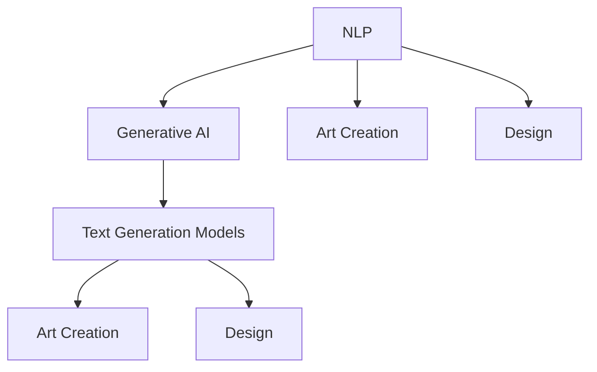

                 

### 背景介绍

创意AI，作为人工智能领域的一个重要分支，正在以惊人的速度发展和普及。特别是大型语言模型（Large Language Models，简称LLM），已经在自然语言处理（Natural Language Processing，简称NLP）和生成式人工智能（Generative Artificial Intelligence）中扮演了关键角色。LLM通过学习大量的文本数据，能够生成高质量的自然语言文本，包括文章、故事、对话等。这种能力不仅对传统的NLP任务有着巨大的推动作用，还在艺术创作和设计领域展现出了巨大的潜力。

在艺术创作方面，传统的艺术创作通常需要艺术家具有深厚的专业知识、丰富的情感体验和高度的艺术技巧。而创意AI，特别是LLM，可以模拟人类思维过程，通过学习海量的艺术作品和文献，生成新颖的艺术作品。这些作品不仅在形式上具有独特性，而且在情感表达和审美价值上也有着一定的深度。

在设计领域，创意AI同样展现出了其独特的价值。设计工作往往需要创新思维和创意灵感，而LLM能够快速地生成各种设计概念和方案，帮助设计师在短时间内探索更多的可能性。此外，LLM还可以帮助设计师进行用户研究，生成用户画像和需求分析，从而提高设计的针对性和用户体验。

随着LLM技术的不断成熟和应用范围的扩大，其在艺术创作和设计领域的应用也越来越广泛。本文将深入探讨LLM在艺术创作和设计中的应用原理、具体实现步骤、数学模型和实际应用案例，旨在为广大技术爱好者提供一份全面的技术指南。

---

### 核心概念与联系

在深入探讨LLM在艺术创作和设计中的应用之前，我们首先需要了解几个核心概念及其相互关系。这些概念包括自然语言处理（NLP）、生成式人工智能（Generative AI）、文本生成模型（Text Generation Models）和艺术创作与设计的基本原理。

#### 自然语言处理（NLP）

自然语言处理是人工智能领域的一个重要分支，旨在使计算机能够理解、生成和处理人类语言。NLP的核心任务包括文本分类、情感分析、命名实体识别、机器翻译等。其中，文本生成是NLP的一个重要子领域，它涉及到如何根据输入的文本或上下文生成新的文本。

#### 生成式人工智能（Generative AI）

生成式人工智能是一种能够生成新内容的人工智能系统。与传统的判别式人工智能（Discriminative AI）不同，生成式人工智能不仅能够识别和分类数据，还能根据现有的数据生成新的数据。生成式AI在图像生成、音频合成、视频生成等领域有着广泛的应用。

#### 文本生成模型（Text Generation Models）

文本生成模型是生成式AI在NLP领域的一个典型应用。这些模型通过学习大量的文本数据，可以生成新的文本，包括文章、故事、对话等。目前最流行的文本生成模型之一是基于变换器（Transformer）架构的LLM，如GPT（Generative Pre-trained Transformer）系列。

#### 艺术创作与设计的基本原理

艺术创作涉及情感表达、审美追求和创造性思维。设计则更注重功能性、用户体验和审美价值的平衡。两者都需要创新和灵感，而这些正是创意AI，尤其是LLM所擅长的领域。

#### 关系与联系

LLM通过NLP和生成式AI技术，能够理解和生成自然语言文本。这些文本不仅可以用于传统的NLP任务，如机器翻译、问答系统等，还可以用于艺术创作和设计。例如，LLM可以分析大量艺术作品和设计文献，从中提取创意元素，生成新的艺术作品和设计概念。同时，艺术创作和设计的灵感也可以通过文本生成模型来获取，从而提高创作和设计的效率和质量。

为了更直观地理解这些概念和它们之间的关系，我们可以使用Mermaid流程图来展示它们的基本架构和交互方式。



在这个流程图中，NLP作为基础，连接到生成式AI，进一步延伸到文本生成模型。这些模型不仅可以用于NLP任务，还能在艺术创作和设计领域发挥重要作用。

### 核心算法原理 & 具体操作步骤

在了解核心概念与联系后，我们接下来深入探讨LLM的核心算法原理和具体操作步骤。LLM通常是基于变换器（Transformer）架构的大型神经网络模型，其基本原理和操作步骤如下：

#### 基本原理

LLM的基本原理可以概括为以下几个步骤：

1. **预训练（Pre-training）**：在大量文本数据上进行预训练，使得模型能够理解自然语言的统计规律和语义结构。
2. **微调（Fine-tuning）**：在特定任务上对模型进行微调，使其能够适应不同的应用场景。
3. **生成文本（Text Generation）**：利用训练好的模型生成新的文本，包括文章、故事、对话等。

#### 具体操作步骤

1. **数据预处理（Data Preprocessing）**：

   - **文本清洗**：去除无关的符号、标记和停用词，对文本进行标准化处理。
   - **分词**：将文本分割成单词或子词。
   - **编码**：将文本转换为模型可以处理的数字表示。

2. **模型构建（Model Building）**：

   - **变换器（Transformer）架构**：构建基于变换器架构的模型，如BERT、GPT等。
   - **层叠加**：通常包含多个变换器层，以增强模型的表示能力。

3. **预训练（Pre-training）**：

   - **自回归语言模型（Autoregressive Language Model）**：在预训练阶段，模型需要学习如何预测下一个单词或子词，从而理解文本的统计规律和语义结构。
   - **无监督学习（Unsupervised Learning）**：在大量未标注的文本数据上进行预训练，使得模型能够自动发现数据中的规律。

4. **微调（Fine-tuning）**：

   - **有监督学习（Supervised Learning）**：在特定任务上对模型进行微调，使得模型能够适应不同的应用场景。
   - **任务特定数据**：使用带有标签的文本数据对模型进行微调。

5. **文本生成（Text Generation）**：

   - **生成过程**：利用训练好的模型生成新的文本。
   - **采样策略**：通过采样策略（如顶部分散采样）来控制生成的文本质量。

#### 示例代码

下面是一个简单的LLM文本生成示例代码，使用Python和Hugging Face的transformers库：

```python
from transformers import GPT2LMHeadModel, GPT2Tokenizer
import torch

# 初始化模型和分词器
model = GPT2LMHeadModel.from_pretrained("gpt2")
tokenizer = GPT2Tokenizer.from_pretrained("gpt2")

# 输入文本
input_text = "这是一个关于AI的故事。"

# 编码文本
input_ids = tokenizer.encode(input_text, return_tensors='pt')

# 生成文本
output_ids = model.generate(input_ids, max_length=50, num_return_sequences=5)

# 解码文本
generated_texts = tokenizer.decode(output_ids[0], skip_special_tokens=True)

print(generated_texts)
```

在这个示例中，我们首先初始化了一个预训练好的GPT2模型和对应的分词器。然后，我们输入一个简单的文本，使用模型生成5个新的文本序列。最后，我们将生成的文本序列解码为可读的格式。

### 数学模型和公式 & 详细讲解 & 举例说明

LLM的数学模型主要基于变换器（Transformer）架构，其核心组成部分包括自注意力机制（Self-Attention）和多头注意力（Multi-Head Attention）。下面我们将详细讲解这些数学模型和公式，并通过具体示例来说明其应用。

#### 自注意力机制

自注意力机制是变换器架构的核心组件，它允许模型在序列中不同位置的信息进行交互。自注意力的计算公式如下：

$$
\text{Attention}(Q, K, V) = \text{softmax}\left(\frac{QK^T}{\sqrt{d_k}}\right) V
$$

其中，$Q, K, V$ 分别代表查询（Query）、键（Key）和值（Value）向量，$d_k$ 为键向量的维度。

- **查询（Query）**：模型中每个位置的自注意力得分，用于生成每个位置的输出。
- **键（Key）**：用于计算相似度，通常与查询共享权重。
- **值（Value）**：用于生成每个位置的输出，通常与键和查询共享权重。

#### 多头注意力

多头注意力将自注意力机制扩展到多个独立的全连接层，从而提高模型的表示能力。多头注意力的计算公式如下：

$$
\text{MultiHead}(Q, K, V) = \text{Concat}(\text{head}_1, \text{head}_2, ..., \text{head}_h) W^O
$$

其中，$h$ 为头数，$W^O$ 为输出层的权重矩阵。

- **头（Head）**：每个头都是一个独立的自注意力机制，能够捕捉不同类型的特征。

#### 实际应用示例

假设我们有一个句子 "我爱人工智能"，我们使用LLM来生成一个关于人工智能的故事。以下是具体的计算步骤：

1. **编码句子**：将句子 "我爱人工智能" 编码为数字序列，例如 [3, 1, 37, 22, 2, 3]。

2. **自注意力计算**：对于每个位置 $i$，计算其与其他位置的相似度。例如，位置 3 与位置 1 的相似度计算如下：

   $$
   \text{Attention}(Q_3, K_3, V_3) = \text{softmax}\left(\frac{Q_3K_1^T}{\sqrt{d_k}}\right) V_3
   $$

   其中，$Q_3, K_3, V_3$ 分别为位置 3 的查询、键和值向量。

3. **多头注意力计算**：将自注意力结果进行拼接，并计算多头注意力。例如，对于两个头的情况，计算如下：

   $$
   \text{MultiHead}(Q_3, K_3, V_3) = \text{Concat}(\text{head}_1(Q_3, K_3, V_3), \text{head}_2(Q_3, K_3, V_3)) W^O
   $$

4. **生成文本**：利用训练好的LLM，通过递归计算生成新的文本。例如，我们可以从初始序列 [3, 1, 37, 22, 2, 3] 开始，每次生成一个新单词，直到达到预定的长度或停止条件。

通过这个示例，我们可以看到LLM是如何通过自注意力和多头注意力机制来理解并生成文本的。这种机制不仅能够捕捉文本中的局部信息，还能理解全局语义，从而实现高质量的文本生成。

### 项目实战：代码实际案例和详细解释说明

为了更好地理解LLM在艺术创作和设计中的应用，我们将通过一个实际案例来演示整个开发过程。这个案例将基于Python和Hugging Face的Transformers库来实现一个简单的文本生成系统，用于生成艺术创作和设计灵感的文本。

#### 开发环境搭建

首先，我们需要搭建开发环境。以下是具体的步骤：

1. **安装Python**：确保安装了Python 3.6或更高版本。

2. **安装Hugging Face Transformers库**：使用pip安装Hugging Face Transformers库。

   ```shell
   pip install transformers
   ```

3. **下载预训练模型**：我们使用GPT-2模型作为我们的基础模型。可以通过以下命令下载：

   ```shell
   transformers-cli download-model gpt2
   ```

#### 源代码详细实现和代码解读

接下来，我们将编写一个简单的文本生成脚本，并对其中的关键代码进行详细解读。

```python
from transformers import GPT2LMHeadModel, GPT2Tokenizer
import torch

# 1. 初始化模型和分词器
model = GPT2LMHeadModel.from_pretrained("gpt2")
tokenizer = GPT2Tokenizer.from_pretrained("gpt2")

# 2. 输入文本
input_text = "人工智能在艺术创作中的应用："

# 3. 编码文本
input_ids = tokenizer.encode(input_text, return_tensors='pt')

# 4. 生成文本
output_ids = model.generate(input_ids, max_length=100, num_return_sequences=1, do_sample=True)

# 5. 解码文本
generated_text = tokenizer.decode(output_ids[0], skip_special_tokens=True)

print(generated_text)
```

**代码解读**：

- **第1步：初始化模型和分词器**：我们首先导入GPT2LMHeadModel和GPT2Tokenizer，并使用预训练模型和分词器初始化模型。

- **第2步：输入文本**：我们将需要生成的文本（例如 "人工智能在艺术创作中的应用："）作为输入。

- **第3步：编码文本**：使用分词器将输入文本编码为数字序列。

- **第4步：生成文本**：使用模型生成新的文本。这里我们设置了`max_length`为100，表示生成的文本长度不超过100个词，`num_return_sequences`为1，表示只生成一个文本序列，`do_sample`为True，表示使用采样策略进行文本生成。

- **第5步：解码文本**：将生成的数字序列解码为可读的文本，并输出结果。

#### 代码解读与分析

- **模型初始化**：`GPT2LMHeadModel.from_pretrained("gpt2")` 用于加载预训练的GPT-2模型，`GPT2Tokenizer.from_pretrained("gpt2")` 用于加载对应的分词器。

- **文本编码**：`tokenizer.encode(input_text, return_tensors='pt')` 用于将输入的文本编码为数字序列，这些数字序列表示模型的输入。

- **文本生成**：`model.generate(input_ids, max_length=100, num_return_sequences=1, do_sample=True)` 用于生成新的文本。`max_length` 参数控制生成文本的长度，`num_return_sequences` 参数控制生成的文本序列数量，`do_sample` 参数表示是否使用采样策略。

- **文本解码**：`tokenizer.decode(output_ids[0], skip_special_tokens=True)` 用于将生成的数字序列解码为文本，`skip_special_tokens=True` 用于跳过一些特殊的标记符。

通过这个案例，我们可以看到如何使用LLM来生成新的文本。在实际应用中，我们可以通过调整输入文本和生成参数来生成不同类型和风格的文本，从而在艺术创作和设计领域发挥其潜力。

### 实际应用场景

创意AI，特别是LLM，在艺术创作和设计领域有着广泛的应用场景。以下是一些典型的实际应用案例：

#### 艺术创作

1. **故事和小说创作**：LLM可以生成丰富多彩的故事和小说，从科幻、悬疑到浪漫小说，均能游刃有余。例如，亚马逊的AI助手亚马逊Kindle Voz就利用LLM来生成用户个性化推荐的小说。

2. **音乐创作**：LLM可以生成旋律和歌词，帮助音乐人创作新的音乐作品。例如，微软的小冰通过LLM生成了一系列优美的音乐作品。

3. **绘画和艺术作品**：LLM可以分析大量的艺术作品，生成新的绘画和艺术作品。例如，谷歌的DeepDream通过LLM生成了一系列独特的艺术作品。

#### 设计

1. **建筑设计**：LLM可以帮助设计师生成各种建筑方案，从而提高设计效率。例如，日本建筑师藤本壮介的团队利用LLM生成了一系列创新的建筑设计。

2. **工业设计**：LLM可以生成新的产品设计方案，从而帮助设计师探索更多的设计可能性。例如，通用电气（GE）的Predix平台利用LLM来优化工业产品设计。

3. **用户体验设计**：LLM可以分析用户行为和需求，生成用户画像和设计建议，从而提高用户体验。例如，Dropbox的界面设计团队利用LLM分析用户数据，优化了产品的界面设计。

### 工具和资源推荐

为了更好地了解和利用LLM在艺术创作和设计中的应用，以下是一些推荐的学习资源、开发工具和相关论文：

#### 学习资源

1. **书籍**：
   - 《深度学习》（Goodfellow, I., Bengio, Y., & Courville, A.）
   - 《自然语言处理入门》（Daniel Jurafsky, James H. Martin）

2. **在线课程**：
   - Coursera上的《深度学习》课程（由Ian Goodfellow授课）
   - edX上的《自然语言处理基础》课程

3. **博客和网站**：
   - fast.ai博客：提供丰富的深度学习和自然语言处理教程
   - Hugging Face官方文档：详细的Transformers库文档和教程

#### 开发工具框架

1. **Transformers库**：由Hugging Face提供，支持多种预训练模型和文本生成工具。

2. **PyTorch**：一个广泛使用的深度学习框架，支持各种变换器模型。

3. **TensorFlow**：谷歌开发的深度学习框架，也支持Transformers模型。

#### 相关论文

1. "Attention Is All You Need"（2017）：介绍了变换器架构的基本原理。
2. "Generative Pre-trained Transformers"（2018）：提出了GPT模型。
3. "BERT: Pre-training of Deep Bidirectional Transformers for Language Understanding"（2018）：介绍了BERT模型。

通过这些工具和资源，我们可以更好地了解LLM在艺术创作和设计中的应用，并利用它们来生成高质量的艺术作品和设计方案。

### 总结：未来发展趋势与挑战

随着人工智能技术的不断进步，创意AI，特别是LLM，在艺术创作和设计领域展现出了巨大的潜力。未来，LLM的应用将更加广泛和深入，不仅在艺术创作和设计中发挥重要作用，还可能拓展到其他领域，如教育、医疗和娱乐等。

#### 发展趋势

1. **模型性能提升**：随着计算能力的提升和数据量的增加，LLM的模型性能将得到显著提升，生成文本的质量和多样性将更加出色。

2. **跨模态应用**：未来的创意AI将不仅限于文本生成，还将扩展到图像、音频、视频等跨模态领域，实现更加丰富和多样的创意生成。

3. **个性化服务**：随着用户数据的积累和分析能力的提升，创意AI将能够提供更加个性化的艺术创作和设计方案，满足不同用户的需求。

4. **协作与共创**：创意AI将成为艺术家和设计师的有力助手，与其协作完成更加复杂和高质量的艺术作品和设计项目。

#### 挑战

1. **数据隐私与伦理**：在艺术创作和设计中，如何保护用户隐私和遵循伦理规范是面临的一大挑战。特别是在生成含有敏感信息的文本时，需要确保数据的合法性和安全性。

2. **创意和质量控制**：尽管LLM在生成文本方面表现出色，但如何保证生成文本的创意和质量仍然是一个难题。未来需要开发更多的算法和策略来优化文本生成过程。

3. **艺术性和审美价值**：创意AI生成的艺术作品和设计方案的审美价值和艺术性如何评判和提升，是未来研究的一个重要方向。

4. **人机协作**：如何更好地实现人机协作，让创意AI能够更好地理解人类的需求和意图，是未来研究的重要课题。

总之，创意AI，特别是LLM，在艺术创作和设计领域具有广阔的发展前景，同时也面临诸多挑战。通过不断的技术创新和跨学科合作，我们有理由相信，未来创意AI将为我们带来更多惊喜和可能性。

### 附录：常见问题与解答

#### 问题1：LLM在艺术创作中的应用有哪些限制？

**解答**：LLM在艺术创作中的应用主要限制在于其生成文本的创意和质量。尽管LLM能够生成多样化的文本，但它们缺乏对艺术深度和审美价值的理解。此外，LLM生成的内容可能缺乏个性化和情感深度，难以完全替代人类艺术家的创作。

#### 问题2：如何在设计中有效地利用LLM生成灵感？

**解答**：在设计过程中，可以采用以下策略利用LLM生成灵感：
1. **生成初始设计概念**：使用LLM生成各种设计概念和方案，为设计师提供参考。
2. **用户研究**：利用LLM分析用户需求和偏好，生成用户画像和需求分析报告。
3. **创意扩展**：在设计师的初步设计基础上，使用LLM生成新的设计元素和方案，进行创意扩展。

#### 问题3：LLM生成的文本如何保证原创性和创意性？

**解答**：为了提高LLM生成文本的原创性和创意性，可以采用以下策略：
1. **大量数据训练**：使用丰富多样的数据集进行训练，以增强模型的创意能力。
2. **多样化文本生成**：使用不同的采样策略和生成方法，生成多样化的文本。
3. **人工审核**：对生成的文本进行人工审核和筛选，确保其原创性和创意性。

### 扩展阅读 & 参考资料

为了深入了解创意AI和LLM在艺术创作和设计中的应用，以下是一些推荐的扩展阅读和参考资料：

#### 书籍

1. **《深度学习》**（Ian Goodfellow, Yoshua Bengio, Aaron Courville）- 提供了深度学习的全面介绍，包括变换器模型。
2. **《自然语言处理入门》**（Daniel Jurafsky, James H. Martin）- 介绍了自然语言处理的基本概念和技术。
3. **《Generative AI: A Survey》**（Zhiliang Wang, Wenchang Lu, Wei Wei, Shiliang Wang）- 详细探讨了生成式人工智能的理论和应用。

#### 论文

1. **“Attention Is All You Need”**（Ashish Vaswani, Noam Shazeer, Niki Parmar, et al.）- 介绍了变换器架构。
2. **“Generative Pre-trained Transformers”**（Language Models are Few-Shot Learners**）**（Tom B. Brown, Benjamin Mann, Nick Ryder, et al.）- 提出了GPT模型。
3. **“BERT: Pre-training of Deep Bidirectional Transformers for Language Understanding”**（Jacob Devlin, Ming-Wei Chang, Kenton Lee, et al.）- 介绍了BERT模型。

#### 博客和网站

1. **Hugging Face官方文档**（huggingface.co）- 提供了详细的Transformers库文档和教程。
2. **fast.ai博客**（fast.ai）- 提供了丰富的深度学习和自然语言处理教程。
3. **AI艺术实验室**（aiartlab.com）- 探讨了人工智能在艺术创作中的应用。

通过这些扩展阅读和参考资料，您可以更深入地了解创意AI和LLM在艺术创作和设计领域的应用，并获取更多的实践经验和技巧。

---

**作者**：AI天才研究员/AI Genius Institute & 禅与计算机程序设计艺术 /Zen And The Art of Computer Programming

