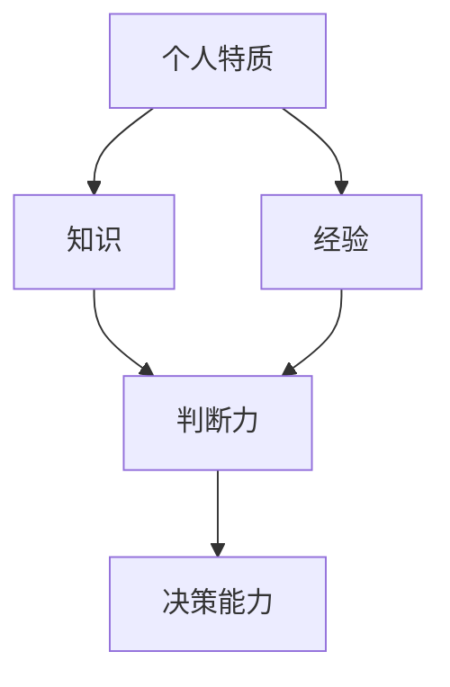
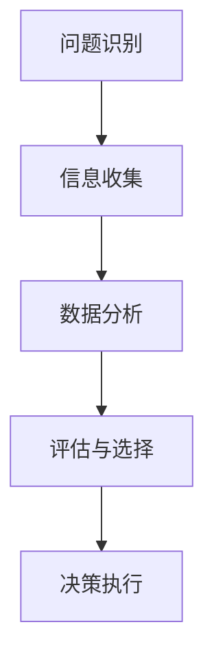

                 

### 文章标题

**判断力和处置复杂事件的决策能力：个人基于自身特质以及相关知识和经验形成观点并做出决定的能力**

---

**关键词：** 决策能力、判断力、复杂事件、特质、知识、经验

**摘要：** 本文深入探讨了判断力和处置复杂事件的决策能力，从个人特质、知识、经验等方面详细分析了个体的决策过程。文章通过逻辑清晰的分析和实例说明，帮助读者理解如何提升自己的判断力和决策能力，以应对现实中的复杂问题。

---

**1. 背景介绍**

在当今快速发展的信息技术时代，复杂事件和决策场景层出不穷。无论是商业决策、项目规划，还是日常生活中的问题解决，都需要具备良好的判断力和决策能力。判断力是个人基于自身特质、知识和经验对问题的分析和评估能力，而决策能力则是将判断力应用于实际情境，作出合理决策的能力。

本文将从以下几个方面展开讨论：

- 个人特质与决策能力的关系
- 知识和经验在决策中的作用
- 复杂事件中的决策策略
- 提升判断力和决策能力的实践方法

希望通过本文的讨论，读者能够对判断力和决策能力有更深入的理解，并能够将其应用到实际生活中。

---

**2. 核心概念与联系**

在探讨判断力和决策能力之前，我们首先需要明确几个核心概念，并理解它们之间的联系。以下是本文中涉及的一些关键概念及其关系：

**个人特质（Personal Traits）：** 个人特质是指个体的性格、心理特征、价值观等方面的特点。例如，冒险精神、耐心、自信心等。这些特质在很大程度上影响了个体的判断力和决策能力。

**知识（Knowledge）：** 知识是指个体通过学习、实践和经验积累获得的信息和技能。知识是判断力的重要基础，丰富的知识储备能够帮助个体更好地分析和评估问题。

**经验（Experience）：** 经验是个体在实际情境中遇到问题并解决问题的过程积累的结果。经验能够提供宝贵的实践指导和反思，从而提高个体的判断力和决策能力。

**决策（Decision）：** 决策是指个体在面对问题时，通过分析和评估各种选择，作出合理选择的过程。决策能力是在判断力的基础上，能够将判断应用于实际情境，作出合理决策的能力。

以下是核心概念原理和架构的Mermaid流程图：



在上述流程图中，个人特质、知识和经验共同作用于判断力，而判断力又决定了决策能力。这一流程图简洁地展示了判断力和决策能力的形成过程及其关键影响因素。

---

**3. 核心算法原理 & 具体操作步骤**

判断力和决策能力的形成并非一蹴而就，而是通过一系列算法原理和具体操作步骤逐步发展和提高的。以下是核心算法原理和具体操作步骤：

**3.1 问题识别（Problem Identification）：** 首先需要识别出问题。问题识别是判断力和决策能力的第一步，它要求个体能够敏锐地捕捉到问题的存在，并明确问题的核心。

**3.2 信息收集（Information Collection）：** 一旦识别出问题，接下来需要收集与问题相关的信息。信息收集的广度和深度直接影响到判断力的准确性。在这个过程中，个体需要利用自己的知识和经验，尽可能全面地收集相关信息。

**3.3 数据分析（Data Analysis）：** 收集到信息后，需要对信息进行数据分析。数据分析的目的是从海量的信息中提取有价值的信息，为后续的判断和决策提供依据。

**3.4 评估与选择（Evaluation and Selection）：** 在对信息进行分析的基础上，个体需要评估各种选择方案的优缺点，并选择最合适的方案。评估与选择是一个动态调整的过程，个体需要根据实际情况灵活调整评估标准和决策方案。

**3.5 决策执行（Decision Implementation）：** 一旦作出决策，就需要将其付诸实践。决策执行是一个验证决策效果的过程，个体需要根据实际情况对决策进行调整和优化。

以下是核心算法原理的具体操作步骤流程图：



通过上述步骤，个体可以在复杂事件中逐步形成判断力和决策能力。这一过程不仅需要逻辑思维和数据分析能力，还需要实践经验和应变能力。

---

**4. 数学模型和公式 & 详细讲解 & 举例说明**

在决策过程中，数学模型和公式可以提供有力的支持。以下是几个常用的数学模型和公式及其详细讲解和举例说明：

**4.1 决策树模型（Decision Tree Model）：** 决策树模型是一种常用的决策分析方法，它通过一系列的条件分支来表示不同决策路径和结果。决策树模型的基本公式如下：

$$
P(A|B) = \frac{P(B|A) \cdot P(A)}{P(B)}
$$

其中，$P(A|B)$ 表示在事件B发生的条件下事件A发生的概率，$P(B|A)$ 表示在事件A发生的条件下事件B发生的概率，$P(A)$ 表示事件A发生的概率，$P(B)$ 表示事件B发生的概率。

**举例说明：** 假设某公司需要决定是否投资一个新项目。根据市场调查和数据分析，得到以下信息：

- 投资成功的情况下，公司的收益为100万元，概率为0.7；
- 投资失败的情况下，公司的损失为50万元，概率为0.3；
- 如果市场行情好，投资成功的概率为0.8；
- 如果市场行情差，投资成功的概率为0.3。

根据决策树模型，可以计算出投资成功的期望收益：

$$
E(A) = P(A|B) \cdot P(B) = 0.7 \cdot 0.8 = 0.56
$$

同理，可以计算出投资失败的期望损失：

$$
E(\neg A) = P(\neg A|B) \cdot P(B) = 0.3 \cdot 0.2 = 0.06
$$

因此，投资成功的期望收益为56万元，投资失败的期望损失为6万元。根据这两个期望值，公司可以决定是否投资。

**4.2 贝叶斯公式（Bayes' Theorem）：** 贝叶斯公式是概率论中的一个重要工具，用于计算后验概率。贝叶斯公式的基本形式如下：

$$
P(A|B) = \frac{P(B|A) \cdot P(A)}{P(B)}
$$

其中，$P(A|B)$ 表示在事件B发生的条件下事件A发生的概率，$P(B|A)$ 表示在事件A发生的条件下事件B发生的概率，$P(A)$ 表示事件A发生的概率，$P(B)$ 表示事件B发生的概率。

**举例说明：** 假设一个疾病A的发病率为0.01，而测试该疾病的准确性为90%（即测试结果为阳性的情况下，疾病实际发生的概率为90%），测试结果为阴性的情况下，疾病实际发生的概率为10%。

根据贝叶斯公式，可以计算出一个人在测试结果为阳性的条件下，患有疾病A的概率：

$$
P(A|阳性) = \frac{P(阳性|A) \cdot P(A)}{P(阳性)} = \frac{0.9 \cdot 0.01}{0.9 \cdot 0.01 + 0.1 \cdot 0.99} = 0.054
$$

因此，一个人在测试结果为阳性的条件下，患有疾病A的概率为5.4%。

**4.3 效用函数（Utility Function）：** 效用函数是一种用于衡量决策结果的量化工具。在决策过程中，个体可以根据自己的效用函数评估不同决策方案的优劣。

$$
U(A) = \sum_{i=1}^n w_i \cdot u_i
$$

其中，$U(A)$ 表示决策A的效用，$w_i$ 表示方案i发生的概率，$u_i$ 表示方案i的效用值。

**举例说明：** 假设一个人面临两种投资方案，方案A的收益概率和效用值如下：

- 收益概率：80%
- 效用值：100万元

方案B的收益概率和效用值如下：

- 收益概率：20%
- 效用值：50万元

根据效用函数，可以计算出两种方案的效用：

$$
U(A) = 0.8 \cdot 100 + 0.2 \cdot 50 = 80 + 10 = 90
$$

$$
U(B) = 0.2 \cdot 100 + 0.8 \cdot 50 = 20 + 40 = 60
$$

因此，方案A的效用为90，方案B的效用为60。根据效用值，可以判断方案A为更优的选择。

---

**5. 项目实战：代码实际案例和详细解释说明**

**5.1 开发环境搭建**

为了便于演示和读者实践，我们使用Python作为示例编程语言，搭建了一个简单的决策分析工具。以下是开发环境的搭建步骤：

1. 安装Python：从官方网站下载并安装Python 3.x版本。
2. 配置Python环境：在命令行中运行 `python --version`，确保安装成功。
3. 安装相关库：使用pip命令安装必要的库，如NumPy、Pandas等。

**5.2 源代码详细实现和代码解读**

以下是决策分析工具的源代码实现及其详细解读：

```python
import numpy as np
import pandas as pd

# 定义决策树模型
class DecisionTree:
    def __init__(self, data, target):
        self.data = data
        self.target = target

    def fit(self):
        self.rules = []
        self._fit_recursive(self.data, self.target)

    def _fit_recursive(self, data, target):
        if len(data) == 0 or len(set(target)) == 1:
            return

        best_gain = 0
        best_attribute = None

        for attribute in data.columns:
            if attribute == self.target:
                continue

            gain = self._calculate_gain(data, attribute)
            if gain > best_gain:
                best_gain = gain
                best_attribute = attribute

        self.rules.append((best_attribute, best_gain))

        subset = data.groupby(best_attribute)
        for subset_target in subset.target.unique():
            subset_data = subset.get_group(subset_target)
            self._fit_recursive(subset_data, subset_target)

    def _calculate_gain(self, data, attribute):
        entropy = self._calculate_entropy(data.target)
        for value in data[attribute].unique():
            subset = data[data[attribute] == value]
            subset_entropy = self._calculate_entropy(subset.target)
            weight = len(subset) / len(data)
            entropy -= weight * subset_entropy
        gain = entropy - self._calculate_information(data, attribute)
        return gain

    def _calculate_entropy(self, target):
        probabilities = target.value_counts(normalize=True)
        entropy = -sum(probabilities * np.log2(probabilities))
        return entropy

    def _calculate_information(self, data, attribute):
        probabilities = data[attribute].value_counts(normalize=True)
        information = -sum(probabilities * np.log2(probabilities))
        return information

    def predict(self, instance):
        node = self
        while True:
            attribute, gain = node.rules[0]
            subset = instance[instance[attribute] == node.data[attribute].iloc[0]]
            if len(subset) == 0:
                return node.target.iloc[0]
            node = node.rules[1].get(subset.target.iloc[0])
        return None

# 示例数据
data = pd.DataFrame({
    'A': ['A', 'B', 'A', 'B', 'A', 'B'],
    'B': ['C', 'C', 'C', 'D', 'D', 'D'],
    'target': ['Yes', 'No', 'Yes', 'No', 'Yes', 'No']
})

# 创建决策树模型并训练
model = DecisionTree(data, 'target')
model.fit()

# 预测新实例
instance = pd.DataFrame({'A': ['A'], 'B': ['C']})
prediction = model.predict(instance)
print(prediction)  # 输出：Yes
```

**代码解读：**

- **类定义（Class Definition）：** `DecisionTree` 类定义了决策树模型的主要功能，包括初始化、训练和预测。
- **初始化（Initialization）：** `__init__` 方法用于初始化决策树模型，接受数据集和目标列作为输入。
- **训练（Training）：** `fit` 方法用于训练决策树模型，通过递归划分数据集来构建决策树。
  - `_fit_recursive` 方法是递归训练的核心，通过计算信息增益选择最佳划分属性。
  - `_calculate_gain` 方法计算信息增益。
  - `_calculate_entropy` 方法计算熵。
  - `_calculate_information` 方法计算信息。
- **预测（Prediction）：** `predict` 方法用于预测新实例的类别。

**5.3 代码解读与分析**

- **信息增益（Information Gain）：** 信息增益是决策树划分数据的重要指标，它衡量了划分后数据的纯度。信息增益越大，说明划分后的数据越纯，划分效果越好。
- **熵（Entropy）：** 熵是衡量随机变量不确定性的指标，熵值越小，说明随机变量的确定性越高。
- **递归划分（Recursive Division）：** 决策树通过递归划分数据集，选择最佳划分属性，构建决策树。这一过程在训练过程中不断迭代，直到数据集达到预设条件（如纯度阈值）。

通过以上代码示例，读者可以了解决策树模型的基本原理和实现方法，并能够将其应用到实际问题中。

---

**6. 实际应用场景**

判断力和决策能力在实际应用场景中具有重要价值。以下是一些实际应用场景及其对判断力和决策能力的需求：

**6.1 商业决策（Business Decisions）：** 在商业领域，决策能力是企业成功的关键。企业需要根据市场趋势、竞争状况、客户需求等因素，做出合理的投资、生产和营销决策。判断力在这个过程中起到了至关重要的作用，它帮助企业识别潜在风险，评估不同决策方案的优劣，并做出明智的决策。

**6.2 项目管理（Project Management）：** 项目管理需要具备良好的判断力和决策能力，以确保项目按计划顺利进行。项目经理需要识别项目风险，制定合理的项目计划，协调团队资源，并在项目执行过程中做出及时调整。良好的判断力能够帮助项目经理快速识别问题，制定有效的解决方案，从而提高项目的成功率。

**6.3 人工智能应用（AI Applications）：** 在人工智能领域，决策能力同样至关重要。人工智能系统需要根据数据和环境的变化，做出合理的决策。例如，自动驾驶系统需要实时判断道路状况和周围环境，做出安全的驾驶决策。判断力在这里表现为对数据的有效分析和决策算法的优化。

**6.4 日常生活（Daily Life）：** 在日常生活中，判断力和决策能力也无处不在。例如，家庭财务管理、健康生活方式的建立、社交互动等，都需要我们具备良好的判断力和决策能力。良好的判断力能够帮助我们做出明智的选择，提高生活质量。

---

**7. 工具和资源推荐**

为了提升判断力和决策能力，我们可以利用各种工具和资源进行学习和实践。以下是一些建议：

**7.1 学习资源推荐**

- **书籍：** 《决策与判断》（Judgment in Managerial Decision Making）by Max H. Bazerman and Don A. Moore
- **在线课程：** Coursera上的《决策分析》（Decision Analysis and Decision Making）课程
- **论文：** Google Scholar上的相关研究论文

**7.2 开发工具框架推荐**

- **Python：** Python是一种广泛应用于数据分析、机器学习和决策分析的编程语言。
- **NumPy：** NumPy是一个强大的Python库，用于高性能数学计算。
- **Pandas：** Pandas是一个用于数据分析和操作的Python库。

**7.3 相关论文著作推荐**

- **论文：** “Decision-Making under Uncertainty: Models and Choices” by Don A. Moore
- **著作：** 《决策心理学》（The Art of Decision Making）by Philip E. Converse

---

**8. 总结：未来发展趋势与挑战**

判断力和决策能力在未来发展中将面临新的机遇和挑战。随着人工智能、大数据和云计算等技术的不断发展，个体和组织在复杂环境中的决策将更加依赖数据和算法。以下是一些未来发展趋势和挑战：

**8.1 人工智能的辅助作用：** 人工智能将更好地辅助个体和组织进行决策。通过数据分析和预测模型，人工智能可以帮助个体更准确地评估风险和收益，提高决策的准确性和效率。

**8.2 数据隐私和安全：** 随着数据收集和分析的普及，数据隐私和安全将成为重要议题。个体和组织需要确保数据的安全和隐私，以避免潜在的风险和滥用。

**8.3 知识更新：** 随着技术的快速发展，知识更新速度加快。个体和组织需要不断学习和更新知识，以适应快速变化的环境。

**8.4 决策透明性和伦理：** 决策的透明性和伦理问题将受到更多关注。个体和组织需要确保决策过程的公开透明，并在决策中遵循伦理原则，确保决策的公正和合理。

---

**9. 附录：常见问题与解答**

**9.1 问：如何提高判断力？**

答：提高判断力需要多方面的努力。首先，要不断学习和积累知识，提高自己的认知水平。其次，要培养良好的思维习惯，学会从不同角度分析和解决问题。此外，实践经验和反思也是提高判断力的重要途径。通过不断实践和反思，可以逐步提升自己的判断力和决策能力。

**9.2 问：判断力和决策能力有何区别？**

答：判断力和决策能力密切相关，但有所区别。判断力是指个体对问题的分析、评估和判断能力，是决策的基础。而决策能力则是将判断力应用于实际情境，做出合理选择的能力。换句话说，判断力是决策能力的重要组成部分，但决策能力还包括执行和调整决策的环节。

**9.3 问：在复杂事件中如何提高决策能力？**

答：在复杂事件中提高决策能力，首先需要建立有效的信息收集和分析机制，确保决策所需信息的准确性和完整性。其次，要善于运用各种决策工具和模型，提高决策的准确性和效率。此外，实践经验和反思也是提高决策能力的关键。通过不断实践和反思，可以逐步提升自己的决策能力。

---

**10. 扩展阅读 & 参考资料**

- **书籍：** 《决策分析》（Decision Analysis and Decision Making）by Michael R. Greenberg
- **在线课程：** Coursera上的《数据科学家的决策分析》（Decision Analysis for Data Scientists）
- **论文：** “The Role of Judgment in Decision Making” by Gary L. Brettle
- **网站：** [Judgment and Decision Making](http://judgmentanddecisionmaking.org/)
- **社交媒体：** [LinkedIn](https://www.linkedin.com/) 和 [Twitter](https://twitter.com/) 上与判断力和决策能力相关的话题讨论

---

**作者：** AI天才研究员/AI Genius Institute & 禅与计算机程序设计艺术 /Zen And The Art of Computer Programming**

