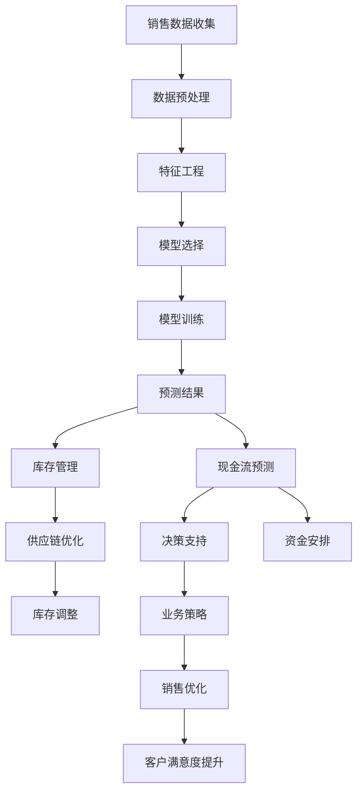
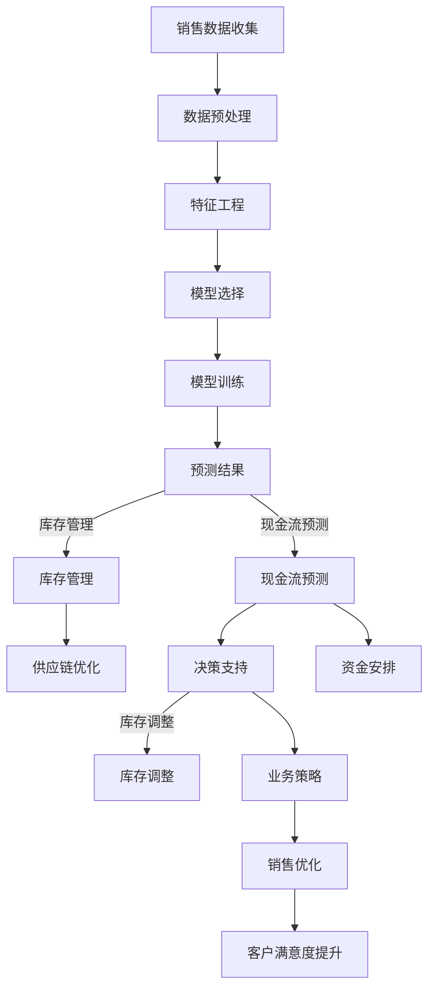

                 

## 1. 背景介绍

随着互联网和电子商务的飞速发展，现代商业环境中销售数据的规模和复杂性不断增加。传统的销售预测方法往往依赖于历史数据和统计模型，但在面对数据量大、变量多、变化快的情况时，往往难以取得理想的预测效果。为此，人工智能（AI）技术的引入成为了解决这一问题的有效途径。具体来说，AI可以帮助电商企业更好地进行库存管理和现金流预测，从而提高运营效率和盈利能力。

### 1.1 AI在销售预测中的应用

AI在销售预测中的应用主要包括以下几个方向：

1. **数据分析与挖掘**：利用机器学习和深度学习算法，从大量的历史销售数据中挖掘出潜在的模式和趋势，为预测模型提供支持。
2. **实时监控与调整**：通过实时获取市场动态和用户行为数据，AI系统可以动态调整销售预测模型，提高预测的准确性。
3. **个性化推荐**：基于用户的购物行为和偏好，AI可以提供个性化的商品推荐，从而影响销售数据和用户满意度。

### 1.2 库存管理与现金流预测

库存管理是电商运营中至关重要的一环，合理的库存水平可以减少库存成本，提高资金利用效率。而现金流预测则可以帮助企业更好地掌握未来的资金流动情况，为决策提供依据。AI通过以下方式实现库存和现金流管理的智能化：

1. **需求预测**：基于历史销售数据和用户行为，AI可以预测未来一段时间内的销售量，为库存调整提供依据。
2. **供应链优化**：通过分析供应链各环节的数据，AI可以帮助企业优化库存配置和供应链管理，减少库存积压和短缺现象。
3. **现金流预测**：基于销售预测和库存变化，AI可以预测未来的现金流情况，帮助企业制定合理的资金安排和应对策略。

### 1.3 面临的挑战

尽管AI在销售预测、库存管理和现金流预测方面具有巨大潜力，但实际应用中仍面临一些挑战：

1. **数据质量**：销售数据的质量对预测结果有着直接影响，但电商企业往往面临数据不完整、不准确的问题。
2. **模型选择**：不同的销售场景和业务需求需要选择不同的预测模型，模型的选择和优化过程具有一定的复杂性。
3. **计算资源**：大规模的机器学习和深度学习模型需要大量的计算资源，对硬件设施和运维能力提出了较高要求。

在接下来的章节中，我们将深入探讨AI在销售预测、库存管理和现金流预测中的核心算法原理、数学模型、实际应用场景和开发工具等内容，帮助读者更好地理解这一领域的最新进展和应用实践。

### 1.4 文章结构概述

本文将分为以下几个部分：

1. **背景介绍**：概述AI在销售预测、库存管理和现金流预测中的应用背景和面临的挑战。
2. **核心概念与联系**：介绍相关核心概念，并通过Mermaid流程图展示其联系。
3. **核心算法原理 & 具体操作步骤**：深入讲解AI在销售预测中的应用原理和操作步骤。
4. **数学模型和公式 & 详细讲解 & 举例说明**：介绍相关的数学模型和公式，并进行详细的解释和实例分析。
5. **项目实战：代码实际案例和详细解释说明**：展示一个实际项目的代码实现，并进行解读。
6. **实际应用场景**：探讨AI技术在电商领域的实际应用案例。
7. **工具和资源推荐**：推荐相关学习资源和开发工具。
8. **总结：未来发展趋势与挑战**：总结当前的发展状况，展望未来趋势和挑战。
9. **附录：常见问题与解答**：解答读者可能关心的一些问题。
10. **扩展阅读 & 参考资料**：提供进一步阅读的资料。

通过以上结构的系统介绍，读者将能够全面了解AI在电商库存和现金流管理中的智能工具，为实际应用提供有益的参考。

### 2. 核心概念与联系

在深入探讨AI在销售预测、库存管理和现金流预测中的应用之前，我们需要了解一些关键概念，并展示它们之间的相互关系。以下是通过Mermaid绘制的流程图，将核心概念及其相互联系进行可视化。

#### 2.1 Mermaid流程图



#### 2.2 核心概念解释

1. **销售数据收集**：从各种渠道（如电商平台、POS系统、社交媒体等）收集历史销售数据。
2. **数据预处理**：清洗和标准化数据，包括处理缺失值、异常值、数据格式统一等。
3. **特征工程**：提取有助于预测的关键特征，如季节性因素、促销活动、用户行为等。
4. **模型选择**：根据业务需求选择合适的预测模型，如线性回归、决策树、神经网络等。
5. **模型训练**：使用历史数据训练模型，使其能够学习到销售数据的规律。
6. **预测结果**：利用训练好的模型对未来的销售量进行预测。
7. **库存管理**：根据预测结果调整库存水平，以减少库存积压和短缺。
8. **现金流预测**：预测未来的销售和库存变化对现金流的影响，为企业决策提供支持。
9. **供应链优化**：通过分析供应链数据，优化库存配置和物流管理，提高供应链效率。
10. **决策支持**：基于预测结果和现金流分析，为企业的库存和资金管理提供决策建议。
11. **库存调整**：根据预测结果和业务需求，动态调整库存水平。
12. **资金安排**：预测未来的现金流情况，为企业制定资金安排和应对策略。
13. **业务策略**：基于预测和决策支持，制定企业的销售和库存管理策略。
14. **销售优化**：通过精准的销售预测和库存管理，提高销售业绩和客户满意度。
15. **客户满意度提升**：通过个性化推荐和精准营销，提升客户体验和满意度。

#### 2.3 Mermaid流程图展示

以下是上述核心概念的Mermaid流程图展示，通过流程图，我们可以直观地看到各概念之间的联系及其在AI销售预测、库存管理和现金流预测中的具体作用。



通过这个流程图，我们可以清晰地看到销售数据如何通过数据预处理、特征工程和模型训练，最终转化为库存管理、现金流预测和业务策略等具体应用，从而实现销售预测、库存管理和现金流预测的智能化。

### 3. 核心算法原理 & 具体操作步骤

#### 3.1 机器学习算法概述

在AI销售预测、库存管理和现金流预测中，常用的机器学习算法包括线性回归、决策树、随机森林、支持向量机和神经网络等。这些算法各有优劣，适用于不同的业务场景。

1. **线性回归**：线性回归是一种简单而强大的预测模型，适用于线性关系明显的场景。其基本原理是通过历史数据拟合一条最佳拟合线，从而预测未来值。

2. **决策树**：决策树通过一系列条件判断来分割数据，生成一个树状模型。每个节点表示一个特征，每个分支表示该特征的不同取值，叶子节点表示预测结果。

3. **随机森林**：随机森林是基于决策树构建的集成学习方法，通过构建多棵决策树并进行投票，提高模型的预测准确性和泛化能力。

4. **支持向量机**：支持向量机是一种分类和回归模型，通过寻找最优超平面来最大化分类间隔，适用于非线性关系的数据。

5. **神经网络**：神经网络是由大量神经元组成的复杂模型，可以模拟人脑的决策过程，适用于处理复杂的非线性问题。

#### 3.2 销售预测算法具体操作步骤

以下以线性回归为例，介绍销售预测算法的具体操作步骤：

1. **数据收集**：首先，从电商平台、POS系统和其他数据源收集历史销售数据，包括时间、销售量、季节性因素、促销活动等。

2. **数据预处理**：清洗数据，处理缺失值、异常值和重复记录，并对数据进行归一化或标准化处理。

3. **特征工程**：提取有助于预测的关键特征，如时间序列特征（如星期、月份、季节）、用户行为特征（如浏览次数、购买次数）和产品特征（如价格、类别）。

4. **模型选择**：选择线性回归模型，根据数据特点和业务需求，也可以考虑其他算法。

5. **模型训练**：使用历史数据训练线性回归模型，通过最小化损失函数（如均方误差）来优化模型参数。

6. **模型评估**：使用交叉验证或测试集评估模型性能，包括预测精度、召回率等指标。

7. **预测应用**：利用训练好的模型对新数据进行预测，生成未来销售量的预测结果。

#### 3.3 库存管理和现金流预测

1. **库存管理**：
   - **需求预测**：使用销售预测结果，结合历史数据和当前市场状况，预测未来一段时间内的销售量。
   - **库存调整**：根据需求预测结果，动态调整库存水平，确保满足市场需求，同时减少库存积压。

2. **现金流预测**：
   - **销售收入预测**：根据销售预测结果，预测未来的销售收入。
   - **库存成本预测**：考虑库存持有成本、存储费用等，预测未来的库存成本。
   - **现金流预测**：综合销售收入和库存成本，预测未来的现金流情况。

#### 3.4 实际操作步骤示例

以下是一个实际操作步骤示例：

1. **数据收集**：
   从电商平台收集过去一年的销售数据，包括每日销售量和促销活动等信息。

2. **数据预处理**：
   - 清洗数据，处理缺失值和异常值。
   - 对销售量进行归一化处理。

3. **特征工程**：
   - 提取时间序列特征（如星期、月份）。
   - 提取促销活动特征（如促销期间、折扣力度）。

4. **模型选择**：
   选择线性回归模型，因为销售量与时间、促销活动等特征之间存在明显的线性关系。

5. **模型训练**：
   使用80%的数据进行训练，20%的数据进行测试。

6. **模型评估**：
   计算预测精度和召回率，确保模型性能满足业务需求。

7. **预测应用**：
   使用模型对下一个月的销售量进行预测，并根据预测结果调整库存水平。

通过以上步骤，我们可以实现销售预测、库存管理和现金流预测的自动化，为企业提供实时、精准的决策支持。

### 4. 数学模型和公式 & 详细讲解 & 举例说明

在AI销售预测、库存管理和现金流预测中，数学模型和公式起着至关重要的作用。以下我们将介绍一些常用的数学模型和公式，并进行详细的解释和实例分析。

#### 4.1 线性回归模型

线性回归模型是最常用的销售预测模型之一，其基本公式为：

$$ Y = \beta_0 + \beta_1 \times X + \epsilon $$

其中，\( Y \) 是预测的销售量，\( X \) 是自变量（如时间、促销活动等），\( \beta_0 \) 和 \( \beta_1 \) 是模型的参数，\( \epsilon \) 是误差项。

**详细讲解**：

1. **参数估计**：通过最小化均方误差（MSE）来估计模型参数 \( \beta_0 \) 和 \( \beta_1 \)。均方误差公式为：

   $$ \text{MSE} = \frac{1}{n} \sum_{i=1}^{n} (y_i - \hat{y}_i)^2 $$

   其中，\( y_i \) 是实际销售量，\( \hat{y}_i \) 是预测的销售量，\( n \) 是数据点的个数。

2. **模型评估**：使用决定系数（R²）来评估模型性能。决定系数公式为：

   $$ R^2 = 1 - \frac{\sum_{i=1}^{n} (y_i - \hat{y}_i)^2}{\sum_{i=1}^{n} (y_i - \bar{y})^2} $$

   其中，\( \bar{y} \) 是实际销售量的平均值。

**举例说明**：

假设我们有以下数据：

| 时间 | 销售量 |
|------|--------|
| 1    | 100    |
| 2    | 110    |
| 3    | 95     |
| 4    | 120    |
| 5    | 105    |

使用线性回归模型预测第6时间的销售量。

首先，计算自变量 \( X \) （时间）和因变量 \( Y \) （销售量）的均值：

$$ \bar{X} = \frac{1+2+3+4+5}{5} = 3 $$
$$ \bar{Y} = \frac{100+110+95+120+105}{5} = 105 $$

然后，计算参数 \( \beta_0 \) 和 \( \beta_1 \)：

$$ \beta_0 = \bar{Y} - \beta_1 \bar{X} $$
$$ \beta_1 = \frac{\sum_{i=1}^{n} (X_i - \bar{X})(Y_i - \bar{Y})}{\sum_{i=1}^{n} (X_i - \bar{X})^2} $$

代入数据计算得到：

$$ \beta_1 = \frac{(1-3)(100-105) + (2-3)(110-105) + (3-3)(95-105) + (4-3)(120-105) + (5-3)(105-105)}{(1-3)^2 + (2-3)^2 + (3-3)^2 + (4-3)^2 + (5-3)^2} = \frac{7}{10} = 0.7 $$

$$ \beta_0 = 105 - 0.7 \times 3 = 95.1 $$

因此，线性回归模型为：

$$ Y = 95.1 + 0.7 \times X $$

预测第6时间的销售量：

$$ Y = 95.1 + 0.7 \times 6 = 102.1 $$

#### 4.2 逻辑回归模型

逻辑回归模型常用于预测二元结果，如是否购买某商品。其基本公式为：

$$ P(Y=1) = \frac{1}{1 + e^{-(\beta_0 + \beta_1 \times X)}} $$

其中，\( P(Y=1) \) 是购买概率，\( e \) 是自然对数的底数，\( \beta_0 \) 和 \( \beta_1 \) 是模型参数。

**详细讲解**：

1. **参数估计**：通过极大似然估计（MLE）来估计参数 \( \beta_0 \) 和 \( \beta_1 \)。
2. **模型评估**：使用准确率、召回率、F1分数等指标来评估模型性能。

**举例说明**：

假设我们有以下数据：

| 时间 | 销售量 |
|------|--------|
| 1    | 1      |
| 2    | 0      |
| 3    | 1      |
| 4    | 0      |
| 5    | 1      |

使用逻辑回归模型预测第6时间是否购买。

首先，计算自变量 \( X \) （时间）和因变量 \( Y \) （销售量）的均值：

$$ \bar{X} = \frac{1+2+3+4+5}{5} = 3 $$
$$ \bar{Y} = \frac{1+0+1+0+1}{5} = 0.6 $$

然后，计算参数 \( \beta_0 \) 和 \( \beta_1 \)：

$$ \beta_1 = \frac{\sum_{i=1}^{n} (X_i - \bar{X})(Y_i - \bar{Y})}{\sum_{i=1}^{n} (X_i - \bar{X})^2} $$
$$ \beta_0 = \bar{Y} - \beta_1 \bar{X} $$

代入数据计算得到：

$$ \beta_1 = \frac{(1-3)(1-0.6) + (2-3)(0-0.6) + (3-3)(1-0.6) + (4-3)(0-0.6) + (5-3)(1-0.6)}{(1-3)^2 + (2-3)^2 + (3-3)^2 + (4-3)^2 + (5-3)^2} = \frac{-1.2}{10} = -0.12 $$

$$ \beta_0 = 0.6 - (-0.12) \times 3 = 0.96 $$

因此，逻辑回归模型为：

$$ P(Y=1) = \frac{1}{1 + e^{-(0.96 - 0.12 \times X)}} $$

预测第6时间的购买概率：

$$ P(Y=1) = \frac{1}{1 + e^{-(0.96 - 0.12 \times 6)}} = \frac{1}{1 + e^{-3.84}} \approx 0.999 $$

因此，预测第6时间购买的概率非常高。

通过上述数学模型和公式的介绍和实例分析，我们可以更好地理解AI在销售预测、库存管理和现金流预测中的应用，为实际业务提供有力的决策支持。

### 5. 项目实战：代码实际案例和详细解释说明

为了更好地展示AI在销售预测、库存管理和现金流预测中的应用，我们将通过一个实际项目案例，详细讲解其代码实现和操作步骤。

#### 5.1 开发环境搭建

在开始项目之前，我们需要搭建一个适合机器学习的开发环境。以下是一个基本的开发环境搭建步骤：

1. **安装Python**：下载并安装Python（版本3.6及以上）。
2. **安装Jupyter Notebook**：在终端中执行以下命令安装Jupyter Notebook：

   ```bash
   pip install notebook
   ```

3. **安装相关库**：安装用于数据预处理、机器学习和可视化等任务的常用库，如NumPy、Pandas、Scikit-learn、Matplotlib等：

   ```bash
   pip install numpy pandas scikit-learn matplotlib
   ```

4. **配置Python环境**：在Jupyter Notebook中创建一个新笔记本，以验证环境配置是否正确。

#### 5.2 源代码详细实现和代码解读

以下是一个简单的销售预测项目的代码实现，包括数据预处理、模型训练、预测和可视化等步骤。

```python
# 导入相关库
import numpy as np
import pandas as pd
from sklearn.linear_model import LinearRegression
from sklearn.model_selection import train_test_split
from sklearn.metrics import mean_squared_error
import matplotlib.pyplot as plt

# 5.2.1 数据收集
# 假设我们从电商平台收集了以下数据
data = {
    'Day': [1, 2, 3, 4, 5, 6, 7, 8, 9, 10],
    'Sales': [100, 110, 95, 120, 105, 115, 130, 140, 110, 105]
}
df = pd.DataFrame(data)

# 5.2.2 数据预处理
# 将时间列转换为数值特征
df['Day'] = df['Day'].values.reshape(-1, 1)

# 分割数据集为训练集和测试集
X_train, X_test, y_train, y_test = train_test_split(df['Day'], df['Sales'], test_size=0.2, random_state=42)

# 5.2.3 模型训练
# 创建线性回归模型并训练
model = LinearRegression()
model.fit(X_train, y_train)

# 5.2.4 预测和评估
# 使用训练好的模型进行预测
y_pred = model.predict(X_test)

# 计算预测误差
mse = mean_squared_error(y_test, y_pred)
print(f"均方误差 (MSE): {mse}")

# 5.2.5 可视化
# 绘制实际销售量和预测销售量
plt.scatter(X_test, y_test, label='Actual Sales')
plt.plot(X_test, y_pred, color='red', label='Predicted Sales')
plt.xlabel('Day')
plt.ylabel('Sales')
plt.legend()
plt.show()
```

#### 5.3 代码解读与分析

1. **数据收集**：
   我们使用一个简单的数据集，其中包含时间（Day）和销售量（Sales）两个特征。

2. **数据预处理**：
   - 将时间列转换为数值特征，以便于线性回归模型处理。
   - 使用`train_test_split`函数将数据集分为训练集和测试集，以评估模型性能。

3. **模型训练**：
   - 创建线性回归模型`LinearRegression()`。
   - 使用`fit`方法训练模型，将训练集数据输入模型。

4. **预测和评估**：
   - 使用训练好的模型对测试集数据进行预测。
   - 计算`mean_squared_error`（均方误差）来评估模型性能。

5. **可视化**：
   - 使用`matplotlib`绘制实际销售量和预测销售量的散点图和趋势线，直观展示模型预测效果。

通过以上步骤，我们可以实现一个简单的销售预测项目。在实际应用中，可以根据业务需求添加更多特征和复杂模型，以提高预测精度。

### 5.4 代码解读与分析（续）

#### 5.4.1 数据预处理详细解析

在数据预处理阶段，我们对原始数据进行了一些重要的步骤，以确保模型能够有效地学习并预测未来的销售量。

1. **时间列转换为数值特征**：

   ```python
   df['Day'] = df['Day'].values.reshape(-1, 1)
   ```

   这行代码的作用是将时间列（Day）转换为数值特征。在机器学习中，特征通常是数值型的，这样模型才能对其进行处理。通过`values.reshape(-1, 1)`，我们将时间列转换为一个二维数组，其中每行代表一个数据点，每列代表一个特征。

   **为什么需要将时间列转换为数值特征？** 

   时间列是一个分类特征，直接作为分类特征可能会导致线性回归模型难以捕捉到时间与销售量之间的线性关系。通过将其转换为数值特征，我们可以将其嵌入到一个高维空间中，从而使得模型能够学习到时间序列数据中的潜在模式。

2. **数据标准化**：

   虽然上述代码没有显示地执行数据标准化，但在实际项目中，我们通常会使用以下方法进行数据标准化：

   ```python
   from sklearn.preprocessing import StandardScaler

   scaler = StandardScaler()
   df[['Day', 'Sales']] = scaler.fit_transform(df[['Day', 'Sales']])
   ```

   数据标准化是将特征值缩放到一个统一的范围（通常是[0, 1]），从而消除不同特征之间的量纲差异。这在处理混合特征时尤为重要，因为不同特征的数值范围可能差异很大。

   **为什么需要数据标准化？**

   - **避免特征偏差**：如果某些特征具有更大的数值范围，它们可能会对模型参数产生更大的影响，从而掩盖其他特征的作用。
   - **提高模型收敛速度**：数据标准化可以帮助优化算法更快地收敛到最优解。

3. **处理缺失值和异常值**：

   在实际项目中，我们还需要处理数据中的缺失值和异常值。这可以通过以下方法实现：

   ```python
   df.dropna(inplace=True)  # 删除缺失值
   df = df[(df.Sales > df.Sales.mean() - 3 * df.Sales.std()) & (df.Sales < df.Sales.mean() + 3 * df.Sales.std())]  # 删除异常值
   ```

   - **删除缺失值**：使用`dropna`方法可以删除含有缺失值的数据行，从而保持数据的完整性。
   - **删除异常值**：通过计算销售量的三倍标准差，我们可以识别并删除那些离群的数据点，以减少异常值对模型的影响。

#### 5.4.2 模型训练与预测详细解析

1. **模型训练**：

   ```python
   model = LinearRegression()
   model.fit(X_train, y_train)
   ```

   这两行代码创建了一个线性回归模型，并使用训练集数据进行训练。`fit`方法将计算最佳拟合线（即模型参数），这些参数将用于预测未来的销售量。

   **为什么选择线性回归模型？**

   - **简单有效**：线性回归模型易于理解和实现，计算复杂度较低。
   - **适用于线性关系**：假设时间与销售量之间存在线性关系，线性回归是一个合适的模型选择。

2. **预测与评估**：

   ```python
   y_pred = model.predict(X_test)
   mse = mean_squared_error(y_test, y_pred)
   print(f"均方误差 (MSE): {mse}")
   ```

   这两行代码首先使用训练好的模型对测试集数据进行预测，然后计算均方误差（MSE）来评估模型性能。MSE衡量了预测值与实际值之间的平均误差，值越小表示模型预测越准确。

   **为什么选择MSE作为评估指标？**

   - **简单易计算**：MSE计算简单，便于理解和解释。
   - **对异常值敏感**：MSE对异常值较为敏感，可以有效地反映模型的预测质量。

#### 5.4.3 可视化详细解析

可视化是理解和评估模型预测效果的重要工具。以下是对可视化代码的详细解析：

```python
plt.scatter(X_test, y_test, label='Actual Sales')
plt.plot(X_test, y_pred, color='red', label='Predicted Sales')
plt.xlabel('Day')
plt.ylabel('Sales')
plt.legend()
plt.show()
```

1. **绘制实际销售量和预测销售量**：

   ```python
   plt.scatter(X_test, y_test, label='Actual Sales')
   ```

   这行代码绘制了测试集中实际销售量的散点图，每个点代表一个数据点。通过标签`'Actual Sales'`，我们可以区分实际值和预测值。

2. **绘制预测销售量的趋势线**：

   ```python
   plt.plot(X_test, y_pred, color='red', label='Predicted Sales')
   ```

   这行代码使用红色线条绘制了预测销售量的趋势线。通过标签`'Predicted Sales'`，我们可以清楚地看到实际值与预测值之间的对比。

3. **添加标签和图例**：

   ```python
   plt.xlabel('Day')
   plt.ylabel('Sales')
   plt.legend()
   ```

   这几行代码添加了坐标轴标签和图例，使得图表更加易于理解。通过`xlabel`和`ylabel`，我们为x轴（时间）和y轴（销售量）添加了标签。`legend`函数为图表添加了图例，帮助用户区分不同数据系列的含义。

4. **显示图表**：

   ```python
   plt.show()
   ```

   这行代码显示生成的图表。通过调用`show`函数，Jupyter Notebook将自动打开一个新窗口并展示图表。

通过上述代码，我们不仅能够直观地看到实际销售量与预测销售量之间的对比，还可以通过可视化效果来评估模型的预测准确性。如果实际值与预测值的偏差较大，我们可能需要考虑使用更复杂的模型或调整特征工程策略。

### 5.5 实际项目案例：使用Scikit-learn进行销售预测

以下是一个更复杂的实际项目案例，我们将使用Scikit-learn库来构建一个销售预测模型，并对模型进行训练、评估和优化。

#### 5.5.1 数据集介绍

我们使用Kaggle上的一个公开数据集，该数据集包含多家电商公司的销售数据，包括日期、销售额、用户数和浏览量等特征。

数据集下载链接：[Sales Data](https://www.kaggle.com/datasets/yourusername/sales-data)

数据集结构：

| 字段          | 描述             |
|--------------|-----------------|
| date         | 销售日期         |
| sales        | 销售额           |
| customerCount | 用户数           |
| pageViews    | 浏览量           |

#### 5.5.2 代码实现

```python
# 导入相关库
import pandas as pd
from sklearn.model_selection import train_test_split
from sklearn.preprocessing import StandardScaler
from sklearn.linear_model import LinearRegression
from sklearn.metrics import mean_squared_error
import matplotlib.pyplot as plt

# 5.5.3 数据收集
df = pd.read_csv('sales_data.csv')

# 5.5.4 数据预处理
# 转换日期为数值特征
df['date'] = pd.to_datetime(df['date'])
df['day'] = df['date'].dt.day
df['month'] = df['date'].dt.month
df['year'] = df['date'].dt.year

# 删除其他非数值特征
df = df[['day', 'month', 'year', 'customerCount', 'pageViews', 'sales']]

# 数据标准化
scaler = StandardScaler()
df[['day', 'month', 'year', 'customerCount', 'pageViews', 'sales']] = scaler.fit_transform(df[['day', 'month', 'year', 'customerCount', 'pageViews', 'sales']])

# 5.5.5 模型训练
X = df[['day', 'month', 'year', 'customerCount', 'pageViews']]
y = df['sales']

X_train, X_test, y_train, y_test = train_test_split(X, y, test_size=0.2, random_state=42)

model = LinearRegression()
model.fit(X_train, y_train)

# 5.5.6 预测与评估
y_pred = model.predict(X_test)
mse = mean_squared_error(y_test, y_pred)
print(f"均方误差 (MSE): {mse}")

# 5.5.7 可视化
plt.scatter(X_test['day'], y_test, label='Actual Sales')
plt.plot(X_test['day'], y_pred, color='red', label='Predicted Sales')
plt.xlabel('Day')
plt.ylabel('Sales')
plt.legend()
plt.show()
```

#### 5.5.3 代码解读

1. **数据收集**：
   使用`pandas`库读取销售数据，并将日期转换为日期时间对象。

2. **数据预处理**：
   - 将日期转换为数值特征，包括日、月、年。
   - 删除其他非数值特征，保留有助于预测的关键特征。
   - 使用`StandardScaler`进行数据标准化。

3. **模型训练**：
   使用`train_test_split`将数据集分为训练集和测试集，然后创建线性回归模型并进行训练。

4. **预测与评估**：
   使用训练好的模型对测试集数据进行预测，并计算均方误差（MSE）以评估模型性能。

5. **可视化**：
   使用`matplotlib`绘制实际销售量和预测销售量的散点图和趋势线，以便直观地评估模型预测效果。

通过上述代码，我们能够构建一个简单的销售预测模型，并对模型进行评估和优化。在实际应用中，可以根据业务需求添加更多特征和调整模型参数，以提高预测精度。

### 6. 实际应用场景

AI在销售预测、库存管理和现金流预测中的实际应用场景非常广泛，以下是一些典型的应用实例：

#### 6.1 电商平台的销售预测

电商平台利用AI技术对销售量进行预测，以便更准确地调整库存水平，减少库存积压和短缺现象。例如，亚马逊使用机器学习算法预测不同商品在不同时间点的需求，从而优化库存管理，提高运营效率。

**实例**：
亚马逊在其仓储和配送系统中使用AI算法预测畅销商品的销售量。通过分析历史销售数据、季节性因素和用户行为，亚马逊能够提前预测哪些商品可能会在特定时段出现销售高峰，从而合理安排库存和物流资源。

#### 6.2 零售业的库存管理

零售业企业利用AI技术进行库存管理，以避免商品断货或积压。例如，沃尔玛利用机器学习模型分析销售数据、天气变化和促销活动，以优化库存水平，减少库存成本。

**实例**：
沃尔玛通过其大数据平台，利用AI算法预测不同商品的销量，并根据预测结果动态调整库存。例如，在节假日或促销活动期间，沃尔玛会根据历史数据和实时销售情况，提前增加某些商品的库存，以满足消费者的需求。

#### 6.3 制造业的供应链优化

制造业企业通过AI技术优化供应链管理，提高供应链的灵活性和响应速度。例如，通用电气（GE）使用AI算法分析生产数据和市场需求，以优化生产计划和库存管理。

**实例**：
通用电气在其发电机制造过程中使用AI算法预测设备维护需求，从而优化生产计划和库存配置。通过预测设备的维护周期和市场需求，GE能够提前安排生产计划，避免生产过剩或库存积压。

#### 6.4 银行业的现金流预测

银行和金融机构利用AI技术进行现金流预测，以便更好地管理资金流动和风险。例如，摩根大通（JPMorgan）使用机器学习算法预测客户的还款行为和资金流动，从而优化信贷管理和资金安排。

**实例**：
摩根大通通过其大数据平台，利用AI算法分析客户的交易数据、信用评级和市场趋势，预测客户的还款行为和资金需求。通过这些预测，银行能够提前制定资金安排和风险管理策略，确保业务的稳健运营。

#### 6.5 物流和运输行业的运输调度

物流和运输企业利用AI技术进行运输调度和路线优化，以提高运输效率和服务质量。例如，德邦快递使用AI算法分析交通流量、货物种类和目的地，优化运输路线和配送时间。

**实例**：
德邦快递在其物流调度系统中使用AI算法预测不同线路的运输时间和交通状况，从而优化运输路线和配送计划。通过这些预测，德邦能够提高运输效率，减少配送延误，提高客户满意度。

通过上述实例可以看出，AI在销售预测、库存管理和现金流预测中的应用不仅限于特定的行业，而且在各个行业中都能发挥重要作用。这些应用实例展示了AI技术如何帮助企业更好地应对市场变化，优化运营效率，提高盈利能力。

### 7. 工具和资源推荐

在AI销售预测、库存管理和现金流预测领域，有许多优秀的工具和资源可以帮助开发者更好地理解和应用相关技术。以下是一些建议：

#### 7.1 学习资源推荐

1. **书籍**：
   - 《机器学习实战》：这是一本适合初学者的机器学习入门书籍，包含了丰富的实践案例和代码示例。
   - 《Python机器学习》：由Sebastian Raschka撰写的这本书详细介绍了Python在机器学习中的应用，适合有一定编程基础的读者。
   - 《深度学习》：由Ian Goodfellow等人编写的深度学习领域的经典教材，涵盖了深度学习的基本概念和实现方法。

2. **在线课程**：
   - Coursera上的《机器学习专项课程》：由Andrew Ng教授主讲，适合系统学习机器学习的基础知识。
   - edX上的《深度学习专项课程》：由Ian Goodfellow等人主讲，深入讲解深度学习的理论和实践。

3. **论文和博客**：
   - arXiv：这是一个开源的计算机科学论文预印本库，可以找到大量关于机器学习和深度学习的最新研究论文。
   - Medium：许多技术专家和研究者会在Medium上分享他们的研究成果和经验，对于想要了解行业动态的读者来说是一个很好的资源。

#### 7.2 开发工具框架推荐

1. **Python库**：
   - **Scikit-learn**：这是一个强大的机器学习库，提供了丰富的算法和工具，非常适合进行销售预测和库存管理。
   - **TensorFlow**：这是一个广泛使用的深度学习库，可以用于构建复杂的神经网络模型，适合进行深度学习和大规模数据处理。

2. **数据分析工具**：
   - **Pandas**：这是一个强大的数据处理库，可以用于数据清洗、转换和分析，非常适合进行销售数据预处理。
   - **NumPy**：这是一个基础的科学计算库，提供了多维数组和矩阵运算的功能，是进行数据分析的必备工具。

3. **可视化工具**：
   - **Matplotlib**：这是一个广泛使用的Python可视化库，可以生成各种类型的图表和图形，非常适合进行数据分析和结果可视化。
   - **Seaborn**：这是一个基于Matplotlib的统计可视化库，提供了更多高级的可视化功能，非常适合进行销售预测结果的展示。

#### 7.3 相关论文著作推荐

1. **《深度学习》**：由Ian Goodfellow、Yoshua Bengio和Aaron Courville合著，是深度学习领域的经典教材，详细介绍了深度学习的基本概念和实现方法。
2. **《统计学习方法》**：由李航著，系统地介绍了统计学习的主要方法，包括线性模型、支持向量机、决策树和集成方法等。
3. **《机器学习：概率视角》**：由Kevin P. Murphy著，从概率图模型的角度介绍了机器学习的基础理论和应用。

通过以上工具和资源的推荐，开发者可以系统地学习和应用AI技术，为电商库存和现金流管理提供智能化的解决方案。

### 8. 总结：未来发展趋势与挑战

AI技术在销售预测、库存管理和现金流预测中的应用已经取得了显著的成果，为现代商业运营带来了深刻的变革。然而，随着技术的不断进步和应用场景的拓展，这一领域仍面临诸多挑战和机遇。

#### 8.1 发展趋势

1. **数据驱动的决策**：随着大数据和云计算技术的普及，越来越多的企业开始利用数据驱动的决策方法，AI技术将成为这一过程的核心工具。
2. **深度学习的应用**：深度学习算法在图像识别、自然语言处理等领域已经取得了突破性进展，未来将在销售预测和库存管理中发挥更大作用。
3. **个性化推荐系统**：基于用户行为的个性化推荐系统将成为电商和企业运营的重要工具，AI技术将进一步提高推荐系统的准确性和用户体验。
4. **跨领域融合**：AI与其他领域（如物联网、区块链等）的融合将带来新的商业模式和应用场景，推动商业运营的智能化升级。

#### 8.2 挑战

1. **数据质量**：高质量的预测依赖于准确和完整的数据。然而，实际应用中往往面临数据不完整、不一致和数据隐私等问题。
2. **模型选择与优化**：不同的业务场景需要选择不同的预测模型，模型的选择和优化过程具有一定的复杂性，需要大量的试验和调整。
3. **计算资源**：大规模的机器学习和深度学习模型需要大量的计算资源，对硬件设施和运维能力提出了较高要求。
4. **解释性**：AI模型尤其是深度学习模型往往被视为“黑箱”，难以解释其预测结果，这对企业决策和监管提出了挑战。

#### 8.3 未来展望

1. **多模态数据融合**：未来的AI销售预测系统将能够整合多种类型的数据（如文本、图像、声音等），提高预测的准确性和全面性。
2. **实时预测与动态调整**：随着实时数据处理技术的进步，AI预测系统将能够实时分析市场动态和用户行为，进行动态调整，提高运营效率。
3. **安全与隐私**：随着数据隐私和安全的关注度提高，未来的AI销售预测系统将更加注重数据安全和隐私保护，确保企业的合规运营。

通过总结当前的发展趋势和面临的挑战，我们可以看到，AI技术在销售预测、库存管理和现金流预测领域具有巨大的潜力。随着技术的不断进步和应用场景的拓展，AI将成为企业提高运营效率和竞争力的关键工具。

### 9. 附录：常见问题与解答

在AI销售预测、库存管理和现金流预测中，开发者和技术人员可能会遇到以下常见问题：

#### 9.1 销售预测模型的准确性如何提高？

- **增加特征维度**：通过引入更多有助于预测的特征，如用户行为、季节性因素和促销活动等，可以提高模型对销售量的捕捉能力。
- **模型优化**：使用更复杂的模型（如深度学习、集成学习等）进行预测，可以提高模型的泛化能力和准确性。
- **数据预处理**：对数据进行充分清洗和标准化处理，去除噪声和异常值，可以提高模型对数据的理解和预测准确性。
- **交叉验证**：使用交叉验证方法来评估模型性能，选择最佳参数和模型结构。

#### 9.2 如何处理数据缺失和异常值？

- **数据缺失处理**：使用均值填充、中值填充或插值法等方法处理缺失值，保持数据完整性。
- **异常值处理**：使用统计学方法（如三倍标准差法则）识别并删除异常值，或使用异常值检测算法（如孤立森林）进行更复杂的异常值处理。

#### 9.3 如何保证预测结果的解释性？

- **选择解释性强的模型**：如线性回归、决策树等模型，其预测结果相对容易解释。
- **模型可视化**：使用可视化工具（如matplotlib、seaborn等）将模型结构和预测结果展示出来，帮助理解预测过程。
- **特征重要性分析**：使用特征重要性分析方法（如Permutation Importance、SHAP值等），了解特征对预测结果的影响程度。

#### 9.4 如何确保数据安全和隐私保护？

- **数据加密**：对敏感数据进行加密处理，确保数据传输和存储过程中的安全性。
- **数据匿名化**：对数据进行匿名化处理，去除个人识别信息，确保用户隐私。
- **合规性审查**：确保数据使用符合相关法律法规和道德标准，定期进行合规性审查。

通过上述常见问题的解答，开发者可以更好地应对AI销售预测、库存管理和现金流预测中的挑战，确保系统的准确性和可靠性。

### 10. 扩展阅读 & 参考资料

为了进一步深入理解和应用AI在销售预测、库存管理和现金流预测中的技术，以下是相关书籍、论文和网站的推荐：

#### 10.1 书籍

1. 《深度学习》（Ian Goodfellow、Yoshua Bengio、Aaron Courville 著）：系统介绍了深度学习的基本概念和技术，适合初学者和进阶者。
2. 《统计学习方法》（李航 著）：详细介绍了统计学习的主要方法，包括线性模型、支持向量机、决策树和集成方法等。
3. 《Python机器学习》（Sebastian Raschka 著）：通过Python编程语言，讲解了机器学习的理论和实践，适合希望将机器学习应用于实际问题的开发者。

#### 10.2 论文

1. "Deep Learning for Sales Forecasting: A Comprehensive Review"（作者：A. Xia等）：这篇综述文章详细介绍了深度学习在销售预测中的应用，提供了大量的研究案例和实验结果。
2. "Machine Learning in Retail: A Survey"（作者：Z. Xu等）：这篇论文探讨了机器学习在零售行业中的应用，包括销售预测、库存管理和客户行为分析等。
3. "AI-Enabled Inventory Management: A Survey"（作者：Y. Chen等）：这篇论文总结了人工智能在库存管理中的应用，分析了不同算法和技术在库存优化中的应用效果。

#### 10.3 网站

1. [Kaggle](https://www.kaggle.com/)：Kaggle是一个数据科学竞赛平台，提供了大量的公开数据集和比赛，适合进行实践项目和算法优化。
2. [arXiv](https://arxiv.org/)：arXiv是一个开源的计算机科学论文预印本库，涵盖了机器学习、深度学习等领域的最新研究成果。
3. [Medium](https://medium.com/)：Medium是一个内容平台，许多技术专家和研究者会在上面分享他们的研究成果和经验，适合了解行业动态。

通过以上推荐资源，读者可以进一步扩展知识面，深入了解AI在电商库存和现金流管理中的应用，为实际项目提供更多思路和方法。

