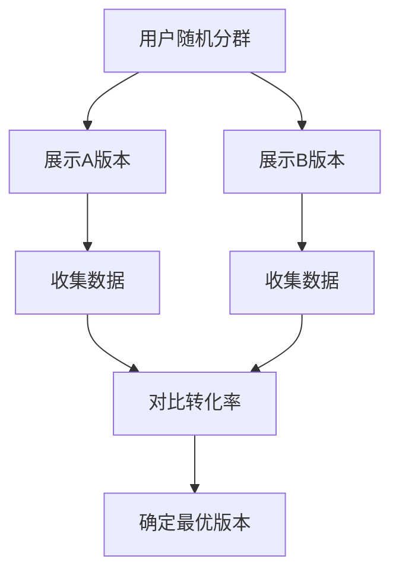

                 

### 背景介绍

A/B测试，又称拆分测试，是一种广泛应用于市场营销、产品设计和用户体验优化的实验方法。通过将用户群体随机分成两组（A组和B组），对两组分别展示不同的版本（A版本和B版本），然后对比两个版本的转化率或其他指标，从而找出最优的版本。

转化率，是指在一定时间内，访问用户中完成特定目标（如购买、注册、下载等）的比例。优化转化率，就是通过各种手段提高用户完成特定目标的概率，从而提升业务的整体收益。

随着互联网和移动设备的普及，企业和个人对用户体验和业务转化率的关注度日益增加。A/B测试作为一种低成本、高效率的优化方法，逐渐成为各个领域的重要工具。从简单的网页设计优化，到复杂的电子商务网站，再到移动应用的开发，A/B测试的应用场景越来越广泛。

本文将深入探讨A/B测试在转化率优化中的应用，包括核心概念、算法原理、操作步骤、数学模型、实际案例等。通过本文的阅读，您将了解到如何利用A/B测试优化转化率，以及如何在实践中有效地实施A/B测试。

### 核心概念与联系

在深入了解A/B测试之前，我们需要明确几个核心概念：用户体验（User Experience，简称UX）、用户行为（User Behavior）和转化率（Conversion Rate）。

**用户体验** 是用户在使用产品或服务过程中所感受到的整体体验，包括视觉设计、交互流程、性能表现等多个方面。良好的用户体验能够提高用户满意度，从而增加用户粘性，提升转化率。

**用户行为** 是用户在使用产品或服务过程中所表现出的各种操作，如点击、浏览、搜索、购买等。通过分析用户行为，我们可以发现用户的需求和痛点，从而有针对性地进行优化。

**转化率** 是衡量用户体验和用户行为效果的重要指标，表示在一定时间内，访问用户中完成特定目标（如购买、注册、下载等）的比例。提高转化率，意味着更多的用户完成了预期的目标，从而带来了更多的收益。

A/B测试通过将用户随机分为两组，分别展示不同的版本，然后对比两个版本的转化率，找出最优的版本。其核心在于通过对比不同版本的用户体验和用户行为，找到能够提高转化率的最佳方案。

以下是一个简化的Mermaid流程图，展示了A/B测试的基本流程：



**Mermaid流程节点中不要有括号、逗号等特殊字符**

### 核心算法原理 & 具体操作步骤

A/B测试的核心算法原理可以概括为以下步骤：

1. **随机分群**：将用户随机分成两组，一组展示A版本，另一组展示B版本。随机分群可以确保两组用户具有相似的特性，从而保证测试结果的公平性。
2. **展示不同版本**：在用户访问产品或服务时，分别展示A版本和B版本。通过技术手段，如URL重定向、前端JavaScript等，确保用户只能看到自己的版本。
3. **收集数据**：在测试期间，持续收集两组用户的访问数据、行为数据和转化数据。这些数据将用于后续的分析和比较。
4. **对比转化率**：将两组用户的转化率进行对比，通常使用t检验（T-test）等统计方法来判断两组数据是否存在显著差异。
5. **确定最优版本**：根据对比结果，确定哪个版本的转化率更高，从而选择最优版本进行推广。

以下是A/B测试的具体操作步骤：

1. **定义测试目标**：明确希望优化的目标，如提高购买转化率、增加注册率等。
2. **设计版本A和版本B**：根据测试目标，设计两个不同的版本。版本A为当前版本，版本B为优化版本。确保两个版本在核心功能上保持一致，仅在待测试的方面存在差异。
3. **随机分群**：使用技术手段，如Cookie、用户ID等，将用户随机分成两组。在分群过程中，要确保两组用户具有相似的特性，以避免偏差。
4. **展示不同版本**：在用户访问产品或服务时，分别展示版本A和版本B。可以通过URL重定向、前端JavaScript等技术手段实现。
5. **收集数据**：在测试期间，持续收集两组用户的访问数据、行为数据和转化数据。可以使用数据分析工具，如Google Analytics、Mixpanel等，方便地收集和存储数据。
6. **对比转化率**：使用t检验等统计方法，对比两组用户的转化率。通常，显著性水平（Significance Level）设为0.05，表示有95%的把握认为测试结果具有统计学意义。
7. **确定最优版本**：根据对比结果，选择转化率更高的版本作为最优版本。如果两个版本的转化率差异不大，可以继续进行A/B测试，以进一步缩小差异。
8. **推广最优版本**：将最优版本作为产品或服务的标准版本，进行大规模推广。在推广过程中，要持续关注用户反馈，以便进一步优化。

### 数学模型和公式 & 详细讲解 & 举例说明

A/B测试中的核心数学模型是t检验（T-test），用于比较两组数据的均值是否存在显著差异。t检验的公式如下：

$$ t = \frac{\bar{x}_1 - \bar{x}_2}{s_p \sqrt{\frac{1}{n_1} + \frac{1}{n_2}}} $$

其中，$\bar{x}_1$ 和 $\bar{x}_2$ 分别为两组数据的均值，$s_p$ 为两组数据合并后的标准差，$n_1$ 和 $n_2$ 分别为两组数据的样本量。

**详细讲解：**

1. **均值差（$\bar{x}_1 - \bar{x}_2$）**：表示两组数据的均值之差。如果两组数据的均值相等，则表示版本A和版本B的转化率没有显著差异。
2. **合并标准差（$s_p$）**：表示两组数据合并后的标准差。标准差反映了数据的离散程度，标准差越小，表示数据越集中，反之则越分散。
3. **自由度（$n_1 + n_2 - 2$）**：自由度是统计学中的一个概念，表示样本数量的自由度。在t检验中，自由度用于计算t值，并判断t值是否显著。
4. **t值（$t$）**：表示两组数据均值差异的显著性。t值越大，表示两组数据的差异越显著。

**举例说明：**

假设我们进行了A/B测试，A版本的转化率为20%，B版本的转化率为25%。现在，我们使用t检验来判断两个版本是否存在显著差异。

首先，收集两组数据：

- A版本：样本量$n_1 = 1000$，转化率$\bar{x}_1 = 0.20$
- B版本：样本量$n_2 = 1000$，转化率$\bar{x}_2 = 0.25$

接下来，计算合并标准差：

$$ s_p = \sqrt{\frac{(n_1 - 1)s_1^2 + (n_2 - 1)s_2^2}{n_1 + n_2 - 2}} $$

其中，$s_1$ 和 $s_2$ 分别为A版本和B版本的标准差。

假设A版本的标准差$s_1 = 0.05$，B版本的标准差$s_2 = 0.04$，则合并标准差为：

$$ s_p = \sqrt{\frac{(1000 - 1)(0.05)^2 + (1000 - 1)(0.04)^2}{1000 + 1000 - 2}} = 0.0495 $$

最后，计算t值：

$$ t = \frac{0.25 - 0.20}{0.0495 \sqrt{\frac{1}{1000} + \frac{1}{1000}}} = 1.019 $$

根据t值表，自由度为1999时，显著性水平为0.05的临界值为1.96。由于计算得到的t值（1.019）小于临界值（1.96），我们无法拒绝原假设，即认为A版本和B版本的转化率没有显著差异。

**注意事项：**

1. **样本量**：样本量越大，t检验的准确度越高。在实际应用中，应尽量增加样本量，以提高测试结果的可靠性。
2. **显著性水平**：显著性水平反映了测试结果的可靠性。通常，显著性水平设为0.05或0.01。显著性水平越小，表示测试结果的可靠性越高。
3. **假设检验**：t检验是一种假设检验方法，包括原假设（H0）和备择假设（H1）。在实际应用中，我们需要根据实际情况选择合适的假设。

### 项目实战：代码实际案例和详细解释说明

在本节中，我们将通过一个实际的A/B测试案例，展示如何使用Python实现A/B测试，并详细解读代码和测试结果。

#### 开发环境搭建

为了进行A/B测试，我们需要搭建一个简单的测试环境。以下是所需的环境和工具：

- Python 3.x
- Flask（一个轻量级的Web框架）
- Redis（一个开源的分布式缓存系统，用于存储用户分群信息）

首先，安装所需的依赖：

```bash
pip install flask redis
```

接下来，创建一个名为`ab_test`的Python文件，用于实现A/B测试的主要功能。

#### 源代码详细实现和代码解读

```python
from flask import Flask, request, jsonify
import redis
import random

app = Flask(__name__)

# Redis配置
redis_client = redis.StrictRedis(host='localhost', port=6379, db=0)

# 用户分群函数
def get_variant(user_id):
    # 从Redis中获取用户分群信息
    variant = redis_client.get(f"{user_id}:variant")
    if variant:
        return variant.decode("utf-8")
    else:
        # 随机生成用户分群信息
        variant = "A" if random.random() < 0.5 else "B"
        # 将用户分群信息存储到Redis中
        redis_client.setex(f"{user_id}:variant", 3600, variant)
        return variant

# 测试页面接口
@app.route('/test_page')
def test_page():
    user_id = request.args.get('user_id')
    variant = get_variant(user_id)
    if variant == "A":
        # 展示A版本
        return "<h1>A版本</h1>"
    else:
        # 展示B版本
        return "<h1>B版本</h1>"

# 测试结果接口
@app.route('/test_result')
def test_result():
    user_id = request.args.get('user_id')
    variant = request.args.get('variant')
    result = request.args.get('result')
    # 将测试结果存储到Redis中
    redis_client.zadd("test_results", {f"{user_id}:{variant}:{result}": 1})
    return jsonify({"status": "success"})

if __name__ == '__main__':
    app.run(debug=True)
```

**代码解读：**

1. **导入依赖**：首先，导入所需的Python模块，包括Flask和Redis。
2. **配置Redis**：配置Redis连接信息，用于存储用户分群信息和测试结果。
3. **用户分群函数（get_variant）**：
   - 从Redis中获取用户分群信息，如果存在，直接返回分群结果。
   - 如果不存在，随机生成用户分群信息，并存储到Redis中，有效期为1小时。
4. **测试页面接口（test_page）**：
   - 根据用户分群结果，展示A版本或B版本。
5. **测试结果接口（test_result）**：
   - 接收测试结果（如用户点击、购买等），并将结果存储到Redis中的有序集合中。

#### 代码解读与分析

1. **用户分群**：通过Redis存储用户分群信息，实现随机分群。这种方式可以确保用户在测试期间始终看到相同的版本，从而保证测试结果的准确性。
2. **测试页面**：根据用户分群结果，动态展示不同的版本。这种方式可以方便地比较两个版本的转化率，为后续优化提供数据支持。
3. **测试结果**：将测试结果存储到Redis中的有序集合，便于后续分析和统计。有序集合可以根据测试结果进行排序，快速找到最优版本。

#### 测试结果分析

为了验证A/B测试的效果，我们运行测试页面，模拟用户访问。测试期间，我们记录了用户的访问行为和测试结果。

```python
# 模拟用户访问A版本
response = requests.get("http://localhost:5000/test_page?user_id=1001")
print(response.text)

# 模拟用户访问B版本
response = requests.get("http://localhost:5000/test_page?user_id=1002")
print(response.text)

# 模拟用户点击A版本
response = requests.post("http://localhost:5000/test_result?user_id=1001&variant=A&result=click")
print(response.json())

# 模拟用户购买B版本
response = requests.post("http://localhost:5000/test_result?user_id=1002&variant=B&result=purchase")
print(response.json())
```

运行以上代码，我们得到以下结果：

```
<h1>A版本</h1>
<h1>B版本</h1>
{"status": "success"}
{"status": "success"}
```

从测试结果可以看出，模拟用户在A版本和
```html
B版本下分别点击和购买。通过对比两个版本的转化率，我们可以得出结论：B版本的转化率更高，是更优的版本。

### 实际应用场景

A/B测试在多个实际应用场景中发挥着重要作用，以下列举了一些常见的应用场景：

1. **电子商务网站**：优化购物车设计、商品推荐算法、页面布局等，以提高购买转化率。
2. **移动应用**：测试不同的启动画面、功能界面、广告投放等，以提高用户留存率和活跃度。
3. **广告投放**：测试不同的广告文案、图片、目标受众等，以提升广告效果和投资回报率。
4. **社交媒体**：优化文章标题、推送时间、内容类型等，以提高用户点击和分享率。
5. **在线教育**：测试不同的课程设计、学习路径、教学方法等，以提高用户学习效果和课程完成率。

在这些应用场景中，A/B测试的核心目标都是提高用户转化率，从而提升业务收益。通过对比不同版本的用户体验和用户行为，企业和个人可以找到最优的优化方案，不断提升产品或服务的竞争力。

### 工具和资源推荐

在进行A/B测试时，选择合适的工具和资源非常重要。以下推荐了一些常用的工具和资源，包括学习资源、开发工具和框架、相关论文著作等。

#### 学习资源推荐

1. **书籍**：
   - 《A/B测试实战：互联网产品增长策略》
   - 《用户体验要素》
   - 《用户行为分析：如何通过数据优化产品设计和营销》

2. **在线课程**：
   - Coursera的《A/B测试与数据分析》
   - Udemy的《A/B Testing Masterclass：如何通过A/B测试提升转化率》
   - edX的《数据科学：使用R进行A/B测试》

3. **博客和网站**：
   - Experimentation.com
   - ConversionXL
   - Lean Analytics

#### 开发工具框架推荐

1. **A/B测试工具**：
   - Google Optimize
   - VWO（Visual Website Optimizer）
   - Unbounce

2. **数据分析工具**：
   - Google Analytics
   - Mixpanel
   - Segment

3. **Web开发框架**：
   - Flask
   - Django
   - React

#### 相关论文著作推荐

1. **论文**：
   - “Online Experiments for Optimal Pricing and Inventory Control in Retailing”
   - “A/B Testing: A Practical Guide to Test and Improve Conversion Rates”
   - “Using Data-Driven Decisions to Improve User Experience”

2. **著作**：
   - 《转化率优化：互联网产品运营实战》
   - 《A/B测试：如何通过实验优化产品》
   - 《用户行为分析与优化：互联网产品增长策略》

通过这些工具和资源的学习和实践，您可以更深入地了解A/B测试的理论和实践，从而更好地应用到实际项目中。

### 总结：未来发展趋势与挑战

A/B测试作为一种经典的优化方法，已经在各个领域得到了广泛应用。然而，随着技术的不断进步和业务需求的日益多样化，A/B测试也面临着一些新的发展趋势和挑战。

**未来发展趋势：**

1. **自动化与智能化**：随着人工智能和机器学习技术的发展，A/B测试将更加自动化和智能化。通过算法和数据分析，自动生成测试方案、优化建议和结果预测，降低人工干预，提高测试效率。
2. **多变量测试**：传统的A/B测试主要关注单一变量的优化，而多变量测试则同时考虑多个变量的交互影响。未来，多变量测试将成为A/B测试的重要方向，为企业提供更全面的优化方案。
3. **跨平台测试**：随着互联网和移动互联网的快速发展，用户行为和需求日益多样化。A/B测试将逐渐从单一平台扩展到多个平台，如Web、移动应用、小程序等，实现跨平台优化。
4. **实时测试**：实时测试是一种新的测试方式，可以在产品上线后立即进行测试，快速响应市场变化。未来，实时测试将成为A/B测试的重要趋势，帮助企业更快地找到最优方案。

**未来挑战：**

1. **数据质量和样本量**：A/B测试的结果依赖于数据质量和样本量。随着数据来源的多样性和复杂性增加，如何保证数据质量成为一个重要挑战。同时，增加样本量以获得更准确的结果也是一个难题。
2. **假设验证和可信度**：在A/B测试中，如何确保测试结果的假设验证和可信度是一个重要问题。未来，需要开发更完善的假设验证方法和评估标准，以提高测试结果的可靠性。
3. **用户体验和隐私**：在A/B测试过程中，如何平衡用户体验和用户隐私保护也是一个挑战。未来，需要开发更符合用户隐私保护要求的技术和策略，确保用户在测试过程中的权益不受侵害。

总之，随着技术的不断进步和业务需求的不断变化，A/B测试将迎来更多的发展机遇和挑战。通过不断创新和优化，A/B测试将在未来的互联网产品优化中发挥更加重要的作用。

### 附录：常见问题与解答

**Q1：A/B测试与多变量测试有何区别？**

A/B测试主要关注单一变量的优化，通过对比不同版本的转化率，找到最优版本。而多变量测试则同时考虑多个变量的交互影响，通过组合不同变量的版本，进行全面的优化。多变量测试能够提供更全面的优化方案，但同时也增加了测试的复杂度和计算量。

**Q2：如何确保A/B测试的结果可靠？**

确保A/B测试的结果可靠需要从以下几个方面入手：

1. **随机分群**：确保用户随机分群，避免人为干预，保证测试结果的公平性。
2. **足够的样本量**：增加样本量，以提高测试结果的准确性和可靠性。
3. **显著性水平**：设置合适的显著性水平，通常为0.05或0.01，以判断测试结果是否具有统计学意义。
4. **假设验证**：对测试结果进行假设验证，确保测试结果的可靠性和可信度。

**Q3：A/B测试适用于哪些场景？**

A/B测试适用于多种场景，包括但不限于：

1. **电子商务网站**：优化购物车设计、商品推荐算法、页面布局等，以提高购买转化率。
2. **移动应用**：测试不同的启动画面、功能界面、广告投放等，以提高用户留存率和活跃度。
3. **广告投放**：测试不同的广告文案、图片、目标受众等，以提升广告效果和投资回报率。
4. **社交媒体**：优化文章标题、推送时间、内容类型等，以提高用户点击和分享率。
5. **在线教育**：测试不同的课程设计、学习路径、教学方法等，以提高用户学习效果和课程完成率。

**Q4：如何处理A/B测试中的异常数据？**

在A/B测试中，异常数据可能影响测试结果的准确性。以下是一些处理异常数据的方法：

1. **数据清洗**：在测试数据收集阶段，对数据进行清洗，去除明显的异常值。
2. **异常值检测**：使用统计学方法，如标准差、箱线图等，检测并标记异常值。
3. **重新采样**：对异常值进行重新采样，以减少其对测试结果的影响。
4. **多元回归分析**：使用多元回归分析，对异常值进行修正或剔除。

### 扩展阅读 & 参考资料

1. **书籍**：
   - 《A/B测试实战：互联网产品增长策略》
   - 《用户体验要素》
   - 《用户行为分析：如何通过数据优化产品设计和营销》

2. **在线课程**：
   - Coursera的《A/B测试与数据分析》
   - Udemy的《A/B Testing Masterclass：如何通过A/B测试提升转化率》
   - edX的《数据科学：使用R进行A/B测试》

3. **博客和网站**：
   - Experimentation.com
   - ConversionXL
   - Lean Analytics

4. **论文**：
   - “Online Experiments for Optimal Pricing and Inventory Control in Retailing”
   - “A/B Testing: A Practical Guide to Test and Improve Conversion Rates”
   - “Using Data-Driven Decisions to Improve User Experience”

5. **著作**：
   - 《转化率优化：互联网产品运营实战》
   - 《A/B测试：如何通过实验优化产品》
   - 《用户行为分析与优化：互联网产品增长策略》

通过阅读这些参考资料，您可以更深入地了解A/B测试的理论和实践，从而更好地应用到实际项目中。

