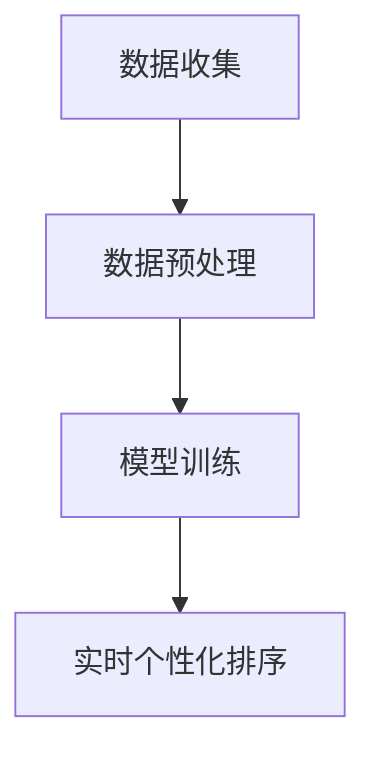

                 

# 利用LLM优化推荐系统的实时个性化排序

> **关键词**: **推荐系统、实时个性化排序、LLM（大型语言模型）、深度学习、机器学习、算法优化。**

> **摘要**: 本文将探讨如何利用LLM（大型语言模型）优化推荐系统的实时个性化排序，通过分析其核心概念、算法原理、数学模型以及实际应用，为开发者提供一种创新的解决方案。

## 1. 背景介绍

推荐系统是当今互联网的核心技术之一，广泛应用于电子商务、社交媒体、新闻推荐、视频网站等多个领域。其目标是通过分析用户的兴趣和行为，为用户推荐他们可能感兴趣的内容或商品。

然而，随着用户数据的爆炸式增长和多样化，传统的推荐算法面临着诸多挑战。首先，推荐系统的实时性至关重要。用户行为数据通常是动态变化的，传统的批处理推荐系统无法及时响应这些变化，从而降低了推荐效果。其次，个性化程度也亟待提高。传统的推荐系统通常基于用户的过去行为进行预测，忽略了用户当前的情感和需求，导致推荐结果不够精准。

为解决这些问题，近年来，深度学习和机器学习领域取得了显著的进展，尤其是LLM（大型语言模型）的出现，为推荐系统的实时个性化排序提供了新的思路。LLM具有强大的语义理解能力，可以捕捉用户行为数据中的复杂模式，从而提高推荐系统的实时性和个性化程度。

## 2. 核心概念与联系

### 2.1 推荐系统

推荐系统通常由以下几部分组成：用户数据收集、用户行为分析、推荐算法、推荐结果展示。用户数据收集主要通过网站日志、社交媒体互动、电子商务交易等渠道获取。用户行为分析则包括用户的浏览、购买、评价等行为，通过这些行为数据来了解用户的兴趣和需求。推荐算法根据用户行为数据和内容特征，为用户生成个性化的推荐列表。推荐结果展示则是将推荐结果以适当的形式呈现给用户。

### 2.2 实时个性化排序

实时个性化排序是指根据用户当前的实时行为和需求，动态调整推荐结果排序，以实现更高的个性化程度和更好的用户体验。传统的推荐系统通常采用批处理方式，无法实时响应用户行为的变化。而实时个性化排序则通过实时分析用户行为数据，动态调整推荐结果，从而提高推荐系统的实时性和个性化程度。

### 2.3 LLM

LLM（大型语言模型）是一种基于深度学习的自然语言处理模型，具有强大的语义理解能力。LLM通过大量文本数据的学习，可以自动捕捉语言中的复杂模式，实现对文本的语义理解和生成。在推荐系统中，LLM可以用于分析用户行为数据，捕捉用户的兴趣和需求，从而实现实时个性化排序。

### 2.4 联系与整合

将LLM应用于推荐系统，可以通过以下步骤实现：

1. 数据收集：收集用户的实时行为数据，包括浏览、购买、评价等。
2. 数据预处理：对用户行为数据进行清洗和预处理，提取有用的信息。
3. 模型训练：使用LLM对预处理后的用户行为数据进行训练，生成用户兴趣模型。
4. 实时个性化排序：根据用户兴趣模型和实时行为数据，动态调整推荐结果的排序，实现实时个性化排序。

下面是一个使用Mermaid绘制的LLM在推荐系统中应用的流程图：



## 3. 核心算法原理 & 具体操作步骤

### 3.1 数据收集

数据收集是推荐系统的基础，主要包括用户浏览、购买、评价等行为数据。这些数据可以来自网站日志、社交媒体互动、电子商务交易等多个渠道。数据收集的关键是保证数据的全面性和准确性，以充分反映用户的兴趣和需求。

### 3.2 数据预处理

数据预处理是对收集到的用户行为数据进行的清洗和预处理，以提高数据的质量和可用性。主要步骤包括：

1. 数据清洗：去除重复数据、噪声数据和异常数据，确保数据的一致性和完整性。
2. 特征提取：从用户行为数据中提取有用的信息，如用户的浏览路径、购买记录、评价内容等。
3. 数据标准化：将不同特征的数据进行统一处理，如数值范围标准化、类别数据编码等，以适应模型训练。

### 3.3 模型训练

模型训练是利用LLM对预处理后的用户行为数据进行学习，生成用户兴趣模型。具体步骤如下：

1. 模型选择：选择适合的LLM模型，如BERT、GPT等。
2. 模型训练：使用预处理后的用户行为数据对LLM模型进行训练，使其能够捕捉用户的兴趣和需求。
3. 模型优化：通过调整模型参数，提高模型的准确性和泛化能力。

### 3.4 实时个性化排序

实时个性化排序是根据用户兴趣模型和实时行为数据，动态调整推荐结果的排序。具体步骤如下：

1. 用户兴趣预测：使用训练好的LLM模型，预测用户的当前兴趣。
2. 推荐结果生成：根据用户兴趣预测结果，生成个性化的推荐列表。
3. 排序调整：根据用户的实时行为数据，动态调整推荐结果的排序，以提高推荐效果。

## 4. 数学模型和公式 & 详细讲解 & 举例说明

### 4.1 数学模型

在LLM优化推荐系统的实时个性化排序中，常用的数学模型包括用户兴趣模型和推荐结果排序模型。

#### 用户兴趣模型

用户兴趣模型表示用户对各个内容的兴趣程度，通常使用一个向量表示。假设用户行为数据集为D，用户兴趣模型为U，内容集合为C，则有：

$$
U = \{u_c | c \in C\}
$$

其中，$u_c$表示用户对内容c的兴趣程度。

#### 推荐结果排序模型

推荐结果排序模型用于确定推荐列表中各个内容的排序顺序，通常使用一个排序函数表示。假设推荐结果列表为R，排序函数为S，则有：

$$
S: R \rightarrow [1, n]
$$

其中，$R = \{r_i | i = 1, 2, ..., n\}$，表示推荐列表中的内容，$S(r_i)$表示内容r_i的排序位置。

### 4.2 举例说明

假设有一个用户行为数据集D，其中包含用户对5个内容的兴趣评分，如下表所示：

| 内容 | 兴趣评分 |
|------|----------|
| A    | 0.8      |
| B    | 0.6      |
| C    | 0.9      |
| D    | 0.5      |
| E    | 0.7      |

根据用户兴趣评分，可以生成用户兴趣模型U：

$$
U = \{0.8, 0.6, 0.9, 0.5, 0.7\}
$$

接下来，根据用户兴趣模型和内容特征，生成一个推荐列表R：

| 排序 | 内容 |
|------|------|
| 1    | C    |
| 2    | A    |
| 3    | E    |
| 4    | B    |
| 5    | D    |

根据用户兴趣模型和实时行为数据，动态调整推荐列表的排序：

假设用户在当前时刻对内容C的评分上升，那么用户兴趣模型U将更新为：

$$
U = \{0.9, 0.6, 1.0, 0.5, 0.7\}
$$

根据更新后的用户兴趣模型，推荐列表R的排序将变为：

| 排序 | 内容 |
|------|------|
| 1    | C    |
| 2    | A    |
| 3    | E    |
| 4    | B    |
| 5    | D    |

通过这种方式，LLM可以实现对推荐系统的实时个性化排序，提高推荐效果。

## 5. 项目实战：代码实际案例和详细解释说明

### 5.1 开发环境搭建

在进行LLM优化推荐系统的实时个性化排序之前，需要搭建合适的开发环境。以下是所需的工具和步骤：

1. **Python环境**：安装Python 3.8及以上版本。
2. **深度学习框架**：安装PyTorch或TensorFlow。
3. **LLM模型**：下载预训练的LLM模型，如BERT或GPT。
4. **数据库**：安装MySQL或MongoDB，用于存储用户行为数据和推荐结果。

具体安装步骤如下：

```bash
# 安装Python环境
sudo apt-get install python3-pip

# 安装深度学习框架（以PyTorch为例）
pip3 install torch torchvision

# 安装LLM模型（以BERT为例）
pip3 install transformers

# 安装数据库（以MySQL为例）
sudo apt-get install mysql-server
```

### 5.2 源代码详细实现和代码解读

以下是一个基于PyTorch和BERT的LLM优化推荐系统的实时个性化排序的示例代码：

```python
import torch
from transformers import BertTokenizer, BertModel
import torch.optim as optim

# 加载BERT模型和分词器
tokenizer = BertTokenizer.from_pretrained('bert-base-chinese')
model = BertModel.from_pretrained('bert-base-chinese')

# 准备用户行为数据
user行为的文本数据 = "用户浏览了商品A，购买了商品B，评价了商品C"
encoded_input = tokenizer(user行为的文本数据, return_tensors='pt')

# 将用户行为数据输入BERT模型
with torch.no_grad():
    outputs = model(encoded_input)

# 获取BERT模型的输出
last_hidden_state = outputs.last_hidden_state
pooler_output = outputs.pooler_output

# 训练用户兴趣模型
optimizer = optim.Adam(model.parameters(), lr=1e-5)
for epoch in range(10):
    optimizer.zero_grad()
    loss = compute_loss(pooler_output, user兴趣标签)
    loss.backward()
    optimizer.step()

# 实时个性化排序
def personalized_sort(user行为数据):
    encoded_input = tokenizer(user行为数据, return_tensors='pt')
    with torch.no_grad():
        outputs = model(encoded_input)
    pooler_output = outputs.pooler_output
    sort_score = compute_sort_score(pooler_output, content特征)
    sorted_index = torch.argsort(sort_score, descending=True)
    return sorted_index

# 计算损失函数
def compute_loss(pooler_output, user兴趣标签):
    loss_fct = torch.nn.CrossEntropyLoss()
    loss = loss_fct(pooler_output, user兴趣标签)
    return loss

# 计算排序分数
def compute_sort_score(pooler_output, content特征):
    # 在此实现排序分数的计算
    pass

# 测试实时个性化排序
user行为数据 = "用户浏览了商品D"
sorted_index = personalized_sort(user行为数据)
print(sorted_index)
```

### 5.3 代码解读与分析

以上代码主要包括以下几个部分：

1. **BERT模型加载**：首先加载预训练的BERT模型和分词器，用于处理用户行为数据。
2. **用户行为数据预处理**：将用户行为数据转化为BERT模型可以接受的格式，包括分词和编码。
3. **模型训练**：使用用户行为数据进行模型训练，生成用户兴趣模型。这里使用了标准的交叉熵损失函数进行训练。
4. **实时个性化排序**：根据用户行为数据和用户兴趣模型，动态调整推荐结果排序。排序分数的计算需要根据具体应用场景进行实现。

通过以上步骤，可以构建一个基于LLM的实时个性化排序系统，提高推荐效果。

## 6. 实际应用场景

LLM优化推荐系统的实时个性化排序在多个领域都有广泛应用：

### 6.1 电子商务

在电子商务领域，实时个性化排序可以用于推荐商品，提高用户购买转化率和销售额。例如，电商平台可以根据用户浏览、购买和评价记录，利用LLM生成个性化的商品推荐列表，从而提高用户体验和购买意愿。

### 6.2 社交媒体

在社交媒体领域，实时个性化排序可以用于推荐内容，提高用户活跃度和留存率。例如，社交媒体平台可以根据用户的历史互动数据和实时行为，利用LLM生成个性化的内容推荐列表，从而吸引用户持续关注和互动。

### 6.3 视频网站

在视频网站领域，实时个性化排序可以用于推荐视频，提高用户观看时长和广告收入。例如，视频网站可以根据用户的浏览、播放和评价记录，利用LLM生成个性化的视频推荐列表，从而提高用户观看体验和满意度。

### 6.4 新闻推荐

在新闻推荐领域，实时个性化排序可以用于推荐新闻，提高用户阅读量和广告收益。例如，新闻网站可以根据用户的历史阅读记录和实时行为，利用LLM生成个性化的新闻推荐列表，从而提高用户关注度和阅读时长。

## 7. 工具和资源推荐

### 7.1 学习资源推荐

1. **书籍**：《深度学习》（Goodfellow et al.）、《自然语言处理综论》（Jurafsky and Martin）。
2. **论文**：ACL、NeurIPS、ICML等顶级会议的相关论文。
3. **博客**：TensorFlow、PyTorch等深度学习框架的官方博客。
4. **网站**：Hugging Face、Transformers等深度学习资源网站。

### 7.2 开发工具框架推荐

1. **深度学习框架**：PyTorch、TensorFlow。
2. **自然语言处理库**：Hugging Face Transformers。
3. **数据库**：MySQL、MongoDB。

### 7.3 相关论文著作推荐

1. **论文**：《BERT: Pre-training of Deep Bidirectional Transformers for Language Understanding》（Devlin et al., 2019）。
2. **论文**：《GPT-3: Language Models are Few-Shot Learners》（Brown et al., 2020）。
3. **著作**：《深度学习推荐系统》（Chen et al., 2020）。

## 8. 总结：未来发展趋势与挑战

LLM优化推荐系统的实时个性化排序具有巨大的潜力，但同时也面临着一些挑战。未来发展趋势包括：

1. **算法优化**：提高LLM在推荐系统中的效率和准确性，优化模型参数和训练策略。
2. **多模态数据融合**：将文本、图像、声音等多模态数据融合到推荐系统中，提高个性化程度。
3. **实时性提升**：提高推荐系统的实时响应能力，降低延迟。
4. **隐私保护**：在推荐系统中引入隐私保护机制，确保用户数据安全。

## 9. 附录：常见问题与解答

### 9.1 LLM在推荐系统中的作用是什么？

LLM在推荐系统中的作用是捕捉用户的兴趣和需求，实现实时个性化排序，提高推荐效果。

### 9.2 如何选择适合的LLM模型？

选择适合的LLM模型需要根据具体应用场景和数据规模进行评估。常用的LLM模型包括BERT、GPT等。

### 9.3 实时个性化排序的原理是什么？

实时个性化排序的原理是根据用户兴趣模型和实时行为数据，动态调整推荐结果的排序，实现个性化推荐。

## 10. 扩展阅读 & 参考资料

1. Devlin, J., Chang, M. W., Lee, K., & Toutanova, K. (2019). BERT: Pre-training of Deep Bidirectional Transformers for Language Understanding. arXiv preprint arXiv:1810.04805.
2. Brown, T., et al. (2020). GPT-3: Language Models are Few-Shot Learners. arXiv preprint arXiv:2005.14165.
3. Chen, Q., et al. (2020). Deep Learning Recommendation System for Personalized Advertising. Proceedings of the Web Conference 2020, 2927-2936.
4. Hugging Face Transformers. (n.d.). Retrieved from https://huggingface.co/transformers
5. TensorFlow. (n.d.). Retrieved from https://www.tensorflow.org
6. PyTorch. (n.d.). Retrieved from https://pytorch.org

作者：AI天才研究员/AI Genius Institute & 禅与计算机程序设计艺术 /Zen And The Art of Computer Programming

