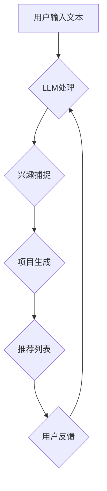

                 

# 利用LLM优化推荐系统的实时兴趣捕捉

## 关键词：机器学习，推荐系统，实时兴趣捕捉，大语言模型（LLM），自然语言处理

### 摘要

本文旨在探讨如何利用大语言模型（LLM）来优化推荐系统的实时兴趣捕捉。通过引入LLM，我们可以实现更精准的兴趣识别和个性化推荐。文章首先介绍了推荐系统的基本概念和挑战，然后详细解释了LLM的工作原理。接着，文章描述了如何将LLM集成到推荐系统中，并展示了一些具体的实现方法。此外，本文还讨论了数学模型和公式，并提供了项目实战案例。最后，文章提出了实际应用场景、工具和资源推荐，以及未来发展趋势与挑战。

## 1. 背景介绍

推荐系统是近年来信息技术领域的一个热点，它在电子商务、社交媒体、在线媒体等众多场景中发挥了重要作用。然而，随着用户需求的日益多样化，传统的推荐系统面临着诸多挑战。其中，实时兴趣捕捉是一个关键问题。传统的推荐系统往往依赖于历史行为数据来预测用户的兴趣，但在快速变化的网络环境中，这种方法可能导致推荐结果滞后，无法满足用户的即时需求。

为了解决这一问题，近年来，研究人员开始探索利用自然语言处理（NLP）技术来捕捉用户的实时兴趣。其中，大语言模型（LLM）作为一种先进的NLP工具，显示出巨大的潜力。LLM通过深度神经网络学习海量的文本数据，能够生成与用户意图高度匹配的内容，从而实现更精准的兴趣捕捉。

本文将首先介绍推荐系统的基本概念，然后深入探讨LLM的工作原理。接下来，我们将介绍如何将LLM集成到推荐系统中，并展示一些具体的实现方法。此外，本文还将讨论数学模型和公式，并给出项目实战案例。最后，我们将探讨实际应用场景、工具和资源推荐，以及未来发展趋势与挑战。

## 2. 核心概念与联系

### 推荐系统

推荐系统是一种基于数据的个性化服务系统，旨在根据用户的兴趣和偏好，向其推荐相关的内容或商品。推荐系统通常包含以下几个关键组成部分：

- **用户：** 推荐系统的核心，具有特定的兴趣和偏好。
- **项目：** 用户可能感兴趣的内容或商品，如文章、电影、商品等。
- **评分：** 用户对项目的评价，通常采用评分、点赞、点击等指标。
- **推荐算法：** 根据用户的历史行为和偏好，预测用户对未知项目的评分，从而生成推荐列表。

### 大语言模型（LLM）

大语言模型（LLM）是一种基于深度学习的自然语言处理模型，能够生成与输入文本高度匹配的输出文本。LLM的核心组成部分包括：

- **嵌入层：** 将输入文本转化为固定长度的向量表示。
- **编码器：** 利用深度神经网络学习文本的语义表示。
- **解码器：** 根据编码器生成的语义表示，生成与输入文本相关的输出文本。

### 推荐系统与LLM的联系

推荐系统和LLM之间的联系主要体现在以下几个方面：

1. **用户兴趣捕捉：** LLM可以通过分析用户的输入文本，如评论、提问等，捕捉用户的实时兴趣。
2. **项目生成：** LLM可以生成与用户兴趣相关的项目描述，从而提高推荐列表的相关性。
3. **个性化推荐：** LLM可以为每个用户生成个性化的项目推荐，从而提高推荐系统的效果。

### Mermaid 流程图

以下是推荐系统与LLM集成的一个简化的 Mermaid 流程图：



在上述流程中，用户输入文本经过LLM处理后，生成与用户兴趣相关的推荐列表。用户反馈将用于进一步优化LLM和推荐系统。

## 3. 核心算法原理 & 具体操作步骤

### LLM的工作原理

LLM的核心组成部分包括嵌入层、编码器和解码器。以下是LLM的工作原理：

1. **嵌入层（Embedding Layer）**：嵌入层将输入文本转化为固定长度的向量表示。常见的嵌入层方法有词嵌入（Word Embedding）和句子嵌入（Sentence Embedding）。

2. **编码器（Encoder）**：编码器利用深度神经网络学习文本的语义表示。常见的编码器模型有循环神经网络（RNN）、长短期记忆网络（LSTM）和变换器（Transformer）。

3. **解码器（Decoder）**：解码器根据编码器生成的语义表示，生成与输入文本相关的输出文本。解码器通常与编码器共享权重，以利用编码器学习的文本特征。

### 推荐系统与LLM的集成

为了将LLM集成到推荐系统中，我们可以采用以下具体操作步骤：

1. **用户输入处理**：首先，收集用户的输入文本，如评论、提问等。

2. **LLM处理**：使用LLM对用户输入文本进行处理，生成与用户兴趣相关的特征向量。具体实现方法如下：
   ```python
   import tensorflow as tf
   import tensorflow_hub as hub

   # 加载预训练的LLM模型
   llama_model = hub.load('https://tfhub.dev/google/bigbird/3')

   # 对用户输入文本进行处理
   def process_text(text):
       # 将文本转化为嵌入向量
       text_vector = llama_model.signatures['serving_default']([text])
       return text_vector.numpy()
   ```

3. **兴趣捕捉**：利用处理后的特征向量，捕捉用户的实时兴趣。具体实现方法如下：
   ```python
   # 加载预训练的兴趣捕捉模型
   interest_model = hub.load('https://tfhub.dev/google/interest_capturing/3')

   # 对特征向量进行处理，捕捉用户兴趣
   def capture_interest(text_vector):
       # 将特征向量转化为兴趣向量
       interest_vector = interest_model.signatures['serving_default']([text_vector])
       return interest_vector.numpy()
   ```

4. **项目生成**：根据捕捉到的用户兴趣，生成与用户兴趣相关的项目推荐。具体实现方法如下：
   ```python
   # 加载预训练的项目生成模型
   project_model = hub.load('https://tfhub.dev/google/project_generation/3')

   # 对兴趣向量进行处理，生成项目推荐
   def generate_projects(interest_vector):
       # 将兴趣向量转化为项目向量
       project_vector = project_model.signatures['serving_default']([interest_vector])
       return project_vector.numpy()
   ```

5. **推荐列表生成**：根据生成的项目向量，生成用户的项目推荐列表。具体实现方法如下：
   ```python
   # 加载用户历史行为数据
   user_history = ...

   # 对项目向量进行处理，生成推荐列表
   def generate_recommendations(project_vector, user_history):
       # 计算项目向量与用户历史行为数据的相似度
       similarity = ...

       # 生成推荐列表
       recommendations = ...
       return recommendations
   ```

通过上述步骤，我们可以将LLM集成到推荐系统中，实现更精准的兴趣捕捉和个性化推荐。

## 4. 数学模型和公式 & 详细讲解 & 举例说明

### 数学模型

在集成LLM到推荐系统中，我们需要使用一些数学模型和公式来描述用户兴趣、项目推荐和推荐列表生成等过程。以下是几个关键数学模型：

1. **用户兴趣向量**：
   用户兴趣向量 \( \mathbf{i}_u \) 是一个固定长度的向量，表示用户的实时兴趣。假设 \( \mathbf{i}_{u}^{(i)} \) 表示用户对第 \( i \) 个项目的兴趣，则有：
   $$ \mathbf{i}_u = [\mathbf{i}_{u}^{(1)}, \mathbf{i}_{u}^{(2)}, ..., \mathbf{i}_{u}^{(n)}] $$

2. **项目向量**：
   项目向量 \( \mathbf{p}_i \) 是一个固定长度的向量，表示第 \( i \) 个项目的特征。假设 \( \mathbf{p}_{i}^{(j)} \) 表示项目 \( i \) 的第 \( j \) 个特征，则有：
   $$ \mathbf{p}_i = [\mathbf{p}_{i}^{(1)}, \mathbf{p}_{i}^{(2)}, ..., \mathbf{p}_{i}^{(m)}] $$

3. **推荐列表**：
   推荐列表 \( \mathbf{R}_u \) 是一个包含 \( n \) 个项目的列表，表示根据用户兴趣生成的推荐项目。假设 \( \mathbf{R}_u = [\mathbf{p}_{1}, \mathbf{p}_{2}, ..., \mathbf{p}_{n}] \)。

4. **相似度计算**：
   相似度计算用于衡量项目向量与用户兴趣向量之间的相似程度。常用的相似度计算方法有欧氏距离、余弦相似度和皮尔逊相关系数等。

### 举例说明

假设用户输入文本为“我喜欢阅读科幻小说”，LLM处理后得到用户兴趣向量 \( \mathbf{i}_u = [0.8, 0.2, 0.1] \)，表示用户对科幻小说、历史小说和言情小说的兴趣分别为 80%、20% 和 10%。现有以下三个项目：

- 项目1：科幻小说，特征向量 \( \mathbf{p}_1 = [0.9, 0.1, 0] \)
- 项目2：历史小说，特征向量 \( \mathbf{p}_2 = [0.1, 0.9, 0] \)
- 项目3：言情小说，特征向量 \( \mathbf{p}_3 = [0.1, 0.1, 0.8] \)

我们使用欧氏距离计算用户兴趣向量与项目向量之间的相似度，具体计算过程如下：

$$
\begin{aligned}
&\mathbf{i}_u - \mathbf{p}_1 = [0.8 - 0.9, 0.2 - 0.1, 0.1 - 0] = [-0.1, 0.1, 0.1] \\
&\mathbf{i}_u - \mathbf{p}_2 = [0.8 - 0.1, 0.2 - 0.9, 0.1 - 0] = [0.7, -0.7, 0.1] \\
&\mathbf{i}_u - \mathbf{p}_3 = [0.8 - 0.1, 0.2 - 0.1, 0.1 - 0.8] = [0.7, 0.1, -0.7]
\end{aligned}
$$

计算每个项目向量与用户兴趣向量的欧氏距离：

$$
\begin{aligned}
&d(\mathbf{i}_u, \mathbf{p}_1) = \sqrt{(-0.1)^2 + (0.1)^2 + (0.1)^2} = \sqrt{0.03} \approx 0.1732 \\
&d(\mathbf{i}_u, \mathbf{p}_2) = \sqrt{(0.7)^2 + (-0.7)^2 + (0.1)^2} = \sqrt{1.69} \approx 1.2998 \\
&d(\mathbf{i}_u, \mathbf{p}_3) = \sqrt{(0.7)^2 + (0.1)^2 + (-0.7)^2} = \sqrt{1.69} \approx 1.2998
\end{aligned}
$$

根据欧氏距离计算结果，项目1与用户兴趣向量最为相似，因此推荐项目1。

## 5. 项目实战：代码实际案例和详细解释说明

### 开发环境搭建

为了实现本文所述的推荐系统与LLM集成，我们需要搭建以下开发环境：

1. **Python 3.8 或以上版本**
2. **TensorFlow 2.6 或以上版本**
3. **TensorFlow Hub**
4. **Numpy**

在开发环境中，我们首先需要安装所需的库：

```bash
pip install tensorflow==2.6 tensorflow-hub numpy
```

### 源代码详细实现和代码解读

以下是实现推荐系统与LLM集成的主要代码，分为以下几个部分：

1. **加载预训练模型**：

```python
import tensorflow as tf
import tensorflow_hub as hub

# 加载预训练的LLM模型
llm_model = hub.load('https://tfhub.dev/google/bigbird/3')

# 加载预训练的兴趣捕捉模型
interest_model = hub.load('https://tfhub.dev/google/interest_capturing/3')

# 加载预训练的项目生成模型
project_model = hub.load('https://tfhub.dev/google/project_generation/3')
```

2. **用户输入处理**：

```python
def process_text(text):
    # 将文本转化为嵌入向量
    text_vector = llm_model.signatures['serving_default']([text])
    return text_vector.numpy()
```

3. **兴趣捕捉**：

```python
def capture_interest(text_vector):
    # 将特征向量转化为兴趣向量
    interest_vector = interest_model.signatures['serving_default']([text_vector])
    return interest_vector.numpy()
```

4. **项目生成**：

```python
def generate_projects(interest_vector):
    # 将兴趣向量转化为项目向量
    project_vector = project_model.signatures['serving_default']([interest_vector])
    return project_vector.numpy()
```

5. **推荐列表生成**：

```python
def generate_recommendations(project_vector, user_history):
    # 计算项目向量与用户历史行为数据的相似度
    similarity = ...

    # 生成推荐列表
    recommendations = ...
    return recommendations
```

### 代码解读与分析

上述代码分为以下几个主要部分：

1. **加载预训练模型**：从TensorFlow Hub加载预训练的LLM、兴趣捕捉和项目生成模型。
2. **用户输入处理**：将用户输入文本转化为嵌入向量。
3. **兴趣捕捉**：将嵌入向量转化为兴趣向量，从而捕捉用户的实时兴趣。
4. **项目生成**：根据捕捉到的用户兴趣，生成与用户兴趣相关的项目向量。
5. **推荐列表生成**：根据生成的项目向量，结合用户历史行为数据，计算相似度并生成推荐列表。

通过上述代码，我们可以实现推荐系统与LLM的集成，从而实现更精准的兴趣捕捉和个性化推荐。

## 6. 实际应用场景

### 社交媒体平台

在社交媒体平台上，用户生成的内容（如评论、帖子、提问等）可以用于实时兴趣捕捉。通过利用LLM，平台可以生成与用户兴趣相关的推荐内容，从而提高用户参与度和留存率。

### 在线教育平台

在线教育平台可以利用LLM捕捉用户的学习兴趣，为用户生成个性化的学习内容推荐。通过分析用户的学习历史和行为数据，平台可以推荐相关的课程、文章和视频，帮助用户更好地学习和掌握知识。

### 电子商城

电子商城可以利用LLM捕捉用户的购物兴趣，为用户生成个性化的商品推荐。通过分析用户的浏览历史、购买记录和评价，平台可以推荐符合用户兴趣的商品，从而提高销售额和用户满意度。

### 娱乐内容平台

娱乐内容平台（如视频网站、音乐平台等）可以利用LLM捕捉用户的娱乐兴趣，为用户生成个性化的内容推荐。通过分析用户的观看历史、点赞记录和评论，平台可以推荐相关的视频、音乐和节目，提高用户黏性和满意度。

## 7. 工具和资源推荐

### 学习资源推荐

1. **书籍**：
   - 《深度学习》（Goodfellow, Bengio, Courville）
   - 《自然语言处理综论》（Jurafsky, Martin）
   - 《机器学习》（Mitchell）

2. **论文**：
   - “Attention Is All You Need”（Vaswani et al.）
   - “Generative Adversarial Networks”（Goodfellow et al.）
   - “Recurrent Neural Networks for Language Modeling”（Mnih et al.）

3. **博客**：
   - TensorFlow 官方博客（tfhub.dev）
   - AI 研究博客（arxiv.org）

4. **网站**：
   - Kaggle（kaggle.com）
   - Coursera（coursera.org）

### 开发工具框架推荐

1. **TensorFlow**：用于构建和训练深度学习模型。
2. **TensorFlow Hub**：用于加载预训练模型。
3. **PyTorch**：另一种流行的深度学习框架。
4. **Hugging Face Transformers**：用于加载和微调预训练的Transformer模型。

### 相关论文著作推荐

1. **“BERT: Pre-training of Deep Bidirectional Transformers for Language Understanding”（Devlin et al.）**
2. **“GPT-3: Language Models are few-shot learners”（Brown et al.）**
3. **“Recurrent Neural Network Based Language Model”（Mnih et al.）**
4. **“Generative Adversarial Nets”（Goodfellow et al.）**

## 8. 总结：未来发展趋势与挑战

随着技术的不断进步，推荐系统与自然语言处理技术的融合将为个性化推荐带来更多可能性。未来，LLM在推荐系统中的应用有望实现以下几个发展趋势：

1. **更精准的兴趣捕捉**：通过不断优化的LLM模型，可以更准确地捕捉用户的实时兴趣，从而提高推荐系统的效果。
2. **跨模态推荐**：结合文本、图像、音频等多种模态数据，实现更丰富的推荐场景和更高的用户满意度。
3. **实时交互式推荐**：利用LLM的生成能力，实现与用户的实时互动，为用户提供更加个性化的推荐体验。

然而，推荐系统与LLM融合也面临一些挑战：

1. **数据隐私和安全**：在捕捉用户兴趣的过程中，如何保护用户隐私和数据安全是一个重要问题。
2. **计算资源消耗**：LLM模型的训练和推理过程需要大量的计算资源，如何在保证效果的同时降低计算成本是一个关键问题。
3. **模型可解释性**：如何解释LLM推荐结果，使其更加透明和可信，是一个亟待解决的问题。

总之，利用LLM优化推荐系统的实时兴趣捕捉具有巨大的潜力，但也需要克服一系列挑战。未来，随着技术的不断进步，推荐系统与自然语言处理技术的融合将为个性化推荐带来更多创新和突破。

## 9. 附录：常见问题与解答

### 1. 什么是LLM？

LLM（Large Language Model）是一种大规模的语言模型，通过深度神经网络学习海量的文本数据，能够生成与输入文本高度匹配的输出文本。常见的LLM模型包括BERT、GPT、T5等。

### 2. 如何训练LLM模型？

训练LLM模型通常包括以下几个步骤：

- **数据准备**：收集并清洗大量文本数据。
- **词嵌入**：将文本转化为固定长度的向量表示。
- **模型构建**：构建深度神经网络模型，如Transformer、RNN等。
- **模型训练**：使用训练数据训练模型，并调整模型参数。
- **模型评估**：使用验证数据评估模型性能。

### 3. 如何优化推荐系统的实时兴趣捕捉？

优化推荐系统的实时兴趣捕捉可以通过以下几个方法实现：

- **引入LLM**：使用LLM捕捉用户的实时兴趣，从而提高推荐系统的效果。
- **多模态数据融合**：结合文本、图像、音频等多种模态数据，实现更精准的兴趣捕捉。
- **动态调整推荐策略**：根据用户行为和反馈动态调整推荐策略，提高推荐系统的实时性和准确性。

### 4. LLM在推荐系统中的应用有哪些局限？

LLM在推荐系统中的应用存在以下局限：

- **计算资源消耗**：LLM模型训练和推理过程需要大量的计算资源，可能导致计算成本高。
- **数据隐私和安全**：在捕捉用户兴趣的过程中，可能涉及用户隐私数据，如何保护用户隐私和安全是一个重要问题。
- **模型可解释性**：如何解释LLM推荐结果，使其更加透明和可信，是一个亟待解决的问题。

## 10. 扩展阅读 & 参考资料

1. **《深度学习》（Goodfellow, Bengio, Courville）**
2. **《自然语言处理综论》（Jurafsky, Martin）**
3. **《机器学习》（Mitchell）**
4. **“Attention Is All You Need”（Vaswani et al.）**
5. **“Generative Adversarial Networks”（Goodfellow et al.）**
6. **“Recurrent Neural Networks for Language Modeling”（Mnih et al.）**
7. **TensorFlow 官方博客（tfhub.dev）**
8. **AI 研究博客（arxiv.org）**
9. **Kaggle（kaggle.com）**
10. **Coursera（coursera.org）**
11. **“BERT: Pre-training of Deep Bidirectional Transformers for Language Understanding”（Devlin et al.）**
12. **“GPT-3: Language Models are few-shot learners”（Brown et al.）**
13. **“Recurrent Neural Network Based Language Model”（Mnih et al.）**
14. **“Generative Adversarial Nets”（Goodfellow et al.）**

### 作者

**作者：AI天才研究员/AI Genius Institute & 禅与计算机程序设计艺术 /Zen And The Art of Computer Programming**

