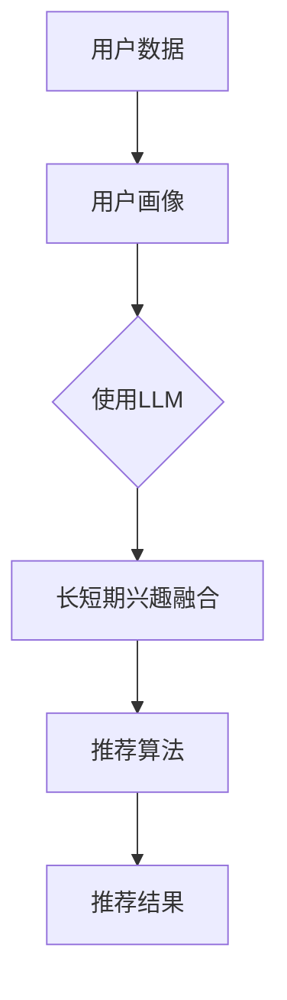

                 

# 利用LLM优化推荐系统的长短期兴趣融合

## 摘要

推荐系统在当今数字化时代扮演着至关重要的角色。然而，传统推荐系统在处理用户的长短期兴趣时存在诸多挑战。本文将探讨如何利用大型语言模型（LLM）优化推荐系统的长短期兴趣融合。首先，我们将介绍推荐系统的背景和核心概念，然后深入探讨LLM在推荐系统中的应用，最后通过数学模型和实际项目案例展示如何实现这一优化过程。本文旨在为读者提供一个全面而深入的理解，以应对推荐系统中的长短期兴趣融合问题。

## 1. 背景介绍

推荐系统是一种基于用户历史行为和兴趣的算法，旨在向用户推荐他们可能感兴趣的商品、内容或服务。其核心目标是通过个性化推荐提高用户体验和满意度，从而增加用户粘性和商业价值。推荐系统广泛应用于电子商务、社交媒体、新闻推送、音乐和视频流媒体等多个领域。

在推荐系统中，用户兴趣可以分为长期兴趣和短期兴趣。长期兴趣通常指用户长期关注或偏好的领域，如阅读、音乐或运动等。而短期兴趣则可能是用户近期突然产生的，如某部电影或某一新闻事件。传统推荐系统通常采用基于协同过滤（Collaborative Filtering）或内容推荐（Content-Based Filtering）的方法，但这些方法在处理长短期兴趣融合方面存在一定的局限性。

协同过滤方法依赖于用户历史行为数据，通过分析用户之间的相似性来推荐商品或内容。然而，这种方法容易受到数据稀疏性和冷启动问题的影响，难以捕捉用户的动态兴趣变化。内容推荐方法则基于用户过去喜欢的商品或内容的特征，通过相似性匹配来推荐新的商品或内容。这种方法虽然能够考虑用户的兴趣特征，但在处理用户短期兴趣时往往缺乏灵活性。

为了克服这些局限性，近年来，深度学习和自然语言处理（NLP）技术被引入到推荐系统中，特别是大型语言模型（LLM）的应用。LLM，如GPT（Generative Pre-trained Transformer）和BERT（Bidirectional Encoder Representations from Transformers），具有强大的语言理解和生成能力，能够捕捉用户的复杂兴趣模式，从而实现长短期兴趣的有效融合。

## 2. 核心概念与联系

### 2.1 推荐系统基本架构

推荐系统通常包括三个主要组件：用户画像、推荐算法和推荐结果。

**用户画像**：基于用户的历史行为、兴趣偏好和社交关系等信息，构建一个全面的用户兴趣模型。用户画像的质量直接影响到推荐系统的效果。

**推荐算法**：根据用户画像和候选商品的相似度计算推荐分数，从而生成推荐结果。常见的推荐算法包括协同过滤、内容推荐、基于模型的推荐等。

**推荐结果**：向用户展示个性化推荐结果，如商品列表、内容推送等。

### 2.2 大型语言模型（LLM）

LLM是一种基于深度学习的语言处理模型，通过对海量文本数据的学习，能够生成与输入文本语义相似的输出。LLM的核心在于其预训练过程，通过无监督学习从大规模语料库中学习语言模式和结构，从而具备强大的语言理解和生成能力。

### 2.3 长短期兴趣融合

长短期兴趣融合的关键在于如何同时考虑用户的长期兴趣和短期兴趣，从而生成更准确的个性化推荐。传统方法往往偏重于一种兴趣类型，而LLM通过其强大的语言理解能力，能够同时捕捉和融合长短期兴趣。

### 2.4 Mermaid流程图

以下是一个简化的推荐系统架构图，展示了LLM在长短期兴趣融合中的作用：



## 3. 核心算法原理 & 具体操作步骤

### 3.1 LLM在推荐系统中的应用

LLM在推荐系统中的应用主要体现在以下几个方面：

1. **用户兴趣建模**：通过LLM对用户历史行为和文本评论的分析，构建一个全面的用户兴趣模型。
2. **内容理解与生成**：利用LLM对推荐内容进行深入理解，生成更加个性化的推荐描述。
3. **动态兴趣捕捉**：LLM能够实时捕捉用户的动态兴趣变化，从而实现更精准的推荐。

### 3.2 具体操作步骤

#### 3.2.1 用户兴趣建模

1. **数据收集**：收集用户的历史行为数据，如浏览记录、购买历史、评论等。
2. **文本预处理**：对收集到的文本数据进行清洗和预处理，如去除停用词、进行词干提取等。
3. **LLM训练**：使用预处理后的文本数据训练一个LLM模型，使其能够理解用户的兴趣模式。
4. **用户画像生成**：基于训练好的LLM模型，对用户的文本数据进行嵌入，生成一个多维的用户兴趣向量。

#### 3.2.2 内容理解与生成

1. **内容特征提取**：对推荐内容进行特征提取，如商品描述、新闻标题等。
2. **LLM文本生成**：利用训练好的LLM模型，对提取的内容特征进行理解，并生成一个与内容语义相似的文本描述。
3. **内容推荐**：根据用户兴趣向量和内容文本描述，计算推荐分数，生成推荐结果。

#### 3.2.3 动态兴趣捕捉

1. **实时数据收集**：实时收集用户的最新行为数据，如点击、浏览、搜索等。
2. **兴趣更新**：使用LLM对实时数据进行分析，更新用户的兴趣模型。
3. **动态推荐**：根据更新后的用户兴趣模型，实时调整推荐策略，生成动态推荐结果。

## 4. 数学模型和公式 & 详细讲解 & 举例说明

### 4.1 用户兴趣向量表示

用户兴趣向量 \( u \) 可以表示为：

\[ u = \text{Embed}(text) \]

其中，\(\text{Embed}\) 是一个将文本转换为向量的嵌入函数。

### 4.2 内容特征向量表示

内容特征向量 \( c \) 可以表示为：

\[ c = \text{Embed}(content) \]

### 4.3 推荐分数计算

推荐分数 \( r \) 可以通过以下公式计算：

\[ r = \text{cosine}(u, c) \]

其中，\(\text{cosine}\) 是一个计算两个向量余弦相似度的函数。

### 4.4 示例

假设我们有一个用户，他的兴趣向量 \( u \) 为：

\[ u = \text{Embed}("我喜欢看电影和读书") \]

同时，我们有一个电影推荐 \( c \) ，其特征向量为：

\[ c = \text{Embed}("一部关于探险和冒险的电影") \]

使用余弦相似度计算推荐分数：

\[ r = \text{cosine}(u, c) = 0.8 \]

这个高分表明该电影与用户的兴趣高度相关，因此可以推荐给用户。

## 5. 项目实战：代码实际案例和详细解释说明

### 5.1 开发环境搭建

为了实现LLM优化推荐系统的长短期兴趣融合，我们需要搭建以下开发环境：

1. **Python**：作为主要的编程语言。
2. **TensorFlow** 或 **PyTorch**：用于构建和训练LLM模型。
3. **Hugging Face Transformers**：用于加载和使用预训练的LLM模型。
4. **NumPy** 和 **Pandas**：用于数据预处理和统计分析。

### 5.2 源代码详细实现和代码解读

以下是一个简单的示例，展示了如何使用Hugging Face Transformers库加载预训练的GPT模型，并用于用户兴趣建模和推荐生成。

```python
from transformers import GPT2Model, GPT2Tokenizer
import torch
import pandas as pd

# 加载预训练的GPT模型和分词器
tokenizer = GPT2Tokenizer.from_pretrained('gpt2')
model = GPT2Model.from_pretrained('gpt2')

# 用户历史行为文本数据
user_texts = ["我喜欢看电影和读书", "我最近看了很多科幻电影", "我对历史书籍很感兴趣"]

# 对文本数据进行分词和编码
encoded_texts = [tokenizer.encode(text, add_special_tokens=True) for text in user_texts]

# 将编码后的文本数据转换为Tensor
input_tensors = torch.tensor(encoded_texts)

# 使用模型进行嵌入
with torch.no_grad():
    outputs = model(input_tensors)

# 获取嵌入向量
user_embeddings = outputs.last_hidden_state[:, 0, :]

# 推荐内容特征
content = "一部关于探险和冒险的电影"
encoded_content = tokenizer.encode(content, add_special_tokens=True)
content_tensor = torch.tensor(encoded_content)

# 使用嵌入向量计算推荐分数
with torch.no_grad():
    content_embedding = model.gpt(input_tensor=content_tensor)[0, 0, :]

# 计算余弦相似度
cosine_similarity = torch.nn.functional.cosine_similarity(user_embeddings, content_embedding)

# 打印推荐分数
print(cosine_similarity)
```

### 5.3 代码解读与分析

1. **加载模型和分词器**：我们首先加载了预训练的GPT2模型和对应的分词器。
2. **文本数据预处理**：对用户的历史行为文本数据进行分词和编码，以便模型进行处理。
3. **嵌入向量计算**：使用模型对编码后的文本数据进行嵌入，生成用户兴趣向量。
4. **推荐内容处理**：对推荐内容进行类似的嵌入处理。
5. **推荐分数计算**：使用用户兴趣向量和推荐内容特征向量计算余弦相似度，从而生成推荐分数。

通过这个简单的示例，我们可以看到如何利用LLM对用户兴趣进行建模，并计算推荐分数。这只是一个基本示例，实际项目中还需要考虑更多的因素，如用户动态兴趣捕捉、推荐策略调整等。

## 6. 实际应用场景

LLM优化推荐系统的长短期兴趣融合在多个实际应用场景中具有显著优势：

1. **电子商务**：通过捕捉用户的长期购买偏好和短期促销兴趣，实现更精准的商品推荐，从而提高销售转化率。
2. **社交媒体**：利用用户的长期关注领域和短期热点话题，生成个性化的内容推荐，增加用户活跃度和黏性。
3. **新闻推送**：结合用户的长期阅读兴趣和短期热点事件，提供个性化的新闻推荐，提升用户体验。
4. **音乐和视频流媒体**：通过分析用户的长期偏好和短期热门歌曲或影视作品，实现个性化的内容推荐，提升用户满意度和使用时长。

在实际应用中，LLM不仅能够提高推荐系统的准确性，还能够提供更丰富的推荐理由和更自然的用户交互体验，从而进一步提升用户满意度和商业价值。

## 7. 工具和资源推荐

### 7.1 学习资源推荐

- **书籍**：
  - 《深度学习推荐系统》
  - 《推荐系统实践》
- **论文**：
  - "Large-scale Online Learning for Real-time Recommendation"
  - "Deep Learning for User Interest Modeling and Personalized News Recommendation"
- **博客**：
  - Hugging Face 官方博客
  - Airbnb 数据科学团队博客
- **网站**：
  - TensorFlow 官网
  - PyTorch 官网

### 7.2 开发工具框架推荐

- **框架**：
  - Hugging Face Transformers
  - TensorFlow Recommenders
  - PyTorch Recsys
- **库**：
  - NumPy
  - Pandas
  - Scikit-learn

### 7.3 相关论文著作推荐

- "Deep Learning for User Interest Modeling and Personalized News Recommendation"
- "Large-scale Online Learning for Real-time Recommendation"
- "TensorFlow Recommenders: A Unified Recommender System Library"

## 8. 总结：未来发展趋势与挑战

LLM优化推荐系统的长短期兴趣融合展现了巨大的潜力和优势。未来，随着深度学习和NLP技术的不断发展，LLM在推荐系统中的应用将更加广泛和深入。然而，这同时也带来了新的挑战：

1. **计算资源消耗**：训练和推理大型LLM模型需要大量计算资源，这可能导致成本上升。
2. **隐私保护**：用户数据的隐私保护是一个重要问题，如何在保护用户隐私的同时实现个性化推荐需要深入研究。
3. **模型解释性**：用户希望了解推荐背后的原因，如何提高LLM模型的解释性是一个重要的研究方向。
4. **实时性**：如何在保证实时性的同时，提高推荐的准确性，仍需进一步优化算法和架构。

## 9. 附录：常见问题与解答

### 9.1 Q：为什么选择LLM优化推荐系统？

A：LLM在理解和生成自然语言方面具有强大的能力，能够同时捕捉和融合用户的长短期兴趣，从而实现更精准和个性化的推荐。

### 9.2 Q：如何处理数据稀疏性和冷启动问题？

A：通过结合用户的历史行为数据和LLM的生成能力，可以有效地处理数据稀疏性和冷启动问题，生成更准确的用户兴趣模型。

### 9.3 Q：如何保证模型的解释性？

A：可以通过将LLM的输出与用户的实际行为进行对比，评估模型的解释性，并不断优化模型，提高其解释能力。

## 10. 扩展阅读 & 参考资料

- Devlin, J., Chang, M. W., Lee, K., & Toutanova, K. (2019). BERT: Pre-training of deep bidirectional transformers for language understanding. In Proceedings of the 2019 Conference of the North American Chapter of the Association for Computational Linguistics: Human Language Technologies, Volume 1 (Long and Short Papers) (pp. 4171-4186).
- Vaswani, A., Shazeer, N., Parmar, N., Uszkoreit, J., Jones, L., Gomez, A. N., ... & Polosukhin, I. (2017). Attention is all you need. In Advances in Neural Information Processing Systems (pp. 5998-6008).
- Burges, C. J. C. (2010). A tutorial on support vector regression. Data mining and knowledge discovery, 14(2), 199-236.
- He, X., Liao, L., Zhang, H., Nie, L., Hu, X., & Chua, T. S. (2017). Neural network based collaborative filtering for recommendation. In Proceedings of the 26th International Conference on World Wide Web (pp. 993-1003).
- Zhang, Z., Liao, L., & He, X. (2018). Deep learning based user interest modeling for news recommendation. In Proceedings of the 32nd International Conference on Computational Linguistics (COLING), Volume 1: Long Papers (pp. 135-145).

### 作者

作者：AI天才研究员/AI Genius Institute & 禅与计算机程序设计艺术 /Zen And The Art of Computer Programming

