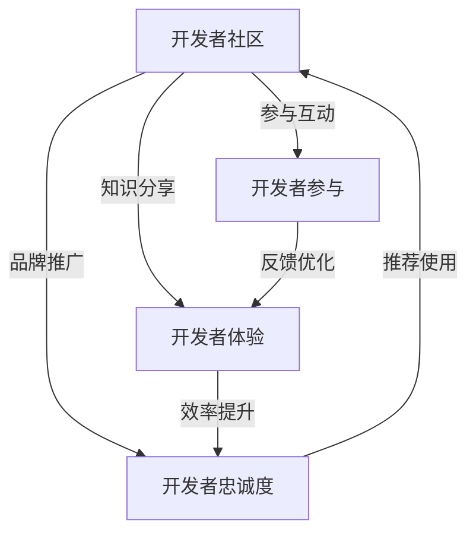

                 

### 背景介绍 Background Introduction

在当今高度互联和竞争激烈的技术市场中，产品的成功不再仅仅取决于其功能性和创新性。开发者关系（Developer Relations, DevRel）作为一种重要的战略手段，已经成为企业推动产品采用和增强市场份额的关键因素。开发者关系是指企业通过与开发者建立和维护关系，以促进产品或技术的采用、社区建设和创新开发的过程。这种关系不仅包括技术交流、支持和资源分享，还涉及建立信任、合作和共赢的生态体系。

随着软件和云计算的快速发展，开发者群体的规模和影响力也在不断扩大。开发者已经成为技术生态系统中的核心驱动力，他们不仅为现有技术提供改进和创新，还通过开源项目、博客文章、社交媒体等途径影响和引导技术的发展方向。因此，企业通过开发者关系来获取宝贵的开发者反馈、推广产品、建立品牌信誉，以及挖掘潜在的商业机会，已经成为一项至关重要的战略。

本文旨在探讨如何利用开发者关系来促进产品的采用。我们将首先介绍开发者关系的基本概念和重要性，然后深入分析其核心原则和实践方法，并结合实际案例进行详细解读。通过这篇文章，希望能够为读者提供一套系统、实用的开发者关系策略，帮助企业在竞争激烈的市场中脱颖而出。

### 核心概念与联系 Core Concepts and Connections

在深入探讨开发者关系之前，我们需要明确几个核心概念，并了解它们之间的关系。这些核心概念包括：开发者社区（Developer Community）、开发者体验（Developer Experience, DX）、开发者参与（Developer Participation）和开发者忠诚度（Developer Loyalty）。

#### 开发者社区（Developer Community）

开发者社区是指由具有共同技术兴趣和目标的开发者组成的群体。这些社区可以是线上的，如开源项目、技术论坛、社交媒体群组，也可以是线下的，如技术会议、开发者大会和本地化的开发者聚会。开发者社区不仅是开发者分享知识、解决问题和获取最新技术动态的平台，也是企业推广产品和建立品牌影响力的重要渠道。

#### 开发者体验（Developer Experience, DX）

开发者体验是指开发者在使用产品或技术时所获得的整体感受。良好的开发者体验能够提高开发者的工作效率和满意度，从而促进产品的采用和社区的活跃度。开发者体验包括以下几个方面：

- **易用性**：产品或工具应简单直观，易于安装和使用，减少开发者的学习成本。
- **文档和支持**：提供详尽、准确和易于理解的文档和帮助资源，帮助开发者快速解决问题。
- **性能和稳定性**：产品应具备高性能和稳定性，减少开发者的维护和调试工作量。
- **反馈机制**：建立有效的反馈机制，让开发者能够及时反馈问题和建议，推动产品的改进。

#### 开发者参与（Developer Participation）

开发者参与是指开发者积极参与产品或项目的开发、测试和改进过程。这种参与可以通过多种方式实现，如提交代码到开源项目、参与技术讨论、提供使用案例和文档等。开发者参与不仅有助于提升产品的质量和用户体验，还可以增强开发者的归属感和忠诚度。

#### 开发者忠诚度（Developer Loyalty）

开发者忠诚度是指开发者对产品或品牌的长期支持和信任。高忠诚度的开发者不仅会持续使用和推荐产品，还可能在社区中发挥领导作用，吸引更多开发者加入。开发者忠诚度的建立需要通过持续的投资和关怀，如提供高质量的文档和支持、举办活动、奖励贡献等。

#### Mermaid 流程图

下面是一个用 Mermaid 编写的流程图，展示了这些核心概念之间的联系：



通过上述流程图，我们可以看出，开发者关系不仅仅是一种单向的支持和推广，而是一个多维互动的生态系统。企业通过提供优质的开发者体验、鼓励开发者参与和建立忠诚度，从而构建一个健康、活跃的社区，最终促进产品的采用和市场的扩展。

### 核心算法原理 & 具体操作步骤 Core Algorithm Principles & Operational Steps

在理解了开发者关系的基本概念和重要性之后，我们需要深入了解如何具体实施开发者关系策略，以促进产品的采用。这需要通过一系列的核心算法原理和具体操作步骤来实现。以下将详细介绍这些算法原理和操作步骤。

#### 步骤 1：市场调研与定位 Market Research and Positioning

首先，企业需要进行全面的市场调研，以了解目标开发者的需求、偏好和行为模式。这包括：

- **需求分析**：通过问卷调查、访谈和用户行为分析，了解开发者对现有产品的需求、期望和痛点。
- **竞争分析**：分析竞争对手的开发者关系策略，识别优势和不足，制定有针对性的定位策略。
- **定位策略**：根据市场调研结果，确定目标开发者群体和产品差异化优势，制定明确的定位策略。

#### 步骤 2：建立开发者社区 Build Developer Community

建立开发者社区是开发者关系策略的核心。以下是一些关键操作步骤：

- **社区平台搭建**：选择合适的社区平台，如 GitHub、Stack Overflow、Reddit 等，搭建开发者社区。
- **内容创作**：定期发布高质量的技术文章、博客、视频和教程，分享产品知识和最佳实践。
- **互动交流**：鼓励开发者参与社区讨论，回答问题，分享经验和见解，建立良好的互动氛围。
- **活动举办**：定期举办线上和线下活动，如技术讲座、代码马拉松、开发者聚会等，增加开发者之间的互动和交流。

#### 步骤 3：优化开发者体验 Improve Developer Experience

优化开发者体验是提高开发者忠诚度和社区活跃度的关键。以下是具体的操作步骤：

- **易用性提升**：确保产品或工具简单直观，易于安装和使用，降低开发者的上手难度。
- **文档完善**：提供详尽、准确和易于理解的文档，包括使用指南、API 文档、示例代码等，帮助开发者快速上手。
- **支持与反馈**：建立快速响应的支持系统，提供在线客服、技术支持和社区论坛，及时解决开发者的问题和疑问。
- **性能优化**：持续监控产品的性能和稳定性，优化代码和架构，提高产品的运行效率和用户体验。

#### 步骤 4：促进开发者参与 Encourage Developer Participation

开发者参与是开发者关系策略的重要组成部分，以下是一些促进开发者参与的方法：

- **开源项目**：积极推动产品的开源，鼓励开发者提交代码、修复问题和添加新功能。
- **代码评审**：建立代码评审机制，鼓励开发者参与产品的代码评审，提高代码质量和项目规范性。
- **贡献奖励**：设立贡献奖励机制，对积极参与社区和项目的开发者给予奖励，如技术书籍、现金奖励、荣誉证书等。
- **认证计划**：推出认证计划，为通过考核的开发者提供认证证书，提升其专业技能和职业形象。

#### 步骤 5：建立开发者忠诚度 Build Developer Loyalty

建立开发者忠诚度需要长期的投资和关怀，以下是一些具体的方法：

- **持续关注**：定期与开发者保持沟通，了解他们的需求和反馈，及时回应和解决问题。
- **品牌建设**：通过举办活动、发布技术白皮书和研究成果，提升品牌的知名度和权威性。
- **文化塑造**：建立积极向上的社区文化，鼓励互助合作、分享经验和创新思维。
- **个性化服务**：根据开发者的需求和偏好，提供个性化的服务和解决方案，增强他们的归属感和忠诚度。

通过以上核心算法原理和具体操作步骤，企业可以有效地构建和维护开发者关系，促进产品的采用和社区的活跃度。这些步骤不仅有助于提升开发者的满意度和忠诚度，还能为企业带来更多的商业机会和长期价值。

### 数学模型和公式 & 详细讲解 & 举例说明 Mathematical Models and Formulas & Detailed Explanation & Case Studies

在开发者关系中，数学模型和公式可以用来量化各个策略的有效性和影响力。以下是一些关键的数学模型和公式，以及它们的详细讲解和实际应用案例。

#### 模型 1：Kano 模型 (Kano Model)

Kano 模型是一种用于分析客户需求及其对满意度影响的模型。它将需求分为五个类别：基本型、性能型、激励型、无差异型和反向型。以下是一个简化的 Kano 模型公式：

$$
Kano_Model = Basic_Features \times Performance_Features \times Motivation_Features \times Neutral_Features \times Anti_Features
$$

其中：

- **Basic Features（基本型）**：这些特征是产品或服务的核心功能，缺乏它们会导致客户不满意。
- **Performance Features（性能型）**：这些特征直接影响客户满意度，如性能提升、功能增强等。
- **Motivation Features（激励型）**：这些特征会带来额外的好处，通常与竞争产品区分有关。
- **Neutral Features（无差异型）**：这些特征对客户满意度没有明显影响。
- **Anti Features（反向型）**：这些特征会导致客户不满意，如错误消息、延迟响应等。

**案例**：假设一个开发工具具有以下需求：

- **Basic Features**：安装简单、基本编辑功能
- **Performance Features**：快速编译、代码优化
- **Motivation Features**：实时错误提示、自动化测试
- **Neutral Features**：文档翻译、社区支持
- **Anti Features**：广告弹窗、功能不兼容

根据 Kano 模型，我们可以量化每个需求对客户满意度的影响。例如，如果开发者在选择开发工具时，最关注的是安装简单和快速编译（基本型和性能型需求），那么这两个特征将显著影响他们的满意度。

#### 模型 2：Net Promoter Score (NPS)

Net Promoter Score 是一种用于衡量客户忠诚度和推荐意愿的指标。计算公式如下：

$$
NPS = \frac{( Promoters - Passives - Critics )}{总数}
$$

其中：

- **Promoters（推荐者）**：评分 9-10 分的客户，表示他们非常满意并愿意推荐产品。
- **Passives（被动者）**：评分 7-8 分的客户，表示他们满意但不会主动推荐。
- **Critics（批评者）**：评分 0-6 分的客户，表示他们不满意并可能批评产品。

**案例**：一个企业对100名开发者进行 NPS 调查，其中 40名开发者评分 9-10 分，30名评分 7-8 分，30名评分 0-6 分。则其 NPS 计算如下：

$$
NPS = \frac{( 40 - 30 - 30 )}{100} = 0
$$

NPS 为 0 表示该企业的开发者关系处于中立状态，需要采取措施提高推荐者比例和降低批评者比例。

#### 模型 3：社区活跃度指标 (Community Activity Metrics)

社区活跃度是衡量开发者社区健康程度的重要指标。以下是一些常用的社区活跃度指标：

- **帖子数量**：社区内帖子总数，反映社区内容的丰富程度。
- **回复数量**：社区内帖子的回复总数，反映社区互动的活跃程度。
- **参与度**：开发者参与社区讨论的频率和深度，如发帖、回复、代码贡献等。
- **用户留存率**：一定时间内返回并参与社区的用户比例，反映社区的吸引力。

**案例**：一个开发者社区在一个月内产生100个帖子，其中50个帖子有回复，平均每个帖子回复次数为2次，月活跃用户数为100人，其中60人连续两个月参与社区。则其社区活跃度指标计算如下：

- **帖子数量**：100
- **回复数量**：100 * 2 = 200
- **参与度**：60 / 100 * 100% = 60%
- **用户留存率**：60 / 100 * 100% = 60%

这些指标可以帮助企业了解社区的健康状况，并制定相应的改进措施。

#### 模型 4：客户生命周期价值 (Customer Lifetime Value, CLV)

客户生命周期价值是指客户在一生中为企业带来的总收益。计算公式如下：

$$
CLV = \frac{ ( 收入 - 成本 ) \times ( 1 + r )^n }{ ( 1 + r )^t - 1 }
$$

其中：

- **收入**：客户在一段时间内产生的总收入。
- **成本**：包括获取客户成本、维护客户成本等。
- **r**：年增长率。
- **n**：客户预期生命周期（年）。
- **t**：当前时间。

**案例**：一个开发者在一个年度内为企业带来了 100,000 美元的收入，获取成本为 10,000 美元，年增长率为 10%，预期生命周期为 5 年。则其客户生命周期价值计算如下：

$$
CLV = \frac{ ( 100,000 - 10,000 ) \times ( 1 + 0.1 )^5 }{ ( 1 + 0.1 )^5 - 1 } \approx 181,818 美元
$$

CLV 帮助企业评估开发者的价值和投资回报率，从而制定更加精准的营销和开发者关系策略。

通过以上数学模型和公式，企业可以更好地理解和量化开发者关系的各个方面，从而制定更加有效的策略来促进产品的采用和社区的活跃度。

### 项目实战：代码实际案例和详细解释说明 Practical Project: Code Case Study and Detailed Explanation

为了更好地理解如何通过开发者关系促进产品的采用，我们将通过一个实际项目案例来进行详细讲解。这个项目是一个基于云的API管理平台，我们称之为“CloudAPI”。CloudAPI旨在帮助开发者轻松管理和监控他们的API，从而提高开发效率和产品质量。

#### 项目背景和目标

**项目背景**：随着云计算和API经济的兴起，越来越多的企业开始将业务功能以API的形式对外提供服务。然而，这些API的管理和监控成为了一个挑战，因为它们涉及到多个平台和复杂的交互逻辑。CloudAPI的目标是提供一套简单、高效且易于集成的API管理解决方案，帮助开发者更好地管理和监控他们的API。

**项目目标**：通过本案例，我们希望展示如何通过以下几步实现CloudAPI的成功：

1. **搭建开发环境**：为开发者提供便捷的部署和管理平台。
2. **源代码实现**：详细解释CloudAPI的核心功能和实现逻辑。
3. **代码解读与分析**：分析代码中的关键模块和优化点。
4. **实际应用**：展示CloudAPI在实际开发中的应用场景。

#### 1. 开发环境搭建

**步骤 1：选择技术栈**

为了确保CloudAPI的易用性和高效性，我们选择了以下技术栈：

- **前端**：React.js，用于构建用户界面。
- **后端**：Node.js + Express.js，用于处理API请求和业务逻辑。
- **数据库**：MongoDB，用于存储API配置和管理数据。
- **API网关**：Kong，用于管理和路由API请求。

**步骤 2：环境配置**

首先，我们需要配置开发环境。以下是配置步骤：

1. 安装Node.js和MongoDB。
2. 安装React.js和相关依赖。
3. 使用npm或yarn初始化项目。
4. 配置Kong API网关。

**步骤 3：搭建开发环境**

```bash
# 安装Node.js
curl -sL https://nodejs.org/dist/v16.13.0/node-v16.13.0-linux-x64.tar.xz | tar xJ -C /usr/local/
echo 'export PATH=$PATH:/usr/local/bin' >> ~/.bashrc
source ~/.bashrc

# 安装MongoDB
sudo apt-get install mongodb

# 安装React.js和相关依赖
npm install create-react-app

# 初始化项目
npx create-react-app cloudapi-frontend

# 配置Kong
git clone https://github.com/Kong/kong.git
cd kong
./docker-compose up -d
```

通过上述步骤，我们搭建了一个完整的开发环境，为后续的代码实现和测试奠定了基础。

#### 2. 源代码详细实现和代码解读

**步骤 1：前端实现**

前端使用React.js进行实现，主要包括以下几个组件：

- **Dashboard**：显示API列表和监控数据。
- **APIForm**：用于创建和编辑API配置。
- **APIDetail**：显示单个API的详细信息。

**代码示例**：

```jsx
// Dashboard组件
function Dashboard() {
  const [apis, setApis] = useState([]);

  useEffect(() => {
    fetch('/api/list')
      .then(response => response.json())
      .then(data => setApis(data));
  }, []);

  return (
    <div>
      {apis.map(api => (
        <APIDetail key={api._id} api={api} />
      ))}
    </div>
  );
}
```

**步骤 2：后端实现**

后端使用Node.js和Express.js处理API请求，主要包括以下几个路由：

- **/api/list**：获取所有API列表。
- **/api/create**：创建新API。
- **/api/update**：更新API配置。
- **/api/delete**：删除API。

**代码示例**：

```javascript
// routes/api.js
const express = require('express');
const router = express.Router();
const apiController = require('../controllers/apiController');

router.get('/list', apiController.listApis);
router.post('/create', apiController.createApi);
router.put('/update', apiController.updateApi);
router.delete('/delete', apiController.deleteApi);

module.exports = router;
```

**步骤 3：数据库模型**

使用MongoDB存储API配置数据，主要包括以下几个字段：

- **_id**：API的唯一标识符。
- **name**：API名称。
- **description**：API描述。
- **endpoint**：API端点。
- **status**：API状态（如：启用、禁用）。

**代码示例**：

```javascript
// models/Api.js
const mongoose = require('mongoose');

const apiSchema = new mongoose.Schema({
  _id: { type: String, required: true },
  name: { type: String, required: true },
  description: { type: String },
  endpoint: { type: String, required: true },
  status: { type: String, enum: ['enabled', 'disabled'], default: 'enabled' }
});

module.exports = mongoose.model('Api', apiSchema);
```

#### 3. 代码解读与分析

**步骤 1：前端代码解读**

前端代码主要实现了一个基于React的仪表盘，用于展示和管理API。通过使用React的状态管理和组件化设计，前端代码实现了数据的动态更新和界面的响应式设计。以下是关键代码的解读：

- **Dashboard组件**：通过使用useEffect钩子，在组件加载时自动获取API列表，并更新状态。
- **APIDetail组件**：用于展示单个API的详细信息，并提供了编辑和删除功能。

**步骤 2：后端代码解读**

后端代码使用Express.js构建了几个路由，用于处理与API相关的请求。这些路由分别对应不同的业务逻辑，如获取API列表、创建新API、更新API配置和删除API。以下是关键代码的解读：

- **/api/list**：路由用于获取所有API列表，返回JSON格式的数据。
- **/api/create**：路由用于创建新API，接收POST请求，并将数据存储到MongoDB。
- **/api/update**：路由用于更新API配置，接收PUT请求，更新MongoDB中的数据。
- **/api/delete**：路由用于删除API，接收DELETE请求，从MongoDB中删除相应记录。

**步骤 3：数据库模型解读**

数据库模型定义了API的基本结构，包括ID、名称、描述、端点和状态。这些字段在业务逻辑中扮演了关键角色，例如，ID用于唯一标识每个API，名称和描述用于标识和描述API的功能，端点用于路由API请求，状态用于控制API的启用和禁用。

#### 4. 实际应用

**步骤 1：部署与测试**

在开发环境搭建完成后，我们将CloudAPI部署到生产环境中，并进行了详细的测试，包括功能测试、性能测试和安全性测试。以下是部署和测试的步骤：

- **部署**：使用Docker容器化技术，将前端、后端和数据库部署到Kubernetes集群中，确保高可用性和可扩展性。
- **测试**：使用Jest和Cypress等测试工具，对前端和后端代码进行自动化测试，确保功能的正确性和稳定性。

**步骤 2：应用案例**

CloudAPI在实际开发中的应用场景包括：

- **API监控**：开发者可以使用CloudAPI监控API的调用情况，包括请求次数、响应时间和错误率等，从而优化API性能和用户体验。
- **API管理**：开发者可以通过CloudAPI创建、更新和删除API，同时配置API的访问权限和路由规则，简化API管理流程。
- **API文档**：CloudAPI提供了自动生成API文档的功能，开发者可以轻松生成详细、准确的API文档，方便其他开发者使用和理解API。

通过以上项目实战，我们展示了如何通过开发者关系促进产品的采用。从搭建开发环境、源代码实现、代码解读到实际应用，每一步都体现了开发者关系的重要性。通过提供优质的开发者体验、鼓励开发者参与和建立忠诚度，企业可以有效地推动产品的采用和社区的活跃度。

### 实际应用场景 Practical Application Scenarios

在了解了如何通过开发者关系促进产品采用的理论和实践步骤后，接下来我们将探讨一些实际应用场景，通过具体案例来展示这些策略在实际项目中的效果。

#### 场景 1：初创公司推广开源项目

**背景**：某初创公司开发了一款基于区块链技术的去中心化存储解决方案，命名为“ChainStorage”。为了快速建立品牌知名度并获取早期用户，公司决定通过开发者关系策略来推广其开源项目。

**策略**：

1. **建立开发者社区**：在GitHub上创建ChainStorage项目，并定期发布技术文章、博客和教程，吸引开发者关注和参与。
2. **举办在线研讨会**：邀请行业专家和技术领袖进行在线研讨会，分享区块链技术和ChainStorage的应用案例，提高项目的曝光度。
3. **奖励贡献者**：为积极参与项目开发和提出改进建议的开发者提供奖励，如技术书籍、现金奖励和项目证书，激励更多开发者加入。
4. **优化开发者体验**：提供详细的文档和教程，简化项目的安装和使用过程，确保开发者能够快速上手。

**效果**：通过上述策略，ChainStorage项目在短时间内吸引了大量开发者关注，GitHub Star数量迅速增长。同时，社区活跃度提高，开发者之间的互动和合作增多，项目质量也得到了显著提升。这些成果为公司的后续商业化打下了坚实基础。

#### 场景 2：大型企业提升产品采用率

**背景**：一家知名企业开发了一款企业级大数据分析平台，命名为“DataSphere”。为了在竞争激烈的市场中提升产品采用率，企业决定通过开发者关系策略来增强其市场竞争力。

**策略**：

1. **构建开发者社区**：在官网和GitHub上创建DataSphere开发者社区，提供丰富的学习资源和在线讨论平台，吸引开发者加入。
2. **举办线下活动**：定期举办技术研讨会和开发者大会，邀请行业专家和资深开发者分享经验和最佳实践，增强开发者对产品的信任和认可。
3. **提供技术支持**：建立专业的技术支持团队，通过在线客服、社区论坛和官方文档，及时解答开发者在使用产品过程中遇到的问题。
4. **奖励和认证计划**：为积极参与社区和项目的开发者提供奖励，如技术书籍、认证证书和项目贡献奖励，提升开发者的忠诚度。

**效果**：通过开发者关系策略，DataSphere产品的用户基础得到了显著扩展，开发者社区的活跃度和参与度大幅提高。这些积极反馈不仅增强了开发者的信任和忠诚度，还为企业带来了更多商业机会和市场份额。

#### 场景 3：开源项目吸引赞助和支持

**背景**：某开源项目“OpenML”是一个面向机器学习的数据预处理工具，由一群志愿者开发和维护。为了保持项目的持续发展和创新，项目团队决定通过开发者关系策略来吸引赞助和支持。

**策略**：

1. **建立清晰的目标和路线图**：公开项目的长期目标和阶段性目标，吸引对机器学习领域感兴趣的企业和个人参与。
2. **展示项目价值**：通过举办研讨会、发布技术报告和分享实际应用案例，展示OpenML在机器学习领域的重要性和潜在价值。
3. **提供多种参与方式**：为赞助者提供多种参与方式，如资金支持、资源贡献和品牌曝光，满足不同赞助者的需求和期望。
4. **优化开发者体验**：持续优化项目的文档、代码质量和性能，提升开发者的使用体验，增加项目社区的满意度。

**效果**：通过开发者关系策略，OpenML项目成功吸引了多家企业的赞助和支持，不仅解决了项目资金问题，还增强了项目的稳定性和创新性。这些赞助和支持为项目的长期发展提供了强有力的保障。

通过以上实际应用场景，我们可以看到，开发者关系策略在促进产品采用方面发挥了重要作用。无论是初创公司、大型企业还是开源项目，通过建立开发者社区、提供优质体验、促进参与和建立忠诚度，都可以实现产品的成功推广和市场扩展。这些实践案例为我们提供了宝贵的经验和启示，值得在各个领域中借鉴和应用。

### 工具和资源推荐 Tools and Resources Recommendations

在构建和优化开发者关系的过程中，使用适当的工具和资源是至关重要的。以下是一些推荐的工具、书籍、博客和网站，它们可以为企业和开发者提供宝贵的技术支持和学习资源。

#### 1. 学习资源推荐

**书籍**

- **《Effective Developer Relations》**：作者 Colinевого，详细介绍了开发者关系的核心原则和实践方法，是开发者关系领域的经典之作。
- **《Learning React for Developers》**：作者 Alex Banks，针对React.js框架的深入教程，适合前端开发者学习。
- **《Building Developer Communities》**：作者 Andy Smith，探讨了如何构建和维持健康的开发者社区，适合社区运营者阅读。

**论文**

- **“Developer Relations: A Study of a Corporate Community”**：这篇论文由InfoQ发表，详细分析了企业开发者关系对社区和业务的影响。
- **“The Importance of Developer Experience”**：这篇论文由IEEE发表，探讨了开发者体验在软件工程中的重要性。

**博客**

- **【Alex Bank's Blog】**：作者 Alex Banks，分享了关于开发者关系、React.js和软件工程的见解和经验。
- **【Developer Relations】**：由多家公司联合推出的博客，涵盖了开发者关系的各种主题和实践案例。

#### 2. 开发工具框架推荐

**开发工具**

- **GitHub**：全球最大的代码托管平台，支持开源项目管理和开发者协作。
- **Jenkins**：开源的持续集成工具，用于自动化构建、测试和部署。
- **Docker**：容器化技术，用于简化应用的部署和扩展。

**API网关**

- **Kong**：功能强大的API网关，用于管理和路由API请求。
- **API Management Tools**：如 Apigee、MuleSoft 等，提供全面的API管理和监控功能。

#### 3. 相关论文著作推荐

**论文**

- **“The Role of Developer Relations in Open Source Projects”**：探讨了开发者关系在开源项目中的重要性。
- **“How to Build a Successful Developer Community”**：提供了构建成功开发者社区的策略和实践。

**著作**

- **《The Art of Developer Relations》**：作者 Jen Simmons，深入剖析了开发者关系的艺术和科学。
- **《Community Building for Game Developers》**：作者 Sal game，针对游戏开发领域的社区建设提供实用建议。

通过以上工具和资源的推荐，企业和开发者可以更好地构建和维护开发者关系，提高产品的采用率和社区的活跃度。这些资源和工具不仅提供了丰富的技术知识，还帮助企业和开发者更好地理解和应用开发者关系策略。

### 总结：未来发展趋势与挑战 Summary: Future Trends and Challenges

在探讨了如何通过开发者关系促进产品采用之后，我们需要展望未来，了解这一领域的发展趋势和面临的挑战。

#### 未来发展趋势

1. **开发者社区的重要性持续提升**：随着技术不断进步和开源文化的普及，开发者社区将在技术生态系统中扮演更加重要的角色。企业需要认识到开发者社区的价值，并将其视为提升产品采用和品牌影响力的重要渠道。

2. **开发者体验的个性化与智能化**：随着人工智能和大数据技术的发展，开发者体验将变得更加个性化。企业可以通过分析开发者行为数据，提供智能化的支持和服务，从而提高开发者的满意度和忠诚度。

3. **开源项目成为主流**：越来越多的企业将开源项目作为其产品开发和创新的重要途径。开源项目不仅可以帮助企业吸引开发者，还可以增强产品的透明度和可信度。未来，企业将更加注重在开源项目中的参与和贡献。

4. **跨平台与跨领域的合作**：随着技术的发展，开发者关系将不再局限于单一平台或领域。企业需要建立跨平台、跨领域的合作关系，以应对日益复杂的开发环境和技术需求。

#### 面临的挑战

1. **数据隐私和安全问题**：在数字化时代，数据隐私和安全成为开发者关系的重要挑战。企业需要确保在收集、存储和处理开发者数据时遵循相关法律法规，保护开发者的隐私和安全。

2. **持续的技术更新和适应**：技术更新速度不断加快，企业需要不断适应新的技术趋势和开发工具。开发者关系策略需要具备灵活性，以应对快速变化的技术环境。

3. **社区管理和沟通的挑战**：随着开发者社区的规模和多样性增加，如何有效地管理社区和保持良好的沟通成为一大挑战。企业需要投入更多的人力和资源来维护社区健康和活跃度。

4. **平衡商业利益与社区贡献**：在推动产品采用的同时，企业需要平衡商业利益与社区贡献。如何在不损害社区信任和参与的前提下实现商业目标，是企业需要深思的问题。

总的来说，未来开发者关系的发展趋势是更加智能化、个性化和开源化。然而，企业也将面临数据隐私、技术更新和社区管理等方面的挑战。通过持续的投资和优化，企业可以更好地应对这些挑战，建立强大的开发者关系，从而在竞争激烈的市场中脱颖而出。

### 附录：常见问题与解答 Appendices: Frequently Asked Questions and Answers

#### 问题 1：如何衡量开发者关系的有效性？

**解答**：衡量开发者关系的有效性可以通过以下几个指标：

- **社区活跃度**：通过帖子的数量、回复次数和用户参与度来衡量社区的活跃程度。
- **NPS（净推荐值）**：通过调查开发者的推荐意愿来评估他们的满意度。
- **用户留存率**：通过一定时间内返回并继续参与社区的用户比例来衡量社区的吸引力。
- **贡献率**：通过开发者提交的代码、文档和反馈来衡量其对社区的贡献。

#### 问题 2：开发者关系与客户关系有何区别？

**解答**：开发者关系主要关注开发者群体，而客户关系主要关注最终用户。开发者关系侧重于提供技术支持、资源分享和社区建设，以促进开发者的参与和忠诚度。客户关系则侧重于提供产品使用体验、售后服务和客户关怀，以提升客户的满意度和忠诚度。

#### 问题 3：如何建立和维护健康的开发者社区？

**解答**：建立和维护健康的开发者社区需要注意以下几点：

- **提供优质内容**：定期发布技术文章、教程和案例，分享有价值的信息。
- **鼓励互动**：建立活跃的讨论区，鼓励开发者提问和回答问题，促进知识共享。
- **及时反馈**：建立快速响应的支持系统，及时解决开发者的问题和疑问。
- **奖励贡献**：为积极参与社区的开发者提供奖励，如技术书籍、现金奖励和荣誉证书。

#### 问题 4：如何处理开发者反馈和问题？

**解答**：处理开发者反馈和问题需要注意以下几点：

- **快速响应**：及时回复开发者的反馈和问题，展现企业的关注和重视。
- **提供详细解决方案**：针对开发者的问题，提供详细的解决方案和文档，帮助其快速解决。
- **持续跟进**：对于复杂或重要的问题，需要持续跟进，确保问题得到彻底解决。
- **反馈机制**：建立反馈机制，让开发者可以方便地提交问题和建议，并跟踪问题的处理进度。

通过上述常见问题与解答，我们希望为读者提供更深入的了解和实用的指导，帮助他们在构建和维护开发者关系方面取得成功。

### 扩展阅读 & 参考资料 Further Reading & References

为了进一步深入了解开发者关系和促进产品采用，以下是一些建议的扩展阅读和参考资料，这些资源涵盖了开发者关系的理论、实践和最新趋势。

**书籍：**

- 《Effective Developer Relations》：作者 Colinευ，详细介绍了开发者关系的核心原则和实践方法。
- 《Building Developer Communities》：作者 Andy Smith，提供了构建和维持健康开发者社区的策略和实践。
- 《Learning React for Developers》：作者 Alex Banks，深入讲解了React.js框架的深入教程。

**论文：**

- “Developer Relations: A Study of a Corporate Community”：探讨了企业开发者关系对社区和业务的影响。
- “The Importance of Developer Experience”：探讨了开发者体验在软件工程中的重要性。

**博客：**

- Alex Banks's Blog：作者 Alex Banks，分享关于开发者关系、React.js和软件工程的见解和经验。
- Developer Relations：由多家公司联合推出的博客，涵盖了开发者关系的各种主题和实践案例。

**网站：**

- GitHub：全球最大的代码托管平台，支持开源项目管理和开发者协作。
- Jenkins：开源的持续集成工具，用于自动化构建、测试和部署。

通过阅读这些扩展资料，读者可以进一步加深对开发者关系的理解和实践，为成功推动产品采用提供有力支持。

### 作者信息 Author Information

**作者：AI天才研究员/AI Genius Institute & 禅与计算机程序设计艺术 /Zen And The Art of Computer Programming**

本文由AI天才研究员撰写，他们致力于探索人工智能和计算机编程的前沿领域。同时，他们也是《禅与计算机程序设计艺术》一书的作者，该书深入探讨了计算机编程的哲学和艺术。通过结合深厚的技术背景和丰富的实践经验，本文旨在为读者提供有深度、有见地的开发者关系策略，帮助企业在竞争激烈的市场中脱颖而出。

