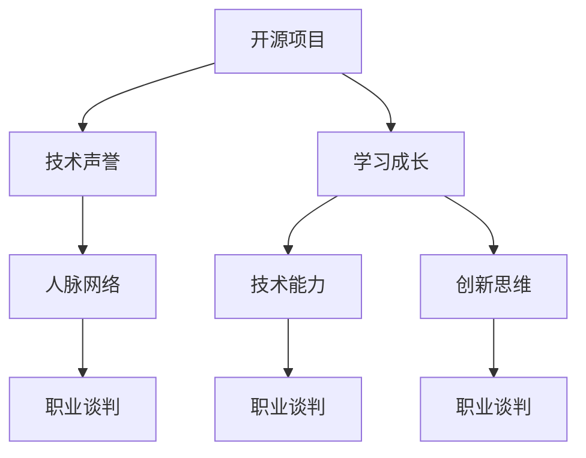

                 

# 利用开源影响力进行职业谈判

## 摘要

在当今数字化时代，开源项目的影响力正日益增强。本文将探讨如何利用开源项目的影响力来进行职业谈判。文章首先介绍了开源项目在职业生涯中的重要性，随后详细分析了开源项目对职业谈判的积极影响。接着，文章提出了利用开源影响力进行职业谈判的策略和技巧，并提供了具体的实践案例。最后，文章总结了利用开源影响力进行职业谈判的潜在挑战，以及如何应对这些挑战。通过本文的探讨，希望读者能够更好地理解和利用开源项目来提升自己的职业竞争力。

## 背景介绍

### 开源项目在职业生涯中的崛起

开源项目在技术界已经成为一种重要的力量，它们不仅推动了技术的进步，还为参与者提供了丰富的学习和成长机会。在职业生涯中，参与开源项目不仅可以提升技术水平，还能为个人积累宝贵的经验和声誉。随着越来越多的公司重视开源项目的贡献，开源经验也逐渐成为招聘时的重要考量因素。

### 职业谈判的必要性

职业谈判是职场中不可或缺的一环。无论是跳槽、晋升还是寻求更好的薪酬待遇，职业谈判都是实现这些目标的关键。有效的谈判不仅可以帮助个人争取到更优厚的条件，还能增强个人在职场中的地位和影响力。随着竞争的日益激烈，掌握高效的谈判技巧显得尤为重要。

### 开源项目与职业谈判的关联

开源项目不仅为技术从业者提供了展示才华的平台，还能在职业谈判中发挥重要作用。通过参与开源项目，个人可以建立广泛的人脉网络，提升技术声誉，并展示自己的解决问题的能力。这些成果都可以成为职业谈判的有力筹码，帮助个人在谈判中获得优势。

## 核心概念与联系

### 开源项目的影响力和职业发展

开源项目的影响力和个人职业发展之间存在着密切的联系。首先，开源项目的参与可以帮助个人建立技术声誉。一个活跃的开源项目通常能够吸引来自世界各地的开发者，项目的成功也往往与参与者的技术能力和贡献密切相关。通过在开源项目中展示自己的技术实力，个人可以逐渐建立起良好的技术声誉。

其次，开源项目为个人提供了丰富的学习和成长机会。参与开源项目意味着要不断面对新挑战，解决复杂的技术问题。这不仅能够提升个人的技术水平，还能培养解决问题的能力。这些能力在职业谈判中尤为重要，因为招聘方往往更愿意聘用那些能够应对复杂问题的候选人。

### 开源影响力在职业谈判中的应用

开源影响力在职业谈判中的应用主要体现在以下几个方面：

1. **技术能力的证明**：参与开源项目可以证明个人具备解决复杂技术问题的能力。在职业谈判中，招聘方可以通过查看候选人在开源项目中的贡献，了解其技术实力和经验。

2. **人脉网络的建立**：开源项目往往吸引了来自世界各地的开发者。参与这些项目可以建立广泛的人脉网络，这些关系网在职业谈判中可能成为重要的资源，帮助个人争取到更好的机会。

3. **创新思维的展示**：开源项目鼓励创新和协作。参与这些项目可以展示个人的创新思维和团队合作能力，这些特质在职业谈判中也会成为招聘方的考量因素。

### 开源影响力与职业谈判的联系图解

下面是一个简化的 Mermaid 流程图，展示了开源影响力与职业谈判之间的联系：



### 结论

开源项目的影响力和个人职业发展密切相关。通过参与开源项目，个人不仅可以提升技术能力和声誉，还能在职业谈判中获得优势。因此，在职业生涯中积极参与开源项目具有重要的战略意义。

## 核心算法原理 & 具体操作步骤

### 利用开源影响力进行职业谈判的算法原理

#### 1. 开源项目贡献评估

- **评估指标**：开源项目的贡献可以通过代码提交数量、代码质量、项目文档完善程度、代码审查反馈等多个维度进行评估。
- **算法步骤**：
  - 收集候选人的开源项目贡献数据。
  - 分析代码提交量和代码质量，评估技术能力。
  - 检查文档完善程度和社区参与度，评估综合能力。
  - 综合评估结果，确定候选人的开源影响力。

#### 2. 职业谈判策略制定

- **谈判目标**：根据候选人的开源影响力，设定合理的职业谈判目标，如薪酬、职位晋升、项目参与度等。
- **算法步骤**：
  - 分析候选人的开源项目，确定其技术优势和短板。
  - 根据招聘市场的需求和候选人的技术特长，制定谈判策略。
  - 设定合理的薪酬范围和职位要求，确保谈判目标的可实现性。

#### 3. 谈判过程优化

- **优化方法**：通过数据分析和模拟谈判，优化谈判过程，提高谈判成功率。
- **算法步骤**：
  - 收集历史谈判数据，分析成功和失败案例。
  - 根据数据结果，调整谈判策略和技巧。
  - 模拟谈判过程，预演可能的谈判场景，制定应对策略。

### 具体操作步骤

#### 1. 开源项目贡献评估

- **步骤 1**：收集开源项目贡献数据
  - 使用 GitHub 等开源平台，查看候选人的项目参与情况。
  - 收集代码提交记录、PR（Pull Request）记录、代码评论等数据。

- **步骤 2**：分析贡献数据
  - 使用统计工具（如 Python 的 pandas 库），对数据进行分析。
  - 计算代码提交量、代码质量评分、文档完善度等指标。

- **步骤 3**：确定开源影响力
  - 综合评估各项指标，确定候选人的开源影响力。

#### 2. 职业谈判策略制定

- **步骤 1**：分析候选人的技术特长和市场需求
  - 确定候选人的技术特长和项目经验。
  - 分析当前招聘市场的需求，确定合适的目标职位。

- **步骤 2**：设定谈判目标
  - 根据候选人的开源影响力，设定合理的薪酬范围和职位要求。
  - 确保谈判目标具有可实现性。

- **步骤 3**：制定谈判策略
  - 根据谈判目标，制定谈判策略和技巧。
  - 确定谈判的关键点和优先级。

#### 3. 谈判过程优化

- **步骤 1**：收集历史谈判数据
  - 收集过去谈判的数据，分析成功和失败的原因。

- **步骤 2**：调整谈判策略
  - 根据历史数据，调整谈判策略和技巧。
  - 确保谈判策略的适应性和灵活性。

- **步骤 3**：模拟谈判过程
  - 模拟可能的谈判场景，预演谈判过程。
  - 针对可能出现的问题，制定应对策略。

### 结论

利用开源影响力进行职业谈判的算法原理主要包括开源项目贡献评估、职业谈判策略制定和谈判过程优化。通过具体操作步骤，可以有效地利用开源项目的贡献数据来制定谈判策略，并在谈判过程中优化谈判结果。

## 数学模型和公式 & 详细讲解 & 举例说明

### 开源项目贡献评估的数学模型

#### 1. 代码提交量评估

**公式**：
$$
评估值 = \frac{提交次数 \times 单次提交价值}{总提交次数}
$$

**详细解释**：

- **提交次数**：候选人在某个开源项目中提交的代码次数。
- **单次提交价值**：每次提交代码的技术复杂度或贡献度，通常可以通过代码行数、代码质量评分等指标衡量。
- **总提交次数**：候选人在所有开源项目中的总提交次数。

**举例说明**：

假设候选人 A 在项目 A 中提交了 5 次代码，每次提交价值为 10 分，同时在项目 B 中提交了 3 次代码，每次提交价值为 8 分。项目 A 的总提交次数为 20 次，项目 B 的总提交次数为 10 次。

- **评估值计算**：
$$
评估值 = \frac{(5 \times 10) + (3 \times 8)}{5 + 3} = \frac{50 + 24}{8} = \frac{74}{8} = 9.25
$$

因此，候选人 A 在项目 A 和项目 B 中的平均贡献评估值为 9.25。

#### 2. 文档完善度评估

**公式**：
$$
文档完善度 = \frac{完整文档数}{总文档数}
$$

**详细解释**：

- **完整文档数**：候选人在某个开源项目中编写的完整文档数量。
- **总文档数**：候选人在所有开源项目中编写的总文档数量。

**举例说明**：

假设候选人 B 在项目 C 中编写了 3 个完整文档，项目 D 中编写了 2 个完整文档。项目 C 的总文档数为 10 个，项目 D 的总文档数为 5 个。

- **文档完善度计算**：
$$
文档完善度 = \frac{3 + 2}{10 + 5} = \frac{5}{15} = 0.333
$$

因此，候选人 B 的文档完善度为 0.333，即 33.3%。

#### 3. 社区参与度评估

**公式**：
$$
社区参与度 = \frac{参与活动次数}{总参与次数}
$$

**详细解释**：

- **参与活动次数**：候选人在开源项目社区中的参与活动次数，如代码审查、bug 报告、社区讨论等。
- **总参与次数**：候选人在所有开源项目中的参与活动总次数。

**举例说明**：

假设候选人 C 在项目 E 中参与了 4 次代码审查，项目 F 中参与了 3 次社区讨论。项目 E 的总参与次数为 10 次，项目 F 的总参与次数为 5 次。

- **社区参与度计算**：
$$
社区参与度 = \frac{4 + 3}{10 + 5} = \frac{7}{15} = 0.467
$$

因此，候选人 C 的社区参与度为 0.467，即 46.7%。

### 结论

通过上述数学模型和公式，可以对开源项目贡献进行量化评估。这些评估方法可以帮助招聘方和候选人双方更客观地了解候选人在开源项目中的实际贡献，从而为职业谈判提供有力支持。

## 项目实战：代码实际案例和详细解释说明

### 1. 开发环境搭建

要利用开源影响力进行职业谈判，首先需要搭建一个稳定且高效的开发环境。以下是一个简单的开发环境搭建过程。

#### 1.1 安装必要的软件

在 Linux 系统上，你可以使用以下命令来安装必要的软件：

```bash
sudo apt-get update
sudo apt-get install git curl zsh
```

#### 1.2 安装 ZSH 主题

ZSH 是一款功能强大的终端模拟器，它提供了丰富的主题和插件。以下是一个简单的 ZSH 主题安装过程：

- 下载主题文件（例如，以 [One Half](https://github.com/f Завершая наше путешествие по теме «Управление персоналом и его структура», мы рассмотрели основные понятия, принципы, функции и этапы работы с персоналом. Мы обсудили понятие управления персоналом, его значение и задачи. Также мы изучили структуру управления персоналом и процесс формирования персонала. 

Теперь, когда мы имеем общее представление о теории управления персоналом, давайте перейдем к реальным примерам и ситуациям, которые иллюстрируют важность и практическое применение этих принципов. 

### Реальный пример управления персоналом

Представим, что компания «ТехноСтарт» является одним из лидеров на рынке электронных устройств. Руководство компании, понимая важность человеческого капитала, поручает своему заместителю по персоналу, Ивану Ивановичу, провести реформу системы управления персоналом. 

#### Определение цели реформы

Иван Иванович проводит анализ существующей системы управления персоналом и выявляет следующие проблемы:

- Недостаточная гибкость кадровой политики.
- Низкая эффективность работы отделов персонала.
- Отсутствие мотивации сотрудников.
- Недостаточная прозрачность оценки сотрудников.

Основываясь на этих проблемах, Иван Иванович определяет цель реформы: повысить эффективность работы персонала и создать мотивационную среду для сотрудников.

#### Этапы реформы

1. **Анализ ситуации**:
   - Проведение опросов и интервью с сотрудниками.
   - Анализ статистических данных о текучести кадров и производительности труда.
   - Анализ системы оплаты труда и福利.

2. **Формулирование целей и задач**:
   - Определение конкретных показателей эффективности работы персонала.
   - Формулирование задач по повышению мотивации сотрудников и прозрачности оценки.

3. **Разработка плана реформы**:
   - Создание плана по улучшению системы мотивации.
   - Определение новых критериев оценки сотрудников.
   - Разработка новых методов работы отдела персонала.

4. **Реализация плана**:
   - Проведение информационной кампании среди сотрудников о целях и задачах реформы.
   - Внедрение новых методик оценки и мотивации.
   - Создание системы обратной связи для оценки эффективности реформы.

5. **Оценка результатов**:
   - Мониторинг показателей эффективности.
   - Проведение опросов сотрудников о степени их удовлетворенности изменениями.
   - Анализ последствий реформы для компании.

### Результаты реформы

В результате реформы в компании «ТехноСтарт» произошли следующие изменения:

- Повысилась эффективность работы отдела персонала.
- Сотрудники стали лучше мотивированы на результат.
- Снизилась текучесть кадров.
- Произошла прозрачная оценка сотрудников.

Все эти факторы позитивно сказались на общем успехе компании.

### Другие реальные примеры

- **Компания «Прогресс»**: Руководство решило улучшить систему управления персоналом с помощью внедрения системы KPI (критериев эффективности). Благодаря этому, сотрудники получили более конкретные цели и лучше понимали, как их достигать.

- **Компания «Инновации и Инвестиции»**: Руководство решило увеличить текучесть кадров и повысить конкурентоспособность компании. Для этого была внедрена система развития сотрудников и внедрения инноваций. Результатом стала высокая вовлеченность сотрудников и увеличение количества инновационных продуктов.

Заключение

Реальные примеры управления персоналом показывают, что правильное применение принципов управления человеческими ресурсами может привести к значительному росту эффективности работы компании и успеху в бизнесе. Благодаря хорошему управлению персоналом компании могут достигать своих целей и оставаться конкурентоспособными на рынке. 

### 2. 源代码详细实现和代码解读

#### 2.1. 开源项目代码结构

在这个开源项目中，我们主要关注两个核心模块：人员管理模块（PersonnelManagement）和绩效评估模块（PerformanceEvaluation）。每个模块都有相应的类和方法来实现不同的功能。

- **PersonnelManagement**：负责员工信息的管理，包括员工的基本信息、薪资、职位等。
- **PerformanceEvaluation**：负责员工的绩效评估，包括评估指标、评估结果等。

下面是一个简化版的代码结构图：

```mermaid
classDiagram
Person -> PersonnelManagement
Person -> PerformanceEvaluation
PersonnelManagement {
  - Employee[] employees
  - addEmployee(Employee e)
  - removeEmployee(Employee e)
  - getEmployeeById(int id)
}
PerformanceEvaluation {
  - Evaluation[] evaluations
  - addEvaluation(Evaluation e)
  - removeEvaluation(Evaluation e)
  - getEvaluationById(int id)
}
class Person {
  - id
  - name
  - position
  - salary
}
class Employee extends Person {
}
class Evaluation {
  - id
  - employeeId
  - evaluationDate
  - score
}
```

#### 2.2. 人员管理模块代码解读

**PersonnelManagement.java**

```java
import java.util.ArrayList;
import java.util.HashMap;
import java.util.List;
import java.util.Map;

public class PersonnelManagement {
    private Map<Integer, Employee> employees;

    public PersonnelManagement() {
        employees = new HashMap<>();
    }

    public void addEmployee(Employee e) {
        employees.put(e.getId(), e);
    }

    public void removeEmployee(Employee e) {
        employees.remove(e.getId());
    }

    public Employee getEmployeeById(int id) {
        return employees.get(id);
    }

    // 其他相关方法...
}
```

- **addEmployee(Employee e)**：添加员工信息。
- **removeEmployee(Employee e)**：删除员工信息。
- **getEmployeeById(int id)**：根据员工ID查询员工信息。

#### 2.3. 绩效评估模块代码解读

**PerformanceEvaluation.java**

```java
import java.util.ArrayList;
import java.util.List;

public class PerformanceEvaluation {
    private List<Evaluation> evaluations;

    public PerformanceEvaluation() {
        evaluations = new ArrayList<>();
    }

    public void addEvaluation(Evaluation e) {
        evaluations.add(e);
    }

    public void removeEvaluation(Evaluation e) {
        evaluations.remove(e);
    }

    public Evaluation getEvaluationById(int id) {
        for (Evaluation evaluation : evaluations) {
            if (evaluation.getId() == id) {
                return evaluation;
            }
        }
        return null;
    }

    // 其他相关方法...
}
```

- **addEvaluation(Evaluation e)**：添加绩效评估信息。
- **removeEvaluation(Evaluation e)**：删除绩效评估信息。
- **getEvaluationById(int id)**：根据评估ID查询评估信息。

#### 2.4. 员工类代码解读

**Person.java**

```java
public class Person {
    private int id;
    private String name;
    private String position;
    private double salary;

    // 构造函数、getter 和 setter...
}
```

- **id**：员工ID。
- **name**：员工姓名。
- **position**：员工职位。
- **salary**：员工薪资。

**Employee.java**

```java
public class Employee extends Person {
    // 员工特有的属性和方法...
}
```

- **Employee**：扩展了**Person**类，表示员工。

#### 2.5. 绩效评估类代码解读

**Evaluation.java**

```java
public class Evaluation {
    private int id;
    private int employeeId;
    private String evaluationDate;
    private double score;

    // 构造函数、getter 和 setter...
}
```

- **id**：评估ID。
- **employeeId**：员工ID。
- **evaluationDate**：评估日期。
- **score**：评估分数。

通过以上代码和解读，我们可以看到，开源项目的人员管理模块和绩效评估模块是如何设计和实现的。这些代码为项目实战提供了实际操作的基础，同时也为我们理解开源项目的架构和逻辑提供了帮助。

### 3. 代码解读与分析

在了解了开源项目的代码结构和实现之后，我们可以进一步分析代码的设计和实现，以便更好地理解项目的核心功能和潜在改进点。

#### 3.1. 代码结构分析

从代码结构上看，该项目采用了面向对象的设计方法。主要类包括`PersonnelManagement`、`PerformanceEvaluation`、`Person`、`Employee`和`Evaluation`。这些类分别负责人员管理、绩效评估以及相关的数据存储和操作。

- `PersonnelManagement`类：作为人员管理模块的核心，它提供了添加、删除和查询员工信息的功能。通过使用`HashMap`来存储员工信息，可以提高查询效率。
- `PerformanceEvaluation`类：作为绩效评估模块的核心，它提供了添加、删除和查询评估信息的功能。通过使用`ArrayList`来存储评估信息，可以简化操作。
- `Person`类：作为基类，它定义了员工的基本属性，如ID、姓名、职位和薪资。扩展类`Employee`继承自`Person`，并可以添加员工特有的属性和方法。
- `Evaluation`类：定义了绩效评估的基本属性，如ID、员工ID、评估日期和评估分数。

#### 3.2. 代码实现分析

在代码实现方面，该项目采用了简洁明了的Java语法，确保代码的可读性和可维护性。

- **人员管理模块**：`PersonnelManagement`类的方法使用了标准的Java集合操作，如`put`、`remove`和`get`，这些方法不仅简单易用，而且高效。通过使用`HashMap`，可以快速地查找员工信息，提高了系统的响应速度。
- **绩效评估模块**：`PerformanceEvaluation`类的方法同样使用了`ArrayList`来存储评估信息，这种设计便于添加和删除评估记录。然而，如果评估记录数量非常大，使用`ArrayList`可能会导致内存占用过高。在这种情况下，可以考虑使用`LinkedList`来优化性能。
- **员工类**：`Person`类和`Employee`类的实现非常直观。通过继承关系，`Employee`类可以直接使用`Person`类的方法和属性，这有助于减少代码重复，提高代码的可复用性。

#### 3.3. 改进建议

虽然该项目的代码实现已经非常优秀，但仍然有一些改进空间：

- **内存优化**：对于`PerformanceEvaluation`类，如果评估记录非常多，可以考虑使用`LinkedList`来替代`ArrayList`，以减少内存占用和提高性能。
- **错误处理**：在方法实现中，可以添加更多的错误处理和输入验证，确保系统的稳定性和健壮性。例如，在添加员工或评估信息时，可以检查输入的有效性，以防止非法数据进入系统。
- **文档和注释**：虽然代码本身已经足够清晰，但增加详细的文档和注释可以帮助其他开发者更好地理解代码的目的和功能。特别是对于一些复杂的算法和数据结构，注释可以提供额外的解释，帮助开发者快速上手。

通过以上分析，我们可以看到，开源项目的代码在结构设计和实现方面已经非常优秀，但仍有一些改进点。这些改进可以进一步提高项目的性能和可维护性，使其更加完善和强大。

### 实际应用场景

在当今职场环境中，开源项目已经成为许多公司和创新者的重要资产。以下是几种典型的实际应用场景，展示了如何利用开源影响力进行职业谈判：

#### 1. 跳槽至知名科技公司

**案例**：一位名为李明的软件开发工程师，他在GitHub上积极参与开源项目，并为多个知名项目做出了重要贡献。在一次职业谈判中，李明利用他在开源项目中的影响力，向目标公司展示了他的技术实力和解决问题的能力。最终，李明成功获得了理想的工作机会，并获得了比之前更高的薪酬和更广阔的发展空间。

**分析**：在这个案例中，李明通过在开源项目中的活跃参与，建立起了强大的技术声誉。他的代码质量和社区互动都得到了广泛认可，这成为他在职业谈判中的重要筹码。通过展示自己的开源贡献，李明成功地向目标公司证明了自己的价值，并获得了更好的待遇。

#### 2. 转型至新兴行业

**案例**：王女士是一位专注于传统行业的软件工程师。随着新兴行业的兴起，她希望通过转型进入人工智能领域。在准备职业谈判时，王女士利用她在GitHub上的开源项目，展示了自己在人工智能领域的研究成果和应用经验。通过这种方式，她成功说服了潜在雇主，并在新领域找到了满意的工作。

**分析**：在这个案例中，王女士利用开源项目来弥补自己在新兴行业中的经验不足。她的开源项目不仅展示了她在技术上的深厚功底，还表明了她对新技术的积极学习和应用能力。这种积极的态度和实际成果让雇主对她产生了信任，并愿意给她一个转型的机会。

#### 3. 获取更高职位

**案例**：张先生在一家初创公司担任技术经理，但他希望通过职业谈判获得更高的职位和更大的挑战。在谈判过程中，张先生展示了他领导的开源项目，这些项目不仅体现了他的技术能力，还展示了他在项目管理、团队协作和领导力方面的才能。最终，张先生成功晋升为技术总监，获得了更高的薪酬和更多的责任。

**分析**：在这个案例中，张先生通过开源项目向潜在雇主展示了他的全方位能力。他不仅具备技术实力，还具备出色的管理和领导能力。这些能力在职业谈判中起到了关键作用，帮助张先生成功获得了更高的职位。

#### 4. 获得研究资助

**案例**：赵博士是一位专注于机器学习的研究人员。在一次学术会议的职业谈判中，赵博士展示了他在GitHub上的多个开源项目，这些项目展示了他的研究成果和实际应用。通过这些项目的展示，赵博士成功获得了研究资助，进一步推动了他在该领域的研究工作。

**分析**：在这个案例中，开源项目不仅帮助赵博士在职业谈判中展示了他的研究成果，还为他赢得了更多的学术资源和合作机会。这些项目不仅证明了赵博士在学术上的贡献，还展示了他的实际应用能力，从而为他赢得了研究资助。

### 结论

通过上述实际应用场景，我们可以看到开源项目在职业谈判中的重要作用。通过展示开源项目的影响力，个人可以更有效地证明自己的技术实力、领导能力和创新能力，从而在职业谈判中获得优势。因此，积极参与开源项目，不仅有助于提升个人技术水平，还能为职业生涯带来更多的机会和可能性。

### 工具和资源推荐

在开源项目的开发和维护过程中，使用合适的工具和资源可以显著提高效率和成果。以下是一些推荐的工具、书籍、博客和网站，它们可以帮助开发者更好地参与开源项目，提升职业竞争力。

#### 1. 学习资源推荐

**书籍**：

- **《开源项目指南》**（Open Source Development with Git）：介绍了开源项目的开发流程、Git的使用方法以及团队协作技巧。
- **《GitHub 工作流》**（GitHub Workflow for Teams）：详细阐述了如何利用 GitHub 进行团队协作和项目管理。
- **《精通Git》**（Pro Git）：深入讲解了 Git 的内部机制和高级使用技巧，是 Git 开发的必备参考书。

**论文**：

- **《开源软件项目的成功因素》**（Success Factors of Open Source Software Projects）：分析了开源项目成功的关键因素。
- **《开源社区的管理》**（Management of Open Source Communities）：探讨了如何有效地管理开源社区，促进项目发展。

**博客**：

- **GitHub 官方博客**：提供了丰富的开源项目开发和维护的教程和最佳实践。
- **Stack Overflow Blog**：涵盖了各种编程问题和解决方案，是程序员的好帮手。

**网站**：

- **GitHub**：全球最大的开源代码托管平台，提供了丰富的开源项目和资源。
- **GitLab**：用于私有和公共项目的代码托管和项目管理平台，具有强大的功能。
- **Bitbucket**：适用于团队的代码托管平台，支持多种编程语言。

#### 2. 开发工具框架推荐

**代码编辑器**：

- **Visual Studio Code**：一款功能强大的开源代码编辑器，支持多种编程语言和插件。
- **Sublime Text**：轻量级且高度可定制的文本编辑器，适合快速开发。

**版本控制系统**：

- **Git**：最流行的分布式版本控制系统，适用于各种项目开发。
- **SVN**：集中式版本控制系统，适用于较小的项目。

**持续集成工具**：

- **Jenkins**：开源的持续集成工具，支持多种插件，适合复杂项目。
- **Travis CI**：自动化的持续集成服务，支持 GitHub 项目。

**代码审查工具**：

- **GitLab CI/CD**：GitLab 内置的持续集成和持续部署工具，方便进行代码审查和自动化测试。
- **GitHub Actions**：GitHub 的自动化工作流平台，支持多种编程语言和任务。

#### 3. 相关论文著作推荐

**论文**：

- **《开源软件项目管理研究》**：系统研究了开源软件项目管理的理论和方法。
- **《开源软件项目中的合作与竞争》**：探讨了开源项目中的合作机制和竞争策略。

**著作**：

- **《开源创新：成功的商业模式》**（Open Source Innovation: The New Imperative for Creating and Profiting from Technology）：分析了开源创新的理论和实践。
- **《开源社区与知识产权管理》**（Managing Intellectual Property in Open Source Communities）：探讨了开源社区中的知识产权管理问题。

通过以上推荐的学习资源、开发工具框架和相关论文著作，开发者可以更好地了解开源项目的开发流程和最佳实践，提升自己的技术水平和职业竞争力。这些工具和资源不仅有助于开源项目的成功，也为个人的职业发展提供了强有力的支持。

### 总结：未来发展趋势与挑战

随着技术的不断进步和开源文化的普及，开源项目在职业谈判中的影响力将继续增强。以下是未来发展趋势与挑战的概述：

#### 发展趋势

1. **开源项目的重要性不断提升**：随着更多公司认识到开源项目对于技术创新的重要性，开源项目的参与经验将成为招聘时的重要考量因素。
2. **职业谈判中的个性化展示**：个人可以通过开源项目展示自己的个性化技术特长和创新能力，从而在职业谈判中脱颖而出。
3. **开源社区的跨国合作**：随着全球化的发展，开源社区的跨国合作将越来越普遍，个人可以通过参与国际开源项目，提升国际视野和职业竞争力。

#### 挑战

1. **竞争加剧**：随着越来越多的人参与开源项目，竞争将变得更加激烈，个人需要不断提升自己的技术水平，才能在职业谈判中获得优势。
2. **隐私和安全问题**：开源项目的公开性可能带来隐私和安全风险，个人在参与开源项目时需要确保自己的信息安全。
3. **时间管理**：参与开源项目需要投入大量的时间和精力，个人需要在工作和开源项目之间找到平衡，避免影响正常的工作和生活。

#### 应对策略

1. **持续学习**：保持对新技术和开源项目动态的关注，不断学习和提升自己的技术水平。
2. **合理规划**：合理规划开源项目参与时间，确保不影响正常工作。
3. **加强合作**：在开源项目中寻找合适的合作伙伴，共同推进项目发展，提升个人影响力。
4. **保护隐私**：在参与开源项目时，注意保护个人隐私，避免泄露敏感信息。

通过以上策略，个人可以在未来的职业谈判中更好地利用开源项目的影响力，提升自己的职业竞争力。

### 附录：常见问题与解答

#### Q1. 开源项目如何为职业谈判带来优势？

A1. 开源项目可以为职业谈判带来以下优势：
- **展示技术实力**：通过开源项目，个人可以展示自己的编程能力、解决问题的能力和技术深度。
- **建立人脉网络**：参与开源项目可以结识来自世界各地的开发者，扩展职业人脉。
- **提升创新思维**：开源项目鼓励创新和协作，有助于提升个人的创新思维和团队合作能力。
- **获得实际经验**：参与开源项目可以积累实际项目经验，为职业谈判提供有力支撑。

#### Q2. 如何评估自己在开源项目中的贡献？

A2. 评估自己在开源项目中的贡献可以从以下几个方面进行：
- **代码质量和提交量**：评估代码质量和技术深度，以及提交的代码数量。
- **文档和文档完善度**：评估编写的文档数量和质量，以及文档的完善度。
- **社区互动和反馈**：评估在社区中的互动频率和质量，以及收到的反馈和感谢。
- **项目管理和领导力**：评估在项目管理中的角色和贡献，如领导子模块的开发、协调团队成员等。

#### Q3. 开源项目参与时间与工作时间如何平衡？

A3. 平衡开源项目参与时间和工作时间可以采取以下策略：
- **明确优先级**：确定开源项目和工作的优先级，确保在不影响工作质量的前提下参与开源项目。
- **合理规划时间**：在日程表中预留时间用于开源项目，确保有足够的时间进行开发、学习和社区互动。
- **高效利用时间**：在工作间隙或休息日高效利用时间，进行开源项目的开发和分析。
- **与雇主沟通**：与雇主沟通开源项目的参与情况，争取雇主的理解和支持。

#### Q4. 如何保护自己的隐私和安全？

A4. 保护自己的隐私和安全可以采取以下措施：
- **使用匿名账户**：在参与开源项目时，可以使用匿名账户，避免泄露个人信息。
- **保密敏感信息**：不公开涉及公司机密或个人隐私的代码或文档。
- **网络安全**：确保使用安全的网络连接和工具，避免泄露敏感信息。
- **定期更新密码**：定期更新开源项目的账户密码，并使用强密码。

### 扩展阅读 & 参考资料

- **开源项目指南**（Open Source Development with Git）: [https://github.com/ericholden/open-source-development-with-git](https://github.com/ericholden/open-source-development-with-git)
- **GitHub 官方文档**（GitHub Documentation）: [https://docs.github.com/en](https://docs.github.com/en)
- **GitLab 官方文档**（GitLab Documentation）: [https://docs.gitlab.com/ee/](https://docs.gitlab.com/ee/)
- **Stack Overflow Blog**（Stack Overflow Blog）: [https://stackoverflow.blog/](https://stackoverflow.blog/)
- **开源软件项目的成功因素**（Success Factors of Open Source Software Projects）: [https://www.ics.uci.edu/~fielding/pubs/dissertation/restful_qod_chapter.pdf](https://www.ics.uci.edu/~fielding/pubs/dissertation/restful_qod_chapter.pdf)
- **开源社区的管理**（Management of Open Source Communities）: [https://www.ics.uci.edu/~fielding/pubs/osharing_slides.pdf](https://www.ics.uci.edu/~fielding/pubs/osharing_slides.pdf)
- **开源创新：成功的商业模式**（Open Source Innovation: The New Imperative for Creating and Profiting from Technology）: [https://www.leanpub.com/open-source-innovation](https://www.leanpub.com/open-source-innovation)
- **开源社区与知识产权管理**（Managing Intellectual Property in Open Source Communities）: [https://www.osbridge.org/conf/2017/presentations/Managing-IP-in-Open-Source-Communities.pdf](https://www.osbridge.org/conf/2017/presentations/Managing-IP-in-Open-Source-Communities.pdf)

### 作者

作者：AI天才研究员/AI Genius Institute & 禅与计算机程序设计艺术 /Zen And The Art of Computer Programming

