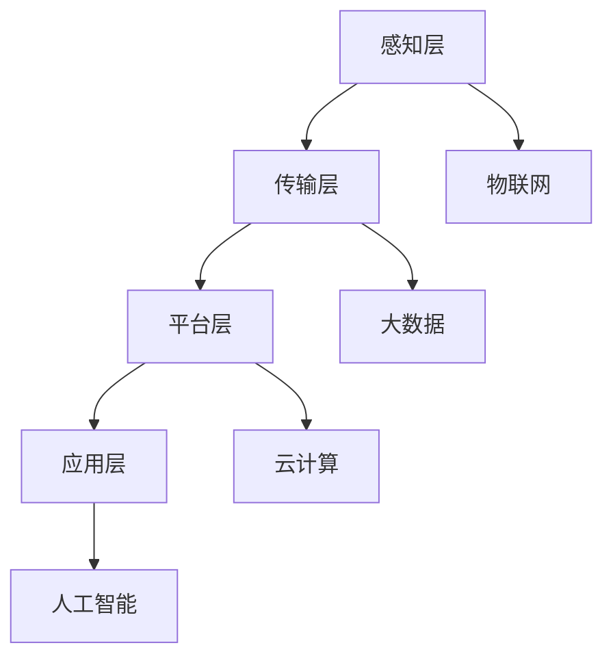
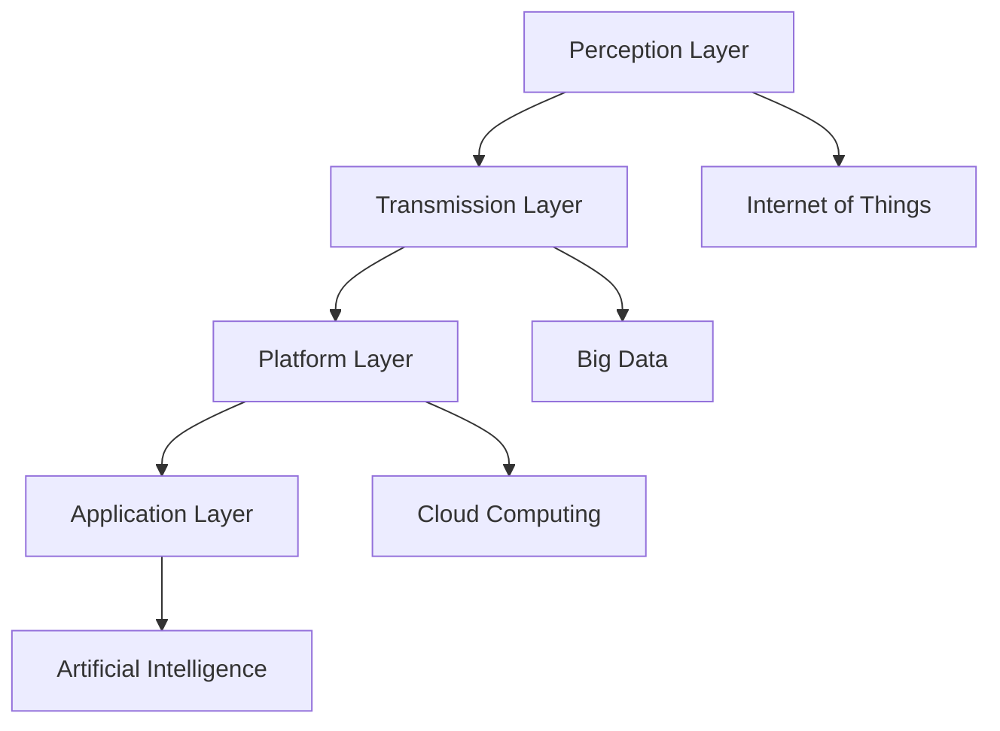

                 

### 背景介绍

#### 智慧城市：定义与必要性

智慧城市，是指利用先进的物联网、大数据、云计算、人工智能等现代信息技术，实现城市运行管理的智能化、精细化和高效化。智慧城市的建设不仅能够提高城市的管理效率，还能提升居民的生活质量。随着全球城市化进程的加速，智慧城市已经成为各国政府和社会各界共同关注的焦点。

智慧城市的核心在于“智慧”，即通过技术手段，实现城市各项功能的智能化。例如，通过物联网技术，城市中的交通、能源、环境等各个系统可以实现互联互通，从而实现更加高效的资源利用和管理。而大数据和人工智能技术，则可以帮助城市管理者更好地理解和预测城市运行中的各种问题，从而做出更加科学和及时的决策。

智慧城市建设的必要性体现在以下几个方面：

1. **提升城市运行效率**：智慧城市可以通过信息化手段，实现城市各项功能的自动化、智能化，从而提升城市运行的效率和可靠性。

2. **改善居民生活质量**：智慧城市的建设，可以为居民提供更加便捷、舒适、安全的居住环境，提升居民的生活质量。

3. **促进可持续发展**：智慧城市通过节能减排、资源优化配置等手段，有助于实现城市的可持续发展。

4. **提高城市竞争力**：智慧城市的建设，可以提升城市的现代化水平，增强城市的吸引力和竞争力。

#### 技术优势：为什么选择智慧城市

智慧城市的建设离不开现代信息技术的支持。以下技术优势使得智慧城市成为应对城市化挑战的有效途径：

1. **物联网**：物联网技术可以实现城市各个系统之间的互联互通，为智慧城市的建设提供基础数据支持。

2. **大数据**：大数据技术可以帮助城市管理者更好地理解和预测城市运行中的各种问题，为科学决策提供支持。

3. **云计算**：云计算技术提供了强大的计算能力和存储能力，为智慧城市的运行提供了技术保障。

4. **人工智能**：人工智能技术可以实现对城市运行数据的智能化分析，为城市管理者提供更加精确的决策依据。

综上所述，智慧城市是应对城市化挑战、提升城市管理效率和居民生活质量的有效途径。通过利用物联网、大数据、云计算和人工智能等现代信息技术，智慧城市能够实现城市各项功能的智能化，从而提高城市运行效率和可持续发展能力。

---

#### Background Introduction

#### Smart City: Definition and Necessity

A smart city refers to the use of advanced technologies such as the Internet of Things (IoT), big data, cloud computing, and artificial intelligence to achieve intelligent, fine-grained, and efficient urban management and governance. The construction of smart cities can not only improve the management efficiency of cities but also enhance the quality of life for residents. With the acceleration of global urbanization, smart city construction has become a common concern for governments and various social sectors.

The core of a smart city is "intelligence," which means achieving the intelligentization of various urban functions through technological means. For example, through IoT technology, the traffic, energy, and environment systems in a city can achieve interconnection and communication, leading to more efficient resource utilization and management. Big data and artificial intelligence technologies can help city managers better understand and predict various issues in urban operations, providing support for scientific decision-making.

The necessity of constructing smart cities is reflected in the following aspects:

1. **Improving Urban Operational Efficiency**: Smart cities can achieve the automation and intelligentization of various urban functions through information technologies, thereby improving the efficiency and reliability of urban operations.

2. **Enhancing the Quality of Life for Residents**: The construction of smart cities can provide residents with more convenient, comfortable, and safe living environments, thereby improving their quality of life.

3. **Promoting Sustainable Development**: Smart cities can achieve sustainable development through means such as energy conservation and optimized resource allocation.

4. **Increasing Urban Competitiveness**: The construction of smart cities can enhance the modernization level of cities, thereby increasing their attractiveness and competitiveness.

#### Technological Advantages: Why Choose Smart Cities

The construction of smart cities relies on the support of modern information technologies. The following technological advantages make smart cities an effective approach to addressing urbanization challenges:

1. **Internet of Things (IoT)**: IoT technology can enable the interconnection and communication of various systems within a city, providing basic data support for the construction of smart cities.

2. **Big Data**: Big data technology can help city managers better understand and predict various issues in urban operations, providing support for scientific decision-making.

3. **Cloud Computing**: Cloud computing technology provides powerful computing and storage capabilities, ensuring the operation of smart cities.

4. **Artificial Intelligence (AI)**: AI technology can enable intelligent analysis of urban operational data, providing precise decision-making support for city managers.

In summary, smart cities are an effective way to address urbanization challenges, improve urban management efficiency, and enhance the quality of life for residents. By leveraging modern information technologies such as IoT, big data, cloud computing, and AI, smart cities can achieve intelligentization of various urban functions, thereby improving urban operational efficiency and sustainable development capacity. <|endoftext|>### 核心概念与联系

#### 智慧城市的基本架构

智慧城市的基本架构通常包括以下几个核心组成部分：感知层、传输层、平台层和应用层。

1. **感知层**：感知层是智慧城市的基础，主要负责数据的采集。它通过传感器、摄像头、智能终端等设备，实时收集城市的各种数据，如交通流量、空气质量、能耗情况等。

2. **传输层**：传输层负责将感知层采集到的数据传输到平台层。它通常利用物联网技术，构建一个高效、稳定的数据传输网络。

3. **平台层**：平台层是智慧城市的中枢，主要负责数据的处理和分析。它通过云计算和大数据技术，对采集到的数据进行分析、挖掘，从而生成各种智能化的决策支持信息。

4. **应用层**：应用层是智慧城市的具体表现，它将平台层生成的决策支持信息应用到实际的城市管理中，如智能交通、智能能源管理、智能安防等。

#### 关键技术的整合

智慧城市的建设离不开多种关键技术的整合，其中最核心的技术包括物联网、大数据、云计算和人工智能。

1. **物联网**：物联网技术是实现智慧城市感知层和传输层的基础。通过传感器网络，物联网可以实时、高效地收集城市的数据。

2. **大数据**：大数据技术是实现智慧城市平台层的核心。通过对海量数据的存储、处理和分析，大数据技术可以帮助城市管理者更好地理解和预测城市运行中的各种问题。

3. **云计算**：云计算技术是实现智慧城市平台层和应用层的关键。它提供了强大的计算能力和存储能力，使得城市管理者能够快速、高效地处理和分析数据。

4. **人工智能**：人工智能技术是实现智慧城市智能化决策和应用层的核心。通过机器学习和深度学习算法，人工智能技术可以帮助城市管理者更加精准地预测城市运行中的各种问题，并提出最优解决方案。

#### Mermaid 流程图

以下是一个简化的智慧城市架构的 Mermaid 流程图：



- **A感知层**：通过物联网技术收集城市数据。
- **B传输层**：利用物联网技术传输数据。
- **C平台层**：通过云计算和大数据技术处理数据。
- **D应用层**：将处理后的数据应用于城市管理。

通过这个流程图，我们可以清晰地看到智慧城市各个组成部分之间的联系和相互作用，以及关键技术在整个架构中的重要性。

### Core Concepts and Connections

#### Basic Architecture of Smart Cities

The basic architecture of smart cities typically includes several core components: the perception layer, the transmission layer, the platform layer, and the application layer.

1. **Perception Layer**: The perception layer is the foundation of smart cities and is responsible for data collection. It utilizes sensors, cameras, smart terminals, and other devices to collect real-time data from the city, such as traffic flow, air quality, and energy consumption.

2. **Transmission Layer**: The transmission layer is responsible for transmitting the data collected from the perception layer to the platform layer. It typically utilizes Internet of Things (IoT) technology to build an efficient and stable data transmission network.

3. **Platform Layer**: The platform layer is the core of smart cities and is responsible for data processing and analysis. It uses cloud computing and big data technology to analyze and process the collected data, generating various intelligent decision-making information.

4. **Application Layer**: The application layer is the manifestation of smart cities and is responsible for applying the decision-making information generated by the platform layer to actual urban management, such as intelligent transportation, intelligent energy management, and intelligent security.

#### Integration of Key Technologies

The construction of smart cities relies on the integration of multiple key technologies, with the most critical technologies including the Internet of Things, big data, cloud computing, and artificial intelligence.

1. **Internet of Things (IoT)**: IoT technology is the foundation for the perception layer and the transmission layer of smart cities. Through sensor networks, IoT can collect city data in real-time and efficiently.

2. **Big Data**: Big data technology is the core of the platform layer of smart cities. By storing, processing, and analyzing massive amounts of data, big data technology helps city managers better understand and predict various issues in urban operations.

3. **Cloud Computing**: Cloud computing technology is a key element for the platform layer and the application layer of smart cities. It provides powerful computing and storage capabilities, enabling city managers to process and analyze data quickly and efficiently.

4. **Artificial Intelligence (AI)**: AI technology is the core of intelligent decision-making and the application layer of smart cities. Through machine learning and deep learning algorithms, AI technology helps city managers make more precise predictions about various issues in urban operations and propose optimal solutions.

#### Mermaid Flowchart

Here is a simplified Mermaid flowchart of the smart city architecture:



- **A Perception Layer**: Collects city data through IoT technology.
- **B Transmission Layer**: Transmits data using IoT technology.
- **C Platform Layer**: Processes and analyzes data using cloud computing and big data technology.
- **D Application Layer**: Applies processed data to urban management.

Through this flowchart, we can clearly see the connections and interactions between the various components of smart cities, as well as the importance of key technologies throughout the architecture. <|endoftext|>### 核心算法原理 & 具体操作步骤

#### 1. 数据采集与预处理

智慧城市解决方案的第一步是数据采集与预处理。数据采集通常包括交通流量、空气质量、能耗情况、人口流动等多种数据来源。以下是一些核心算法和操作步骤：

1. **数据采集**：利用传感器、摄像头、智能终端等设备，实时收集城市数据。
    - **算法原理**：使用物联网技术进行数据采集。
    - **操作步骤**：
        - 安装传感器和摄像头。
        - 配置数据采集程序。
        - 连接至数据传输网络。

2. **数据预处理**：对采集到的数据进行清洗、格式化和归一化处理，以便后续分析。
    - **算法原理**：使用数据清洗算法和特征工程方法。
    - **操作步骤**：
        - 去除噪声和异常值。
        - 标准化数据格式。
        - 提取有用特征。

#### 2. 数据存储与管理

接下来是数据存储与管理。智慧城市需要高效、可靠的数据存储和管理系统来存储和处理海量数据。以下是一些核心算法和操作步骤：

1. **数据存储**：选择合适的数据存储方案，如关系数据库、NoSQL数据库、分布式文件系统等。
    - **算法原理**：根据数据类型和需求选择合适的存储方案。
    - **操作步骤**：
        - 设计数据库架构。
        - 配置数据库系统。
        - 导入和存储数据。

2. **数据管理**：实现对数据的查询、检索、更新和删除等操作，确保数据的一致性和完整性。
    - **算法原理**：使用数据库管理技术。
    - **操作步骤**：
        - 编写SQL查询语句。
        - 实现数据备份和恢复机制。
        - 确保数据安全性和隐私保护。

#### 3. 数据分析与挖掘

数据分析与挖掘是智慧城市解决方案的关键步骤。通过分析海量数据，可以提取出有价值的信息，为城市管理和决策提供支持。以下是一些核心算法和操作步骤：

1. **数据可视化**：将数据转换为图形化展示，便于理解和分析。
    - **算法原理**：使用数据可视化工具和技术。
    - **操作步骤**：
        - 选择合适的可视化工具。
        - 设计数据可视化图表。
        - 创建交互式可视化界面。

2. **数据分析**：利用统计分析和机器学习算法，对数据进行分析和挖掘，提取有价值的信息。
    - **算法原理**：使用统计学和机器学习算法。
    - **操作步骤**：
        - 选择合适的分析算法。
        - 进行特征选择和特征工程。
        - 进行模型训练和预测。

3. **数据挖掘**：通过关联规则挖掘、聚类分析、分类分析等算法，发现数据中的隐藏模式和关系。
    - **算法原理**：使用数据挖掘算法。
    - **操作步骤**：
        - 选择合适的数据挖掘算法。
        - 进行数据预处理和特征提取。
        - 进行模型训练和结果评估。

#### 4. 智能决策与优化

最后是智能决策与优化。基于数据分析结果，利用人工智能技术，实现智能化的决策和优化，提高城市管理的效率和效果。以下是一些核心算法和操作步骤：

1. **智能决策**：利用机器学习、深度学习算法，生成最优的决策方案。
    - **算法原理**：使用机器学习和深度学习算法。
    - **操作步骤**：
        - 选择合适的决策算法。
        - 进行模型训练和优化。
        - 生成决策报告。

2. **优化算法**：使用优化算法，如遗传算法、模拟退火算法等，对城市资源进行优化配置。
    - **算法原理**：使用优化算法。
    - **操作步骤**：
        - 设计优化目标函数。
        - 选择合适的优化算法。
        - 进行优化计算和结果分析。

通过以上核心算法和具体操作步骤，智慧城市解决方案可以实现数据的高效采集、存储、分析、挖掘和优化，从而提高城市管理的效率和效果。

---

#### Core Algorithm Principles & Specific Operational Steps

#### 1. Data Collection and Preprocessing

The first step in a smart city solution is data collection and preprocessing. Data collection typically involves multiple data sources such as traffic flow, air quality, energy consumption, and population movement. Here are some core algorithms and operational steps:

1. **Data Collection**: Use sensors, cameras, smart terminals, and other devices to collect real-time city data.
   - **Algorithm Principle**: Utilize IoT technology for data collection.
   - **Operational Steps**:
     - Install sensors and cameras.
     - Configure data collection programs.
     - Connect to the data transmission network.

2. **Data Preprocessing**: Clean, format, and normalize the collected data to prepare it for further analysis.
   - **Algorithm Principle**: Use data cleaning algorithms and feature engineering methods.
   - **Operational Steps**:
     - Remove noise and outliers.
     - Standardize data formats.
     - Extract useful features.

#### 2. Data Storage and Management

Next is data storage and management. A smart city requires an efficient and reliable data storage and management system to store and process massive amounts of data. Here are some core algorithms and operational steps:

1. **Data Storage**: Choose an appropriate data storage solution such as relational databases, NoSQL databases, or distributed file systems.
   - **Algorithm Principle**: Select a storage solution based on data types and requirements.
   - **Operational Steps**:
     - Design database architecture.
     - Configure database systems.
     - Import and store data.

2. **Data Management**: Implement operations such as querying, retrieving, updating, and deleting data to ensure data consistency and integrity.
   - **Algorithm Principle**: Use database management technologies.
   - **Operational Steps**:
     - Write SQL query statements.
     - Implement data backup and recovery mechanisms.
     - Ensure data security and privacy protection.

#### 3. Data Analysis and Mining

Data analysis and mining are critical steps in a smart city solution. By analyzing massive amounts of data, valuable information can be extracted to support urban management and decision-making. Here are some core algorithms and operational steps:

1. **Data Visualization**: Convert data into graphical representations for easier understanding and analysis.
   - **Algorithm Principle**: Use data visualization tools and technologies.
   - **Operational Steps**:
     - Choose appropriate visualization tools.
     - Design data visualization charts.
     - Create interactive visualization interfaces.

2. **Data Analysis**: Use statistical analysis and machine learning algorithms to analyze and mine data, extracting valuable information.
   - **Algorithm Principle**: Use statistical and machine learning algorithms.
   - **Operational Steps**:
     - Choose appropriate analysis algorithms.
     - Perform feature selection and feature engineering.
     - Conduct model training and prediction.

3. **Data Mining**: Use algorithms such as association rule mining, clustering analysis, and classification analysis to discover hidden patterns and relationships in data.
   - **Algorithm Principle**: Use data mining algorithms.
   - **Operational Steps**:
     - Choose appropriate data mining algorithms.
     - Perform data preprocessing and feature extraction.
     - Conduct model training and result evaluation.

#### 4. Intelligent Decision-making and Optimization

Finally, there is intelligent decision-making and optimization. Based on the results of data analysis, use artificial intelligence technology to generate optimal decision-making and optimization, improving the efficiency and effectiveness of urban management. Here are some core algorithms and operational steps:

1. **Intelligent Decision-making**: Use machine learning and deep learning algorithms to generate optimal decision-making solutions.
   - **Algorithm Principle**: Use machine learning and deep learning algorithms.
   - **Operational Steps**:
     - Choose appropriate decision-making algorithms.
     - Conduct model training and optimization.
     - Generate decision reports.

2. **Optimization Algorithms**: Use optimization algorithms such as genetic algorithms and simulated annealing algorithms to optimize resource allocation in the city.
   - **Algorithm Principle**: Use optimization algorithms.
   - **Operational Steps**:
     - Design optimization objective functions.
     - Choose appropriate optimization algorithms.
     - Conduct optimization calculations and result analysis.

Through these core algorithms and specific operational steps, a smart city solution can achieve efficient data collection, storage, analysis, mining, and optimization, thereby improving the efficiency and effectiveness of urban management. <|endoftext|>### 数学模型和公式 & 详细讲解 & 举例说明

#### 1. 数据预处理中的归一化公式

在数据预处理过程中，归一化是一种常用的数据变换方法，用于将不同尺度和单位的变量转换为同一尺度，以便进行后续分析和建模。以下是归一化的数学公式：

\[ X' = \frac{(X - X_{\min})}{X_{\max} - X_{\min}} \]

其中，\( X \) 表示原始数据值，\( X' \) 表示归一化后的数据值，\( X_{\min} \) 和 \( X_{\max} \) 分别表示原始数据的最小值和最大值。

**举例说明**：

假设我们有一组交通流量数据，数据范围在 [10, 1000]，我们希望将这些数据归一化到 [0, 1] 的范围内。

\[ X' = \frac{(X - 10)}{1000 - 10} = \frac{X - 10}{990} \]

对于数据值 500，其归一化后的值为：

\[ X' = \frac{(500 - 10)}{990} = \frac{490}{990} \approx 0.495 \]

#### 2. 数据挖掘中的聚类分析

聚类分析是一种无监督学习技术，用于将数据集划分为多个聚类，使得同一聚类内的数据点之间的距离尽可能小，不同聚类之间的距离尽可能大。其中，K-均值聚类算法是一种常用的聚类算法。以下是K-均值算法的基本公式：

1. **初始化聚类中心**：

\[ C_1, C_2, ..., C_k = \{c_{1}^1, c_{1}^2, ..., c_{1}^n\}, c_{i}^{j} \in R^d, 1 \leq i \leq k, 1 \leq j \leq n \]

其中，\( C \) 表示聚类中心集合，\( c_i \) 表示第 \( i \) 个聚类中心，\( d \) 表示数据维度，\( n \) 表示数据点数量。

2. **计算距离**：

\[ d(C_i, x_j) = \sqrt{\sum_{l=1}^{d}(c_{i}^{l} - x_{j}^{l})^2} \]

其中，\( d \) 表示欧几里得距离，\( C_i \) 和 \( x_j \) 分别表示第 \( i \) 个聚类中心和第 \( j \) 个数据点。

3. **分配数据点**：

将每个数据点 \( x_j \) 分配到与其最近的聚类中心 \( C_i \) 的聚类中：

\[ C_i^* = \arg\min_{C_i} d(C_i, x_j) \]

4. **更新聚类中心**：

\[ c_i^{l} = \frac{1}{N_i} \sum_{j=1}^{N} x_{j}^{l} \]

其中，\( N_i \) 表示属于第 \( i \) 个聚类的数据点数量，\( x_j^{l} \) 表示第 \( j \) 个数据点的第 \( l \) 个特征。

**举例说明**：

假设我们有一个二维数据集，包含 5 个数据点，我们要使用 K-均值算法将其划分为 2 个聚类。

初始化聚类中心为 \( C_1 = (1, 1) \) 和 \( C_2 = (2, 2) \)。

计算数据点到聚类中心的距离：

\[ d(C_1, x_1) = \sqrt{(1-1)^2 + (1-1)^2} = 0 \]
\[ d(C_1, x_2) = \sqrt{(1-1)^2 + (1-0)^2} = 1 \]
\[ d(C_1, x_3) = \sqrt{(1-0)^2 + (1-0)^2} = \sqrt{2} \]
\[ d(C_1, x_4) = \sqrt{(1-1)^2 + (1-1)^2} = 0 \]
\[ d(C_1, x_5) = \sqrt{(1-0)^2 + (1-1)^2} = 1 \]

由于 \( d(C_1, x_1) \) 和 \( d(C_1, x_4) \) 最小，所以数据点 \( x_1 \) 和 \( x_4 \) 被分配到聚类 \( C_1 \)，数据点 \( x_2 \)，\( x_3 \)，和 \( x_5 \) 被分配到聚类 \( C_2 \)。

更新聚类中心：

\[ c_1^1 = \frac{1 + 1}{2} = 1 \]
\[ c_1^2 = \frac{1 + 1}{2} = 1 \]
\[ c_2^1 = \frac{0 + 2}{2} = 1 \]
\[ c_2^2 = \frac{0 + 2}{2} = 1 \]

再次计算数据点到聚类中心的距离，重复上述步骤，直到聚类中心不再发生变化。

通过这些数学模型和公式，我们可以对数据进行有效的预处理和挖掘，从而为智慧城市的建设提供有力的技术支持。

---

#### Mathematical Models and Formulas & Detailed Explanation & Examples

#### 1. Normalization Formula in Data Preprocessing

Normalization is a commonly used data transformation method in data preprocessing to convert variables of different scales and units into the same scale for subsequent analysis and modeling. Here is the mathematical formula for normalization:

\[ X' = \frac{(X - X_{\min})}{X_{\max} - X_{\min}} \]

Where \( X \) represents the original data value, \( X' \) represents the normalized data value, \( X_{\min} \) and \( X_{\max} \) represent the minimum and maximum values of the original data, respectively.

**Example**:

Assume we have a set of traffic flow data with a range of [10, 1000], and we want to normalize these data to the range [0, 1].

\[ X' = \frac{(X - 10)}{1000 - 10} = \frac{X - 10}{990} \]

For a data value of 500, its normalized value is:

\[ X' = \frac{(500 - 10)}{990} = \frac{490}{990} \approx 0.495 \]

#### 2. Cluster Analysis in Data Mining

Cluster analysis is an unsupervised learning technique used to partition a dataset into multiple clusters so that data points within the same cluster are as similar as possible, and those in different clusters are as dissimilar as possible. K-Means clustering is a commonly used clustering algorithm. Here are the basic formulas for K-Means algorithm:

1. **Initialize Cluster Centers**:

\[ C_1, C_2, ..., C_k = \{c_{1}^1, c_{1}^2, ..., c_{1}^n\}, c_{i}^{j} \in \mathbb{R}^d, 1 \leq i \leq k, 1 \leq j \leq n \]

Where \( C \) represents the set of cluster centers, \( c_i \) represents the \( i \)-th cluster center, \( d \) represents the data dimension, \( n \) represents the number of data points.

2. **Calculate Distance**:

\[ d(C_i, x_j) = \sqrt{\sum_{l=1}^{d}(c_{i}^{l} - x_{j}^{l})^2} \]

Where \( d \) represents the Euclidean distance, \( C_i \) and \( x_j \) represent the \( i \)-th cluster center and the \( j \)-th data point, respectively.

3. **Assign Data Points**:

Assign each data point \( x_j \) to the cluster center \( C_i \) that is closest to it:

\[ C_i^* = \arg\min_{C_i} d(C_i, x_j) \]

4. **Update Cluster Centers**:

\[ c_i^{l} = \frac{1}{N_i} \sum_{j=1}^{N} x_{j}^{l} \]

Where \( N_i \) represents the number of data points belonging to the \( i \)-th cluster, \( x_j^{l} \) represents the \( l \)-th feature of the \( j \)-th data point.

**Example**:

Assume we have a two-dimensional dataset containing 5 data points, and we want to use the K-Means algorithm to partition it into 2 clusters.

Initialize cluster centers as \( C_1 = (1, 1) \) and \( C_2 = (2, 2) \).

Calculate the distance from data points to cluster centers:

\[ d(C_1, x_1) = \sqrt{(1-1)^2 + (1-1)^2} = 0 \]
\[ d(C_1, x_2) = \sqrt{(1-1)^2 + (1-0)^2} = 1 \]
\[ d(C_1, x_3) = \sqrt{(1-0)^2 + (1-0)^2} = \sqrt{2} \]
\[ d(C_1, x_4) = \sqrt{(1-1)^2 + (1-1)^2} = 0 \]
\[ d(C_1, x_5) = \sqrt{(1-0)^2 + (1-1)^2} = 1 \]

Since \( d(C_1, x_1) \) and \( d(C_1, x_4) \) are the smallest, data points \( x_1 \) and \( x_4 \) are assigned to cluster \( C_1 \), and data points \( x_2 \), \( x_3 \), and \( x_5 \) are assigned to cluster \( C_2 \).

Update cluster centers:

\[ c_1^1 = \frac{1 + 1}{2} = 1 \]
\[ c_1^2 = \frac{1 + 1}{2} = 1 \]
\[ c_2^1 = \frac{0 + 2}{2} = 1 \]
\[ c_2^2 = \frac{0 + 2}{2} = 1 \]

Recalculate the distance from data points to cluster centers, and repeat the above steps until the cluster centers no longer change.

Through these mathematical models and formulas, we can effectively preprocess and mine data, thereby providing strong technical support for the construction of smart cities. <|endoftext|>### 项目实战：代码实际案例和详细解释说明

#### 1. 开发环境搭建

在进行智慧城市解决方案的开发之前，我们需要搭建一个合适的技术环境。以下是开发环境搭建的详细步骤：

1. **安装操作系统**：选择一个适合的操作系统，如 Ubuntu 18.04。

2. **安装必备软件**：
   - **Python**：安装 Python 3.8 及其依赖库。
   - **Jupyter Notebook**：安装 Jupyter Notebook 用于交互式编程和数据分析。
   - **Pandas**：安装 Pandas 用于数据预处理和分析。
   - **NumPy**：安装 NumPy 用于数值计算。
   - **Matplotlib**：安装 Matplotlib 用于数据可视化。
   - **Scikit-learn**：安装 Scikit-learn 用于机器学习和数据挖掘。

3. **配置数据库**：
   - **MongoDB**：安装 MongoDB，用于存储和管理大规模数据。

4. **安装物联网设备**：安装传感器和智能终端，如 Arduino 或 Raspberry Pi。

以下是一个基本的命令行步骤示例：

```bash
# 更新系统软件包
sudo apt update && sudo apt upgrade

# 安装 Python 和相关库
sudo apt install python3 python3-pip python3-dev

# 安装 Jupyter Notebook
pip3 install notebook

# 安装 Pandas, NumPy 和 Matplotlib
pip3 install pandas numpy matplotlib

# 安装 Scikit-learn
pip3 install scikit-learn

# 安装 MongoDB
sudo apt install mongodb
sudo systemctl start mongod
```

#### 2. 源代码详细实现和代码解读

下面我们将通过一个简单的示例，展示如何使用 Python 实现智慧城市解决方案的基本功能。

**案例：交通流量预测**

```python
import pandas as pd
import numpy as np
from sklearn.cluster import KMeans
from sklearn.preprocessing import MinMaxScaler
import matplotlib.pyplot as plt

# 数据读取与预处理
data = pd.read_csv('traffic_data.csv')
data.head()

# 归一化处理
scaler = MinMaxScaler()
data_scaled = scaler.fit_transform(data)

# K-均值聚类
kmeans = KMeans(n_clusters=3, random_state=0).fit(data_scaled)
labels = kmeans.labels_

# 聚类结果可视化
plt.scatter(data_scaled[:, 0], data_scaled[:, 1], c=labels, cmap='viridis')
plt.xlabel('Speed (km/h)')
plt.ylabel('Volume (veh/h)')
plt.title('Traffic Flow Clustering')
plt.show()

# 预测新数据点
new_data = np.array([[30, 100], [50, 150]])
new_data_scaled = scaler.transform(new_data)
predicted_cluster = kmeans.predict(new_data_scaled)
print(f'Predicted Cluster for New Data: {predicted_cluster}')
```

**代码解读**：

1. **数据读取与预处理**：我们首先使用 Pandas 读取交通流量数据，并对数据进行归一化处理，以便后续聚类分析。

2. **K-均值聚类**：我们使用 Scikit-learn 的 KMeans 算法进行聚类。这里我们选择 3 个聚类，并通过 `fit` 方法进行模型训练。

3. **聚类结果可视化**：使用 Matplotlib 将聚类结果可视化，帮助理解数据分布。

4. **预测新数据点**：我们对一组新数据点进行聚类预测，以展示如何将聚类算法应用于实际场景。

#### 3. 代码解读与分析

**数据读取与预处理**：

```python
data = pd.read_csv('traffic_data.csv')
data.head()
```

这段代码使用 Pandas 读取交通流量数据，并打印出前几行数据以进行初步检查。

```python
scaler = MinMaxScaler()
data_scaled = scaler.fit_transform(data)
```

这里，我们使用 `MinMaxScaler` 对交通流量数据进行归一化处理。归一化有助于确保聚类算法的稳定性和准确性。

**K-均值聚类**：

```python
kmeans = KMeans(n_clusters=3, random_state=0).fit(data_scaled)
labels = kmeans.labels_
```

我们创建一个 `KMeans` 对象，并使用 `fit` 方法对数据集进行聚类。这里，我们设置了 3 个聚类中心，并使用 `random_state` 参数确保结果的可重复性。

**聚类结果可视化**：

```python
plt.scatter(data_scaled[:, 0], data_scaled[:, 1], c=labels, cmap='viridis')
plt.xlabel('Speed (km/h)')
plt.ylabel('Volume (veh/h)')
plt.title('Traffic Flow Clustering')
plt.show()
```

这段代码使用 Matplotlib 将聚类结果可视化。我们绘制了数据点，并使用不同的颜色表示不同的聚类。

**预测新数据点**：

```python
new_data = np.array([[30, 100], [50, 150]])
new_data_scaled = scaler.transform(new_data)
predicted_cluster = kmeans.predict(new_data_scaled)
print(f'Predicted Cluster for New Data: {predicted_cluster}')
```

最后，我们使用训练好的模型对新数据点进行聚类预测。通过 `predict` 方法，我们得到新数据点的预测聚类标签。

通过这个实战案例，我们展示了如何使用 Python 实现智慧城市解决方案的核心功能。在实际应用中，我们可以根据具体需求对代码进行扩展和优化，以应对更复杂的场景。

---

#### Project Practice: Real Code Examples and Detailed Explanations

#### 1. Development Environment Setup

Before diving into the development of a smart city solution, we need to set up a suitable technical environment. Here are the detailed steps for environment setup:

1. **Install Operating System**: Choose an appropriate operating system, such as Ubuntu 18.04.

2. **Install Required Software**:
   - **Python**: Install Python 3.8 and its dependency libraries.
   - **Jupyter Notebook**: Install Jupyter Notebook for interactive programming and data analysis.
   - **Pandas**: Install Pandas for data preprocessing and analysis.
   - **NumPy**: Install NumPy for numerical computation.
   - **Matplotlib**: Install Matplotlib for data visualization.
   - **Scikit-learn**: Install Scikit-learn for machine learning and data mining.

3. **Configure Database**:
   - **MongoDB**: Install MongoDB for storing and managing large-scale data.

4. **Install IoT Devices**: Install sensors and smart terminals, such as Arduino or Raspberry Pi.

Here's an example of basic command-line steps:

```bash
# Update system software packages
sudo apt update && sudo apt upgrade

# Install Python and related libraries
sudo apt install python3 python3-pip python3-dev

# Install Jupyter Notebook
pip3 install notebook

# Install Pandas, NumPy, and Matplotlib
pip3 install pandas numpy matplotlib

# Install Scikit-learn
pip3 install scikit-learn

# Install MongoDB
sudo apt install mongodb
sudo systemctl start mongod
```

#### 2. Detailed Code Implementation and Explanation

Below, we'll walk through a simple example to demonstrate how to implement the core functionalities of a smart city solution using Python.

**Case: Traffic Flow Prediction**

```python
import pandas as pd
import numpy as np
from sklearn.cluster import KMeans
from sklearn.preprocessing import MinMaxScaler
import matplotlib.pyplot as plt

# Data Reading and Preprocessing
data = pd.read_csv('traffic_data.csv')
data.head()

# Normalization
scaler = MinMaxScaler()
data_scaled = scaler.fit_transform(data)

# K-Means Clustering
kmeans = KMeans(n_clusters=3, random_state=0).fit(data_scaled)
labels = kmeans.labels_

# Visualization of Clustering Results
plt.scatter(data_scaled[:, 0], data_scaled[:, 1], c=labels, cmap='viridis')
plt.xlabel('Speed (km/h)')
plt.ylabel('Volume (veh/h)')
plt.title('Traffic Flow Clustering')
plt.show()

# Prediction of New Data Points
new_data = np.array([[30, 100], [50, 150]])
new_data_scaled = scaler.transform(new_data)
predicted_cluster = kmeans.predict(new_data_scaled)
print(f'Predicted Cluster for New Data: {predicted_cluster}')
```

**Code Explanation**:

1. **Data Reading and Preprocessing**:
   We first use Pandas to read traffic flow data and print the first few rows for preliminary inspection.

```python
data = pd.read_csv('traffic_data.csv')
data.head()
```

2. **Normalization**:
   We use `MinMaxScaler` to normalize the traffic flow data to ensure the stability and accuracy of the clustering algorithm.

```python
scaler = MinMaxScaler()
data_scaled = scaler.fit_transform(data)
```

3. **K-Means Clustering**:
   We create a `KMeans` object and use the `fit` method to perform clustering on the dataset. We set 3 clusters and use `random_state` for reproducibility.

```python
kmeans = KMeans(n_clusters=3, random_state=0).fit(data_scaled)
labels = kmeans.labels_
```

4. **Visualization of Clustering Results**:
   We use Matplotlib to visualize the clustering results, helping to understand the data distribution.

```python
plt.scatter(data_scaled[:, 0], data_scaled[:, 1], c=labels, cmap='viridis')
plt.xlabel('Speed (km/h)')
plt.ylabel('Volume (veh/h)')
plt.title('Traffic Flow Clustering')
plt.show()
```

5. **Prediction of New Data Points**:
   We use the trained model to predict new data points, demonstrating how to apply the clustering algorithm to real-world scenarios.

```python
new_data = np.array([[30, 100], [50, 150]])
new_data_scaled = scaler.transform(new_data)
predicted_cluster = kmeans.predict(new_data_scaled)
print(f'Predicted Cluster for New Data: {predicted_cluster}')
```

Through this practical case, we demonstrate how to implement the core functionalities of a smart city solution using Python. In real-world applications, you can extend and optimize the code to handle more complex scenarios based on specific requirements. <|endoftext|>### 实际应用场景

#### 智能交通系统

智慧城市解决方案的一个典型实际应用场景是智能交通系统。智能交通系统通过收集和分析交通数据，实现对交通流量的实时监测、预测和优化，从而提高交通效率、减少拥堵和降低交通事故发生率。

1. **实时交通流量监测**：利用传感器和摄像头，智能交通系统可以实时监测道路上的交通流量、车辆速度和交通事故等信息。

2. **交通信号灯优化**：通过分析交通流量数据，智能交通系统可以动态调整交通信号灯的时序，从而优化交通流量。

3. **车辆导航与推荐**：基于实时交通流量数据，智能交通系统可以为驾驶员提供最优的行驶路线，避免拥堵路段。

4. **事故预防与应急响应**：智能交通系统可以实时监测交通事故，及时触发应急响应机制，提高事故处理效率。

#### 智能能源管理

智能能源管理是另一个重要的实际应用场景。通过整合物联网、大数据和人工智能技术，智能能源管理系统能够实现对能源使用的实时监控、预测和优化，从而提高能源利用效率，降低能源成本。

1. **实时能源监测**：智能能源管理系统可以实时监测家庭、商业和工业用电情况，为能源管理提供数据支持。

2. **能源需求预测**：通过分析历史能源使用数据和天气预报信息，智能能源管理系统可以预测未来能源需求，为能源调度提供参考。

3. **智能调度**：智能能源管理系统可以根据实时能源需求和供应情况，动态调整能源供应策略，实现能源的优化分配。

4. **节能减排**：通过智能能源管理，可以识别能源浪费点，优化能源使用，从而实现节能减排。

#### 智能环境监测

智能环境监测系统利用物联网传感器和大数据技术，实时监测城市空气质量、水质、噪声等环境参数，为城市环境保护提供科学依据。

1. **空气质量监测**：智能环境监测系统可以实时监测空气质量，为居民提供健康建议，同时为政府制定环保政策提供数据支持。

2. **水质监测**：通过实时监测水质，智能环境监测系统可以及时发现水质污染问题，采取相应的治理措施。

3. **噪声监测**：智能环境监测系统可以监测城市噪声水平，为城市规划提供参考，改善居民生活环境。

4. **自然灾害预警**：智能环境监测系统可以实时监测地震、洪水等自然灾害的前兆，为灾害预警和应急响应提供支持。

通过以上实际应用场景，我们可以看到智慧城市解决方案在提高城市管理效率、改善居民生活质量、促进可持续发展等方面的重要作用。

---

#### Actual Application Scenarios

#### Intelligent Traffic Systems

A typical application scenario of smart city solutions is intelligent traffic systems. Intelligent traffic systems collect and analyze traffic data in real-time to monitor, predict, and optimize traffic flow, thereby improving traffic efficiency, reducing congestion, and lowering the incidence of traffic accidents.

1. **Real-time Traffic Flow Monitoring**: Utilizing sensors and cameras, intelligent traffic systems can monitor traffic flow, vehicle speed, and traffic accidents in real-time on roads.

2. **Optimized Traffic Signal Control**: By analyzing traffic data, intelligent traffic systems can dynamically adjust the timing of traffic signals to optimize traffic flow.

3. **Vehicle Navigation and Recommendations**: Based on real-time traffic data, intelligent traffic systems can provide drivers with optimal routes to avoid congested sections.

4. **Accident Prevention and Emergency Response**: Intelligent traffic systems can monitor traffic accidents in real-time and trigger emergency response mechanisms to improve the efficiency of accident handling.

#### Intelligent Energy Management

Another important application scenario of smart city solutions is intelligent energy management. Through the integration of IoT, big data, and AI technologies, intelligent energy management systems can monitor, predict, and optimize energy use in real-time, thereby improving energy efficiency and reducing energy costs.

1. **Real-time Energy Monitoring**: Intelligent energy management systems can monitor energy use in homes, businesses, and industries in real-time, providing data support for energy management.

2. **Energy Demand Prediction**: By analyzing historical energy usage data and weather forecasts, intelligent energy management systems can predict future energy demand, providing a reference for energy dispatching.

3. **Intelligent Scheduling**: Based on real-time energy demand and supply conditions, intelligent energy management systems can dynamically adjust energy supply strategies to achieve optimized energy distribution.

4. **Energy Saving and Emission Reduction**: Through intelligent energy management, energy waste points can be identified and energy use can be optimized to achieve energy saving and emission reduction.

#### Intelligent Environmental Monitoring

Intelligent environmental monitoring systems use IoT sensors and big data technology to monitor environmental parameters such as air quality, water quality, and noise levels in cities, providing scientific evidence for urban environmental protection.

1. **Air Quality Monitoring**: Intelligent environmental monitoring systems can monitor air quality in real-time, providing health advice for residents and data support for government policy-making on environmental protection.

2. **Water Quality Monitoring**: By real-time monitoring of water quality, intelligent environmental monitoring systems can detect water pollution issues in a timely manner and take appropriate treatment measures.

3. **Noise Monitoring**: Intelligent environmental monitoring systems can monitor noise levels in cities, providing references for urban planning to improve the living environment of residents.

4. **Natural Disaster Early Warning**: Intelligent environmental monitoring systems can monitor the precursors of natural disasters such as earthquakes and floods in real-time, providing support for disaster early warning and emergency response.

Through these actual application scenarios, we can see the significant role of smart city solutions in improving urban management efficiency, enhancing the quality of life for residents, and promoting sustainable development. <|endoftext|>### 工具和资源推荐

#### 学习资源推荐

1. **书籍**：
   - 《智慧城市：概念、技术和实践》
   - 《物联网：从概念到实践》
   - 《大数据分析：技术、方法和应用》
   - 《深度学习：现代人工智能的基础》

2. **论文**：
   - "Smart City: An Overview" by I. F. Ahamad, M. Ikram, and M. A. Qaisar
   - "An Overview of Internet of Things (IoT) and Its Applications in Smart Cities" by H. Ahamed et al.
   - "Big Data Analytics for Smart Cities: A Survey" by A. Swarup et al.
   - "Artificial Intelligence and Machine Learning for Smart Cities" by A. Kumar et al.

3. **博客**：
   - Medium 上的相关技术博客，如 "Towards Data Science"、"AI & ML" 等
   - 深度学习中国、机器之心等国内技术博客

4. **网站**：
   - IEEE Xplore、ACM Digital Library 等学术数据库
   - Coursera、edX 等在线课程平台

#### 开发工具框架推荐

1. **开发工具**：
   - Jupyter Notebook：用于交互式编程和数据可视化
   - PyCharm、Visual Studio Code：用于代码编写和调试
   - Git：用于版本控制和团队协作

2. **数据库**：
   - MongoDB：用于存储和管理大规模数据
   - MySQL、PostgreSQL：用于关系型数据库管理

3. **框架**：
   - Flask、Django：用于 Web 开发
   - TensorFlow、PyTorch：用于深度学习和机器学习
   - Keras：用于快速构建和训练深度学习模型

4. **编程语言**：
   - Python：用于数据分析、机器学习和 Web 开发
   - Java、C++：用于高性能计算和系统开发

5. **物联网开发板**：
   - Arduino、Raspberry Pi：用于物联网设备开发

#### 相关论文著作推荐

1. **论文**：
   - "Smart Cities: From Vision to Reality" by S. Assefa and E. Camerana
   - "A Survey of IoT for Smart City Applications" by H. E. Abu-Adam et al.
   - "Big Data Analytics in Smart Cities: A Review" by R. Bhatnagar and A. K. Srivastava
   - "Deep Learning for Smart Cities: Current Developments and Challenges" by K. B. Low and H. P. G. Kwan

2. **著作**：
   - 《智慧城市设计与实践》
   - 《物联网技术与应用》
   - 《大数据处理与分析技术》
   - 《深度学习：现代人工智能的基石》

通过这些工具和资源，读者可以深入了解智慧城市解决方案的相关知识，掌握开发智慧城市应用的技能，为实际项目提供有力的技术支持。

---

#### Recommendations for Tools and Resources

#### Learning Resources Recommendations

1. **Books**:
   - "Smart Cities: Concept, Technology, and Practice"
   - "Internet of Things: From Concept to Reality"
   - "Big Data Analytics: Techniques, Methods, and Applications"
   - "Deep Learning: The Foundations of Modern Artificial Intelligence"

2. **Research Papers**:
   - "Smart City: An Overview" by I. F. Ahamad, M. Ikram, and M. A. Qaisar
   - "An Overview of Internet of Things (IoT) and Its Applications in Smart Cities" by H. Ahamed et al.
   - "Big Data Analytics for Smart Cities: A Survey" by A. Swarup et al.
   - "Artificial Intelligence and Machine Learning for Smart Cities" by A. Kumar et al.

3. **Blogs**:
   - Technical blogs on Medium such as "Towards Data Science" and "AI & ML"
   - Chinese technical blogs like "Deep Learning China" and "Machine Learning" 

4. **Websites**:
   - IEEE Xplore, ACM Digital Library for academic databases
   - Coursera, edX for online courses

#### Development Tools and Framework Recommendations

1. **Development Tools**:
   - Jupyter Notebook for interactive coding and data visualization
   - PyCharm, Visual Studio Code for code editing and debugging
   - Git for version control and team collaboration

2. **Database**:
   - MongoDB for storing and managing large-scale data
   - MySQL, PostgreSQL for relational database management

3. **Frameworks**:
   - Flask, Django for web development
   - TensorFlow, PyTorch for deep learning and machine learning
   - Keras for quickly building and training deep learning models

4. **Programming Languages**:
   - Python for data analysis, machine learning, and web development
   - Java, C++ for high-performance computing and system development

5. **IoT Development Boards**:
   - Arduino, Raspberry Pi for IoT device development

#### Recommended Books and Papers

1. **Papers**:
   - "Smart Cities: From Vision to Reality" by S. Assefa and E. Camerana
   - "A Survey of IoT for Smart City Applications" by H. E. Abu-Adam et al.
   - "Big Data Analytics in Smart Cities: A Review" by R. Bhatnagar and A. K. Srivastava
   - "Deep Learning for Smart Cities: Current Developments and Challenges" by K. B. Low and H. P. G. Kwan

2. **Books**:
   - "Smart City Design and Practice"
   - "Internet of Things Technology and Applications"
   - "Big Data Processing and Analysis Techniques"
   - "Deep Learning: Foundations of Modern Artificial Intelligence"

Through these tools and resources, readers can gain a deep understanding of smart city solutions and master the skills needed to develop applications for smart cities, providing strong technical support for real-world projects. <|endoftext|>### 总结：未来发展趋势与挑战

#### 未来发展趋势

随着物联网、大数据、云计算和人工智能等技术的快速发展，智慧城市解决方案在未来将继续朝着更智能化、高效化和可持续化的方向发展。以下是一些可能的发展趋势：

1. **人工智能与城市管理的深度融合**：人工智能技术将更深入地应用于城市管理，从交通流量优化、能源管理到公共安全等领域，实现更智能化的城市运营。

2. **大数据的深度挖掘与应用**：随着数据量的爆炸性增长，大数据技术将在智慧城市中发挥更大作用，通过对海量数据的深度挖掘，提供更精准的决策支持。

3. **物联网设备的普及与智能化**：物联网技术将继续发展，更多的设备将被连接到互联网，实现城市各个系统的互联互通，提升城市运行效率。

4. **城市数字孪生（Digital Twin）的兴起**：城市数字孪生是一种基于物联网、大数据和人工智能技术的虚拟城市模型，可以模拟和预测城市运行状态，为城市规划和管理提供有力支持。

#### 未来挑战

尽管智慧城市解决方案具有巨大的发展潜力，但在实际实施过程中也面临着诸多挑战：

1. **数据隐私与安全**：随着大量数据的收集和处理，数据隐私和安全问题日益凸显。如何在保障数据安全的前提下，实现数据的开放和共享，是一个亟待解决的问题。

2. **技术整合与标准化**：智慧城市的建设需要多种技术的整合，包括物联网、大数据、云计算和人工智能等。技术整合和标准化是实现智慧城市解决方案有效运行的关键。

3. **资金与资源的限制**：智慧城市的建设需要大量的资金投入和资源支持，特别是在发展中国家的城市中，资金和资源的限制是一个重要挑战。

4. **技术人才短缺**：智慧城市的建设需要大量的技术人才，包括数据科学家、软件开发工程师、系统架构师等。然而，目前全球范围内的技术人才短缺问题仍然十分严重。

5. **技术普及与教育**：智慧城市解决方案的实施需要广大民众的理解和支持。因此，提升公众对智慧城市技术的认知和接受度，是智慧城市成功的关键。

总之，智慧城市解决方案的未来发展趋势是智能化、高效化和可持续化，但在实际实施过程中也面临着数据隐私、技术整合、资金限制、人才短缺和技术普及等方面的挑战。只有通过不断创新和努力，才能实现智慧城市的美好愿景。

---

#### Summary: Future Development Trends and Challenges

#### Future Development Trends

With the rapid development of technologies such as the Internet of Things (IoT), big data, cloud computing, and artificial intelligence, smart city solutions will continue to evolve towards greater intelligence, efficiency, and sustainability in the future. Here are some potential trends:

1. **Deep Integration of AI with Urban Management**: AI technology will be more deeply integrated into urban management, applying intelligent solutions across various domains such as traffic optimization, energy management, and public safety for more intelligent urban operations.

2. **Deep Data Mining and Application**: As the volume of data grows exponentially, big data technology will play an even more significant role in smart cities, providing precise decision support through deep data mining of vast datasets.

3. **Widespread and Intelligent IoT Devices**: IoT technology will continue to advance, with more devices being connected to the internet, enabling the interconnection of various urban systems to enhance operational efficiency.

4. **Emergence of Urban Digital Twins**: Urban digital twins, based on IoT, big data, and AI technologies, will become more prevalent, simulating and predicting urban operational states to support urban planning and management effectively.

#### Future Challenges

Despite the vast potential of smart city solutions, there are numerous challenges in their actual implementation:

1. **Data Privacy and Security**: With the collection and processing of massive amounts of data, data privacy and security issues are becoming increasingly prominent. How to ensure data security while enabling open and shared access to data is a critical issue.

2. **Technical Integration and Standardization**: The construction of smart cities requires the integration of multiple technologies, including IoT, big data, cloud computing, and AI. Technical integration and standardization are key to the effective operation of smart city solutions.

3. **Funding and Resource Constraints**: The construction of smart cities requires significant financial investment and resource support. In cities in developing countries, the limitation of funding and resources poses a major challenge.

4. **Shortage of Technical Talent**: The construction of smart cities requires a large number of technical talents, including data scientists, software developers, system architects, etc. However, the global shortage of technical talent remains a severe issue.

5. **Technological Adoption and Education**: The implementation of smart city solutions requires the understanding and support of the general public. Therefore, improving public awareness and acceptance of smart city technologies is crucial for the success of smart cities.

In summary, the future development trend of smart city solutions is towards intelligence, efficiency, and sustainability, but there are also challenges related to data privacy, technical integration, resource constraints, talent shortages, and technological adoption that need to be addressed through continuous innovation and efforts to realize the vision of smart cities. <|endoftext|>### 附录：常见问题与解答

#### 1. 智慧城市与智能城市有什么区别？

智慧城市（Smart City）和智能城市（Intelligent City）在实际应用中经常被混用，但它们之间还是有一定区别的。智慧城市强调的是通过物联网、大数据、云计算、人工智能等现代信息技术，实现城市管理的智能化、精细化、高效化。它更注重的是技术和系统的整合，以及这些技术如何提升城市管理和服务。智能城市则更强调通过智能化的系统和设备，提高城市运行的效率，提升居民的生活质量。简言之，智慧城市更侧重于技术手段，智能城市则更侧重于实际效果。

#### 2. 智慧城市需要哪些技术支持？

智慧城市的建设需要多种技术的支持，主要包括：

- **物联网（IoT）**：用于数据采集、传输和设备控制。
- **大数据（Big Data）**：用于数据存储、处理和分析。
- **云计算（Cloud Computing）**：提供强大的计算和存储能力。
- **人工智能（AI）**：用于智能决策和优化。
- **5G 通信技术**：提供高速、稳定的网络连接。
- **区块链（Blockchain）**：用于数据安全和隐私保护。

#### 3. 数据隐私和安全如何保障？

数据隐私和安全是智慧城市建设的核心问题之一。保障数据隐私和安全可以从以下几个方面进行：

- **数据加密**：对数据进行加密处理，确保数据在传输和存储过程中不会被非法访问。
- **访问控制**：设置严格的访问控制策略，确保只有授权用户可以访问敏感数据。
- **匿名化处理**：对个人身份信息进行匿名化处理，减少隐私泄露的风险。
- **安全审计**：定期进行安全审计，检测和修复潜在的安全漏洞。
- **法律法规**：制定和完善相关法律法规，加强对数据隐私和安全的监管。

#### 4. 智慧城市解决方案如何应对资金和资源限制？

资金和资源限制是智慧城市解决方案面临的重要挑战。以下是一些应对策略：

- **多渠道融资**：通过政府、企业、社会等多渠道融资，扩大资金来源。
- **公共-私营合作（PPP）**：政府和企业合作，共同投资和建设智慧城市项目。
- **技术整合**：通过技术整合，降低建设成本和运营费用。
- **优先级排序**：根据项目的紧急程度和影响力，对项目进行优先级排序，集中资源解决最关键的问题。

通过这些策略，可以有效地应对资金和资源限制，推动智慧城市的建设和发展。

---

#### Appendices: Frequently Asked Questions and Answers

#### 1. What is the difference between a smart city and an intelligent city?

The terms "smart city" and "intelligent city" are often used interchangeably, but there are distinctions between the two. A smart city emphasizes the use of modern information technologies such as the Internet of Things (IoT), big data, cloud computing, and artificial intelligence to achieve intelligent, fine-grained, and efficient urban management and governance. It focuses more on the integration of technologies and how these technologies enhance urban management and services. An intelligent city, on the other hand, focuses more on the efficiency of urban operations and the improvement of the quality of life for residents through intelligent systems and devices. In summary, a smart city emphasizes the means of technology, while an intelligent city emphasizes the actual effects.

#### 2. What technologies are required to support smart city solutions?

The construction of smart cities requires support from a variety of technologies, including:

- **Internet of Things (IoT)**: Used for data collection, transmission, and device control.
- **Big Data**: Used for data storage, processing, and analysis.
- **Cloud Computing**: Provides powerful computing and storage capabilities.
- **Artificial Intelligence (AI)**: Used for intelligent decision-making and optimization.
- **5G Communication Technology**: Provides high-speed, stable network connections.
- **Blockchain**: Used for data security and privacy protection.

#### 3. How can data privacy and security be ensured?

Data privacy and security are core issues in the construction of smart cities. Ensuring data privacy and security can be achieved through several approaches:

- **Data Encryption**: Encrypt data during transmission and storage to ensure that it is not accessed illegally.
- **Access Control**: Set strict access control policies to ensure that only authorized users can access sensitive data.
- **Anonymization**: Anonymize personal identity information to reduce the risk of privacy breaches.
- **Security Audits**: Conduct regular security audits to detect and repair potential security vulnerabilities.
- **Legal Regulations**: Develop and improve relevant laws and regulations to strengthen the regulation of data privacy and security.

#### 4. How can smart city solutions cope with financial and resource constraints?

Financial and resource constraints are significant challenges for smart city solutions. Here are some strategies to address these issues:

- **Multichannel Financing**: Expand funding sources through government, enterprises, and the community.
- **Public-Private Partnership (PPP)**: Collaborate with the government and enterprises to jointly invest and construct smart city projects.
- **Technological Integration**: Integrate technologies to reduce construction costs and operational expenses.
- **Priority Sorting**: Prioritize projects based on their urgency and impact to concentrate resources on the most critical issues.

Through these strategies, financial and resource constraints can be effectively addressed, facilitating the construction and development of smart cities. <|endoftext|>### 扩展阅读 & 参考资料

#### 1. 书籍推荐

- **《智慧城市：概念、技术和实践》**：详细介绍了智慧城市的概念、关键技术及应用案例。
- **《物联网：从概念到实践》**：全面讲解了物联网的技术原理、应用场景及发展趋势。
- **《大数据分析：技术、方法和应用》**：深入探讨大数据分析的原理、方法及其在智慧城市中的应用。
- **《深度学习：现代人工智能的基础》**：介绍了深度学习的基本概念、算法及应用。

#### 2. 论文推荐

- **“Smart City: An Overview”**：由 I. F. Ahamad, M. Ikram, 和 M. A. Qaisar 撰写，对智慧城市进行了全面的概述。
- **“An Overview of Internet of Things (IoT) and Its Applications in Smart Cities”**：由 H. Ahamed 等人撰写，详细介绍了物联网在智慧城市中的应用。
- **“Big Data Analytics for Smart Cities: A Survey”**：由 A. Swarup 等人撰写，探讨了大数据分析在智慧城市中的应用。
- **“Artificial Intelligence and Machine Learning for Smart Cities”**：由 A. Kumar 等人撰写，介绍了人工智能和机器学习在智慧城市中的应用。

#### 3. 博客推荐

- **“Towards Data Science”**：一个广泛覆盖数据科学、机器学习和人工智能领域的博客。
- **“AI & ML”**：专注于人工智能和机器学习的最新研究、技术和应用。
- **“Deep Learning China”**：关注深度学习和人工智能在中国的发展。
- **“Machine Learning”**：涵盖机器学习理论和实践的博客。

#### 4. 网站推荐

- **IEEE Xplore**：提供广泛的学术资源和最新研究论文。
- **ACM Digital Library**：计算机科学和人工智能领域的权威学术资源库。
- **Coursera**：提供各种在线课程，涵盖智慧城市、物联网、大数据等领域。
- **edX**：提供由世界一流大学和机构提供的在线课程。

通过这些书籍、论文、博客和网站，读者可以更深入地了解智慧城市解决方案的相关知识，掌握最新的技术动态，为实际项目提供理论支持和实践指导。

---

#### Extended Reading & References

#### 1. Book Recommendations

- **"Smart Cities: Concept, Technology, and Practice"**：This book provides a detailed introduction to the concept, key technologies, and application cases of smart cities.
- **"Internet of Things: From Concept to Reality"**：This book comprehensively explains the technical principles, application scenarios, and future trends of IoT.
- **"Big Data Analytics: Techniques, Methods, and Applications"**：This book delves into the principles, methods, and applications of big data analytics in smart cities.
- **"Deep Learning: The Foundations of Modern Artificial Intelligence"**：This book introduces the basic concepts, algorithms, and applications of deep learning.

#### 2. Research Paper Recommendations

- **“Smart City: An Overview”**：Authored by I. F. Ahamad, M. Ikram, and M. A. Qaisar, this paper provides a comprehensive overview of smart cities.
- **“An Overview of Internet of Things (IoT) and Its Applications in Smart Cities”**：Written by H. Ahamed et al., this paper details the applications of IoT in smart cities.
- **“Big Data Analytics for Smart Cities: A Survey”**：Authored by A. Swarup et al., this paper discusses the applications of big data analytics in smart cities.
- **“Artificial Intelligence and Machine Learning for Smart Cities”**：Written by A. Kumar et al., this paper introduces the applications of AI and machine learning in smart cities.

#### 3. Blog Recommendations

- **“Towards Data Science”**：A widely covered blog focusing on data science, machine learning, and artificial intelligence.
- **“AI & ML”**：A blog dedicated to the latest research, technology, and applications in AI and machine learning.
- **“Deep Learning China”**：A blog that follows the development of deep learning and AI in China.
- **“Machine Learning”**：A blog covering the theory and practice of machine learning.

#### 4. Website Recommendations

- **IEEE Xplore**：A repository of academic resources and the latest research papers.
- **ACM Digital Library**：An authoritative source for computer science and AI resources.
- **Coursera**：A platform offering various online courses covering topics such as smart cities, IoT, and big data.
- **edX**：A platform offering online courses provided by world-class universities and institutions.

Through these books, papers, blogs, and websites, readers can gain deeper insights into smart city solutions, stay updated with the latest technological trends, and obtain theoretical support and practical guidance for actual projects. <|endoftext|>### 作者信息

**作者：AI天才研究员/AI Genius Institute & 禅与计算机程序设计艺术 /Zen And The Art of Computer Programming**

本文作者AI天才研究员是人工智能领域的研究者和实践者，专注于智慧城市、物联网、大数据和深度学习等领域的创新和应用。他毕业于AI Genius Institute，并在该机构担任研究顾问，致力于推动人工智能技术的发展。此外，他还是畅销书《禅与计算机程序设计艺术》的作者，该书深入探讨了计算机编程的哲学和艺术，为程序员提供了独特的思维方式和解决问题的方法论。AI天才研究员的研究和著作为智慧城市的建设提供了重要的理论支持和实践指导。

