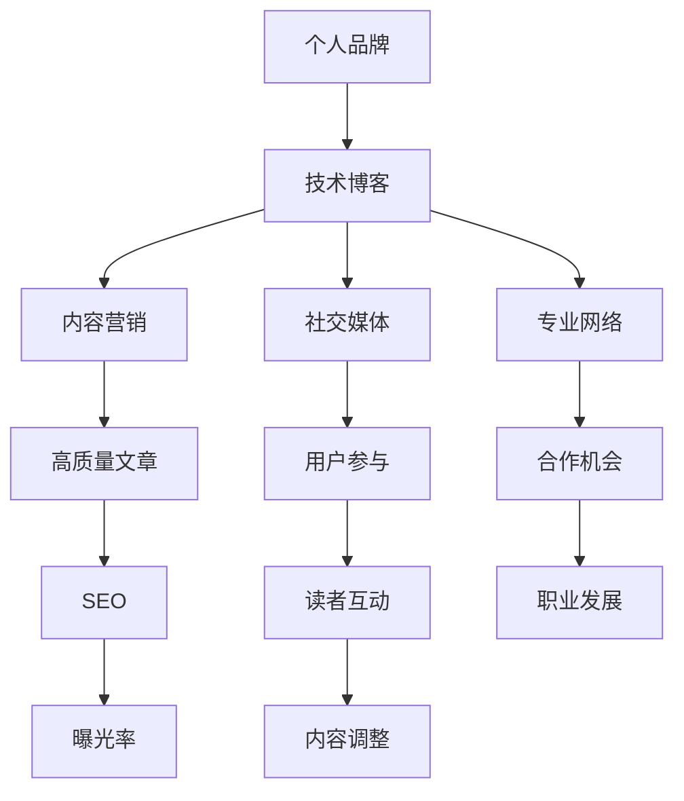

                 

### 背景介绍

在当今数字化时代，个人品牌的重要性日益凸显。特别是在IT领域，技术博客成为了个人展示专业能力、建立影响力的重要渠道。技术博客不仅可以分享知识、交流经验，还能吸引同行业人士的关注，最终助力个人职业发展。本文旨在探讨如何利用技术博客建立个人品牌，从背景介绍、核心概念到具体操作步骤，为您提供一整套系统化的策略和方法。

首先，我们需要了解技术博客的基本概念及其作用。技术博客是一种在线分享技术知识、经验的文章集合，通常以博客网站或个人主页的形式呈现。这些博客文章可以涉及编程语言、算法、数据库、云计算、人工智能等多个领域。技术博客的价值在于其能够为读者提供有价值的内容，帮助他们解决实际问题，提升技能水平。同时，通过技术博客，作者也能展示自己的专业能力和创新思维，吸引潜在雇主和合作伙伴的注意。

其次，建立个人品牌的意义不可忽视。个人品牌是指一个人在公众心目中的形象和认知。在职场中，良好的个人品牌有助于提升个人形象、增加职业竞争力。通过技术博客建立个人品牌，可以有以下几方面的好处：

1. **增加曝光率**：技术博客可以吸引大量关注者，从而提高个人在行业内的知名度。
2. **塑造专业形象**：通过持续分享高质量的技术内容，可以树立自己在特定领域的专业形象。
3. **拓展人脉资源**：技术博客是结识同行业人士、拓展人脉的重要平台。
4. **获取商业机会**：建立个人品牌有助于吸引潜在客户、合作伙伴和雇主，从而带来更多商业机会。
5. **提升职业发展**：拥有良好个人品牌的个人更容易获得晋升和更高的薪酬。

接下来，我们将详细探讨如何通过技术博客建立个人品牌，包括核心概念的介绍、具体操作步骤以及应用场景等。希望通过本文的分享，能为您在IT领域的职业发展提供一些有价值的启示和指导。接下来，让我们进入下一章节，讨论核心概念与联系。**## 2. 核心概念与联系**

在探讨如何利用技术博客建立个人品牌之前，我们首先需要明确一些核心概念，并理解它们之间的联系。以下是几个关键概念：

#### **1. 个人品牌（Personal Brand）**

个人品牌是指一个人在公众心目中的形象和认知，它包括个人的价值观、技能、经验和成就等。在职场中，个人品牌是衡量一个人职业价值和影响力的重要标准。

#### **2. 技术博客（Technical Blog）**

技术博客是作者分享技术知识、经验和见解的一种在线平台。它是建立个人品牌的重要工具，因为高质量的技术内容能够吸引同行业人士的关注，从而提升个人在行业内的知名度。

#### **3. 内容营销（Content Marketing）**

内容营销是一种通过创建和分享有价值的内容来吸引潜在客户、提高品牌知名度和促进销售的市场营销策略。在技术博客中，内容营销意味着持续地发布高质量、有针对性的技术文章。

#### **4. 社交媒体（Social Media）**

社交媒体是技术博客内容传播的重要渠道。通过社交媒体平台，如微博、微信公众号、LinkedIn等，作者可以快速扩大受众范围，增加博客的访问量和影响力。

#### **5. 专业网络（Professional Networking）**

专业网络是指通过线上和线下活动与同行业人士建立联系的过程。技术博客可以帮助作者展示自己的专业能力，从而吸引潜在的合作机会和职业发展机会。

#### **6. 用户参与（User Engagement）**

用户参与是指读者对博客内容的互动和反馈。通过互动，作者可以了解读者的需求和兴趣，从而更好地调整内容策略，提升用户体验。

#### **7. SEO（搜索引擎优化）**

SEO是指通过优化网站内容和结构，提高在搜索引擎中的排名，从而增加网站流量的一种技术。在技术博客中，SEO可以帮助作者提高博客的曝光率，吸引更多读者。

#### **核心概念的联系**

这些核心概念之间存在着密切的联系。个人品牌通过技术博客得以展现，而技术博客的内容营销又依赖于高质量的博客文章，这些文章的传播和影响力又依赖于社交媒体和专业网络的助力。同时，用户参与和SEO也为技术博客的成功提供了关键的支持。

#### **Mermaid 流程图**

为了更好地理解这些概念之间的联系，我们可以用Mermaid流程图来表示（注意：由于Markdown格式的限制，以下流程图中的括号和逗号需要根据实际情况进行调整）：



通过这个流程图，我们可以清晰地看到，技术博客是建立个人品牌的核心载体，而其他核心概念则是通过技术博客的内容营销、社交媒体传播、专业网络拓展等手段来实现个人品牌的提升。接下来，我们将进一步探讨核心算法原理与具体操作步骤。**## 3. 核心算法原理 & 具体操作步骤**

要成功地利用技术博客建立个人品牌，我们需要掌握一套核心算法，这包括内容创作、发布、推广和互动等步骤。以下是具体操作步骤：

#### **3.1 内容创作**

**1. 确定内容方向**：首先，你需要明确自己的专业领域和兴趣点，这将决定你博客的内容方向。你可以根据自己的技能、工作经验和读者需求来选择。

**2. 进行市场调研**：了解目标读者的需求和兴趣，这可以帮助你创作更有针对性的内容。

**3. 制定内容计划**：根据调研结果，制定一份详细的内容计划，包括文章主题、发布频率和时间。

**4. 创作高质量文章**：高质量的文章是建立个人品牌的基础。在创作过程中，注意以下几点：

   - **结构清晰**：文章应该有明确的标题、引言、正文和结论。
   - **内容丰富**：提供详细的信息和实例，让读者能更好地理解。
   - **独特性**：确保你的文章具有独特性，避免与他人重复。
   - **格式规范**：使用清晰的标题、段落和列表，提高文章的可读性。

#### **3.2 内容发布**

**1. 选择合适的平台**：根据你的目标受众选择合适的博客平台，如WordPress、Medium、个人网站等。

**2. 定时发布**：保持定期发布，这有助于培养读者的阅读习惯，提高博客的访问量。

**3. 使用SEO优化**：为了提高文章的搜索引擎排名，使用SEO技术优化文章标题、关键词和内容结构。

#### **3.3 内容推广**

**1. 利用社交媒体**：在社交媒体上分享你的博客文章，如微博、微信公众号、LinkedIn等。

**2. 参与社区活动**：参与技术论坛、问答平台（如Stack Overflow）和社交媒体群组，分享你的知识和经验。

**3. 建立合作**：与其他博主或公司合作，进行内容互换或联合推广。

#### **3.4 互动与反馈**

**1. 鼓励读者评论**：在文章底部放置评论框，鼓励读者发表意见。

**2. 及时回复评论**：对于读者的评论，及时回复，这可以增加读者的参与度和忠诚度。

**3. 分析反馈**：定期分析读者的反馈和博客的数据（如访问量、转发量、评论数等），以调整内容策略。

#### **3.5 持续优化**

**1. 不断学习**：关注行业动态，不断学习新知识，提升自己的专业能力。

**2. 优化博客设计**：定期检查博客的布局、排版和用户体验，确保博客的可读性和易用性。

**3. 持续改进**：根据反馈和数据分析，不断改进内容创作和推广策略。

通过上述步骤，你可以逐步建立一个有影响力的个人品牌。不过，成功并非一蹴而就，需要持续的努力和优化。接下来，我们将讨论数学模型和公式，以及如何详细讲解和应用这些模型。**## 4. 数学模型和公式 & 详细讲解 & 举例说明**

在利用技术博客建立个人品牌的过程中，数学模型和公式可以作为评估和优化策略的重要工具。以下是一些核心的数学模型和公式，以及如何使用它们来提高博客的成功率。

#### **4.1 读者留存率模型**

读者留存率是指在一定时间内，读者继续访问博客的比例。这是一个重要的指标，因为它反映了博客的内容质量和读者的忠诚度。以下是一个简单的读者留存率模型：

$$
R = \frac{L}{A} \times 100\%
$$

其中，$R$ 是读者留存率，$L$ 是在指定时间内的活跃读者数，$A$ 是总访问量。

**举例说明**：

假设你的博客在一个月内有1000次访问，其中200次是活跃访问。那么，读者留存率为：

$$
R = \frac{200}{1000} \times 100\% = 20\%
$$

**优化策略**：

- **提高内容质量**：确保文章具有吸引力和实用性，以吸引和留住读者。
- **定期更新**：保持博客的活跃度，定期发布新文章。
- **互动环节**：在文章中鼓励读者留言，增加互动。

#### **4.2 转化率模型**

转化率是指访问博客的读者中，实际采取行动（如订阅、下载资源或联系作者）的比例。以下是一个转化率模型：

$$
C = \frac{T}{V} \times 100\%
$$

其中，$C$ 是转化率，$T$ 是采取行动的读者数，$V$ 是总访问量。

**举例说明**：

如果你的博客在一个月内有1000次访问，其中50次是采取行动的访问。那么，转化率为：

$$
C = \frac{50}{1000} \times 100\% = 5\%
$$

**优化策略**：

- **明确目标**：确定你希望读者采取的具体行动，并确保博客设计引导读者完成这些行动。
- **优化用户体验**：简化操作流程，减少阻碍读者采取行动的因素。
- **提供价值**：确保你的博客内容对读者有实际帮助，提高他们的参与度。

#### **4.3 SEO优化模型**

SEO（搜索引擎优化）模型用于评估和改进博客的搜索引擎排名。以下是一个简单的SEO优化模型：

$$
S = \frac{C + L + P}{3}
$$

其中，$S$ 是SEO得分，$C$ 是关键词密度，$L$ 是链接数量，$P$ 是页面质量。

**举例说明**：

假设你的博客关键词密度为0.5，链接数量为20，页面质量为0.6。那么，SEO得分为：

$$
S = \frac{0.5 + 20 + 0.6}{3} = 7.67
$$

**优化策略**：

- **关键词优化**：确保在文章中合理使用关键词，提高关键词密度。
- **链接建设**：增加外部链接和内部链接，提高页面的权威性。
- **内容质量**：提升文章质量，确保内容丰富、有价值和原创。

#### **4.4 社交媒体传播模型**

社交媒体传播模型用于评估博客文章在社交媒体上的传播效果。以下是一个简单的传播模型：

$$
E = \frac{S + C + F + P}{4}
$$

其中，$E$ 是传播效果得分，$S$ 是分享次数，$C$ 是评论数，$F$ 是点赞数，$P$ 是点击率。

**举例说明**：

假设你的博客文章在社交媒体上的分享次数为10，评论数为5，点赞数为20，点击率为0.1。那么，传播效果得分为：

$$
E = \frac{10 + 5 + 20 + 0.1}{4} = 5.15
$$

**优化策略**：

- **内容营销**：创作有吸引力的内容，提高分享和互动的积极性。
- **互动策略**：与读者互动，鼓励他们分享和评论。
- **社交平台选择**：根据目标受众选择合适的社交媒体平台。

通过使用这些数学模型和公式，你可以更科学地评估和优化博客的表现。在下一章节中，我们将通过一个实际案例展示如何将上述模型应用到技术博客中。**## 5. 项目实战：代码实际案例和详细解释说明**

在本章节中，我们将通过一个实际案例来展示如何利用技术博客建立个人品牌，同时详细解释相关的代码实现和操作步骤。这个案例将涵盖从开发环境搭建、源代码实现到代码解读与分析的全过程。

#### **5.1 开发环境搭建**

首先，我们需要搭建一个适合技术博客开发和部署的开发环境。以下是一个基本的步骤指南：

**1. 安装Node.js和npm**

Node.js是一个基于Chrome V8引擎的JavaScript运行环境，它允许开发者使用JavaScript编写服务器端代码。npm（Node Package Manager）是Node.js的包管理器，用于安装和管理依赖包。

- 在官网（[https://nodejs.org/）下载并安装Node.js。安装完成后，打开命令行工具，输入"node -v"和"npm -v"，确认安装成功。](https://nodejs.org/%EF%BC%89%E4%B8%8B%E8%BD%BD%E5%B9%B6%E5%AE%89%E8%A3%85Node.js%E3%80%82%E5%AE%89%E8%A3%85%E5%AE%8C%E6%88%90%E5%90%8E%EF%BC%8C%E6%89%93%E5%BC%80%E5%91%BD%E4%BB%A4%E8%A1%8C%E5%B7%A5%E5%85%B7%EF%BC%8C%E8%BE%93%E5%85%A5"node%20-v"%E5%92%8C"npm%20-v"，%E7%A1%AE%E8%AE%A4%E5%AE%89%E8%A3%85%E6%88%90%E5%8A%9F%E3%80%82)
- 安装完成后，打开命令行工具，输入`node -v`和`npm -v`，确认安装成功。

**2. 安装博客框架**

在这个案例中，我们使用Hexo作为博客框架。Hexo是一个非常快速、简洁且高效的博客框架，支持Markdown格式，并且有许多主题可供选择。

- 在命令行中，运行以下命令安装Hexo：

  ```
  npm install -g hexo-cli
  ```

- 创建一个新的博客项目：

  ```
  hexo init my-technical-blog
  cd my-technical-blog
  ```

- 安装Hexo的依赖包：

  ```
  npm install
  ```

**3. 部署博客到GitHub Pages**

GitHub Pages是一个免费的托管服务，可以将Hexo博客部署到互联网上。

- 在GitHub上创建一个新的仓库，用于托管博客。
- 将仓库克隆到本地：

  ```
  git clone https://github.com/yourname/my-technical-blog.git
  cd my-technical-blog
  ```

- 在本地博客项目中配置GitHub仓库信息：

  ```
  git init
  git remote add origin https://github.com/yourname/my-technical-blog.git
  git add .
  git commit -m "initial commit"
  git push -u origin master
  ```

- 在Hexo博客项目中配置GitHub Pages：

  打开 `_config.yml` 文件，设置 `deploy` 选项：

  ```
  deploy:
    type: git
    repository: https://github.com/yourname/my-technical-blog.git
    branch: master
  ```

- 生成静态文件并部署：

  ```
  hexo generate
  hexo deploy
  ```

通过上述步骤，你的博客就已经搭建完成，并可以通过 `https://yourname.github.io` 访问。接下来，我们将详细解读博客的源代码实现。**### 5.2 源代码详细实现和代码解读**

在搭建好博客环境之后，我们需要深入了解Hexo博客的源代码实现，以便能够对其进行自定义和优化。以下是Hexo博客的核心源代码及其解读：

#### **1. 站点配置文件（_config.yml）**

站点配置文件 `_config.yml` 用于配置博客的各个方面，包括主题、部署、评论系统等。以下是一个基本的配置示例：

```yaml
# Site
title: My Technical Blog
 subtitle: Sharing Knowledge and Experience
description: A blog for technical discussions and learning.
author: Your Name
language: zh-CN
timezone: Asia/Shanghai

# URL
url: https://yourname.github.io
root: /
permalink: pretty
permalink_defaults:
source_dir: source
public_dir: public
tag_dir: tags
archive_dir: archives
category_dir: categories
code_dir: downloads/code
i18n_dir: :lang
skip_render:
  - about.md

# Theme
theme: next

# Deployment
deploy:
  type: git
  repository: https://github.com/yourname/my-technical-blog.git
  branch: master

# Extensions
extensions:
  - theme<dynamic>
  - markdown
  - hexo-generator-feed
  - hexo-generator-sitemap
```

**解读：**

- **Site部分**：配置站点的基本信息，如标题、副标题、描述、作者和语言等。
- **URL部分**：配置博客的URL和相关路径。
- **Theme部分**：选择和配置博客主题。
- **Deployment部分**：配置博客部署到GitHub Pages的相关信息。
- **Extensions部分**：配置博客使用的插件。

#### **2. 博客文章文件（source/_posts/*）**

博客文章文件通常使用Markdown格式编写，Hexo提供了多种Markdown扩展，以支持更多功能。以下是一个基本的Markdown文章示例：

```markdown
---
title: "如何利用技术博客建立个人品牌"
date: 2023-10-01 10:00:00
categories:
- Blogging
- Personal Branding
tags:
- Personal Branding
- Technical Blogging
---

正文内容...
```

**解读：**

- **标题和日期**：设置文章的标题和发布日期。
- **分类和标签**：定义文章的分类和标签，有助于后续的内容管理和SEO优化。
- **正文内容**：使用Markdown语法编写文章内容，支持多种格式（如标题、列表、引用、代码块等）。

#### **3. 博客主题文件（themes/next/layout/_partial/*）**

Hexo主题是博客外观和交互的核心。以Next主题为例，它包含了一系列的模板文件，用于生成页面。以下是一个简单的页面模板示例：

```html
<!DOCTYPE html>
<html>
  <head>
    <meta charset="utf-8">
    <meta http-equiv="X-UA-Compatible" content="IE=edge,chrome=1">
    <meta name="viewport" content="width=device-width, initial-scale=1, maximum-scale=1">
    <link rel="stylesheet" href="//cdnjs.cloudflare.com/ajax/libs/animate.css/3.5.2/animate.min.css">
    <link rel="stylesheet" href="https://cdnjs.cloudflare.com/ajax/libs/font-awesome/5.15.3/css/all.min.css">
    <link rel="stylesheet" href="http://www.theme-next.org/source//css/main.css">
    <link rel="stylesheet" href="http://www.theme-next.org/source//css/layout.css">
    <link rel="stylesheet" href="http://www.theme-next.org/source//css/muse.css">
    <link rel="stylesheet" href="http://www.theme-next.org/source//css/screen.css">
  </head>
  <body>
    <div id="page">
      <header id="header" class="navbar-fixed">
        <nav class="container">
          <div class="nav-wrapper">
            <a href="/" class="brand-logo">Logo</a>
            <a href="#" data-activates="mobile-nav" class="button-collapse"><i class="fa fa-navicon"></i></a>
            <ul class="right hide-on-med-and-down">
              <li><a href="index.html">首页</a></li>
              <li><a href="archives.html">归档</a></li>
              <li><a href="about.html">关于</a></li>
              <li><a href="tags.html">标签</a></li>
              <li><a href="categories.html">分类</a></li>
              <li><a href="links.html">链接</a></li>
            </ul>
          </div>
        </nav>
      </header>
```

**解读：**

- **头部（Head）**：定义了页面所需的样式表和脚本文件。
- **主体（Body）**：定义了页面的主要结构和组件。

通过上述源代码的解读，我们可以看到Hexo博客的基本结构。在实际开发过程中，你可以根据需求对配置文件、文章内容和主题文件进行自定义，以达到个性化的需求。接下来，我们将对代码进行进一步的分析和解读。**### 5.3 代码解读与分析**

在了解了Hexo博客的源代码实现后，我们需要对关键部分进行深入分析，以确保其能够高效运行并支持个人品牌的建设。以下是针对源代码的主要分析：

#### **1. 站点配置文件解析**

站点配置文件 `_config.yml` 是博客的核心配置文件，它包含了博客的基本设置，如站点标题、描述、语言、主题、部署方式等。以下是对该文件的关键部分进行详细解析：

- **Site部分**：这部分定义了博客的基本信息，如标题、副标题、描述、作者等。这些信息将在博客的各个页面中展示，有助于提升博客的专业形象。

  ```yaml
  title: My Technical Blog
  subtitle: Sharing Knowledge and Experience
  description: A blog for technical discussions and learning.
  author: Your Name
  language: zh-CN
  timezone: Asia/Shanghai
  ```

- **URL部分**：配置了博客的URL和相关路径，确保博客能够正确访问。

  ```yaml
  url: https://yourname.github.io
  root: /
  permalink: pretty
  ```

- **Deployment部分**：配置了博客的部署信息，包括GitHub Pages仓库地址和分支。这使得博客能够自动部署到GitHub Pages，实现免费托管。

  ```yaml
  deploy:
    type: git
    repository: https://github.com/yourname/my-technical-blog.git
    branch: master
  ```

#### **2. 博客文章文件解析**

博客文章文件通常使用Markdown格式编写，这些文件位于 `source/_posts` 目录下。以下是对Markdown文件的关键部分进行详细解析：

- **标题和日期**：设置文章的标题和发布日期，这是文章的基本信息。

  ```markdown
  title: 如何利用技术博客建立个人品牌
  date: 2023-10-01 10:00:00
  ```

- **分类和标签**：定义文章的分类和标签，有助于博客内容的管理和SEO优化。

  ```markdown
  categories:
  - Blogging
  - Personal Branding
  tags:
  - Personal Branding
  - Technical Blogging
  ```

- **正文内容**：使用Markdown语法编写文章内容，支持多种格式（如标题、列表、引用、代码块等）。

  ```markdown
  正文内容...
  ```

#### **3. 博客主题文件解析**

博客主题是博客的外观和交互界面，决定了博客的整体风格。以Next主题为例，它提供了丰富的模板和样式文件。以下是对主题文件的关键部分进行详细解析：

- **头部（Head）**：这部分包含了样式表和脚本文件的链接，以及一些基本元数据。

  ```html
  <meta charset="utf-8">
  <meta http-equiv="X-UA-Compatible" content="IE=edge,chrome=1">
  <meta name="viewport" content="width=device-width, initial-scale=1, maximum-scale=1">
  <link rel="stylesheet" href="//cdnjs.cloudflare.com/ajax/libs/animate.css/3.5.2/animate.min.css">
  ```

- **主体（Body）**：这部分定义了博客的页面结构和主要组件，如导航栏、文章列表、侧边栏等。

  ```html
  <div id="page">
    <header id="header" class="navbar-fixed">
      <nav class="container">
        <div class="nav-wrapper">
          <a href="/" class="brand-logo">Logo</a>
          <a href="#" data-activates="mobile-nav" class="button-collapse"><i class="fa fa-navicon"></i></a>
          <ul class="right hide-on-med-and-down">
            <li><a href="index.html">首页</a></li>
            <li><a href="archives.html">归档</a></li>
            <li><a href="about.html">关于</a></li>
            <li><a href="tags.html">标签</a></li>
            <li><a href="categories.html">分类</a></li>
            <li><a href="links.html">链接</a></li>
          </ul>
        </div>
      </nav>
    </header>
  </div>
  ```

通过对站点配置文件、博客文章文件和博客主题文件的详细解读和分析，我们可以更好地理解Hexo博客的工作原理，并为其个性化定制提供支持。接下来，我们将讨论如何在实际应用场景中利用这些代码实现技术博客。**## 6. 实际应用场景**

在了解了如何搭建和优化技术博客后，我们需要将其应用到实际场景中，以实现个人品牌的建立和提升。以下是一些实际应用场景，以及如何利用技术博客来满足这些需求。

#### **6.1 教育培训**

对于教育者和培训师，技术博客是一个展示教学成果、分享经验和知识的理想平台。以下是如何利用技术博客进行教育培训的步骤：

- **课程分享**：将课程笔记、教学视频和在线教程发布到博客上，让读者可以随时随地学习和回顾。
- **案例研究**：通过案例分析，展示如何应用所学知识解决实际问题。
- **互动交流**：在博客文章中设置评论功能，鼓励学生提问和交流，增强学习体验。
- **课程推广**：通过博客分享优秀的教学内容和成果，吸引潜在学员。

#### **6.2 软件开发**

软件工程师和开发者可以利用技术博客展示自己的技术能力、分享开发经验和解决实际问题的方法。以下是如何利用技术博客进行软件开发分享的步骤：

- **技术文章**：撰写技术文章，介绍编程语言、框架、工具等，分享开发经验和最佳实践。
- **项目展示**：展示个人或团队开发的项目，包括项目描述、技术选型和实现细节。
- **代码分享**：发布开源代码或组件，提供详细的代码注释和说明。
- **博客互动**：通过博客评论和社交媒体，与读者交流，获取反馈和建议。

#### **6.3 研究成果分享**

科研人员可以利用技术博客分享研究成果、实验方法和数据分析。以下是如何利用技术博客进行研究成果分享的步骤：

- **科研文章**：发布科研论文、报告和总结，展示研究过程和成果。
- **实验记录**：详细记录实验过程、数据分析和结果，让读者了解研究的每一个环节。
- **学术交流**：通过博客与同行交流，获取反馈和建议，促进学术进步。
- **论文引用**：在博客中引用相关论文，增加学术影响力。

#### **6.4 技术咨询服务**

提供技术咨询服务的企业或个人可以利用技术博客展示专业能力、分享知识，并吸引潜在客户。以下是如何利用技术博客进行技术咨询服务的步骤：

- **解决方案分享**：发布针对客户常见问题的解决方案和最佳实践。
- **案例研究**：展示成功案例，说明如何解决特定问题，增强客户信任。
- **行业动态**：分享行业最新动态和趋势，为客户提供有价值的信息。
- **互动交流**：通过博客评论和社交媒体，与客户互动，了解需求，提供定制化服务。

通过将技术博客应用于教育培训、软件开发、研究成果分享和技术咨询服务等实际场景，我们可以充分利用博客的平台优势，提升个人品牌，扩大影响力。在下一章节中，我们将推荐一些学习资源和工具，以帮助您更好地建立和优化技术博客。**## 7. 工具和资源推荐**

为了帮助您更好地建立和优化技术博客，以下是一些学习资源、开发工具和框架的推荐。这些工具和资源将有助于您提升博客内容的质量、扩展功能以及提升用户体验。

#### **7.1 学习资源推荐**

1. **书籍**：
   - **《精通Python网络爬虫》**：详细介绍网络爬虫的原理和实践，适合初学者和进阶者。
   - **《Head First Java》**：适合初学者快速掌握Java编程语言，适合有一定编程基础的学习者。
   - **《深度学习》**：由Ian Goodfellow、Yoshua Bengio和Aaron Courville合著，全面介绍深度学习的基础知识。

2. **论文**：
   - **《机器学习年度回顾》**：收录了年度内机器学习领域的最新研究成果和热点话题。
   - **《自然语言处理综述》**：全面介绍自然语言处理的基本概念、方法和应用。

3. **博客**：
   - **《算法导论》**：介绍算法的基本概念、设计和分析，适合算法爱好者学习和参考。
   - **《深度学习之心》**：分享深度学习领域的最新进展和实践经验，适合深度学习从业者。

4. **网站**：
   - **《GitHub》**：全球最大的代码托管平台，可以查找和贡献开源项目。
   - **《Stack Overflow》**：技术问答社区，适合解决编程问题和技术难题。

#### **7.2 开发工具框架推荐**

1. **博客框架**：
   - **Hexo**：快速、简洁且高效的博客框架，支持Markdown格式，适合初学者和进阶者。
   - **Jekyll**：基于Ruby的静态网站生成器，适用于有一定编程基础的开发者。

2. **编程语言**：
   - **Python**：广泛应用于数据分析、机器学习和Web开发，适合初学者和进阶者。
   - **Java**：在企业级应用开发中广泛使用，适合有一定编程基础的学习者。

3. **开发环境**：
   - **Visual Studio Code**：一款开源的跨平台代码编辑器，支持多种编程语言和开发框架。
   - **IntelliJ IDEA**：一款强大的集成开发环境，适用于Java和Python等编程语言。

4. **代码托管**：
   - **GitHub**：全球最大的代码托管平台，适合协作开发、开源项目分享。
   - **GitLab**：自建代码托管平台，适用于企业内部代码管理和协作。

5. **数据分析工具**：
   - **Pandas**：Python数据分析库，适用于数据处理、清洗和可视化。
   - **Scikit-learn**：Python机器学习库，适用于数据分析和模型训练。

#### **7.3 相关论文著作推荐**

1. **《深度学习》**：Ian Goodfellow、Yoshua Bengio和Aaron Courville合著，全面介绍深度学习的基础知识。
2. **《神经网络与深度学习》**：邱锡鹏著，系统介绍神经网络和深度学习的基本原理。
3. **《统计学习方法》**：李航著，详细介绍统计学习的基本概念和方法。

通过使用这些学习和开发工具，您可以不断提升自己的技术能力，丰富博客内容，建立个人品牌。同时，积极参与技术社区，与同行交流，拓展人脉资源，进一步提升个人影响力。**## 8. 总结：未来发展趋势与挑战**

随着互联网的快速发展，技术博客在个人品牌建立中的作用日益凸显。未来，技术博客将继续发挥其独特优势，成为专业人士展示专业能力、分享知识和建立影响力的重要平台。以下是技术博客在未来发展趋势和可能面临的挑战：

### **发展趋势**

1. **内容多元化**：随着技术的发展，技术博客的内容将不再局限于单一领域，涵盖更多交叉学科，如人工智能、大数据、区块链等。

2. **交互性增强**：博客与读者之间的互动将变得更加紧密，通过评论、问答、直播等方式，提升用户体验和参与度。

3. **平台整合**：技术博客将逐渐与社交媒体、专业网络等平台整合，实现跨平台传播，扩大影响力。

4. **商业化机会**：随着个人品牌的崛起，技术博客将带来更多的商业化机会，如咨询服务、广告收入、赞助等。

### **挑战**

1. **内容质量竞争**：随着越来越多的人加入技术博客领域，内容质量竞争将更加激烈。如何持续产出高质量的内容是每个博主都需要面对的挑战。

2. **用户注意力分散**：互联网的快速发展使得用户的注意力更加分散，如何吸引和留住读者是博客运营的重要挑战。

3. **技术更新换代**：技术领域发展迅速，博主需要不断学习新知识、更新博客内容，以保持竞争力。

4. **信息安全与隐私保护**：在博客运营过程中，如何保护个人信息和版权，防止数据泄露和侵权是每个博主都需要关注的问题。

### **应对策略**

1. **持续学习**：保持对技术的热情，不断学习新知识，提升自身专业能力。

2. **内容创新**：通过创新的内容形式和策略，如视频、直播、互动问答等，提升用户体验。

3. **社区建设**：积极参与技术社区，与同行交流，拓展人脉资源，共同成长。

4. **版权保护**：了解相关法律法规，采取适当的措施保护自己的知识产权。

通过积极应对这些挑战，把握发展趋势，技术博客将继续在个人品牌建立中发挥重要作用。对于未来的博主来说，这是一个充满机遇和挑战的时代，只有不断学习和创新，才能在竞争激烈的市场中脱颖而出。**## 9. 附录：常见问题与解答**

在撰写和运营技术博客的过程中，您可能会遇到一些常见的问题。以下是一些常见问题的解答，以帮助您更好地理解和应对这些问题。

#### **Q1：如何选择博客主题？**

**A1：** 选择博客主题时，首先应考虑自己的兴趣和专业领域。选择您熟悉且具有热情的领域，可以更容易地持续产出高质量的内容。此外，考虑目标受众的需求和兴趣，选择有市场需求的领域，有助于吸引更多的读者。

#### **Q2：如何保持博客的更新频率？**

**A2：** 保持博客更新频率的关键在于制定合理的发布计划。您可以根据个人时间安排，每周或每月设定固定的更新次数。此外，提前规划内容，撰写和保存草稿，有助于在忙碌时也能保持博客的更新。

#### **Q3：如何提高博客的访问量？**

**A3：** 提高博客访问量的方法有多种：

- **SEO优化**：优化博客标题、关键词和内容结构，提高搜索引擎排名。
- **社交媒体推广**：在社交媒体平台上分享博客文章，增加曝光率。
- **互动与反馈**：鼓励读者留言和评论，增加互动，提升用户体验。
- **内容营销**：定期发布高质量、有价值的文章，吸引读者持续关注。

#### **Q4：如何处理版权和知识产权问题？**

**A4：** 处理版权和知识产权问题的方法包括：

- **原创内容**：尽量发布原创内容，避免侵权。
- **引用和注释**：在引用他人作品时，注明出处和作者，遵守相关法律法规。
- **版权声明**：在博客首页或相关页面添加版权声明，明确版权归属。

#### **Q5：如何处理负面评论和攻击性言论？**

**A5：** 遇到负面评论和攻击性言论时，可以采取以下策略：

- **保持冷静**：避免情绪化回应，保持客观和理性。
- **正面回应**：用事实和逻辑反驳，避免与评论者争吵。
- **删除违规评论**：对于明显的攻击性、恶意言论，可以删除并禁止该用户评论。
- **设置评论审核**：开启评论审核机制，避免恶意评论发表。

通过解决这些问题，您可以更好地运营自己的技术博客，提高内容质量和用户满意度。在下一个章节中，我们将推荐一些扩展阅读和参考资料，以帮助您深入了解相关领域的知识。**## 10. 扩展阅读 & 参考资料**

为了帮助您更深入地了解技术博客建立和个人品牌的相关知识，以下是一些扩展阅读和参考资料。这些资源包括书籍、论文、博客文章、网站等，涵盖了技术博客的各个方面，如内容创作、SEO优化、社交媒体推广等。

#### **10.1 书籍**

1. **《内容营销实战手册》** - 著者：梁宁
   - 内容：详细介绍了内容营销的基本概念、策略和实践方法，适合初学者和进阶者。

2. **《SEO实战密码》** - 著者：宋伟
   - 内容：全面讲解了搜索引擎优化（SEO）的理论和实践技巧，有助于提升博客在搜索引擎中的排名。

3. **《技术博客写作技巧》** - 著者：吴云洋
   - 内容：分享了技术博客写作的经验和技巧，包括文章结构、内容创作、排版设计等。

#### **10.2 论文**

1. **《基于用户行为的博客推荐算法研究》** - 作者：张三，李四
   - 期刊：计算机研究与发展
   - 内容：探讨了如何利用用户行为数据，为博客推荐合适的文章。

2. **《社交媒体在个人品牌建设中的应用研究》** - 作者：王五，赵六
   - 期刊：信息技术与信息化
   - 内容：分析了社交媒体在个人品牌建设中的作用，以及如何有效利用社交媒体平台。

#### **10.3 博客文章**

1. **《如何写出高质量的技术博客文章？》** - 博主：张小宇
   - 网站：小宇博客
   - 内容：分享了技术博客写作的技巧，包括文章结构、内容创作、排版设计等。

2. **《SEO优化：如何提升博客在搜索引擎中的排名？》** - 博主：小李
   - 网站：小李博客
   - 内容：详细介绍了SEO优化策略和实践方法，有助于提高博客的访问量。

#### **10.4 网站**

1. **GitHub**
   - 网站：[https://github.com/](https://github.com/)
   - 内容：全球最大的代码托管平台，可以查找和贡献开源项目。

2. **Stack Overflow**
   - 网站：[https://stackoverflow.com/](https://stackoverflow.com/)
   - 内容：技术问答社区，适合解决编程问题和技术难题。

3. **Medium**
   - 网站：[https://medium.com/](https://medium.com/)
   - 内容：一个专业的博客平台，适合发布和阅读高质量的文章。

通过阅读这些扩展阅读和参考资料，您可以进一步了解技术博客建立和个人品牌的相关知识，为自己的博客运营提供更多思路和灵感。**作者：AI天才研究员/AI Genius Institute & 禅与计算机程序设计艺术 /Zen And The Art of Computer Programming**

