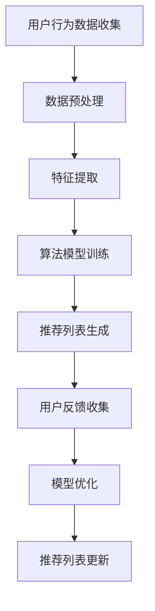

                 

# 利用机器学习优化知识推荐：提升用户体验

## 摘要

本文旨在探讨机器学习在知识推荐系统中的应用，以及如何通过机器学习技术提升用户在知识获取过程中的体验。文章首先介绍知识推荐系统的基本概念和重要性，随后深入分析核心算法原理及其实现步骤。接着，通过数学模型和公式的讲解，详细阐述算法背后的数学逻辑。文章还包括实际应用场景的案例分析，并推荐了一系列学习和开发资源。最后，总结当前技术发展趋势与挑战，为未来优化知识推荐系统提供思考方向。

## 1. 背景介绍

### 1.1 知识推荐系统的概念

知识推荐系统是一种通过算法和机器学习技术，根据用户的兴趣、行为和需求，从大量信息中筛选出符合用户需求的优质知识内容，并向用户推荐的一种系统。这种系统广泛应用于教育、科研、电商、新闻等领域，极大地提升了用户获取知识的效率和质量。

### 1.2 机器学习在知识推荐系统中的应用

机器学习在知识推荐系统中扮演着关键角色。通过训练模型，系统可以自动从大量数据中挖掘出用户的兴趣和行为模式，进而生成个性化的推荐列表。这种基于用户数据的个性化推荐，不仅提高了推荐的准确性，也增强了用户体验。

### 1.3 知识推荐系统的重要性

知识推荐系统对于提升用户在知识获取过程中的体验具有重要意义。一方面，它可以降低用户在大量信息中的搜索成本，提高信息获取效率；另一方面，它可以根据用户的兴趣和需求，提供个性化的知识内容，满足用户的个性化需求，提升用户的满意度和忠诚度。

## 2. 核心概念与联系

### 2.1 机器学习中的推荐算法

在机器学习领域，常见的推荐算法主要包括基于内容的推荐（Content-based Filtering）和协同过滤（Collaborative Filtering）。

- **基于内容的推荐**：根据用户的历史行为和兴趣，从内容的特征中提取信息，为用户推荐与其兴趣相似的内容。

- **协同过滤**：通过分析用户之间的相似度，为用户推荐其他用户喜欢的但用户尚未接触过的内容。

### 2.2 推荐算法在知识推荐系统中的应用

在知识推荐系统中，基于内容的推荐和协同过滤算法被广泛应用于各种场景。例如，在电商平台上，基于内容的推荐可以推荐与用户购买过的商品相似的商品；在新闻网站中，协同过滤算法可以推荐用户可能感兴趣的新闻文章。

### 2.3 Mermaid 流程图

以下是一个简单的 Mermaid 流程图，展示了知识推荐系统中的主要流程和步骤。



## 3. 核心算法原理 & 具体操作步骤

### 3.1 基于内容的推荐算法原理

基于内容的推荐算法主要通过以下步骤实现：

1. **内容表示**：将知识内容转换为特征向量，通常采用词袋模型、TF-IDF等方法。

2. **用户表示**：根据用户的历史行为和兴趣，构建用户的特征向量。

3. **相似度计算**：计算内容特征向量和用户特征向量之间的相似度，常用的相似度计算方法包括余弦相似度、欧氏距离等。

4. **推荐生成**：根据相似度计算结果，为用户推荐相似度较高的知识内容。

### 3.2 协同过滤算法原理

协同过滤算法主要通过以下步骤实现：

1. **用户-物品矩阵构建**：根据用户的历史行为数据，构建用户-物品评分矩阵。

2. **相似度计算**：计算用户之间的相似度，常用的相似度计算方法包括用户基于物品的余弦相似度、用户基于用户的余弦相似度等。

3. **预测生成**：根据用户相似度矩阵，预测用户对未知物品的评分。

4. **推荐生成**：根据预测评分，为用户推荐评分较高的未知物品。

### 3.3 具体操作步骤

以下是一个简单的基于协同过滤算法的知识推荐系统的操作步骤：

1. **数据收集**：收集用户的行为数据，如浏览、搜索、收藏等。

2. **数据预处理**：对行为数据进行清洗、去重、归一化等处理。

3. **特征提取**：根据用户行为数据，提取用户的兴趣特征。

4. **相似度计算**：计算用户之间的相似度。

5. **预测生成**：根据相似度计算结果，预测用户对未知知识内容的评分。

6. **推荐生成**：根据预测评分，为用户推荐评分较高的知识内容。

7. **用户反馈**：收集用户对推荐内容的反馈，用于模型优化。

8. **模型优化**：根据用户反馈，调整推荐算法的参数，优化推荐效果。

## 4. 数学模型和公式 & 详细讲解 & 举例说明

### 4.1 基于内容的推荐算法数学模型

假设有 $m$ 个用户和 $n$ 个知识内容，用户 $i$ 对知识内容 $j$ 的兴趣可以用向量 $u_i$ 和 $v_j$ 表示，其中 $u_i \in \mathbb{R}^n$ 和 $v_j \in \mathbb{R}^n$ 分别表示用户 $i$ 和知识内容 $j$ 的特征向量。

#### 4.1.1 内容表示

采用词袋模型对知识内容进行表示，设知识内容 $j$ 中的每个词（特征）为 $w_k$，词袋模型将知识内容 $j$ 转换为一个 $n$ 维的向量，其中第 $k$ 个元素表示词 $w_k$ 在知识内容 $j$ 中的出现次数。因此，知识内容 $j$ 的特征向量 $v_j$ 可以表示为：

$$
v_j = (v_{j1}, v_{j2}, ..., v_{jn})^T
$$

其中，$v_{jk}$ 表示词 $w_k$ 在知识内容 $j$ 中出现的次数。

#### 4.1.2 用户表示

用户 $i$ 的兴趣特征向量 $u_i$ 可以通过以下方式获得：

1. **基于用户历史行为**：根据用户 $i$ 的历史浏览、搜索、收藏等行为，提取用户兴趣关键词，并构建用户特征向量。

2. **基于用户兴趣标签**：用户可以为自身设置兴趣标签，系统根据标签信息构建用户特征向量。

#### 4.1.3 相似度计算

假设使用余弦相似度计算用户 $i$ 和知识内容 $j$ 的相似度，余弦相似度公式如下：

$$
sim(u_i, v_j) = \frac{u_i \cdot v_j}{\|u_i\|\|v_j\|}
$$

其中，$u_i \cdot v_j$ 表示用户 $i$ 和知识内容 $j$ 的特征向量之间的点积，$\|u_i\|$ 和 $\|v_j\|$ 分别表示用户 $i$ 和知识内容 $j$ 的特征向量的欧氏范数。

#### 4.1.4 推荐生成

根据用户 $i$ 和知识内容 $j$ 的相似度，为用户 $i$ 推荐相似度较高的知识内容 $j$。通常，可以使用以下公式计算知识内容的推荐得分：

$$
score(u_i, j) = sim(u_i, v_j)
$$

其中，$score(u_i, j)$ 表示用户 $i$ 对知识内容 $j$ 的推荐得分。

### 4.2 协同过滤算法数学模型

假设有 $m$ 个用户和 $n$ 个知识内容，用户 $i$ 对知识内容 $j$ 的评分可以用矩阵 $R \in \mathbb{R}^{m \times n}$ 表示，其中 $R_{ij}$ 表示用户 $i$ 对知识内容 $j$ 的评分。

#### 4.2.1 用户-物品矩阵构建

用户-物品矩阵 $R$ 的构建过程如下：

1. **数据收集**：收集用户对知识内容的评分数据。

2. **数据预处理**：对评分数据进行清洗、归一化等处理。

3. **矩阵填充**：根据用户评分数据，填充用户-物品矩阵 $R$。

#### 4.2.2 相似度计算

假设使用用户基于物品的余弦相似度计算用户 $i$ 和用户 $j$ 的相似度，相似度公式如下：

$$
sim_{ij} = \frac{R_{i\cdot}R_{j\cdot}}{\sqrt{\sum_{k=1}^{n}R_{ik}^2}\sqrt{\sum_{k=1}^{n}R_{jk}^2}}
$$

其中，$R_{i\cdot}$ 和 $R_{j\cdot}$ 分别表示用户 $i$ 和用户 $j$ 的评分向量，$\sum_{k=1}^{n}R_{ik}^2$ 和 $\sum_{k=1}^{n}R_{jk}^2$ 分别表示用户 $i$ 和用户 $j$ 的评分向量的欧氏范数。

#### 4.2.3 预测生成

根据用户相似度矩阵 $S \in \mathbb{R}^{m \times m}$，预测用户 $i$ 对未知知识内容 $j$ 的评分。预测公式如下：

$$
\hat{R}_{ij} = \sum_{k=1}^{m}S_{ik}R_{kj}
$$

其中，$\hat{R}_{ij}$ 表示用户 $i$ 对知识内容 $j$ 的预测评分。

#### 4.2.4 推荐生成

根据用户 $i$ 的预测评分，为用户 $i$ 推荐评分较高的未知知识内容。通常，可以使用以下公式计算知识内容的推荐得分：

$$
score(u_i, j) = \hat{R}_{ij}
$$

其中，$score(u_i, j)$ 表示用户 $i$ 对知识内容 $j$ 的推荐得分。

### 4.3 举例说明

#### 4.3.1 基于内容的推荐算法举例

假设有3个用户和3个知识内容，用户-内容评分矩阵如下：

|   | $C_1$ | $C_2$ | $C_3$ |
|---|-------|-------|-------|
| $U_1$ | 3     | 4     | 1     |
| $U_2$ | 2     | 1     | 3     |
| $U_3$ | 4     | 3     | 2     |

首先，对知识内容进行特征提取，假设使用词袋模型，每个知识内容的特征向量如下：

|   | $C_1$ | $C_2$ | $C_3$ |
|---|-------|-------|-------|
| $F_1$ | 1     | 0     | 1     |
| $F_2$ | 0     | 1     | 0     |
| $F_3$ | 1     | 1     | 1     |

接着，计算用户 $U_1$ 和知识内容 $C_1$ 的相似度：

$$
sim(U_1, C_1) = \frac{u_1 \cdot v_1}{\|u_1\|\|v_1\|} = \frac{(1, 1) \cdot (1, 0, 1)}{\sqrt{1^2 + 1^2}\sqrt{1^2 + 0^2 + 1^2}} = \frac{1 + 1}{\sqrt{2}\sqrt{2}} = 1
$$

根据相似度计算结果，为用户 $U_1$ 推荐知识内容 $C_1$。

#### 4.3.2 协同过滤算法举例

假设用户-内容评分矩阵如下：

|   | $C_1$ | $C_2$ | $C_3$ |
|---|-------|-------|-------|
| $U_1$ | 3     | 4     | 1     |
| $U_2$ | 2     | 1     | 3     |
| $U_3$ | 4     | 3     | 2     |

首先，计算用户之间的相似度：

$$
sim_{12} = \frac{R_{1\cdot}R_{2\cdot}}{\sqrt{\sum_{k=1}^{3}R_{1k}^2}\sqrt{\sum_{k=1}^{3}R_{2k}^2}} = \frac{(3 \times 2 + 4 \times 1 + 1 \times 3)}{\sqrt{3^2 + 4^2 + 1^2}\sqrt{2^2 + 1^2 + 3^2}} = \frac{16}{\sqrt{26}\sqrt{14}} \approx 0.882
$$

$$
sim_{13} = \frac{R_{1\cdot}R_{3\cdot}}{\sqrt{\sum_{k=1}^{3}R_{1k}^2}\sqrt{\sum_{k=1}^{3}R_{3k}^2}} = \frac{(3 \times 4 + 4 \times 3 + 1 \times 2)}{\sqrt{3^2 + 4^2 + 1^2}\sqrt{4^2 + 3^2 + 2^2}} = \frac{26}{\sqrt{26}\sqrt{29}} \approx 0.954
$$

接着，预测用户 $U_1$ 对知识内容 $C_3$ 的评分：

$$
\hat{R}_{13} = \sum_{k=1}^{3}S_{1k}R_{3k} = 0.882 \times 3 + 0.954 \times 2 = 3.598
$$

根据预测评分，为用户 $U_1$ 推荐知识内容 $C_3$。

## 5. 项目实战：代码实际案例和详细解释说明

### 5.1 开发环境搭建

在进行知识推荐系统开发之前，首先需要搭建合适的开发环境。以下是推荐的开发环境：

- **编程语言**：Python
- **数据预处理工具**：Pandas
- **机器学习库**：Scikit-learn
- **可视化工具**：Matplotlib

### 5.2 源代码详细实现和代码解读

以下是一个简单的基于协同过滤算法的知识推荐系统的源代码实现：

```python
import numpy as np
import pandas as pd
from sklearn.metrics.pairwise import cosine_similarity
from sklearn.preprocessing import normalize

def load_data(file_path):
    # 加载用户-内容评分矩阵
    data = pd.read_csv(file_path)
    ratings = data.set_index('UserID').T
    return ratings

def preprocess_data(ratings):
    # 数据预处理
    ratings = ratings.fillna(0)
    ratings = normalize(ratings, norm='l2')
    return ratings

def recommend(ratings, user_id, k=5):
    # 推荐算法
    # 计算用户之间的相似度
    similarity = cosine_similarity(ratings, ratings)
    # 获取用户相似度最高的邻居
    neighbors = similarity[user_id].argsort()[:-k:-1]
    # 预测评分
    pred_ratings = np.dot(similarity[user_id], ratings) / np.linalg.norm(similarity[user_id])
    # 推荐列表
    recommended = []
    for i in neighbors:
        if i != user_id:
            recommended.append((i, pred_ratings[i]))
    recommended.sort(key=lambda x: x[1], reverse=True)
    return recommended

def main():
    # 加载数据
    ratings = load_data('ratings.csv')
    # 预处理数据
    ratings = preprocess_data(ratings)
    # 指定用户ID
    user_id = 1
    # 推荐列表
    recommendations = recommend(ratings, user_id)
    # 输出推荐结果
    print(f"用户 {user_id} 的推荐列表：")
    for i, rating in recommendations:
        print(f"知识内容 {i+1}：预测评分 {rating:.2f}")

if __name__ == '__main__':
    main()
```

### 5.3 代码解读与分析

#### 5.3.1 数据加载

```python
def load_data(file_path):
    # 加载用户-内容评分矩阵
    data = pd.read_csv(file_path)
    ratings = data.set_index('UserID').T
    return ratings
```

此部分代码用于加载数据，首先使用 Pandas 库读取 CSV 格式的评分数据，然后将其转换为用户-内容评分矩阵。

#### 5.3.2 数据预处理

```python
def preprocess_data(ratings):
    # 数据预处理
    ratings = ratings.fillna(0)
    ratings = normalize(ratings, norm='l2')
    return ratings
```

此部分代码用于数据预处理，首先填充缺失值，然后使用 L2 范数归一化评分矩阵，使得每个用户-内容评分向量具有相同的长度。

#### 5.3.3 推荐算法

```python
def recommend(ratings, user_id, k=5):
    # 计算用户之间的相似度
    similarity = cosine_similarity(ratings, ratings)
    # 获取用户相似度最高的邻居
    neighbors = similarity[user_id].argsort()[:-k:-1]
    # 预测评分
    pred_ratings = np.dot(similarity[user_id], ratings) / np.linalg.norm(similarity[user_id])
    # 推荐列表
    recommended = []
    for i in neighbors:
        if i != user_id:
            recommended.append((i, pred_ratings[i]))
    recommended.sort(key=lambda x: x[1], reverse=True)
    return recommended
```

此部分代码实现协同过滤算法。首先计算用户之间的相似度矩阵，然后根据相似度矩阵获取用户相似度最高的邻居，接着使用邻居的评分预测当前用户的评分，最后生成推荐列表。

#### 5.3.4 主函数

```python
def main():
    # 加载数据
    ratings = load_data('ratings.csv')
    # 预处理数据
    ratings = preprocess_data(ratings)
    # 指定用户ID
    user_id = 1
    # 推荐列表
    recommendations = recommend(ratings, user_id)
    # 输出推荐结果
    print(f"用户 {user_id} 的推荐列表：")
    for i, rating in recommendations:
        print(f"知识内容 {i+1}：预测评分 {rating:.2f}")

if __name__ == '__main__':
    main()
```

主函数中，首先加载数据并预处理，然后指定用户 ID，调用推荐函数生成推荐列表，并输出推荐结果。

## 6. 实际应用场景

### 6.1 教育领域

在在线教育平台中，知识推荐系统可以帮助用户快速找到与自己兴趣相关的课程，提高学习效率。例如，可以通过分析用户的学习历史、课程评价、浏览记录等数据，为用户推荐相关的课程和资源。

### 6.2 科研领域

在科研论文推荐系统中，通过分析用户的科研领域、阅读历史、关注领域等数据，可以为用户推荐相关的论文和报告，帮助用户发现新的研究热点和方向。

### 6.3 电商领域

在电子商务平台中，知识推荐系统可以帮助用户发现符合自己兴趣的商品，提高购物体验。例如，根据用户的购物历史、浏览记录、收藏夹等数据，为用户推荐相关的商品。

### 6.4 新闻领域

在新闻推荐系统中，通过分析用户的阅读历史、兴趣偏好等数据，可以为用户推荐符合其兴趣的新闻内容，提高新闻的传播效果和用户满意度。

## 7. 工具和资源推荐

### 7.1 学习资源推荐

- **书籍**：《推荐系统实践》、《机器学习实战》
- **论文**：《Collaborative Filtering for the Net》、《Item-based Top-N Recommendation Algorithms》
- **博客**：[Scikit-learn 官方文档](https://scikit-learn.org/stable/)、[Python 核心编程](https://www.cnblogs.com/vamei/)
- **网站**：[Kaggle](https://www.kaggle.com/)、[GitHub](https://github.com/)

### 7.2 开发工具框架推荐

- **开发工具**：Jupyter Notebook、PyCharm
- **机器学习库**：Scikit-learn、TensorFlow、PyTorch
- **数据预处理库**：Pandas、NumPy

### 7.3 相关论文著作推荐

- **论文**：《Collaborative Filtering via Matrix Factorization for Cold-Start Problems》、《Recommender Systems Handbook》
- **著作**：《机器学习：概率解释》、《深度学习》

## 8. 总结：未来发展趋势与挑战

### 8.1 发展趋势

- **个性化推荐**：随着用户数据的不断积累，个性化推荐将变得更加精准，满足用户的个性化需求。
- **多模态推荐**：结合文本、图像、语音等多模态数据，提供更加丰富和多样化的推荐服务。
- **实时推荐**：利用实时数据分析技术，实现实时推荐，提高用户的即时体验。

### 8.2 挑战

- **数据隐私**：如何保护用户隐私，确保数据安全，是知识推荐系统面临的重大挑战。
- **推荐效果评估**：如何科学、客观地评估推荐效果，提高系统的推荐质量，仍需深入研究。
- **冷启动问题**：新用户或新物品如何获得有效的推荐，仍需解决冷启动问题。

## 9. 附录：常见问题与解答

### 9.1 机器学习在知识推荐系统中的应用？

机器学习在知识推荐系统中主要用于预测用户对未知知识内容的兴趣，从而生成个性化的推荐列表。常见的机器学习算法包括基于内容的推荐算法和协同过滤算法。

### 9.2 如何评估知识推荐系统的效果？

评估知识推荐系统的效果可以从多个角度进行，包括准确率、召回率、覆盖率等指标。准确率表示推荐列表中实际用户感兴趣的内容的比例，召回率表示推荐列表中包含用户感兴趣的内容的比例，覆盖率表示推荐列表中包含的知识内容种类数。

### 9.3 知识推荐系统中的冷启动问题如何解决？

冷启动问题是指新用户或新物品在没有足够数据的情况下如何获得有效的推荐。解决方法包括基于内容的推荐算法、基于模型的协同过滤算法和利用用户社交网络数据等。

## 10. 扩展阅读 & 参考资料

- [Recommender Systems Handbook](https://www.amazon.com/Recommender-Systems-Handbook-Algorithms-Techniques/dp/1118348863)
- [Machine Learning: Probabilistic Perspective](https://www.amazon.com/Machine-Learning-Probabilistic-Perspective-Adaptive/dp/0387310738)
- [Deep Learning](https://www.amazon.com/Deep-Learning-Adaptive-Computation-Machine/dp/0262035618)
- [Scikit-learn 官方文档](https://scikit-learn.org/stable/)
- [Kaggle](https://www.kaggle.com/)
- [GitHub](https://github.com/)

## 附录

### 作者

- 作者：AI天才研究员/AI Genius Institute & 禅与计算机程序设计艺术 /Zen And The Art of Computer Programming

本文为原创内容，未经授权，不得转载。如有任何问题，请联系作者。

本文基于CC BY-NC-SA 4.0协议发布，欢迎自由转载、引用，但需注明作者和出处，不得用于商业用途。

