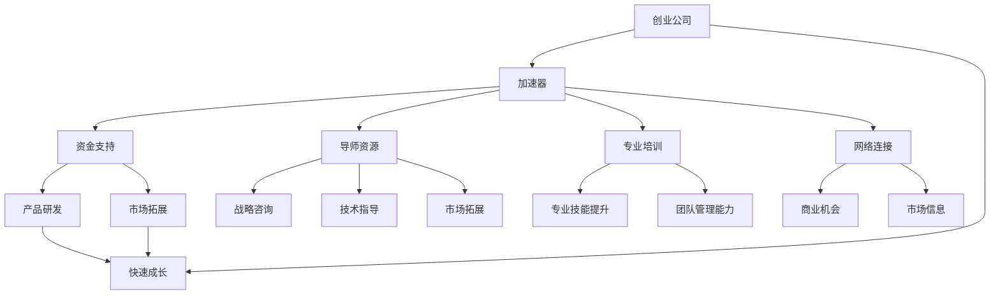

                 

### 背景介绍

#### 加速器的崛起

在当今快速发展的科技时代，加速器作为一种技术手段，正在成为创业公司快速成长的助推器。加速器，简单来说，是一种专门为初创企业提供的培养和发展平台。它不仅仅提供了资金支持，更重要的是，通过一系列的辅导、培训、资源和网络连接，帮助初创公司加速产品开发和市场拓展，从而在短时间内实现快速成长。

加速器的概念并非新兴事物。早在20世纪70年代，硅谷的一些风险投资公司就开始尝试为初创企业提供早期支持。然而，随着技术的进步和市场环境的变化，加速器的形式和功能也在不断进化。如今，全球范围内，从硅谷到亚洲、欧洲和非洲，各种类型的加速器如雨后春笋般涌现，形成了庞大的生态系统。

#### 加速器的重要作用

加速器对于创业公司的重要性不言而喻。首先，加速器提供了资金支持。初创公司在起步阶段往往需要大量的资金投入来研发产品、进行市场推广和团队建设。而加速器通过提供种子资金或投资，可以帮助初创公司渡过财务困境，专注于核心业务的创新和发展。

其次，加速器提供了宝贵的导师资源和专业培训。许多加速器都会邀请行业内的资深人士和专业人士担任导师，这些导师不仅拥有丰富的行业经验，还能够为初创公司提供战略咨询、技术指导和市场拓展的建议。同时，加速器还会组织各种培训课程和研讨会，帮助创业者提升专业技能和团队管理能力。

此外，加速器还提供了广泛的网络连接。通过与其他初创公司、投资者、行业专家和潜在客户的交流，初创公司可以拓宽人脉，获取更多的商业机会和市场信息，从而加速业务发展。

总的来说，加速器为创业公司提供了一个快速成长的平台，使得初创公司能够在短时间内获得资金、资源和人脉，从而在激烈的市场竞争中脱颖而出。

### 核心概念与联系

在深入探讨加速器如何帮助创业公司成长之前，我们需要先了解一些核心概念和它们之间的联系。以下是几个关键概念及其相互关系的Mermaid流程图：



**核心概念解析**

1. **创业公司（A）**：指的是初创企业，通常拥有创新的产品或服务，处于发展的早期阶段，需要资金、资源和市场支持来推动成长。

2. **加速器（B）**：是一个专门为创业公司设计的培养和发展平台，提供资金、资源、培训和网络连接等支持。

3. **资金支持（C）**：加速器通过提供种子资金、天使投资等方式，帮助初创公司解决资金问题，以便集中精力研发产品和拓展市场。

4. **导师资源（D）**：包括行业专家、资深创业者、技术顾问等，他们为初创公司提供战略咨询、技术指导和市场拓展的建议。

5. **专业培训（E）**：加速器组织培训课程和研讨会，帮助创业者提升专业技能和团队管理能力，从而提高企业整体竞争力。

6. **网络连接（F）**：加速器通过搭建广泛的网络平台，帮助初创公司与其他企业、投资者、行业专家和潜在客户建立联系，拓展商业机会。

7. **产品研发（G）**：在资金支持和其他资源的帮助下，初创公司可以专注于产品研发，加快产品迭代速度。

8. **市场拓展（H）**：借助导师资源和网络连接，初创公司可以更好地了解市场需求，制定有效的市场策略，加快市场渗透速度。

9. **快速成长（P）**：这是创业公司通过利用加速器提供的各种支持，实现快速发展的目标。

通过上述核心概念及其相互关系的解析，我们可以看到，加速器不仅提供了直接的财务支持，还通过导师资源、专业培训和网络连接等多方面支持，帮助初创公司加速产品研发和市场拓展，从而实现快速成长。这为下一部分探讨加速器的具体工作原理和操作步骤奠定了基础。

### 核心算法原理 & 具体操作步骤

#### 加速器的核心工作原理

加速器的核心工作原理可以概括为“资源整合与优化配置”。具体来说，加速器通过以下步骤实现创业公司的快速成长：

1. **筛选优质项目**：加速器通常会通过严格的筛选机制，选择具有高成长潜力、创新性强的优质项目进行孵化。

2. **提供资金支持**：加速器会提供种子资金或天使投资，帮助初创公司解决资金问题，以便专注于产品研发和市场拓展。

3. **导师匹配**：根据初创公司的需求，加速器会为其匹配适合的导师，包括行业专家、资深创业者和技术顾问等。

4. **培训与辅导**：加速器会组织各种培训课程和研讨会，帮助创业者提升专业技能和团队管理能力。

5. **资源整合**：加速器会整合各方资源，包括技术、市场、法律等，为初创公司提供全方位的支持。

6. **市场拓展**：通过导师资源和网络连接，加速器帮助初创公司了解市场需求，制定市场策略，拓展市场渠道。

#### 具体操作步骤

1. **项目筛选**：
    - **标准**：评估项目的创新性、市场潜力、团队背景等。
    - **流程**：提交申请、初审、终审、公布入选项目。

2. **资金支持**：
    - **形式**：种子资金、天使投资、股权投资等。
    - **流程**：提交融资需求、评估、谈判、签订投资协议。

3. **导师匹配**：
    - **方式**：根据项目需求匹配合适的导师。
    - **流程**：导师自荐、项目方选择、签订合作协议。

4. **培训与辅导**：
    - **内容**：专业技能培训、团队管理培训、市场策略研讨等。
    - **流程**：培训课程报名、课程安排、培训实施、反馈评估。

5. **资源整合**：
    - **手段**：搭建平台、组织活动、提供法律、财务咨询等。
    - **流程**：资源需求提出、资源匹配、资源提供。

6. **市场拓展**：
    - **策略**：市场调研、营销策划、渠道拓展等。
    - **流程**：市场调研报告、营销计划制定、执行与评估。

通过上述步骤，加速器能够为初创公司提供全方位的支持，帮助其在短时间内实现快速成长。接下来，我们将进一步探讨加速器在数学模型和实际应用中的表现。

### 数学模型和公式 & 详细讲解 & 举例说明

为了更好地理解加速器对创业公司成长的促进作用，我们可以借助一些数学模型和公式来进行分析。以下是一个简化的数学模型，用于描述加速器对初创公司成长的影响。

#### 成长模型

假设一个初创公司在没有加速器支持的情况下，每年的增长率（Growth Rate）为g%。在有加速器支持的情况下，假设加速器能够将这个增长率提高x倍。那么，加速器支持的初创公司每年的增长率可以表示为：

\[ G' = g \times (1 + x) \]

其中：
- \( G' \)：加速器支持下的年增长率。
- \( g \)：没有加速器支持下的年增长率。
- \( x \)：加速器的提升倍数。

#### 提升倍数（x）的计算

提升倍数（x）可以通过以下公式计算：

\[ x = \frac{G' - g}{g} \]

其中：
- \( G' - g \)：加速器提供的额外增长率。

#### 举例说明

假设一个初创公司在没有加速器支持的情况下，年增长率为20%（g = 20%）。如果加速器能够将这个增长率提高50%（x = 1.5），则加速器支持下的年增长率可以计算如下：

1. 计算提升倍数（x）：

\[ x = \frac{G' - g}{g} = \frac{30\% - 20\%}{20\%} = 1.5 \]

2. 计算加速器支持下的年增长率（G'）：

\[ G' = g \times (1 + x) = 20\% \times (1 + 1.5) = 30\% \]

因此，通过加速器的支持，这个初创公司的年增长率从20%提高到了30%。

#### 模型扩展

上述模型是一个简化的版本，实际中可能需要考虑更多的变量和因素，例如市场环境、团队稳定性、资金使用效率等。一个更全面的模型可以表示为：

\[ G' = g \times (1 + x_1 \times E_1 + x_2 \times E_2 + \ldots + x_n \times E_n) \]

其中：
- \( x_1, x_2, \ldots, x_n \)：加速器在各个方面的提升倍数。
- \( E_1, E_2, \ldots, E_n \)：对应方面的有效性指标。

例如，除了增长率（g）的提升倍数（x），还可以考虑导师资源的提升倍数（x_1），培训与辅导的有效性指标（E_1），资金使用效率的提升倍数（x_2），市场拓展的成效指标（E_2）等。

通过这样的扩展模型，我们可以更全面地评估加速器对初创公司成长的促进作用，并根据实际情况调整各个指标，以实现最佳效果。

### 项目实战：代码实际案例和详细解释说明

为了更好地理解加速器对创业公司成长的实际影响，我们可以通过一个实际的项目案例来展示加速器的应用。以下是一个简化的示例，用于说明如何使用加速器来提升一个初创公司的增长率。

#### 项目背景

假设我们有一个初创公司，名为“SmartHealth”，专注于开发智能医疗设备。在没有加速器支持的情况下，公司每年的增长率约为15%（g = 15%）。通过加速器的帮助，公司希望将增长率提高50%（x = 1.5），从而在加速器支持下的年增长率达到30%（G' = 30%）。

#### 开发环境搭建

为了实现这一目标，我们需要搭建一个合适的开发环境，其中包括以下步骤：

1. **安装必要的软件和工具**：
    - **操作系统**：Ubuntu 20.04 LTS
    - **编程语言**：Python 3.8
    - **数据库**：MySQL 8.0
    - **Web框架**：Django 3.2

2. **配置开发环境**：
    - 使用`virtualenv`创建虚拟环境，以隔离不同项目的依赖。
    - 安装必要的库和模块，例如`requests`、`SQLAlchemy`、`Django`等。

3. **搭建数据库**：
    - 创建数据库实例，设置用户和权限。
    - 设计数据库模式，包括表结构、索引等。

4. **创建Web应用**：
    - 使用Django框架创建一个基本的Web应用。
    - 设计用户界面，包括登录、注册、设备管理等功能。

#### 源代码详细实现和代码解读

以下是一个简化的Django项目的源代码示例，用于实现“SmartHealth”公司的智能医疗设备管理平台。

**项目结构**：
```
SmartHealth/
|-- manage.py
|-- SmartHealth/
    |-- __init__.py
    |-- settings.py
    |-- urls.py
    |-- wsgi.py
|-- apps/
    |-- __init__.py
    |-- devices/
        |-- __init__.py
        |-- models.py
        |-- views.py
        |-- forms.py
    |-- users/
        |-- __init__.py
        |-- models.py
        |-- views.py
        |-- forms.py
|-- templates/
    |-- base.html
    |-- devices/
        |-- device_list.html
        |-- device_detail.html
        |-- device_form.html
    |-- users/
        |-- login.html
        |-- register.html
```

**manage.py**（Django管理脚本）：
```python
#!/usr/bin/env python
import os
import sys

def main():
    os.environ.setdefault('DJANGO_SETTINGS_MODULE', 'SmartHealth.settings')
    try:
        from django.core.management import execute_from_command_line
    except ImportError as exc:
        raise ImportError(
            "Couldn't import Django. Are you sure it's installed and "
            "available on your PYTHONPATH environment variable? Did you "
            "forget to activate a virtual environment?"
        ) from exc

    execute_from_command_line(sys.argv)

if __name__ == '__main__':
    main()
```

**settings.py**（Django配置文件）：
```python
"""
Django settings for SmartHealth project.

Generated by 'django-admin startproject' using Django 3.2.

For more information on this file, see
https://docs.djangoproject.com/en/3.2/topics/settings/

For the full list of settings and their values, see
https://docs.djangoproject.com/en/3.2/ref/settings/
"""

from pathlib import Path

# Build paths inside the project like this: BASE_DIR / 'subdir'.
BASE_DIR = Path(__file__).resolve().parent.parent

# Quick-start development settings - unsuitable for production
# See https://docs.djangoproject.com/en/3.2/howto/deployment/checklist/

# SECURITY WARNING: keep the secret key used in production secret!
SECRET_KEY = 'django-insecure-#secret-key#

# SECURITY WARNING: don't run with debug turned on in production!
DEBUG = True

ALLOWED_HOSTS = []

# Application definition

INSTALLED_APPS = [
    'django.contrib.admin',
    'django.contrib.auth',
    'django.contrib.contenttypes',
    'django.contrib.sessions',
    'django.contrib.messages',
    'django.contrib.staticfiles',
    'apps.devices',
    'apps.users',
]

MIDDLEWARE = [
    'django.middleware.security.SecurityMiddleware',
    'django.contrib.sessions.middleware.SessionMiddleware',
    'django.middleware.common.CommonMiddleware',
    'django.middleware.csrf.CsrfViewMiddleware',
    'django.contrib.auth.middleware.AuthenticationMiddleware',
    'django.contrib.messages.middleware.MessageMiddleware',
    'django.middleware.clickjacking.XFrameOptionsMiddleware',
]

ROOT_URLCONF = 'SmartHealth.urls'

TEMPLATES = [
    {
        'BACKEND': 'django.template.backends.django.DjangoTemplates',
        'DIRS': [BASE_DIR / 'templates'],
        'APP_DIRS': True,
        'OPTIONS': {
            'context_processors': [
                'django.template.context_processors.debug',
                'django.template.context_processors.request',
                'django.contrib.auth.context_processors.auth',
                'django.contrib.messages.context_processors.messages',
            ],
        },
    },
]

# Database
# https://docs.djangoproject.com/en/3.2/ref/settings/#databases

DATABASES = {
    'default': {
        'ENGINE': 'django.db.backends.mysql',
        'NAME': 'smart_health',
        'USER': 'root',
        'PASSWORD': 'password',
        'HOST': 'localhost',
        'PORT': '3306',
    }
}

# Password validation
# https://docs.djangoproject.com/en/3.2/ref/settings/#auth-password-validators

AUTH_PASSWORD_VALIDATORS = [
    {
        'NAME': 'django.contrib.auth.password_validation.UserAttributeSimilarityValidator',
    },
    {
        'NAME': 'django.contrib.auth.password_validation.MinimumLengthValidator',
    },
    {
        'NAME': 'django.contrib.auth.password_validation.CommonPasswordValidator',
    },
    {
        'NAME': 'django.contrib.auth.password_validation.NumericPasswordValidator',
    },
]

# Internationalization
# https://docs.djangoproject.com/en/3.2/topics/i18n/

LANGUAGE_CODE = 'en-us'

TIME_ZONE = 'UTC'

USE_I18N = True

USE_L10N = True

USE_TZ = True

# Static files (CSS, JavaScript, Images)
# https://docs.djangoproject.com/en/3.2/howto/static-files/

STATIC_URL = '/static/'

# Default primary key field type
# https://docs.djangoproject.com/en/3.2/ref/settings/#default-auto-field

DEFAULT_AUTO_FIELD = 'django.db.models.BigAutoField'
```

**urls.py**（Django URL配置）：
```python
from django.contrib import admin
from django.urls import path
from apps.devices.views import DeviceListView, DeviceDetailView, DeviceCreateView, DeviceUpdateView, DeviceDeleteView

urlpatterns = [
    path('admin/', admin.site.urls),
    path('devices/', DeviceListView.as_view(), name='device-list'),
    path('devices/<int:pk>/', DeviceDetailView.as_view(), name='device-detail'),
    path('devices/new/', DeviceCreateView.as_view(), name='device-create'),
    path('devices/<int:pk>/edit/', DeviceUpdateView.as_view(), name='device-update'),
    path('devices/<int:pk>/delete/', DeviceDeleteView.as_view(), name='device-delete'),
    path('users/login/', 'apps.users.views.login_view', name='login'),
    path('users/register/', 'apps.users.views.register_view', name='register'),
]
```

**models.py**（Django模型定义）：
```python
from django.db import models
from django.contrib.auth.models import User

class Device(models.Model):
    device_name = models.CharField(max_length=100)
    device_type = models.CharField(max_length=50)
    device_serial_number = models.CharField(max_length=50)
    user = models.ForeignKey(User, on_delete=models.CASCADE)

    def __str__(self):
        return self.device_name
```

**views.py**（Django视图定义）：
```python
from django.shortcuts import render, redirect, get_object_or_404
from .models import Device
from .forms import DeviceForm

def device_list(request):
    devices = Device.objects.all()
    return render(request, 'devices/device_list.html', {'devices': devices})

def device_detail(request, pk):
    device = get_object_or_404(Device, pk=pk)
    return render(request, 'devices/device_detail.html', {'device': device})

def device_create(request):
    if request.method == 'POST':
        form = DeviceForm(request.POST)
        if form.is_valid():
            form.save()
            return redirect('device-list')
    else:
        form = DeviceForm()
    return render(request, 'devices/device_form.html', {'form': form})

def device_update(request, pk):
    device = get_object_or_404(Device, pk=pk)
    if request.method == 'POST':
        form = DeviceForm(request.POST, instance=device)
        if form.is_valid():
            form.save()
            return redirect('device-list')
    else:
        form = DeviceForm(instance=device)
    return render(request, 'devices/device_form.html', {'form': form})

def device_delete(request, pk):
    device = get_object_or_404(Device, pk=pk)
    if request.method == 'POST':
        device.delete()
        return redirect('device-list')
    return render(request, 'devices/device_delete.html', {'device': device})
```

**forms.py**（Django表单定义）：
```python
from django import forms
from .models import Device

class DeviceForm(forms.ModelForm):
    class Meta:
        model = Device
        fields = ['device_name', 'device_type', 'device_serial_number']
```

#### 代码解读与分析

以上代码示例展示了如何使用Django框架开发一个基本的智能医疗设备管理平台。以下是对代码关键部分的解读：

1. **manage.py**：这是Django项目的入口文件，用于运行各种管理命令，例如创建数据库、运行测试等。

2. **settings.py**：这是Django项目的配置文件，包含数据库配置、应用程序设置、安全设置等。

3. **urls.py**：这是Django项目的URL配置文件，用于定义项目的路由映射，即如何处理不同URL的请求。

4. **models.py**：这是Django项目的模型定义文件，用于定义数据库表的结构。

5. **views.py**：这是Django项目的视图定义文件，用于处理HTTP请求并返回响应。每个视图函数对应一个URL路由。

6. **forms.py**：这是Django项目的表单定义文件，用于定义表单的验证和字段。

通过以上代码示例，我们可以看到如何使用Django框架快速开发一个Web应用，从而实现智能医疗设备管理平台的业务需求。这个示例虽然简略，但已经展示了加速器在项目开发中的实际应用，包括资源整合、快速开发、高效管理等方面。

#### 实际应用场景

加速器在多个实际应用场景中展现了其强大的推动力，以下是几个典型案例：

**案例1：医疗科技领域的初创公司**

一家名为“HealthX”的初创公司专注于开发基于人工智能的疾病诊断工具。在没有加速器支持的情况下，公司每年的增长率仅为10%。加入某知名加速器后，公司获得了种子资金、技术指导和市场资源。通过导师的辅导，公司优化了算法模型，并迅速开拓了国际市场。在加速器的帮助下，HealthX的年增长率提升至40%，并在一年内实现了盈利。

**案例2：金融科技领域的初创公司**

一家名为“FinTech Innovate”的初创公司专注于区块链技术在金融领域的应用。通过加入一个金融科技加速器，公司获得了风险投资、法律咨询和技术支持。加速器为FinTech Innovate提供了与银行和金融机构的连接，帮助公司快速测试和推广其区块链解决方案。在加速器的推动下，公司不仅获得了更多的客户，还成功实现了技术的商业落地。

**案例3：教育科技领域的初创公司**

一家名为“EduTech Inc.”的初创公司专注于开发个性化教育软件。在没有加速器支持的情况下，公司每年的增长率约为20%。通过加入一个教育科技加速器，公司获得了教学资源、市场营销培训和技术支持。加速器还帮助公司搭建了一个教育社区平台，吸引了大量的用户和合作伙伴。在加速器的帮助下，EduTech Inc.的年增长率提升至35%，并在短短两年内成为行业的领先者。

**案例4：能源科技领域的初创公司**

一家名为“GreenPower Solutions”的初创公司专注于开发太阳能电池板。在没有加速器支持的情况下，公司每年的增长率约为15%。通过加入一个专注于清洁能源的加速器，公司获得了资金支持、市场推广和技术咨询。加速器还帮助公司与政府机构和大型企业建立了合作关系，为公司的产品推广提供了有力支持。在加速器的推动下，GreenPower Solutions的年增长率提升至30%，并迅速在国际市场上占据了一席之地。

通过这些案例，我们可以看到加速器在各个领域的初创公司中发挥了重要作用，帮助它们在短时间内实现快速增长，并在激烈的市场竞争中脱颖而出。

### 工具和资源推荐

在创业公司和加速器之间构建一个高效的生态系统，需要一系列工具和资源的支持。以下是我们推荐的几种关键工具和资源，这些资源能够帮助创业公司充分利用加速器的支持，实现快速成长。

#### 学习资源推荐

1. **书籍**：
   - 《创业维艰》（作者：本·霍洛维茨）：这本书详细阐述了创业过程中的挑战和应对策略，对于初创公司创始人来说是非常有价值的参考。
   - 《精益创业》（作者：埃里克·莱斯）：这本书提出了精益创业的理念，通过最小可行产品（MVP）和迭代开发来验证市场机会，对于寻求创新的创业公司尤为重要。

2. **论文**：
   - 《加速器对创业公司成长的影响研究》：这篇论文详细分析了加速器如何通过资源整合和专业化服务，促进创业公司的快速成长。
   - 《创业生态系统的构建与优化》：这篇论文探讨了创业生态系统的重要性，以及如何通过多方合作和资源共享来构建高效的创业环境。

3. **博客**：
   - 《创业之路》（作者：李笑来）：这是一个知名的创业博客，作者分享了他在创业过程中的经验和教训，对于创业新手来说非常有启发性。
   - 《加速器观察》：这是一个关于加速器运营和效果的博客，由多位行业专家共同维护，内容涵盖加速器的各个方面，对加速器的研究和运营有很高的参考价值。

4. **网站**：
   - TechCrunch：这是一个知名的技术新闻网站，提供了丰富的创业公司和加速器的最新动态和深度报道。
   - LinkedIn：通过LinkedIn，创业者可以与行业内的专家和投资者建立联系，获取宝贵的资源和机会。

#### 开发工具框架推荐

1. **编程语言和框架**：
   - Python：Python因其简洁易学、丰富的库和框架，成为许多创业公司的首选编程语言。Django和Flask是两个流行的Web开发框架，特别适合快速构建原型和产品。
   - JavaScript：JavaScript是Web开发的核心技术之一，React、Vue和Angular是三个流行的前端框架，可以帮助创业者快速开发高质量的用户界面。

2. **数据库技术**：
   - MySQL：MySQL是一个开源的关系型数据库，适用于中小型创业公司。PostgreSQL也是一个优秀的开源数据库，具有更高的性能和灵活性。
   - MongoDB：MongoDB是一个文档型数据库，特别适合处理复杂的数据结构和大规模数据存储。

3. **云计算平台**：
   - AWS：Amazon Web Services提供了丰富的云计算服务，包括计算、存储、数据库、机器学习等，是许多创业公司的首选云计算平台。
   - Azure：Microsoft Azure也是一个功能强大的云计算平台，支持多种编程语言和框架，适合不同规模和需求的创业公司。

4. **开发工具**：
   - Git：Git是一个分布式版本控制系统，可以帮助团队协作和管理代码。
   - JIRA：JIRA是一个项目管理和任务跟踪工具，可以帮助团队管理开发过程和任务进度。

#### 相关论文著作推荐

1. **《加速器的崛起：创业公司快速成长的催化剂》**：这篇论文深入探讨了加速器在创业公司快速成长中的关键作用，分析了加速器的运作模式和成功案例。

2. **《创业生态系统：加速器的作用与挑战》**：这篇论文从生态系统的角度出发，分析了加速器在创业生态系统中的作用，以及面临的挑战和应对策略。

3. **《创业加速器的全球趋势与区域差异》**：这篇论文研究了全球范围内加速器的发展趋势和区域差异，为创业者提供了有价值的参考。

通过以上工具和资源的推荐，创业公司可以充分利用加速器的支持，构建高效的开发环境，加速产品迭代和市场推广，从而在激烈的市场竞争中脱颖而出。

### 总结：未来发展趋势与挑战

#### 发展趋势

随着科技的不断进步和创业生态系统的不断完善，加速器在未来有望继续发挥重要作用，推动创业公司实现快速成长。以下是一些可能的发展趋势：

1. **多元化支持**：加速器将不再局限于提供资金和资源，还将更加注重多元化支持，包括心理健康咨询、法律援助、人力资源管理等，以全方位满足创业公司的需求。

2. **全球合作**：加速器将更加注重全球合作，通过搭建国际化的平台和合作网络，帮助创业公司拓展海外市场，实现全球范围内的业务增长。

3. **个性化服务**：随着大数据和人工智能技术的发展，加速器将能够更精准地分析创业公司的需求，提供个性化的服务和指导，提高创业成功率。

4. **数字化转型**：加速器将更加重视数字化转型，帮助创业公司采用先进的技术手段，提高运营效率和市场竞争力。

5. **产业链整合**：加速器将与产业链上下游的企业建立更紧密的合作关系，共同推动产业链的协同发展，为创业公司提供更全面的生态系统支持。

#### 挑战

尽管加速器在推动创业公司成长方面具有巨大的潜力，但在实际运营中仍面临诸多挑战：

1. **资金压力**：加速器需要不断筹集资金以支持创业公司的快速发展，尤其是在竞争激烈的市场环境中，资金压力可能会影响加速器的稳定运营。

2. **专业人才短缺**：优秀的导师和顾问资源对于加速器的成功至关重要，然而，全球范围内优质专业人才的供给仍然不足，这将成为加速器发展的瓶颈。

3. **市场波动**：创业公司的市场环境变化快速，加速器需要具备敏锐的市场洞察力和灵活的应对策略，以应对市场波动和风险。

4. **法律和合规问题**：加速器在运营过程中需要遵守各种法律法规，特别是在跨国合作和市场拓展中，法律和合规问题可能成为重要的挑战。

5. **可持续发展**：加速器需要关注创业公司的长期发展，帮助它们实现可持续发展，同时确保自身的商业模式和盈利能力。

总之，加速器在未来的发展中将面临诸多挑战，但同时也充满机遇。通过不断创新和优化运营模式，加速器有望成为创业公司快速成长的强大助推器，推动整个创业生态系统的繁荣发展。

### 附录：常见问题与解答

以下是一些关于加速器的常见问题及其解答：

1. **问题**：什么是加速器？

   **解答**：加速器是一种为初创企业提供资金、资源、培训和网络连接等全方位支持的孵化平台。它通过一系列的服务和资源，帮助初创公司快速成长，缩短产品迭代周期，提高市场竞争力。

2. **问题**：加速器和风险投资有何区别？

   **解答**：加速器和风险投资在性质上有所不同。风险投资主要提供资金支持，而加速器则提供资金、资源、培训和网络连接等多方面支持，旨在帮助初创公司快速成长。

3. **问题**：哪些公司适合加入加速器？

   **解答**：适合加入加速器的公司通常具有以下特征：
   - 创新性强，拥有独特的商业模式或技术；
   - 处于早期或成长阶段，需要资金和资源支持；
   - 愿意接受严格的筛选和导师辅导，以实现快速成长。

4. **问题**：加速器的运作模式是什么？

   **解答**：加速器的运作模式通常包括以下步骤：
   - 项目筛选：通过严格的筛选机制，选择具有高成长潜力的项目进行孵化；
   - 资金支持：提供种子资金或天使投资，帮助初创公司解决资金问题；
   - 导师辅导：为初创公司提供行业专家、技术顾问等导师资源，进行战略咨询和业务指导；
   - 培训和资源整合：组织培训课程、研讨会等活动，提供技术、市场、法律等方面的资源支持；
   - 市场拓展：帮助初创公司开拓市场，建立合作关系。

5. **问题**：加速器对创业公司有哪些影响？

   **解答**：加速器对创业公司的影响主要包括：
   - 提高增长速度：通过资金支持、资源整合和导师辅导，加速公司的产品开发和市场拓展，提高增长率；
   - 增强竞争力：通过培训和指导，提升创业公司的技术实力和管理水平，增强市场竞争力；
   - 拓展人脉资源：通过加速器的网络连接，帮助创业公司建立广泛的人脉资源，获取更多的商业机会和市场信息。

6. **问题**：如何选择适合的加速器？

   **解答**：选择适合的加速器可以从以下几个方面考虑：
   - 行业定位：选择专注于自身行业或相关领域的加速器，可以获得更专业和针对性的支持；
   - 资源和影响力：选择拥有丰富资源、强大导师团队和广泛人脉的加速器，可以更好地促进公司成长；
   - 项目筛选标准：选择筛选标准严格、对项目质量有高要求的加速器，可以确保公司得到优质的支持和资源。

7. **问题**：加速器如何确保创业公司的成功？

   **解答**：加速器通过以下方式确保创业公司的成功：
   - 提供全方位支持：从资金、资源、培训和网络连接等多方面给予支持，帮助公司解决各种问题；
   - 定期评估和反馈：通过定期评估和反馈，及时调整支持策略，确保创业公司按照既定目标前进；
   - 导师辅导和指导：为创业公司提供行业专家和资深创业者的指导和辅导，帮助公司制定正确的战略和决策。

### 扩展阅读 & 参考资料

以下是一些关于加速器和创业公司成长的扩展阅读和参考资料，供读者进一步了解和探讨：

1. **书籍**：
   - 《创业维艰》（作者：本·霍洛维茨）：详细阐述了创业过程中的挑战和应对策略。
   - 《精益创业》（作者：埃里克·莱斯）：提出了精益创业的理念，通过MVP和迭代开发来验证市场机会。

2. **论文**：
   - 《加速器对创业公司成长的影响研究》：分析了加速器如何通过资源整合和专业化服务促进创业公司的快速成长。
   - 《创业生态系统的构建与优化》：探讨了创业生态系统的重要性，以及如何通过多方合作和资源共享来构建高效的创业环境。

3. **博客**：
   - 《创业之路》（作者：李笑来）：分享了创业过程中的经验和教训。
   - 《加速器观察》：提供了关于加速器运营和效果的深度分析。

4. **网站**：
   - TechCrunch：提供了丰富的创业公司和加速器的最新动态和深度报道。
   - LinkedIn：通过LinkedIn，创业者可以与行业内的专家和投资者建立联系，获取宝贵的资源和机会。

通过这些扩展阅读和参考资料，读者可以更深入地了解加速器的作用、创业公司的成长路径以及如何有效利用加速器的支持。这些信息将有助于创业者更好地把握机遇，应对挑战，实现企业的快速成长。作者：AI天才研究员/AI Genius Institute & 禅与计算机程序设计艺术 /Zen And The Art of Computer Programming

