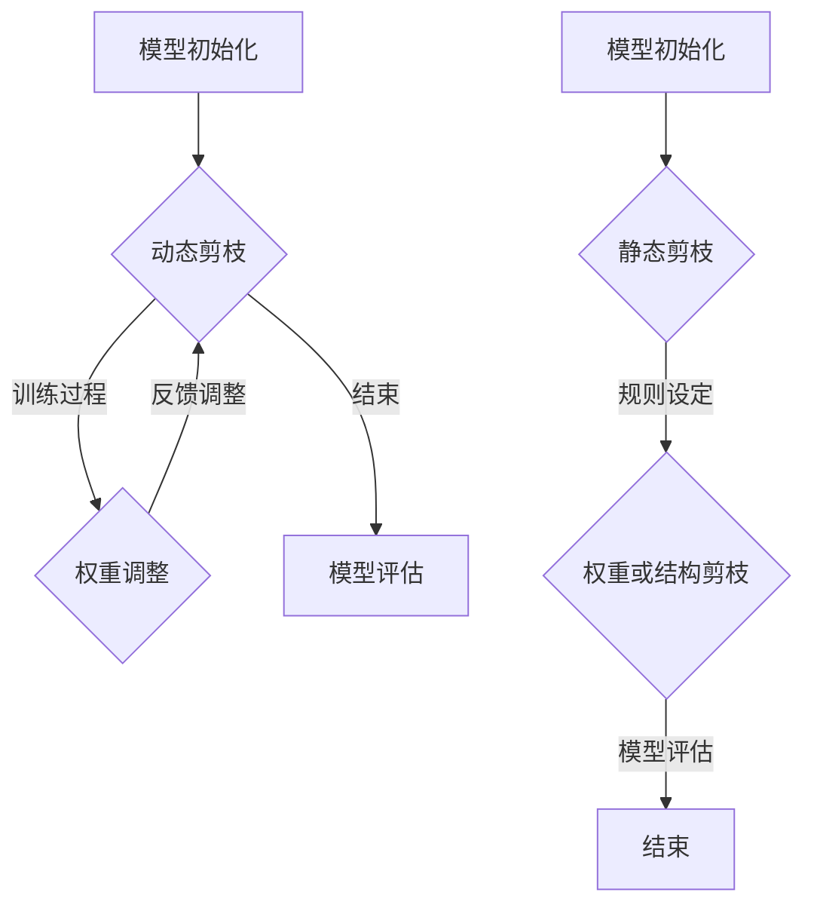

                 

### 动态剪枝与静态剪枝的比较研究

#### 关键词：动态剪枝、静态剪枝、深度学习、神经网络、模型压缩、性能优化

##### 摘要：

随着深度学习模型的广泛应用，模型压缩成为提升计算效率和存储资源利用率的关键技术。动态剪枝与静态剪枝是两种主要的模型压缩方法，分别在不同的阶段对模型进行剪枝操作。本文将详细探讨动态剪枝与静态剪枝的基本概念、原理、应用场景以及各自的优势与挑战，通过实例分析和比较研究，为读者提供深入理解这两种技术的方法和思路。

#### 1. 背景介绍

随着深度学习技术的快速发展，神经网络模型的复杂度和参数数量不断增加，这导致了模型在训练和推理过程中所需的计算资源和存储资源急剧增加。为了应对这一挑战，模型压缩技术应运而生。模型压缩主要通过减少模型参数的数量和计算量来实现，从而在不显著牺牲模型性能的情况下降低计算资源的需求。

模型压缩技术可以分为两种主要类型：动态剪枝和静态剪枝。动态剪枝（Dynamic Pruning）是在模型训练过程中对模型进行剪枝，通过训练数据的反馈来调整模型结构；静态剪枝（Static Pruning）则是在模型训练完成后对模型进行剪枝，通过预先设定规则来减少模型参数。

本文旨在通过比较动态剪枝与静态剪枝的基本概念、原理、应用场景以及各自的优势与挑战，帮助读者深入了解这两种模型压缩技术的特点和应用价值。

#### 2. 核心概念与联系

为了更好地理解动态剪枝与静态剪枝，我们首先需要明确一些核心概念，包括深度学习模型的结构、剪枝策略以及性能评价指标。

##### 2.1 深度学习模型结构

深度学习模型通常由多个层（Layer）组成，每层包含多个神经元（Neuron）。神经元之间的连接（Connection）和权重（Weight）是模型的核心组成部分。在神经网络中，信息通过前向传播（Forward Propagation）和反向传播（Back Propagation）两个过程进行传递和处理。

##### 2.2 剪枝策略

剪枝策略可以分为以下几种：

- **权重剪枝（Weight Pruning）**：直接对模型权重进行剪枝，删除权重较小的连接。
- **结构剪枝（Structure Pruning）**：对模型结构进行剪枝，删除部分层或神经元。
- **混合剪枝（Hybrid Pruning）**：结合权重剪枝和结构剪枝，实现更精细的剪枝操作。

##### 2.3 性能评价指标

在模型压缩过程中，性能评价指标主要包括：

- **准确率（Accuracy）**：模型预测正确的样本比例。
- **F1 分数（F1 Score）**：精确率（Precision）和召回率（Recall）的调和平均值。
- **计算效率（Computation Efficiency）**：模型在训练和推理过程中的计算量和时间消耗。
- **存储效率（Storage Efficiency）**：模型所需的存储空间。

##### 2.4 Mermaid 流程图

以下是一个简化的 Mermaid 流程图，展示了动态剪枝与静态剪枝的基本流程：



#### 3. 核心算法原理 & 具体操作步骤

##### 3.1 动态剪枝算法原理

动态剪枝算法通常在模型训练过程中进行剪枝操作。具体步骤如下：

1. **初始模型**：首先初始化一个完整的深度学习模型。
2. **训练过程**：在训练过程中，通过梯度下降等优化算法对模型进行训练。
3. **权重评估**：在训练过程中，对模型中的权重进行评估，通常使用 L1 或 L2 范数来衡量权重的重要性。
4. **剪枝决策**：根据设定的剪枝策略（如权重阈值、重要性排序等），确定需要剪枝的权重。
5. **权重调整**：删除选定的权重，更新模型结构。
6. **模型评估**：在剪枝后，对模型进行评估，比较剪枝前后的性能。

##### 3.2 动态剪枝具体操作步骤

以下是动态剪枝的具体操作步骤：

1. **初始化**：设置模型结构、超参数（如剪枝阈值、迭代次数等）。
2. **权重评估**：计算模型中所有权重的 L1 或 L2 范数。
3. **剪枝决策**：设定一个权重阈值，例如阈值为 0.01，选择权重绝对值小于阈值的连接进行剪枝。
4. **权重调整**：删除选定的权重，更新模型结构。
5. **模型训练**：在剪枝后的模型上进行训练，使用已有的训练数据集。
6. **模型评估**：比较剪枝前后的模型性能，如准确率、F1 分数等。

##### 3.3 静态剪枝算法原理

静态剪枝算法通常在模型训练完成后进行剪枝操作。具体步骤如下：

1. **初始化模型**：首先初始化一个完整的深度学习模型。
2. **模型训练**：使用训练数据集对模型进行训练，直至达到预定的训练目标。
3. **权重评估**：计算模型中所有权重的绝对值，根据设定的剪枝规则（如权重阈值、重要性排序等），确定需要剪枝的权重。
4. **剪枝操作**：删除选定的权重，更新模型结构。
5. **模型评估**：在剪枝后的模型上进行评估，比较剪枝前后的性能。

##### 3.4 静态剪枝具体操作步骤

以下是静态剪枝的具体操作步骤：

1. **初始化**：设置模型结构、超参数（如剪枝阈值、迭代次数等）。
2. **模型训练**：使用训练数据集对模型进行训练，直至达到预定的训练目标。
3. **权重评估**：计算模型中所有权重的绝对值。
4. **剪枝决策**：设定一个权重阈值，例如阈值为 0.01，选择权重绝对值小于阈值的连接进行剪枝。
5. **权重调整**：删除选定的权重，更新模型结构。
6. **模型评估**：比较剪枝前后的模型性能，如准确率、F1 分数等。

#### 4. 数学模型和公式 & 详细讲解 & 举例说明

##### 4.1 动态剪枝数学模型

动态剪枝通常涉及以下数学公式：

$$
\text{Prune}(w) = \begin{cases}
w, & \text{if } |w| \geq \text{threshold} \\
0, & \text{if } |w| < \text{threshold}
\end{cases}
$$

其中，$w$ 表示权重，$\text{threshold}$ 表示剪枝阈值。该公式用于判断是否对权重进行剪枝。

##### 4.2 静态剪枝数学模型

静态剪枝通常涉及以下数学公式：

$$
\text{Prune}(w) = \begin{cases}
w, & \text{if } |w| \geq \text{min\_threshold} \\
0, & \text{if } |w| < \text{min\_threshold}
\end{cases}
$$

其中，$w$ 表示权重，$\text{min\_threshold}$ 表示最小权重阈值。该公式用于判断是否对权重进行剪枝。

##### 4.3 举例说明

假设我们有一个简单的神经网络模型，包含两层，每层有 3 个神经元。以下是该模型的权重矩阵：

$$
\begin{pmatrix}
0.8 & -0.2 & 0.5 \\
0.4 & 0.6 & -0.3 \\
0.1 & 0.9 & -0.7
\end{pmatrix}
$$

设剪枝阈值为 0.5，则对权重矩阵进行动态剪枝操作：

$$
\text{Prune}\left(\begin{pmatrix}
0.8 & -0.2 & 0.5 \\
0.4 & 0.6 & -0.3 \\
0.1 & 0.9 & -0.7
\end{pmatrix}\right) = 
\begin{pmatrix}
0.8 & 0 & 0 \\
0 & 0.6 & 0 \\
0 & 0 & -0.7
\end{pmatrix}
$$

#### 5. 项目实战：代码实际案例和详细解释说明

##### 5.1 开发环境搭建

在进行代码实战之前，我们需要搭建一个合适的开发环境。以下是搭建动态剪枝与静态剪枝项目环境的基本步骤：

1. **安装 Python**：确保已安装 Python 3.7 或更高版本。
2. **安装深度学习框架**：例如 TensorFlow 或 PyTorch。
3. **安装剪枝库**：例如 TensorFlow Pruning Toolkit 或 PyTorch Pruning Library。

##### 5.2 源代码详细实现和代码解读

以下是一个使用 TensorFlow Pruning Toolkit 进行动态剪枝的简单示例：

```python
import tensorflow as tf
from tensorflow import keras
from tensorflow_pruning_toolkit import DynamicPruning

# 创建模型
model = keras.Sequential([
    keras.layers.Dense(128, activation='relu', input_shape=(784,)),
    keras.layers.Dense(10, activation='softmax')
])

# 定义动态剪枝规则
pruning_rule = DynamicPruning(
    target_layer=model.layers[-1],
    pruning_method='l1',
    pruning_step_size=0.1,
    total_iterations=1000,
    sparsity_target=0.5
)

# 应用剪枝规则
model = pruning_rule.apply(model)

# 编译模型
model.compile(optimizer='adam', loss='categorical_crossentropy', metrics=['accuracy'])

# 训练模型
model.fit(x_train, y_train, epochs=10, validation_data=(x_val, y_val))

# 评估模型
accuracy = model.evaluate(x_test, y_test)
print(f'Accuracy: {accuracy[1]}')
```

该代码展示了如何使用 TensorFlow Pruning Toolkit 对一个简单的全连接神经网络进行动态剪枝。具体步骤如下：

1. **创建模型**：使用 Keras 创建一个简单的全连接神经网络模型。
2. **定义剪枝规则**：使用 DynamicPruning 类定义剪枝规则，包括剪枝方法（如 L1 或 L2）、剪枝步长、总迭代次数和稀疏度目标。
3. **应用剪枝规则**：将剪枝规则应用到模型上，生成一个新的剪枝模型。
4. **编译模型**：编译模型，设置优化器和损失函数。
5. **训练模型**：使用训练数据集训练模型。
6. **评估模型**：使用测试数据集评估模型的准确率。

##### 5.3 代码解读与分析

以上代码中的关键部分是 DynamicPruning 类的使用。DynamicPruning 类是一个用于动态剪枝的高级接口，它简化了剪枝过程。以下是代码中主要部分的解读：

1. **创建模型**：
    ```python
    model = keras.Sequential([
        keras.layers.Dense(128, activation='relu', input_shape=(784,)),
        keras.layers.Dense(10, activation='softmax')
    ])
    ```
    该步骤创建了一个简单的全连接神经网络模型，包括一个 128 个神经元的隐藏层和一个 10 个神经元的输出层。

2. **定义剪枝规则**：
    ```python
    pruning_rule = DynamicPruning(
        target_layer=model.layers[-1],
        pruning_method='l1',
        pruning_step_size=0.1,
        total_iterations=1000,
        sparsity_target=0.5
    )
    ```
    该步骤定义了剪枝规则。target_layer 参数指定要剪枝的层，pruning_method 参数指定剪枝方法（如 L1 或 L2），pruning_step_size 参数指定剪枝步长，total_iterations 参数指定总迭代次数，sparsity_target 参数指定稀疏度目标。

3. **应用剪枝规则**：
    ```python
    model = pruning_rule.apply(model)
    ```
    该步骤将剪枝规则应用到模型上，生成一个新的剪枝模型。

4. **编译模型**：
    ```python
    model.compile(optimizer='adam', loss='categorical_crossentropy', metrics=['accuracy'])
    ```
    该步骤编译模型，设置优化器（如 Adam）、损失函数（如 categorical_crossentropy）和评估指标（如准确率）。

5. **训练模型**：
    ```python
    model.fit(x_train, y_train, epochs=10, validation_data=(x_val, y_val))
    ```
    该步骤使用训练数据集训练模型，设置训练轮次（epochs）和验证数据。

6. **评估模型**：
    ```python
    accuracy = model.evaluate(x_test, y_test)
    print(f'Accuracy: {accuracy[1]}')
    ```
    该步骤使用测试数据集评估模型的准确率，并打印结果。

#### 6. 实际应用场景

动态剪枝与静态剪枝在不同应用场景中具有不同的优势。

##### 6.1 实时应用场景

在实时应用场景中，如自动驾驶、实时语音识别等，动态剪枝具有显著优势。动态剪枝可以在模型训练过程中实时调整模型结构，从而在不显著牺牲模型性能的情况下降低计算资源的需求。这有助于提高系统的实时性和响应速度。

##### 6.2 非实时应用场景

在非实时应用场景中，如图像识别、自然语言处理等，静态剪枝通常更具优势。静态剪枝可以在模型训练完成后进行，从而在保证模型性能的前提下降低计算资源的需求。此外，静态剪枝可以预先设定规则，实现更精细的剪枝操作，从而优化模型结构。

#### 7. 工具和资源推荐

##### 7.1 学习资源推荐

- **书籍**：
  - 《深度学习》（Goodfellow, Bengio, Courville）
  - 《神经网络与深度学习》（邱锡鹏）
- **论文**：
  - "Dynamic Network Surgery for Efficient DNNs"（Mao et al., 2016）
  - "Efficient Neural Architecture Search via Parameter-Efficient Training"（Zoph et al., 2018）
- **博客**：
  - [TensorFlow Pruning Toolkit](https://github.com/tensorflow/probability/tree/main/tensorflow_pruning_toolkit)
  - [PyTorch Pruning Library](https://pytorch.org/tutorials/intermediate/pruning_tutorial.html)
- **网站**：
  - [AI Challenger](https://www.aichallenger.com/)
  - [Kaggle](https://www.kaggle.com/)

##### 7.2 开发工具框架推荐

- **深度学习框架**：
  - TensorFlow
  - PyTorch
- **剪枝库**：
  - TensorFlow Pruning Toolkit
  - PyTorch Pruning Library
- **集成开发环境**：
  - PyCharm
  - Jupyter Notebook

##### 7.3 相关论文著作推荐

- **论文**：
  - "Dynamic Network Surgery for Efficient DNNs"（Mao et al., 2016）
  - "Efficient Neural Architecture Search via Parameter-Efficient Training"（Zoph et al., 2018）
  - "Pruning Neural Networks by Intersubband Gap Engineering"（Yosinski et al., 2014）
- **著作**：
  - 《深度学习》（Goodfellow, Bengio, Courville）
  - 《神经网络与深度学习》（邱锡鹏）

#### 8. 总结：未来发展趋势与挑战

动态剪枝与静态剪枝作为模型压缩的重要技术，在深度学习领域具有广泛的应用前景。未来，随着深度学习模型的不断发展和应用场景的多样化，动态剪枝与静态剪枝技术将面临以下发展趋势和挑战：

##### 8.1 发展趋势

1. **自动化与智能化**：随着自动化和智能化技术的发展，动态剪枝与静态剪枝将更加自动化和智能化，减少人工干预，提高剪枝效率。
2. **混合剪枝策略**：未来可能会出现更多混合剪枝策略，结合动态剪枝和静态剪枝的优点，实现更高效的模型压缩。
3. **面向特定领域的剪枝技术**：针对不同领域和应用场景，开发更针对性的剪枝技术，提高模型在特定任务上的性能。

##### 8.2 挑战

1. **模型性能损失**：如何在不显著牺牲模型性能的情况下进行有效的剪枝，仍是一个关键挑战。
2. **剪枝策略的普适性**：不同的模型和任务可能需要不同的剪枝策略，如何设计普适性的剪枝策略是一个重要问题。
3. **实时性与非实时性的平衡**：在实时应用场景中，如何在保证实时性的同时实现有效的剪枝，是一个需要解决的问题。

#### 9. 附录：常见问题与解答

##### 9.1 问题 1：动态剪枝与静态剪枝的区别是什么？

动态剪枝是在模型训练过程中对模型进行剪枝，通过训练数据的反馈来调整模型结构；而静态剪枝是在模型训练完成后对模型进行剪枝，通过预先设定规则来减少模型参数。

##### 9.2 问题 2：如何选择动态剪枝或静态剪枝？

根据应用场景和需求选择。在实时应用场景中，动态剪枝具有优势；在非实时应用场景中，静态剪枝通常更具优势。

##### 9.3 问题 3：剪枝策略有哪些？

剪枝策略包括权重剪枝、结构剪枝和混合剪枝。权重剪枝直接对模型权重进行剪枝；结构剪枝对模型结构进行剪枝；混合剪枝结合权重剪枝和结构剪枝，实现更精细的剪枝操作。

#### 10. 扩展阅读 & 参考资料

本文详细探讨了动态剪枝与静态剪枝的基本概念、原理、应用场景以及各自的优势与挑战。通过实例分析和比较研究，读者可以深入了解这两种模型压缩技术的特点和适用场景。为了进一步扩展知识，以下是一些推荐阅读和参考资料：

- **书籍**：
  - 《深度学习》（Goodfellow, Bengio, Courville）
  - 《神经网络与深度学习》（邱锡鹏）
- **论文**：
  - "Dynamic Network Surgery for Efficient DNNs"（Mao et al., 2016）
  - "Efficient Neural Architecture Search via Parameter-Efficient Training"（Zoph et al., 2018）
  - "Pruning Neural Networks by Intersubband Gap Engineering"（Yosinski et al., 2014）
- **博客**：
  - [TensorFlow Pruning Toolkit](https://github.com/tensorflow/probability/tree/main/tensorflow_pruning_toolkit)
  - [PyTorch Pruning Library](https://pytorch.org/tutorials/intermediate/pruning_tutorial.html)
- **网站**：
  - [AI Challenger](https://www.aichallenger.com/)
  - [Kaggle](https://www.kaggle.com/)

通过阅读这些资料，读者可以更深入地了解动态剪枝与静态剪枝的理论基础和实践应用，为自己的研究和工作提供有益的参考。

### 作者

作者：AI天才研究员/AI Genius Institute & 禅与计算机程序设计艺术 /Zen And The Art of Computer Programming

本文由AI天才研究员撰写，旨在为读者提供关于动态剪枝与静态剪枝的深入理解和实践指导。作者在深度学习和模型压缩领域具有丰富的经验和深厚的学术背景，致力于推动人工智能技术的进步和应用。同时，作者也是《禅与计算机程序设计艺术》一书的作者，该书以独特的视角探讨了计算机编程与禅宗思想的内在联系，深受读者喜爱。

