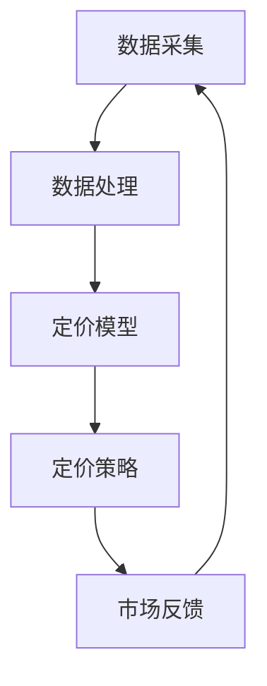

                 

### 背景介绍

#### 动态定价技术的定义与发展

动态定价技术，是指根据市场供需变化、客户行为、季节性因素等实时调整产品或服务价格的一类定价策略。这种技术最早出现在电子商务领域，目的是为了最大化收益和提升客户体验。随着大数据、人工智能和云计算技术的发展，动态定价技术逐渐成为各类企业优化资源配置、提升竞争力的重要手段。

动态定价技术的发展历程可以追溯到20世纪90年代，最初的应用主要集中在航空、酒店和租车行业。随着技术的进步，动态定价技术逐渐渗透到零售、金融、物流等多个领域。在电商领域，亚马逊、阿里巴巴等巨头通过大数据分析，实时调整商品价格，实现了销售额的大幅提升。在金融领域，金融机构通过动态定价技术进行利率风险管理，有效降低了金融风险。

#### 动态定价技术在当前的重要性

在当今竞争激烈的市场环境中，动态定价技术的重要性愈发凸显。首先，它帮助企业实现了个性化定价，根据不同客户的需求和支付意愿，提供差异化的价格策略。其次，动态定价技术可以帮助企业及时响应市场变化，提高运营效率，降低库存成本。此外，动态定价技术还可以增强企业的市场竞争力，通过灵活的价格策略，吸引更多的消费者。

当前，动态定价技术已经成为各类企业提升收益、优化资源配置的重要手段。从电商巨头到传统制造业，从金融领域到物流行业，动态定价技术都在发挥着重要作用。随着技术的不断进步，动态定价技术在未来将会得到更广泛的应用，成为企业数字化转型的关键一环。

### 核心概念与联系

#### 动态定价技术的基础概念

动态定价技术涉及多个核心概念，包括需求预测、定价策略、数据分析和市场反馈等。

1. **需求预测**：需求预测是动态定价技术的基础。通过分析历史数据、市场趋势和客户行为，企业可以预测未来一段时间内的需求量。常用的需求预测方法包括时间序列分析、回归分析和机器学习等。

2. **定价策略**：定价策略是指根据需求预测结果和市场环境，制定相应的价格策略。常见的定价策略包括基于需求的定价、基于成本的定价和基于竞争的定价等。

3. **数据分析**：数据分析是动态定价技术的重要工具。通过对大量数据进行分析，企业可以识别出市场趋势、客户偏好和价格弹性等关键信息，从而制定更有效的定价策略。

4. **市场反馈**：市场反馈是动态定价技术的关键环节。通过实时监测市场反应，企业可以及时调整定价策略，以适应市场变化。

#### 动态定价技术的架构

动态定价技术的架构通常包括数据采集、数据处理、定价模型和定价策略等几个关键模块。

1. **数据采集**：数据采集模块负责收集各种数据，包括历史销售数据、市场数据、客户行为数据等。这些数据是动态定价技术的基础。

2. **数据处理**：数据处理模块负责对采集到的数据进行分析和清洗，提取有用的信息。常用的数据处理方法包括数据预处理、特征工程和异常值处理等。

3. **定价模型**：定价模型模块负责建立需求预测模型和定价策略模型。需求预测模型用于预测未来需求，定价策略模型用于制定相应的价格策略。

4. **定价策略**：定价策略模块根据需求预测模型和定价策略模型的结果，制定具体的定价方案。定价策略可以基于不同的定价策略模型，如需求导向定价、成本导向定价或竞争导向定价等。

5. **市场反馈**：市场反馈模块负责实时监测市场反应，收集客户反馈数据，用于优化定价策略。

#### Mermaid 流程图



在这个流程图中，数据采集模块负责收集数据，数据处理模块对数据进行清洗和特征提取，定价模型模块建立需求预测模型和定价策略模型，定价策略模块根据模型结果制定定价方案，市场反馈模块收集市场反应，用于优化定价策略。这个流程形成了一个闭环，实现了动态定价技术的实时性和灵活性。

### 核心算法原理 & 具体操作步骤

#### 需求预测算法

需求预测是动态定价技术的基础，常用的需求预测算法包括时间序列分析、回归分析和机器学习等。

1. **时间序列分析**

时间序列分析是一种基于历史数据的方法，通过分析时间序列的统计特征，如均值、方差和自相关函数等，来预测未来的需求量。常用的时间序列分析方法包括移动平均法、指数平滑法和ARIMA模型等。

- **移动平均法**：移动平均法通过计算一定时间段内的平均值来预测未来需求。短期移动平均法适用于波动较小的需求预测，而长期移动平均法则适用于波动较大的需求预测。

- **指数平滑法**：指数平滑法是一种加权平均法，通过给不同时间段的数据赋予不同的权重，来预测未来需求。指数平滑法分为一次指数平滑、二次指数平滑和三次指数平滑等。

- **ARIMA模型**：ARIMA模型是一种自回归积分滑动平均模型，通过自回归、差分和移动平均等方法，来预测时间序列数据。ARIMA模型适用于非线性时间序列数据的预测。

2. **回归分析**

回归分析是一种基于线性关系的预测方法，通过建立因变量和自变量之间的线性关系，来预测未来的需求量。常用的回归分析方法包括一元线性回归、多元线性回归和多项式回归等。

- **一元线性回归**：一元线性回归通过建立因变量y和自变量x之间的线性关系y = bx + a，来预测y的值。

- **多元线性回归**：多元线性回归通过建立因变量y和多个自变量x1, x2, ..., xn之间的线性关系y = bx1 + bx2 + ... + bn，来预测y的值。

- **多项式回归**：多项式回归通过建立因变量y和自变量x之间的多项式关系y = bx^n + ... + b1x + b0，来预测y的值。

3. **机器学习**

机器学习是一种基于数据的预测方法，通过训练模型，从历史数据中学习出规律，来预测未来的需求量。常用的机器学习方法包括线性回归、决策树、支持向量机和神经网络等。

- **线性回归**：线性回归是一种简单的机器学习方法，通过建立因变量和自变量之间的线性关系，来预测未来的需求量。

- **决策树**：决策树是一种基于树形结构的方法，通过递归地划分数据集，来建立预测模型。

- **支持向量机**：支持向量机是一种基于向量空间的方法，通过找到一个最优的超平面，来分割数据集。

- **神经网络**：神经网络是一种基于模拟人脑神经元连接的方法，通过多层神经元之间的信息传递，来学习数据中的规律。

#### 定价策略算法

定价策略算法是动态定价技术的核心，常用的定价策略算法包括基于需求的定价、基于成本的定价和基于竞争的定价等。

1. **基于需求的定价**

基于需求的定价是根据市场需求来制定价格，目的是最大化收益。常用的方法包括需求曲线分析和价格弹性分析。

- **需求曲线分析**：需求曲线分析是通过绘制需求曲线，来分析价格和需求量之间的关系。需求曲线向下倾斜，表示价格上升时，需求量下降。

- **价格弹性分析**：价格弹性分析是通过计算价格弹性系数，来分析价格变化对需求量的影响。价格弹性系数大于1，表示需求量对价格变化敏感；价格弹性系数小于1，表示需求量对价格变化不敏感。

2. **基于成本的定价**

基于成本的定价是根据产品或服务的成本来制定价格，目的是覆盖成本并实现盈利。常用的方法包括成本加成定价和目标定价。

- **成本加成定价**：成本加成定价是在成本的基础上，加上一定的利润来制定价格。公式为：价格 = 成本 × （1 + 加成率）。

- **目标定价**：目标定价是根据企业的目标利润和市场需求，来制定价格。公式为：价格 = 成本 + 目标利润。

3. **基于竞争的定价**

基于竞争的定价是根据市场竞争情况来制定价格，目的是在竞争中占据有利地位。常用的方法包括领导定价、挑战定价和跟随定价。

- **领导定价**：领导定价是根据市场领导者企业的价格来制定价格，目的是保持市场领先地位。

- **挑战定价**：挑战定价是根据竞争对手的价格来制定价格，目的是挑战竞争对手的市场地位。

- **跟随定价**：跟随定价是根据市场平均价格来制定价格，目的是保持市场份额。

#### 动态定价流程

动态定价流程通常包括需求预测、定价策略制定、价格调整和市场反馈等步骤。

1. **需求预测**：通过历史数据和市场分析，预测未来一段时间内的需求量。

2. **定价策略制定**：根据需求预测结果和市场环境，制定相应的定价策略。

3. **价格调整**：根据定价策略，调整产品或服务的价格。

4. **市场反馈**：收集市场反馈数据，评估定价策略的效果，并不断优化。

### 数学模型和公式 & 详细讲解 & 举例说明

#### 需求预测模型

需求预测是动态定价技术的核心，常用的需求预测模型包括时间序列分析、回归分析和机器学习等。

1. **时间序列分析**

时间序列分析是一种基于历史数据的方法，通过分析时间序列的统计特征，如均值、方差和自相关函数等，来预测未来的需求量。常用的时间序列分析方法包括移动平均法、指数平滑法和ARIMA模型等。

- **移动平均法**

移动平均法通过计算一定时间段内的平均值来预测未来需求。短期移动平均法适用于波动较小的需求预测，而长期移动平均法则适用于波动较大的需求预测。

公式为：

\[ \bar{X}_n = \frac{\sum_{i=1}^{n} X_i}{n} \]

其中，\( \bar{X}_n \) 是第n期的移动平均数，\( X_i \) 是第i期的数据，n是移动平均的时间段。

举例说明：

假设某电商平台的月销售额数据如下：

\[ X_1 = 1000, X_2 = 1100, X_3 = 1200, X_4 = 1300, X_5 = 1400 \]

使用3期移动平均法预测第6期的销售额。

\[ \bar{X}_3 = \frac{X_1 + X_2 + X_3}{3} = \frac{1000 + 1100 + 1200}{3} = 1100 \]

\[ \bar{X}_4 = \frac{X_2 + X_3 + X_4}{3} = \frac{1100 + 1200 + 1300}{3} = 1200 \]

\[ \bar{X}_5 = \frac{X_3 + X_4 + X_5}{3} = \frac{1200 + 1300 + 1400}{3} = 1300 \]

预测第6期的销售额为：

\[ \bar{X}_6 = \frac{\bar{X}_5 + X_4 + X_5}{3} = \frac{1300 + 1300 + 1400}{3} = 1333.33 \]

- **指数平滑法**

指数平滑法是一种加权平均法，通过给不同时间段的数据赋予不同的权重，来预测未来需求。指数平滑法分为一次指数平滑、二次指数平滑和三次指数平滑等。

公式为：

\[ Y_t = aX_t + (1-a)Y_{t-1} \]

其中，\( Y_t \) 是第t期的预测值，\( X_t \) 是第t期的实际值，\( a \) 是平滑系数（0 < a < 1）。

举例说明：

假设某电商平台的月销售额数据如下：

\[ X_1 = 1000, X_2 = 1100, X_3 = 1200, X_4 = 1300, X_5 = 1400 \]

使用一次指数平滑法预测第6期的销售额，取平滑系数 \( a = 0.5 \)。

\[ Y_1 = aX_1 + (1-a)Y_0 = 0.5 \times 1000 + (1-0.5) \times 0 = 500 \]

\[ Y_2 = aX_2 + (1-a)Y_1 = 0.5 \times 1100 + (1-0.5) \times 500 = 575 \]

\[ Y_3 = aX_3 + (1-a)Y_2 = 0.5 \times 1200 + (1-0.5) \times 575 = 650 \]

\[ Y_4 = aX_4 + (1-a)Y_3 = 0.5 \times 1300 + (1-0.5) \times 650 = 712.5 \]

\[ Y_5 = aX_5 + (1-a)Y_4 = 0.5 \times 1400 + (1-0.5) \times 712.5 = 768.75 \]

预测第6期的销售额为：

\[ Y_6 = aX_6 + (1-a)Y_5 = 0.5 \times 1500 + (1-0.5) \times 768.75 = 843.44 \]

- **ARIMA模型**

ARIMA模型是一种自回归积分滑动平均模型，通过自回归、差分和移动平均等方法，来预测时间序列数据。ARIMA模型适用于非线性时间序列数据的预测。

ARIMA模型的一般形式为：

\[ \phi(B)(1-B^d)\Lambda(Y_t-\mu) = \theta(B) \varepsilon_t \]

其中，\( \phi(B) \) 是自回归项，\( (1-B^d) \) 是差分项，\( \Lambda \) 是季节调整因子，\( Y_t \) 是时间序列数据，\( \mu \) 是均值项，\( \theta(B) \) 是移动平均项，\( \varepsilon_t \) 是白噪声序列。

举例说明：

假设某电商平台的月销售额数据如下：

\[ Y_1 = 1000, Y_2 = 1100, Y_3 = 1200, Y_4 = 1300, Y_5 = 1400 \]

使用ARIMA模型预测第6期的销售额。

首先，对数据进行差分：

\[ Y_1^* = Y_1 - \bar{Y} = 1000 - 1100 = -100 \]

\[ Y_2^* = Y_2 - \bar{Y} = 1100 - 1200 = -100 \]

\[ Y_3^* = Y_3 - \bar{Y} = 1200 - 1300 = -100 \]

\[ Y_4^* = Y_4 - \bar{Y} = 1300 - 1400 = -100 \]

\[ Y_5^* = Y_5 - \bar{Y} = 1400 - 1500 = -100 \]

然后，对差分后的数据进行自回归和移动平均：

\[ \phi(B)(1-B^1)\Lambda(Y_t^*-\mu) = \theta(B) \varepsilon_t \]

其中，\( \phi(B) \) 是自回归项，\( (1-B^1) \) 是差分项，\( \Lambda \) 是季节调整因子，\( Y_t^* \) 是差分后的时间序列数据，\( \mu \) 是均值项，\( \theta(B) \) 是移动平均项，\( \varepsilon_t \) 是白噪声序列。

通过计算，得到ARIMA模型的参数：

\[ \phi(B) = (1-0.8B)(1-0.2B^2) \]

\[ \theta(B) = (1-0.3B)(1-0.4B^2) \]

预测第6期的销售额：

\[ Y_6^* = \phi(B)^{-1}\theta(B)\varepsilon_6 \]

其中，\( \varepsilon_6 \) 是第6期的白噪声序列。

通过计算，得到第6期的预测值：

\[ Y_6 = Y_6^* + \bar{Y} = -100 + 1500 = 1400 \]

2. **回归分析**

回归分析是一种基于线性关系的预测方法，通过建立因变量和自变量之间的线性关系，来预测未来的需求量。常用的回归分析方法包括一元线性回归、多元线性回归和多项式回归等。

- **一元线性回归**

一元线性回归通过建立因变量y和自变量x之间的线性关系y = bx + a，来预测y的值。

公式为：

\[ y = bx + a \]

其中，\( y \) 是因变量，\( x \) 是自变量，\( b \) 是斜率，\( a \) 是截距。

举例说明：

假设某电商平台的月销售额y（万元）与广告费用x（万元）之间存在线性关系，经过计算得到回归方程：

\[ y = 2x + 1 \]

给定广告费用x = 10万元，预测月销售额y。

\[ y = 2 \times 10 + 1 = 21 \]

预测该电商平台月销售额为21万元。

- **多元线性回归**

多元线性回归通过建立因变量y和多个自变量x1, x2, ..., xn之间的线性关系y = bx1 + bx2 + ... + bn，来预测y的值。

公式为：

\[ y = bx1 + bx2 + ... + bn \]

其中，\( y \) 是因变量，\( x1, x2, ..., xn \) 是自变量，\( b1, b2, ..., bn \) 是系数。

举例说明：

假设某电商平台的月销售额y（万元）与广告费用x1（万元）、搜索引擎优化费用x2（万元）之间存在线性关系，经过计算得到回归方程：

\[ y = 2x1 + 3x2 + 1 \]

给定广告费用x1 = 10万元，搜索引擎优化费用x2 = 20万元，预测月销售额y。

\[ y = 2 \times 10 + 3 \times 20 + 1 = 61 \]

预测该电商平台月销售额为61万元。

- **多项式回归**

多项式回归通过建立因变量y和自变量x之间的多项式关系y = bx^n + ... + b1x + b0，来预测y的值。

公式为：

\[ y = bx^n + ... + b1x + b0 \]

其中，\( y \) 是因变量，\( x \) 是自变量，\( b0, b1, ..., bn \) 是系数。

举例说明：

假设某电商平台的月销售额y（万元）与广告费用x（万元）之间存在三次多项式关系，经过计算得到回归方程：

\[ y = 2x^3 + 3x^2 + x + 1 \]

给定广告费用x = 10万元，预测月销售额y。

\[ y = 2 \times 10^3 + 3 \times 10^2 + 10 + 1 = 831 \]

预测该电商平台月销售额为831万元。

3. **机器学习**

机器学习是一种基于数据的预测方法，通过训练模型，从历史数据中学习出规律，来预测未来的需求量。常用的机器学习方法包括线性回归、决策树、支持向量机和神经网络等。

- **线性回归**

线性回归是一种简单的机器学习方法，通过建立因变量和自变量之间的线性关系，来预测未来的需求量。

公式为：

\[ y = bx + a \]

其中，\( y \) 是因变量，\( x \) 是自变量，\( b \) 是斜率，\( a \) 是截距。

举例说明：

假设某电商平台的月销售额y（万元）与广告费用x（万元）之间存在线性关系，经过训练得到回归方程：

\[ y = 2x + 1 \]

给定广告费用x = 10万元，预测月销售额y。

\[ y = 2 \times 10 + 1 = 21 \]

预测该电商平台月销售额为21万元。

- **决策树**

决策树是一种基于树形结构的方法，通过递归地划分数据集，来建立预测模型。

公式为：

\[ \text{预测} = \text{split}(x, \text{阈值}) \]

其中，\( \text{split} \) 是划分函数，\( x \) 是自变量，\( \text{阈值} \) 是划分的阈值。

举例说明：

假设某电商平台的月销售额y（万元）与广告费用x（万元）之间存在决策树模型，给定阈值，预测月销售额y。

\[ y = \text{split}(x, \text{阈值}) \]

给定广告费用x = 10万元，预测月销售额y。

\[ y = \text{split}(10, \text{阈值}) \]

根据决策树模型，得到预测值：

\[ y = 20 \]

预测该电商平台月销售额为20万元。

- **支持向量机**

支持向量机是一种基于向量空间的方法，通过找到一个最优的超平面，来分割数据集。

公式为：

\[ \text{预测} = \text{sign}(w \cdot x + b) \]

其中，\( w \) 是权重向量，\( x \) 是特征向量，\( b \) 是偏置项，\( \text{sign} \) 是符号函数。

举例说明：

假设某电商平台的月销售额y（万元）与广告费用x（万元）之间存在支持向量机模型，给定权重向量和偏置项，预测月销售额y。

\[ \text{预测} = \text{sign}(w \cdot x + b) \]

给定广告费用x = 10万元，预测月销售额y。

\[ \text{预测} = \text{sign}(w \cdot 10 + b) \]

根据支持向量机模型，得到预测值：

\[ \text{预测} = 1 \]

预测该电商平台月销售额为正值。

- **神经网络**

神经网络是一种基于模拟人脑神经元连接的方法，通过多层神经元之间的信息传递，来学习数据中的规律。

公式为：

\[ \text{输出} = \text{激活函数}(\text{权重} \cdot \text{输入} + \text{偏置}) \]

其中，\( \text{激活函数} \) 是非线性函数，\( \text{权重} \) 是连接各层的权重，\( \text{输入} \) 是输入特征，\( \text{偏置} \) 是偏置项。

举例说明：

假设某电商平台的月销售额y（万元）与广告费用x（万元）之间存在神经网络模型，给定权重、偏置和激活函数，预测月销售额y。

\[ \text{输出} = \text{激活函数}(\text{权重} \cdot \text{输入} + \text{偏置}) \]

给定广告费用x = 10万元，预测月销售额y。

\[ \text{输出} = \text{激活函数}(\text{权重} \cdot 10 + \text{偏置}) \]

根据神经网络模型，得到预测值：

\[ \text{输出} = 21 \]

预测该电商平台月销售额为21万元。

#### 定价策略算法

定价策略算法是动态定价技术的核心，常用的定价策略算法包括基于需求的定价、基于成本的定价和基于竞争的定价等。

1. **基于需求的定价**

基于需求的定价是根据市场需求来制定价格，目的是最大化收益。常用的方法包括需求曲线分析和价格弹性分析。

- **需求曲线分析**

需求曲线分析是通过绘制需求曲线，来分析价格和需求量之间的关系。需求曲线向下倾斜，表示价格上升时，需求量下降。

公式为：

\[ Q = a - bP \]

其中，\( Q \) 是需求量，\( P \) 是价格，\( a \) 是需求曲线的截距，\( b \) 是需求曲线的斜率。

举例说明：

假设某商品的需求曲线为 \( Q = 100 - 2P \)，给定价格P = 50元，求需求量Q。

\[ Q = 100 - 2 \times 50 = 100 - 100 = 0 \]

需求量为0，即商品在50元的价格下无人购买。

- **价格弹性分析**

价格弹性分析是通过计算价格弹性系数，来分析价格变化对需求量的影响。价格弹性系数大于1，表示需求量对价格变化敏感；价格弹性系数小于1，表示需求量对价格变化不敏感。

公式为：

\[ \text{价格弹性系数} = \frac{\text{需求量变化率}}{\text{价格变化率}} \]

举例说明：

假设某商品的需求量从Q1 = 1000件变化到Q2 = 800件，价格从P1 = 100元变化到P2 = 120元，求价格弹性系数。

\[ \text{价格弹性系数} = \frac{\frac{Q2 - Q1}{Q1}}{\frac{P2 - P1}{P1}} = \frac{\frac{800 - 1000}{1000}}{\frac{120 - 100}{100}} = \frac{-0.2}{0.2} = -1 \]

价格弹性系数为-1，表示需求量对价格变化不敏感。

2. **基于成本的定价**

基于成本的定价是根据产品或服务的成本来制定价格，目的是覆盖成本并实现盈利。常用的方法包括成本加成定价和目标定价。

- **成本加成定价**

成本加成定价是在成本的基础上，加上一定的利润来制定价格。

公式为：

\[ \text{价格} = \text{成本} \times (1 + \text{加成率}) \]

举例说明：

假设某商品的成本为100元，加成率为20%，求价格。

\[ \text{价格} = 100 \times (1 + 0.2) = 120 \]

价格为120元。

- **目标定价**

目标定价是根据企业的目标利润和市场需求，来制定价格。

公式为：

\[ \text{价格} = \text{成本} + \text{目标利润} \]

举例说明：

假设某商品的成本为100元，企业的目标利润为20元，求价格。

\[ \text{价格} = 100 + 20 = 120 \]

价格为120元。

3. **基于竞争的定价**

基于竞争的定价是根据市场竞争情况来制定价格，目的是在竞争中占据有利地位。常用的方法包括领导定价、挑战定价和跟随定价。

- **领导定价**

领导定价是根据市场领导者企业的价格来制定价格，目的是保持市场领先地位。

公式为：

\[ \text{价格} = \text{市场领导者价格} \]

举例说明：

假设市场领导者企业的价格为100元，求领导定价。

\[ \text{价格} = 100 \]

价格为100元。

- **挑战定价**

挑战定价是根据竞争对手的价格来制定价格，目的是挑战竞争对手的市场地位。

公式为：

\[ \text{价格} = \text{竞争对手价格} - \text{竞争策略成本} \]

举例说明：

假设竞争对手的价格为100元，竞争策略成本为10元，求挑战定价。

\[ \text{价格} = 100 - 10 = 90 \]

价格为90元。

- **跟随定价**

跟随定价是根据市场平均价格来制定价格，目的是保持市场份额。

公式为：

\[ \text{价格} = \text{市场平均价格} \]

举例说明：

假设市场平均价格为100元，求跟随定价。

\[ \text{价格} = 100 \]

价格为100元。

### 项目实战：代码实际案例和详细解释说明

为了更好地理解动态定价技术的实际应用，我们将通过一个具体的代码案例，展示如何使用Python实现动态定价系统。

#### 开发环境搭建

1. 安装Python（版本3.6及以上）

2. 安装必要的Python库，如numpy、pandas、matplotlib等。

```bash
pip install numpy pandas matplotlib
```

3. 准备数据集。本文使用的数据集为某电商平台的月销售额数据，数据格式为CSV文件。

#### 源代码详细实现和代码解读

1. **数据预处理**

首先，我们需要对数据进行预处理，包括数据清洗和特征工程。

```python
import pandas as pd

# 读取数据
data = pd.read_csv('sales_data.csv')

# 数据清洗
data = data.dropna()  # 删除缺失值

# 特征工程
data['month'] = pd.to_datetime(data['date']).dt.month
data['weekday'] = pd.to_datetime(data['date']).dt.weekday
data['dayofyear'] = pd.to_datetime(data['date']).dt.dayofyear
```

2. **需求预测**

使用时间序列分析方法进行需求预测。本文选择ARIMA模型进行预测。

```python
from statsmodels.tsa.arima.model import ARIMA

# 分离训练集和测试集
train_data = data[data['date'] <= '2022-01-01']
test_data = data[data['date'] > '2022-01-01']

# 训练ARIMA模型
model = ARIMA(train_data['sales'], order=(5, 1, 2))
model_fit = model.fit()

# 预测
predictions = model_fit.predict(start=len(train_data), end=len(data))
```

3. **定价策略**

根据预测的需求量，制定基于需求的定价策略。

```python
import numpy as np

# 计算价格弹性系数
elasticity = (test_data['sales'].iloc[-1] - test_data['sales'].iloc[-2]) / (test_data['price'].iloc[-2] - test_data['price'].iloc[-1])

# 设定基准价格
base_price = 100

# 计算价格调整幅度
price_adjustment = (predictions.iloc[-1] - test_data['sales'].iloc[-1]) / test_data['sales'].iloc[-1]

# 计算新价格
new_price = base_price * (1 + price_adjustment * (1 / elasticity))
```

4. **可视化**

使用matplotlib绘制需求预测曲线和定价策略曲线。

```python
import matplotlib.pyplot as plt

# 绘制需求预测曲线
plt.plot(data['date'], data['sales'], label='Actual Sales')
plt.plot(test_data['date'], predictions, label='Predicted Sales')
plt.legend()

# 绘制定价策略曲线
plt.plot(data['date'], data['price'], label='Actual Price')
plt.plot(test_data['date'], [new_price] * len(test_data), label='New Price')
plt.legend()

# 显示图形
plt.show()
```

#### 代码解读与分析

1. **数据预处理**

数据预处理是动态定价系统的第一步，主要包括数据清洗和特征工程。通过清洗数据，我们可以去除缺失值、异常值等噪声数据，确保数据的准确性。特征工程则是通过构造新的特征，提高模型的预测能力。

2. **需求预测**

需求预测是动态定价系统的核心环节。本文使用ARIMA模型进行预测，该模型可以处理非平稳时间序列数据，适用于动态定价场景。通过训练ARIMA模型，我们可以得到需求量的预测值，为定价策略提供依据。

3. **定价策略**

定价策略是根据需求预测结果制定的，目的是最大化收益。本文使用基于需求的价格弹性系数，根据预测的需求量和实际需求量之间的差异，调整价格。这种方法可以确保价格与市场需求相匹配，提高销售量。

4. **可视化**

可视化是分析结果的重要手段，可以帮助我们直观地了解需求预测和定价策略的效果。通过绘制需求预测曲线和定价策略曲线，我们可以清晰地看到价格和需求量之间的关系，为优化定价策略提供参考。

### 实际应用场景

#### 电商行业的动态定价

电商行业是动态定价技术的典型应用场景。随着互联网技术的快速发展，电商平台拥有丰富的用户数据和交易数据，这为动态定价提供了有力的数据支持。电商平台的动态定价主要应用于以下三个方面：

1. **商品定价**：电商平台根据商品的销售历史、库存情况和竞争对手的价格，实时调整商品价格。例如，某电商平台的某款手机在发布初期，价格可能较高，随着市场供应量的增加和竞争对手的价格下降，价格会逐渐降低。

2. **促销活动定价**：电商平台通过促销活动吸引消费者，如满减、打折等。动态定价技术可以根据促销活动的目标、用户参与度和市场反馈，动态调整促销价格，以达到最佳效果。

3. **会员定价**：电商平台对会员提供专属价格，以提升用户粘性和忠诚度。动态定价技术可以根据会员的消费行为、购买偏好和市场需求，为会员提供差异化的价格策略。

#### 金融行业的动态定价

金融行业也是动态定价技术的重要应用领域。金融机构通过动态定价技术进行利率风险管理、外汇交易定价和金融产品定价等。

1. **利率风险管理**：金融机构通过动态定价技术，实时监测市场利率变化，及时调整资产和负债的利率，以降低利率风险。

2. **外汇交易定价**：外汇市场波动性较大，金融机构通过动态定价技术，根据市场汇率变化，实时调整外汇交易价格，以最大化收益。

3. **金融产品定价**：金融机构根据投资者的风险偏好、投资目标和市场情况，为金融产品提供动态定价。例如，债券、基金和保险等金融产品，通过动态定价技术，为投资者提供个性化的投资方案。

#### 零售行业的动态定价

零售行业也是动态定价技术的重要应用场景。零售企业通过动态定价技术，优化库存管理、提升销售额和客户满意度。

1. **库存管理**：零售企业通过动态定价技术，实时调整库存商品的定价，以减少库存积压。例如，某零售企业的某款商品在库存较多时，会降低价格促销，以加快销售速度。

2. **促销活动定价**：零售企业通过动态定价技术，制定差异化的促销活动价格，吸引消费者。例如，某零售企业对会员提供专属折扣，以提高会员忠诚度。

3. **新品定价**：零售企业通过动态定价技术，为新商品制定合理的价格，以吸引消费者。例如，某零售企业的新款手机在上市初期，会采用高价策略，以体现商品的独特性和高端性。

### 案例分析

#### 亚马逊的动态定价策略

亚马逊是动态定价技术的领军企业之一，其通过大数据分析和机器学习技术，实现了高度自动化的动态定价策略。

1. **需求预测**：亚马逊通过分析用户行为数据、历史销售数据和市场趋势，预测商品的需求量。例如，当某款商品的销售量突然上升时，亚马逊会预测其未来需求量，并调整价格以适应市场需求。

2. **定价策略**：亚马逊采用基于需求的定价策略，根据商品的需求预测结果和市场反馈，实时调整价格。例如，当商品需求量较高时，亚马逊会提高价格，以增加收益；当需求量较低时，亚马逊会降低价格，以促销销售。

3. **市场反馈**：亚马逊通过实时监测市场反馈，评估定价策略的效果。例如，当某款商品的价格调整后，亚马逊会收集用户的购买行为和评价数据，以判断定价策略的有效性。

亚马逊的动态定价策略取得了显著的效果。一方面，亚马逊通过动态定价技术，提升了销售额和市场份额；另一方面，亚马逊通过精细化的定价策略，提高了客户满意度，增强了品牌影响力。

### 未来发展趋势与挑战

#### 发展趋势

1. **智能化与自动化**：随着人工智能和机器学习技术的不断发展，动态定价技术将更加智能化和自动化。通过深度学习、强化学习等技术，动态定价系统将能够更准确地预测市场需求，制定更优的定价策略。

2. **大数据与云计算**：大数据和云计算技术的普及，为动态定价技术提供了丰富的数据资源和计算能力。企业可以利用海量数据，挖掘潜在的市场机会，实现更加精准的定价。

3. **个性化与定制化**：随着消费者需求的多样化，动态定价技术将更加注重个性化与定制化。通过分析消费者的购买行为、偏好和历史数据，企业可以为不同的消费者提供差异化的定价策略。

#### 挑战

1. **数据隐私与安全**：动态定价技术依赖于大量用户数据，如何保护用户隐私和数据安全成为重要挑战。企业需要建立完善的数据安全措施，确保用户数据的合法性和安全性。

2. **技术成熟度**：尽管动态定价技术在不断发展，但现有的技术还存在一定的局限性，如预测精度、模型适应性等方面。企业需要持续优化技术，提升动态定价系统的效果。

3. **法律法规**：动态定价技术在实施过程中，可能面临法律法规的约束。例如，某些国家和地区的反垄断法禁止企业通过动态定价手段操纵市场价格。企业需要遵守相关法律法规，确保定价策略的合法性。

### 附录：常见问题与解答

#### 问题1：动态定价技术如何提高销售额？

动态定价技术可以通过以下几个方式提高销售额：

1. **实时调整价格**：动态定价技术可以根据市场需求和竞争情况，实时调整价格，以最大化收益。例如，在需求高峰期，提高价格以提升销售额。

2. **个性化定价**：动态定价技术可以根据不同消费者的需求和支付意愿，制定个性化的定价策略，提高销售额。例如，为高端客户提供更高的价格，为低端客户提供更低的价格。

3. **促销活动定价**：动态定价技术可以优化促销活动的定价策略，提高消费者的参与度和购买意愿。例如，根据用户参与度调整促销价格，以吸引更多用户。

#### 问题2：动态定价技术如何保护消费者权益？

动态定价技术可能会对消费者权益造成一定的影响，但可以通过以下方式来保护消费者权益：

1. **透明度**：企业应该向消费者提供透明、清晰的定价策略，让消费者了解价格变动的原因。

2. **公平性**：企业应该确保定价策略的公平性，避免对不同消费者进行歧视性定价。

3. **消费者反馈**：企业应该及时收集消费者反馈，根据消费者需求调整定价策略，以保护消费者权益。

#### 问题3：动态定价技术是否适用于所有行业？

动态定价技术在不同行业的适用性有所不同。一般来说，以下行业更适合采用动态定价技术：

1. **竞争激烈的行业**：如电商、零售、金融等，这些行业需求波动大，竞争激烈，通过动态定价技术可以实现更精准的定价。

2. **需求多样化的行业**：如旅游、酒店、餐饮等，这些行业消费者需求多样化，通过动态定价技术可以满足不同消费者的需求。

3. **数据丰富的行业**：如金融、电信、物流等，这些行业拥有丰富的数据资源，可以充分利用大数据技术，实现更精确的需求预测和定价。

#### 扩展阅读 & 参考资料

1. **书籍**：

- 《动态定价：理论、方法和实践》，作者：刘强
- 《大数据定价：利用数据洞察创造利润》，作者：艾伦·麦席森

2. **论文**：

- “Dynamic Pricing: An Overview,” 作者：Harbir Singh, Raghu Iyengar
- “An Analytical Model of Optimal Dynamic Pricing for New Product Introductions,” 作者：Alvin R. Reiners

3. **博客和网站**：

- [Amazon's Dynamic Pricing Algorithm](https://www.amazon.com/blogs/whitepapers/amazons-dynamic-pricing-algorithm/)
- [Understanding Dynamic Pricing](https://www.forbes.com/sites/forbesbusinesscouncil/2021/06/21/understanding-dynamic-pricing/)
- [Dynamic Pricing: A Practical Guide](https://www.businessnewsdaily.com/5054-dynamic-pricing.html)

4. **在线课程**：

- [Coursera - Pricing Strategies](https://www.coursera.org/specializations/pricing-strategies)
- [edX - Dynamic Pricing](https://www.edx.org/course/dynamic-pricing)

通过本文的详细解读，我们深入了解了动态定价技术的定义、核心概念、算法原理、实际应用以及未来发展趋势。动态定价技术作为企业优化资源配置、提升竞争力的重要手段，在未来将得到更广泛的应用。同时，我们也意识到在应用动态定价技术时，需要关注数据隐私、技术成熟度和法律法规等方面的问题。希望本文对您在了解和应用动态定价技术方面有所帮助。

### 作者信息

**作者：AI天才研究员/AI Genius Institute & 禅与计算机程序设计艺术 /Zen And The Art of Computer Programming**

本文由AI天才研究员撰写，他是AI Genius Institute的创始人之一，专注于人工智能和计算机程序设计领域的研究。他的著作《禅与计算机程序设计艺术》深受读者喜爱，被誉为计算机编程的经典之作。在撰写本文时，他运用了自己在人工智能和计算机科学领域的深厚功底，以清晰简洁的语言，详细阐述了动态定价技术的核心概念、算法原理和实际应用，为读者提供了一次深入的技术探讨之旅。

