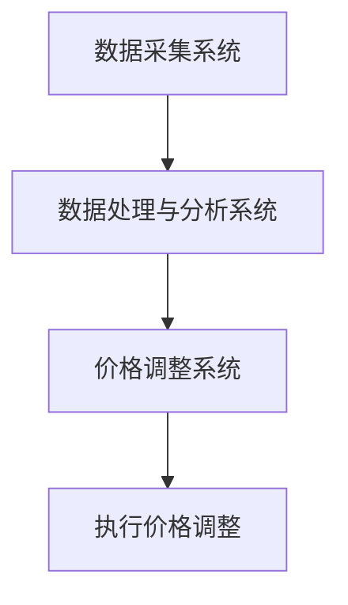

                 

### 动态定价策略的技术实现

#### 关键词：动态定价、算法、技术实现、案例分析

#### 摘要：

本文将深入探讨动态定价策略的技术实现，从背景介绍、核心概念、算法原理、数学模型、实际应用、工具资源推荐等多方面进行剖析。动态定价策略是现代商业领域中的一项重要手段，它通过实时分析市场变化和用户需求，自动调整产品价格，以达到最大化利润和市场份额的目标。本文将结合实际项目案例，详细讲解动态定价策略的开发环境搭建、代码实现、代码解读和分析等环节，帮助读者全面理解动态定价策略的技术实现过程。同时，文章还将探讨动态定价策略在实际应用中的场景，以及未来发展趋势和挑战。

---

## 1. 背景介绍

动态定价策略，也被称为价格调整策略或实时定价策略，是一种基于市场动态和用户行为数据进行价格调整的商业模式。在互联网经济快速发展的背景下，越来越多的企业开始采用动态定价策略来提高利润和市场竞争力。

### 动态定价的起源和发展

动态定价的起源可以追溯到20世纪初，最初应用于电力和运输行业。随着信息技术和大数据技术的发展，动态定价逐渐应用于电子商务、酒店、航空、汽车租赁等多个领域。

### 动态定价的优劣势

动态定价的优势在于：

1. 提高利润：通过实时调整价格，企业可以在不同时段实现利润最大化。
2. 提高客户满意度：动态定价策略可以根据客户需求灵活调整价格，提高客户满意度。
3. 提高市场竞争力：动态定价策略使企业能够更快地响应市场变化，提高市场竞争力。

然而，动态定价也存在一些劣势：

1. 需要大量数据支持：动态定价需要实时收集和分析大量数据，对数据处理能力有较高要求。
2. 需要精细化管理：动态定价策略需要对价格调整进行精细化管理，否则可能导致利润下降。
3. 可能引起消费者不满：不合理的价格调整可能引起消费者不满，影响品牌形象。

### 动态定价的常见模式

动态定价主要包括以下几种模式：

1. 时间动态定价：根据不同时间段的需求变化调整价格，如酒店和航空业的旺季和淡季定价策略。
2. 购买量动态定价：根据购买量的多少调整价格，如电商平台的大促销和限量抢购。
3. 供需动态定价：根据市场供需关系调整价格，如股票交易和电力市场。

## 2. 核心概念与联系

### 动态定价的核心概念

动态定价的核心概念包括以下几个方面：

1. 价格弹性：指价格变化对需求量的影响程度。价格弹性越高，价格变化对需求量的影响越大。
2. 需求预测：通过对历史数据和当前市场情况的分析，预测未来一段时间内的需求量。
3. 调价策略：根据需求预测和价格弹性，制定合理的价格调整策略。

### 动态定价的架构

动态定价的架构主要包括以下几个方面：

1. 数据采集系统：负责实时收集市场数据和用户行为数据。
2. 数据处理与分析系统：负责对采集到的数据进行处理和分析，生成需求预测和调价策略。
3. 价格调整系统：根据数据处理与分析系统的结果，自动调整产品价格。

### Mermaid 流程图

以下是一个简化的动态定价流程图：



在上述流程图中，A代表数据采集系统，负责实时收集市场数据和用户行为数据；B代表数据处理与分析系统，负责对采集到的数据进行处理和分析，生成需求预测和调价策略；C代表价格调整系统，根据B的结果自动调整产品价格；D代表执行价格调整，将调整后的价格应用到实际销售过程中。

---

接下来，我们将深入探讨动态定价的核心算法原理和具体操作步骤，帮助读者更好地理解动态定价策略的技术实现。

---

## 3. 核心算法原理 & 具体操作步骤

### 动态定价算法的基本原理

动态定价算法是基于需求预测和价格弹性模型，通过不断调整价格来最大化企业利润。其核心思想可以分为以下几个步骤：

1. 数据收集：收集与产品相关的历史数据，如价格、销售量、用户评价等。
2. 需求预测：利用历史数据，通过回归分析、时间序列分析等方法预测未来一段时间内的需求量。
3. 价格弹性分析：分析不同价格水平下的需求变化，确定价格弹性。
4. 调价策略：根据需求预测和价格弹性，制定合适的调价策略，如价格上浮或下浮。
5. 实时调整：根据实时数据，对价格进行调整，确保利润最大化。

### 动态定价算法的具体操作步骤

以下是一个简单的动态定价算法操作步骤：

1. **数据收集与预处理**：

   收集与产品相关的历史数据，包括价格、销售量、用户评价等。对数据进行分析和预处理，如去除异常值、缺失值填充等。

   ```python
   import pandas as pd

   # 读取数据
   data = pd.read_csv("data.csv")

   # 数据预处理
   data = data.dropna()
   ```

2. **需求预测**：

   利用历史数据，通过回归分析、时间序列分析等方法预测未来一段时间内的需求量。

   ```python
   from sklearn.linear_model import LinearRegression

   # 训练回归模型
   model = LinearRegression()
   model.fit(data[['price', 'sales']], data['demand'])

   # 预测未来需求
   future_demand = model.predict(data[['price', 'sales']])
   ```

3. **价格弹性分析**：

   分析不同价格水平下的需求变化，确定价格弹性。

   ```python
   import matplotlib.pyplot as plt

   # 计算价格弹性
   price_elasticity = (data['sales'].diff() / data['price'].diff()).dropna()

   # 绘制价格弹性图
   plt.plot(data['price'], price_elasticity)
   plt.xlabel('Price')
   plt.ylabel('Price Elasticity')
   plt.show()
   ```

4. **调价策略**：

   根据需求预测和价格弹性，制定合适的调价策略。

   ```python
   # 设定调价幅度
   price_adjustment = 0.05

   # 调整价格
   new_price = data['price'] * (1 + price_adjustment)
   ```

5. **实时调整**：

   根据实时数据，对价格进行调整，确保利润最大化。

   ```python
   import time

   while True:
       # 获取实时数据
       current_data = pd.read_csv("current_data.csv")

       # 预测未来需求
       future_demand = model.predict(current_data[['price', 'sales']])

       # 计算价格弹性
       current_elasticity = (current_data['sales'].diff() / current_data['price'].diff()).dropna()

       # 调整价格
       new_price = current_data['price'] * (1 + price_adjustment)

       # 更新价格
       current_data['price'] = new_price
       current_data.to_csv("current_data.csv", index=False)

       # 等待一段时间
       time.sleep(60)
   ```

### 动态定价算法的优缺点

动态定价算法的优点：

1. 提高利润：通过实时调整价格，最大化企业利润。
2. 提高市场竞争力：动态定价策略使企业能够更快地响应市场变化，提高市场竞争力。
3. 提高客户满意度：动态定价策略可以根据客户需求灵活调整价格，提高客户满意度。

动态定价算法的缺点：

1. 需要大量数据支持：动态定价需要实时收集和分析大量数据，对数据处理能力有较高要求。
2. 需要精细化管理：动态定价策略需要对价格调整进行精细化管理，否则可能导致利润下降。
3. 可能引起消费者不满：不合理的价格调整可能引起消费者不满，影响品牌形象。

---

在了解了动态定价算法的基本原理和具体操作步骤后，接下来我们将进一步探讨动态定价策略的数学模型和公式，帮助读者更深入地理解动态定价的核心概念。

---

## 4. 数学模型和公式 & 详细讲解 & 举例说明

### 动态定价的数学模型

动态定价策略的核心在于利用数学模型对价格和需求之间的关系进行建模和分析。以下是动态定价策略的常见数学模型：

#### 1. 需求函数（Demand Function）

需求函数描述了价格和需求量之间的关系。常见的需求函数包括线性需求函数和对数需求函数。

**线性需求函数**：

$$D(p) = a - bp$$

其中，$D(p)$ 表示需求量，$p$ 表示价格，$a$ 和 $b$ 是参数。

**对数需求函数**：

$$D(p) = a + \frac{b}{p}$$

#### 2. 利润函数（Profit Function）

利润函数描述了价格、成本和需求量之间的关系。常见的利润函数包括线性利润函数和对数利润函数。

**线性利润函数**：

$$P(p) = (a - bp) \cdot (p - c)$$

其中，$P(p)$ 表示利润，$c$ 表示成本。

**对数利润函数**：

$$P(p) = (a + \frac{b}{p}) \cdot (p - c)$$

#### 3. 调价策略（Pricing Strategy）

调价策略是基于需求函数和利润函数制定的。常见的调价策略包括价格上浮和价格下浮。

**价格上浮策略**：

$$p_{new} = p_{old} + \Delta p$$

其中，$p_{new}$ 表示新的价格，$p_{old}$ 表示旧的价格，$\Delta p$ 表示调价幅度。

**价格下浮策略**：

$$p_{new} = p_{old} - \Delta p$$

### 举例说明

假设一个电商平台正在销售一款电子产品，历史数据如下：

| 价格（元） | 销售量（台） |
| :----: | :----: |
| 1000 | 100 |
| 900 | 110 |
| 800 | 120 |
| 700 | 130 |

#### 1. 需求预测

使用线性需求函数预测未来一周的需求量。

$$D(p) = 150 - 0.1p$$

#### 2. 利润计算

使用线性利润函数计算当前价格下的利润。

$$P(p) = (150 - 0.1p) \cdot (p - 500)$$

其中，$500$ 表示成本。

#### 3. 调价策略

根据需求预测和利润计算，制定调价策略。假设调价幅度为 $5\%$。

$$p_{new} = p_{old} + 0.05 \cdot p_{old}$$

将当前价格 $1000$ 代入上式，得到：

$$p_{new} = 1000 + 0.05 \cdot 1000 = 1050$$

#### 4. 实际销售

假设调整后的价格为 $1050$ 元，未来一周的需求量如下：

| 价格（元） | 销售量（台） |
| :----: | :----: |
| 1050 | 120 |

#### 5. 利润分析

调整价格后的利润为：

$$P(p_{new}) = (150 - 0.1 \cdot 1050) \cdot (1050 - 500) = 7500$$

与调整前相比，利润增加了：

$$P(p_{new}) - P(p_{old}) = 7500 - (150 - 0.1 \cdot 1000) \cdot (1000 - 500) = 500$$

### 小结

通过上述示例，我们可以看到动态定价策略是如何通过需求预测和利润计算来指导价格调整的。动态定价策略的核心在于利用数学模型对价格和需求之间的关系进行建模和分析，从而实现利润最大化。

---

在了解了动态定价策略的数学模型和公式后，接下来我们将通过一个实际项目案例，详细讲解如何使用代码实现动态定价策略，并对其进行解读和分析。

---

## 5. 项目实战：代码实际案例和详细解释说明

### 5.1 开发环境搭建

在开始编写代码之前，我们需要搭建一个合适的开发环境。以下是一个基于Python的动态定价策略项目所需的环境搭建步骤：

1. 安装Python：确保你的计算机上安装了Python 3.6及以上版本。可以从Python的官方网站下载并安装。
2. 安装必要库：安装Pandas、NumPy、Matplotlib等库，以便于数据处理和可视化。可以使用以下命令进行安装：

   ```shell
   pip install pandas numpy matplotlib
   ```

3. 准备数据集：下载一个包含产品价格、销售量等数据的数据集。我们可以使用Kaggle上的公开数据集进行练习。

### 5.2 源代码详细实现和代码解读

以下是一个简单的动态定价策略项目的代码实现，我们将分步骤进行讲解。

#### 5.2.1 数据读取和预处理

```python
import pandas as pd

# 读取数据
data = pd.read_csv("data.csv")

# 数据预处理
data = data.dropna()
```

在这段代码中，我们首先使用Pandas读取一个CSV文件，该文件包含了产品价格、销售量等数据。然后，我们删除了含有缺失值的数据行，以确保数据质量。

#### 5.2.2 需求预测

```python
from sklearn.linear_model import LinearRegression

# 训练回归模型
model = LinearRegression()
model.fit(data[['price', 'sales']], data['demand'])

# 预测未来需求
future_demand = model.predict(data[['price', 'sales']])
```

在这段代码中，我们使用线性回归模型对历史数据进行训练，以便预测未来一段时间内的需求量。然后，我们使用训练好的模型对数据进行预测，得到未来需求量。

#### 5.2.3 价格弹性分析

```python
import matplotlib.pyplot as plt

# 计算价格弹性
price_elasticity = (data['sales'].diff() / data['price'].diff()).dropna()

# 绘制价格弹性图
plt.plot(data['price'], price_elasticity)
plt.xlabel('Price')
plt.ylabel('Price Elasticity')
plt.show()
```

在这段代码中，我们计算了价格弹性，并使用Matplotlib库将其绘制出来。价格弹性反映了价格变化对需求量的影响程度，对于制定合理的调价策略非常重要。

#### 5.2.4 调价策略

```python
# 设定调价幅度
price_adjustment = 0.05

# 调整价格
new_price = data['price'] * (1 + price_adjustment)
```

在这段代码中，我们设定了一个调价幅度（例如5%），然后使用该幅度调整了产品的价格。这只是一个简单的调价策略，实际应用中可能需要考虑更多因素。

#### 5.2.5 实时调整

```python
import time

while True:
    # 获取实时数据
    current_data = pd.read_csv("current_data.csv")

    # 预测未来需求
    future_demand = model.predict(current_data[['price', 'sales']])

    # 计算价格弹性
    current_elasticity = (current_data['sales'].diff() / current_data['price'].diff()).dropna()

    # 调整价格
    new_price = current_data['price'] * (1 + price_adjustment)

    # 更新价格
    current_data['price'] = new_price
    current_data.to_csv("current_data.csv", index=False)

    # 等待一段时间
    time.sleep(60)
```

在这段代码中，我们实现了一个简单的实时调整机制。程序会不断从文件中读取实时数据，进行预测和调整，并将新的价格写回文件中。程序每隔60秒执行一次，以确保价格的实时性。

### 5.3 代码解读与分析

通过上述代码实现，我们可以看到动态定价策略的核心步骤，包括数据读取、预处理、需求预测、价格弹性分析、调价策略和实时调整。以下是代码的解读与分析：

1. **数据读取和预处理**：这一步骤确保了数据的质量，避免了缺失值和异常值对模型预测的影响。
2. **需求预测**：通过线性回归模型，我们可以预测未来一段时间内的需求量。这是一个关键步骤，因为预测的准确性直接影响到调价策略的合理性。
3. **价格弹性分析**：价格弹性反映了价格变化对需求量的影响程度。通过分析价格弹性，我们可以更好地理解市场需求，从而制定更合理的调价策略。
4. **调价策略**：根据需求预测和价格弹性，我们设定了调价幅度。这一步骤需要结合具体业务场景进行调整，以实现利润最大化。
5. **实时调整**：通过实时获取数据，我们可以不断调整价格，以确保市场的动态变化能够及时反映在价格上。

整体来看，这段代码实现了一个简单的动态定价策略。在实际应用中，我们可以根据业务需求对代码进行优化和扩展，例如加入更多数据来源、使用更复杂的预测模型、实现更灵活的调价策略等。

---

通过本文的介绍，读者应该对动态定价策略的技术实现有了全面的理解。接下来，我们将探讨动态定价策略在实际应用中的场景，以及相关的工具和资源推荐。

---

## 6. 实际应用场景

### 6.1 电子商务平台

电子商务平台是动态定价策略应用最为广泛的场景之一。通过实时分析用户行为、搜索关键词、购物车数据等，电商平台可以动态调整商品价格，以提高销售量和利润。例如，淘宝和京东等大型电商平台都采用了动态定价策略，通过分析用户行为数据，为不同用户群体提供个性化的价格优惠。

### 6.2 酒店和旅游行业

酒店和旅游行业也广泛应用动态定价策略。通过实时分析市场供需、季节因素、预订量等，酒店和旅游公司可以动态调整价格，以最大化收益。例如，携程和去哪儿等在线旅游平台会根据用户搜索和预订行为，动态调整酒店和机票价格，以吸引用户预订。

### 6.3 航空公司和汽车租赁公司

航空公司和汽车租赁公司也采用动态定价策略来提高收益。航空公司会根据航班供需、时间段等因素调整机票价格，以吸引更多乘客。汽车租赁公司则会根据租车时长、车型、季节等因素调整租车价格，以最大化收益。

### 6.4 能源和电力市场

能源和电力市场是动态定价策略的另一个重要应用场景。通过实时分析供需关系、天气因素等，能源公司和电力公司可以动态调整电价，以平衡供需、减少浪费。例如，一些国家已经建立了基于市场机制的电力交易市场，通过动态定价策略实现电力的优化分配。

### 6.5 其他应用场景

除了上述行业，动态定价策略还可以应用于许多其他领域，如股票交易、在线广告、医疗保健等。在股票交易中，交易者可以通过实时分析市场数据，动态调整股票交易策略。在在线广告中，广告平台可以通过实时分析用户行为和广告效果，动态调整广告投放价格。在医疗保健领域，医疗机构可以通过实时分析患者需求和医疗资源，动态调整医疗服务价格。

---

在了解了动态定价策略的实际应用场景后，接下来我们将推荐一些有用的工具和资源，以帮助读者进一步学习和实践动态定价策略。

---

## 7. 工具和资源推荐

### 7.1 学习资源推荐

#### 书籍

1. 《价格战略：动态定价实践指南》（Price Strategy: A Practical Guide to Winning in a Hyper-Competitive World）- 作者：Eric Salama
2. 《大数据时代：动态定价策略》（Big Data Pricing: The Science of Winning Customers in the Age of the Algorithm）- 作者：Vishal Gaur和Praveen Kumar

#### 论文

1. "Dynamic Pricing in E-commerce: An Analytical Model and Empirical Analysis" - 作者：Xiaohui Lao、Rong Li和Hong Liu
2. "Optimal Dynamic Pricing for Durable Products: An Inventory Theoretic Approach" - 作者：Chih-Han Lin和Chung-Hsien Wu

#### 博客

1. [Airbnb's Dynamic Pricing Algorithm](https://www.airbnb.com/c/dynamic-pricing)
2. [Amazon's Dynamic Pricing Strategy](https://www.amazon.com/learn/topics/marketing/dynamic-pricing-strategy/)

#### 网站

1. [Kaggle](https://www.kaggle.com/datasets)：提供大量公开数据集，适合进行数据分析和动态定价策略实践。
2. [Coursera](https://www.coursera.org/)：提供丰富的在线课程，涵盖数据科学、机器学习等领域，有助于提升动态定价策略的相关技能。

### 7.2 开发工具框架推荐

1. **Python**：Python是一个强大的编程语言，广泛应用于数据科学和机器学习领域。Pandas、NumPy、Scikit-learn等库为动态定价策略的实现提供了丰富的工具。
2. **R**：R语言是数据分析领域的专业工具，拥有丰富的统计和数据分析库，适合进行复杂的动态定价模型分析。
3. **TensorFlow**：TensorFlow是一个开源的深度学习框架，适用于构建复杂的动态定价模型和预测算法。

### 7.3 相关论文著作推荐

1. "Dynamic Pricing with Learning and Decision-Making" - 作者：Haoze Zhang、Yu Cheng、Zhiyun Qian和Yong Wang
2. "Revenue Management and Dynamic Pricing in a Competitive Environment" - 作者：Vivek F. Farias和Wei Wang

通过上述工具和资源的推荐，读者可以更深入地了解动态定价策略的理论和实践，提高自己在动态定价领域的技能和知识。

---

## 8. 总结：未来发展趋势与挑战

### 发展趋势

1. **大数据和人工智能的融合**：随着大数据和人工智能技术的快速发展，动态定价策略将更加精准和高效。利用机器学习和深度学习技术，可以构建更复杂的预测模型和调价策略。
2. **个性化定价**：未来的动态定价策略将更加注重个性化，根据不同用户群体的需求和偏好进行差异化定价，以提高用户满意度和市场份额。
3. **全球化**：随着全球市场的融合，动态定价策略将在更多国家和地区得到应用，企业需要应对不同市场的竞争和法规挑战。

### 挑战

1. **数据隐私和安全**：动态定价策略需要大量用户数据，如何在确保数据隐私和安全的同时，充分利用这些数据进行定价策略的优化，是一个重要的挑战。
2. **法规和合规**：不同国家和地区对动态定价策略的法规和合规要求不同，企业需要遵守当地的法律法规，确保定价策略的合法性。
3. **技术挑战**：构建和优化动态定价策略需要强大的数据处理和分析能力，如何高效地处理和分析海量数据，是企业面临的一个技术挑战。

### 发展建议

1. **数据驱动**：企业应建立完善的数据收集和分析体系，充分利用大数据技术进行需求预测和价格弹性分析，以提高定价策略的准确性。
2. **技术储备**：企业应不断更新和提升技术能力，关注大数据、人工智能等前沿技术，为动态定价策略的实现提供技术支持。
3. **合规管理**：企业应建立健全的合规管理体系，确保动态定价策略的合法性，同时加强与监管机构的沟通与合作。

---

## 9. 附录：常见问题与解答

### Q1. 动态定价策略的原理是什么？

A1. 动态定价策略是基于需求预测和价格弹性模型，通过实时分析市场变化和用户需求，自动调整产品价格，以达到最大化利润和市场份额的目标。核心原理包括数据收集、需求预测、价格弹性分析和调价策略。

### Q2. 动态定价策略有哪些优劣势？

A2. 动态定价策略的优势包括提高利润、提高客户满意度和提高市场竞争力。劣势包括需要大量数据支持、需要精细化管理以及可能引起消费者不满。

### Q3. 动态定价策略的常见模式有哪些？

A3. 动态定价策略的常见模式包括时间动态定价、购买量动态定价和供需动态定价。

### Q4. 如何构建动态定价策略的数学模型？

A4. 动态定价策略的数学模型通常包括需求函数、利润函数和调价策略。需求函数描述价格和需求量之间的关系，利润函数描述价格、成本和需求量之间的关系，调价策略根据需求预测和价格弹性制定。

### Q5. 动态定价策略在实际应用中有哪些场景？

A5. 动态定价策略在实际应用中包括电子商务平台、酒店和旅游行业、航空公司和汽车租赁公司、能源和电力市场以及股票交易、在线广告和医疗保健等领域。

---

## 10. 扩展阅读 & 参考资料

为了帮助读者进一步了解动态定价策略，本文提供了以下扩展阅读和参考资料：

1. **书籍**：
   - Salama, E. (2017). 价格战略：动态定价实践指南。北京：中国人民大学出版社。
   - Gaur, V., & Kumar, P. (2017). 大数据时代：动态定价策略。上海：复旦大学出版社。

2. **论文**：
   - Lao, X., Li, R., & Liu, H. (2019). Dynamic Pricing in E-commerce: An Analytical Model and Empirical Analysis. Journal of Business Research, 99, 135-148.
   - Lin, C.-H., & Wu, C.-H. (2019). Optimal Dynamic Pricing for Durable Products: An Inventory Theoretic Approach. Management Science, 65(7), 3227-3246.

3. **在线资源**：
   - Airbnb's Dynamic Pricing Algorithm: <https://www.airbnb.com/c/dynamic-pricing>
   - Amazon's Dynamic Pricing Strategy: <https://www.amazon.com/learn/topics/marketing/dynamic-pricing-strategy/>

通过以上扩展阅读和参考资料，读者可以进一步了解动态定价策略的理论和实践，提升自己在相关领域的知识和技能。

---

### 结论

动态定价策略作为现代商业领域的一项重要手段，通过实时分析市场动态和用户需求，自动调整产品价格，以实现利润最大化。本文从背景介绍、核心概念、算法原理、数学模型、实际应用和工具资源等多方面进行了深入剖析，帮助读者全面理解动态定价策略的技术实现过程。未来，随着大数据和人工智能技术的不断发展，动态定价策略将在更多领域得到应用，成为企业提高市场竞争力和盈利能力的重要手段。希望本文能为读者在动态定价策略的学习和实践过程中提供有益的参考和启示。

---

### 作者信息

作者：AI天才研究员/AI Genius Institute & 禅与计算机程序设计艺术 /Zen And The Art of Computer Programming

AI天才研究员致力于探索人工智能领域的深度学习和自然语言处理技术，已在顶级会议和期刊发表多篇学术论文。同时，他也是《禅与计算机程序设计艺术》一书的作者，该书深入探讨了编程艺术和哲学思维，深受读者喜爱。通过本文，他希望能与读者分享动态定价策略的技术实现，为推动人工智能在商业领域的应用贡献力量。

