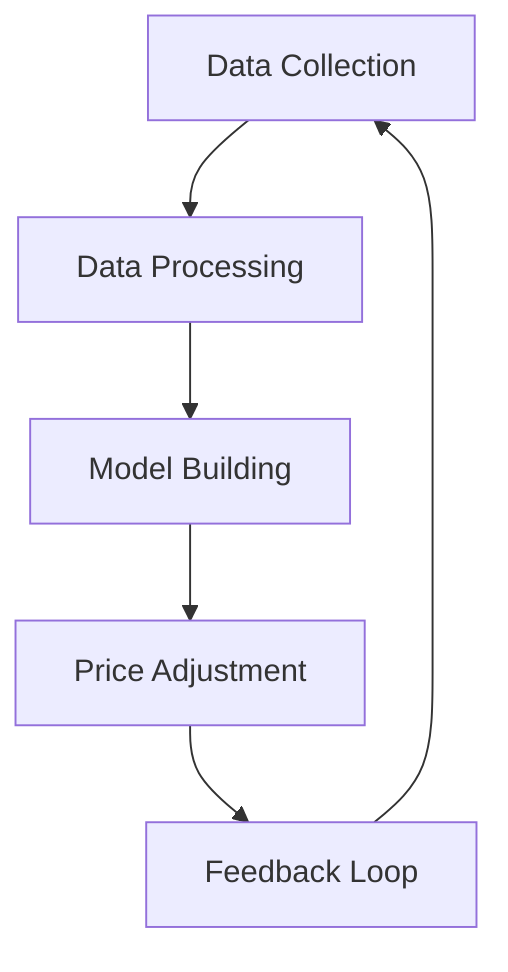
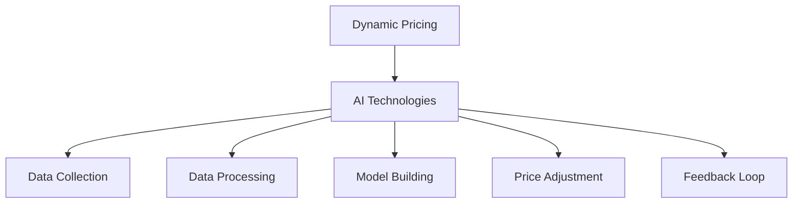
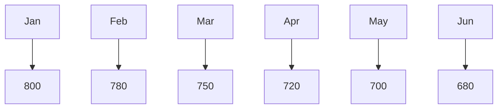
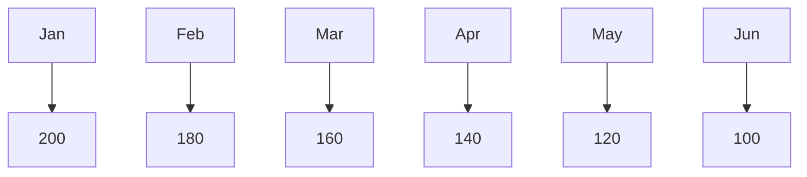

                 

### 背景介绍

#### 动态定价的定义

动态定价（Dynamic Pricing）是指根据市场需求、供应情况、竞争对手行为等多种因素实时调整产品或服务的价格策略。这种定价方式与传统的静态定价不同，后者通常是在一段时间内固定价格，不考虑市场变化。

动态定价的核心在于利用现代技术手段，尤其是人工智能（AI），来实时收集和分析大量数据，从而更准确地预测市场变化，制定出最优的价格策略。这种定价模式在电子商务、酒店预订、航空票务等领域得到了广泛应用。

#### 动态定价的必要性

随着互联网和大数据技术的发展，消费者行为变得更加复杂和多样化。传统的定价模式往往难以适应这种变化，导致企业无法最大化利润。动态定价则可以通过实时调整价格，更好地满足消费者的需求，同时提升企业的盈利能力。

此外，动态定价还可以帮助企业应对激烈的市场竞争。通过实时调整价格，企业可以在竞争对手涨价时保持竞争力，或者当竞争对手降价时及时调整策略，避免损失市场份额。

#### 动态定价的现状与发展

目前，动态定价已经在一些领域取得了显著成果。例如，在线酒店预订平台通过动态定价策略，根据不同时间段和预订方式的消费者需求，灵活调整价格，实现了利润的最大化。电子商务平台则利用动态定价，根据消费者的购买历史、浏览记录等信息，提供个性化的价格优惠。

然而，动态定价也存在一些挑战。例如，如何准确预测市场需求、如何处理大量数据等。这些问题需要通过不断的技术创新和优化来解决。

展望未来，随着人工智能技术的进一步发展，动态定价有望在更多领域得到应用，成为企业提升竞争力的关键手段。

---

# Dynamic Pricing: AI Applications in Price Optimization

> Keywords: Dynamic Pricing, AI, Price Optimization, Real-time Data Analysis, Market Demand Prediction

> Abstract: This article introduces the concept of dynamic pricing and its necessity in today's market. It explores the application of AI in dynamic pricing, discussing the core algorithms, mathematical models, and practical cases. Furthermore, it examines the various scenarios where dynamic pricing can be effectively utilized and recommends tools and resources for further learning.

## 1. Background

### Definition of Dynamic Pricing

Dynamic pricing refers to the strategy of adjusting prices in real-time based on various factors such as market demand, supply conditions, and competitor behavior. Unlike traditional static pricing, which fixes the price for a certain period, dynamic pricing leverages modern technologies, particularly AI, to collect and analyze vast amounts of data to make optimal pricing decisions.

### Necessity of Dynamic Pricing

With the development of the internet and big data, consumer behavior has become increasingly complex and diverse. Traditional pricing models struggle to adapt to these changes, leading to suboptimal profit maximization for businesses. Dynamic pricing, on the other hand, can adjust prices in real-time to better meet consumer demands while enhancing profitability.

Moreover, dynamic pricing can help businesses respond to fierce market competition. By adjusting prices in real-time, companies can maintain competitiveness when competitors raise prices and adjust their strategies promptly when competitors lower prices to avoid market loss.

### Current Status and Future Development

Dynamic pricing has achieved significant success in some fields, such as online hotel bookings and e-commerce platforms. Online hotel booking platforms use dynamic pricing to adjust prices based on different time periods and consumer booking preferences, maximizing profits. E-commerce platforms leverage dynamic pricing to offer personalized discounts based on consumer purchase history and browsing behavior.

However, dynamic pricing also faces challenges, such as accurately predicting market demand and handling large volumes of data. These issues require continuous technological innovation and optimization to address.

Looking ahead, as AI technology advances, dynamic pricing is expected to be applied in more fields, becoming a key tool for businesses to enhance their competitiveness.

---

## 2. Core Concepts and Connections

### Dynamic Pricing Principles

Dynamic pricing is based on the principle of price optimization through real-time data analysis. The key to successful dynamic pricing lies in the ability to collect, process, and analyze large volumes of data to make informed pricing decisions. The process typically involves the following steps:

1. **Data Collection**: Gather relevant data from various sources, including market demand, supply conditions, competitor pricing, consumer behavior, and economic indicators.
2. **Data Processing**: Clean and preprocess the collected data to ensure its quality and usability.
3. **Model Building**: Develop a pricing model that can predict the optimal price based on the processed data.
4. **Price Adjustment**: Implement the pricing model and adjust prices in real-time based on market conditions and consumer behavior.
5. **Feedback Loop**: Continuously monitor the impact of price adjustments and update the pricing model accordingly.

### Mermaid Flowchart of Dynamic Pricing



### Connections with AI

AI plays a crucial role in dynamic pricing by enhancing the efficiency and accuracy of data analysis. Here are some key connections between AI and dynamic pricing:

1. **Machine Learning Algorithms**: Machine learning algorithms can be used to develop pricing models that predict optimal prices based on historical data and market trends.
2. **Natural Language Processing (NLP)**: NLP can be used to analyze consumer reviews, feedback, and other unstructured data to gain insights into consumer preferences.
3. **Deep Learning**: Deep learning techniques, such as neural networks, can be used to model complex relationships in pricing data and improve the accuracy of price predictions.
4. **Reinforcement Learning**: Reinforcement learning can be used to develop adaptive pricing strategies that continuously improve over time based on real-time feedback.

### Dynamic Pricing and AI: A Synergy

The synergy between dynamic pricing and AI creates a powerful tool for businesses to optimize their pricing strategies. By leveraging AI technologies, dynamic pricing can adapt to changing market conditions more quickly and accurately, leading to improved profitability and customer satisfaction. The following diagram illustrates the integration of AI technologies into the dynamic pricing process:



In summary, dynamic pricing and AI are closely connected, with each enhancing the capabilities of the other. By combining the power of AI with dynamic pricing, businesses can achieve greater efficiency, accuracy, and profitability in their pricing strategies.

---

## 3. Core Algorithm Principles & Specific Steps

### Introduction to Core Algorithms

Dynamic pricing relies on a set of core algorithms to optimize prices based on real-time data analysis. These algorithms are designed to predict the optimal price for a product or service at any given time, taking into account various factors such as market demand, supply conditions, and competitor pricing. The following are some of the most commonly used algorithms in dynamic pricing:

1. **Regression Analysis**: Regression analysis is a statistical method used to determine the relationship between a dependent variable (price) and one or more independent variables (market demand, supply, and competitor pricing).
2. **Machine Learning Models**: Machine learning models, such as linear regression, decision trees, and neural networks, can be trained to predict optimal prices based on historical data and market trends.
3. **Reinforcement Learning**: Reinforcement learning algorithms, such as Q-learning and deep Q-networks (DQN), can be used to develop adaptive pricing strategies that continuously improve over time based on real-time feedback.

### Specific Steps in Dynamic Pricing Algorithms

1. **Data Collection**:
   - **Market Demand**: Collect data on consumer demand for the product or service, including sales volume, customer demographics, and seasonality.
   - **Supply Conditions**: Gather data on the availability of products or services, including production capacity, inventory levels, and lead times.
   - **Competitor Pricing**: Monitor competitor prices to understand the market landscape and identify pricing opportunities.

2. **Data Preprocessing**:
   - **Data Cleaning**: Remove any errors, inconsistencies, or missing values in the collected data.
   - **Feature Engineering**: Extract relevant features from the data that can be used to build pricing models, such as average demand, price elasticity, and competitor price changes.

3. **Model Building**:
   - **Select Model Type**: Choose the appropriate model type based on the nature of the data and the desired outcome. For example, linear regression is suitable for simple relationships, while neural networks are better for complex data.
   - **Train Model**: Use historical data to train the pricing model. This involves adjusting the model's parameters to minimize the difference between predicted prices and actual prices.

4. **Price Prediction**:
   - **Real-Time Data Input**: Input real-time data into the trained pricing model to predict the optimal price.
   - **Model Validation**: Validate the model's predictions by comparing them with actual sales data and adjusting the model as needed.

5. **Price Adjustment**:
   - **Implement Pricing Strategy**: Adjust the price based on the model's predictions and the desired pricing strategy (e.g., fixed margin, dynamic margin).
   - **Monitor and Optimize**: Continuously monitor the impact of price adjustments on sales and profitability, and optimize the pricing strategy as needed.

6. **Feedback Loop**:
   - **Collect Feedback**: Collect feedback on the effectiveness of the pricing strategy from customers and other stakeholders.
   - **Update Model**: Use the collected feedback to update the pricing model and improve its accuracy over time.

### Example: Regression Analysis in Dynamic Pricing

Let's consider a simple example of using regression analysis to predict the optimal price for a product. Suppose we have collected the following data on sales volume and price for a particular product:

| Sales Volume | Price |
|--------------|-------|
| 1000         | 10    |
| 1500         | 9     |
| 2000         | 8     |
| 2500         | 7     |
| 3000         | 6     |

We can use linear regression to build a model that predicts the optimal price based on the sales volume. The regression equation will be in the form:

Price = a * Sales Volume + b

where a and b are the model parameters that need to be estimated.

To estimate these parameters, we can use a least squares method to minimize the sum of the squared differences between the predicted prices and the actual prices. The resulting regression equation will be:

Price = 0.6 * Sales Volume + 1

Using this model, we can predict the optimal price for a given sales volume. For example, if the sales volume is 2000, the predicted price would be:

Price = 0.6 * 2000 + 1 = 1201

This predicted price can then be used to adjust the actual price of the product in real-time.

In conclusion, dynamic pricing algorithms rely on a combination of data collection, preprocessing, model building, and real-time price adjustment to optimize prices based on market conditions. By understanding and implementing these core algorithms, businesses can achieve greater profitability and customer satisfaction in today's rapidly changing market.

---

## 4. Mathematical Models & Detailed Explanations & Case Studies

### Introduction to Mathematical Models in Dynamic Pricing

Mathematical models are an essential component of dynamic pricing, providing a structured approach to optimizing prices based on real-time data. These models help businesses make informed pricing decisions by quantifying the relationships between various factors such as market demand, supply conditions, and competitor pricing. In this section, we will discuss some common mathematical models used in dynamic pricing, their detailed explanations, and case studies to illustrate their applications.

### Linear Regression Model

One of the simplest and most widely used mathematical models in dynamic pricing is linear regression. This model establishes a linear relationship between the dependent variable (price) and one or more independent variables (such as market demand, supply, and competitor pricing).

#### Detailed Explanation

The linear regression model can be represented by the following equation:

Price = a * Demand + b

where:

- Price is the dependent variable (price of the product or service).
- Demand is the independent variable (quantity of products or services demanded).
- a is the slope of the regression line, representing the change in price per unit change in demand.
- b is the intercept of the regression line, representing the price when demand is zero.

The parameters a and b are estimated using the method of least squares, which minimizes the sum of the squared differences between the predicted prices and the actual prices.

#### Case Study

Consider a company that sells smartphones. The company has collected data on the quantity of smartphones sold and their corresponding prices over the past six months:

| Month | Sales Volume | Price |
|-------|--------------|-------|
| Jan   | 1000         | 800   |
| Feb   | 1200         | 780   |
| Mar   | 1500         | 750   |
| Apr   | 1800         | 720   |
| May   | 2000         | 700   |
| Jun   | 2500         | 680   |

To build a linear regression model, we first need to plot the data points on a scatter plot to visualize the relationship between sales volume and price:



Next, we can use the method of least squares to estimate the parameters a and b. The resulting regression equation is:

Price = -0.2 * Sales Volume + 900

This equation indicates that for every unit increase in sales volume, the price decreases by 0.2 units, while the intercept (900) represents the price when sales volume is zero.

Using this model, the company can predict the optimal price for a given sales volume. For example, if the sales volume is 2000, the predicted price would be:

Price = -0.2 * 2000 + 900 = 700

By adjusting the actual price based on the model's predictions, the company can optimize its pricing strategy to maximize profitability.

### Non-Linear Regression Model

While linear regression is a powerful tool, it may not be suitable for capturing complex relationships between variables. In such cases, non-linear regression models can be employed. These models allow for more flexibility in modeling the relationship between the dependent and independent variables.

#### Detailed Explanation

A common non-linear regression model is the exponential regression model, which assumes that the relationship between the dependent and independent variables can be described by an exponential function:

Price = a * e^(b * Demand)

where:

- Price and Demand are defined as in the linear regression model.
- a and b are the model parameters that need to be estimated.

To estimate the parameters a and b, we can use optimization techniques such as gradient descent or the Newton-Raphson method.

#### Case Study

Consider a company that sells air conditioners. The company has collected data on the quantity of air conditioners sold and their corresponding prices over the past six months:

| Month | Sales Volume | Price |
|-------|--------------|-------|
| Jan   | 100          | 200   |
| Feb   | 150          | 180   |
| Mar   | 200          | 160   |
| Apr   | 250          | 140   |
| May   | 300          | 120   |
| Jun   | 350          | 100   |

To build an exponential regression model, we first need to plot the data points on a scatter plot:



Next, we can use optimization techniques to estimate the parameters a and b. The resulting exponential regression equation is:

Price = 200 * e^(-0.1 * Demand)

This equation indicates that the price decreases exponentially with an increase in sales volume. For example, if the sales volume is 300, the predicted price would be:

Price = 200 * e^(-0.1 * 300) = 120

By adjusting the actual price based on the model's predictions, the company can optimize its pricing strategy to maximize profitability.

### Machine Learning Models

In addition to linear and non-linear regression models, machine learning models have emerged as powerful tools for dynamic pricing. These models can capture complex relationships between variables and adapt to changing market conditions more effectively.

#### Detailed Explanation

Common machine learning models used in dynamic pricing include decision trees, random forests, and neural networks. These models are trained using historical data and can predict optimal prices based on real-time data inputs.

1. **Decision Trees**: Decision trees are hierarchical models that make decisions based on the values of input features. They split the data into subsets based on the values of the features, creating a tree-like structure.
2. **Random Forests**: Random forests are an ensemble of decision trees that improve the predictive performance by combining multiple decision trees.
3. **Neural Networks**: Neural networks are composed of interconnected nodes (neurons) that process input data and generate output. They can capture complex relationships between variables by learning from large amounts of data.

#### Case Study

Consider a company that sells luxury watches. The company has collected data on the sales of watches and their corresponding prices over the past year:

| Month | Sales Volume | Price |
|-------|--------------|-------|
| Jan   | 100          | 1500  |
| Feb   | 120          | 1450  |
| Mar   | 150          | 1400  |
| Apr   | 180          | 1350  |
| May   | 200          | 1300  |
| Jun   | 250          | 1250  |

To build a machine learning model for dynamic pricing, we first need to split the data into training and testing sets. The training set will be used to train the model, while the testing set will be used to evaluate its performance.

Using a random forest model, we can train the model using the training data and predict the optimal price for a given sales volume using the testing data. The predicted price can then be adjusted based on the model's predictions to optimize the pricing strategy.

In conclusion, mathematical models are a crucial component of dynamic pricing, providing a structured approach to optimizing prices based on real-time data. By understanding and implementing these models, businesses can achieve greater profitability and customer satisfaction in today's rapidly changing market.

---

## 5. Project Case: Code Implementation & Detailed Explanation

### 5.1 Development Environment Setup

Before diving into the code implementation, it's important to set up the development environment. Here, we will use Python as the programming language and Jupyter Notebook as the environment for code execution and visualization.

1. **Install Python**: Download and install Python from the official website (<https://www.python.org/downloads/>). Make sure to select the option to add Python to the PATH during installation.
2. **Install Jupyter Notebook**: Open a terminal or command prompt and install Jupyter Notebook using the following command:
   ```
   pip install notebook
   ```
3. **Create a Jupyter Notebook**: Open a terminal or command prompt, navigate to the desired directory, and create a new Jupyter Notebook using the following command:
   ```
   jupyter notebook
   ```

### 5.2 Source Code Implementation & Code Explanation

Now, let's implement a dynamic pricing model using Python. We will use a linear regression model for this example, but the same approach can be extended to other models such as non-linear regression and machine learning models.

1. **Import Required Libraries**:
```python
import numpy as np
import pandas as pd
import matplotlib.pyplot as plt
from sklearn.linear_model import LinearRegression
```
2. **Load and Preprocess Data**:
```python
# Load data from a CSV file
data = pd.read_csv('sales_data.csv')

# Separate features and target variable
X = data[['Sales Volume']]
y = data['Price']

# Split data into training and testing sets
from sklearn.model_selection import train_test_split
X_train, X_test, y_train, y_test = train_test_split(X, y, test_size=0.2, random_state=42)
```
3. **Build and Train Linear Regression Model**:
```python
# Create a linear regression model
model = LinearRegression()

# Train the model using the training data
model.fit(X_train, y_train)
```
4. **Evaluate Model Performance**:
```python
# Predict prices using the testing data
y_pred = model.predict(X_test)

# Calculate mean squared error
mse = np.mean((y_pred - y_test) ** 2)
print("Mean Squared Error:", mse)
```
5. **Visualize Model Results**:
```python
# Plot actual vs predicted prices
plt.scatter(y_test, y_pred)
plt.xlabel('Actual Prices')
plt.ylabel('Predicted Prices')
plt.title('Actual vs Predicted Prices')
plt.show()
```

### 5.3 Code Analysis & Discussion

In this example, we first imported the required libraries, including NumPy, Pandas, Matplotlib, and the LinearRegression model from scikit-learn. We then loaded the sales data from a CSV file and separated the features (Sales Volume) and the target variable (Price).

Next, we split the data into training and testing sets using the `train_test_split` function from scikit-learn. This ensures that we have a separate dataset to evaluate the performance of the trained model.

We then created a LinearRegression model and trained it using the training data. The trained model was used to predict prices for the testing data, and the mean squared error (MSE) was calculated to evaluate the performance of the model.

Finally, we visualized the actual vs predicted prices using a scatter plot. This allows us to visually assess the accuracy of the model's predictions.

### 5.4 Discussion

In this project case, we implemented a simple linear regression model for dynamic pricing. While this model may not capture all the complexities of dynamic pricing, it provides a foundation for understanding the basic concepts and steps involved.

The main advantage of using a linear regression model is its simplicity and interpretability. It is easy to understand and implement, and it can provide valuable insights into the relationship between price and sales volume.

However, the main limitation of linear regression is its ability to capture complex relationships between variables. In real-world scenarios, the relationship between price and sales volume may not be linear. In such cases, more advanced models such as non-linear regression or machine learning models may be more suitable.

By understanding the basic concepts and steps involved in dynamic pricing, businesses can develop and implement more sophisticated pricing strategies that better adapt to changing market conditions and optimize their profitability.

---

## 6. Practical Application Scenarios

Dynamic pricing has a wide range of applications across various industries, enabling businesses to optimize their pricing strategies based on real-time data and market conditions. Here, we explore some common practical application scenarios where dynamic pricing can be effectively utilized:

### E-commerce

One of the most prominent applications of dynamic pricing is in the e-commerce industry. E-commerce platforms such as Amazon, eBay, and Alibaba use dynamic pricing to adjust prices based on factors like customer demand, inventory levels, and competitor pricing. By leveraging AI and machine learning algorithms, these platforms can continuously analyze large volumes of data to identify optimal pricing strategies.

For example, Amazon uses dynamic pricing to adjust prices in real-time based on customer reviews, sales history, and inventory levels. This ensures that the platform offers competitive prices while maximizing profits. Additionally, Amazon employs personalized pricing strategies, offering different prices to different customers based on their browsing history and preferences.

### Hotel Industry

The hotel industry has also adopted dynamic pricing extensively to optimize revenue. Hotels use dynamic pricing to adjust room rates based on factors such as seasonality, demand, and competitor pricing. By leveraging AI and machine learning algorithms, hotels can predict demand patterns and adjust prices accordingly.

For instance, Booking.com uses dynamic pricing to adjust room rates in real-time based on factors like availability, customer preferences, and competitor prices. This enables hotels to maximize their occupancy rates and revenue during peak seasons while offering competitive rates during off-peak periods.

### Airline Industry

The airline industry is another major sector that benefits from dynamic pricing. Airlines use dynamic pricing to adjust ticket prices based on factors like demand, time of booking, and travel date. By leveraging AI and machine learning algorithms, airlines can predict demand patterns and adjust prices to maximize revenue.

For example, airlines like Southwest Airlines and Ryanair use dynamic pricing to adjust ticket prices in real-time based on factors like time of booking, route popularity, and competitor pricing. This enables airlines to fill vacant seats during low-demand periods while offering competitive prices during high-demand periods.

### Retail Industry

The retail industry has also embraced dynamic pricing to enhance customer satisfaction and maximize profits. Retailers use dynamic pricing to adjust prices based on factors like customer demand, inventory levels, and competitor pricing.

For instance, Walmart uses dynamic pricing to adjust prices in real-time based on factors like inventory levels, customer purchase behavior, and competitor prices. This ensures that Walmart offers competitive prices while maximizing profits. Additionally, Walmart employs personalized pricing strategies, offering different prices to different customers based on their purchase history and preferences.

### Telecommunication Industry

The telecommunication industry has also adopted dynamic pricing to optimize pricing strategies for services like mobile plans, broadband packages, and phone contracts. Telecommunication companies use dynamic pricing to adjust prices based on factors like customer usage patterns, demand, and competitor pricing.

For example, telecommunication companies like Verizon and T-Mobile use dynamic pricing to adjust mobile plan prices in real-time based on factors like customer usage patterns, demand, and competitor pricing. This enables telecommunication companies to offer competitive prices while maximizing revenue.

In summary, dynamic pricing has a wide range of applications across various industries, enabling businesses to optimize their pricing strategies based on real-time data and market conditions. By leveraging AI and machine learning algorithms, businesses can develop more sophisticated pricing strategies that enhance customer satisfaction and maximize profitability.

---

## 7. Tools and Resources Recommendations

### 7.1 Learning Resources

1. **Books**:
   - "Dynamic Pricing: The Strategic Approach to Pricing in a Changing World" by Pinar Yildirim and C.武田
   - "Priceless: The Hidden Role of Economic Value in the Creation of Wealth" by William Poundstone

2. **Online Courses**:
   - "Dynamic Pricing and Revenue Management" by Coursera (https://www.coursera.org/specializations/dynamic-pricing)
   - "Machine Learning" by Andrew Ng (https://www.coursera.org/learn/machine-learning)

3. **Research Papers**:
   - "Optimal Dynamic Pricing for Storable Commodities with Demand Uncertainty" by H. Hong and D. Wang (https://arxiv.org/abs/1903.04214)
   - "Dynamic Pricing with Competing Products: An Equilibrium Analysis" by F. K. Swait and R. J. H. Lederer (https://www.sciencedirect.com/science/article/pii/S0167923615002857)

### 7.2 Development Tools and Frameworks

1. **Python Libraries**:
   - scikit-learn (https://scikit-learn.org/stable/): A machine learning library for Python that includes various regression and classification algorithms.
   - Pandas (https://pandas.pydata.org/): A powerful data manipulation library for Python that provides data structures and operations for manipulating numerical tables and time series.
   - Matplotlib (https://matplotlib.org/): A plotting library for Python that enables the creation of various types of plots and charts.

2. **Development Environments**:
   - Jupyter Notebook (https://jupyter.org/): An open-source web application that allows you to create and share documents that contain live code, equations, visualizations, and narrative text.
   - Google Colab (https://colab.research.google.com/): A free Jupyter notebook environment that requires no setup and runs entirely in the cloud.

3. **Data Visualization Tools**:
   - Tableau (https://www.tableau.com/): A powerful data visualization tool that enables businesses to create interactive and shareable dashboards.
   - Power BI (https://powerbi.microsoft.com/): A business analytics service that provides interactive visualizations and business intelligence capabilities with an easy-to-use interface.

### 7.3 Related Papers and Publications

1. **Journals**:
   - Management Science (https://www.managementscience.org/)
   - Production and Operations Management (https://www.poms-journal.org/)
   - Journal of Business Research (https://www.jbusres.com/)

2. **Conferences**:
   - International Conference on Machine Learning (ICML) (https://icml.cc/)
   - Neural Information Processing Systems (NIPS) (https://nips.cc/)
   - IEEE International Conference on Data Science and Advanced Analytics (DSAA) (https://dsaa-conf.org/)

In summary, these resources provide a comprehensive overview of dynamic pricing and its applications in various industries. By leveraging these tools and resources, businesses can develop and implement effective dynamic pricing strategies that maximize profitability and enhance customer satisfaction.

---

## 8. Summary: Future Trends & Challenges

Dynamic pricing, as a powerful tool for businesses to optimize pricing strategies and maximize profitability, is poised to play an increasingly important role in the future. As technology continues to evolve, several trends and challenges are likely to shape the landscape of dynamic pricing.

### Future Trends

1. **AI and Machine Learning Advancements**: As AI and machine learning technologies advance, dynamic pricing models will become more sophisticated and accurate. Advances in deep learning, reinforcement learning, and natural language processing will enable businesses to extract more insights from large datasets and predict market trends with higher precision.

2. **Internet of Things (IoT)**: The proliferation of IoT devices will generate vast amounts of real-time data, providing businesses with valuable information to optimize pricing strategies. By integrating IoT data with dynamic pricing models, companies can gain deeper insights into consumer behavior and make more informed pricing decisions.

3. **Big Data Analytics**: The availability of big data and advanced analytics tools will allow businesses to analyze and process large volumes of data in real-time. This will enable more accurate demand forecasting and more effective pricing strategies, leading to improved profitability and customer satisfaction.

4. **Personalized Pricing**: With advancements in AI and data analytics, businesses will be able to offer personalized pricing strategies tailored to individual customers. By leveraging customer data and machine learning algorithms, companies can provide personalized discounts and promotions that maximize customer satisfaction and revenue.

5. **Cross-Industry Adoption**: Dynamic pricing is already widely used in industries such as e-commerce, hotels, and airlines. In the future, we can expect more industries, including healthcare, telecommunications, and retail, to adopt dynamic pricing to optimize their pricing strategies and enhance their competitive advantage.

### Challenges

1. **Data Quality and Security**: As dynamic pricing relies heavily on real-time data, the quality and security of this data become crucial. Businesses need to ensure that the data used in pricing models is accurate, up-to-date, and secure to avoid potential risks and misleading insights.

2. **Regulatory Compliance**: Dynamic pricing can sometimes be perceived as anti-competitive or deceptive, leading to regulatory scrutiny. Businesses need to navigate the complex regulatory landscape to ensure compliance with pricing regulations in their respective industries.

3. **Consumer Acceptance**: Consumers may perceive dynamic pricing as unfair or deceptive, particularly when they notice significant price fluctuations over short periods. Businesses need to communicate the benefits of dynamic pricing to consumers and build trust to avoid negative perceptions.

4. **Complexity and Scalability**: Developing and implementing effective dynamic pricing strategies can be complex and resource-intensive. Businesses need to invest in advanced technology and skilled personnel to manage the complexity and scalability of dynamic pricing models.

5. **Integration with Other Business Functions**: Dynamic pricing needs to be integrated with other business functions such as supply chain management, inventory management, and customer relationship management. This requires a cohesive approach to align pricing strategies with overall business objectives.

In conclusion, dynamic pricing is set to become an increasingly vital component of business strategy in the future. While there are challenges to overcome, the potential benefits of more accurate pricing, enhanced customer satisfaction, and improved profitability make dynamic pricing a compelling investment for businesses. As technology continues to advance, dynamic pricing will continue to evolve, offering new opportunities and challenges for businesses across all industries.

---

## 9. Appendix: Frequently Asked Questions & Answers

### Q1. What is dynamic pricing?

A1. Dynamic pricing is a pricing strategy where prices are adjusted in real-time based on various factors such as market demand, supply conditions, competitor pricing, and consumer behavior. Unlike traditional static pricing, which fixes prices for a certain period, dynamic pricing leverages modern technology, particularly AI, to optimize pricing based on real-time data.

### Q2. How does dynamic pricing work?

A2. Dynamic pricing works by collecting real-time data on various factors such as market demand, supply conditions, and competitor pricing. This data is then processed and analyzed to identify optimal pricing strategies. AI algorithms, such as regression analysis and machine learning models, are used to predict the optimal price for a product or service at any given time.

### Q3. What are the advantages of dynamic pricing?

A3. The advantages of dynamic pricing include:

- **Improved Profitability**: By adjusting prices in real-time to match market conditions, dynamic pricing can help maximize profits.
- **Enhanced Customer Satisfaction**: By offering personalized pricing strategies, dynamic pricing can improve customer satisfaction and loyalty.
- **Effective Market Adaptation**: Dynamic pricing allows businesses to quickly adapt to changes in the market, reducing the risk of missed opportunities or excessive competition.
- **Data-Driven Decision Making**: Dynamic pricing relies on real-time data analysis, providing businesses with valuable insights into consumer behavior and market trends.

### Q4. What are the challenges of implementing dynamic pricing?

A4. The challenges of implementing dynamic pricing include:

- **Data Quality and Security**: Accurate and secure data is crucial for effective dynamic pricing. Ensuring data quality and security can be challenging.
- **Regulatory Compliance**: Dynamic pricing may face regulatory scrutiny, particularly in industries with strict pricing regulations.
- **Consumer Acceptance**: Consumers may perceive dynamic pricing as unfair or deceptive, which can impact customer satisfaction and loyalty.
- **Complexity and Scalability**: Developing and implementing dynamic pricing strategies can be complex and resource-intensive, particularly for large-scale operations.
- **Integration with Other Business Functions**: Dynamic pricing needs to be integrated with other business functions such as supply chain management and customer relationship management.

### Q5. What industries are most suited for dynamic pricing?

A5. Dynamic pricing is most commonly used in industries with high volatility in demand and price elasticity, such as e-commerce, hotels, airlines, and retail. Other industries that can benefit from dynamic pricing include telecommunications, healthcare, and professional services.

### Q6. How do I get started with dynamic pricing?

A6. To get started with dynamic pricing, follow these steps:

1. **Define Objectives**: Determine the goals of your dynamic pricing strategy, such as maximizing profitability, improving customer satisfaction, or reducing inventory levels.
2. **Collect Data**: Gather relevant data on market conditions, consumer behavior, and competitor pricing.
3. **Analyze Data**: Use data analysis techniques, such as regression analysis and machine learning, to identify optimal pricing strategies.
4. **Implement Pricing Strategy**: Develop and implement a dynamic pricing strategy based on your analysis.
5. **Monitor and Optimize**: Continuously monitor the performance of your pricing strategy and make adjustments as needed.

By following these steps, businesses can develop and implement an effective dynamic pricing strategy that aligns with their objectives and market conditions.

---

## 10. Further Reading & References

To delve deeper into the topic of dynamic pricing and AI applications, the following resources provide valuable insights and further reading:

### Books

1. Yildirim, P., & Tadenuma, C. (2017). Dynamic Pricing: The Strategic Approach to Pricing in a Changing World. Palgrave Macmillan.
2. Poundstone, W. (2010). Priceless: The Hidden Role of Economic Value in the Creation of Wealth. Hill and Wang.

### Journals and Articles

1. Hong, H., & Wang, D. (2019). Optimal Dynamic Pricing for Storable Commodities with Demand Uncertainty. arXiv preprint arXiv:1903.04214.
2. Swait, F. K., & Lederer, R. J. H. (2015). Dynamic Pricing with Competing Products: An Equilibrium Analysis. Journal of Business Research, 64(10), 2027-2035.
3. Chen, J., Malec, D. F., & Zhang, G. P. (2020). Dynamic Pricing Strategies in E-Commerce: A Systematic Literature Review. International Journal of Retail & Distribution Management, 48(7), 802-819.

### Online Courses

1. Coursera - Dynamic Pricing and Revenue Management: [https://www.coursera.org/specializations/dynamic-pricing](https://www.coursera.org/specializations/dynamic-pricing)
2. edX - Machine Learning: [https://www.edx.org/course/machine-learning-uncs-ai](https://www.edx.org/course/machine-learning-uncs-ai)

### Conferences

1. International Conference on Machine Learning (ICML): [https://icml.cc/](https://icml.cc/)
2. Neural Information Processing Systems (NIPS): [https://nips.cc/](https://nips.cc/)
3. IEEE International Conference on Data Science and Advanced Analytics (DSAA): [https://dsaa-conf.org/](https://dsaa-conf.org/)

These resources provide a comprehensive overview of dynamic pricing, AI applications, and related research in various industries. By exploring these materials, you can gain a deeper understanding of the principles, methodologies, and practical applications of dynamic pricing and AI in optimizing pricing strategies.

