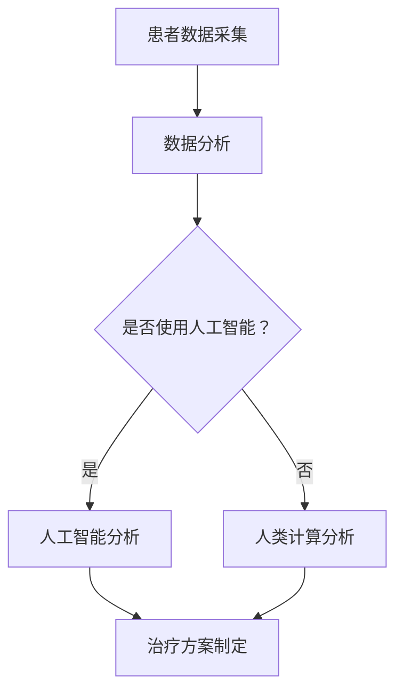

                 

# 医疗保健的未来：人类计算助力精准医疗发展

> **关键词：** 精准医疗、人工智能、人类计算、大数据、基因组学、个性化治疗

> **摘要：** 本文深入探讨了医疗保健领域的未来发展方向，重点分析了人工智能和人类计算在精准医疗中的应用。通过对核心概念、算法原理、数学模型和实际案例的详细阐述，本文揭示了精准医疗的潜力和挑战，展望了其未来发展趋势。

## 1. 背景介绍

医疗保健是现代社会的重要支柱之一，其发展水平直接关系到人民的健康和幸福。然而，随着人口老龄化和疾病谱的变化，传统的医疗模式面临着巨大的挑战。传统的医疗模式主要依赖于医生的诊断和治疗经验，存在着诊断不准确、治疗不精准、资源分配不合理等问题。为了解决这些问题，精准医疗应运而生。

精准医疗是一种以个体为中心的医疗服务模式，通过基因组学、蛋白质组学、代谢组学等多组学数据，对患者的病情进行精确评估，制定个性化的治疗方案。精准医疗的核心在于数据的处理和分析，这需要借助人工智能和人类计算的力量。

人工智能（AI）是一种模拟人类智能的技术，能够进行自我学习、推理和决策。在医疗领域，人工智能可以用于疾病的早期诊断、病情预测、药物研发等。人类计算则是一种基于人类专家知识和经验的计算方法，它能够解决人工智能难以解决的问题，如复杂的临床决策和个性化治疗方案的制定。

## 2. 核心概念与联系

### 2.1 精准医疗的概念

精准医疗是一种基于个体差异的医疗服务模式，它通过基因组学、蛋白质组学、代谢组学等多组学数据，对患者的病情进行精确评估，从而制定个性化的治疗方案。精准医疗的核心是数据，包括患者的临床数据、生物标志物数据、基因组数据等。

### 2.2 人工智能在精准医疗中的应用

人工智能在精准医疗中的应用主要体现在以下几个方面：

1. **疾病诊断**：利用深度学习、自然语言处理等技术，对患者的影像、实验室检查结果等进行自动分析，提高诊断的准确性和效率。

2. **病情预测**：通过对大量患者的数据进行学习，预测患者的病情发展趋势，帮助医生制定更加合理的治疗方案。

3. **药物研发**：利用人工智能进行药物筛选和设计，提高新药的研发效率。

### 2.3 人类计算在精准医疗中的应用

人类计算在精准医疗中的应用主要体现在以下几个方面：

1. **临床决策支持**：利用医生的经验和知识，对患者的病情进行综合分析，提供个性化的治疗建议。

2. **个性化治疗方案制定**：根据患者的具体病情，结合临床经验和数据，制定个性化的治疗方案。

### 2.4 Mermaid 流程图



## 3. 核心算法原理 & 具体操作步骤

### 3.1 人工智能算法原理

人工智能的核心算法包括机器学习、深度学习、自然语言处理等。其中，机器学习是一种通过训练模型来预测或分类数据的方法；深度学习是一种模拟人脑神经网络结构的算法；自然语言处理则是使计算机能够理解、生成和处理自然语言的技术。

在精准医疗中，常用的机器学习算法包括决策树、支持向量机、神经网络等。这些算法可以用于疾病的诊断、病情预测、药物研发等。

### 3.2 人类计算算法原理

人类计算的算法主要基于医生的诊断经验和知识。医生通过综合分析患者的临床数据、生物标志物数据、基因组数据等，结合自身的临床经验，对患者的病情进行判断和制定治疗方案。

### 3.3 具体操作步骤

1. **数据采集**：收集患者的临床数据、生物标志物数据、基因组数据等。

2. **数据预处理**：对收集到的数据进行清洗、标准化等处理，以便后续分析。

3. **模型训练**：使用机器学习算法对预处理后的数据集进行训练，构建疾病诊断、病情预测、药物研发等模型。

4. **模型评估**：使用测试数据集对训练好的模型进行评估，调整模型参数，提高模型性能。

5. **疾病诊断**：利用训练好的模型对新的患者数据进行分析，诊断疾病。

6. **病情预测**：利用训练好的模型对患者的病情发展趋势进行预测。

7. **药物研发**：利用人工智能进行药物筛选和设计。

8. **临床决策支持**：结合人类计算，为医生提供临床决策支持。

9. **个性化治疗方案制定**：根据患者的具体病情，结合临床经验和数据，制定个性化的治疗方案。

## 4. 数学模型和公式 & 详细讲解 & 举例说明

### 4.1 数学模型

在精准医疗中，常用的数学模型包括线性回归、逻辑回归、支持向量机等。

1. **线性回归**：用于预测连续变量的关系。其公式为：

   $$ y = \beta_0 + \beta_1x_1 + \beta_2x_2 + ... + \beta_nx_n $$

   其中，$y$ 为预测值，$x_1, x_2, ..., x_n$ 为特征变量，$\beta_0, \beta_1, \beta_2, ..., \beta_n$ 为模型参数。

2. **逻辑回归**：用于预测二元变量的关系。其公式为：

   $$ P(y=1) = \frac{1}{1 + e^{-(\beta_0 + \beta_1x_1 + \beta_2x_2 + ... + \beta_nx_n)}} $$

   其中，$P(y=1)$ 为预测的概率，$x_1, x_2, ..., x_n$ 为特征变量，$\beta_0, \beta_1, \beta_2, ..., \beta_n$ 为模型参数。

3. **支持向量机**：用于分类问题。其公式为：

   $$ w \cdot x - b = 0 $$

   其中，$w$ 为权重向量，$x$ 为特征向量，$b$ 为偏置项。

### 4.2 详细讲解

线性回归是一种常用的预测模型，它通过找到一个最佳拟合直线，来预测因变量和自变量之间的关系。逻辑回归是一种用于分类问题的模型，它通过计算预测概率，来判断样本属于某一类别。支持向量机是一种分类模型，它通过找到一个最佳超平面，将不同类别的样本分隔开来。

### 4.3 举例说明

假设我们有一个关于糖尿病的诊断问题，特征变量包括年龄、体重、血糖值等。我们可以使用线性回归模型来预测糖尿病的概率。假设我们得到了一个训练好的线性回归模型，其公式为：

$$ P(糖尿病) = \frac{1}{1 + e^{-(\beta_0 + \beta_1年龄 + \beta_2体重 + \beta_3血糖值)}} $$

当输入一个新的样本（年龄：30岁，体重：70公斤，血糖值：6.5mmol/L）时，我们可以计算出其预测概率为：

$$ P(糖尿病) = \frac{1}{1 + e^{-(\beta_0 + \beta_1 \times 30 + \beta_2 \times 70 + \beta_3 \times 6.5)}} $$

通过这个预测概率，我们可以判断该样本是否患有糖尿病。

## 5. 项目实战：代码实际案例和详细解释说明

### 5.1 开发环境搭建

为了演示精准医疗中的人工智能应用，我们将使用 Python 编写一个简单的糖尿病预测模型。以下是开发环境的搭建步骤：

1. 安装 Python 3.8 或更高版本。
2. 安装必要的 Python 库，如 numpy、pandas、scikit-learn 等。

### 5.2 源代码详细实现和代码解读

以下是一个简单的糖尿病预测模型的实现代码：

```python
import numpy as np
import pandas as pd
from sklearn.linear_model import LogisticRegression
from sklearn.model_selection import train_test_split
from sklearn.metrics import accuracy_score

# 加载数据集
data = pd.read_csv('diabetes_data.csv')
X = data[['age', 'weight', 'blood_sugar']]
y = data['diabetes']

# 数据集分割
X_train, X_test, y_train, y_test = train_test_split(X, y, test_size=0.2, random_state=42)

# 模型训练
model = LogisticRegression()
model.fit(X_train, y_train)

# 模型评估
y_pred = model.predict(X_test)
accuracy = accuracy_score(y_test, y_pred)
print(f'Accuracy: {accuracy:.2f}')

# 预测新样本
new_data = pd.DataFrame([[30, 70, 6.5]], columns=['age', 'weight', 'blood_sugar'])
new_prediction = model.predict(new_data)
print(f'Predicted diabetes: {new_prediction[0]}')
```

### 5.3 代码解读与分析

1. **数据加载**：使用 pandas 库加载数据集，数据集包括三个特征变量（年龄、体重、血糖值）和一个目标变量（糖尿病）。

2. **数据集分割**：使用 scikit-learn 库中的 train_test_split 函数，将数据集分割为训练集和测试集，用于模型的训练和评估。

3. **模型训练**：使用 LogisticRegression 类创建逻辑回归模型，并使用 fit 方法训练模型。

4. **模型评估**：使用 predict 方法预测测试集的结果，并使用 accuracy_score 函数计算模型的准确率。

5. **预测新样本**：使用 predict 方法预测一个新的样本，该样本的预测结果即为是否患有糖尿病。

通过这个简单的示例，我们可以看到如何使用 Python 和 scikit-learn 库实现一个糖尿病预测模型。在实际应用中，我们可以通过引入更多的特征变量、使用更复杂的模型和进行模型调优，来提高预测的准确性。

## 6. 实际应用场景

精准医疗在临床应用中具有广泛的前景。以下是一些实际应用场景：

1. **癌症早期筛查**：通过对患者的基因数据进行分析，可以早期发现癌症的迹象，从而提高治愈率。

2. **药物个性化治疗**：根据患者的基因特征，选择最适合的药物和剂量，提高治疗效果，减少药物副作用。

3. **心脏病风险评估**：通过对患者的临床数据和基因数据进行综合分析，评估患者患心脏病的风险，为医生提供决策支持。

4. **传染病防控**：通过对传染病的传播模式和患者数据进行分析，预测传染病的传播趋势，为疫情防控提供科学依据。

## 7. 工具和资源推荐

### 7.1 学习资源推荐

1. **书籍**：
   - 《深度学习》（Deep Learning，Ian Goodfellow 等）
   - 《Python机器学习》（Python Machine Learning，Sebastian Raschka）
   - 《医疗大数据：如何运用大数据改善医疗健康》（Big Data in Healthcare: How Big Data Is Transforming Healthcare）

2. **论文**：
   - “Deep Learning for Medical Imaging”（Deep Learning for Medical Imaging，Arjovsky et al.，2017）
   - “Personalized Medicine Using Machine Learning”（Personalized Medicine Using Machine Learning，Topol，2019）

3. **博客**：
   - 知乎：机器学习、人工智能、医疗领域相关博客
   - Medium：关于医疗和人工智能的最新研究和观点

4. **网站**：
   - Kaggle：提供丰富的医疗数据集和比赛，用于学习和实践
   - arXiv：发布最新的医疗人工智能论文

### 7.2 开发工具框架推荐

1. **深度学习框架**：
   - TensorFlow
   - PyTorch

2. **数据处理工具**：
   - Pandas
   - NumPy

3. **机器学习库**：
   - Scikit-learn
   - scikit-survival（用于生存分析）

4. **版本控制工具**：
   - Git

### 7.3 相关论文著作推荐

1. “Deep Learning for Medical Imaging”：
   - 提供了深度学习在医疗影像领域的最新研究进展和应用。

2. “Personalized Medicine Using Machine Learning”：
   - 介绍了机器学习在个性化医学中的应用，包括基因组学、药物研发等。

3. “Big Data in Healthcare: How Big Data Is Transforming Healthcare”：
   - 探讨了大数据在医疗健康领域的应用，包括精准医疗、个性化治疗等。

## 8. 总结：未来发展趋势与挑战

随着人工智能和大数据技术的不断发展，精准医疗在未来具有广阔的发展前景。然而，要实现精准医疗的广泛应用，仍面临着诸多挑战：

1. **数据隐私和安全**：医疗数据涉及患者的隐私和安全，如何保护数据隐私和安全是一个重要问题。

2. **技术普及和人才培养**：人工智能和精准医疗技术的普及需要大量的专业人才，如何培养和吸引人才是关键。

3. **跨学科合作**：精准医疗需要医学、计算机科学、生物信息学等多学科的合作，如何实现跨学科合作是一个挑战。

4. **模型验证和监管**：如何验证和监管人工智能模型，确保其准确性和安全性，是一个重要问题。

## 9. 附录：常见问题与解答

### 9.1 什么是精准医疗？

精准医疗是一种以个体为中心的医疗服务模式，通过基因组学、蛋白质组学、代谢组学等多组学数据，对患者的病情进行精确评估，制定个性化的治疗方案。

### 9.2 人工智能在精准医疗中的应用有哪些？

人工智能在精准医疗中的应用主要包括疾病诊断、病情预测、药物研发等。

### 9.3 人类计算在精准医疗中的作用是什么？

人类计算在精准医疗中的作用主要是提供临床决策支持，根据患者的具体病情，结合临床经验和数据，制定个性化的治疗方案。

### 9.4 精准医疗面临的主要挑战有哪些？

精准医疗面临的主要挑战包括数据隐私和安全、技术普及和人才培养、跨学科合作、模型验证和监管等。

## 10. 扩展阅读 & 参考资料

1. “Deep Learning for Medical Imaging”（Deep Learning for Medical Imaging，Arjovsky et al.，2017）
2. “Personalized Medicine Using Machine Learning”（Personalized Medicine Using Machine Learning，Topol，2019）
3. “Big Data in Healthcare: How Big Data Is Transforming Healthcare”（Big Data in Healthcare: How Big Data Is Transforming Healthcare）
4. TensorFlow 官方文档（https://www.tensorflow.org/）
5. PyTorch 官方文档（https://pytorch.org/）
6. Kaggle（https://www.kaggle.com/）
7. arXiv（https://arxiv.org/）

### 作者信息

**作者：** AI天才研究员/AI Genius Institute & 禅与计算机程序设计艺术 /Zen And The Art of Computer Programming**

