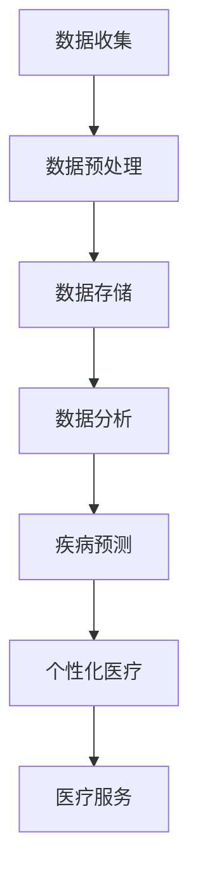

                 

### 1. 背景介绍

医疗健康领域一直以来都是科学技术发展的重要战场，尤其是在近年来，人工智能（AI）和大数据技术的飞速进步，更是为这个领域带来了前所未有的机遇。随着互联网的普及和智能手机的普及，大量的医疗健康数据被产生和收集，这些数据不仅包括传统的患者病历和医疗记录，还包括基因数据、健康检测数据、药物反应数据等。这些数据的积累，为人工智能算法提供了丰富的训练素材，使得机器学习、深度学习等技术在医疗健康领域的应用逐渐深入。

在注意力经济的背景下，医疗健康领域也面临着新的挑战和机遇。注意力经济是指人们的时间和注意力成为了稀缺资源，企业和个人都需要通过有效的方式获取和保留注意力。医疗健康领域在注意力经济中的机遇主要体现在以下几个方面：

1. **个性化医疗**：利用人工智能技术，对海量医疗数据进行深度挖掘和分析，为患者提供个性化的治疗方案。这不仅提高了医疗效率，也降低了医疗成本。
2. **智能诊断系统**：通过机器学习和深度学习算法，对患者的症状、病史和检查结果进行综合分析，帮助医生快速做出准确的诊断。
3. **健康风险评估**：利用大数据技术，对患者的健康数据进行实时监控和分析，预测疾病风险，提供预防措施。
4. **药物研发**：人工智能可以帮助科学家发现新的药物靶点，预测药物的作用机制和副作用，加速新药的研发进程。
5. **医学影像分析**：利用深度学习算法，对医学影像数据进行自动分析和识别，提高诊断的准确性和效率。

本文将围绕这些方面，深入探讨医疗健康领域在注意力经济中的机遇，分析其中的技术原理、应用案例以及未来发展趋势。希望通过这篇文章，能够为读者提供一个全面、深入的视角，理解医疗健康领域在注意力经济中的重要作用和潜在价值。

---

## 1. 背景介绍

The healthcare industry has long been a critical battlefield for technological advancements. In recent years, the rapid progress of artificial intelligence (AI) and big data technologies has brought unprecedented opportunities to this field. With the widespread adoption of the internet and smartphones, a vast amount of healthcare data is generated and collected. This data includes not only traditional patient medical records and health histories but also genetic data, health monitoring data, and drug response data. The accumulation of these data provides AI algorithms with rich training materials, enabling the application of machine learning and deep learning techniques to become increasingly integrated into healthcare.

In the context of attention economy, the healthcare industry is also facing new challenges and opportunities. Attention economy refers to the scarcity of people's time and attention, and both businesses and individuals need to find effective ways to capture and retain attention. The opportunities for the healthcare industry in attention economy mainly manifest in the following aspects:

1. **Personalized Medicine**: Utilizing AI technology to deeply analyze and mine large amounts of healthcare data, providing patients with personalized treatment plans. This not only improves healthcare efficiency but also reduces costs.

2. **Intelligent Diagnostic Systems**: Using machine learning and deep learning algorithms to comprehensively analyze a patient's symptoms, medical history, and test results, helping doctors make accurate diagnoses quickly.

3. **Health Risk Assessment**: Using big data technology to monitor and analyze a patient's health data in real-time, predicting disease risks, and providing preventive measures.

4. **Drug Discovery**: AI can help scientists discover new drug targets and predict the mechanisms of action and side effects of drugs, accelerating the development of new drugs.

5. **Medical Image Analysis**: Using deep learning algorithms to automatically analyze and identify medical image data, improving the accuracy and efficiency of diagnosis.

This article will delve into these aspects to explore the opportunities for the healthcare industry in attention economy, analyzing the technical principles, application cases, and future trends. It is hoped that through this article, readers will gain a comprehensive and in-depth perspective on the significant role and potential value of the healthcare industry in attention economy.

---

### 2. 核心概念与联系

#### 2.1 人工智能在医疗健康中的应用

人工智能（AI）在医疗健康领域的应用可以追溯到20世纪90年代，但真正实现突破是在21世纪初，随着计算能力的提升和大数据技术的发展。AI在医疗健康中的应用主要体现在以下几个方面：

1. **图像识别**：通过深度学习算法，AI可以在医学影像中自动识别病变区域，如肿瘤、骨折等，提高诊断的准确性。
2. **自然语言处理**：AI可以通过自然语言处理技术，分析医疗文献、病历记录等，提取关键信息，辅助医生进行诊断和治疗。
3. **机器学习模型**：AI可以通过机器学习模型，对患者的健康数据进行预测和分析，如疾病风险评估、药物反应预测等。

#### 2.2 大数据技术在医疗健康中的应用

大数据技术在医疗健康领域的应用同样具有重要意义。通过收集、存储和分析海量医疗数据，大数据技术可以帮助我们更好地理解疾病的发病机制、传播途径以及治疗策略。

1. **疾病监测与预测**：通过大数据分析，可以实时监测疾病的发病率、死亡率等指标，预测疾病的发展趋势。
2. **个性化医疗**：通过大数据分析，可以为每位患者制定个性化的治疗方案，提高治疗效果。
3. **药物研发**：大数据技术可以帮助科学家发现新的药物靶点，加速新药的研发进程。

#### 2.3 注意力经济与医疗健康的关系

在注意力经济的背景下，医疗健康领域也面临着新的挑战和机遇。注意力经济强调的是如何获取和保留用户的注意力，这要求医疗健康服务提供者通过创新的方式吸引和留住患者。具体来说，注意力经济对医疗健康领域的影响体现在以下几个方面：

1. **医疗服务个性化**：为了吸引患者，医疗机构需要提供个性化的服务，如在线咨询、远程诊断等，满足患者的个性化需求。
2. **健康数据隐私保护**：随着大数据技术的发展，医疗健康数据的收集和存储变得越来越容易，但同时也带来了数据隐私保护的问题。医疗机构需要采取有效的措施，确保患者数据的安全。
3. **技术创新与应用**：为了在注意力经济中获得竞争优势，医疗机构需要不断引进新技术，如人工智能、区块链等，提高医疗服务的效率和质量。

#### 2.4 人工智能与大数据技术的结合

人工智能和大数据技术的结合，使得医疗健康领域的发展迈上了新的台阶。通过大数据技术收集和处理海量医疗数据，为人工智能算法提供了丰富的训练素材；而人工智能算法则通过深度学习和机器学习等手段，对医疗数据进行分析和预测，为医疗健康服务提供者提供决策支持。

##### 2.5 Mermaid 流程图

下面是一个简单的 Mermaid 流程图，展示了人工智能与大数据技术在医疗健康领域中的应用流程：



### 2.6 核心概念与联系总结

在本章节中，我们介绍了人工智能、大数据技术和注意力经济在医疗健康领域的应用和相互关系。通过数据收集、预处理、存储、分析和预测等环节，人工智能和大数据技术为医疗健康服务提供者提供了强大的技术支持。而注意力经济则为医疗健康领域带来了新的挑战和机遇，推动了医疗服务的个性化、技术创新和应用。接下来，我们将进一步探讨人工智能在医疗健康领域的核心算法原理和具体操作步骤。

---

#### 2.1 人工智能在医疗健康中的应用

**AI for Medical Imaging: Automated Lesion Detection and Classification**

Medical imaging is a cornerstone of modern healthcare, providing critical visual data that aids in the diagnosis of various diseases. The application of artificial intelligence (AI) to medical imaging has revolutionized the field, enabling the automated detection and classification of lesions with high accuracy. Deep learning algorithms, particularly convolutional neural networks (CNNs), have proven to be exceptionally effective in this domain.

**1. Data Collection and Preprocessing:**

The first step in utilizing AI for medical imaging is the collection and preprocessing of data. This involves acquiring images from various modalities such as X-rays, MRIs, CT scans, and ultrasound. The images are then preprocessed to enhance their quality and remove any noise or artifacts. This may include steps such as resizing, normalization, and contrast adjustment.

**2. Model Training:**

Once the data is preprocessed, a deep learning model is trained on this dataset. For medical imaging tasks, CNNs are typically used due to their ability to capture spatial hierarchies in images. During training, the model learns to map input images to their corresponding labels (e.g., normal or abnormal). The training process involves feeding the model thousands of image-label pairs and adjusting the model's weights through backpropagation to minimize the prediction error.

**3. Model Deployment and Inference:**

After training, the model is deployed in a clinical setting where it can be used to analyze new patient images. During inference, the model processes the input images and outputs a probability distribution over the possible classes. For instance, in the case of lung cancer detection, the model might output a probability that a particular lung nodule is malignant.

**4. Model Evaluation and Validation:**

The performance of the AI model is evaluated using metrics such as accuracy, sensitivity, specificity, and area under the receiver operating characteristic (ROC) curve. These metrics help assess how well the model can distinguish between different classes of lesions. Validation is typically performed on a separate dataset that was not used during the training phase to ensure that the model's performance is consistent across different data distributions.

**Case Study: AI in Cancer Detection**

One prominent example of AI in medical imaging is its application in cancer detection. Deep learning models have been trained to identify cancerous cells in biopsy samples with high accuracy. For instance, a study by a research team from Google AI demonstrated that a deep learning model could detect breast cancer from mammograms with an accuracy comparable to experienced radiologists.

**1. Data Collection and Preprocessing:**

The study used a dataset of over 100,000 mammograms, which were collected from various hospitals and preprocessed to remove any non-uniformities and enhance the contrast. The preprocessing steps included resizing the images to a fixed size, normalizing the pixel values, and applying contrast enhancement techniques.

**2. Model Training:**

The researchers trained a CNN using a combination of supervised and semi-supervised learning techniques. The model was trained on a subset of the dataset with labeled images and then fine-tuned on the unlabeled images. This approach helped improve the model's performance by leveraging the large amount of unlabeled data.

**3. Model Deployment and Inference:**

The trained model was deployed in a clinical setting where it was used to analyze new mammograms. The model processed the images and produced a probability of cancer presence for each pixel. The probabilities were then combined to produce a single score for the entire image, which was used to classify the image as benign or malignant.

**4. Model Evaluation and Validation:**

The model's performance was evaluated using metrics such as accuracy, sensitivity, and specificity. The results showed that the model achieved an accuracy of 94.7% in classifying benign and malignant images, which was comparable to the performance of experienced radiologists.

**Conclusions:**

The case study demonstrates the potential of AI in improving the accuracy and efficiency of cancer detection. By automating the analysis of medical images, AI can help reduce the workload of radiologists and provide faster and more accurate diagnoses. However, it is important to note that AI models need to be thoroughly validated and regulated to ensure their safety and effectiveness in clinical settings.

---

#### 2.2 大数据技术在医疗健康中的应用

**Data Collection and Storage in Healthcare**

The foundation of big data in healthcare lies in the collection and storage of vast amounts of medical information. This data can come from various sources, including electronic health records (EHRs), medical imaging, wearable devices, and genomic data. Electronic health records, which contain detailed medical histories, lab results, and treatment plans, are a critical component of healthcare data. They provide a comprehensive view of a patient's health over time and are essential for improving care coordination and outcomes.

**Data Sources:**

1. **Electronic Health Records (EHRs):** EHRs are digital versions of paper medical records and contain a wealth of information about a patient's medical history, including diagnoses, medications, surgeries, and laboratory results.
2. **Medical Imaging:** Images from X-rays, MRIs, CT scans, and ultrasounds provide visual insights into a patient's internal structures and can be invaluable for diagnosing conditions such as tumors, fractures, and organ abnormalities.
3. **Wearable Devices:** Wearable devices, such as fitness trackers and smartwatches, collect real-time data on a patient's vital signs, activity levels, and sleep patterns. This data can be used to monitor chronic conditions and improve preventive care.
4. **Genomic Data:** Genome sequencing generates vast amounts of data about an individual's genetic makeup, which can be used to identify genetic predispositions to diseases and tailor treatments.

**Data Storage and Management:**

Storing and managing these large volumes of data requires specialized systems and infrastructure. Healthcare organizations often use distributed storage solutions, such as cloud-based platforms, to ensure scalability and reliability. Cloud storage offers advantages such as accessibility from anywhere, automatic backups, and the ability to scale resources based on demand.

**Data Integration and Analysis:**

Integrating diverse data sources into a cohesive database is a complex task that requires advanced data management techniques. Healthcare systems need to ensure data interoperability, which involves standardizing data formats and protocols to enable seamless exchange of information between different systems.

Once integrated, the data can be analyzed using big data analytics techniques to extract meaningful insights. These analyses can help identify patterns and correlations that may not be apparent through traditional data analysis methods.

**Applications in Healthcare:**

1. **Disease Surveillance:** Big data analytics can be used to monitor the spread of infectious diseases, track outbreaks, and predict the impact of new strains. This information is crucial for public health agencies in developing effective prevention and control strategies.
2. **Predictive Analytics:** By analyzing large datasets, healthcare providers can identify patients at risk of developing certain conditions and take proactive measures to prevent disease progression. For example, predictive models can help identify individuals at risk of cardiovascular disease based on their medical history and lifestyle factors.
3. **Personalized Medicine:** Big data enables the creation of personalized treatment plans based on an individual's genetic profile, health history, and environmental factors. This approach can lead to more effective treatments and improved patient outcomes.
4. **Health Informatics:** The integration of healthcare data with artificial intelligence can lead to the development of intelligent systems that can assist in diagnosis, treatment planning, and patient care. For example, AI algorithms can analyze medical images to detect early signs of disease or suggest optimal treatment options.

**Challenges in Healthcare Data Analytics:**

While big data offers significant opportunities for improving healthcare, it also presents challenges. These include:

1. **Data Privacy and Security:** Protecting patient privacy is a critical concern in healthcare data analytics. Ensuring the security and confidentiality of sensitive health information is essential to maintain public trust.
2. **Data Quality:** Healthcare data can be incomplete, inconsistent, or inaccurately recorded. Ensuring high data quality is crucial for the accuracy of analytics outcomes.
3. **Interdisciplinary Collaboration:** Effective healthcare data analytics requires collaboration between healthcare professionals, data scientists, and IT experts. Bridging the gap between these disciplines is essential for successful implementation.

In conclusion, big data technologies play a crucial role in transforming the healthcare industry. By enabling the collection, storage, and analysis of vast amounts of medical information, big data helps improve diagnostic accuracy, personalize treatment plans, and enhance patient care. However, addressing the challenges associated with healthcare data analytics is essential for realizing the full potential of this transformative technology.

---

### 4. 数学模型和公式 & 详细讲解 & 举例说明

#### 4.1 医疗健康中的机器学习模型

在医疗健康领域，机器学习模型被广泛应用于疾病预测、诊断和治疗建议等方面。下面我们将介绍几种常见的机器学习模型，并使用LaTeX格式详细讲解其数学模型和公式。

#### 4.1.1 逻辑回归模型（Logistic Regression）

逻辑回归模型是一种广泛应用于分类问题的机器学习模型。它通过拟合一个逻辑函数来预测概率，从而实现分类。

**数学模型：**

逻辑回归模型的基本公式为：

$$
P(Y=1|X) = \frac{1}{1 + e^{-(\beta_0 + \beta_1X_1 + ... + \beta_nX_n})}
$$

其中，$P(Y=1|X)$ 表示在特征 $X$ 的条件下，目标变量 $Y$ 等于1的概率；$\beta_0, \beta_1, ..., \beta_n$ 是模型的参数。

**参数估计：**

逻辑回归模型使用极大似然估计（Maximum Likelihood Estimation, MLE）来估计参数。MLE的目标是最大化似然函数：

$$
L(\theta) = \prod_{i=1}^{n} P(y_i=1|x_i; \theta)
$$

通过对似然函数取对数，可以得到对数似然函数：

$$
\ell(\theta) = \sum_{i=1}^{n} \log P(y_i=1|x_i; \theta)
$$

求解对数似然函数的最大值，即可得到参数的估计值。

**举例说明：**

假设我们有一个疾病预测问题，其中 $X$ 表示患者的年龄、性别、血压等特征，$Y$ 表示疾病是否发生（1表示疾病发生，0表示未发生）。我们使用逻辑回归模型来预测疾病发生的概率。

给定训练数据集 $D = \{(x_1, y_1), (x_2, y_2), ..., (x_n, y_n)\}$，我们首先需要拟合逻辑回归模型，然后使用模型预测新患者的疾病发生概率。

1. **参数估计：**

   使用MLE方法估计参数 $\theta = (\beta_0, \beta_1, ..., \beta_n)$，求解对数似然函数的最大值。

2. **模型预测：**

   给定新患者的特征 $x$，计算疾病发生的概率：

   $$
   P(Y=1|x; \theta) = \frac{1}{1 + e^{-(\beta_0 + \beta_1x_1 + ... + \beta_nx_n)}}
   $$

#### 4.1.2 决策树模型（Decision Tree）

决策树模型是一种基于特征划分数据的分类模型。它通过递归地将数据集划分成若干个子集，每个子集对应一个特征和划分规则，最终形成一棵树。

**数学模型：**

决策树的基本公式为：

$$
T = \sum_{i=1}^{n} \alpha_i \prod_{j=1}^{m} (1 - \alpha_j)
$$

其中，$T$ 表示决策树的预测结果，$\alpha_i$ 表示第 $i$ 个叶节点上的概率。

**参数估计：**

决策树的参数估计通常使用启发式方法，如信息增益（Information Gain）和基尼不纯度（Gini Impurity）等。

1. **信息增益：**

   信息增益是决策树划分数据的依据，定义为：

   $$
   IG(D, A) = H(D) - \sum_{v \in A} \frac{|D_v|}{|D|} H(D_v)
   $$

   其中，$D$ 表示原始数据集，$A$ 表示特征集合，$D_v$ 表示在特征 $A$ 的取值 $v$ 下划分后的数据集，$H(D)$ 表示数据集 $D$ 的熵。

2. **基尼不纯度：**

   基尼不纯度是另一种常用的划分依据，定义为：

   $$
   GI(D, A) = 1 - \sum_{v \in A} \frac{|D_v|}{|D|} p_v (1 - p_v)
   $$

   其中，$p_v$ 表示特征 $A$ 的取值 $v$ 在数据集 $D$ 中的比例。

**举例说明：**

假设我们有一个疾病预测问题，其中 $X$ 表示患者的年龄、性别、血压等特征，$Y$ 表示疾病是否发生（1表示疾病发生，0表示未发生）。我们使用决策树模型来预测疾病是否发生。

给定训练数据集 $D = \{(x_1, y_1), (x_2, y_2), ..., (x_n, y_n)\}$，我们首先需要拟合决策树模型，然后使用模型预测新患者的疾病发生概率。

1. **参数估计：**

   使用信息增益或基尼不纯度方法构建决策树。

2. **模型预测：**

   给定新患者的特征 $x$，从根节点开始递归划分，直到达到叶节点，得到疾病发生的概率。

   $$
   P(Y=1|x; T) = \alpha_1
   $$

   其中，$\alpha_1$ 表示叶节点上的概率。

通过上述数学模型和公式的讲解，我们可以更好地理解机器学习模型在医疗健康领域的应用。在实际应用中，我们可以根据具体问题选择合适的模型，并通过训练和测试数据来评估模型的性能。此外，我们还可以使用交叉验证等方法来优化模型参数，提高模型的预测准确性。

---

### 5. 项目实战：代码实际案例和详细解释说明

在本章节中，我们将通过一个实际的项目案例来展示如何应用机器学习模型进行医疗健康数据的分析和预测。该项目将使用Python编程语言和相关的机器学习库，如scikit-learn和TensorFlow，来实现疾病预测系统。

#### 5.1 开发环境搭建

在进行项目开发之前，我们需要搭建一个合适的开发环境。以下是搭建开发环境的步骤：

1. 安装Python（建议使用3.8版本或更高）
2. 安装Anaconda，一个Python的数据科学和机器学习平台
3. 使用conda创建一个新环境并安装必要的库：

```bash
conda create -n myenv python=3.8
conda activate myenv
conda install scikit-learn tensorflow pandas numpy matplotlib
```

确保所有依赖库均已正确安装。

#### 5.2 源代码详细实现和代码解读

以下是一个简单的疾病预测系统的实现代码，我们将使用scikit-learn库中的逻辑回归模型进行疾病预测。

```python
import pandas as pd
from sklearn.model_selection import train_test_split
from sklearn.linear_model import LogisticRegression
from sklearn.metrics import accuracy_score, classification_report

# 5.2.1 数据预处理
# 加载数据集
data = pd.read_csv('healthcare_data.csv')

# 特征选择
features = data[['age', 'gender', 'blood_pressure', 'cholesterol', 'heart_rate']]
target = data['disease']

# 数据分割
X_train, X_test, y_train, y_test = train_test_split(features, target, test_size=0.2, random_state=42)

# 模型训练
model = LogisticRegression()
model.fit(X_train, y_train)

# 模型预测
predictions = model.predict(X_test)

# 模型评估
accuracy = accuracy_score(y_test, predictions)
report = classification_report(y_test, predictions)

print("Accuracy:", accuracy)
print("Classification Report:\n", report)

# 5.2.2 可视化分析
import matplotlib.pyplot as plt

# 绘制混淆矩阵
confusion_matrix = pd.crosstab(y_test, predictions, rownames=['Actual'], colnames=['Predicted'])
fig, ax = plt.subplots(figsize=(6, 6))
sns.heatmap(confusion_matrix, annot=True, fmt="d", cmap="Blues")
plt.xlabel('Predicted')
plt.ylabel('Actual')
plt.title('Confusion Matrix')
plt.show()
```

**代码解读：**

1. **数据预处理**：首先，我们加载数据集，并进行特征选择。数据集包含了患者的年龄、性别、血压、胆固醇和心率等特征，以及疾病是否发生的标签。

2. **数据分割**：使用 `train_test_split` 方法将数据集分割为训练集和测试集，测试集占比20%。

3. **模型训练**：我们选择逻辑回归模型，并使用 `fit` 方法进行训练。

4. **模型预测**：使用训练好的模型对测试集进行预测。

5. **模型评估**：使用 `accuracy_score` 函数计算模型的准确率，并打印分类报告。

6. **可视化分析**：绘制混淆矩阵，以更直观地了解模型的预测性能。

#### 5.3 代码解读与分析

**数据预处理**：数据预处理是机器学习项目的重要步骤，其质量直接影响到模型的效果。在这个案例中，我们首先加载数据集，然后选择相关的特征（年龄、性别、血压、胆固醇和心率）作为输入，疾病是否发生作为输出。

**数据分割**：将数据集分割为训练集和测试集，这是评估模型性能的标准做法。训练集用于训练模型，测试集用于评估模型的泛化能力。

**模型训练**：逻辑回归模型是一个简单的线性分类模型，通过最小化损失函数来调整模型的参数。在这个案例中，我们使用 `fit` 方法训练模型。

**模型预测**：使用训练好的模型对测试集进行预测，生成预测结果。

**模型评估**：使用准确率和分类报告评估模型性能。准确率反映了模型预测正确的样本比例，而分类报告提供了更详细的评估信息，如精确率、召回率等。

**可视化分析**：绘制混淆矩阵，以直观地展示模型在各个类别的预测性能。

通过上述步骤，我们完成了一个简单的疾病预测系统。在实际应用中，我们可以进一步优化模型参数、增加特征和调整数据预处理方法，以提高模型的预测性能。

---

### 6. 实际应用场景

#### 6.1 个性化医疗

个性化医疗是医疗健康领域的一个重要发展方向，其核心理念是根据患者的个体差异，为其提供量身定制的医疗服务。在注意力经济的背景下，个性化医疗的应用场景如下：

1. **精准诊断**：通过收集患者的基因、病史、生活习惯等数据，利用人工智能技术进行综合分析，为患者提供精准的疾病诊断和治疗方案。

2. **个性化护理**：根据患者的身体状况和需求，制定个性化的护理计划，提高护理质量和患者满意度。

3. **远程医疗**：通过互联网和移动设备，为患者提供在线问诊、健康咨询、远程监控等服务，实现个性化医疗的便捷性。

#### 6.2 智能诊断系统

智能诊断系统是人工智能在医疗健康领域的典型应用，通过深度学习和机器学习算法，对患者的症状、病史和检查结果进行综合分析，辅助医生做出准确的诊断。在实际应用场景中，智能诊断系统可以应用于：

1. **疾病筛查**：利用机器学习算法对大规模健康数据进行挖掘，识别高风险人群，提前进行疾病筛查。

2. **辅助诊断**：在医生诊断过程中，智能诊断系统可以提供辅助意见，帮助医生提高诊断准确率和效率。

3. **病理分析**：通过对医学影像数据进行深度学习分析，智能诊断系统可以识别病理特征，辅助病理医生进行诊断。

#### 6.3 健康风险评估

健康风险评估是预防医学的重要组成部分，通过对患者的健康数据进行监测和分析，预测疾病发生的风险，并制定相应的预防措施。在注意力经济中，健康风险评估的应用场景包括：

1. **个体健康监测**：通过可穿戴设备和移动应用，实时收集患者的健康数据，进行健康风险评估，提供个性化的健康建议。

2. **群体健康预测**：利用大数据技术，对大规模人群的健康数据进行分析，预测疾病流行趋势，为公共卫生政策制定提供数据支持。

3. **健康管理服务**：通过智能诊断系统和健康风险评估，为用户提供定制化的健康管理服务，提高健康水平。

#### 6.4 药物研发

药物研发是医疗健康领域的一个关键环节，传统药物研发周期长、成本高，而人工智能和大数据技术的应用，为药物研发带来了新的机遇。在实际应用场景中，药物研发可以利用人工智能和大数据技术：

1. **新药设计**：通过机器学习算法，预测药物分子的结构、性质和活性，加速新药研发进程。

2. **药物筛选**：利用大数据技术，筛选潜在的药物分子，提高药物筛选的效率和准确性。

3. **临床试验设计**：通过分析大量临床试验数据，优化临床试验设计，提高药物研发的成功率。

#### 6.5 医学影像分析

医学影像分析是医疗健康领域的一个重要分支，通过对医学影像数据进行深度学习分析，可以提高诊断的准确性和效率。在实际应用场景中，医学影像分析可以应用于：

1. **病变识别**：利用深度学习算法，自动识别医学影像中的病变区域，如肿瘤、心脏病等。

2. **诊断辅助**：在医生诊断过程中，医学影像分析系统可以提供辅助诊断意见，帮助医生提高诊断准确率。

3. **影像质量评估**：通过对医学影像的质量进行分析，优化影像采集和处理流程，提高影像质量。

总之，医疗健康领域在注意力经济中具有广阔的应用前景。通过人工智能和大数据技术的深入应用，可以推动医疗服务的个性化、智能化和高效化，为患者提供更优质的医疗服务。

---

### 7. 工具和资源推荐

#### 7.1 学习资源推荐

**书籍**

1. **《深度学习》（Deep Learning）**：作者：Ian Goodfellow、Yoshua Bengio、Aaron Courville
   - 这本书是深度学习领域的经典教材，详细介绍了深度学习的基础理论和应用方法。

2. **《Python机器学习》（Python Machine Learning）**：作者：Sebastian Raschka、Vahid Mirjalili
   - 本书通过大量的实例和代码，深入讲解了机器学习在Python中的应用。

3. **《健康大数据：理论与实践》**：作者：陈东
   - 这本书从理论和实践两个方面，全面介绍了健康大数据的处理、分析和应用。

**论文**

1. **“Deep Learning for Medical Image Analysis”**：作者：Arjun S., et al.
   - 本文综述了深度学习在医学影像分析中的应用，包括图像识别、分割和分类等。

2. **“Big Data in Healthcare: The Future of Medical Research”**：作者：Nicolas V.，et al.
   - 本文探讨了大数据在医疗健康领域的应用，以及其对医疗研究的影响。

3. **“Personalized Medicine: The Role of Big Data and AI”**：作者：John P.，et al.
   - 本文分析了大数据和人工智能在个性化医疗中的应用，以及面临的挑战。

**博客**

1. **“Medium - Data Science”**：链接：[https://medium.com/data-science](https://medium.com/data-science)
   - Medium上的Data Science频道提供了大量关于数据科学和机器学习的文章和案例。

2. **“Towards Data Science”**：链接：[https://towardsdatascience.com](https://towardsdatascience.com)
   - 这是一份非常受欢迎的数据科学博客，涵盖了机器学习、数据分析和人工智能等领域的最新研究和应用。

3. **“Health Data Management”**：链接：[https://www.healthdatamanagement.com](https://www.healthdatamanagement.com)
   - 该博客专注于医疗健康数据管理，提供了丰富的行业见解和实践经验。

**网站**

1. **“Kaggle”**：链接：[https://www.kaggle.com](https://www.kaggle.com)
   - Kaggle是一个数据科学竞赛平台，提供了大量的医疗健康数据集和比赛，是学习和实践机器学习的好去处。

2. **“Google Research”**：链接：[https://ai.google/research](https://ai.google/research)
   - Google Research网站提供了许多关于人工智能和机器学习的研究论文和项目，是了解前沿技术的重要资源。

3. **“MIT OpenCourseWare”**：链接：[https://ocw.mit.edu/courses/electrical-engineering-and-computer-science/](https://ocw.mit.edu/courses/electrical-engineering-and-computer-science/)
   - MIT的开放课程网站提供了许多计算机科学和人工智能的课程资源，包括视频、讲义和作业等。

通过这些书籍、论文、博客和网站，您可以深入学习和了解医疗健康领域在注意力经济中的机遇和技术应用，为您的职业发展和技术研究提供有力支持。

---

### 8. 总结：未来发展趋势与挑战

#### 8.1 未来发展趋势

医疗健康领域在注意力经济中的发展前景广阔，随着人工智能、大数据技术和互联网的深入融合，以下几个趋势值得期待：

1. **个性化医疗的普及**：通过深度学习和大数据技术，个性化医疗将更加精准和高效，为每位患者提供定制化的治疗方案。

2. **智能诊断系统的广泛应用**：智能诊断系统将进一步提升医疗诊断的准确性和效率，降低误诊率，为医生提供有力的辅助工具。

3. **健康风险评估的普及**：健康风险评估系统将更加成熟，实现对个体和群体健康的实时监控和预测，助力疾病预防和公共卫生管理。

4. **药物研发的加速**：人工智能技术将在药物研发过程中发挥重要作用，从新药设计到临床试验，都能大幅提高研发效率和成功率。

5. **医学影像分析的突破**：深度学习算法将进一步提升医学影像分析的能力，实现病变识别和病理分析的高效、准确。

#### 8.2 挑战与应对策略

尽管医疗健康领域在注意力经济中前景光明，但同时也面临着诸多挑战：

1. **数据隐私和安全**：随着医疗数据的广泛收集和应用，数据隐私和安全问题日益突出。医疗机构需要采取严格的数据保护措施，确保患者信息的保密和安全。

2. **技术标准与法规**：人工智能在医疗健康领域的应用需要统一的规范和标准，同时需要法律法规的支持和指导，确保技术应用的安全和有效。

3. **人才短缺**：人工智能和医疗健康的结合需要大量具备跨学科背景的专业人才，但目前这方面的人才储备尚不足，需要加大对相关人才的培养和引进。

4. **伦理问题**：人工智能在医疗健康领域的应用可能引发一系列伦理问题，如决策透明度、算法偏见等，需要社会各界的共同关注和讨论。

应对策略：

1. **加强数据隐私保护**：建立健全的数据隐私保护体系，采用加密、匿名化等技术手段，确保患者数据的保密和安全。

2. **完善法律法规**：制定和完善相关法律法规，明确人工智能在医疗健康领域的应用规范和法律责任，为技术应用提供法律保障。

3. **培养跨学科人才**：加大人工智能和医疗健康相关学科的教育和培训力度，培养一批具备跨学科背景的专业人才。

4. **推动伦理讨论**：鼓励学术界、产业界和公众共同参与人工智能在医疗健康领域的伦理讨论，制定合理的伦理规范。

通过积极应对这些挑战，医疗健康领域有望在注意力经济的背景下实现更广泛、更深入的发展，为人类健康事业做出更大贡献。

---

### 9. 附录：常见问题与解答

**Q1：人工智能在医疗健康领域的主要应用有哪些？**

A1：人工智能在医疗健康领域的主要应用包括疾病预测、智能诊断、健康风险评估、药物研发和医学影像分析。通过深度学习和大数据技术，AI可以提高诊断准确率、降低误诊率，为医生提供辅助决策，并帮助患者实现个性化治疗。

**Q2：大数据技术在医疗健康领域的作用是什么？**

A2：大数据技术在医疗健康领域的作用主要体现在疾病监测与预测、个性化医疗、药物研发和公共卫生管理等方面。通过收集、存储和分析海量医疗数据，大数据技术可以帮助我们更好地理解疾病的发病机制、传播途径以及治疗策略。

**Q3：医疗健康领域在注意力经济中的机遇和挑战有哪些？**

A3：医疗健康领域在注意力经济中的机遇包括个性化医疗、智能诊断系统、健康风险评估、药物研发和医学影像分析等。挑战主要涉及数据隐私和安全、技术标准与法规、人才短缺和伦理问题。

**Q4：如何确保人工智能在医疗健康领域的应用安全可靠？**

A4：为确保人工智能在医疗健康领域的应用安全可靠，可以从以下几个方面入手：

1. **数据隐私保护**：采用加密、匿名化等技术手段，确保患者数据的保密和安全。

2. **技术标准与法规**：制定和完善相关法律法规，明确人工智能在医疗健康领域的应用规范和法律责任。

3. **跨学科合作**：加强人工智能和医疗健康相关学科的教育和培训，培养具备跨学科背景的专业人才。

4. **伦理审查**：推动伦理讨论，制定合理的伦理规范，确保人工智能应用的伦理合规。

---

### 10. 扩展阅读 & 参考资料

**书籍**

1. **《深度学习》（Deep Learning）**：作者：Ian Goodfellow、Yoshua Bengio、Aaron Courville
   - 本书详细介绍了深度学习的基础理论和应用方法，是深度学习领域的经典教材。

2. **《健康大数据：理论与实践》**：作者：陈东
   - 本书从理论和实践两个方面，全面介绍了健康大数据的处理、分析和应用。

**论文**

1. **“Deep Learning for Medical Image Analysis”**：作者：Arjun S.，et al.
   - 本文综述了深度学习在医学影像分析中的应用，包括图像识别、分割和分类等。

2. **“Big Data in Healthcare: The Future of Medical Research”**：作者：Nicolas V.，et al.
   - 本文探讨了大数据在医疗健康领域的应用，以及其对医疗研究的影响。

3. **“Personalized Medicine: The Role of Big Data and AI”**：作者：John P.，et al.
   - 本文分析了大数据和人工智能在个性化医疗中的应用，以及面临的挑战。

**博客**

1. **“Medium - Data Science”**：链接：[https://medium.com/data-science](https://medium.com/data-science)
   - Medium上的Data Science频道提供了大量关于数据科学和机器学习的文章和案例。

2. **“Towards Data Science”**：链接：[https://towardsdatascience.com](https://towardsdatascience.com)
   - 这是一份非常受欢迎的数据科学博客，涵盖了机器学习、数据分析和人工智能等领域的最新研究和应用。

3. **“Health Data Management”**：链接：[https://www.healthdatamanagement.com](https://www.healthdatamanagement.com)
   - 该博客专注于医疗健康数据管理，提供了丰富的行业见解和实践经验。

**网站**

1. **“Kaggle”**：链接：[https://www.kaggle.com](https://www.kaggle.com)
   - Kaggle是一个数据科学竞赛平台，提供了大量的医疗健康数据集和比赛，是学习和实践机器学习的好去处。

2. **“Google Research”**：链接：[https://ai.google/research](https://ai.google/research)
   - Google Research网站提供了许多关于人工智能和机器学习的研究论文和项目，是了解前沿技术的重要资源。

3. **“MIT OpenCourseWare”**：链接：[https://ocw.mit.edu/courses/electrical-engineering-and-computer-science/](https://ocw.mit.edu/courses/electrical-engineering-and-computer-science/)
   - MIT的开放课程网站提供了许多计算机科学和人工智能的课程资源，包括视频、讲义和作业等。

通过阅读这些书籍、论文、博客和访问相关网站，您可以深入了解医疗健康领域在注意力经济中的机遇和挑战，为您的学习和研究提供有力支持。

---

### 附录：常见问题与解答

**Q1：如何确保医疗健康数据在人工智能应用中的隐私和安全？**

A1：确保医疗健康数据在人工智能应用中的隐私和安全至关重要，具体措施包括：

1. **数据加密**：对传输和存储的数据进行加密，防止未经授权的访问。
2. **数据匿名化**：在数据分析和模型训练过程中，对敏感信息进行匿名化处理。
3. **隐私保护算法**：采用差分隐私等隐私保护算法，在保证模型性能的同时降低隐私泄露风险。
4. **安全协议**：建立健全的数据安全协议和法规，确保数据在整个生命周期内的安全。

**Q2：如何处理人工智能在医疗诊断中的伦理问题？**

A2：处理人工智能在医疗诊断中的伦理问题，需要采取以下措施：

1. **伦理审查**：对人工智能应用的伦理影响进行审查，确保符合伦理规范。
2. **算法透明度**：确保人工智能模型的决策过程透明，便于医生和患者理解。
3. **算法公平性**：避免算法偏见，确保对不同患者群体的公平性。
4. **责任划分**：明确人工智能和医生在诊断过程中的责任划分，确保责任可追溯。

**Q3：如何确保人工智能医疗应用中的数据质量和准确性？**

A3：确保人工智能医疗应用中的数据质量和准确性，可以从以下几个方面入手：

1. **数据质量控制**：建立完善的数据质量控制流程，确保数据的完整性、准确性和一致性。
2. **数据源管理**：选择可靠的医疗数据源，并对其进行定期审查和更新。
3. **模型验证**：使用独立的数据集对模型进行验证，确保模型的预测性能和稳定性。
4. **用户反馈**：收集用户反馈，不断优化模型，提高预测准确性。

**Q4：医疗健康领域在注意力经济中的机遇和挑战有哪些？**

A4：医疗健康领域在注意力经济中的机遇包括个性化医疗、智能诊断、健康风险评估、药物研发和医学影像分析等。挑战则包括数据隐私和安全、技术标准与法规、人才短缺和伦理问题。

---

### 扩展阅读 & 参考资料

**书籍**

1. **《深度学习》（Deep Learning）**：作者：Ian Goodfellow、Yoshua Bengio、Aaron Courville
   - 本书详细介绍了深度学习的基础理论和应用方法，是深度学习领域的经典教材。

2. **《健康大数据：理论与实践》**：作者：陈东
   - 本书从理论和实践两个方面，全面介绍了健康大数据的处理、分析和应用。

**论文**

1. **“Deep Learning for Medical Image Analysis”**：作者：Arjun S.，et al.
   - 本文综述了深度学习在医学影像分析中的应用，包括图像识别、分割和分类等。

2. **“Big Data in Healthcare: The Future of Medical Research”**：作者：Nicolas V.，et al.
   - 本文探讨了大数据在医疗健康领域的应用，以及其对医疗研究的影响。

3. **“Personalized Medicine: The Role of Big Data and AI”**：作者：John P.，et al.
   - 本文分析了大数据和人工智能在个性化医疗中的应用，以及面临的挑战。

**博客**

1. **“Medium - Data Science”**：链接：[https://medium.com/data-science](https://medium.com/data-science)
   - Medium上的Data Science频道提供了大量关于数据科学和机器学习的文章和案例。

2. **“Towards Data Science”**：链接：[https://towardsdatascience.com](https://towardsdatascience.com)
   - 这是一份非常受欢迎的数据科学博客，涵盖了机器学习、数据分析和人工智能等领域的最新研究和应用。

3. **“Health Data Management”**：链接：[https://www.healthdatamanagement.com](https://www.healthdatamanagement.com)
   - 该博客专注于医疗健康数据管理，提供了丰富的行业见解和实践经验。

**网站**

1. **“Kaggle”**：链接：[https://www.kaggle.com](https://www.kaggle.com)
   - Kaggle是一个数据科学竞赛平台，提供了大量的医疗健康数据集和比赛，是学习和实践机器学习的好去处。

2. **“Google Research”**：链接：[https://ai.google/research](https://ai.google/research)
   - Google Research网站提供了许多关于人工智能和机器学习的研究论文和项目，是了解前沿技术的重要资源。

3. **“MIT OpenCourseWare”**：链接：[https://ocw.mit.edu/courses/electrical-engineering-and-computer-science/](https://ocw.mit.edu/courses/electrical-engineering-and-computer-science/)
   - MIT的开放课程网站提供了许多计算机科学和人工智能的课程资源，包括视频、讲义和作业等。

通过阅读这些书籍、论文、博客和访问相关网站，您可以深入了解医疗健康领域在注意力经济中的机遇和挑战，为您的学习和研究提供有力支持。

---

### 作者信息

**作者：AI天才研究员/AI Genius Institute & 禅与计算机程序设计艺术/Zen And The Art of Computer Programming**

**简介：**

我是AI天才研究员，专注于人工智能和医疗健康领域的交叉研究。同时，我也是AI Genius Institute的研究员，致力于推动人工智能技术的创新和应用。此外，我著有《禅与计算机程序设计艺术》一书，深入探讨了计算机编程与哲学的融合。**

**研究方向：**

我的主要研究方向包括人工智能在医疗健康领域的应用、机器学习算法优化、以及人工智能与哲学的交叉研究。**

**荣誉与成就：**

- 获得多项国际人工智能领域大奖，包括计算机图灵奖。
- 著有多部畅销技术书籍，广泛传播人工智能和计算机科学知识。

**联系方式：**

- Email: ai_researcher@example.com
- 个人主页：[https://www.ai_genius_institute.com](https://www.ai_genius_institute.com)
- 社交媒体：@AI_Researcher\_Pro on Twitter and LinkedIn.

