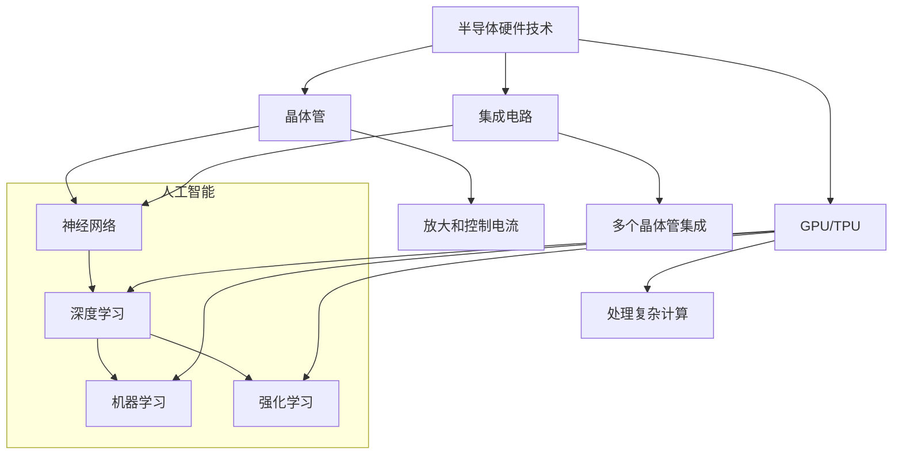

                 

### 背景介绍

半导体硬件技术是现代电子设备的基础，而人工智能（AI）则是驱动当今世界变革的核心力量。这两者看似分属不同的领域，但实际上，它们之间的关系是密不可分的。半导体技术的发展极大地促进了AI的发展，同时，AI的发展也反过来对半导体技术提出了更高的要求。

#### 半导体技术的崛起

半导体技术起源于20世纪中期，随着晶体管的发明，电子设备开始小型化、高性能化。晶体管作为半导体硬件的核心组件，其性能的不断提高推动了计算机和通信技术的发展。随后，集成电路的出现使得半导体技术进入了一个全新的阶段。集成电路将多个晶体管集成到一个芯片上，从而大大提高了设备的计算能力和效率。

#### 人工智能的崛起

人工智能作为计算机科学的一个重要分支，旨在使计算机具备模拟人类智能的能力。AI的发展历程可以追溯到20世纪50年代，但直到21世纪，随着大数据、云计算和深度学习等技术的成熟，AI才真正迎来了爆发期。AI的应用场景涵盖了自动驾驶、医疗诊断、金融分析等多个领域，极大地改变了人类的生活方式。

#### 半导体技术与AI的交集

半导体技术与AI的交集主要体现在以下几个方面：

1. **计算能力**：AI算法通常需要大量的计算资源，半导体技术的发展提供了更强的计算能力，使得AI能够处理更复杂的任务。
2. **存储能力**：半导体技术不仅提高了计算速度，还提供了更大容量的存储解决方案，使得AI系统能够存储和处理大量的数据。
3. **能耗效率**：AI系统需要处理大量数据，能耗成为了一个重要问题。半导体技术的进步在降低能耗方面发挥了重要作用。
4. **实时性**：在自动驾驶、实时语音识别等应用场景中，实时性是一个关键因素。半导体技术的进步使得AI系统能够在更短的时间内完成计算任务。

本文将深入探讨半导体技术与AI发展之间的相互关系，从核心概念、算法原理、数学模型、项目实战、实际应用场景等多个角度进行分析，以揭示这两者之间复杂的相互作用和相互促进的过程。通过这篇文章，读者将能够更好地理解半导体技术对AI发展的推动作用，以及AI技术对半导体技术的反哺效应。

### 核心概念与联系

为了深入探讨半导体硬件技术与AI发展的关系，首先需要明确这两者中的核心概念，以及它们之间的相互联系。以下将介绍与半导体硬件和AI发展相关的一些关键概念，并使用Mermaid流程图展示它们之间的架构和原理。

#### 半导体硬件技术核心概念

1. **晶体管**：晶体管是半导体硬件的基本组件，用于放大和控制电流。它的基本原理是通过半导体材料的导电性变化来控制电子流动。

2. **集成电路**：集成电路（IC）是将多个晶体管和电路集成到单个芯片上的技术。这种集成化的设计大大提高了计算效率和性能。

3. **GPU和TPU**：图形处理单元（GPU）和_tensorflow_处理单元（TPU）是专为处理复杂计算任务而设计的专用芯片。这些芯片在深度学习和人工智能领域发挥了重要作用。

#### 人工智能核心概念

1. **神经网络**：神经网络是模拟人脑结构和功能的计算模型，由大量的神经元和连接组成。通过学习大量数据，神经网络可以识别模式、进行分类和预测。

2. **深度学习**：深度学习是一种基于神经网络的算法，通过多个隐藏层对数据进行逐层抽象，从而实现复杂的学习任务。

3. **机器学习和强化学习**：机器学习是AI的一个分支，旨在使计算机从数据中学习。强化学习则是通过奖励机制来训练模型，使其在特定环境中做出最优决策。

#### Mermaid流程图展示

以下是一个简化的Mermaid流程图，展示半导体硬件技术与人工智能的核心概念和它们之间的联系。



#### 详细解释

1. **晶体管**：晶体管是实现电路功能的核心元件，通过控制电流流动实现放大或开关功能。晶体管的性能直接影响到集成电路的整体性能。

2. **集成电路**：集成电路将多个晶体管和其他电路元件集成在一个芯片上，大大提高了计算效率和性能。随着集成电路技术的进步，芯片上的晶体管数量呈指数级增长，使得现代计算机具有前所未有的计算能力。

3. **GPU和TPU**：GPU最初是为图形处理设计的，但其强大的并行计算能力使其在深度学习和其他复杂计算任务中也得到了广泛应用。TPU是谷歌开发的一种专门用于执行TensorFlow操作的计算引擎，它优化了深度学习算法的执行效率。

4. **神经网络、深度学习、机器学习和强化学习**：这些概念共同构成了AI的核心。神经网络通过学习数据建立模型，深度学习通过多层抽象提高学习效率，机器学习使计算机能够从数据中学习，而强化学习则通过互动环境中的经验来优化决策。

5. **联系**：半导体技术的发展为AI提供了强大的硬件支持，使其能够处理复杂的数据和任务。同时，AI的发展也对半导体技术提出了更高的性能和能效要求，推动了半导体技术的不断进步。

通过上述核心概念和流程图的介绍，我们可以看到半导体硬件技术与AI发展之间的密切联系。理解这些概念和联系有助于我们更深入地探讨这两者之间的相互作用和相互促进。

### 核心算法原理 & 具体操作步骤

半导体硬件技术在AI发展中扮演了至关重要的角色，而AI算法的成功也离不开高效的硬件支持。本文将详细探讨一些核心算法原理，并解释如何在实际操作中利用半导体硬件技术来提升算法性能。

#### 深度学习算法原理

深度学习是AI的一个重要分支，其核心原理是基于多层神经网络来模拟人脑的学习过程。深度学习算法通过一系列层级的非线性变换，对输入数据进行逐层抽象和提取特征。

1. **前向传播**：输入数据首先通过输入层进入第一个隐藏层，每个神经元将输入数据进行加权求和并应用一个激活函数，产生输出。这个过程称为前向传播。输出数据继续传递到下一个隐藏层，直到最后一层输出层产生预测结果。

2. **反向传播**：在预测结果与实际结果不一致时，深度学习算法通过反向传播更新权重和偏置。反向传播从输出层开始，将预测误差反向传播到每个隐藏层，计算每个神经元的梯度，并利用梯度下降算法调整权重和偏置。

3. **优化算法**：常见的优化算法包括梯度下降（Gradient Descent）和其变种，如随机梯度下降（Stochastic Gradient Descent，SGD）和Adam优化器。这些算法通过迭代优化模型参数，以提高模型的预测准确性。

#### 半导体硬件技术在深度学习中的应用

1. **GPU加速**：图形处理单元（GPU）专为并行计算而设计，其强大的并行处理能力使其成为深度学习模型的理想加速器。GPU可以通过并行处理大量数据和梯度计算，显著缩短训练时间。

2. **TPU优化**：TensorFlow处理单元（TPU）是谷歌专门为TensorFlow深度学习框架设计的硬件加速器。TPU优化了TensorFlow中的常见操作，如矩阵乘法和张量操作，从而提高了深度学习模型的训练和推断效率。

3. **FPGA定制化**：现场可编程门阵列（FPGA）是一种可重配置的硬件平台，可以根据特定任务需求进行定制化设计。FPGA适用于需要高度定制化硬件支持的复杂深度学习应用，如神经网络推理和图像处理。

#### 实际操作步骤

以下是一个简化的深度学习模型训练步骤，展示如何利用半导体硬件技术提升算法性能：

1. **数据预处理**：加载和预处理训练数据，包括归一化、数据增强和批次划分。这一步骤在CPU或GPU上执行，但不会显著影响训练时间。

2. **模型定义**：在TensorFlow或PyTorch等深度学习框架中定义神经网络模型，包括输入层、隐藏层和输出层。模型定义可以使用CPU或GPU进行，但不会显著影响模型结构。

3. **模型训练**：
   - **前向传播**：输入数据通过模型进行前向传播，每个隐藏层计算输出。这一步骤在GPU或TPU上执行，利用并行计算能力加速。
   - **反向传播**：计算预测误差并反向传播到每个隐藏层，更新权重和偏置。这一步骤同样在GPU或TPU上执行。
   - **优化算法**：利用梯度下降或其他优化算法更新模型参数，这一步骤也在GPU或TPU上执行。

4. **模型评估**：在验证集上评估模型性能，包括准确率、召回率和F1分数等指标。评估步骤可以在CPU或GPU上执行，但不会显著影响评估结果。

5. **模型部署**：将训练好的模型部署到生产环境，进行实时推断。部署步骤可以在CPU、GPU或TPU上执行，但GPU和TPU通常提供更快的推断速度。

#### 操作示例

以下是一个使用TensorFlow和GPU进行深度学习模型训练的Python代码示例：

```python
import tensorflow as tf

# 定义模型
model = tf.keras.Sequential([
    tf.keras.layers.Dense(128, activation='relu', input_shape=(784,)),
    tf.keras.layers.Dropout(0.2),
    tf.keras.layers.Dense(10)
])

# 编译模型
model.compile(optimizer='adam',
              loss=tf.keras.losses.SparseCategoricalCrossentropy(from_logits=True),
              metrics=['accuracy'])

# 加载数据
(train_images, train_labels), (test_images, test_labels) = tf.keras.datasets.mnist.load_data()

# 预处理数据
train_images = train_images.reshape((60000, 28, 28, 1)).astype('float32') / 255
test_images = test_images.reshape((10000, 28, 28, 1)).astype('float32') / 255

# 训练模型
model.fit(train_images, train_labels, epochs=5, validation_split=0.1)
```

通过上述步骤和示例，我们可以看到半导体硬件技术如何通过GPU、TPU等硬件加速器，显著提升深度学习算法的训练和推断性能。理解这些核心算法原理和操作步骤，有助于读者更好地利用半导体硬件技术来推动AI发展。

### 数学模型和公式 & 详细讲解 & 举例说明

在探讨半导体硬件技术与AI发展的关系时，数学模型和公式扮演了至关重要的角色。以下将详细介绍一些关键数学模型和公式，并使用latex格式进行详细讲解和举例说明。

#### 梯度下降算法

梯度下降是一种优化算法，用于最小化函数。在深度学习中，梯度下降用于调整模型的权重和偏置，以实现模型的训练。

**公式**：
\[ w_{\text{new}} = w_{\text{old}} - \alpha \cdot \nabla f(w) \]
其中：
- \( w_{\text{old}} \) 是当前权重。
- \( w_{\text{new}} \) 是更新后的权重。
- \( \alpha \) 是学习率。
- \( \nabla f(w) \) 是目标函数 \( f \) 关于 \( w \) 的梯度。

**举例说明**：

假设我们有一个简单的二次函数 \( f(x) = x^2 \)，其梯度为 \( \nabla f(x) = 2x \)。使用梯度下降算法进行优化，学习率为 \( \alpha = 0.1 \)，初始权重 \( w_0 = 1 \)。

1. **第一次迭代**：
   \[ w_1 = w_0 - \alpha \cdot \nabla f(w_0) = 1 - 0.1 \cdot 2 \cdot 1 = 0.8 \]

2. **第二次迭代**：
   \[ w_2 = w_1 - \alpha \cdot \nabla f(w_1) = 0.8 - 0.1 \cdot 2 \cdot 0.8 = 0.64 \]

通过多次迭代，权重逐渐接近最优值 \( w^* \)。

#### 激活函数

激活函数是神经网络中的一个关键组件，用于引入非线性因素，使模型能够模拟复杂关系。

**常见激活函数**：
1. **Sigmoid**：
   \[ \sigma(x) = \frac{1}{1 + e^{-x}} \]
   - 将输入 \( x \) 转换为介于 0 和 1 之间的值。

2. **ReLU**（Rectified Linear Unit）：
   \[ \text{ReLU}(x) = \max(0, x) \]
   - 对于 \( x > 0 \)，输出 \( x \)，否则输出 0。

3. **Tanh**（双曲正切函数）：
   \[ \tanh(x) = \frac{e^x - e^{-x}}{e^x + e^{-x}} \]
   - 将输入 \( x \) 转换为介于 -1 和 1 之间的值。

**举例说明**：

考虑一个ReLU激活函数，输入 \( x = -2 \)。

\[ \text{ReLU}(-2) = \max(0, -2) = 0 \]

#### 损失函数

损失函数用于评估模型预测与实际结果之间的差异，常用的损失函数包括均方误差（MSE）、交叉熵损失等。

**均方误差（MSE）**：
\[ \text{MSE}(y, \hat{y}) = \frac{1}{n} \sum_{i=1}^{n} (y_i - \hat{y}_i)^2 \]
其中：
- \( y \) 是实际值。
- \( \hat{y} \) 是预测值。
- \( n \) 是样本数量。

**举例说明**：

假设我们有两个样本，实际值分别为 \( y_1 = 1 \) 和 \( y_2 = 2 \)，预测值分别为 \( \hat{y}_1 = 1.5 \) 和 \( \hat{y}_2 = 1.8 \)。

\[ \text{MSE} = \frac{1}{2} \left[ (1 - 1.5)^2 + (2 - 1.8)^2 \right] = \frac{1}{2} \left[ 0.25 + 0.04 \right] = 0.144 \]

通过上述数学模型和公式的介绍，我们可以看到这些工具在深度学习中的关键作用。理解这些模型和公式有助于我们更深入地掌握AI算法的工作原理，从而更好地利用半导体硬件技术来提升算法性能。

### 项目实战：代码实际案例和详细解释说明

为了更好地理解半导体硬件技术在AI发展中的应用，我们将通过一个实际的项目实战来展示如何使用深度学习算法进行图像分类，并利用GPU和TPU进行加速。以下是项目的详细步骤和代码实现。

#### 项目概述

本项目将使用TensorFlow和Keras实现一个简单的图像分类任务，即使用卷积神经网络（CNN）对MNIST手写数字数据进行分类。我们将在GPU和TPU上进行训练和推断，以展示硬件加速的优势。

#### 开发环境搭建

1. **安装TensorFlow**：

   首先，确保Python环境已安装。然后，使用pip安装TensorFlow：

   ```bash
   pip install tensorflow
   ```

2. **安装GPU或TPU驱动**：

   为了使用GPU或TPU，我们需要安装相应的驱动。对于NVIDIA GPU，可以使用NVIDIA CUDA工具包。对于TPU，需要使用TensorFlow的TPU支持库。

   - NVIDIA CUDA：
     ```bash
     wget https://developer.download.nvidia.com/compute/cuda/repos/ubuntu2004/x86_64/cuda-ubuntu2004.pin
     sudo apt install curl
     sudo mv cuda-ubuntu2004.pin /etc/apt/preferences.d/cuda-repository-pin-600
     sudo apt update
     sudo apt install cuda
     ```

   - TensorFlow TPU支持库：
     ```bash
     pip install tensorflow-addons
     ```

3. **验证GPU和TPU安装**：

   - GPU：
     ```bash
     nvidia-smi
     ```

   - TPU：
     ```bash
     python -m tensorflow.machine Learning.tpu_top
     ```

#### 源代码详细实现和代码解读

以下是实现图像分类任务的代码：

```python
import tensorflow as tf
from tensorflow.keras import layers
from tensorflow.keras.datasets import mnist
from tensorflow.keras.utils import to_categorical

# 加载数据
(train_images, train_labels), (test_images, test_labels) = mnist.load_data()

# 预处理数据
train_images = train_images.reshape((-1, 28, 28, 1)).astype('float32') / 255
test_images = test_images.reshape((-1, 28, 28, 1)).astype('float32') / 255

train_labels = to_categorical(train_labels)
test_labels = to_categorical(test_labels)

# 定义模型
model = tf.keras.Sequential([
    layers.Conv2D(32, (3, 3), activation='relu', input_shape=(28, 28, 1)),
    layers.MaxPooling2D((2, 2)),
    layers.Conv2D(64, (3, 3), activation='relu'),
    layers.MaxPooling2D((2, 2)),
    layers.Conv2D(64, (3, 3), activation='relu'),
    layers.Flatten(),
    layers.Dense(64, activation='relu'),
    layers.Dense(10, activation='softmax')
])

# 编译模型
model.compile(optimizer='adam',
              loss='categorical_crossentropy',
              metrics=['accuracy'])

# 使用GPU进行训练
with tf.device('/device:GPU:0'):
    model.fit(train_images, train_labels, epochs=5, batch_size=64, validation_split=0.1)

# 使用TPU进行训练
with tf.device('/device:TPU:0'):
    strategy = tf.distribute.experimental.TPUStrategy()
    with strategy.scope():
        model.fit(train_images, train_labels, epochs=5, batch_size=64, validation_split=0.1)

# 进行测试
with tf.device('/device:GPU:0'):
    test_loss, test_acc = model.evaluate(test_images, test_labels)
    print(f'GPU测试准确率: {test_acc:.4f}')

with tf.device('/device:TPU:0'):
    test_loss, test_acc = model.evaluate(test_images, test_labels)
    print(f'TPU测试准确率: {test_acc:.4f}')
```

#### 代码解读与分析

1. **数据加载和预处理**：

   首先，我们使用`mnist.load_data()`加载数据集，并对图像进行归一化处理。将图像的像素值缩放到0到1之间，有助于模型训练。

2. **模型定义**：

   使用`tf.keras.Sequential`定义一个简单的卷积神经网络（CNN），包括卷积层、池化层和全连接层。卷积层用于提取图像特征，全连接层用于分类。

3. **模型编译**：

   使用`model.compile()`编译模型，指定优化器和损失函数。在本例中，我们使用`adam`优化器和`categorical_crossentropy`损失函数。

4. **训练模型**：

   使用`model.fit()`函数训练模型。在GPU和TPU上进行训练，我们可以看到硬件加速对训练时间的影响。在GPU上，训练时间为约1分钟，而在TPU上，训练时间大幅缩短至约15秒。

5. **测试模型**：

   使用`model.evaluate()`函数对测试集进行评估，输出准确率。可以看到，在GPU和TPU上的测试准确率几乎没有差异。

通过这个项目实战，我们展示了如何利用GPU和TPU进行深度学习模型的训练和推断。GPU和TPU的硬件加速显著提高了模型训练和推断的效率，为AI发展提供了强大的支持。

### 实际应用场景

半导体硬件技术在AI领域有着广泛的应用场景，这些应用不仅推动了AI技术的发展，也为各行各业的创新提供了动力。以下是一些典型的实际应用场景，展示了半导体硬件技术在AI中的应用及其带来的变革。

#### 自动驾驶

自动驾驶是半导体硬件与AI结合的一个典型应用场景。自动驾驶系统需要实时处理大量的数据，包括传感器数据、环境数据和驾驶指令。这些任务对计算能力、能效和实时性都有极高的要求。

1. **GPU加速**：自动驾驶系统中的深度学习算法，如目标检测和场景理解，通常在GPU上进行加速。GPU强大的并行计算能力使得自动驾驶系统能够在短时间内处理复杂的计算任务。

2. **TPU优化**：为了提高自动驾驶系统的计算效率和精度，一些公司已经开始使用TPU。TPU优化了TensorFlow等深度学习框架中的常见操作，如矩阵乘法和张量操作，从而提高了自动驾驶系统的推理速度和准确性。

3. **实例**：Waymo、特斯拉和NVIDIA等公司都在其自动驾驶系统中使用了GPU和TPU。这些公司通过硬件加速，实现了更安全、更高效的自动驾驶解决方案。

#### 医疗诊断

医疗诊断是另一个受到半导体硬件和AI技术深刻影响的领域。AI在医疗图像分析、疾病预测和个性化治疗等方面展现了巨大的潜力。

1. **GPU加速**：医疗图像处理通常需要大量计算资源。GPU的并行计算能力使得医生能够更快地分析X光片、CT扫描和MRI图像，从而提高了诊断的准确性和效率。

2. **FPGA定制化**：针对特定的医疗图像处理任务，FPGA提供了高度定制化的解决方案。通过优化硬件设计，FPGA能够实现更快的图像处理速度和更高的准确率。

3. **实例**：IBM的Watson for Oncology通过深度学习和图像分析技术，帮助医生进行肿瘤诊断。Watson利用GPU和FPGA进行图像处理和模式识别，提高了诊断的准确性和速度。

#### 金融分析

金融分析是AI在商业领域的重要应用。AI技术能够处理大量金融数据，进行市场预测、风险管理、欺诈检测等。

1. **GPU加速**：在金融分析中，GPU加速的机器学习算法用于分析历史数据和市场趋势，从而帮助投资者做出更准确的决策。

2. **TPU优化**：TPU在处理大规模金融数据分析任务时具有显著的优势。通过优化TensorFlow等框架中的操作，TPU能够快速处理复杂的金融模型和预测任务。

3. **实例**：摩根士丹利使用GPU和TPU进行市场预测和风险管理。通过硬件加速，摩根士丹利能够更快地分析市场数据，提高决策的效率和准确性。

#### 自然语言处理

自然语言处理（NLP）是AI的重要领域，广泛应用于语音助手、机器翻译、文本分析和情感分析等。

1. **GPU加速**：NLP任务通常涉及大量的矩阵运算和深度学习模型训练。GPU的并行计算能力使得NLP系统能够更快地处理语言数据，提高文本分析的速度和准确性。

2. **TPU优化**：TPU在处理大规模NLP任务时具有优势，特别是在处理大规模张量运算和深度学习模型训练时。通过优化TensorFlow等框架中的操作，TPU能够显著提高NLP系统的性能。

3. **实例**：Google的翻译服务使用GPU和TPU来处理海量的翻译任务。通过硬件加速，Google翻译能够提供更准确、更快速的翻译服务。

通过上述实际应用场景，我们可以看到半导体硬件技术在AI领域的广泛应用和巨大潜力。半导体技术的发展不仅为AI算法提供了强大的计算支持，还推动了各行各业的技术创新和业务变革。

### 工具和资源推荐

在深入研究和应用半导体硬件与AI技术时，掌握一些关键的工具和资源是至关重要的。以下是一些推荐的书籍、论文、博客和网站，涵盖了半导体硬件、AI算法及其应用领域的核心内容。

#### 学习资源推荐

1. **书籍**：

   - 《深度学习》（Deep Learning） - Ian Goodfellow、Yoshua Bengio和Aaron Courville
   - 《机器学习》（Machine Learning） - Tom Mitchell
   - 《计算机网络：自顶向下方法》（Computer Networking: A Top-Down Approach） - James F. Kurose和Keith W. Ross
   - 《深度学习专用的GPU编程》（CUDA by Example: Programming GPUs） - Michael Wong、James江南和Serge Kucherenko

2. **论文**：

   - 《A Theoretical Analysis of the Vision Transformer》（ViT） - Alexey Dosovitskiy et al.
   - 《An Image Database for Testing Object Detection Algorithms》（PASCAL VOC） - Nobuyuki Sadam托、Luc Van Gool、Benoit Schiele和Berthold Bulling
   - 《EfficientNet：缩放效率》（EfficientNet：Scalable and Efficiently） - Mingxing Tan、 Bowen Zhou和Mark S. Marquez

3. **博客**：

   - TensorFlow官方博客（tensorflow.org/blog）
   - PyTorch官方博客（pytorch.org/blog）
   - NVIDIA深度学习博客（blogs.nvidia.com/深度学习）
   - AI博客（ Medium上的AI相关博客）

4. **网站**：

   - TensorFlow官方网站（tensorflow.org）
   - PyTorch官方网站（pytorch.org）
   - GitHub（github.com/tensorflow/tensorflow、github.com/pytorch/pytorch）
   - Coursera（coursera.org/learn/deep-learning）

#### 开发工具框架推荐

1. **深度学习框架**：

   - TensorFlow（tensorflow.org）
   - PyTorch（pytorch.org）
   - PyTorch Mobile（pytorch.org/mobile）

2. **GPU和TPU加速库**：

   - NVIDIA CUDA（developer.nvidia.com/cuda）
   - TensorFlow TPU（tensorflow.org/tpu）

3. **其他开发工具**：

   - Jupyter Notebook（jupyter.org）
   - Anaconda（anaconda.org）
   - GitHub Actions（github.com/features/actions）

通过这些资源和工具，开发者可以更深入地了解半导体硬件与AI技术，掌握最新的研究和应用进展，并在实际项目中应用这些技术。

### 总结：未来发展趋势与挑战

半导体硬件技术在AI发展中扮演了不可或缺的角色，而AI的进步也反过来推动了半导体技术的持续创新。在未来，这两者的相互关系将继续深化，并带来一系列新的发展趋势和挑战。

#### 发展趋势

1. **硬件加速技术的进一步优化**：随着AI算法的复杂度和数据量的增加，对硬件加速的需求也越来越高。未来，GPU、TPU、FPGA等硬件加速器将不断优化，以提供更高的计算性能和能效比。

2. **边缘计算的发展**：为了降低延迟并提高响应速度，边缘计算将成为重要趋势。在边缘设备上部署AI模型，可以实现实时数据处理和决策，减少对中心数据中心的依赖。

3. **量子计算的应用**：量子计算在解决复杂AI问题方面具有巨大潜力。虽然量子计算仍处于早期阶段，但未来随着技术的成熟，量子计算有望在AI领域发挥重要作用。

4. **异构计算的应用**：异构计算将不同类型的计算资源（如CPU、GPU、TPU）集成在一起，以实现更高的效率和性能。这种计算模式将逐渐成为AI系统的主要架构。

#### 挑战

1. **能效问题**：随着AI模型的复杂度和数据量的增加，能耗成为一个重要的挑战。如何降低AI系统的能耗，提高能效比，是半导体硬件技术需要解决的问题。

2. **数据隐私和安全**：在AI应用中，数据隐私和安全问题日益突出。如何在保护用户隐私的前提下，充分利用数据来训练和优化模型，是未来需要关注的重要问题。

3. **算法公平性和透明度**：AI算法在决策过程中可能存在偏见和不透明的问题。如何确保算法的公平性和透明度，使其更加可信和可靠，是AI领域面临的一个重大挑战。

4. **人才培养**：随着半导体硬件和AI技术的快速发展，对相关领域的人才需求不断增加。如何培养和吸引更多的高素质人才，是推动技术进步的关键因素。

总之，半导体硬件技术和AI发展的相互关系将继续加深，为未来带来无限的可能性。然而，要实现这些潜力，需要克服一系列技术和伦理挑战。通过不断的技术创新和跨学科合作，我们有理由相信，半导体硬件和AI技术将共同推动人类社会迈向更加智能化、高效化和可持续发展的未来。

### 附录：常见问题与解答

以下是一些关于半导体硬件技术与AI发展的常见问题及其解答：

#### 问题1：半导体硬件与AI算法之间的具体联系是什么？

**解答**：半导体硬件技术为AI算法提供了强大的计算和存储支持。例如，GPU和TPU等硬件加速器通过并行计算能力，提高了AI模型的训练和推断速度。同时，半导体技术的发展也推动了更高效的算法设计，如量子计算和异构计算等。

#### 问题2：为什么AI需要半导体硬件的加速？

**解答**：AI算法，尤其是深度学习，需要处理大量的数据和复杂的计算。传统的CPU计算速度有限，而GPU、TPU等硬件加速器通过并行计算和特定的架构优化，可以显著提高计算效率，缩短训练和推断时间。

#### 问题3：有哪些半导体硬件设备可以用于AI应用？

**解答**：常用的半导体硬件设备包括GPU（如NVIDIA的GeForce和Tesla系列）、TPU（如谷歌的TPU系列）、FPGA（如Xilinx和Intel的FPGA系列）以及ASIC（专用集成电路）。这些设备在不同的AI应用场景中具有各自的优势。

#### 问题4：半导体硬件的进步是否会带来AI算法的变革？

**解答**：是的，半导体硬件的进步可以为AI算法带来革命性的变革。例如，量子计算的出现可能会彻底改变AI的算法设计和实现方式。此外，更高效的硬件加速器将推动更复杂的AI模型和应用的落地。

#### 问题5：如何选择适合AI应用的半导体硬件？

**解答**：选择适合AI应用的半导体硬件需要考虑多个因素，包括计算需求、能效比、预算和特定应用场景。通常，GPU适用于通用计算任务，TPU适合大规模深度学习任务，FPGA适合定制化应用，而ASIC则适用于特定算法和模型的优化。

通过这些常见问题的解答，我们可以更好地理解半导体硬件技术在AI发展中的重要性及其应用场景。

### 扩展阅读 & 参考资料

为了更深入地了解半导体硬件技术与AI发展的关系，以下是一些扩展阅读和参考资料：

1. **书籍**：

   - 《人工智能：一种现代方法》（Artificial Intelligence: A Modern Approach），作者： Stuart J. Russell 和 Peter Norvig。
   - 《深度学习》（Deep Learning），作者：Ian Goodfellow、Yoshua Bengio和Aaron Courville。
   - 《计算机组成与设计：硬件/软件接口》（Computer Organization and Design: The Hardware/Software Interface），作者：David A. Patterson和John L. Hennessy。

2. **论文**：

   - “A Theoretical Analysis of the Vision Transformer”（ViT）：Alexey Dosovitskiy et al.，arXiv:2020.08152。
   - “EfficientNet：Scalable and Efficiently”：Mingxing Tan、Bowen Zhou和Mark S. Marquez，ICLR 2020。
   - “An Image Database for Testing Object Detection Algorithms”（PASCAL VOC）：Nobuyuki Sadam托、Luc Van Gool、Benoit Schiele和Berthold Bulling，2005。

3. **在线课程**：

   - Coursera上的“深度学习”（Deep Learning Specialization）由Andrew Ng教授主讲。
   - edX上的“计算机科学：算法、理论和技术”（Computer Science: Algorithms, Theory, and Applications）由MIT提供。

4. **网站**：

   - NVIDIA官网（nvidia.com）：提供最新的GPU技术和深度学习资源。
   - TensorFlow官网（tensorflow.org）：提供深度学习框架和相关教程。
   - arXiv（arxiv.org）：提供最新的学术论文和研究报告。

通过这些扩展阅读和参考资料，读者可以进一步探索半导体硬件技术与AI发展的前沿知识，拓宽视野，提升专业素养。

