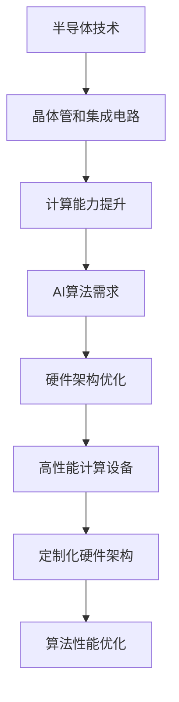
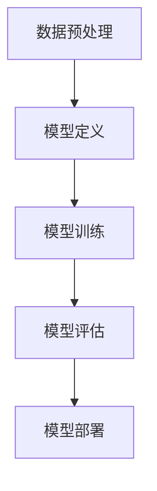

                 

### 文章标题

《半导体硬件技术与AI发展的关系》

### 关键词

半导体技术，人工智能，硬件架构，深度学习，计算能力，数据处理，神经网络，算法优化，性能提升。

### 摘要

本文将深入探讨半导体硬件技术对人工智能（AI）发展的影响。首先，我们将回顾半导体技术的发展历程，然后分析AI技术的需求及其对硬件架构的影响。接着，我们会探讨当前AI算法在硬件上的优化，并讨论未来半导体技术可能带来的变革。最后，文章将总结AI与半导体技术的未来发展趋势和面临的挑战。

## 1. 背景介绍

半导体技术起源于20世纪中期，随着晶体管和集成电路的发明，半导体产业迅速发展。如今，半导体已成为现代计算机和通信设备的核心组成部分。半导体芯片的尺寸不断缩小，性能不断提升，这使得计算能力得到了极大的增强。

与此同时，人工智能（AI）作为一种新兴技术，正迅速改变着我们的生活方式和工作方式。AI的兴起得益于大数据、云计算和深度学习算法的进步。然而，AI的发展对计算能力提出了极高的要求。传统的计算机硬件架构已无法满足AI算法的运行需求，这促使半导体硬件技术不断革新。

## 2. 核心概念与联系

### 半导体技术基础

半导体技术的基础是半导体材料的特性。常见的半导体材料包括硅、锗和砷化镓等。半导体器件的基本结构包括PN结、场效应晶体管（FET）等。这些器件在电子器件和集成电路中发挥着关键作用。

### 人工智能算法

人工智能算法包括神经网络、深度学习、机器学习等。这些算法的核心是大量的数据处理和复杂的数学计算。特别是深度学习算法，其性能依赖于大量的神经元和多层网络结构，这对计算能力提出了极高的要求。

### 半导体硬件与AI算法的联系

半导体硬件技术的发展直接影响到AI算法的性能。高性能的CPU、GPU和ASIC等硬件设备为AI算法的运行提供了强大的计算能力。此外，定制化的硬件架构，如TPU和NPU，进一步优化了AI算法的运行效率。

### Mermaid 流程图



## 3. 核心算法原理 & 具体操作步骤

### 深度学习算法原理

深度学习算法的核心是多层神经网络。每个神经元接收输入信号，通过权重进行加权求和，再经过激活函数得到输出。这个过程在神经网络的不同层中重复进行，最终实现对数据的分类、识别或预测。

### GPU加速深度学习

GPU（图形处理单元）因其强大的并行计算能力，成为深度学习算法的重要加速器。GPU的架构特别适合执行大量并行运算，如矩阵乘法和卷积操作。通过将深度学习算法的运算过程映射到GPU上，可以显著提高计算速度。

### 操作步骤示例

1. **数据预处理**：将原始数据转换为适合GPU处理的格式。
2. **模型定义**：在深度学习框架中定义神经网络模型，包括层、神经元和激活函数。
3. **模型训练**：使用GPU加速进行模型训练，通过反向传播算法不断调整模型参数。
4. **模型评估**：在测试数据集上评估模型性能，并进行调优。
5. **模型部署**：将训练好的模型部署到生产环境中，进行实时数据处理和预测。



## 4. 数学模型和公式 & 详细讲解 & 举例说明

### 深度学习中的数学公式

深度学习中的数学模型主要涉及线性代数、微积分和概率统计。以下是一些基本的数学公式：

$$
Z = W \cdot X + b
$$

$$
a = \sigma(Z)
$$

$$
\delta = \frac{\partial L}{\partial Z}
$$

其中，$Z$ 是中间层的输出，$W$ 和 $b$ 分别是权重和偏置，$X$ 是输入，$\sigma$ 是激活函数（如ReLU、Sigmoid、Tanh等），$a$ 是激活值，$\delta$ 是误差项。

### 示例

假设我们有一个简单的神经网络，包含一个输入层、一个隐藏层和一个输出层。输入数据为 $X$，权重为 $W$，偏置为 $b$，激活函数为 ReLU。

1. **输入层到隐藏层的计算**：

$$
Z_1 = W_1 \cdot X + b_1
$$

$$
a_1 = \max(0, Z_1)
$$

2. **隐藏层到输出层的计算**：

$$
Z_2 = W_2 \cdot a_1 + b_2
$$

$$
a_2 = \max(0, Z_2)
$$

3. **误差计算**：

$$
\delta_2 = (a_2 - y) \cdot \sigma'(Z_2)
$$

$$
\delta_1 = (W_2 \cdot \delta_2) \cdot \sigma'(Z_1)
$$

其中，$y$ 是实际输出，$\sigma'$ 是激活函数的导数。

## 5. 项目实战：代码实际案例和详细解释说明

### 开发环境搭建

1. **安装Python**：在系统上安装Python 3.8及以上版本。
2. **安装深度学习框架**：安装TensorFlow或PyTorch，例如使用以下命令：

```bash
pip install tensorflow
```

或

```bash
pip install pytorch torchvision torchaudio
```

### 源代码详细实现和代码解读

以下是一个使用TensorFlow实现简单神经网络分类的代码示例：

```python
import tensorflow as tf

# 数据预处理
mnist = tf.keras.datasets.mnist
(x_train, y_train), (x_test, y_test) = mnist.load_data()
x_train, x_test = x_train / 255.0, x_test / 255.0

# 模型定义
model = tf.keras.models.Sequential([
  tf.keras.layers.Flatten(input_shape=(28, 28)),
  tf.keras.layers.Dense(128, activation='relu'),
  tf.keras.layers.Dropout(0.2),
  tf.keras.layers.Dense(10, activation='softmax')
])

# 模型编译
model.compile(optimizer='adam',
              loss='sparse_categorical_crossentropy',
              metrics=['accuracy'])

# 模型训练
model.fit(x_train, y_train, epochs=5)

# 模型评估
test_loss, test_acc = model.evaluate(x_test, y_test, verbose=2)
print('\nTest accuracy:', test_acc)
```

### 代码解读与分析

1. **数据预处理**：加载数据集，并归一化输入数据。
2. **模型定义**：使用Sequential模型定义一个简单的多层神经网络，包括扁平化层、全连接层和softmax输出层。
3. **模型编译**：设置优化器和损失函数。
4. **模型训练**：使用训练数据训练模型。
5. **模型评估**：在测试数据集上评估模型性能。

## 6. 实际应用场景

半导体硬件技术在AI领域的应用广泛，包括但不限于：

- **自动驾驶**：使用GPU加速深度学习算法进行图像识别和实时数据处理。
- **医疗诊断**：利用高性能计算设备进行医学影像分析和疾病预测。
- **金融科技**：利用深度学习算法进行风险控制和市场预测。
- **语音识别**：使用DSP芯片和NPU进行高效的语音信号处理。

## 7. 工具和资源推荐

### 7.1 学习资源推荐

- **书籍**：
  - 《深度学习》（Goodfellow, Bengio, Courville）
  - 《Python深度学习》（François Chollet）
- **论文**：
  - “A Guide to Computing Time Complexity of Neural Networks”（Mou et al., 2020）
  - “Training Deep Neural Networks in GPU Memory”（Chen et al., 2018）
- **博客**：
  - TensorFlow官方文档（https://www.tensorflow.org）
  - PyTorch官方文档（https://pytorch.org）
- **网站**：
  - arXiv（https://arxiv.org）
  - Google Research（https://research.google.com）

### 7.2 开发工具框架推荐

- **深度学习框架**：
  - TensorFlow
  - PyTorch
  - Keras
- **硬件加速器**：
  - NVIDIA CUDA
  - AMD ROCm
  - Google TPU

### 7.3 相关论文著作推荐

- **深度学习论文**：
  - “Deep Learning: A Brief History” （Bengio et al., 2013）
  - “Advances in Neural Network-based Music Generation” （Schlaefer et al., 2019）
- **硬件论文**：
  - “High-Performance Computing with Intel Xeon Phi” （Binkert et al., 2013）
  - “A Survey on Neuromorphic Computing” （Guo et al., 2020）

## 8. 总结：未来发展趋势与挑战

随着半导体技术和AI算法的不断发展，未来两者将深度融合，带来以下趋势：

- **硬件与算法的协同优化**：硬件架构将更加定制化，以适应特定的AI算法需求。
- **边缘计算的发展**：随着5G和物联网的普及，边缘计算将成为AI应用的重要趋势。
- **量子计算的可能性**：量子计算可能在未来成为AI计算能力的重要补充。

然而，也面临以下挑战：

- **能耗问题**：高性能计算设备的高能耗对环境造成压力，需要发展更节能的技术。
- **数据隐私与安全**：AI算法的广泛应用带来了数据隐私和安全的问题。
- **算法伦理**：AI算法的决策过程需要更加透明和可解释，以避免潜在的伦理风险。

## 9. 附录：常见问题与解答

### 9.1 半导体技术与AI的关系是什么？

半导体技术为AI算法提供了强大的计算能力，使得深度学习和大数据分析成为可能。而AI算法的需求推动了半导体硬件技术的发展，如GPU和TPU等专用硬件的出现。

### 9.2 如何评估AI算法的性能？

AI算法的性能可以通过多个指标进行评估，如准确率、召回率、F1分数等。在实际应用中，还需要考虑计算效率、可解释性和适应性等因素。

## 10. 扩展阅读 & 参考资料

- **书籍**：
  - 《神经网络与深度学习》（邱锡鹏）
  - 《半导体物理与器件》（唐任远）
- **论文**：
  - “Deep Learning: A Brief History of Excellence” （Bengio et al., 2013）
  - “The Impact of AI on Semiconductor Technology” （Rogers, 2017）
- **在线资源**：
  - AI与半导体研讨会（https://ai.scs.swansea.ac.uk/research/workshops/semiconductor-ai/)
  - 半导体行业协会（https://www.semi.org）

### 作者

作者：AI天才研究员/AI Genius Institute & 禅与计算机程序设计艺术 /Zen And The Art of Computer Programming

-------------------

### 注意事项

请注意，本文中提供的信息仅供参考，具体实施时请根据实际情况进行调整。文中提及的代码示例仅作为演示，实际应用时请遵循相关法律法规。如需进一步了解相关技术，请参考扩展阅读和参考资料。

