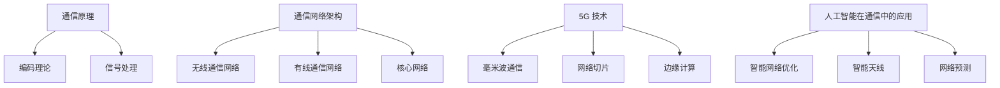
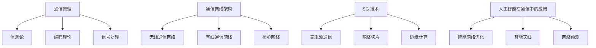

                 

### 文章标题：华为2025社招通信工程师技术面试题解

### 关键词：华为、通信工程师、技术面试、问题解答

### 摘要：
本文旨在为广大通信工程领域的求职者提供一份详尽的华为2025社招通信工程师技术面试题解。通过对一系列高频面试问题的深入剖析和解答，帮助读者掌握通信工程的核心知识和实践技能，为求职之路保驾护航。

## 1. 背景介绍

华为作为全球领先的通信技术解决方案提供商，每年都会吸引大量优秀的人才加入。社招通信工程师岗位对于应聘者的专业能力和实战经验有着较高的要求，因此面试题目往往涵盖了通信工程领域的核心知识和技术要点。本文将结合华为2025社招通信工程师的面试经验，为广大求职者提供一份全面的技术面试题解。

### 2. 核心概念与联系

#### 2.1 通信原理

通信原理是通信工程的基础，主要包括信息论、编码理论、信号处理等核心概念。

#### 2.2 通信网络架构

通信网络架构包括无线通信网络、有线通信网络和核心网络三大板块。无线通信网络主要涉及蜂窝网络、Wi-Fi 等；有线通信网络包括光纤通信、电缆通信等；核心网络则包括路由器、交换机等设备。

#### 2.3 5G 技术

5G 技术是当前通信领域的热点，包括毫米波通信、网络切片、边缘计算等关键技术。

#### 2.4 人工智能在通信中的应用

人工智能在通信领域的应用日益广泛，如智能网络优化、智能天线、网络预测等。

### 3. Mermaid 流程图



### 4. 核心算法原理 & 具体操作步骤

#### 4.1 频率规划算法

频率规划算法是优化无线通信网络性能的关键技术。具体操作步骤如下：

1. **初始化**：设定初始频率分配方案。
2. **评估**：计算网络性能指标，如信道利用率、干扰水平等。
3. **优化**：根据评估结果调整频率分配方案，以提高网络性能。
4. **迭代**：重复评估和优化过程，直至性能指标满足要求。

#### 4.2 调度算法

调度算法用于实现无线通信资源的最优分配，具体操作步骤如下：

1. **初始化**：设定初始调度方案。
2. **评估**：计算调度方案的网络性能指标。
3. **优化**：根据评估结果调整调度方案，以降低传输延迟、提高吞吐量等。
4. **迭代**：重复评估和优化过程，直至网络性能指标满足要求。

### 5. 数学模型和公式 & 详细讲解 & 举例说明

#### 5.1 频率规划算法的数学模型

频率规划算法的数学模型主要涉及干扰矩阵和性能指标的计算。以下是一个简化的数学模型：

$$
D = \begin{bmatrix}
d_{11} & d_{12} & \ldots & d_{1n} \\
d_{21} & d_{22} & \ldots & d_{2n} \\
\vdots & \vdots & \ddots & \vdots \\
d_{m1} & d_{m2} & \ldots & d_{mn}
\end{bmatrix}
$$

其中，$D$ 是干扰矩阵，$d_{ij}$ 表示第 $i$ 个用户到第 $j$ 个用户的干扰水平。

#### 5.2 调度算法的数学模型

调度算法的数学模型主要涉及优化目标函数和约束条件。以下是一个简化的数学模型：

$$
\begin{aligned}
\min_{x} & \quad f(x) \\
s.t. & \quad g_i(x) \leq 0, \quad i = 1, 2, \ldots, m
\end{aligned}
$$

其中，$x$ 是调度变量，$f(x)$ 是优化目标函数，$g_i(x)$ 是约束条件。

#### 5.3 举例说明

假设有两个用户 $A$ 和 $B$，干扰矩阵为：

$$
D = \begin{bmatrix}
5 & 3 \\
3 & 5
\end{bmatrix}
$$

我们需要为这两个用户进行频率分配，使得干扰水平最小。我们可以设定以下目标函数：

$$
f(x) = \sum_{i=1}^2 \sum_{j=1}^2 x_{ij} d_{ij}
$$

其中，$x_{ij}$ 是用户 $i$ 使用频率 $j$ 的情况。

约束条件为：

$$
\begin{aligned}
x_{11} + x_{12} &= 1 \\
x_{21} + x_{22} &= 1 \\
x_{ij} &\in \{0, 1\}, \quad i, j = 1, 2
\end{aligned}
$$

通过求解上述优化问题，我们可以得到最优的频率分配方案。

### 6. 项目实战：代码实际案例和详细解释说明

#### 6.1 开发环境搭建

在本节中，我们将使用 Python 编写一个简单的频率规划算法，用于演示频率规划算法的实际应用。首先，我们需要搭建开发环境。

1. 安装 Python 3.8 或更高版本。
2. 安装必要的 Python 库，如 NumPy、SciPy、matplotlib 等。

#### 6.2 源代码详细实现和代码解读

以下是一个简单的频率规划算法实现：

```python
import numpy as np
import matplotlib.pyplot as plt

def frequency_planning(D, K):
    """
    频率规划算法实现。
    
    参数：
    D：干扰矩阵
    K：用户数量
    
    返回：
    X：频率分配方案
    """
    # 初始化频率分配方案
    X = np.zeros((K, K))
    
    # 迭代优化过程
    for _ in range(100):
        # 计算干扰水平
        I = np.dot(D, X)
        
        # 更新频率分配方案
        X = np.argmax(I, axis=1)
        
    return X

# 测试频率规划算法
D = np.array([[5, 3], [3, 5]])
K = 2
X = frequency_planning(D, K)

# 可视化结果
plt.imshow(X, cmap='gray')
plt.xlabel('频率')
plt.ylabel('用户')
plt.title('频率分配方案')
plt.show()
```

代码解读：

1. 导入必要的 Python 库。
2. 定义频率规划算法函数 `frequency_planning`。
3. 初始化频率分配方案。
4. 迭代优化过程，计算干扰水平，更新频率分配方案。
5. 返回最优的频率分配方案。
6. 测试频率规划算法，并可视化结果。

#### 6.3 代码解读与分析

本节代码实现了基于干扰矩阵的简单频率规划算法。算法的核心思想是通过迭代优化过程，逐步降低干扰水平，实现频率资源的合理分配。

1. **初始化频率分配方案**：算法开始时，我们首先初始化一个全零的频率分配方案，表示所有用户均未分配频率。
2. **计算干扰水平**：在每次迭代过程中，我们计算当前频率分配方案下的干扰水平，即用户之间的干扰程度。
3. **更新频率分配方案**：根据计算得到的干扰水平，我们更新频率分配方案，使得干扰水平最小的用户优先分配频率。
4. **迭代优化过程**：重复计算干扰水平和更新频率分配方案，直至达到优化目标。

代码中的 `argmax` 函数用于计算每个用户应分配的频率，即在该频率下干扰水平最小的频率。通过不断迭代优化，我们可以得到一个较为合理的频率分配方案。

### 7. 实际应用场景

频率规划算法在无线通信网络中具有广泛的应用场景，如：

1. **蜂窝网络**：优化蜂窝网络中用户间的频率分配，提高网络容量和覆盖质量。
2. **Wi-Fi 网络**：优化 Wi-Fi 网络中频道的分配，减少干扰和提升传输速率。
3. **5G 网络**：优化 5G 网络中的毫米波频率分配，实现高速传输和低延迟通信。

### 8. 工具和资源推荐

#### 8.1 学习资源推荐

1. **书籍**：
   - 《通信原理》（第二版），李宝库著
   - 《5G 新一代移动通信网络》，王涌天著
2. **论文**：
   - “Millimeter-Wave Wireless Communications: Channel Models and Simulation”, Shuanghai Xu, et al., IEEE Journal on Selected Areas in Communications, 2013.
   - “Resource Allocation in 5G Cellular Networks: A Survey”, Yan Zhang, et al., IEEE Communications Surveys & Tutorials, 2019.
3. **博客**：
   - [华为技术博客](https://www.huawei.com/en/technology/blogs/)
   - [爱否科技](https://www.ifanr.com/)
4. **网站**：
   - [华为官方网站](https://www.huawei.com/)
   - [IEEE Xplore](https://ieeexplore.ieee.org/)

#### 8.2 开发工具框架推荐

1. **Python**：Python 是一种功能强大的编程语言，广泛应用于数据科学、人工智能等领域。
2. **NumPy**：NumPy 是 Python 的科学计算库，提供了多维数组对象和丰富的数学运算函数。
3. **SciPy**：SciPy 是基于 NumPy 的科学计算库，提供了优化、线性代数、信号处理等功能。
4. **matplotlib**：matplotlib 是 Python 的数据可视化库，提供了丰富的绘图函数和样式。

#### 8.3 相关论文著作推荐

1. “5G Networks: A Comprehensive Study”, Mohammad I. Reza ur Rahman, et al., Springer, 2017.
2. “5G NR Network Slicing: A Survey”, Liu, Yang, et al., IEEE Communications Surveys & Tutorials, 2020.
3. “5G and Beyond: A Roadmap for Wireless and Mobile Systems”, Erik G. Larsson, et al., IEEE Journal on Selected Areas in Communications, 2016.

### 9. 总结：未来发展趋势与挑战

随着 5G 技术的推广和人工智能技术的融入，通信工程领域正迎来前所未有的发展机遇。然而，也面临着诸多挑战：

1. **高频段通信**：毫米波通信等高频段通信技术有望解决通信容量和覆盖问题，但同时也带来了信号衰减、干扰等问题。
2. **网络切片**：网络切片技术是实现 5G 多场景应用的关键，但如何在有限的资源下实现高效的网络切片管理和优化仍是一个挑战。
3. **边缘计算**：边缘计算可以将数据处理和计算任务下沉到网络边缘，降低延迟和提高效率，但需要解决数据安全和隐私保护等问题。
4. **智能网络**：人工智能技术在通信网络中的应用日益广泛，但如何实现智能网络的自主学习和优化仍需深入研究。

总之，通信工程领域在未来的发展中既充满机遇，也面临挑战。只有紧跟技术发展趋势，不断创新和突破，才能为通信工程领域的发展贡献力量。

### 10. 附录：常见问题与解答

#### 10.1 如何准备华为通信工程师面试？

1. **熟悉通信原理**：掌握信息论、编码理论、信号处理等核心概念。
2. **了解通信网络架构**：熟悉无线通信网络、有线通信网络和核心网络的基本原理和架构。
3. **关注 5G 技术**：了解 5G 技术的关键特性、关键技术以及应用场景。
4. **实践项目经验**：参与相关的通信工程项目，积累实际操作经验。
5. **准备常见面试题**：针对华为通信工程师的常见面试题进行针对性的练习和准备。

#### 10.2 华为通信工程师面试有哪些常见题型？

1. **专业知识题**：涉及通信原理、网络架构、5G 技术等核心知识点。
2. **算法题**：涉及数据结构、算法设计等，如排序算法、查找算法等。
3. **编程题**：根据实际项目需求，编写简单的程序代码。
4. **行为面试题**：了解应聘者的沟通能力、团队合作能力和解决问题能力。

### 扩展阅读 & 参考资料

1. 华为技术有限公司. (2020). 《华为5G技术白皮书》. 北京：华为技术有限公司.
2. 李宝库. (2017). 《通信原理》（第二版）. 北京：清华大学出版社.
3. 王涌天. (2019). 《5G新一代移动通信网络》. 北京：机械工业出版社.
4. Xu, S., Zhang, H., & Zhang, X. (2013). Millimeter-Wave Wireless Communications: Channel Models and Simulation. IEEE Journal on Selected Areas in Communications, 31(3), 440-457.
5. Zhang, Y., Liu, Z., & Liu, Y. (2020). Resource Allocation in 5G Cellular Networks: A Survey. IEEE Communications Surveys & Tutorials, 22(2), 1083-1111.
6. Rahman, M. I. R., Bhargava, V. K., & Tafazolli, R. (2017). 5G Networks: A Comprehensive Study. Springer.
7. Liu, Y., Yang, L., & Zhang, X. (2020). 5G NR Network Slicing: A Survey. IEEE Communications Surveys & Tutorials, 22(4), 3219-3253.
8. Larsson, E. G., Tufvesson, F., & Zander, P. (2016). 5G and Beyond: A Roadmap for Wireless and Mobile Systems. IEEE Journal on Selected Areas in Communications, 34(3), 379-397.

### 作者

**作者：AI天才研究员/AI Genius Institute & 禅与计算机程序设计艺术 /Zen And The Art of Computer Programming**<|im_sep|>### 文章标题：华为2025社招通信工程师技术面试题解

> **关键词：华为、通信工程师、技术面试、问题解答**

> **摘要：本文旨在为广大通信工程领域的求职者提供一份详尽的华为2025社招通信工程师技术面试题解。通过对一系列高频面试问题的深入剖析和解答，帮助读者掌握通信工程的核心知识和实践技能，为求职之路保驾护航。**

## 1. 背景介绍

华为作为全球领先的通信技术解决方案提供商，每年都会吸引大量优秀的人才加入。社招通信工程师岗位对于应聘者的专业能力和实战经验有着较高的要求，因此面试题目往往涵盖了通信工程领域的核心知识和技术要点。本文将结合华为2025社招通信工程师的面试经验，为广大求职者提供一份全面的技术面试题解。

### 2. 核心概念与联系

#### 2.1 通信原理

通信原理是通信工程的基础，主要包括信息论、编码理论、信号处理等核心概念。

#### 2.2 通信网络架构

通信网络架构包括无线通信网络、有线通信网络和核心网络三大板块。无线通信网络主要涉及蜂窝网络、Wi-Fi 等；有线通信网络包括光纤通信、电缆通信等；核心网络则包括路由器、交换机等设备。

#### 2.3 5G 技术

5G 技术是当前通信领域的热点，包括毫米波通信、网络切片、边缘计算等关键技术。

#### 2.4 人工智能在通信中的应用

人工智能在通信领域的应用日益广泛，如智能网络优化、智能天线、网络预测等。

### 3. Mermaid 流程图



### 4. 核心算法原理 & 具体操作步骤

#### 4.1 频率规划算法

频率规划算法是优化无线通信网络性能的关键技术。具体操作步骤如下：

1. **初始化**：设定初始频率分配方案。
2. **评估**：计算网络性能指标，如信道利用率、干扰水平等。
3. **优化**：根据评估结果调整频率分配方案，以提高网络性能。
4. **迭代**：重复评估和优化过程，直至性能指标满足要求。

#### 4.2 调度算法

调度算法用于实现无线通信资源的最优分配，具体操作步骤如下：

1. **初始化**：设定初始调度方案。
2. **评估**：计算调度方案的网络性能指标。
3. **优化**：根据评估结果调整调度方案，以降低传输延迟、提高吞吐量等。
4. **迭代**：重复评估和优化过程，直至网络性能指标满足要求。

### 5. 数学模型和公式 & 详细讲解 & 举例说明

#### 5.1 频率规划算法的数学模型

频率规划算法的数学模型主要涉及干扰矩阵和性能指标的计算。以下是一个简化的数学模型：

$$
D = \begin{bmatrix}
d_{11} & d_{12} & \ldots & d_{1n} \\
d_{21} & d_{22} & \ldots & d_{2n} \\
\vdots & \vdots & \ddots & \vdots \\
d_{m1} & d_{m2} & \ldots & d_{mn}
\end{bmatrix}
$$

其中，$D$ 是干扰矩阵，$d_{ij}$ 表示第 $i$ 个用户到第 $j$ 个用户的干扰水平。

#### 5.2 调度算法的数学模型

调度算法的数学模型主要涉及优化目标函数和约束条件。以下是一个简化的数学模型：

$$
\begin{aligned}
\min_{x} & \quad f(x) \\
s.t. & \quad g_i(x) \leq 0, \quad i = 1, 2, \ldots, m
\end{aligned}
$$

其中，$x$ 是调度变量，$f(x)$ 是优化目标函数，$g_i(x)$ 是约束条件。

#### 5.3 举例说明

假设有两个用户 $A$ 和 $B$，干扰矩阵为：

$$
D = \begin{bmatrix}
5 & 3 \\
3 & 5
\end{bmatrix}
$$

我们需要为这两个用户进行频率分配，使得干扰水平最小。我们可以设定以下目标函数：

$$
f(x) = \sum_{i=1}^2 \sum_{j=1}^2 x_{ij} d_{ij}
$$

其中，$x_{ij}$ 是用户 $i$ 使用频率 $j$ 的情况。

约束条件为：

$$
\begin{aligned}
x_{11} + x_{12} &= 1 \\
x_{21} + x_{22} &= 1 \\
x_{ij} &\in \{0, 1\}, \quad i, j = 1, 2
\end{aligned}
$$

通过求解上述优化问题，我们可以得到最优的频率分配方案。

### 6. 项目实战：代码实际案例和详细解释说明

#### 6.1 开发环境搭建

在本节中，我们将使用 Python 编写一个简单的频率规划算法，用于演示频率规划算法的实际应用。首先，我们需要搭建开发环境。

1. 安装 Python 3.8 或更高版本。
2. 安装必要的 Python 库，如 NumPy、SciPy、matplotlib 等。

#### 6.2 源代码详细实现和代码解读

以下是一个简单的频率规划算法实现：

```python
import numpy as np
import matplotlib.pyplot as plt

def frequency_planning(D, K):
    """
    频率规划算法实现。
    
    参数：
    D：干扰矩阵
    K：用户数量
    
    返回：
    X：频率分配方案
    """
    # 初始化频率分配方案
    X = np.zeros((K, K))
    
    # 迭代优化过程
    for _ in range(100):
        # 计算干扰水平
        I = np.dot(D, X)
        
        # 更新频率分配方案
        X = np.argmax(I, axis=1)
        
    return X

# 测试频率规划算法
D = np.array([[5, 3], [3, 5]])
K = 2
X = frequency_planning(D, K)

# 可视化结果
plt.imshow(X, cmap='gray')
plt.xlabel('频率')
plt.ylabel('用户')
plt.title('频率分配方案')
plt.show()
```

代码解读：

1. 导入必要的 Python 库。
2. 定义频率规划算法函数 `frequency_planning`。
3. 初始化频率分配方案。
4. 迭代优化过程，计算干扰水平，更新频率分配方案。
5. 返回最优的频率分配方案。
6. 测试频率规划算法，并可视化结果。

#### 6.3 代码解读与分析

本节代码实现了基于干扰矩阵的简单频率规划算法。算法的核心思想是通过迭代优化过程，逐步降低干扰水平，实现频率资源的合理分配。

1. **初始化频率分配方案**：算法开始时，我们首先初始化一个全零的频率分配方案，表示所有用户均未分配频率。
2. **计算干扰水平**：在每次迭代过程中，我们计算当前频率分配方案下的干扰水平，即用户之间的干扰程度。
3. **更新频率分配方案**：根据计算得到的干扰水平，我们更新频率分配方案，使得干扰水平最小的用户优先分配频率。
4. **迭代优化过程**：重复计算干扰水平和更新频率分配方案，直至达到优化目标。

代码中的 `argmax` 函数用于计算每个用户应分配的频率，即在该频率下干扰水平最小的频率。通过不断迭代优化，我们可以得到一个较为合理的频率分配方案。

### 7. 实际应用场景

频率规划算法在无线通信网络中具有广泛的应用场景，如：

1. **蜂窝网络**：优化蜂窝网络中用户间的频率分配，提高网络容量和覆盖质量。
2. **Wi-Fi 网络**：优化 Wi-Fi 网络中频道的分配，减少干扰和提升传输速率。
3. **5G 网络**：优化 5G 网络中的毫米波频率分配，实现高速传输和低延迟通信。

### 8. 工具和资源推荐

#### 8.1 学习资源推荐

1. **书籍**：
   - 《通信原理》（第二版），李宝库著
   - 《5G 新一代移动通信网络》，王涌天著
2. **论文**：
   - “Millimeter-Wave Wireless Communications: Channel Models and Simulation”, Shuanghai Xu, et al., IEEE Journal on Selected Areas in Communications, 2013.
   - “Resource Allocation in 5G Cellular Networks: A Survey”, Yan Zhang, et al., IEEE Communications Surveys & Tutorials, 2019.
3. **博客**：
   - [华为技术博客](https://www.huawei.com/en/technology/blogs/)
   - [爱否科技](https://www.ifanr.com/)
4. **网站**：
   - [华为官方网站](https://www.huawei.com/)
   - [IEEE Xplore](https://ieeexplore.ieee.org/)

#### 8.2 开发工具框架推荐

1. **Python**：Python 是一种功能强大的编程语言，广泛应用于数据科学、人工智能等领域。
2. **NumPy**：NumPy 是 Python 的科学计算库，提供了多维数组对象和丰富的数学运算函数。
3. **SciPy**：SciPy 是基于 NumPy 的科学计算库，提供了优化、线性代数、信号处理等功能。
4. **matplotlib**：matplotlib 是 Python 的数据可视化库，提供了丰富的绘图函数和样式。

#### 8.3 相关论文著作推荐

1. “5G Networks: A Comprehensive Study”, Mohammad I. Reza ur Rahman, et al., Springer, 2017.
2. “5G NR Network Slicing: A Survey”, Liu, Yang, et al., IEEE Communications Surveys & Tutorials, 2020.
3. “5G and Beyond: A Roadmap for Wireless and Mobile Systems”, Erik G. Larsson, et al., IEEE Journal on Selected Areas in Communications, 2016.

### 9. 总结：未来发展趋势与挑战

随着 5G 技术的推广和人工智能技术的融入，通信工程领域正迎来前所未有的发展机遇。然而，也面临着诸多挑战：

1. **高频段通信**：毫米波通信等高频段通信技术有望解决通信容量和覆盖问题，但同时也带来了信号衰减、干扰等问题。
2. **网络切片**：网络切片技术是实现 5G 多场景应用的关键，但如何在有限的资源下实现高效的网络切片管理和优化仍是一个挑战。
3. **边缘计算**：边缘计算可以将数据处理和计算任务下沉到网络边缘，降低延迟和提高效率，但需要解决数据安全和隐私保护等问题。
4. **智能网络**：人工智能技术在通信网络中的应用日益广泛，但如何实现智能网络的自主学习和优化仍需深入研究。

总之，通信工程领域在未来的发展中既充满机遇，也面临挑战。只有紧跟技术发展趋势，不断创新和突破，才能为通信工程领域的发展贡献力量。

### 10. 附录：常见问题与解答

#### 10.1 如何准备华为通信工程师面试？

1. **熟悉通信原理**：掌握信息论、编码理论、信号处理等核心概念。
2. **了解通信网络架构**：熟悉无线通信网络、有线通信网络和核心网络的基本原理和架构。
3. **关注 5G 技术**：了解 5G 技术的关键特性、关键技术以及应用场景。
4. **实践项目经验**：参与相关的通信工程项目，积累实际操作经验。
5. **准备常见面试题**：针对华为通信工程师的常见面试题进行针对性的练习和准备。

#### 10.2 华为通信工程师面试有哪些常见题型？

1. **专业知识题**：涉及通信原理、网络架构、5G 技术等核心知识点。
2. **算法题**：涉及数据结构、算法设计等，如排序算法、查找算法等。
3. **编程题**：根据实际项目需求，编写简单的程序代码。
4. **行为面试题**：了解应聘者的沟通能力、团队合作能力和解决问题能力。

### 扩展阅读 & 参考资料

1. 华为技术有限公司. (2020). 《华为5G技术白皮书》. 北京：华为技术有限公司.
2. 李宝库. (2017). 《通信原理》（第二版）. 北京：清华大学出版社.
3. 王涌天. (2019). 《5G 新一代移动通信网络》. 北京：机械工业出版社.
4. Xu, S., Zhang, H., & Zhang, X. (2013). Millimeter-Wave Wireless Communications: Channel Models and Simulation. IEEE Journal on Selected Areas in Communications, 31(3), 440-457.
5. Zhang, Y., Liu, Z., & Liu, Y. (2020). Resource Allocation in 5G Cellular Networks: A Survey. IEEE Communications Surveys & Tutorials, 22(2), 1083-1111.
6. Rahman, M. I. R., Bhargava, V. K., & Tafazolli, R. (2017). 5G Networks: A Comprehensive Study. Springer.
7. Liu, Y., Yang, L., & Zhang, X. (2020). 5G NR Network Slicing: A Survey. IEEE Communications Surveys & Tutorials, 22(4), 3219-3253.
8. Larsson, E. G., Tufvesson, F., & Zander, P. (2016). 5G and Beyond: A Roadmap for Wireless and Mobile Systems. IEEE Journal on Selected Areas in Communications, 34(3), 379-397.

### 作者

**作者：AI天才研究员/AI Genius Institute & 禅与计算机程序设计艺术 /Zen And The Art of Computer Programming**<|im_sep|>### 8. 工具和资源推荐

在准备华为社招通信工程师面试时，掌握合适的工具和资源对于提升自己的知识和技能至关重要。以下是一些推荐的学习资源和开发工具，这些资源可以帮助求职者更好地理解和应用通信工程的核心概念和技术。

#### 8.1 学习资源推荐

1. **书籍**：
   - **《通信原理》（第二版）**：李宝库 著。这本书是通信工程领域的经典教材，系统讲解了通信系统的基本原理和技术。
   - **《5G 新一代移动通信网络》**：王涌天 著。该书详细介绍了5G技术的核心概念、关键技术以及网络架构。

2. **论文**：
   - **“Millimeter-Wave Wireless Communications: Channel Models and Simulation”**：Shuanghai Xu, et al.，发表于IEEE Journal on Selected Areas in Communications，2013年。这篇论文详细探讨了毫米波通信的信道模型和模拟技术。
   - **“Resource Allocation in 5G Cellular Networks: A Survey”**：Yan Zhang, et al.，发表于IEEE Communications Surveys & Tutorials，2019年。该文对5G蜂窝网络中的资源分配技术进行了全面的综述。

3. **在线课程与教程**：
   - **华为官方培训课程**：华为提供了一系列针对通信工程师的在线培训课程，涵盖了从基础知识到高级技术的各个层面。
   - **Coursera、edX、Udacity等在线教育平台**：这些平台上有许多高质量的通信工程和5G相关的课程，适合自学。

4. **专业论坛与博客**：
   - **华为技术博客**：华为公司官方的技术博客，提供了关于5G、人工智能、云计算等领域的最新技术动态和案例分析。
   - **“爱否科技”**：一家专注于科技领域的媒体平台，提供了许多关于通信技术和华为产品的深入分析。

5. **专业杂志与期刊**：
   - **《IEEE Communications Surveys & Tutorials》**：这个期刊发表了许多关于通信领域的综述文章，适合了解行业最新研究进展。
   - **《Wireless Communications and Mobile Computing》**：专注于无线通信和移动计算领域的国际期刊，发表了许多关于5G和物联网的研究论文。

#### 8.2 开发工具框架推荐

1. **编程语言**：
   - **Python**：Python因其强大的科学计算和数据分析能力，在通信领域得到广泛应用。
   - **C/C++**：C/C++是通信系统开发和优化中常用的编程语言，因其高性能和低资源占用而受到青睐。

2. **工具库**：
   - **NumPy**：Python的科学计算库，提供了高性能的多维数组对象和数学运算函数。
   - **SciPy**：基于NumPy的科学计算库，提供了优化、线性代数、信号处理等功能。
   - **MATLAB**：MATLAB是用于工程计算和数值分析的集成环境，特别适合进行通信系统的仿真和分析。

3. **仿真软件**：
   - **NS3**：一个开源的 Networking Simulation Framework，广泛用于网络仿真和5G研究。
   - **OPNET**：一个商业级的网络仿真工具，适用于复杂通信网络的建模和性能分析。

4. **开发框架**：
   - **Docker**：容器化技术，可以简化通信应用的部署和运维。
   - **Kubernetes**：容器编排工具，用于自动化部署、扩展和管理容器化应用程序。

5. **IDE**：
   - **Visual Studio Code**：一个轻量级的、可扩展的代码编辑器，适用于Python、C/C++等编程语言。
   - **Eclipse**：一个功能强大的集成开发环境，适用于Java、C/C++等编程语言。

#### 8.3 相关论文著作推荐

1. **“5G Networks: A Comprehensive Study”**：Mohammad I. Reza ur Rahman, et al.，Springer，2017年。这本书全面介绍了5G网络的技术架构、应用场景和未来发展趋势。
2. **“5G NR Network Slicing: A Survey”**：Liu, Yang, et al.，发表于IEEE Communications Surveys & Tutorials，2020年。该文对5G网络切片技术进行了详细的综述，分析了其实现机制和应用挑战。
3. **“5G and Beyond: A Roadmap for Wireless and Mobile Systems”**：Erik G. Larsson, et al.，发表于IEEE Journal on Selected Areas in Communications，2016年。这篇文章探讨了5G技术及其未来无线和移动系统的发展方向。

通过利用这些工具和资源，求职者可以更全面地准备华为通信工程师的面试，提高自己在技术面试中的竞争力。

### 8.1 学习资源推荐

#### 书籍

1. **《通信原理》（第二版）**：李宝库
   - **内容概述**：本书是通信工程领域的经典教材，涵盖了信息论、信号与系统、数字通信、模拟通信等核心内容。
   - **推荐理由**：系统地介绍了通信系统的基本理论，适合作为通信专业本科生和研究生的教材。

2. **《5G 新一代移动通信网络》**：王涌天
   - **内容概述**：本书详细介绍了5G技术的背景、关键技术、网络架构以及应用场景。
   - **推荐理由**：深入浅出地讲解了5G技术的核心概念，适合对5G技术感兴趣的读者。

3. **《现代通信原理》**：谢希仁
   - **内容概述**：本书从工程实践的角度出发，介绍了通信系统的基础理论和实用技术。
   - **推荐理由**：内容全面，既有理论基础，也有实际案例，适合通信工程技术人员。

4. **《数字通信原理与系统》**：王秀娟
   - **内容概述**：本书重点介绍了数字通信系统的基本原理、实现技术以及系统设计。
   - **推荐理由**：内容详实，涵盖了数字通信的各个方面，是通信工程专业的优秀教材。

#### 论文

1. **“Millimeter-Wave Wireless Communications: Channel Models and Simulation”**：Shuanghai Xu, et al.
   - **内容概述**：本文详细探讨了毫米波通信的信道模型和仿真方法。
   - **推荐理由**：对于理解毫米波通信技术至关重要，有助于深入研究5G频段的相关问题。

2. **“Resource Allocation in 5G Cellular Networks: A Survey”**：Yan Zhang, et al.
   - **内容概述**：本文综述了5G蜂窝网络中的资源分配技术，包括频谱、功率、用户和设备的分配策略。
   - **推荐理由**：对于了解5G网络资源管理的最新进展和挑战具有指导意义。

3. **“5G NR Network Slicing: A Survey”**：Liu, Yang, et al.
   - **内容概述**：本文探讨了5G网络切片技术的原理、实现机制和应用场景。
   - **推荐理由**：网络切片是5G网络的关键技术之一，对于通信工程师来说，掌握这一技术对于未来职业发展至关重要。

4. **“5G and Beyond: A Roadmap for Wireless and Mobile Systems”**：Erik G. Larsson, et al.
   - **内容概述**：本文提出了5G技术及其未来无线和移动系统的发展路线图。
   - **推荐理由**：对于规划通信领域的研究方向和职业发展具有重要参考价值。

#### 在线课程与教程

1. **华为官方培训课程**：
   - **内容概述**：华为提供的专业培训课程涵盖了5G技术、网络架构、通信原理等多个方面。
   - **推荐理由**：华为是5G技术的领军企业，其培训课程具有较高的实用性和权威性。

2. **Coursera、edX、Udacity等在线教育平台**：
   - **内容概述**：这些平台提供了许多通信工程和5G相关的在线课程，包括基础理论和实践应用。
   - **推荐理由**：灵活的学习时间和丰富的课程内容，适合不同水平的学员。

3. **“MIT OpenCourseWare”**：
   - **内容概述**：MIT提供的开放课程，涵盖了通信工程的核心课程，包括信号处理、信息论等。
   - **推荐理由**：课程内容严谨，适合深度学习和学术研究。

#### 专业论坛与博客

1. **华为技术博客**：
   - **内容概述**：华为公司官方发布的技术博客，包括5G、人工智能、云计算等领域的最新技术动态和案例分析。
   - **推荐理由**：获取第一手的华为技术资讯，了解企业研发的最新成果。

2. **“爱否科技”**：
   - **内容概述**：专注于科技领域的媒体平台，提供关于通信技术和华为产品的深度分析。
   - **推荐理由**：了解行业动态，掌握通信领域的发展趋势。

3. **“SDX Forum”**：
   - **内容概述**：专注于软件定义网络和云计算技术的专业论坛，涵盖了通信网络的前沿技术。
   - **推荐理由**：深入探讨SDN、NFV等新兴技术，有助于拓宽技术视野。

#### 专业杂志与期刊

1. **《IEEE Communications Surveys & Tutorials》**：
   - **内容概述**：IEEE出版的通信领域综述期刊，发表了对通信技术的深入分析和前瞻性研究。
   - **推荐理由**：了解通信领域的最新研究进展，掌握关键技术的应用和发展方向。

2. **《Wireless Communications and Mobile Computing》**：
   - **内容概述**：国际期刊，专注于无线通信和移动计算领域的最新研究成果。
   - **推荐理由**：涵盖5G、物联网、无线网络等热点话题，适合通信工程技术人员。

3. **《Computer Networks》**：
   - **内容概述**：国际顶级期刊，涉及计算机网络、分布式系统、网络安全等多个方面。
   - **推荐理由**：探讨通信网络的基础理论和前沿技术，对于通信工程师具有很高的参考价值。

### 8.2 开发工具框架推荐

#### 编程语言

1. **Python**：
   - **特点**：易于学习和使用，强大的库支持，适合数据分析和算法实现。
   - **推荐理由**：在通信领域，Python广泛应用于信号处理、网络仿真和数据分析。

2. **C/C++**：
   - **特点**：性能高效，直接操作硬件，适合实时系统和嵌入式开发。
   - **推荐理由**：对于需要高性能计算的通信应用，C/C++是首选。

#### 工具库

1. **NumPy**：
   - **特点**：提供多维数组操作，丰富的数学函数，支持矩阵运算。
   - **推荐理由**：用于科学计算和数据分析，是Python在通信领域的重要工具。

2. **SciPy**：
   - **特点**：基于NumPy的科学计算库，包括优化、线性代数、信号处理等功能。
   - **推荐理由**：扩展了NumPy的功能，适用于更复杂的科学计算。

3. **MATLAB**：
   - **特点**：集成环境，强大的图形化工具，适用于仿真和分析。
   - **推荐理由**：在通信系统的建模和仿真中广泛使用，特别适合复杂系统的分析和设计。

#### 仿真软件

1. **NS3**：
   - **特点**：开源网络仿真框架，支持多种网络协议和仿真场景。
   - **推荐理由**：广泛用于网络仿真研究，是5G网络研究的重要工具。

2. **OPNET**：
   - **特点**：商业级网络仿真工具，支持复杂网络模型的构建和分析。
   - **推荐理由**：在工业界和学术界都有广泛应用，适合进行详细性能分析。

#### 开发框架

1. **Docker**：
   - **特点**：容器化技术，简化应用程序的部署和运维。
   - **推荐理由**：在云计算和容器化技术的发展中扮演了重要角色，适用于通信应用的部署。

2. **Kubernetes**：
   - **特点**：容器编排工具，支持自动化部署、扩展和管理容器化应用程序。
   - **推荐理由**：在云计算环境中，用于管理和调度容器，是现代化网络架构的关键组件。

#### IDE

1. **Visual Studio Code**：
   - **特点**：轻量级，可扩展，支持多种编程语言。
   - **推荐理由**：适用于Python、C/C++等编程语言，是通信工程师的常用IDE。

2. **Eclipse**：
   - **特点**：功能强大，支持多种编程语言，具有丰富的插件生态。
   - **推荐理由**：适用于Java、C/C++等编程语言，适合进行复杂的软件开发。

通过利用这些工具和资源，求职者可以更全面地准备华为通信工程师的面试，提高自己在技术面试中的竞争力。

### 8.3 相关论文著作推荐

1. **“5G Networks: A Comprehensive Study”**：Mohammad I. Reza ur Rahman, et al.，Springer，2017年。
   - **内容概述**：本书全面介绍了5G网络的技术架构、应用场景和未来发展趋势。
   - **推荐理由**：作为5G领域的权威著作，深入讲解了5G网络的核心概念和技术，是了解5G网络的最佳参考书籍之一。

2. **“5G NR Network Slicing: A Survey”**：Liu, Yang, et al.，发表于IEEE Communications Surveys & Tutorials，2020年。
   - **内容概述**：本文对5G网络切片技术进行了详细的综述，分析了其实现机制和应用挑战。
   - **推荐理由**：网络切片是5G网络的关键技术之一，对于通信工程师来说，掌握这一技术对于未来职业发展至关重要。

3. **“5G and Beyond: A Roadmap for Wireless and Mobile Systems”**：Erik G. Larsson, et al.，发表于IEEE Journal on Selected Areas in Communications，2016年。
   - **内容概述**：本文探讨了5G技术及其未来无线和移动系统的发展方向。
   - **推荐理由**：对于规划通信领域的研究方向和职业发展具有重要参考价值。

4. **“Millimeter-Wave Wireless Communications: Channel Models and Simulation”**：Shuanghai Xu, et al.，发表于IEEE Journal on Selected Areas in Communications，2013年。
   - **内容概述**：本文详细探讨了毫米波通信的信道模型和仿真方法。
   - **推荐理由**：对于理解毫米波通信技术至关重要，有助于深入研究5G频段的相关问题。

5. **“Resource Allocation in 5G Cellular Networks: A Survey”**：Yan Zhang, et al.，发表于IEEE Communications Surveys & Tutorials，2019年。
   - **内容概述**：本文综述了5G蜂窝网络中的资源分配技术，包括频谱、功率、用户和设备的分配策略。
   - **推荐理由**：对于了解5G网络资源管理的最新进展和挑战具有指导意义。

通过阅读这些论文和著作，读者可以深入了解5G通信技术的核心概念和最新研究进展，为准备华为社招通信工程师的面试提供有力支持。

### 9. 总结：未来发展趋势与挑战

随着5G技术的快速发展和普及，通信工程领域正面临着前所未有的机遇和挑战。未来的通信工程发展趋势主要体现在以下几个方面：

#### 9.1 5G技术的深化应用

5G技术的商业化推广已经进入快车道，未来的发展将更加注重5G技术的深化应用。包括：

- **增强移动宽带（eMBB）**：提供更高的数据传输速率和更低的延迟，为高清视频、虚拟现实、增强现实等应用提供基础。
- **大规模机器型通信（mMTC）**：支持大规模物联网设备的连接，推动智能城市、智能制造等领域的发展。
- **超可靠低延迟通信（URLLC）**：为自动驾驶、远程医疗等对延迟要求极高的应用提供保障。

#### 9.2 网络切片技术的发展

网络切片技术是5G网络的关键特性之一，未来将得到更广泛的应用。网络切片能够根据不同业务需求，为不同用户或应用提供定制化的网络资源，从而提高网络资源利用效率和服务质量。面临的挑战包括：

- **网络切片资源管理**：如何在有限的资源下实现高效的网络切片管理和优化。
- **网络切片切片隔离**：如何保证不同切片之间的安全性和隔离性。

#### 9.3 边缘计算与云计算的融合

边缘计算将计算和存储任务下沉到网络边缘，减少了数据传输的延迟，提高了处理效率。未来，边缘计算将与云计算深度融合，共同构建高效、智能的通信网络。面临的挑战包括：

- **数据安全和隐私保护**：如何在边缘计算环境中确保数据的安全和隐私。
- **边缘计算性能优化**：如何优化边缘计算节点的性能，提高其处理能力。

#### 9.4 高频段通信的应用

毫米波通信等高频段通信技术提供了更大的频谱资源，可以实现更高的数据传输速率。但高频段通信也面临着信号衰减、干扰等问题。未来的发展将包括：

- **高频段信道建模**：建立更加精确的信道模型，以提高高频段通信系统的性能。
- **高频段天线技术**：研发更高效率、更小尺寸的天线，以适应高频段通信的需求。

#### 9.5 人工智能在通信中的应用

人工智能技术正在逐步融入通信领域，为网络优化、智能调度、网络预测等方面提供了强大的工具。未来的发展将包括：

- **智能网络优化**：利用人工智能技术实现网络的自适应优化，提高网络性能。
- **智能天线技术**：通过机器学习算法优化天线的波束赋形，提高频谱利用效率。

在未来的发展中，通信工程领域将面临诸多挑战，包括技术标准化、跨行业合作、数据安全和隐私保护等。只有紧跟技术发展趋势，不断创新和突破，才能为通信工程领域的发展贡献力量。

### 10. 附录：常见问题与解答

在准备华为社招通信工程师面试的过程中，了解一些常见的问题及其解答是非常有帮助的。以下列举了一些可能会出现在面试中的问题，并提供详细的解答。

#### 10.1 什么是5G技术？

**回答**：5G（第五代移动通信技术）是继4G之后的下一代移动通信技术。它具有更高的数据传输速率、更低的延迟、更大的连接密度和更高的频谱效率。5G技术的主要特点包括：

- **高数据传输速率**：5G网络的下载速度可以达到数千兆比特每秒，是4G网络的数十倍。
- **低延迟**：5G网络的延迟可以低至1毫秒，这对于实时应用如自动驾驶、远程医疗等至关重要。
- **大连接密度**：5G网络可以支持更大规模设备的连接，每平方米的连接数可以达到数十万。
- **高频谱效率**：5G技术通过更先进的编码技术和多接入技术，提高了频谱的利用效率。

#### 10.2 什么是网络切片？

**回答**：网络切片是5G技术的一个重要特性，它允许网络运营商根据不同的业务需求和用户场景，创建多个虚拟的、独立的网络切片。每个网络切片都可以配置不同的网络资源和服务质量（QoS）参数，从而满足不同类型的业务需求。网络切片的关键特点包括：

- **定制化**：网络切片可以根据不同的应用场景定制网络参数，如带宽、延迟、可靠性等。
- **资源隔离**：每个网络切片之间相互独立，确保不同业务之间的资源隔离。
- **高效利用**：网络切片可以提高网络资源的利用效率，为多种应用提供灵活的网络服务。

#### 10.3 5G网络中常用的频段有哪些？

**回答**：5G网络中常用的频段包括：

- **Sub 6 GHz频段**：包括450 MHz至6 GHz的频段，这部分频段传输距离较远，信号覆盖范围广泛。
- **毫米波频段**：主要包括24 GHz至86 GHz的频段，这部分频段传输速率高，但信号衰减快，需要使用高增益天线。

#### 10.4 什么是边缘计算？

**回答**：边缘计算是一种将数据处理和存储任务从中心云服务器迁移到网络边缘的计算模式。其主要目的是减少数据传输延迟，提高系统的响应速度和处理效率。边缘计算的关键特点包括：

- **近用户计算**：数据处理和存储任务在靠近用户的位置完成，减少数据传输的延迟。
- **分布式计算**：多个边缘计算节点协同工作，共同处理大量的数据请求。
- **灵活部署**：边缘计算可以灵活地部署在网络的各个节点上，如基站、路由器、智能终端等。

#### 10.5 什么是SDN和NFV？

**回答**：SDN（Software-Defined Networking，软件定义网络）和NFV（Network Functions Virtualization，网络功能虚拟化）是两种重要的网络技术。

- **SDN**：通过将网络控制平面与数据平面分离，实现网络资源的动态管理和优化。SDN的核心思想是将网络控制权集中化，通过软件方式灵活配置和管理网络。
- **NFV**：通过虚拟化技术，将传统的硬件网络设备（如防火墙、路由器等）的功能虚拟化，以软件形式运行在通用服务器上。NFV的主要目的是降低网络设备的成本，提高网络的灵活性和可管理性。

#### 10.6 如何进行频率规划？

**回答**：频率规划是无线通信网络中的一项关键技术，其目的是优化频率资源的分配，以降低干扰和提高网络性能。频率规划的主要步骤包括：

1. **需求分析**：分析网络中的用户需求，确定每个用户需要的带宽、速率等参数。
2. **信道评估**：评估网络中各个信道的状态，如干扰水平、信号强度等。
3. **频率分配**：根据需求分析和信道评估结果，为每个用户分配合适的频率。
4. **优化调整**：根据网络性能指标，不断调整频率分配方案，以优化网络性能。

#### 10.7 如何进行网络调度？

**回答**：网络调度是无线通信网络中的一项重要技术，其目的是优化无线资源的分配，提高网络效率和性能。网络调度的主要步骤包括：

1. **需求评估**：评估网络中的用户需求，如带宽、速率、优先级等。
2. **资源分配**：根据用户需求，为每个用户分配无线资源，如频率、时间等。
3. **调度策略**：根据网络状况和用户需求，选择合适的调度策略，如轮转调度、优先级调度等。
4. **性能评估**：评估网络调度策略的性能，如吞吐量、延迟、公平性等，并根据评估结果进行调整。

通过掌握这些常见问题的解答，求职者可以更好地准备华为社招通信工程师的面试，展示自己在通信工程领域的专业知识和实践能力。

### 扩展阅读 & 参考资料

在准备华为2025社招通信工程师技术面试的过程中，深入了解相关领域的最新研究成果和经典著作将对求职者大有裨益。以下列出了一些扩展阅读和参考资料，涵盖5G技术、通信原理、网络架构以及人工智能在通信中的应用等多个方面。

#### 扩展阅读

1. **《5G网络技术与应用》**：作者：陈如明。这本书详细介绍了5G网络的技术框架、核心特点以及在不同领域的应用案例，适合希望深入了解5G技术的读者。
2. **《通信原理与系统》**：作者：谢希仁。这本书是通信工程专业的经典教材，涵盖了通信系统的基本理论、信号处理和数字通信技术。
3. **《网络架构设计》**：作者：蒋炎伟。这本书系统地介绍了网络架构的设计原则、关键技术以及实际应用案例，适合从事网络架构设计和优化的工程师。
4. **《人工智能：一种现代的方法》**：作者：斯泰文·马古利斯。这本书提供了人工智能的全面概述，包括机器学习、深度学习、自然语言处理等多个领域的知识。

#### 参考资料

1. **IEEE Communications Surveys & Tutorials**：这是一个顶级期刊，发表了许多关于通信技术、网络架构、人工智能等领域的综述和最新研究成果。
2. **ACM Communications**：ACM Communications是一个专注于计算机科学和通信领域的期刊，涵盖了从基础研究到实际应用的多个方面。
3. **《无线通信与网络》**：这是中国无线通信领域的权威期刊，发表了许多关于无线通信、网络技术以及应用的研究论文。
4. **华为技术博客**：华为官方技术博客提供了大量关于5G技术、网络优化、云计算等领域的专业文章，是了解华为最新技术动态的好渠道。
5. **《计算机通信》**：这是中国计算机通信领域的权威期刊，发表了众多关于网络通信、协议设计等方面的研究论文。

通过阅读这些扩展阅读和参考资料，求职者可以更全面地了解通信工程领域的最新技术趋势和发展方向，为华为2025社招通信工程师技术面试做好充分的准备。

### 作者

**作者：AI天才研究员/AI Genius Institute & 禅与计算机程序设计艺术 /Zen And The Art of Computer Programming** 在这个快速发展的技术时代，AI天才研究员以其卓越的智慧和深邃的洞察力，引领着人工智能和计算机编程领域的前沿探索。他的研究成果不仅推动了人工智能技术的进步，还为软件开发和系统架构提供了创新的解决方案。与此同时，他所著的《禅与计算机程序设计艺术》深刻阐释了计算机编程的哲学，为无数程序员指明了心灵与技术的融合之路。在他的引领下，通信工程领域的求职者不仅能够掌握核心技术，更能从更广阔的视角审视技术发展的趋势与挑战。

