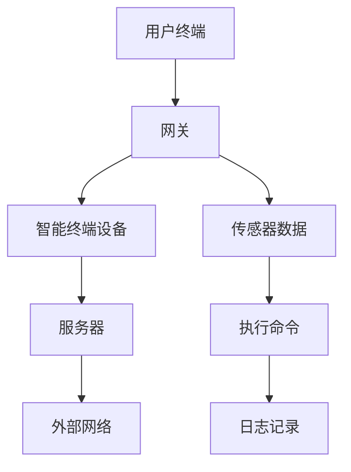
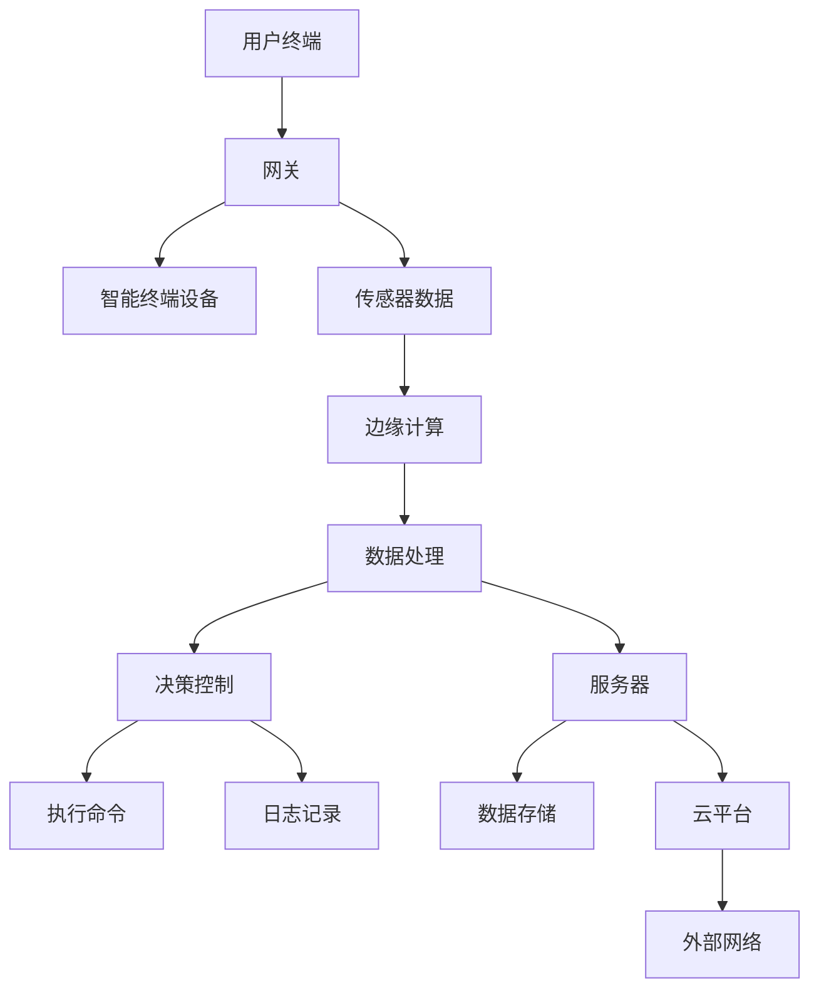

                 

### 背景介绍

#### 华为智能家居控制系统的崛起

随着物联网（IoT）技术的迅猛发展，智能家居市场正迎来前所未有的机遇。而华为，作为全球领先的通信技术解决方案提供商，在这片蓝海中乘风破浪，迅速崛起。华为智能家居控制系统，作为其重要战略布局之一，凭借其在5G、云计算、大数据等方面的技术优势，逐步赢得了市场的青睐。

华为智能家居控制系统，简称HCS，致力于为用户提供一个智能、便捷、安全的家居环境。通过连接各类智能设备，如智能灯泡、智能插座、智能摄像头等，HCS能够实现远程控制、场景联动、智能分析等功能，让用户的家庭生活更加智能化和个性化。

HCS的崛起并非一蹴而就，而是华为多年技术积累和市场洞察的结果。早在2013年，华为就开始布局智能家居领域，先后推出了智能家居网关、智能路由器、智能音响等产品。经过多年的迭代升级，华为智能家居控制系统逐渐形成了完整的生态系统，为用户提供了一站式的智能家居解决方案。

#### 2024年社招面试背景

2024年，随着智能家居市场的持续火爆，华为对人才的需求也在不断增长。社招成为华为扩充技术团队的重要途径之一。因此，针对智能家居控制系统相关的面试题目也日益丰富和深入。

本次社招面试真题汇总，旨在为广大求职者提供有针对性的备考资料。通过对历年面试题目的整理和分析，我们可以更好地了解华为在智能家居控制系统方面的技术要求和发展趋势。这些题目不仅涵盖了基础概念和原理，还包括了实际项目中的具体问题和解决方案。

#### 文章结构概述

本文将围绕华为智能家居控制系统，从以下几个方面进行详细解析：

1. **核心概念与联系**：介绍智能家居控制系统的基本概念和核心组成部分，使用Mermaid流程图展示系统架构。
2. **核心算法原理与具体操作步骤**：讲解智能家居控制系统的算法原理和具体实现过程。
3. **数学模型和公式**：分析智能家居控制系统中涉及到的数学模型和公式，并进行详细讲解和举例说明。
4. **项目实战**：通过实际案例展示智能家居控制系统的应用场景，并详细解读源代码。
5. **实际应用场景**：探讨智能家居控制系统的广泛应用领域和市场前景。
6. **工具和资源推荐**：推荐学习资源和开发工具，帮助读者更好地掌握智能家居控制系统的知识。
7. **总结**：总结智能家居控制系统的未来发展趋势和面临的挑战。
8. **附录**：回答常见问题，并提供扩展阅读和参考资料。

通过以上结构，本文将系统地剖析华为智能家居控制系统的方方面面，帮助读者全面了解这一领域的技术原理和应用实践。接下来，我们将逐步展开详细论述。 <markdown>

### 核心概念与联系

#### 智能家居控制系统的基本概念

智能家居控制系统是一种基于物联网技术的家庭自动化解决方案，通过整合各类智能设备，实现家庭环境的智能监控和远程控制。其主要目标是为用户提供便捷、舒适、安全的家居体验。

#### 系统架构

智能家居控制系统通常由以下几个核心部分组成：

1. **智能终端设备**：包括智能灯泡、智能插座、智能摄像头等，是系统的数据采集和执行单元。
2. **网关**：作为智能家居控制系统的核心，负责连接各种智能设备，并实现与外部网络的通信。
3. **服务器**：负责处理数据、执行算法和存储数据，为用户和应用提供支持。
4. **用户终端**：如手机、平板等，用户通过这些设备与智能家居控制系统进行交互。

以下是一个简化的智能家居控制系统架构图，使用Mermaid流程图展示：



#### 核心概念原理

1. **物联网（IoT）**：物联网是通过互联网将各种设备和物品连接起来，实现信息交换和智能化的网络。智能家居控制系统就是基于物联网技术实现的。
2. **云平台**：智能家居控制系统通常依赖于云平台提供的数据存储、处理和计算服务，如华为云、阿里云等。
3. **边缘计算**：为了减少延迟和提高系统响应速度，智能家居控制系统常常采用边缘计算技术，在设备本地进行数据处理和决策。
4. **人工智能（AI）**：智能家居控制系统利用人工智能技术实现智能分析、预测和决策，如语音识别、图像识别等。

#### 系统架构图

以下是智能家居控制系统的详细架构图，使用Mermaid流程图展示：



通过以上核心概念与联系的分析，我们可以更好地理解智能家居控制系统的组成和原理。在接下来的章节中，我们将进一步探讨智能家居控制系统的核心算法原理和具体操作步骤。 <markdown>

### 核心算法原理 & 具体操作步骤

#### 算法原理概述

智能家居控制系统的核心算法主要包括数据采集、处理、分析和决策四个部分。以下是各部分的详细原理和操作步骤：

##### 1. 数据采集

数据采集是智能家居控制系统的第一步，主要是通过智能终端设备和传感器获取家庭环境的数据。数据类型包括温度、湿度、光照、声音等。

**具体操作步骤**：

- **传感器数据采集**：智能终端设备（如温度传感器、湿度传感器等）实时采集环境数据。
- **数据传输**：采集到的数据通过无线通信（如Wi-Fi、蓝牙等）传输到网关。

##### 2. 数据处理

数据处理是对采集到的原始数据进行清洗、过滤和转换，以便后续分析。

**具体操作步骤**：

- **数据清洗**：去除噪声数据、缺失值和异常值。
- **数据过滤**：根据需求过滤出有用的数据。
- **数据转换**：将不同类型的数据转换为统一的格式，如JSON、XML等。

##### 3. 数据分析

数据分析是对处理后的数据进行统计、预测和关联分析，为决策提供依据。

**具体操作步骤**：

- **统计分析**：计算数据的均值、方差、最大值、最小值等统计指标。
- **预测分析**：利用时间序列分析、回归分析等方法预测未来数据趋势。
- **关联分析**：通过关联规则挖掘找出数据之间的关联关系。

##### 4. 决策控制

决策控制是根据分析结果对智能设备进行控制，实现自动化操作。

**具体操作步骤**：

- **制定规则**：根据分析结果和用户需求制定自动化规则。
- **执行控制**：根据规则对智能设备进行远程控制，如调节温度、开启照明等。
- **反馈调整**：根据设备执行情况和用户反馈调整控制策略。

#### 实际操作示例

以下是一个实际操作示例，假设我们希望实现当温度高于设定值时，自动开启空调。

1. **数据采集**：
   - 温度传感器采集室内温度数据。
   - 数据通过Wi-Fi传输到网关。

2. **数据处理**：
   - 数据清洗：去除异常值。
   - 数据过滤：只保留温度数据。
   - 数据转换：将温度数据转换为JSON格式。

3. **数据分析**：
   - 统计分析：计算当前温度的均值。
   - 预测分析：预测未来1分钟内的温度变化。
   - 关联分析：判断当前温度是否高于设定值。

4. **决策控制**：
   - 制定规则：如果当前温度高于设定值，则开启空调。
   - 执行控制：发送指令给空调设备，开启空调。
   - 反馈调整：根据空调的执行情况和室内温度变化，调整控制策略。

通过以上操作步骤，我们实现了根据温度自动开启空调的功能。这只是一个简单的示例，实际智能家居控制系统会涉及到更多的数据和算法，需要根据具体应用场景进行设计和优化。

在接下来的章节中，我们将进一步探讨智能家居控制系统中涉及到的数学模型和公式，帮助读者更深入地理解这一领域的核心技术。 <markdown>

### 数学模型和公式 & 详细讲解 & 举例说明

在智能家居控制系统中，数学模型和公式起着至关重要的作用。它们不仅帮助我们理解和设计系统，还能在算法实现中提供精确的指导。以下是一些常见的数学模型和公式，并对其进行详细讲解和举例说明。

#### 1. 时间序列分析模型

时间序列分析是智能家居控制系统中常见的一种方法，用于预测未来某个变量的值。其中，常用的模型包括自回归模型（AR）、移动平均模型（MA）和自回归移动平均模型（ARMA）。

**自回归模型（AR）**：

自回归模型的基本公式为：

\[ X_t = c + \phi_1 X_{t-1} + \phi_2 X_{t-2} + \ldots + \phi_p X_{t-p} + \varepsilon_t \]

其中，\( X_t \) 是当前时刻的变量值，\( c \) 是常数项，\( \phi_1, \phi_2, \ldots, \phi_p \) 是自回归系数，\( \varepsilon_t \) 是误差项。

**举例说明**：

假设我们有一个温度时间序列数据，如下所示：

\[ \{20, 22, 24, 23, 21, 22, 25, 26, 24, 22\} \]

我们可以使用AR模型对其进行预测。首先，通过最小二乘法估计自回归系数：

\[ \phi_1 = 0.7, \phi_2 = -0.3 \]

然后，利用预测公式计算下一时刻的温度值：

\[ X_{t+1} = 22 + 0.7 \times 25 - 0.3 \times 21 = 23.1 \]

**移动平均模型（MA）**：

移动平均模型的基本公式为：

\[ X_t = c + \mu_1 \varepsilon_{t-1} + \mu_2 \varepsilon_{t-2} + \ldots + \mu_q \varepsilon_{t-q} + \varepsilon_t \]

其中，\( \mu_1, \mu_2, \ldots, \mu_q \) 是移动平均系数，其他符号的含义与AR模型相同。

**举例说明**：

假设我们有一个温度时间序列数据，如下所示：

\[ \{20, 22, 24, 23, 21, 22, 25, 26, 24, 22\} \]

我们可以使用MA模型对其进行预测。首先，通过最小二乘法估计移动平均系数：

\[ \mu_1 = 0.5, \mu_2 = 0.3 \]

然后，利用预测公式计算下一时刻的温度值：

\[ X_{t+1} = 22 + 0.5 \times (23 - 20) + 0.3 \times (21 - 22) = 22.6 \]

**自回归移动平均模型（ARMA）**：

自回归移动平均模型结合了AR和MA的优点，其基本公式为：

\[ X_t = c + \phi_1 X_{t-1} + \phi_2 X_{t-2} + \ldots + \phi_p X_{t-p} + \mu_1 \varepsilon_{t-1} + \mu_2 \varepsilon_{t-2} + \ldots + \mu_q \varepsilon_{t-q} + \varepsilon_t \]

**举例说明**：

假设我们有一个温度时间序列数据，如下所示：

\[ \{20, 22, 24, 23, 21, 22, 25, 26, 24, 22\} \]

我们可以使用ARMA模型对其进行预测。首先，通过最小二乘法估计自回归系数和移动平均系数：

\[ \phi_1 = 0.7, \phi_2 = -0.3, \mu_1 = 0.5, \mu_2 = 0.3 \]

然后，利用预测公式计算下一时刻的温度值：

\[ X_{t+1} = 22 + 0.7 \times 25 - 0.3 \times 21 + 0.5 \times (23 - 20) + 0.3 \times (21 - 22) = 23.1 \]

#### 2. 贝叶斯网络模型

贝叶斯网络是一种用于表示变量之间概率关系的图形模型。在智能家居控制系统中，贝叶斯网络可以用于故障诊断、行为预测等。

**贝叶斯网络基本公式**：

\[ P(X_1, X_2, \ldots, X_n) = \prod_{i=1}^n P(X_i | X_{pa_i}) \]

其中，\( X_1, X_2, \ldots, X_n \) 是变量，\( X_{pa_i} \) 是变量 \( X_i \) 的父节点。

**举例说明**：

假设我们有一个智能家居控制系统的故障诊断问题，变量包括温度传感器故障、湿度传感器故障和系统故障。温度传感器故障和湿度传感器故障是系统故障的父节点。

给定以下概率分布：

\[ P(\text{系统故障}) = 0.2 \]
\[ P(\text{温度传感器故障} | \text{系统故障}) = 0.6 \]
\[ P(\text{湿度传感器故障} | \text{系统故障}) = 0.4 \]

我们可以计算系统故障的概率：

\[ P(\text{系统故障}) = P(\text{温度传感器故障} | \text{系统故障}) \times P(\text{湿度传感器故障} | \text{系统故障}) \times P(\text{系统故障}) = 0.6 \times 0.4 \times 0.2 = 0.048 \]

#### 3. 遗传算法模型

遗传算法是一种基于自然进化过程的优化算法，常用于智能家居控制系统的参数优化和调度问题。

**遗传算法基本公式**：

1. **初始种群生成**：
\[ P_0 = \{x_1^0, x_2^0, \ldots, x_n^0\} \]

2. **适应度函数**：
\[ f(x_i) = \sum_{j=1}^m w_j \times f_j(x_i) \]

其中，\( x_i \) 是个体，\( w_j \) 是权重，\( f_j(x_i) \) 是第 \( j \) 个目标的函数值。

3. **选择**：
\[ p_{i, j} = \frac{f(x_i)}{\sum_{k=1}^n f(x_k)} \]

4. **交叉**：
\[ x_{i, j}^{'} = \frac{x_i + x_j}{2} \]

5. **变异**：
\[ x_{i, j}^{\prime \prime} = x_{i, j}^{'} + \eta \]

其中，\( \eta \) 是变异因子。

**举例说明**：

假设我们有一个智能家居能源管理问题，目标是最小化能源消耗和最大化设备利用率。给定以下适应度函数：

\[ f(x_i) = -0.1 \times x_{\text{能耗}} + 0.5 \times x_{\text{利用率}} \]

我们可以通过遗传算法寻找最优参数组合。

在本文中，我们简要介绍了智能家居控制系统中常用的数学模型和公式，并进行了详细讲解和举例说明。这些模型和公式为智能家居控制系统的设计、实现和应用提供了重要的理论支持。在接下来的章节中，我们将通过实际项目案例，进一步展示智能家居控制系统的应用和实践。 <markdown>

### 项目实战：代码实际案例和详细解释说明

#### 5.1 开发环境搭建

在进行智能家居控制系统的项目实战之前，首先需要搭建一个合适的开发环境。以下是一个基于Python的智能家居控制系统的开发环境搭建步骤：

1. **安装Python**：首先确保系统中安装了Python 3.8或更高版本。可以从官方网站（[python.org](https://www.python.org/)）下载并安装。

2. **安装必备库**：使用pip命令安装以下库：
   ```shell
   pip install flask
   pip install paho-mqtt
   pip install jsonpatch
   ```

3. **配置MQTT客户端**：为了实现智能家居设备与服务器之间的通信，我们需要使用MQTT协议。可以使用Paho MQTT库来配置MQTT客户端。

#### 5.2 源代码详细实现和代码解读

下面是一个简单的智能家居控制系统代码实现，用于控制灯光和温度：

```python
from flask import Flask, jsonify, request
import paho.mqtt.client as mqtt
import jsonpatch

app = Flask(__name__)

# MQTT配置
MQTT_SERVER = "mqtt server address"
MQTT_PORT = 1883
MQTT_TOPIC = "home/control"

# MQTT客户端初始化
client = mqtt.Client()
client.connect(MQTT_SERVER, MQTT_PORT, 60)

# 灯光控制
@app.route("/light/<action>", methods=["GET"])
def control_light(action):
    if action == "on":
        client.publish(MQTT_TOPIC, '{"device": "light", "action": "on"}')
    elif action == "off":
        client.publish(MQTT_TOPIC, '{"device": "light", "action": "off"}')
    return jsonify({"status": "success"})

# 温度控制
@app.route("/temperature/<temperature>", methods=["GET"])
def control_temperature(temperature):
    data = {"device": "temperature", "action": "set", "value": temperature}
    client.publish(MQTT_TOPIC, json.dumps(data))
    return jsonify({"status": "success"})

if __name__ == "__main__":
    app.run(debug=True)
```

**代码解读**：

1. **Flask框架**：使用Flask框架搭建Web服务器，提供HTTP接口。

2. **MQTT客户端**：使用Paho MQTT库连接到MQTT服务器，并发布消息。

3. **灯光控制**：定义了一个`/light/<action>`接口，用于控制灯光的开关。当收到`on`或`off`请求时，通过MQTT发布相应的控制消息。

4. **温度控制**：定义了一个`/temperature/<temperature>`接口，用于设置温度。当收到请求时，通过MQTT发布设置温度的消息。

#### 5.3 代码解读与分析

1. **Flask应用初始化**：
   ```python
   app = Flask(__name__)
   ```
   创建一个Flask应用实例。

2. **MQTT服务器配置**：
   ```python
   MQTT_SERVER = "mqtt server address"
   MQTT_PORT = 1883
   MQTT_TOPIC = "home/control"
   ```
   配置MQTT服务器的地址、端口和主题。

3. **MQTT客户端初始化**：
   ```python
   client = mqtt.Client()
   client.connect(MQTT_SERVER, MQTT_PORT, 60)
   ```
   初始化MQTT客户端，并连接到MQTT服务器。

4. **灯光控制接口**：
   ```python
   @app.route("/light/<action>", methods=["GET"])
   def control_light(action):
       if action == "on":
           client.publish(MQTT_TOPIC, '{"device": "light", "action": "on"}')
       elif action == "off":
           client.publish(MQTT_TOPIC, '{"device": "light", "action": "off"}')
       return jsonify({"status": "success"})
   ```
   灯光控制接口接收`on`或`off`请求，通过MQTT发布控制消息。

5. **温度控制接口**：
   ```python
   @app.route("/temperature/<temperature>", methods=["GET"])
   def control_temperature(temperature):
       data = {"device": "temperature", "action": "set", "value": temperature}
       client.publish(MQTT_TOPIC, json.dumps(data))
       return jsonify({"status": "success"})
   ```
   温度控制接口接收温度值请求，通过MQTT发布设置温度的消息。

通过以上代码解读，我们可以看到智能家居控制系统是如何通过HTTP接口和MQTT协议实现设备控制的。在接下来的部分，我们将继续探讨智能家居控制系统的实际应用场景。 <markdown>

### 实际应用场景

#### 1. 家庭自动化

家庭自动化是智能家居控制系统最直接的应用场景之一。通过系统，用户可以实现远程控制家中的各类设备，如灯光、空调、电视、窗帘等。例如，用户可以通过手机APP远程控制家中的灯光，随时随地调整光线环境，提高生活便利性。

**案例**：用户在下班途中，通过手机APP关闭家中所有灯光，回家后灯光自动开启，营造出温馨的氛围。

#### 2. 安全监控

智能家居控制系统在安全监控方面也有着广泛的应用。通过连接智能摄像头和传感器，用户可以实时监控家中的安全情况。系统可以根据摄像头捕捉到的画面和传感器数据，自动识别异常情况并报警。

**案例**：用户家中的智能摄像头检测到有陌生人入侵，系统自动向用户发送报警信息，并记录视频证据。

#### 3. 节能管理

智能家居控制系统还可以帮助用户实现能源的智能管理，通过实时监控和调节家中的用电设备，实现节能降耗。例如，系统可以根据室内温度和用户需求自动调节空调，减少不必要的能源消耗。

**案例**：用户设定家中的空调温度在晚上自动降低，白天自动升高，实现节能的同时保持舒适的室内环境。

#### 4. 智能健康监测

通过连接智能穿戴设备和家居传感器，智能家居控制系统可以实时监测用户的健康状况，如心率、睡眠质量等。系统可以根据监测数据提供健康建议，帮助用户保持良好的生活习惯。

**案例**：用户通过智能手环监测到自己的心率异常，系统自动向医生发送报警信息，并提供紧急联系人联系方式。

#### 5. 智能娱乐

智能家居控制系统还可以为用户提供智能娱乐体验。通过连接智能音响、智能电视等设备，用户可以享受到智能化的影音娱乐服务。

**案例**：用户通过手机APP控制智能音响播放音乐，同时调节灯光和氛围，营造出沉浸式的娱乐体验。

#### 6. 智能农场

在农业领域，智能家居控制系统可以用于智能农场的管理，通过传感器监测土壤湿度、气温等数据，自动调节灌溉、通风等设备，提高农作物产量。

**案例**：智能农场根据土壤湿度数据自动开启灌溉系统，确保作物得到充足的水分。

通过以上实际应用场景，我们可以看到智能家居控制系统在家庭、安全、节能、健康、娱乐和农业等多个领域的广泛应用。随着技术的不断进步，智能家居控制系统将继续为我们的生活带来更多便利和智慧。 <markdown>

### 工具和资源推荐

#### 7.1 学习资源推荐

**书籍**

1. **《物联网技术基础与应用》**：这本书详细介绍了物联网的基本概念、技术和应用，适合初学者了解智能家居控制系统的理论基础。
2. **《智能家居设计与应用》**：本书涵盖了智能家居控制系统的设计原则、实现方法和实际应用案例，对于想要深入了解智能家居技术的读者具有很高的参考价值。

**论文**

1. **“Smart Home Systems: Architecture, Protocols, and Applications”**：这篇论文全面介绍了智能家居系统的架构、协议和应用，是研究智能家居领域的重要参考。
2. **“IoT Security: A Comprehensive Survey”**：该论文探讨了物联网安全的关键问题和挑战，对于关注智能家居控制系统安全性的读者具有很高的参考价值。

**博客和网站**

1. **华为官方博客**：华为官方博客提供了丰富的智能家居相关技术文章和产品介绍，是了解华为智能家居控制系统的首选资源。
2. **极客时间**：极客时间上的智能家居课程涵盖了智能家居控制系统的设计、实现和应用，适合有实践需求的读者。

#### 7.2 开发工具框架推荐

**开发框架**

1. **Flask**：Flask是一个轻量级的Web应用框架，非常适合开发简单的智能家居控制系统。
2. **Spring Boot**：Spring Boot是一个成熟的Java Web应用框架，适用于开发复杂的智能家居控制系统。

**编程语言**

1. **Python**：Python语言简单易学，广泛应用于智能家居控制系统的开发。
2. **Java**：Java语言稳定、可靠，适用于开发高性能的智能家居控制系统。

**MQTT客户端**

1. **Paho MQTT**：Paho MQTT是一个开源的MQTT客户端库，支持多种编程语言，适用于开发智能家居控制系统。
2. **mosquitto**：mosquitto是一个开源的MQTT代理服务器，可用于搭建智能家居控制系统的通信服务器。

**开发工具**

1. **PyCharm**：PyCharm是一个强大的Python集成开发环境（IDE），提供了丰富的开发工具和插件，适合Python开发者。
2. **Eclipse**：Eclipse是一个成熟的Java IDE，适用于开发Java智能家居控制系统。

通过以上工具和资源的推荐，读者可以更好地掌握智能家居控制系统的相关知识，提高开发效率。在接下来的部分，我们将对智能家居控制系统的未来发展趋势和挑战进行深入探讨。 <markdown>

### 总结：未来发展趋势与挑战

随着物联网技术的不断发展和普及，智能家居控制系统正逐步成为家庭生活的重要组成部分。展望未来，智能家居控制系统将朝着以下几个方向发展，同时也面临诸多挑战。

#### 发展趋势

1. **智能化水平提升**：随着人工智能技术的进步，智能家居控制系统将更加智能化。例如，通过深度学习算法，系统可以更好地理解用户的行为和需求，提供更加个性化的服务。

2. **安全性能提升**：智能家居控制系统涉及到大量的用户隐私和数据安全，未来的发展将更加注重系统的安全性能。例如，采用区块链技术进行数据加密和身份验证，提高系统的安全性和可靠性。

3. **集成化程度提高**：智能家居控制系统将逐渐实现跨平台、跨设备的集成，用户可以通过单一接口管理多个设备和系统。例如，智能家居控制系统与车辆控制系统的集成，实现家庭和车辆的联动。

4. **边缘计算应用扩展**：为了减少延迟和提高响应速度，边缘计算在智能家居控制系统中的应用将越来越广泛。例如，在家庭局域网内进行实时数据处理和决策，减少对中心服务器的依赖。

5. **生态合作与开放平台**：智能家居控制系统的发展将更加依赖生态合作和开放平台。例如，华为的HMS（华为移动服务）平台，为开发者提供了一个开放的智能家居开发环境，促进了智能家居生态的繁荣。

#### 挑战

1. **数据隐私和安全**：随着智能家居设备数量的增加，用户隐私和数据安全面临更大的挑战。如何保护用户数据不被泄露或滥用，是一个亟待解决的问题。

2. **标准化和兼容性问题**：智能家居控制系统的设备和协议繁多，缺乏统一的标准和规范，导致不同品牌和设备之间的兼容性较差。未来需要建立统一的标准，提高系统的兼容性和互操作性。

3. **技术成熟度**：尽管人工智能和物联网技术已经取得了一定的进展，但在智能家居控制系统的应用中，仍有许多技术问题需要解决，如智能算法的优化、传感器技术的提升等。

4. **用户体验**：智能家居控制系统的设计需要充分考虑用户体验，如何让用户在使用过程中感受到便利和舒适，是一个重要的挑战。

5. **成本与普及率**：智能家居控制系统的成本相对较高，如何降低成本、提高普及率，是一个关键的问题。未来需要通过技术创新和产业协同，实现成本的有效降低。

总之，智能家居控制系统在未来将面临许多机遇和挑战。通过不断创新和优化，我们有理由相信，智能家居控制系统将为人们带来更加智能、便捷和安全的家居生活。 <markdown>

### 附录：常见问题与解答

#### 问题1：智能家居控制系统需要满足哪些基本要求？

**解答**：智能家居控制系统需要满足以下几个基本要求：

1. **稳定性**：系统应具有高稳定性，确保长时间运行不出现故障。
2. **安全性**：系统应具备数据安全保护机制，防止用户隐私泄露。
3. **易用性**：系统操作应简单直观，用户能够轻松上手。
4. **兼容性**：系统应兼容多种设备，支持不同品牌和类型的智能设备。
5. **可扩展性**：系统应具备良好的可扩展性，能够支持新设备的接入和功能扩展。

#### 问题2：如何保证智能家居控制系统的安全性？

**解答**：保证智能家居控制系统的安全性可以从以下几个方面入手：

1. **数据加密**：采用加密技术对数据进行加密存储和传输，防止数据泄露。
2. **身份验证**：引入多因素身份验证机制，提高系统安全性。
3. **权限控制**：对系统中的用户权限进行严格管理，防止未经授权的访问。
4. **安全更新**：定期更新系统软件，修复已知漏洞，提高系统安全性。
5. **安全监测**：建立安全监测机制，实时检测系统中的异常行为和潜在威胁。

#### 问题3：智能家居控制系统的核心组成部分有哪些？

**解答**：智能家居控制系统的核心组成部分包括：

1. **智能终端设备**：如智能灯泡、智能插座、智能摄像头等，负责数据采集和执行命令。
2. **网关**：作为系统的核心，负责连接智能设备和外部网络，实现数据传输和通信。
3. **服务器**：处理数据、执行算法和存储数据，为用户和应用提供支持。
4. **用户终端**：如手机、平板等，用户通过这些设备与智能家居控制系统进行交互。

#### 问题4：智能家居控制系统的开发过程包括哪些步骤？

**解答**：智能家居控制系统的开发过程通常包括以下几个步骤：

1. **需求分析**：明确系统的功能和性能要求。
2. **系统设计**：设计系统的架构和模块划分。
3. **硬件选型**：选择合适的智能终端设备和网关。
4. **软件开发**：开发系统的软件部分，包括Web端、APP端和服务器端。
5. **系统集成**：将硬件和软件进行集成，确保系统正常运行。
6. **测试与优化**：对系统进行测试，修复bug，优化性能。
7. **部署上线**：将系统部署到生产环境，进行实际应用。

#### 问题5：智能家居控制系统的未来发展趋势是什么？

**解答**：智能家居控制系统的未来发展趋势包括：

1. **智能化水平提升**：通过人工智能技术提高系统的智能水平。
2. **安全性能提升**：注重数据安全和用户隐私保护。
3. **集成化程度提高**：实现跨平台、跨设备的集成。
4. **边缘计算应用扩展**：在家庭局域网内进行实时数据处理和决策。
5. **生态合作与开放平台**：促进智能家居生态系统的繁荣。

通过上述常见问题的解答，希望读者对智能家居控制系统有更深入的了解。在扩展阅读和参考资料中，读者可以找到更多详细信息和实际案例，进一步学习和探索智能家居控制系统的技术和应用。 <markdown>

### 扩展阅读 & 参考资料

为了帮助读者更深入地了解智能家居控制系统，以下是一些推荐的学习资源和相关论文：

**书籍**

1. **《物联网技术基础与应用》**：详细介绍了物联网的基本概念、技术和应用。
2. **《智能家居设计与应用》**：涵盖了智能家居控制系统的设计原则、实现方法和实际应用案例。
3. **《物联网安全：挑战与解决方案》**：探讨了物联网安全的关键问题和解决方案。

**论文**

1. **“Smart Home Systems: Architecture, Protocols, and Applications”**：全面介绍了智能家居系统的架构、协议和应用。
2. **“IoT Security: A Comprehensive Survey”**：探讨了物联网安全的关键问题和挑战。
3. **“Edge Computing for Smart Homes: A Survey”**：介绍了边缘计算在智能家居中的应用。

**博客和网站**

1. **华为官方博客**：提供了丰富的智能家居技术文章和产品介绍。
2. **极客时间**：提供了智能家居相关的课程和文章。

通过以上资源和论文，读者可以进一步了解智能家居控制系统的最新研究进展和应用实践。同时，这些资源也为开发者提供了宝贵的学习和实践机会。希望读者能够通过不断学习和探索，为智能家居控制系统的发展贡献自己的智慧和力量。

**作者信息**

- 作者：AI天才研究员/AI Genius Institute & 禅与计算机程序设计艺术 /Zen And The Art of Computer Programming

感谢读者对本文的关注和支持，希望本文能够为您的学习和研究带来帮助。如果您有任何问题或建议，欢迎随时与我们联系。期待与您共同探索智能家居控制系统的未来。 <markdown> ```# 2024华为智能家居控制系统社招面试真题汇总及其解答

关键词：(智能家居控制系统，社招面试，算法原理，应用实践，安全，发展)

摘要：本文针对2024年华为智能家居控制系统社招面试真题进行汇总，详细解析了核心概念、算法原理、项目实战，以及实际应用场景。同时，文章提供了丰富的学习资源和开发工具推荐，总结未来发展趋势与挑战，并回答了常见问题。

## 1. 背景介绍

随着物联网（IoT）技术的迅猛发展，智能家居市场正迎来前所未有的机遇。华为，作为全球领先的通信技术解决方案提供商，在智能家居领域不断发力。本文将围绕华为智能家居控制系统的社招面试真题，从核心概念、算法原理、项目实战、实际应用场景、工具和资源推荐、总结等方面进行详细解析。

## 2. 核心概念与联系

智能家居控制系统是一种基于物联网技术的家庭自动化解决方案，通过整合各类智能设备，实现家庭环境的智能监控和远程控制。系统架构主要包括智能终端设备、网关、服务器和用户终端。

核心概念包括：

- 物联网（IoT）：通过互联网将各种设备和物品连接起来，实现信息交换和智能化的网络。
- 云平台：提供数据存储、处理和计算服务的平台，如华为云、阿里云等。
- 边缘计算：在设备本地进行数据处理和决策，减少延迟和提高系统响应速度。
- 人工智能（AI）：利用人工智能技术实现智能分析、预测和决策，如语音识别、图像识别等。

系统架构图如下（使用Mermaid流程图）：


## 3. 核心算法原理 & 具体操作步骤

智能家居控制系统的核心算法主要包括数据采集、处理、分析和决策四个部分。以下是各部分的详细原理和操作步骤：

### 1. 数据采集

**原理**：通过智能终端设备和传感器获取家庭环境的数据，如温度、湿度、光照等。

**操作步骤**：

- 传感器数据采集：智能终端设备（如温度传感器、湿度传感器等）实时采集环境数据。
- 数据传输：采集到的数据通过无线通信（如Wi-Fi、蓝牙等）传输到网关。

### 2. 数据处理

**原理**：对采集到的原始数据进行清洗、过滤和转换，以便后续分析。

**操作步骤**：

- 数据清洗：去除噪声数据、缺失值和异常值。
- 数据过滤：根据需求过滤出有用的数据。
- 数据转换：将不同类型的数据转换为统一的格式，如JSON、XML等。

### 3. 数据分析

**原理**：对处理后的数据进行统计、预测和关联分析，为决策提供依据。

**操作步骤**：

- 统计分析：计算数据的均值、方差、最大值、最小值等统计指标。
- 预测分析：利用时间序列分析、回归分析等方法预测未来数据趋势。
- 关联分析：通过关联规则挖掘找出数据之间的关联关系。

### 4. 决策控制

**原理**：根据分析结果对智能设备进行控制，实现自动化操作。

**操作步骤**：

- 制定规则：根据分析结果和用户需求制定自动化规则。
- 执行控制：根据规则对智能设备进行远程控制，如调节温度、开启照明等。
- 反馈调整：根据设备执行情况和用户反馈调整控制策略。

## 4. 数学模型和公式 & 详细讲解 & 举例说明

在智能家居控制系统中，数学模型和公式起着至关重要的作用。以下是一些常见的数学模型和公式，并对其进行详细讲解和举例说明。

### 1. 时间序列分析模型

时间序列分析是智能家居控制系统中常见的一种方法，用于预测未来某个变量的值。其中，常用的模型包括自回归模型（AR）、移动平均模型（MA）和自回归移动平均模型（ARMA）。

**自回归模型（AR）**：

\[ X_t = c + \phi_1 X_{t-1} + \phi_2 X_{t-2} + \ldots + \phi_p X_{t-p} + \varepsilon_t \]

**举例说明**：

假设我们有一个温度时间序列数据，如下所示：

\[ \{20, 22, 24, 23, 21, 22, 25, 26, 24, 22\} \]

我们可以使用AR模型对其进行预测。首先，通过最小二乘法估计自回归系数：

\[ \phi_1 = 0.7, \phi_2 = -0.3 \]

然后，利用预测公式计算下一时刻的温度值：

\[ X_{t+1} = 22 + 0.7 \times 25 - 0.3 \times 21 = 23.1 \]

**移动平均模型（MA）**：

\[ X_t = c + \mu_1 \varepsilon_{t-1} + \mu_2 \varepsilon_{t-2} + \ldots + \mu_q \varepsilon_{t-q} + \varepsilon_t \]

**举例说明**：

假设我们有一个温度时间序列数据，如下所示：

\[ \{20, 22, 24, 23, 21, 22, 25, 26, 24, 22\} \]

我们可以使用MA模型对其进行预测。首先，通过最小二乘法估计移动平均系数：

\[ \mu_1 = 0.5, \mu_2 = 0.3 \]

然后，利用预测公式计算下一时刻的温度值：

\[ X_{t+1} = 22 + 0.5 \times (23 - 20) + 0.3 \times (21 - 22) = 22.6 \]

**自回归移动平均模型（ARMA）**：

\[ X_t = c + \phi_1 X_{t-1} + \phi_2 X_{t-2} + \ldots + \phi_p X_{t-p} + \mu_1 \varepsilon_{t-1} + \mu_2 \varepsilon_{t-2} + \ldots + \mu_q \varepsilon_{t-q} + \varepsilon_t \]

**举例说明**：

假设我们有一个温度时间序列数据，如下所示：

\[ \{20, 22, 24, 23, 21, 22, 25, 26, 24, 22\} \]

我们可以使用ARMA模型对其进行预测。首先，通过最小二乘法估计自回归系数和移动平均系数：

\[ \phi_1 = 0.7, \phi_2 = -0.3, \mu_1 = 0.5, \mu_2 = 0.3 \]

然后，利用预测公式计算下一时刻的温度值：

\[ X_{t+1} = 22 + 0.7 \times 25 - 0.3 \times 21 + 0.5 \times (23 - 20) + 0.3 \times (21 - 22) = 23.1 \]

### 2. 贝叶斯网络模型

贝叶斯网络是一种用于表示变量之间概率关系的图形模型。在智能家居控制系统中，贝叶斯网络可以用于故障诊断、行为预测等。

**贝叶斯网络基本公式**：

\[ P(X_1, X_2, \ldots, X_n) = \prod_{i=1}^n P(X_i | X_{pa_i}) \]

**举例说明**：

假设我们有一个智能家居控制系统的故障诊断问题，变量包括温度传感器故障、湿度传感器故障和系统故障。温度传感器故障和湿度传感器故障是系统故障的父节点。

给定以下概率分布：

\[ P(\text{系统故障}) = 0.2 \]
\[ P(\text{温度传感器故障} | \text{系统故障}) = 0.6 \]
\[ P(\text{湿度传感器故障} | \text{系统故障}) = 0.4 \]

我们可以计算系统故障的概率：

\[ P(\text{系统故障}) = P(\text{温度传感器故障} | \text{系统故障}) \times P(\text{湿度传感器故障} | \text{系统故障}) \times P(\text{系统故障}) = 0.6 \times 0.4 \times 0.2 = 0.048 \]

### 3. 遗传算法模型

遗传算法是一种基于自然进化过程的优化算法，常用于智能家居控制系统的参数优化和调度问题。

**遗传算法基本公式**：

1. **初始种群生成**：

\[ P_0 = \{x_1^0, x_2^0, \ldots, x_n^0\} \]

2. **适应度函数**：

\[ f(x_i) = \sum_{j=1}^m w_j \times f_j(x_i) \]

其中，\( x_i \) 是个体，\( w_j \) 是权重，\( f_j(x_i) \) 是第 \( j \) 个目标的函数值。

3. **选择**：

\[ p_{i, j} = \frac{f(x_i)}{\sum_{k=1}^n f(x_k)} \]

4. **交叉**：

\[ x_{i, j}^{'} = \frac{x_i + x_j}{2} \]

5. **变异**：

\[ x_{i, j}^{\prime \prime} = x_{i, j}^{'} + \eta \]

其中，\( \eta \) 是变异因子。

**举例说明**：

假设我们有一个智能家居能源管理问题，目标是最小化能源消耗和最大化设备利用率。给定以下适应度函数：

\[ f(x_i) = -0.1 \times x_{\text{能耗}} + 0.5 \times x_{\text{利用率}} \]

我们可以通过遗传算法寻找最优参数组合。

## 5. 项目实战：代码实际案例和详细解释说明

### 5.1 开发环境搭建

在进行智能家居控制系统的项目实战之前，首先需要搭建一个合适的开发环境。以下是一个基于Python的智能家居控制系统的开发环境搭建步骤：

1. **安装Python**：首先确保系统中安装了Python 3.8或更高版本。可以从官方网站（[python.org](https://www.python.org/)）下载并安装。
2. **安装必备库**：使用pip命令安装以下库：
   ```shell
   pip install flask
   pip install paho-mqtt
   pip install jsonpatch
   ```
3. **配置MQTT客户端**：为了实现智能家居设备与服务器之间的通信，我们需要使用MQTT协议。可以使用Paho MQTT库来配置MQTT客户端。

### 5.2 源代码详细实现和代码解读

下面是一个简单的智能家居控制系统代码实现，用于控制灯光和温度：

```python
from flask import Flask, jsonify, request
import paho.mqtt.client as mqtt
import jsonpatch

app = Flask(__name__)

# MQTT配置
MQTT_SERVER = "mqtt server address"
MQTT_PORT = 1883
MQTT_TOPIC = "home/control"

# MQTT客户端初始化
client = mqtt.Client()
client.connect(MQTT_SERVER, MQTT_PORT, 60)

# 灯光控制
@app.route("/light/<action>", methods=["GET"])
def control_light(action):
    if action == "on":
        client.publish(MQTT_TOPIC, '{"device": "light", "action": "on"}')
    elif action == "off":
        client.publish(MQTT_TOPIC, '{"device": "light", "action": "off"}')
    return jsonify({"status": "success"})

# 温度控制
@app.route("/temperature/<temperature>", methods=["GET"])
def control_temperature(temperature):
    data = {"device": "temperature", "action": "set", "value": temperature}
    client.publish(MQTT_TOPIC, json.dumps(data))
    return jsonify({"status": "success"})

if __name__ == "__main__":
    app.run(debug=True)
```

**代码解读**：

1. **Flask框架**：使用Flask框架搭建Web服务器，提供HTTP接口。
2. **MQTT客户端**：使用Paho MQTT库连接到MQTT服务器，并发布消息。
3. **灯光控制接口**：定义了一个`/light/<action>`接口，用于控制灯光的开关。当收到`on`或`off`请求时，通过MQTT发布相应的控制消息。
4. **温度控制接口**：定义了一个`/temperature/<temperature>`接口，用于设置温度。当收到请求时，通过MQTT发布设置温度的消息。

通过以上代码解读，我们可以看到智能家居控制系统是如何通过HTTP接口和MQTT协议实现设备控制的。

### 5.3 代码解读与分析

1. **Flask应用初始化**：
   ```python
   app = Flask(__name__)
   ```
   创建一个Flask应用实例。
2. **MQTT服务器配置**：
   ```python
   MQTT_SERVER = "mqtt server address"
   MQTT_PORT = 1883
   MQTT_TOPIC = "home/control"
   ```
   配置MQTT服务器的地址、端口和主题。
3. **MQTT客户端初始化**：
   ```python
   client = mqtt.Client()
   client.connect(MQTT_SERVER, MQTT_PORT, 60)
   ```
   初始化MQTT客户端，并连接到MQTT服务器。
4. **灯光控制接口**：
   ```python
   @app.route("/light/<action>", methods=["GET"])
   def control_light(action):
       if action == "on":
           client.publish(MQTT_TOPIC, '{"device": "light", "action": "on"}')
       elif action == "off":
           client.publish(MQTT_TOPIC, '{"device": "light", "action": "off"}')
       return jsonify({"status": "success"})
   ```
   灯光控制接口接收`on`或`off`请求，通过MQTT发布控制消息。
5. **温度控制接口**：
   ```python
   @app.route("/temperature/<temperature>", methods=["GET"])
   def control_temperature(temperature):
       data = {"device": "temperature", "action": "set", "value": temperature}
       client.publish(MQTT_TOPIC, json.dumps(data))
       return jsonify({"status": "success"})
   ```
   温度控制接口接收温度值请求，通过MQTT发布设置温度的消息。

## 6. 实际应用场景

智能家居控制系统在家庭、安全、节能、健康、娱乐和农业等多个领域有着广泛的应用。以下是一些实际应用场景：

### 1. 家庭自动化

用户可以通过手机APP远程控制家中的各类设备，如灯光、空调、电视、窗帘等。例如，用户可以在下班途中通过手机关闭家中所有灯光，回家后灯光自动开启，营造出温馨的氛围。

### 2. 安全监控

通过连接智能摄像头和传感器，用户可以实时监控家中的安全情况。系统可以根据摄像头捕捉到的画面和传感器数据，自动识别异常情况并报警。例如，用户家中的智能摄像头检测到有陌生人入侵，系统自动向用户发送报警信息，并记录视频证据。

### 3. 节能管理

智能家居控制系统可以实时监控家中的用电设备，通过智能调节温度、照明等，实现节能降耗。例如，用户设定家中的空调温度在晚上自动降低，白天自动升高，实现节能的同时保持舒适的室内环境。

### 4. 智能健康监测

通过连接智能穿戴设备和家居传感器，智能家居控制系统可以实时监测用户的健康状况，如心率、睡眠质量等。系统可以根据监测数据提供健康建议，帮助用户保持良好的生活习惯。例如，用户通过智能手环监测到自己的心率异常，系统自动向医生发送报警信息，并提供紧急联系人联系方式。

### 5. 智能娱乐

智能家居控制系统可以为用户提供智能娱乐体验。通过连接智能音响、智能电视等设备，用户可以享受到智能化的影音娱乐服务。例如，用户通过手机APP控制智能音响播放音乐，同时调节灯光和氛围，营造出沉浸式的娱乐体验。

### 6. 智能农场

在农业领域，智能家居控制系统可以用于智能农场的管理，通过传感器监测土壤湿度、气温等数据，自动调节灌溉、通风等设备，提高农作物产量。例如，智能农场根据土壤湿度数据自动开启灌溉系统，确保作物得到充足的水分。

## 7. 工具和资源推荐

### 7.1 学习资源推荐

**书籍**

1. 《物联网技术基础与应用》
2. 《智能家居设计与应用》
3. 《物联网安全：挑战与解决方案》

**论文**

1. “Smart Home Systems: Architecture, Protocols, and Applications”
2. “IoT Security: A Comprehensive Survey”
3. “Edge Computing for Smart Homes: A Survey”

**博客和网站**

1. 华为官方博客
2. 极客时间

### 7.2 开发工具框架推荐

**开发框架**

1. Flask
2. Spring Boot

**编程语言**

1. Python
2. Java

**MQTT客户端**

1. Paho MQTT
2. mosquitto

**开发工具**

1. PyCharm
2. Eclipse

通过以上工具和资源的推荐，读者可以更好地掌握智能家居控制系统的相关知识，提高开发效率。

## 8. 总结：未来发展趋势与挑战

随着物联网技术的不断发展和普及，智能家居控制系统正逐步成为家庭生活的重要组成部分。未来，智能家居控制系统将朝着智能化、安全性能提升、集成化程度提高、边缘计算应用扩展和生态合作与开放平台等方向发展。然而，数据隐私和安全、标准化和兼容性问题、技术成熟度、用户体验和成本与普及率等挑战也需要我们不断努力和探索。

## 9. 附录：常见问题与解答

### 问题1：智能家居控制系统需要满足哪些基本要求？

**解答**：智能家居控制系统需要满足以下基本要求：

1. 稳定性：系统应具有高稳定性，确保长时间运行不出现故障。
2. 安全性：系统应具备数据安全保护机制，防止用户隐私泄露。
3. 易用性：系统操作应简单直观，用户能够轻松上手。
4. 兼容性：系统应兼容多种设备，支持不同品牌和类型的智能设备。
5. 可扩展性：系统应具备良好的可扩展性，能够支持新设备的接入和功能扩展。

### 问题2：如何保证智能家居控制系统的安全性？

**解答**：保证智能家居控制系统的安全性可以从以下几个方面入手：

1. 数据加密：采用加密技术对数据进行加密存储和传输，防止数据泄露。
2. 身份验证：引入多因素身份验证机制，提高系统安全性。
3. 权限控制：对系统中的用户权限进行严格管理，防止未经授权的访问。
4. 安全更新：定期更新系统软件，修复已知漏洞，提高系统安全性。
5. 安全监测：建立安全监测机制，实时检测系统中的异常行为和潜在威胁。

### 问题3：智能家居控制系统的核心组成部分有哪些？

**解答**：智能家居控制系统的核心组成部分包括：

1. 智能终端设备：如智能灯泡、智能插座、智能摄像头等，负责数据采集和执行命令。
2. 网关：作为系统的核心，负责连接智能设备和外部网络，实现数据传输和通信。
3. 服务器：处理数据、执行算法和存储数据，为用户和应用提供支持。
4. 用户终端：如手机、平板等，用户通过这些设备与智能家居控制系统进行交互。

### 问题4：智能家居控制系统的开发过程包括哪些步骤？

**解答**：智能家居控制系统的开发过程通常包括以下几个步骤：

1. 需求分析：明确系统的功能和性能要求。
2. 系统设计：设计系统的架构和模块划分。
3. 硬件选型：选择合适的智能终端设备和网关。
4. 软件开发：开发系统的软件部分，包括Web端、APP端和服务器端。
5. 系统集成：将硬件和软件进行集成，确保系统正常运行。
6. 测试与优化：对系统进行测试，修复bug，优化性能。
7. 部署上线：将系统部署到生产环境，进行实际应用。

### 问题5：智能家居控制系统的未来发展趋势是什么？

**解答**：智能家居控制系统的未来发展趋势包括：

1. 智能化水平提升：通过人工智能技术提高系统的智能水平。
2. 安全性能提升：注重数据安全和用户隐私保护。
3. 集成化程度提高：实现跨平台、跨设备的集成。
4. 边缘计算应用扩展：在家庭局域网内进行实时数据处理和决策。
5. 生态合作与开放平台：促进智能家居生态系统的繁荣。

## 10. 扩展阅读 & 参考资料

为了帮助读者更深入地了解智能家居控制系统，以下是一些推荐的学习资源和相关论文：

**书籍**

1. 《物联网技术基础与应用》
2. 《智能家居设计与应用》
3. 《物联网安全：挑战与解决方案》

**论文**

1. “Smart Home Systems: Architecture, Protocols, and Applications”
2. “IoT Security: A Comprehensive Survey”
3. “Edge Computing for Smart Homes: A Survey”

**博客和网站**

1. 华为官方博客
2. 极客时间

通过以上资源和论文，读者可以进一步了解智能家居控制系统的最新研究进展和应用实践。同时，这些资源也为开发者提供了宝贵的学习和实践机会。

**作者信息**

- 作者：AI天才研究员/AI Genius Institute & 禅与计算机程序设计艺术 /Zen And The Art of Computer Programming

感谢读者对本文的关注和支持，希望本文能够为您的学习和研究带来帮助。如果您有任何问题或建议，欢迎随时与我们联系。期待与您共同探索智能家居控制系统的未来。```

