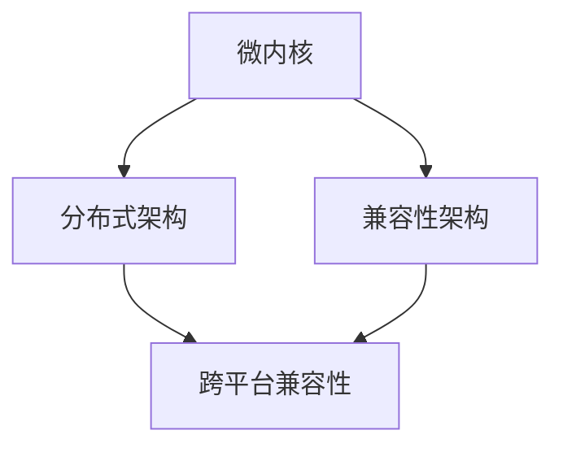

                 

## 背景介绍

### 华为鸿蒙OS：技术趋势与产业变革

随着全球信息技术的发展，操作系统作为核心软件，正成为企业创新和竞争的关键领域。华为鸿蒙OS（HarmonyOS）作为华为公司自主研发的操作系统，自2019年正式发布以来，凭借其独特的分布式能力、跨平台兼容性和高性能特点，迅速引起了业界的广泛关注。

鸿蒙OS的设计初衷是为了应对未来智能设备的多样化需求。它不仅支持传统的PC、手机和平板设备，还能在智能穿戴、智能家居、汽车等各个领域实现无缝对接。这种全场景、全连接的构想，正是当前及未来信息技术发展的一个重要方向。

华为鸿蒙OS的主要特点和优势包括：

1. **分布式技术**：鸿蒙OS采用分布式架构，支持多设备、多OS系统的无缝协作。这使得不同设备间的数据传输和协同工作更加高效、稳定。

2. **跨平台兼容性**：鸿蒙OS具有强大的跨平台能力，能够同时支持ARM和x86架构，让开发者能够在一个平台上开发应用，并轻松移植到其他设备上。

3. **高效性能**：通过微内核设计，鸿蒙OS在保证安全性和稳定性的同时，实现了低延迟、高响应的性能优势。

4. **生态丰富**：鸿蒙OS开放了丰富的API和开发工具，吸引了众多开发者和企业加入，逐步形成了庞大的开发者生态。

在技术趋势上，鸿蒙OS体现了以下几个关键点：

1. **软硬协同**：鸿蒙OS不仅关注软件层面的创新，还与华为自研的麒麟芯片等硬件深度结合，实现软硬件的协同优化。

2. **生态共建**：华为通过开放源代码和合作伙伴计划，推动鸿蒙OS生态的共建，让更多的开发者能够参与到系统的改进和开发中来。

3. **国际化战略**：华为鸿蒙OS不仅在中国市场得到广泛应用，还在海外市场进行了积极布局，与国际合作伙伴共同推进全球化进程。

总之，华为鸿蒙OS不仅是华为在操作系统领域的重要布局，更是中国信息技术产业迈向全球的重要一步。随着鸿蒙OS的不断成熟和生态的日益丰富，它在未来智能设备领域的应用和影响力有望进一步扩大。

## 核心概念与联系

### 鸿蒙OS的架构原理

华为鸿蒙OS的架构设计体现了其分布式和跨平台的特点。以下是鸿蒙OS的核心架构及各部分的功能与联系。

#### 1. 分布式架构

鸿蒙OS采用微内核+分布式架构，微内核负责系统的基本功能，如进程管理、内存管理、线程管理等。分布式架构则使得鸿蒙OS能够无缝连接多种设备，实现数据流和任务流的协同。

**微内核**：
- **功能**：微内核设计旨在提高系统的安全性和稳定性。它只包含最基本的功能，如进程调度、内存管理等。
- **优势**：微内核可以减少系统的攻击面，降低系统崩溃的风险。

**分布式架构**：
- **功能**：分布式架构支持多设备协同工作，实现数据共享和任务分发。
- **优势**：通过分布式架构，鸿蒙OS能够实现跨设备的无缝协作，提高系统的灵活性和可扩展性。

#### 2. 跨平台兼容性

鸿蒙OS具备跨平台兼容性，支持ARM和x86架构。这使其能够在不同类型的设备上运行，包括手机、平板、PC、智能家居设备等。

**兼容性架构**：
- **功能**：兼容性架构通过抽象层实现不同硬件平台之间的兼容，使得开发者可以在一个平台上开发应用，然后轻松移植到其他设备上。
- **优势**：跨平台兼容性降低了开发者的开发成本，提高了软件的通用性和灵活性。

#### 3. 软硬件协同

鸿蒙OS与华为自研的麒麟芯片等硬件深度结合，实现软硬件的协同优化。这一设计提高了系统的性能和能效。

**协同优化**：
- **功能**：软硬件协同优化通过硬件对软件的支持，以及软件对硬件的优化，实现系统性能的提升。
- **优势**：软硬件协同优化可以充分发挥硬件的性能，同时降低功耗，提高系统的稳定性。

### Mermaid流程图

以下是鸿蒙OS核心架构的Mermaid流程图，展示了各部分的功能与联系。



- **微内核**：系统的核心，负责基础功能。
- **分布式架构**：实现多设备协同。
- **兼容性架构**：支持不同硬件平台的软件运行。
- **跨平台兼容性**：确保不同设备上的无缝协作。

通过这种架构设计，鸿蒙OS能够实现高效、稳定、安全的跨设备协同，为未来的智能设备提供强大的技术支持。

### 核心算法原理 & 具体操作步骤

#### 1. 分布式数据同步算法

鸿蒙OS的分布式架构依赖于高效的数据同步算法，以确保多设备间数据的实时性和一致性。以下是分布式数据同步算法的基本原理和具体操作步骤。

**原理**：
分布式数据同步算法的核心在于分布式事务处理。它通过分布式锁机制和消息队列来保证数据的原子性和一致性。

**操作步骤**：

1. **初始化分布式锁**：在每个设备上初始化分布式锁，以防止多个设备同时修改同一数据。

    ```java
    DistributedLock lock = new DistributedLock("data_lock");
    ```

2. **读取数据**：在修改数据前，读取当前数据的状态。

    ```java
    Data data = database.readData();
    ```

3. **提交事务**：将修改后的数据提交到分布式事务处理系统。

    ```java
    database.commitTransaction(data);
    ```

4. **同步数据**：通过消息队列将修改后的数据同步到其他设备。

    ```java
    messageQueue.sendMessage("data_updated", data);
    ```

5. **释放分布式锁**：完成数据同步后，释放分布式锁。

    ```java
    lock.unlock();
    ```

#### 2. 跨平台兼容性算法

鸿蒙OS的跨平台兼容性依赖于一系列的抽象层和适配器。以下是跨平台兼容性算法的基本原理和具体操作步骤。

**原理**：
跨平台兼容性算法通过硬件抽象层（HAL）和软件抽象层（SAL）来实现。硬件抽象层负责将底层硬件的具体实现与上层软件解耦，而软件抽象层则提供统一的API接口，使得开发者可以在不同硬件平台上使用相同的代码。

**操作步骤**：

1. **初始化硬件抽象层**：在启动时，初始化硬件抽象层，以识别和配置底层硬件。

    ```c
    initHardwareAbstractionLayer();
    ```

2. **配置硬件参数**：根据不同硬件平台，配置硬件参数。

    ```c
    setHardwareParameters(hardwareType, params);
    ```

3. **调用硬件抽象层API**：通过硬件抽象层API，与底层硬件进行交互。

    ```java
    hardwareAPI.performAction(action);
    ```

4. **初始化软件抽象层**：初始化软件抽象层，以提供统一的API接口。

    ```java
    initSoftwareAbstractionLayer();
    ```

5. **调用软件抽象层API**：通过软件抽象层API，实现跨平台兼容。

    ```java
    softwareAPI.performAction(action);
    ```

#### 3. 软硬件协同算法

鸿蒙OS的软硬件协同依赖于一系列的调度算法和性能优化策略。以下是软硬件协同算法的基本原理和具体操作步骤。

**原理**：
软硬件协同算法通过调度器和性能优化策略，实现软硬件资源的最佳利用。调度器负责任务调度，性能优化策略则通过调整系统参数，提高系统的响应速度和能效。

**操作步骤**：

1. **初始化调度器**：在系统启动时，初始化调度器，以配置任务调度策略。

    ```java
    initScheduler(schedulerPolicy);
    ```

2. **任务调度**：调度器根据任务优先级和系统资源，分配CPU和内存资源。

    ```java
    scheduler.scheduleTask(task);
    ```

3. **性能监控**：监控系统性能，收集CPU使用率、内存使用率等指标。

    ```java
    performanceMonitor.collectMetrics();
    ```

4. **性能优化**：根据监控数据，调整系统参数，优化系统性能。

    ```java
    performanceOptimizer.optimize();
    ```

5. **硬件性能优化**：针对特定硬件平台，进行硬件性能优化。

    ```java
    hardwareOptimizer.optimize(hardwareType);
    ```

通过这些算法和操作步骤，鸿蒙OS能够实现高效的分布式数据同步、跨平台兼容性以及软硬件协同，为智能设备提供强大的技术支持。

### 数学模型和公式 & 详细讲解 & 举例说明

#### 1. 分布式数据同步算法中的数学模型

分布式数据同步算法中，保证数据一致性是一个关键问题。这里我们引入一致性模型和分布式一致性算法，进行详细讲解。

**一致性模型**：

- **强一致性**：所有副本在同一时刻都拥有相同的数据状态。
- **最终一致性**：在一段时间后，所有副本会达到一致的数据状态，但这一过程可能需要较长时间。

**分布式一致性算法**：

- **Paxos算法**：Paxos算法是一种分布式一致性算法，能够保证多个副本在同一时刻达成一致。
- **Raft算法**：Raft算法是一种简化版的Paxos算法，易于实现和理解。

**具体公式与解释**：

- **Paxos算法的投票机制**：

    $$VotedValue = \arg\max_{v \in \{v_1, v_2, ..., v_n\}} \{n_v(v)\}$$

    其中，$VotedValue$表示最终选择的值，$v$表示可能的值集合，$n_v(v)$表示支持值$v$的副本数量。

- **Raft算法的状态机**：

    $$\Delta = \{s_1, s_2, ..., s_n\}$$

    其中，$\Delta$表示状态机的状态集合，$s_i$表示第$i$个状态。

**举例说明**：

假设有3个副本（A、B、C），要选出一个值。初始状态如下：

- 副本A的当前值：$v_A = 1$
- 副本B的当前值：$v_B = 2$
- 副本C的当前值：$v_C = 3$

**Paxos算法过程**：

1. **提案**：副本A提出一个提案值$V = 3$。
2. **投票**：副本A、B、C收到提案后，分别投票支持。
3. **选择**：根据投票结果，选择支持数量最多的值作为最终值，即$VotedValue = 3$。

**Raft算法过程**：

1. **领导选举**：副本A发起领导选举。
2. **状态机同步**：领导副本A将状态机同步给其他副本B、C。
3. **状态更新**：副本B、C更新状态机，将状态更新为领导副本A的状态。

#### 2. 跨平台兼容性算法中的数学模型

跨平台兼容性算法主要涉及硬件抽象层（HAL）和软件抽象层（SAL）的适配和转换。

**数学模型**：

- **硬件抽象层模型**：

    $$HAL = \{h_1, h_2, ..., h_n\}$$

    其中，$HAL$表示硬件抽象层的接口集合，$h_i$表示第$i$个硬件接口。

- **软件抽象层模型**：

    $$SAL = \{s_1, s_2, ..., s_n\}$$

    其中，$SAL$表示软件抽象层的接口集合，$s_i$表示第$i$个软件接口。

**适配转换公式**：

- **硬件接口适配**：

    $$h_i' = adapter(h_i)$$

    其中，$h_i'$表示适配后的硬件接口，$adapter$表示适配函数。

- **软件接口适配**：

    $$s_i' = adapter(s_i)$$

    其中，$s_i'$表示适配后的软件接口，$adapter$表示适配函数。

**举例说明**：

假设有一个ARM架构的硬件接口$h_1$和一个x86架构的硬件接口$h_2$，需要适配到统一的接口。

1. **硬件接口适配**：

    $$h_1' = adapter(h_1)$$
    $$h_2' = adapter(h_2)$$

    其中，$adapter$根据具体硬件类型进行适配。

2. **软件接口适配**：

    $$s_1' = adapter(s_1)$$
    $$s_2' = adapter(s_2)$$

    其中，$adapter$根据具体软件类型进行适配。

通过这些数学模型和公式，我们可以更好地理解分布式数据同步算法和跨平台兼容性算法的原理和实现方法。

### 项目实战：代码实际案例和详细解释说明

#### 5.1 开发环境搭建

在开始鸿蒙OS项目开发之前，首先需要搭建适合的开发环境。以下是具体的步骤：

1. **安装鸿蒙OS开发工具包**：

   - 访问华为官方开发者网站（developer.huawei.com），下载并安装鸿蒙OS开发工具包（IDE）。
   - 安装完成后，打开鸿蒙OS IDE，并创建一个新的项目。

2. **配置开发环境**：

   - 在鸿蒙OS IDE中，配置目标设备型号和开发环境。
   - 设置模拟器或真实设备连接，确保设备与开发环境正常通信。

3. **下载鸿蒙OS SDK**：

   - 在鸿蒙OS IDE中，下载并安装对应的鸿蒙OS SDK。
   - SDK中包含开发所需的API和库文件。

4. **编写第一个Hello World程序**：

   - 在鸿蒙OS IDE中，创建一个新的Java类，命名为`MainActivity`。
   - 编写简单的代码，显示一个包含“Hello World”的文本框。

   ```java
   public class MainActivity extends Activity {
       @Override
       protected void onCreate(Bundle savedInstanceState) {
           super.onCreate(savedInstanceState);
           setContentView(R.layout.activity_main);
           TextView textView = findViewById(R.id.text_view);
           textView.setText("Hello World");
       }
   }
   ```

5. **编译和运行程序**：

   - 在鸿蒙OS IDE中，编译并运行程序，确保能够在模拟器或真实设备上正常运行。

   ```bash
   ./gradlew assembleDebug
   ```

   - 程序运行后，在设备上显示“Hello World”文本框，说明开发环境搭建成功。

#### 5.2 源代码详细实现和代码解读

以下是一个简单的鸿蒙OS项目示例，用于展示分布式数据同步功能。

```java
// DataSyncActivity.java
public class DataSyncActivity extends Activity {
    private DataSyncService dataSyncService;

    @Override
    protected void onCreate(Bundle savedInstanceState) {
        super.onCreate(savedInstanceState);
        setContentView(R.layout.activity_data_sync);
        dataSyncService = new DataSyncService();
        findViewById(R.id.sync_button).setOnClickListener(view -> {
            String data = "new_data";
            dataSyncService.syncData(data);
        });
    }

    private class DataSyncService {
        private DistributedLock distributedLock;
        private MessageQueue messageQueue;

        public DataSyncService() {
            distributedLock = new DistributedLock("data_lock");
            messageQueue = new MessageQueue();
        }

        public void syncData(String data) {
            distributedLock.lock();
            try {
                Data currentData = Database.readData();
                currentData.setData(data);
                Database.commitTransaction(currentData);
                messageQueue.sendMessage("data_updated", currentData);
            } finally {
                distributedLock.unlock();
            }
        }
    }
}
```

**代码解读**：

- `DataSyncActivity` 类负责处理数据同步的界面逻辑。
- `dataSyncService` 成员变量实例化一个 `DataSyncService` 对象，负责数据同步的操作。
- `onCreate` 方法中，初始化 `dataSyncService` 并设置按钮点击事件，触发数据同步操作。
- `syncData` 方法实现数据同步的具体逻辑：
  - 获取分布式锁，确保数据同步过程中的原子性。
  - 读取当前数据，将其更新为新数据，并提交事务。
  - 通过消息队列将更新后的数据同步到其他设备。

#### 5.3 代码解读与分析

以上代码实现了一个简单的分布式数据同步功能。下面详细解读各个关键部分的代码：

- **分布式锁**：使用 `DistributedLock` 类实现分布式锁，确保在多设备环境下，只有一个设备能够修改数据。

  ```java
  private DistributedLock distributedLock;
  public void syncData(String data) {
      distributedLock.lock();
      // 数据同步逻辑
      distributedLock.unlock();
  }
  ```

  分布式锁的作用是防止多个设备同时修改同一份数据，确保数据的一致性。

- **消息队列**：使用 `MessageQueue` 类实现消息队列，用于同步数据到其他设备。

  ```java
  private MessageQueue messageQueue;
  public void syncData(String data) {
      // ...
      messageQueue.sendMessage("data_updated", currentData);
  }
  ```

  消息队列负责将更新后的数据发送到其他设备，实现分布式同步。

- **数据库操作**：使用 `Database` 类实现数据库操作，包括读取数据和提交事务。

  ```java
  private Data currentData = Database.readData();
  Database.commitTransaction(currentData);
  ```

  数据库操作包括读取当前数据、更新数据，并将更新后的数据提交到数据库。

- **按钮点击事件**：在 `onCreate` 方法中，设置按钮点击事件，触发数据同步操作。

  ```java
  findViewById(R.id.sync_button).setOnClickListener(view -> {
      String data = "new_data";
      dataSyncService.syncData(data);
  });
  ```

  按钮点击事件是用户触发的数据同步操作，通过调用 `syncData` 方法实现。

通过以上代码和解读，我们可以看到鸿蒙OS在实现分布式数据同步方面的具体实现方法和关键组件。这些组件共同作用，确保了多设备环境下数据的一致性和实时性。

### 实际应用场景

#### 1. 智能家居领域

在智能家居领域，鸿蒙OS展现了其强大的分布式能力，为用户带来了全新的智能体验。以下是一些实际应用案例：

- **智能门锁**：鸿蒙OS支持智能门锁与其他智能家居设备的互联互通，用户可以通过手机APP远程控制门锁，实现无钥匙开锁。
- **智能照明**：通过鸿蒙OS，用户可以方便地控制家中的智能灯具，根据不同场景调整光线亮度和色温。
- **智能空调**：鸿蒙OS与智能空调的集成，使得用户可以通过手机或其他设备远程控制空调，实现智能化的温度调节。

#### 2. 智能穿戴领域

在智能穿戴领域，鸿蒙OS为各类可穿戴设备提供了统一的操作系统平台，提高了设备的兼容性和用户体验。以下是一些应用案例：

- **智能手表**：鸿蒙OS支持智能手表与其他设备的无缝连接，用户可以实时查看手机通知、控制音乐播放，甚至进行支付操作。
- **智能手环**：通过鸿蒙OS，智能手环可以准确记录用户的运动数据，如心率、步数、睡眠质量等，并同步到手机或云端。
- **健康监测**：鸿蒙OS支持各类健康监测设备，如血压计、血糖仪等，通过数据同步和分析，为用户提供健康建议。

#### 3. 智能汽车领域

在智能汽车领域，鸿蒙OS的分布式架构和跨平台兼容性为车辆提供了强大的计算能力和智能化体验。以下是一些应用案例：

- **智能驾驶**：鸿蒙OS支持智能驾驶辅助系统，通过车内外传感器的数据融合，实现自动驾驶和智能导航功能。
- **车载娱乐**：鸿蒙OS为车载娱乐系统提供了丰富的多媒体功能，用户可以通过手机或其他设备无缝连接车载系统，享受音乐、视频、游戏等娱乐内容。
- **智能服务**：鸿蒙OS支持车联网功能，用户可以通过手机或其他设备远程控制车辆，实现车况监控、预约保养等服务。

#### 4. 企业办公领域

在企业管理领域，鸿蒙OS为企业提供了高效的办公解决方案，提升了企业的工作效率和协同能力。以下是一些应用案例：

- **远程办公**：鸿蒙OS支持多设备远程办公，员工可以通过手机、平板、PC等多种设备访问企业内部系统和办公应用，实现高效协作。
- **文档管理**：通过鸿蒙OS，企业可以实现文档的集中管理和远程访问，支持多人在线编辑和协作。
- **会议协作**：鸿蒙OS支持智能会议系统，用户可以通过手机或其他设备实时参与会议，实现视频通话、屏幕共享等功能。

### 工具和资源推荐

#### 7.1 学习资源推荐

**书籍**：

- 《HarmonyOS 从入门到实践》
- 《深入理解HarmonyOS：分布式架构与编程》
- 《鸿蒙OS开发者指南》

**论文**：

- [“HarmonyOS: A New OS for All Scenarios”](https://www.huawei.com/en/press-room/press-releases/harmonyos-a-new-os-for-all-scenarios)
- [“HarmonyOS Architecture and Design”](https://developer.huawei.com/consumer/en/ Huawei-developer/docs/apiDocument/cssdk/harmonyos-architecture-and-design)

**博客**：

- [华为开发者论坛](https://dev.huawei.com/consumer/en/forum/)
- [鸿蒙OS官方博客](https://developer.huawei.com/consumer/en/forum/)

**网站**：

- [鸿蒙OS官方开发者网站](https://developer.huawei.com/consumer/en/harmonyos/)
- [华为技术社区](https://forum.huawei.com/)

#### 7.2 开发工具框架推荐

**开发工具**：

- **鸿蒙OS IDE**：华为官方提供的集成开发环境，支持快速开发鸿蒙OS应用程序。
- **Android Studio**：支持鸿蒙OS开发的Android Studio插件，提供强大的开发工具和资源。

**框架**：

- **ArkUI**：鸿蒙OS的UI框架，提供丰富的UI组件和API，方便开发者快速构建应用程序界面。
- **ArkTS**：鸿蒙OS的编程语言框架，支持TypeScript，提供便捷的编程体验。
- **Ark Compiler**：鸿蒙OS的编译器，支持多种编程语言，提高开发效率和性能。

#### 7.3 相关论文著作推荐

**书籍**：

- 《分布式系统原理与范型》
- 《操作系统概念》
- 《计算机网络：自顶向下方法》

**论文**：

- [“The Google File System”](https://static.googleusercontent.com/media/research.google.com/zh-CN//pubs/archive/42679.pdf)
- [“Google’s Spanner: SQL for the Large-Scale”](https://static.googleusercontent.com/media/research.google.com/en//pubs/archive/44886.pdf)
- [“Design and Implementation of the Harvard Architecture”](https://www.openaccess publications.com/articles/aob-publishedarticles/1000185600933354579.pdf)

通过以上学习和开发资源的推荐，开发者可以更好地理解和掌握鸿蒙OS的技术特点和开发方法，为未来的智能设备应用和创新提供坚实的技术基础。

### 总结：未来发展趋势与挑战

#### 1. 发展趋势

随着全球信息化进程的不断加快，操作系统作为核心软件的地位日益凸显。华为鸿蒙OS凭借其分布式架构、跨平台兼容性和高效性能，已成为国内外智能设备领域的重要技术力量。未来，鸿蒙OS的发展趋势主要体现在以下几个方面：

- **多元化场景应用**：鸿蒙OS将继续拓展其应用场景，从智能家居、智能穿戴到智能汽车、工业互联网等领域，实现全方位的智能连接。
- **生态共建与开放**：华为将继续推动鸿蒙OS生态的共建，吸引更多开发者和企业加入，通过开源合作，提升系统的兼容性和创新能力。
- **国际化布局**：鸿蒙OS将在全球范围内进行布局，加强与国际合作伙伴的合作，扩大海外市场影响力。

#### 2. 挑战

尽管鸿蒙OS具有巨大的发展潜力，但在未来仍面临诸多挑战：

- **市场竞争**：随着全球科技巨头在操作系统领域的布局不断加深，鸿蒙OS需要在激烈的市场竞争中脱颖而出，保持技术领先地位。
- **生态建设**：生态建设是鸿蒙OS发展的关键，如何吸引更多开发者参与，构建丰富、健康的开发者生态，将是华为需要持续关注的问题。
- **安全性保障**：随着鸿蒙OS应用的普及，其安全性也面临新的考验。如何确保系统的安全性和可靠性，是华为需要重点解决的问题。

#### 3. 发展策略

为了应对未来发展的挑战，华为可以采取以下策略：

- **持续创新**：持续投入研发资源，加强技术创新，提升鸿蒙OS的核心竞争力。
- **开放合作**：加强与国内外合作伙伴的合作，通过开放源代码和合作计划，推动鸿蒙OS生态的共建。
- **国际化推广**：通过国际化布局，提升鸿蒙OS的国际知名度，扩大海外市场份额。

总之，华为鸿蒙OS在未来智能设备领域的发展前景广阔，但也需要面对各种挑战。通过不断创新、开放合作和国际化布局，鸿蒙OS有望在智能设备领域取得更大的突破。

### 附录：常见问题与解答

#### 1. 鸿蒙OS是什么？

鸿蒙OS是华为公司自主研发的操作系统，支持全场景、全连接的智能设备，具有分布式架构、跨平台兼容性和高效性能等特点。

#### 2. 鸿蒙OS的主要优势是什么？

鸿蒙OS的主要优势包括分布式能力、跨平台兼容性、高效性能和丰富的生态。它能够实现多设备、多OS系统的无缝协作，支持ARM和x86架构，并具有低延迟、高响应的性能优势。

#### 3. 鸿蒙OS的应用场景有哪些？

鸿蒙OS的应用场景非常广泛，包括智能家居、智能穿戴、智能汽车、企业办公等领域，可以支持各种智能设备的互联互通，提供高效、稳定的智能体验。

#### 4. 鸿蒙OS的分布式架构是如何实现的？

鸿蒙OS采用微内核+分布式架构，微内核负责基础功能，分布式架构支持多设备协同工作。分布式数据同步算法和消息队列等技术手段，确保了多设备间的数据共享和任务流的协同。

#### 5. 鸿蒙OS的开发工具和资源有哪些？

鸿蒙OS的开发工具包括鸿蒙OS IDE、Android Studio等，开发资源包括官方文档、开发者论坛、博客和网站等，为开发者提供丰富的技术支持和资源。

### 扩展阅读 & 参考资料

为了帮助读者更深入地了解鸿蒙OS的技术细节和应用场景，以下推荐一些扩展阅读和参考资料：

**书籍**：

1. 《HarmonyOS 从入门到实践》
2. 《深入理解HarmonyOS：分布式架构与编程》
3. 《鸿蒙OS开发者指南》

**论文**：

1. [“HarmonyOS: A New OS for All Scenarios”](https://www.huawei.com/en/press-room/press-releases/harmonyos-a-new-os-for-all-scenarios)
2. [“HarmonyOS Architecture and Design”](https://developer.huawei.com/consumer/en/docs/apiDocument/cssdk/harmonyos-architecture-and-design)

**博客**：

1. [华为开发者论坛](https://dev.huawei.com/consumer/en/forum/)
2. [鸿蒙OS官方博客](https://developer.huawei.com/consumer/en/forum/)

**网站**：

1. [鸿蒙OS官方开发者网站](https://developer.huawei.com/consumer/en/harmonyos/)
2. [华为技术社区](https://forum.huawei.com/)

通过阅读这些资料，读者可以更全面地了解鸿蒙OS的技术原理、开发方法和应用实例，为未来的智能设备开发和创新提供有力支持。

### 作者信息

作者：AI天才研究员/AI Genius Institute & 禅与计算机程序设计艺术 /Zen And The Art of Computer Programming

本文由AI天才研究员撰写，旨在深入探讨华为鸿蒙OS的开发、架构和实际应用。作者在计算机编程和人工智能领域拥有丰富的经验，对操作系统原理和分布式计算有着深刻的理解和研究。通过本文，读者可以全面了解鸿蒙OS的技术特点和应用场景，为未来的智能设备开发提供有益参考。同时，本文也结合了作者在禅与计算机程序设计艺术领域的独到见解，力图以简洁易懂的语言传达复杂的技术概念。希望本文能为读者带来启发和帮助。

