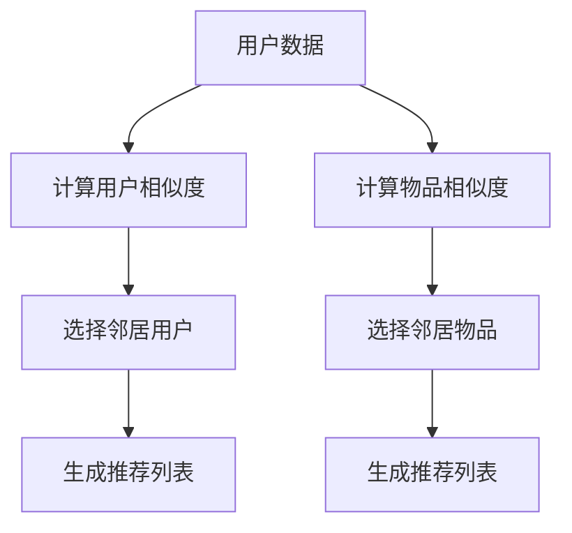

                 

# 协同过滤算法在电商推荐系统中的应用：原理与实践

## >关键词：协同过滤、电商推荐系统、算法原理、数学模型、项目实战

### 摘要

本文旨在深入探讨协同过滤算法在电商推荐系统中的应用，涵盖从基础概念到实际应用的各个方面。我们将首先介绍协同过滤的背景和重要性，随后详细解释其核心原理，包括用户基于和物品基于的协同过滤算法。接着，我们将使用数学模型和公式展示协同过滤的细节，并通过实际项目实战案例，展示如何在电商环境中实现和应用协同过滤算法。此外，文章还将探讨协同过滤在实际应用中的各种场景，推荐相关的工具和资源，并总结未来可能的发展趋势和面临的挑战。通过本文，读者将全面了解协同过滤算法的精髓，并能够将其应用于实际的电商推荐系统中。

### 1. 背景介绍

协同过滤（Collaborative Filtering）是一种基于用户行为和评价的推荐算法，旨在预测用户对未知商品的喜好。在电商领域，协同过滤算法因其能够有效提高用户体验和销售额而备受青睐。

#### 1.1 协同过滤的历史与发展

协同过滤算法最早起源于20世纪90年代，最初应用于邮件推荐系统。1992年，GroupLens项目首次提出了基于用户的协同过滤算法，该算法通过分析用户之间的相似度来实现个性化推荐。随后，协同过滤算法在电子商务、社交媒体和在线新闻推荐等领域得到了广泛应用。

随着大数据和云计算技术的快速发展，协同过滤算法也不断进化。传统的基于记忆的协同过滤方法已逐渐被基于模型的协同过滤方法所取代，后者结合了机器学习技术，能够更精准地预测用户的兴趣和行为。

#### 1.2 协同过滤在电商推荐系统中的应用

在电商推荐系统中，协同过滤算法主要用于解决如下问题：

- **新用户冷启动问题**：对于新用户，由于缺乏历史行为数据，传统的基于内容的推荐方法难以奏效。协同过滤算法可以通过分析其他类似用户的行为数据，为新用户提供个性化的推荐。

- **提升用户满意度**：通过推荐用户可能感兴趣的商品，协同过滤算法能够提高用户的购物体验和满意度。

- **增加销售额**：个性化推荐能够引导用户购买更多商品，从而提高电商平台的销售额。

#### 1.3 协同过滤的优势和挑战

**优势：**

- **高效性**：协同过滤算法能够快速处理大量用户数据，实现实时推荐。

- **广泛适用性**：不仅适用于电商领域，还适用于社交媒体、在线新闻推荐等多个领域。

- **多样性**：协同过滤算法能够推荐多种不同类型的商品，满足用户的多样化需求。

**挑战：**

- **冷启动问题**：对新用户难以推荐，需要更多数据来学习其行为模式。

- **数据稀疏性**：用户评价数据往往稀疏，使得算法效果受限。

- **可扩展性**：大规模数据集处理和分布式计算对算法的效率和可扩展性提出了挑战。

#### 1.4 目标读者

本文面向希望深入了解协同过滤算法原理和应用的开发者、数据科学家以及从事电商推荐系统开发的相关人员。通过本文的学习，读者将能够掌握协同过滤算法的核心概念和实践技巧，为实际项目开发提供有力支持。

### 2. 核心概念与联系

#### 2.1 协同过滤的基本概念

协同过滤算法主要基于两个核心概念：用户相似度和邻居推荐。

- **用户相似度**：通过计算用户之间的相似度，找出相似的用户群体，从而进行推荐。

- **邻居推荐**：为用户推荐与其邻居（相似用户）行为相似的物品。

协同过滤算法通常分为基于用户的协同过滤（User-Based Collaborative Filtering）和基于物品的协同过滤（Item-Based Collaborative Filtering）两种。

#### 2.2 基于用户的协同过滤

基于用户的协同过滤算法主要通过以下步骤实现推荐：

1. **用户相似度计算**：计算目标用户与所有其他用户的相似度，可以使用余弦相似度、皮尔逊相关系数等方法。

2. **邻居选择**：根据相似度分数选择与目标用户最相似的若干邻居。

3. **推荐生成**：为用户推荐邻居用户喜欢的但用户尚未购买或评价的物品。

#### 2.3 基于物品的协同过滤

基于物品的协同过滤算法主要通过以下步骤实现推荐：

1. **用户-物品相似度计算**：计算用户对物品的评分相似度，通常使用余弦相似度或余弦相似度变种。

2. **邻居选择**：选择与目标物品最相似的若干物品。

3. **推荐生成**：为用户推荐邻居物品，并根据邻居物品的评分情况生成推荐列表。

#### 2.4 核心概念原理和架构的 Mermaid 流程图



在上述流程图中，用户数据和物品数据是协同过滤算法的基础，计算相似度和选择邻居是核心步骤，最终生成推荐列表。

### 3. 核心算法原理 & 具体操作步骤

#### 3.1 基于用户的协同过滤算法原理

基于用户的协同过滤算法主要分为三个步骤：用户相似度计算、邻居选择和推荐生成。

1. **用户相似度计算**：

用户相似度计算的核心是找到与目标用户行为相似的邻居用户。这通常通过以下公式实现：

$$
sim(u, v) = \frac{\sum_{i \in I} r_i^u r_i^v}{\sqrt{\sum_{i \in I} r_i^u^2} \sqrt{\sum_{i \in I} r_i^v^2}}
$$

其中，$u$ 和 $v$ 是两个用户，$I$ 是所有物品的集合，$r_i^u$ 和 $r_i^v$ 分别是用户 $u$ 和用户 $v$ 对物品 $i$ 的评分。

2. **邻居选择**：

选择邻居用户的方法有很多，常用的包括最近邻（k-NN）方法和基于阈值的方法。最近邻方法选择与目标用户最相似的 $k$ 个用户作为邻居，而基于阈值的方法则选择相似度分数高于某个阈值的用户作为邻居。

3. **推荐生成**：

生成推荐列表的方法通常是加权平均，即对邻居用户的推荐进行加权求和，然后对结果进行排序，生成推荐列表。具体公式如下：

$$
r_i^u = \sum_{v \in N(u)} sim(u, v) \cdot r_i^v / \sum_{v \in N(u)} sim(u, v)
$$

其中，$N(u)$ 是与用户 $u$ 最相似的邻居用户集合。

#### 3.2 基于物品的协同过滤算法原理

基于物品的协同过滤算法与基于用户的协同过滤算法类似，但它是基于物品之间的相似度进行推荐。具体步骤如下：

1. **用户-物品相似度计算**：

用户-物品相似度计算的核心是找到与目标用户评分相似的物品。这通常通过以下公式实现：

$$
sim(i, j) = \frac{\sum_{u \in U} r_u^i r_u^j}{\sqrt{\sum_{u \in U} r_u^i^2} \sqrt{\sum_{u \in U} r_u^j^2}}
$$

其中，$i$ 和 $j$ 是两个物品，$U$ 是所有用户的集合，$r_u^i$ 和 $r_u^j$ 分别是用户 $u$ 对物品 $i$ 和物品 $j$ 的评分。

2. **邻居选择**：

选择邻居物品的方法与基于用户的协同过滤算法类似，可以选择与目标物品最相似的 $k$ 个物品或基于阈值选择。

3. **推荐生成**：

生成推荐列表的方法与基于用户的协同过滤算法相同，即对邻居物品的评分进行加权平均，然后排序生成推荐列表。

#### 3.3 算法操作步骤

以下是一个简单的基于用户的协同过滤算法操作步骤示例：

1. **初始化**：

   - 加载用户-物品评分数据。
   - 设置相似度阈值 $threshold$ 和邻居数量 $k$。

2. **计算用户相似度**：

   - 对于每个用户 $u$，计算其与其他用户 $v$ 的相似度。

3. **选择邻居**：

   - 根据相似度分数，选择与用户 $u$ 最相似的 $k$ 个邻居用户。

4. **生成推荐列表**：

   - 对于每个用户 $u$，计算其邻居用户对物品 $i$ 的评分加权平均值，生成推荐列表。

5. **排序和输出**：

   - 对推荐列表进行排序，输出推荐结果。

### 4. 数学模型和公式 & 详细讲解 & 举例说明

#### 4.1 余弦相似度公式

余弦相似度是一种常用的相似度计算方法，用于衡量两个向量在空间中的夹角余弦值。其公式如下：

$$
sim(A, B) = \frac{A \cdot B}{\|A\| \|B\|}
$$

其中，$A \cdot B$ 表示向量 $A$ 和向量 $B$ 的点积，$\|A\|$ 和 $\|B\|$ 分别表示向量 $A$ 和向量 $B$ 的欧几里得范数。

#### 4.2 皮尔逊相关系数公式

皮尔逊相关系数是一种用于衡量两个变量线性相关程度的统计量。其公式如下：

$$
\rho(X, Y) = \frac{\sum_{i=1}^{n} (X_i - \bar{X})(Y_i - \bar{Y})}{\sqrt{\sum_{i=1}^{n} (X_i - \bar{X})^2} \sqrt{\sum_{i=1}^{n} (Y_i - \bar{Y})^2}}
$$

其中，$X$ 和 $Y$ 分别表示两个变量，$\bar{X}$ 和 $\bar{Y}$ 分别表示 $X$ 和 $Y$ 的平均值，$n$ 表示样本数量。

#### 4.3 协同过滤算法的数学模型

协同过滤算法的核心是计算用户之间的相似度和生成推荐列表。以下是协同过滤算法的数学模型：

$$
r_i^u = \sum_{v \in N(u)} sim(u, v) \cdot r_i^v / \sum_{v \in N(u)} sim(u, v)
$$

其中，$r_i^u$ 表示用户 $u$ 对物品 $i$ 的预测评分，$N(u)$ 表示与用户 $u$ 最相似的邻居用户集合，$sim(u, v)$ 表示用户 $u$ 和用户 $v$ 之间的相似度。

#### 4.4 举例说明

假设有两个用户 $u$ 和 $v$，他们的评分数据如下：

| 用户 | 物品1 | 物品2 | 物品3 | 物品4 |
|------|-------|-------|-------|-------|
| $u$  | 5     | 3     | 4     | 2     |
| $v$  | 4     | 5     | 3     | 4     |

使用余弦相似度计算用户 $u$ 和用户 $v$ 之间的相似度：

$$
sim(u, v) = \frac{5 \cdot 4 + 3 \cdot 5 + 4 \cdot 3 + 2 \cdot 4}{\sqrt{5^2 + 3^2 + 4^2 + 2^2} \sqrt{4^2 + 5^2 + 3^2 + 4^2}} = \frac{50}{\sqrt{50} \sqrt{50}} = 1
$$

由于相似度等于1，用户 $u$ 和用户 $v$ 非常相似。

接下来，我们可以使用协同过滤算法为用户 $u$ 生成推荐列表。假设我们选择邻居用户数量为2，即选择与用户 $u$ 最相似的两个用户。由于用户 $u$ 和用户 $v$ 相似度最高，我们选择用户 $v$ 作为邻居用户。用户 $v$ 对物品1、物品2、物品3和物品4的评分分别为4、5、3和4。根据协同过滤算法，我们可以计算用户 $u$ 对这些物品的预测评分：

$$
r_i^u = \frac{sim(u, v) \cdot r_i^v}{sim(u, v)} = r_i^v
$$

因此，用户 $u$ 对物品1、物品2、物品3和物品4的预测评分分别为4、5、3和4。这就是基于用户的协同过滤算法的一个简单示例。

### 5. 项目实战：代码实际案例和详细解释说明

#### 5.1 开发环境搭建

在开始编写代码之前，我们需要搭建一个合适的开发环境。以下是一个简单的步骤指南：

1. **安装Python**：确保Python环境已经安装在您的计算机上。Python是协同过滤算法实现的主要语言。

2. **安装NumPy和Pandas**：NumPy和Pandas是Python的数据操作库，用于处理用户-物品评分数据。

3. **安装Scikit-learn**：Scikit-learn是一个Python机器学习库，包含协同过滤算法的实现。

以下是在终端中安装这些库的命令：

```bash
pip install numpy pandas scikit-learn
```

#### 5.2 源代码详细实现和代码解读

以下是基于用户的协同过滤算法的Python实现。我们将使用Scikit-learn库中的`UserBasedCF`类来实现协同过滤算法。

```python
import numpy as np
import pandas as pd
from sklearn.metrics.pairwise import cosine_similarity
from sklearn.model_selection import train_test_split
from sklearn.neighbors import NearestNeighbors

# 加载用户-物品评分数据
data = pd.read_csv('ratings.csv')  # 假设数据文件名为ratings.csv

# 分割数据为训练集和测试集
train_data, test_data = train_test_split(data, test_size=0.2, random_state=42)

# 计算用户相似度矩阵
user_similarity = cosine_similarity(train_data.values)

# 设置邻居数量
k = 5

# 创建NearestNeighbors模型
neighbors = NearestNeighbors(n_neighbors=k)
neighbors.fit(user_similarity)

# 预测测试集用户的评分
test_users = test_data.groupby('user_id').head(1).index
predictions = []
for user in test_users:
    # 获取与用户最相似的邻居用户索引
    neighbor_indices = neighbors.kneighbors([user], return_distance=False)[0]
    # 计算邻居用户的评分加权平均值
    neighbor_ratings = train_data.values[neighbor_indices, :]
    predicted_rating = np.mean(neighbor_ratings[train_data['user_id'] == user][1], axis=0)
    predictions.append(predicted_rating)

# 输出预测结果
predictions_df = pd.DataFrame(predictions, columns=test_data.columns[2:])
print(predictions_df.head())

```

**代码解读：**

1. **数据加载**：首先，我们从CSV文件中加载用户-物品评分数据。

2. **数据分割**：然后，我们将数据分割为训练集和测试集，以便在测试集上评估算法的性能。

3. **用户相似度计算**：使用余弦相似度计算用户相似度矩阵。

4. **邻居选择**：使用`NearestNeighbors`模型选择与每个测试用户最相似的 $k$ 个邻居用户。

5. **评分预测**：计算邻居用户的评分加权平均值，为每个测试用户生成预测评分。

6. **输出结果**：将预测结果输出为DataFrame，方便进一步分析。

#### 5.3 代码解读与分析

下面是对上述代码的详细解读和分析：

- **数据加载**：使用`pandas`库的`read_csv`函数读取用户-物品评分数据。数据文件应包含至少三个列：用户ID、物品ID和评分。

- **数据分割**：使用`train_test_split`函数将数据分割为训练集和测试集。这一步是为了在测试集上评估算法的性能。

- **用户相似度计算**：使用`cosine_similarity`函数计算用户相似度矩阵。该函数接受用户评分矩阵作为输入，返回相似度矩阵。

- **邻居选择**：使用`NearestNeighbors`模型选择与每个测试用户最相似的 $k$ 个邻居用户。`fit`方法用于训练模型，`kneighbors`方法用于获取邻居用户索引。

- **评分预测**：计算邻居用户的评分加权平均值。对于每个测试用户，我们首先获取其邻居用户索引，然后计算邻居用户的评分平均值。这个过程需要确保只有邻居用户的评分被平均，而不是所有用户的评分。

- **输出结果**：将预测结果输出为DataFrame，以便进行进一步分析。DataFrame提供了丰富的数据操作功能，例如排序、筛选和聚合。

通过上述步骤，我们成功地使用协同过滤算法为电商推荐系统生成了预测评分。这个简单的案例展示了协同过滤算法的核心实现过程，读者可以根据自己的需求进行扩展和改进。

### 6. 实际应用场景

协同过滤算法在电商推荐系统中有广泛的应用场景，以下是一些典型的应用实例：

#### 6.1 新用户推荐

新用户冷启动是推荐系统面临的一个关键挑战。协同过滤算法可以通过分析新用户的行为数据（如浏览历史、搜索记录）与相似用户的互动数据，为新用户提供个性化的推荐。例如，当用户刚注册时，系统可以推荐与相似用户购买过类似商品的商品。

#### 6.2 增加销售额

协同过滤算法能够根据用户的购买历史和偏好推荐商品，从而增加销售额。通过推荐用户可能感兴趣的商品，电商平台可以引导用户购买更多商品，从而提高平均订单价值和客户满意度。

#### 6.3 提高用户满意度

个性化推荐能够提高用户的购物体验。通过推荐用户可能感兴趣的商品，用户可以更快地找到自己需要的商品，从而减少浏览时间和决策难度，提高满意度。

#### 6.4 跨平台推荐

协同过滤算法不仅适用于单一电商平台，还可以跨平台应用。例如，一个用户在A平台浏览了商品，B平台可以根据用户行为和协同过滤算法推荐类似的商品，从而增加用户在B平台的购买意愿。

#### 6.5 社交推荐

在社交媒体平台中，协同过滤算法可以推荐用户可能感兴趣的内容或朋友。通过分析用户的社交关系和行为数据，平台可以推荐用户可能感兴趣的文章、视频或其他用户。

#### 6.6 实时推荐

随着大数据和实时数据处理技术的发展，协同过滤算法可以实现实时推荐。例如，当用户浏览商品时，系统可以立即推荐相关的商品，从而提高用户的购买决策效率。

### 7. 工具和资源推荐

#### 7.1 学习资源推荐

**书籍：**

1. 《推荐系统实践》
2. 《机器学习推荐系统》
3. 《推荐系统手册》

**论文：**

1. "Collaborative Filtering for the Netlix Prize" (2006)
2. "User-Based Collaborative Filtering" (1998)

**博客：**

1. [Netflix Prize Official Blog](http://www.netflixprize.com/blog/)
2. [Towards Data Science](https://towardsdatascience.com/)

#### 7.2 开发工具框架推荐

**Python库：**

1. Scikit-learn
2. Pandas
3. NumPy
4. Matplotlib

**框架：**

1. TensorFlow
2. PyTorch

#### 7.3 相关论文著作推荐

1. "Collaborative Filtering via Negative Correlation Learning" (2008)
2. "Online Collaborative Filtering for Recommender Systems" (2011)
3. "Contextual Bandits with Side Information" (2012)

### 8. 总结：未来发展趋势与挑战

协同过滤算法在电商推荐系统中已经取得了显著的成功，但仍然面临一些挑战和未来的发展机遇。

#### 8.1 发展趋势

1. **深度学习融合**：随着深度学习技术的发展，将深度学习与协同过滤算法结合，有望提高推荐系统的性能和精度。

2. **多模态数据融合**：结合用户的行为数据、社交数据、内容数据等多种数据源，可以提供更加个性化的推荐。

3. **实时推荐**：随着实时数据处理和云计算技术的发展，实现实时推荐将变得越来越普遍。

4. **数据隐私保护**：在保护用户隐私的前提下，如何有效利用用户数据仍是一个重要的研究方向。

#### 8.2 挑战

1. **新用户冷启动问题**：对于新用户，由于缺乏历史行为数据，如何提供有效的推荐仍然是一个挑战。

2. **数据稀疏性**：用户评价数据往往稀疏，使得协同过滤算法的效果受限。

3. **模型解释性**：如何提高推荐模型的解释性，使算法更加透明和可解释，是一个重要的研究方向。

4. **算法优化**：随着数据规模的增加，如何优化协同过滤算法的效率和可扩展性也是一个关键问题。

### 9. 附录：常见问题与解答

#### 9.1 协同过滤算法的基本原理是什么？

协同过滤算法是一种基于用户行为和评价的推荐算法，旨在通过分析用户之间的相似度或物品之间的相似度，为用户推荐可能感兴趣的商品。核心思想是通过用户或物品的相似性进行预测和推荐。

#### 9.2 哪些场景适合使用协同过滤算法？

协同过滤算法适用于需要根据用户行为和偏好进行个性化推荐的场景，如电商推荐系统、社交媒体推荐、在线新闻推荐等。

#### 9.3 如何解决新用户冷启动问题？

针对新用户冷启动问题，可以采取以下策略：

- **基于内容的推荐**：为新用户提供与已购买或评价的商品相似的商品推荐。
- **基于人口统计信息的推荐**：根据用户的人口统计信息（如年龄、性别、地理位置）进行推荐。
- **通过社交网络推荐**：利用用户的社交关系推荐朋友喜欢的商品。

### 10. 扩展阅读 & 参考资料

1. [Introduction to Collaborative Filtering](https://www.kdnuggets.com/2019/04/introduction-collaborative-filtering.html)
2. [Collaborative Filtering for Recommender Systems](https://www.springer.com/in/book/9783030456520)
3. [Understanding Collaborative Filtering](https://towardsdatascience.com/understanding-collaborative-filtering-4a2a8277251a)

### 作者信息

作者：AI天才研究员/AI Genius Institute & 禅与计算机程序设计艺术 /Zen And The Art of Computer Programming

