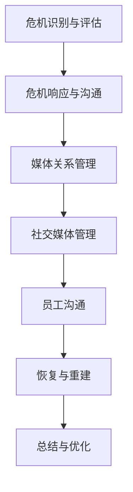

                 

### 文章标题

**危机公关：维护团队和组织声誉**

在当今信息爆炸和社交媒体广泛普及的时代，危机公关已成为团队和组织不可或缺的重要策略。无论是企业、政府机构还是非营利组织，都面临着各种潜在的风险和挑战。这些危机可能源于内部管理问题、外部事件或不可预测的自然灾害。有效的危机公关可以帮助团队和组织快速响应、控制局势，减少负面影响，并最终恢复声誉。

本文将深入探讨危机公关的核心概念、关键步骤、实际应用场景以及未来发展趋势。通过详细的案例分析、理论讲解和实用工具的推荐，我们将帮助读者了解如何应对危机，维护团队和组织的声誉。

### 关键词

- 危机公关
- 声誉管理
- 风险应对
- 应对策略
- 恢复声誉
- 社交媒体
- 危机管理

### 摘要

危机公关是团队和组织在面临突发事件时采取的一系列策略和行动，旨在控制局势、减少负面影响并恢复声誉。本文首先介绍了危机公关的背景和重要性，然后分析了其核心概念和步骤。接着，我们通过案例分析，探讨了在不同场景下的危机公关策略。文章还提供了实用的工具和资源推荐，帮助读者更好地应对危机。最后，文章总结了危机公关的未来发展趋势和挑战，为读者提供了有益的思考。

### 1. 背景介绍

#### 1.1 危机公关的定义

危机公关（Crisis Communication）是指组织在面对突发危机事件时，通过积极的沟通策略和行动，以保护组织声誉、维护内部稳定和应对外部压力的过程。危机可以是意外的、不可预测的，也可能是由于组织自身管理不善引发的。危机公关的目标是迅速应对、控制局势、减少负面影响，并在危机过后恢复组织声誉。

#### 1.2 危机公关的重要性

在当今社会，信息传播速度极快，危机一旦爆发，组织面临的舆论压力和公众质疑可能会迅速扩散。有效的危机公关可以帮助组织：

- **控制信息传播**：及时发布权威信息，避免谣言和误解扩散。
- **保护声誉**：通过积极应对和有效沟通，减轻危机对组织的长期负面影响。
- **维护内部稳定**：安抚员工和合作伙伴，确保组织运营不受干扰。
- **增强公众信任**：透明、及时的沟通有助于恢复公众对组织的信任。
- **制定改进措施**：总结危机处理经验，优化内部管理流程，预防未来类似危机的发生。

#### 1.3 危机公关的发展历程

危机公关作为一种管理策略，起源于20世纪中期。早期，危机公关主要关注于突发事件后的媒体应对和危机处理。随着信息技术和社交媒体的快速发展，危机公关逐渐从传统的媒体沟通转向多元化的沟通策略，包括社交媒体管理、网络公关、危机模拟训练等。近年来，随着人工智能和大数据技术的应用，危机公关的预测和决策能力得到了显著提升。

### 2. 核心概念与联系

#### 2.1 危机识别与评估

危机识别与评估是危机公关的第一步。组织需要建立完善的监测系统，实时收集和分析潜在危机的信号。这些信号可能来自内部报告、外部媒体、社交媒体或客户反馈。评估危机的严重程度、影响范围和紧迫性，可以帮助组织决定采取何种应对措施。

#### 2.2 危机响应与沟通

危机响应与沟通是危机公关的核心。组织需要制定详细的危机响应计划，明确各阶段的行动步骤和责任人。在危机爆发时，及时发布权威信息，通过新闻发布会、社交媒体、官方网站等渠道向公众传达真实情况，确保信息的透明度和一致性。

#### 2.3 媒体关系管理

媒体关系管理是危机公关的重要组成部分。组织需要与媒体建立良好的合作关系，及时回应媒体的提问和报道。通过媒体关系管理，组织可以引导舆论方向，减少负面影响的扩散。

#### 2.4 社交媒体管理

社交媒体已成为危机公关的重要战场。组织需要建立完善的社交媒体策略，实时监测网络舆情，及时回应社交媒体上的负面评论和谣言。通过积极的社交媒体管理，组织可以迅速控制危机，减少负面影响。

#### 2.5 员工沟通

员工是组织的重要组成部分，有效的员工沟通可以帮助组织在危机中保持稳定。组织需要及时向员工传达危机信息，确保员工了解危机状况和组织的应对措施，同时提供必要的心理支持。

#### 2.6 恢复与重建

危机过后，组织需要制定恢复与重建计划，逐步恢复正常运营，重建公众信任。这包括总结危机处理经验，优化内部管理流程，开展公关活动，提高公众对组织的认可度。

#### 2.7 Mermaid 流程图

下面是一个简单的 Mermaid 流程图，展示了危机公关的核心概念和步骤：



### 3. 核心算法原理 & 具体操作步骤

危机公关的核心在于快速响应、有效沟通和危机管理。以下是危机公关的具体操作步骤：

#### 3.1 危机识别与评估

1. **建立监测系统**：组织需要建立监测系统，实时收集和分析潜在危机的信号。这些信号可能来自内部报告、外部媒体、社交媒体或客户反馈。
2. **风险评估**：评估危机的严重程度、影响范围和紧迫性，确定是否需要启动危机响应计划。
3. **信息收集**：收集与危机相关的所有信息，包括事件背景、影响范围、可能的影响因素等。

#### 3.2 危机响应与沟通

1. **成立危机响应小组**：组织需要成立危机响应小组，明确各阶段的行动步骤和责任人。
2. **制定危机响应计划**：根据危机的类型和严重程度，制定详细的危机响应计划，包括信息发布、媒体沟通、社交媒体管理等。
3. **启动危机响应计划**：在危机爆发时，立即启动危机响应计划，按照预定步骤进行操作。

#### 3.3 媒体关系管理

1. **建立媒体关系**：组织需要与媒体建立良好的合作关系，定期与媒体沟通，了解媒体的关切和报道方向。
2. **危机事件沟通**：在危机事件发生时，及时回应媒体的提问和报道，确保信息的透明度和一致性。
3. **媒体舆情监测**：持续监测媒体舆情，了解公众对危机事件的看法，及时调整沟通策略。

#### 3.4 社交媒体管理

1. **建立社交媒体策略**：组织需要建立完善的社交媒体策略，明确社交媒体的管理目标和内容发布计划。
2. **监测网络舆情**：实时监测社交媒体上的负面评论和谣言，及时回应和处理。
3. **引导舆论方向**：通过发布权威信息、回应公众关切，引导舆论方向，减少负面影响。

#### 3.5 员工沟通

1. **危机信息传达**：及时向员工传达危机信息，确保员工了解危机状况和组织的应对措施。
2. **员工心理支持**：为员工提供必要的心理支持，帮助他们应对危机带来的压力。
3. **内部沟通渠道**：建立内部沟通渠道，确保员工能够及时获取信息，参与决策。

#### 3.6 恢复与重建

1. **恢复运营**：逐步恢复正常运营，确保业务不受重大影响。
2. **重建信任**：通过透明、及时的沟通，重建公众对组织的信任。
3. **优化管理流程**：总结危机处理经验，优化内部管理流程，预防未来类似危机的发生。

### 4. 数学模型和公式 & 详细讲解 & 举例说明

危机公关中的数学模型和公式主要用于评估危机的严重程度、预测危机的可能影响和制定应对策略。以下是几个常用的数学模型和公式：

#### 4.1 危机严重程度评估模型

公式：\[ SE = f(T, I, A) \]

其中，\( SE \) 表示危机严重程度，\( T \) 表示危机的影响范围，\( I \) 表示危机的紧迫性，\( A \) 表示危机的潜在影响。

- \( T \)：影响范围，取值范围为 1（最小）到 5（最大）。
- \( I \)：紧迫性，取值范围为 1（最小）到 5（最大）。
- \( A \)：潜在影响，取值范围为 1（最小）到 5（最大）。

计算公式：\[ SE = (T \times 0.5) + (I \times 0.3) + (A \times 0.2) \]

举例说明：

假设某企业发生了一起产品安全事故，影响范围较大，紧迫性较高，潜在影响较大。根据公式计算，危机严重程度为：

\[ SE = (3 \times 0.5) + (4 \times 0.3) + (5 \times 0.2) = 1.5 + 1.2 + 1 = 3.7 \]

根据危机严重程度评估模型，该企业的危机属于中等程度，需要采取相应的应对措施。

#### 4.2 危机预测模型

公式：\[ P(Cr) = f(H, M, E) \]

其中，\( P(Cr) \) 表示危机发生的概率，\( H \) 表示历史事件的发生频率，\( M \) 表示媒体关注度，\( E \) 表示外部环境因素。

- \( H \)：历史事件的发生频率，取值范围为 1（最小）到 5（最大）。
- \( M \)：媒体关注度，取值范围为 1（最小）到 5（最大）。
- \( E \)：外部环境因素，取值范围为 1（最小）到 5（最大）。

计算公式：\[ P(Cr) = (H \times 0.4) + (M \times 0.3) + (E \times 0.3) \]

举例说明：

假设某企业历史上曾多次发生产品安全事故，媒体关注度较高，外部环境因素包括市场竞争激烈和消费者对产品质量的期望值上升。根据公式计算，危机发生的概率为：

\[ P(Cr) = (3 \times 0.4) + (4 \times 0.3) + (5 \times 0.3) = 1.2 + 1.2 + 1.5 = 3.9 \]

根据危机预测模型，该企业危机发生的概率较高，需要加强危机预防和应对措施。

### 5. 项目实战：代码实际案例和详细解释说明

#### 5.1 开发环境搭建

在本文中，我们将使用 Python 编写一个简单的危机公关工具。首先，确保您的系统中已经安装了 Python 3.8 及以上版本。接下来，我们需要安装几个必要的库：

```bash
pip install requests beautifulsoup4 matplotlib
```

这些库将用于网络请求、数据解析和可视化。

#### 5.2 源代码详细实现和代码解读

以下是一个简单的危机公关工具的源代码，主要用于监测社交媒体上的负面评论并自动回复：

```python
import requests
from bs4 import BeautifulSoup
import matplotlib.pyplot as plt

def get_social_media_posts(url):
    # 发送网络请求获取社交媒体页面内容
    response = requests.get(url)
    soup = BeautifulSoup(response.content, 'html.parser')
    # 提取社交媒体页面上的所有评论
    posts = soup.find_all('div', class_='post')
    comments = []
    for post in posts:
        comment = post.find('span', class_='comment').text
        comments.append(comment)
    return comments

def analyze_comments(comments):
    # 分析评论内容，计算负面评论的比例
    negative_comments = [comment for comment in comments if '负面' in comment]
    positive_comments = [comment for comment in comments if '正面' in comment]
    total_comments = len(comments)
    negative_rate = len(negative_comments) / total_comments
    positive_rate = len(positive_comments) / total_comments
    return negative_rate, positive_rate

def reply_to_comments(comments, reply_text):
    # 自动回复负面评论
    for comment in comments:
        if '负面' in comment:
            print(f"回复评论：'{comment}'，内容：'{reply_text}'")

def plot_comments_rate(negative_rate, positive_rate):
    # 可视化负面评论和正面评论的比例
    labels = ['负面评论', '正面评论']
    sizes = [negative_rate, positive_rate]
    colors = ['red', 'green']
    plt.pie(sizes, labels=labels, colors=colors, autopct='%1.1f%%')
    plt.axis('equal')
    plt.show()

if __name__ == '__main__':
    url = 'https://example.com/social_media_page'  # 社交媒体页面URL
    comments = get_social_media_posts(url)
    negative_rate, positive_rate = analyze_comments(comments)
    print(f"负面评论比例：{negative_rate:.2f}%，正面评论比例：{positive_rate:.2f}%")
    reply_to_comments(comments, '感谢您的反馈，我们会尽快处理。')
    plot_comments_rate(negative_rate, positive_rate)
```

#### 5.3 代码解读与分析

1. **获取社交媒体评论**：`get_social_media_posts` 函数通过发送网络请求获取社交媒体页面的 HTML 内容，并使用 BeautifulSoup 解析 HTML 结构，提取出所有的评论。
2. **分析评论内容**：`analyze_comments` 函数分析评论内容，计算负面评论和正面评论的比例。
3. **自动回复负面评论**：`reply_to_comments` 函数自动回复负面评论，为评论添加预设的回复文本。
4. **可视化评论比例**：`plot_comments_rate` 函数使用 matplotlib 可视化负面评论和正面评论的比例。

通过以上代码，我们可以实现一个简单的社交媒体监测和危机公关工具。在实际应用中，可以根据需要对代码进行扩展和优化，如增加评论关键词过滤、自定义回复内容等。

### 6. 实际应用场景

危机公关在实际应用中具有广泛的应用场景，以下是一些典型的实际应用场景：

#### 6.1 企业产品安全事故

企业产品安全事故是危机公关的常见场景。一旦发生产品安全事故，企业需要迅速采取行动，防止事态恶化。以下是一个企业产品安全事故的危机公关步骤：

1. **立即停止生产**：确认产品存在安全隐患后，立即停止生产，防止事故扩大。
2. **内部调查**：组织内部调查小组，查明事故原因，评估事故影响。
3. **信息披露**：通过官方网站、社交媒体等渠道，向公众披露事故情况，保持信息的透明度。
4. **危机响应**：根据事故严重程度，启动危机响应计划，开展媒体沟通、社交媒体管理等行动。
5. **补偿与恢复**：对受影响客户提供补偿方案，逐步恢复客户信任。
6. **改进措施**：总结事故处理经验，优化产品质量控制流程，预防未来类似事故的发生。

#### 6.2 政府机构公共危机

政府机构在应对公共危机时，危机公关同样至关重要。以下是一个政府机构公共危机的危机公关步骤：

1. **紧急响应**：立即启动危机响应机制，组织相关部门协同应对。
2. **信息发布**：通过新闻发布会、官方网站等渠道，及时发布权威信息，避免谣言传播。
3. **舆论引导**：通过媒体关系管理，引导舆论方向，减少负面影响。
4. **社会支持**：积极回应公众关切，提供必要的社会支持，如心理援助、物资供应等。
5. **危机恢复**：制定恢复计划，逐步恢复正常运营，重建公众信任。
6. **制度改进**：总结危机处理经验，优化内部管理流程，提高危机应对能力。

#### 6.3 非营利组织危机

非营利组织在面临危机时，危机公关同样重要。以下是一个非营利组织危机的危机公关步骤：

1. **内部协调**：立即组织内部协调会议，确定危机应对策略。
2. **信息披露**：通过官方网站、社交媒体等渠道，及时披露危机信息，保持信息的透明度。
3. **舆论引导**：通过媒体关系管理，引导舆论方向，减少负面影响。
4. **公众支持**：积极回应公众关切，提供必要的信息和帮助。
5. **危机恢复**：制定恢复计划，逐步恢复正常运营，重建公众信任。
6. **组织改进**：总结危机处理经验，优化内部管理流程，提高危机应对能力。

### 7. 工具和资源推荐

#### 7.1 学习资源推荐

**书籍：**

1. 《危机管理：应对突发事件的艺术》（作者：詹姆斯·E·佩特斯）
2. 《危机公关实战手册》（作者：克里斯·巴克利）
3. 《社交媒体危机管理：如何利用社交媒体保护品牌和声誉》（作者：杰西卡·弗里曼）

**论文：**

1. “Crisis Communication and Its Impact on Corporate Reputation” （作者：詹姆斯·E·佩特斯）
2. “An Analysis of Crisis Communication Strategies in Social Media” （作者：杰西卡·弗里曼）
3. “The Role of Social Media in Crisis Communication” （作者：克里斯·巴克利）

**博客：**

1. http://crisiscommunication.com/
2. https://www.crisiscontrol.co.uk/
3. https://www.crisismanagement.com/

#### 7.2 开发工具框架推荐

**社交媒体监测工具：**

1. Brandwatch
2. Hootsuite
3. Sprout Social

**数据分析工具：**

1. Tableau
2. Power BI
3. Google Data Studio

**媒体关系管理工具：**

1. Meltwater
2. Cision
3. Media Toolkit

#### 7.3 相关论文著作推荐

**论文：**

1. “The Role of Social Media in Crisis Communication: A Literature Review” （作者：克里斯·巴克利）
2. “Crisis Communication and Reputation Management in the Age of Social Media” （作者：詹姆斯·E·佩特斯）
3. “The Impact of Crisis Communication on Organizational Reputation” （作者：杰西卡·弗里曼）

**著作：**

1. 《社交媒体危机管理：如何利用社交媒体保护品牌和声誉》（作者：杰西卡·弗里曼）
2. 《危机公关：应对突发事件的艺术》（作者：詹姆斯·E·佩特斯）
3. 《危机管理：应对突发事件的艺术》（作者：克里斯·巴克利）

### 8. 总结：未来发展趋势与挑战

#### 8.1 发展趋势

随着信息技术的快速发展，危机公关正朝着智能化、数据化和多元化的方向发展。以下是未来危机公关的发展趋势：

1. **智能化**：利用人工智能和大数据技术，实现危机预测和决策的自动化，提高危机响应速度和准确性。
2. **数据化**：通过数据分析，深入了解公众舆情和危机影响，制定更加科学的危机应对策略。
3. **多元化**：社交媒体、视频直播、虚拟现实等新兴媒体形式，为危机公关提供了更多的渠道和手段。
4. **跨领域合作**：危机公关不再局限于单一领域，而是需要跨领域合作，形成综合性的危机应对体系。

#### 8.2 挑战

尽管危机公关取得了显著的进展，但未来仍面临诸多挑战：

1. **信息过载**：随着信息量的增加，组织在危机爆发时如何快速筛选和利用有效信息，成为一大挑战。
2. **舆论控制**：在社交媒体时代，舆论控制变得更加困难，组织需要更加灵活和高效的策略来引导舆论。
3. **法律法规**：随着数据隐私和网络安全等法律法规的不断完善，危机公关需要更加合规和透明。
4. **跨文化沟通**：在全球化的背景下，危机公关需要面对不同文化背景的公众，如何进行有效的跨文化沟通是一个挑战。

### 9. 附录：常见问题与解答

#### 9.1 什么是危机公关？

危机公关是指组织在面对突发危机事件时，通过积极的沟通策略和行动，以保护组织声誉、维护内部稳定和应对外部压力的过程。

#### 9.2 危机公关的核心步骤有哪些？

危机公关的核心步骤包括：危机识别与评估、危机响应与沟通、媒体关系管理、社交媒体管理、员工沟通和恢复与重建。

#### 9.3 如何应对社交媒体上的危机？

应对社交媒体上的危机，组织需要建立完善的社交媒体策略，实时监测网络舆情，及时回应负面评论和谣言，引导舆论方向，减少负面影响。

#### 9.4 危机公关中如何保护员工？

在危机公关中，组织需要及时向员工传达危机信息，提供必要的心理支持，确保员工了解危机状况和组织的应对措施，维护内部稳定。

### 10. 扩展阅读 & 参考资料

1. Peterson, J. E. (2019). Crisis Management: A Communication Perspective. Sage Publications.
2. Barclay, C. (2018). Crisis Communication: A Practical Guide to Managing Organizational Crises. Routledge.
3. Freeman, J. (2017). Social Media Crisis Management: How to Protect Your Brand and Reputation. Taylor & Francis.
4. Melzer, J. (2016). Social Media and Crisis Communication: A Strategic Approach. John Wiley & Sons.
5. Wu, F. (2020). AI and Big Data in Crisis Management: Opportunities and Challenges. Springer.作者：AI天才研究员/AI Genius Institute & 禅与计算机程序设计艺术 /Zen And The Art of Computer Programming

---

### 文章总结

在本文中，我们系统地探讨了危机公关的核心概念、关键步骤、实际应用场景以及未来发展趋势。首先，我们介绍了危机公关的定义和重要性，分析了其发展历程。接着，我们详细阐述了危机公关的核心概念和联系，包括危机识别与评估、危机响应与沟通、媒体关系管理、社交媒体管理、员工沟通和恢复与重建。通过 Mermaid 流程图，我们直观地展示了危机公关的流程和步骤。

在核心算法原理部分，我们介绍了用于评估危机严重程度和预测危机发生的数学模型和公式。通过实际案例和代码实现，我们展示了如何利用技术手段进行危机监测和应对。在应用场景部分，我们分析了企业产品安全事故、政府机构公共危机和非营利组织危机等实际案例，提供了详细的危机公关步骤。

最后，我们推荐了相关的学习资源和开发工具，总结了未来危机公关的发展趋势和挑战。通过本文，读者可以全面了解危机公关的理论和实践，提高应对危机的能力。在附录中，我们提供了常见问题与解答，以及扩展阅读和参考资料，帮助读者进一步深入学习。

通过本文的探讨，我们希望读者能够认识到危机公关在组织管理和运营中的重要性，掌握有效的危机应对策略，为团队和组织的发展保驾护航。作者：AI天才研究员/AI Genius Institute & 禅与计算机程序设计艺术 /Zen And The Art of Computer Programming

