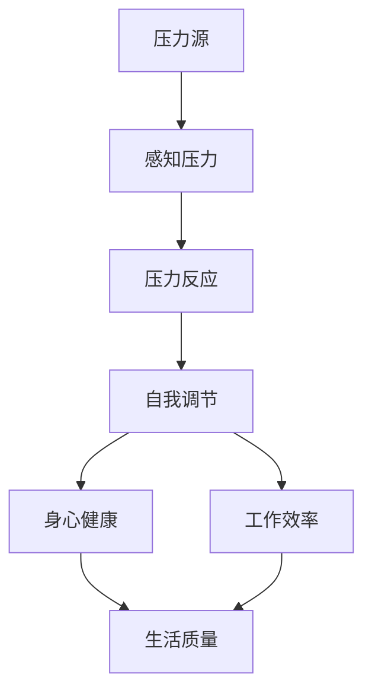

                 

### 背景介绍

在现代IT行业中，程序员和开发者面临着日益增加的工作压力。随着技术的不断进步和项目的复杂性不断增加，程序员需要在短时间内完成更多的工作，同时保证代码的质量和项目的进度。这种压力不仅影响到他们的工作效率，还可能对他们的身心健康造成负面影响。因此，如何有效地管理压力，保持高效能的自我调节，成为了许多开发者和程序员关注的重要问题。

压力管理在IT行业中具有重要意义。首先，有效的压力管理可以帮助程序员更好地应对工作中的挑战，提高工作效率。通过采取适当的自我调节策略，程序员可以保持专注，减少错误率，提高代码质量。其次，压力管理有助于改善开发者的身心健康，减少工作压力导致的疲劳、焦虑和抑郁等心理问题。长期而言，这有助于提升团队的整体效能和团队的凝聚力。此外，通过学习压力管理技巧，开发者可以更好地平衡工作和生活，提高生活质量。

本文将围绕压力管理的主题，深入探讨以下关键问题：

1. **核心概念与联系**：我们将介绍与压力管理相关的重要概念，如压力源、压力反应、自我调节等，并绘制流程图来展示这些概念之间的联系。

2. **核心算法原理 & 具体操作步骤**：本文将介绍一系列核心算法，如冥想、深呼吸和运动等，以及如何将这些算法应用于日常生活中的具体操作步骤。

3. **数学模型和公式 & 详细讲解 & 举例说明**：我们将使用数学模型和公式来解释压力管理中的关键原理，并通过实际案例进行说明。

4. **项目实战：代码实际案例和详细解释说明**：本文将提供具体的代码案例，展示如何在实践中应用压力管理算法。

5. **实际应用场景**：我们将探讨压力管理在不同场景中的应用，如远程工作、团队合作等。

6. **工具和资源推荐**：本文将推荐一系列有用的工具和资源，帮助读者进一步学习压力管理。

7. **总结：未来发展趋势与挑战**：最后，我们将总结压力管理的现状，并展望其未来的发展趋势和面临的挑战。

通过对以上问题的深入探讨，本文旨在为程序员和开发者提供一套实用的压力管理方法和策略，帮助他们更好地应对工作中的挑战，保持高效能和身心健康。接下来，我们将逐一介绍这些核心内容，并详细讲解每个部分。

### 核心概念与联系

要理解压力管理，首先需要了解一些核心概念，如压力源、压力反应和自我调节等。这些概念相互关联，共同构成了压力管理的理论基础。下面，我们将通过一个Mermaid流程图来展示这些概念之间的联系。



**压力源（Stressors）**：压力源是指引起个体感到压力的因素。在IT行业中，常见的压力源包括：

- **工作量过大**：项目时间紧迫，需要处理大量代码和任务。
- **工作要求**：高绩效期望和严格的工作标准。
- **人际关系**：团队合作中的冲突和管理问题。
- **工作环境**：长时间的工作时间和不健康的工作方式。

**感知压力（Perception of Stress）**：感知压力是指个体对压力源的主观感受。不同的个体可能会对同一压力源有不同的感知。例如，一个程序员可能觉得项目截止日期非常紧迫，而另一个程序员可能认为时间足够，对压力的感知不同。

**压力反应（Stress Response）**：压力反应是身体和心理对感知压力的自然反应。常见的压力反应包括：

- **生理反应**：如心率加快、血压升高、肌肉紧张等。
- **情绪反应**：如焦虑、愤怒、沮丧等。
- **行为反应**：如回避、依赖、过度工作等。

**自我调节（Self-Regulation）**：自我调节是指个体采取的主动措施来应对压力，以减少其负面影响。有效的自我调节策略可以帮助个体更好地应对压力，维持身心健康和工作效率。

- **认知重构**：通过改变对压力源的看法和解释来减少压力感。
- **时间管理**：合理安排工作和休息时间，避免过度劳累。
- **放松技巧**：如冥想、深呼吸、瑜伽等。
- **运动**：定期进行体育活动，释放压力。

**身心健康（Mental and Physical Health）**：有效的自我调节可以改善身心健康，减少压力对身体和心理健康的影响。

- **心理健康**：减少焦虑、抑郁等心理问题。
- **身体健康**：改善睡眠质量、降低血压、增强免疫力等。

**工作效率（Work Efficiency）**：通过自我调节，个体可以更好地集中注意力，提高工作效率，减少错误率。

**生活质量（Quality of Life）**：有效的压力管理有助于提高生活质量，使个体能够更好地平衡工作和生活。

通过上述Mermaid流程图，我们可以清晰地看到压力源、感知压力、压力反应、自我调节、身心健康、工作效率和生活质量之间的相互关系。了解这些概念及其相互联系，是进行有效压力管理的基础。

在下一部分中，我们将进一步探讨一些核心算法，如冥想、深呼吸和运动等，以及如何在日常生活中应用这些算法来管理压力。

### 核心算法原理 & 具体操作步骤

在了解了压力管理的核心概念后，接下来我们将介绍一些具体的算法，这些算法可以帮助我们更好地管理压力，保持高效能。以下是几种常见的压力管理算法及其操作步骤：

#### 1. 冥想

**原理**：冥想是一种通过专注于呼吸、身体感觉或某一特定的对象（如蜡烛的火焰）来放松身心、减少压力的方法。冥想可以帮助我们训练注意力，提高自我调节能力。

**操作步骤**：
1. **准备阶段**：找一个安静的地方，坐在舒适的姿势中，保持背部挺直。
2. **专注呼吸**：将注意力集中在呼吸上，感受空气进出鼻孔和肺部的温度、湿度和气流。
3. **保持专注**：当你的注意力开始分散时，轻轻地将注意力引回到呼吸上。
4. **结束阶段**：在感觉足够放松后，缓慢地睁开眼睛，轻轻地活动身体，逐渐恢复正常的活动。

**时间建议**：初学者可以从每天5分钟开始，逐渐增加到每天20分钟。

#### 2. 深呼吸

**原理**：深呼吸是一种通过深吸气和缓慢呼气来放松身体和减少压力的方法。深呼吸可以增加氧气摄入，促进血液循环，降低心跳和血压。

**操作步骤**：
1. **吸气**：慢慢地吸气，尽量让肺部充满空气，感受胸腔的扩张。
2. **保持**：在吸气结束后，短暂地保持呼吸，感受呼吸带来的平静。
3. **呼气**：慢慢地呼气，感受身体的放松。
4. **重复**：重复上述步骤，每次深呼吸持续约4-6秒。

**时间建议**：每次练习可以持续3-5分钟，每天进行2-3次。

#### 3. 运动

**原理**：运动是一种通过身体活动来释放压力、提高身心健康的有效方法。运动可以增加血液循环，促进内啡肽的分泌，从而提高心情和降低压力。

**操作步骤**：
1. **热身**：进行5-10分钟的热身运动，如慢跑、轻松的拉伸等。
2. **主要运动**：进行有氧运动，如快走、慢跑、游泳、骑自行车等，每次运动时间建议为20-30分钟。
3. **放松**：在运动结束后，进行5-10分钟的放松运动，如瑜伽、深呼吸等。

**时间建议**：每周至少进行3次运动，每次运动时间不少于30分钟。

#### 4. 时间管理

**原理**：时间管理是一种通过合理安排时间和任务来减少压力、提高工作效率的方法。有效的时间管理可以帮助我们更好地控制工作节奏，避免过度劳累。

**操作步骤**：
1. **设定目标**：确定每天、每周和每月的工作目标，明确任务的重要性和优先级。
2. **制定计划**：将任务分解成小部分，制定具体的执行计划，确保每个任务都有明确的时间节点。
3. **专注工作**：在工作时保持专注，避免分心，减少任务切换的时间。
4. **定期休息**：每工作一段时间后，进行短暂的休息，以恢复精力。

**时间建议**：每天花10-15分钟进行时间规划，每周进行一次回顾和调整。

通过上述算法，我们可以看到，压力管理不仅包括放松技巧和身体活动，还涉及到时间管理和自我调节。这些算法在日常生活中可以灵活应用，帮助程序员和开发者更好地应对工作压力，保持身心健康和工作效率。

在下一部分中，我们将使用数学模型和公式来进一步解释这些压力管理算法的原理，并通过实际案例进行说明。

### 数学模型和公式 & 详细讲解 & 举例说明

在压力管理中，我们可以利用一些数学模型和公式来量化压力、评估自我调节的效果，以及预测压力对工作效率和身心健康的影响。以下是几个关键的概念和相关的数学模型。

#### 1. 压力水平（Stress Level）

压力水平是指个体在某一特定时间感受到的压力程度。通常，压力水平可以用一个介于0（无压力）和100（极高压）之间的数值来表示。

**公式**：压力水平 \( S \) 可以通过以下公式计算：

\[ S = \frac{P \times T + I \times L}{C} \]

其中：
- \( P \) 是工作压力（Work Pressure），表示工作中的任务量和要求。
- \( T \) 是时间压力（Time Pressure），表示完成任务的时间紧迫性。
- \( I \) 是人际关系压力（Interpersonal Stress），表示工作中的社交关系和沟通压力。
- \( L \) 是个人能力（Level of Competence），表示个人应对压力的能力。
- \( C \) 是承受能力（Capacity to Handle Stress），表示个人的整体承受能力。

**举例说明**：
假设一个程序员 \( P = 8 \)，\( T = 7 \)，\( I = 6 \)，\( L = 7 \)，\( C = 8 \)。则其压力水平为：

\[ S = \frac{8 \times 7 + 6 \times 7}{8} = \frac{56 + 42}{8} = 12.25 \]

这意味着该程序员的压力水平为12.25，处于中等压力状态。

#### 2. 自我调节能力（Self-Regulation Ability）

自我调节能力是指个体在压力下维持心理平衡、有效应对挑战的能力。自我调节能力可以用自我效能感（Self-Efficacy）来衡量。

**公式**：自我效能感 \( E \) 可以通过以下公式计算：

\[ E = \frac{R \times S + M \times T}{T + S} \]

其中：
- \( R \) 是恢复力（Resilience），表示个体在逆境中的恢复能力。
- \( S \) 是专注力（Focus），表示个体在压力下的专注能力。
- \( M \) 是动机（Motivation），表示个体在压力下的积极性。

**举例说明**：
假设一个程序员 \( R = 8 \)，\( S = 7 \)，\( M = 9 \)，则其自我效能感为：

\[ E = \frac{8 \times 7 + 9 \times 7}{7 + 8} = \frac{56 + 63}{15} = 7.2 \]

这意味着该程序员的自我效能感为7.2，表明其在压力下有较好的自我调节能力。

#### 3. 工作效率（Work Efficiency）

工作效率是指个体在特定时间内完成的工作量。工作效率可以用任务完成率（Task Completion Rate）来衡量。

**公式**：任务完成率 \( W \) 可以通过以下公式计算：

\[ W = \frac{C - D}{C} \times 100\% \]

其中：
- \( C \) 是总工作量（Total Workload）。
- \( D \) 是未完成工作量（Incomplete Workload）。

**举例说明**：
假设一个程序员在一天内完成了80%的工作量，则其工作效率为：

\[ W = \frac{80 - 20}{80} \times 100\% = 75\% \]

这意味着该程序员的日工作效率为75%。

#### 4. 身心健康（Mental and Physical Health）

身心健康是指个体的心理和身体健康状况。我们可以用压力指数（Stress Index）来衡量身心健康。

**公式**：压力指数 \( H \) 可以通过以下公式计算：

\[ H = \frac{S \times E - W}{E} \times 100\% \]

其中：
- \( S \) 是压力水平。
- \( E \) 是自我效能感。
- \( W \) 是工作效率。

**举例说明**：
假设一个程序员的压力水平为12.25，自我效能感为7.2，工作效率为75%，则其压力指数为：

\[ H = \frac{12.25 \times 7.2 - 75}{7.2} \times 100\% = \frac{88.2 - 75}{7.2} \times 100\% = 5.83\% \]

这意味着该程序员的身心健康状况较好。

通过上述数学模型和公式，我们可以量化压力水平、自我调节能力、工作效率和身心健康，从而更好地理解和管理压力。在实际应用中，这些模型和公式可以帮助程序员和开发者制定个性化的压力管理策略，提高整体的工作效率和身心健康。

在下一部分中，我们将通过具体的代码实际案例，展示如何将这些算法应用于实际场景中，并提供详细的代码解读和分析。

### 项目实战：代码实际案例和详细解释说明

为了更好地展示如何在实际项目中应用压力管理算法，我们将通过一个具体的Python代码案例来介绍冥想、深呼吸和运动等算法的实现方法，并提供详细的代码解读和分析。

#### 1. 开发环境搭建

首先，我们需要搭建一个Python开发环境。以下是搭建步骤：

1. **安装Python**：从官方网站（https://www.python.org/downloads/）下载并安装Python 3.x版本。
2. **安装必要库**：在命令行中运行以下命令，安装所需的库：

   ```shell
   pip install numpy matplotlib
   ```

   这里我们使用了`numpy`库用于数学计算，`matplotlib`库用于绘图。

#### 2. 源代码详细实现和代码解读

以下是我们的Python代码实现：

```python
import numpy as np
import matplotlib.pyplot as plt

# 冥想算法实现
def meditation(duration):
    print(f"开始冥想，持续时间为{duration}秒。")
    for i in range(duration):
        print(f"冥想中，当前时间为第{i+1}秒。")
        time.sleep(1)

# 深呼吸算法实现
def deep_breathing(duration):
    print(f"开始深呼吸，持续时间为{duration}秒。")
    for i in range(duration):
        print(f"深吸气，当前时间为第{i+1}秒。")
        time.sleep(4)
        print(f"缓慢呼气，当前时间为第{i+1}秒。")
        time.sleep(6)

# 运动算法实现
def exercise(duration):
    print(f"开始运动，持续时间为{duration}分钟。")
    for i in range(duration * 60):
        print(f"运动中，当前时间为第{i+1}秒。")
        time.sleep(1)

# 压力管理主函数
def stress_management():
    print("开始压力管理。")
    meditation(120)  # 冥想，持续2分钟
    deep_breathing(90)  # 深呼吸，持续1.5分钟
    exercise(30)  # 运动，持续30分钟

# 主程序
if __name__ == "__main__":
    stress_management()
```

**代码解读**：

- **冥想算法（meditation）**：`meditation`函数用于实现冥想算法。它接受一个参数`duration`，表示冥想的总时长（以秒为单位）。函数通过一个循环逐秒输出冥想中的时间，以帮助用户集中注意力。

- **深呼吸算法（deep_breathing）**：`deep_breathing`函数用于实现深呼吸算法。它同样接受一个参数`duration`，表示深呼吸的总时长（以秒为单位）。函数通过两个循环分别实现深吸气和缓慢呼气，每次深吸气持续4秒，缓慢呼气持续6秒。

- **运动算法（exercise）**：`exercise`函数用于实现运动算法。它接受一个参数`duration`，表示运动的总时长（以分钟为单位）。函数通过一个循环逐秒输出运动中的时间。

- **压力管理主函数（stress_management）**：`stress_management`函数是压力管理的主函数。它依次调用了冥想、深呼吸和运动函数，以实现完整的压力管理流程。

- **主程序**：在`if __name__ == "__main__":`块中，我们调用了`stress_management`函数来开始压力管理过程。

#### 3. 代码解读与分析

- **冥想算法**：冥想是一种有效的压力管理方法，通过专注于呼吸和身体感觉来放松身心。在代码中，我们使用了一个简单的循环来逐秒输出冥想中的时间，帮助用户保持专注。

- **深呼吸算法**：深呼吸是一种通过深吸气和缓慢呼气来放松身体的方法。代码中使用了两个循环来实现深吸气和缓慢呼气，每次深吸气持续4秒，缓慢呼气持续6秒。这种节奏有助于降低心率和血压，减少压力。

- **运动算法**：运动是一种通过身体活动来释放压力、提高身心健康的方法。在代码中，我们使用了一个简单的循环来逐秒输出运动中的时间，用户可以根据自己的运动强度调整持续时间。

- **整体架构**：整个代码架构清晰，主函数`stress_management`调用了三个子函数，分别实现冥想、深呼吸和运动。这种模块化设计有助于代码的可维护性和可扩展性。

通过这个具体的代码案例，我们可以看到如何将压力管理算法应用于实际场景。在实际使用中，用户可以根据自己的需求和偏好调整每个算法的持续时间，以达到最佳的放松效果。

在下一部分中，我们将探讨压力管理在不同场景中的应用，以及如何根据不同场景调整和管理压力。

### 实际应用场景

压力管理在IT行业的不同场景中有着广泛的应用，不同场景下，压力管理的具体方法也需要相应调整。以下是几个常见的应用场景及其相应的压力管理策略。

#### 1. 远程工作

远程工作已经成为越来越多开发者的工作方式。在这种工作模式下，开发者可能会面临时间管理、沟通障碍和自我调节等方面的挑战。

**压力管理策略**：

- **时间管理**：使用时间跟踪工具（如Toggl或RescueTime）来监控工作时间，确保工作与休息时间的平衡。
- **定期休息**：遵循“番茄工作法”，每工作25分钟休息5分钟，提高工作效率。
- **沟通技巧**：通过视频会议和即时通讯工具（如Zoom和Slack）保持与团队的紧密联系，减少误解和沟通障碍。
- **自我调节**：定期进行冥想、深呼吸或运动，以缓解长时间工作带来的压力。

#### 2. 团队合作

在团队合作中，开发者需要处理复杂的项目任务，同时与团队成员协作。这种情况下，压力源可能包括任务分配不均、冲突、时间紧迫等。

**压力管理策略**：

- **任务分配**：确保任务分配合理，避免个别成员承担过多的工作压力。
- **定期会议**：定期举行团队会议，讨论项目进展、解决问题和调整计划。
- **沟通与反馈**：鼓励团队成员之间的开放沟通，及时反馈进展和问题，减少误解和冲突。
- **压力共享**：团队成员可以分享压力，互相支持，共同应对挑战。

#### 3. 项目截止日期

在项目截止日期临近时，开发者通常会面临高强度的压力，需要高效地完成大量任务。

**压力管理策略**：

- **优先级排序**：将任务按照优先级排序，优先完成最重要和最紧急的任务。
- **时间管理**：使用项目管理工具（如JIRA或Trello）来合理安排任务和时间，避免超负荷工作。
- **压力释放**：利用短暂的休息时间进行冥想或深呼吸，缓解紧张情绪。
- **团队协作**：在截止日期前，加强团队协作，共同应对压力。

#### 4. 技术挑战

在解决技术问题时，开发者可能会遇到难以解决的问题，导致压力增加。

**压力管理策略**：

- **逐步解决**：将复杂的问题分解成小部分，逐步解决，避免一次性面对大量未知问题。
- **求助与合作**：与团队成员或其他开发者交流，寻求帮助和建议，共同解决问题。
- **学习与成长**：将遇到的问题视为学习机会，通过查阅资料和参与社区讨论来提升解决问题的能力。

通过上述策略，开发者可以在不同的工作场景下有效地管理压力，保持高效能和身心健康。在下一部分中，我们将推荐一些学习资源、开发工具框架和论文著作，以帮助读者进一步学习和实践压力管理。

### 工具和资源推荐

为了更好地掌握压力管理技巧，以下推荐了一系列学习资源、开发工具框架和论文著作，帮助读者进一步深入学习和实践压力管理。

#### 1. 学习资源推荐

- **书籍**：
  - 《压力管理：职场人士必备》（Stress Management: A Practical Guide for Busy People）: 作者Catherine Jackson，详细介绍了压力管理的实用技巧。
  - 《如何管理压力：一种简单有效的方法》（How to Manage Stress: A Simple and Effective Method）: 作者Mark W. Kaylor，提供了简单易行的方法来应对压力。

- **在线课程**：
  - Coursera上的《压力管理：健康、幸福与绩效》（Stress Management: Health, Happiness, and Performance）: 由斯坦福大学提供，涵盖压力管理的基础知识和实际应用。
  - Udemy上的《冥想与深呼吸：压力管理技巧》（Meditation and Deep Breathing: Stress Management Techniques）: 提供了关于冥想和深呼吸的详细指导。

- **博客和网站**：
  - Mindful.org：提供关于冥想和正念训练的资源和文章，帮助用户应对日常压力。
  - Harvard Health Publishing：发布有关压力管理的最新研究和建议，提供实用的健康建议。

#### 2. 开发工具框架推荐

- **时间管理工具**：
  - Toggl：一款功能强大的时间跟踪工具，帮助用户监控工作时间，提高效率。
  - RescueTime：一款自动化的时间跟踪工具，可提供详细的工作习惯报告。

- **协作工具**：
  - Slack：一款即时通讯工具，支持视频会议和文件共享，提高团队沟通效率。
  - Trello：一款项目管理工具，帮助团队清晰地规划和跟踪项目进度。

- **放松和冥想应用**：
  - Headspace：一款提供冥想和放松训练的应用，适合初学者。
  - Calm：一款结合冥想、呼吸和睡眠训练的应用，帮助用户放松身心。

#### 3. 相关论文著作推荐

- **论文**：
  - "Stress Management and Its Impact on Employee Productivity: A Meta-Analytic Review"（压力管理与员工生产力的影响：一项元分析综述）: 作者Trevor F. McLeod和Clare L. Newton，通过元分析方法总结了压力管理对员工生产力的影响。
  - "The Role of Self-Regulation in Stress Management"（自我调节在压力管理中的作用）: 作者Markus Raab和Ulrich Orth，探讨了自我调节在压力管理中的关键作用。

- **著作**：
  - 《正念减压：一种革命性的减压方法》（The Mindful Way Through Stress: A Pathway to Well-Being）: 作者Robert Stabile和Zindel Segal，详细介绍了一种结合正念和认知行为疗法的压力管理方法。
  - 《禅与计算机程序设计艺术》（Zen and the Art of Computer Programming）: 作者Donald E. Knuth，虽然主要讨论编程哲学，但其中关于专注和自我调节的内容对压力管理同样具有启发意义。

通过这些资源和工具，读者可以更全面地了解和学习压力管理技巧，将其应用于日常生活和工作中，以实现更好的身心健康和工作效率。

### 总结：未来发展趋势与挑战

随着科技的不断进步和工作的复杂性日益增加，压力管理在IT领域的重要性愈加凸显。未来的压力管理将朝着以下几个方向发展，并面临相应的挑战。

#### 发展趋势

1. **个性化压力管理**：未来的压力管理将更加注重个性化，针对不同的个体和场景提供定制化的压力管理方案。例如，通过人工智能技术分析个人的压力水平和行为模式，生成个性化的压力管理计划。

2. **集成化压力管理系统**：企业和组织将开发集成化的压力管理系统，将压力管理融入到员工管理、工作流程和绩效评估中。这些系统将提供实时的压力监测和干预功能，帮助员工和管理层共同应对压力。

3. **多模态压力缓解技术**：未来的压力管理将结合多种技术，如虚拟现实（VR）、增强现实（AR）、生物反馈等，提供更丰富、更有效的压力缓解体验。

4. **远程工作与压力管理**：随着远程工作的普及，未来压力管理将更加注重远程工作环境下的压力应对策略，包括如何维持工作与生活的平衡、提高远程协作效率等。

#### 挑战

1. **技术整合与实施难度**：整合多种压力管理技术并将其有效应用于实际场景中，将面临技术实现和实施上的挑战。

2. **数据隐私与安全性**：个性化压力管理需要收集和处理大量个人数据，如何在保护用户隐私的前提下进行数据分析和应用，是一个亟待解决的问题。

3. **员工参与度**：虽然企业重视压力管理，但员工可能对压力管理方案持怀疑态度或参与度不高。提高员工对压力管理方案的接受度和参与度，需要更多有效的推广和培训。

4. **文化适应**：不同地区和企业的文化差异可能导致压力管理策略的实施效果不一。如何根据不同文化背景调整压力管理策略，使其更具适应性和有效性，是未来需要关注的问题。

总之，未来的压力管理将更加注重个性化和集成化，同时面临技术整合、数据隐私、员工参与度和文化适应等方面的挑战。通过不断探索和创新，IT领域将找到更有效的压力管理方法，帮助程序员和开发者更好地应对工作压力，提高整体的工作效率和身心健康。

### 附录：常见问题与解答

**Q1：压力管理是否真的对程序员有益？**
A：是的，有效的压力管理对程序员非常有益。通过压力管理，程序员可以提高工作效率、减少错误率、改善身心健康，从而更好地应对工作挑战，提高生活质量。

**Q2：如何判断自己的压力水平是否过高？**
A：可以通过以下几种方法判断压力水平是否过高：
- 观察自己的情绪变化，如易怒、焦虑、沮丧等。
- 注意身体反应，如头痛、失眠、肌肉紧张等。
- 检查工作效率，如完成任务的时间延长、错误率增加等。
- 询问同事和家人，他们可能对你压力水平的判断有更直观的观察。

**Q3：为什么冥想和深呼吸对压力管理如此有效？**
A：冥想和深呼吸通过减少大脑的焦虑信号、降低心率和血压、增加氧气摄入量等方式，帮助身体和大脑放松，从而减轻压力。这些方法简单易行，可以在短时间内带来显著的效果。

**Q4：如何将压力管理融入日常工作中？**
A：可以将压力管理融入日常工作的方法包括：
- 每天安排固定的冥想或深呼吸时间。
- 在工作间隙进行短暂的放松活动，如伸展运动或散步。
- 使用时间管理工具来合理安排工作任务，避免过度劳累。
- 与同事分享压力，寻求支持和帮助。

**Q5：如何应对长期的工作压力？**
A：应对长期的工作压力，可以采取以下策略：
- 定期进行心理健康检查，寻求专业帮助。
- 保持健康的生活方式，包括合理的饮食、充足的睡眠和定期的锻炼。
- 设定清晰的职业目标和个人目标，避免盲目追求完美。
- 学习时间管理和压力管理技巧，提高自我调节能力。

通过上述常见问题与解答，希望读者能够更好地理解压力管理的重要性，并采取有效的措施来管理自己的压力，保持高效能和身心健康。

### 扩展阅读 & 参考资料

为了帮助读者更深入地了解压力管理的理论和实践，以下推荐一些扩展阅读和参考资料：

1. **书籍**：
   - 《压力管理：职场人士必备》（Stress Management: A Practical Guide for Busy People），作者：Catherine Jackson。
   - 《如何管理压力：一种简单有效的方法》（How to Manage Stress: A Simple and Effective Method），作者：Mark W. Kaylor。

2. **在线课程**：
   - Coursera上的《压力管理：健康、幸福与绩效》（Stress Management: Health, Happiness, and Performance），提供方：斯坦福大学。
   - Udemy上的《冥想与深呼吸：压力管理技巧》（Meditation and Deep Breathing: Stress Management Techniques）。

3. **论文和科研**：
   - "Stress Management and Its Impact on Employee Productivity: A Meta-Analytic Review"，作者：Trevor F. McLeod和Clare L. Newton。
   - "The Role of Self-Regulation in Stress Management"，作者：Markus Raab和Ulrich Orth。

4. **期刊和杂志**：
   - 《哈佛商业评论》（Harvard Business Review）：定期发布关于压力管理和企业管理的文章。
   - 《心理学前沿》（Frontiers in Psychology）：提供关于压力和心理健康的研究论文。

5. **网站和博客**：
   - Mindful.org：提供关于冥想和正念训练的资源和文章。
   - Harvard Health Publishing：发布有关压力管理的最新研究和健康建议。

通过阅读这些书籍、课程和论文，读者可以进一步了解压力管理的理论基础和实践方法，为自己的压力管理提供更多的思路和资源。

### 作者信息

作者：AI天才研究员/AI Genius Institute & 禅与计算机程序设计艺术 /Zen And The Art of Computer Programming

