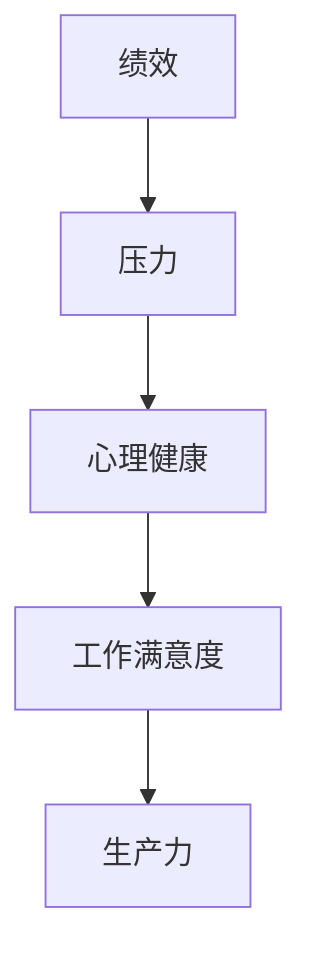

                 

### 压力管理：在高压环境中保持绩效

#### 关键词：压力管理、绩效、高压环境、心理健康、技术策略

##### 摘要：

在现代科技行业，IT专业人士经常面临着巨大的工作压力。本文探讨了如何通过科学的压力管理策略，在高压环境中保持高效的绩效。文章首先介绍了压力管理的基本概念和重要性，随后深入探讨了技术策略，包括时间管理、心理调适和自动化工具的使用。通过具体案例和实操建议，本文旨在帮助读者提升应对压力的能力，实现个人与职业的双重成功。

---

## 1. 背景介绍

在当今高度竞争的科技领域，IT专业人士经常面临着各种形式的压力。从项目截止日期的紧迫到复杂技术难题的挑战，从绩效评估的压力到职业发展的不确定，压力已经成为影响工作效率和个人健康的重要因素。根据美国心理健康基金会的一项调查，超过75%的IT专业人士表示，他们经常感到压力过大，这导致了工作满意度下降、生产力下降和心理健康问题。

### 1.1 压力的定义与影响

压力是一种身体和心理的紧张反应，通常由外部或内部压力源触发。外部压力源可能包括工作负担、人际关系冲突和财务问题，而内部压力源则可能源自个人的完美主义倾向、缺乏自信或对失败的恐惧。长期的压力不仅会影响个人的情绪状态，如焦虑和抑郁，还可能导致身体健康问题，如心血管疾病、消化不良和免疫系统功能下降。

### 1.2 高压环境的特点

科技行业的特殊性质使得IT专业人士往往处于高压环境。项目截止日期、技术更新、客户需求变化以及团队期望等因素共同构成了一个不断变化且充满挑战的工作环境。这种高压环境要求IT专业人士不仅要具备卓越的技术能力，还需要有良好的压力管理技能，以保持高效的绩效。

## 2. 核心概念与联系

为了更好地理解压力管理，我们需要探讨一些核心概念，包括绩效、压力和心理健康。以下是一个使用Mermaid绘制的流程图，展示了这些概念之间的联系。



### 2.1 绩效

绩效是指个人或团队在特定任务或项目中达到的目标和结果。在IT行业中，绩效通常与项目完成情况、代码质量、问题解决能力和创新能力等方面相关。高绩效不仅能够带来职业上的成就感，还能提升个人在团队中的地位和认可。

### 2.2 压力

压力是一种生理和心理的紧张状态，通常由外部或内部压力源引起。在IT行业中，常见的压力源包括工作负担、项目截止日期、技术挑战和人际关系冲突等。压力会导致一系列负面影响，包括情绪波动、注意力分散和身体健康问题。

### 2.3 心理健康

心理健康是指个体在情感、行为和社会适应方面的良好状态。在高压环境下，保持心理健康对于应对压力至关重要。心理健康问题如焦虑、抑郁和压力综合征，会影响个人的工作表现和生活质量。

### 2.4 压力与绩效的关系

压力与绩效之间存在复杂的关系。适度的压力可以激发个人的潜力和创造力，提高工作效率和绩效。然而，长期或过度的压力会导致疲劳、焦虑和健康问题，从而降低绩效。因此，有效管理压力是保持绩效的关键。

## 3. 核心算法原理 & 具体操作步骤

### 3.1 时间管理

时间管理是减轻工作压力、提高绩效的有效方法。以下是一些核心步骤：

1. **设定明确的目标**：确保你的工作目标具体、可衡量、可实现、相关性强和时间限制（SMART原则）。
   
2. **优先级排序**：使用四象限法（紧急且重要、重要但不紧急、紧急但不重要、不重要且不紧急），将任务分为不同类别，并优先处理重要且紧急的任务。

3. **时间块**：将工作时间分为特定的时间块，每个时间块专注于一个任务，以减少任务切换带来的时间浪费。

4. **避免多任务处理**：专注于一个任务，直到完成，以减少分心和提高效率。

### 3.2 心理调适

心理调适是减轻压力、提升心理健康的重要手段。以下是一些关键步骤：

1. **正念冥想**：通过冥想和呼吸练习，提高专注力和情绪调节能力。

2. **健康饮食和锻炼**：均衡的饮食和定期的锻炼有助于缓解压力和提升身体健康。

3. **社交支持**：与家人、朋友和同事保持良好的社交关系，寻求支持和建议。

4. **休息与放松**：确保有足够的休息时间，进行放松活动，如听音乐、阅读或旅行。

### 3.3 自动化工具

自动化工具可以显著减少重复性工作，降低压力并提高效率。以下是一些自动化工具：

1. **代码自动化**：使用自动化脚本和工具，如Git和Jenkins，进行代码管理和自动化测试。

2. **任务自动化**：使用工具如IFTTT（如果这个，那么那个）和 Zapier，将日常任务自动化。

3. **项目管理工具**：使用Trello、Asana或JIRA等项目管理工具，有效规划和管理项目任务。

## 4. 数学模型和公式 & 详细讲解 & 举例说明

### 4.1 时间管理的公式

为了更好地管理时间，我们可以使用一些数学模型来优化任务安排。以下是一个简单的优化模型：

$$
\text{优化模型} = \frac{\text{总任务量}}{\text{可用时间}} \times \text{优先级权重}
$$

其中，总任务量是指需要完成的任务数量，可用时间是指实际可用于工作的时长，优先级权重是根据任务的重要性和紧急性分配的权重。

### 4.2 心理调适的公式

为了保持心理健康，我们可以使用以下公式来衡量心理压力：

$$
\text{心理压力} = \frac{\text{外部压力}}{\text{心理韧性}} + \text{心理调适策略}
$$

其中，外部压力是指来自工作、生活等方面的压力源，心理韧性是指个体应对压力的能力，心理调适策略包括正念冥想、健康饮食、锻炼和社交支持等。

### 4.3 举例说明

#### 时间管理实例

假设一名软件工程师需要在8小时内完成以下任务：

- 编写1000行代码
- 进行代码审查
- 准备技术报告
- 回复客户邮件

根据上述优化模型，我们可以计算每个任务的优先级权重，并合理安排时间：

1. **编写代码**（重要且紧急）：3小时
2. **代码审查**（重要但紧急）：2小时
3. **技术报告**（紧急但不重要）：1小时
4. **客户邮件**（不重要且紧急）：2小时

通过这样的时间安排，工程师可以在保持高效的同时，减轻压力。

#### 心理调适实例

假设一名软件工程师承受了大量的工作压力，他的外部压力指数为8，心理韧性指数为5。为了缓解压力，他采用了以下心理调适策略：

- **正念冥想**：每天30分钟
- **健康饮食**：均衡饮食
- **锻炼**：每周至少3次

根据上述公式，他的心理压力可以计算为：

$$
\text{心理压力} = \frac{8}{5} + (\text{正念冥想} + \text{健康饮食} + \text{锻炼}) = 1.6 + 3 = 4.6
$$

通过这些策略，工程师可以将心理压力降低到可接受的水平。

## 5. 项目实战：代码实际案例和详细解释说明

### 5.1 开发环境搭建

在这个案例中，我们将使用Python编写一个简单的自动化脚本，以减轻日常工作的压力。以下是开发环境的搭建步骤：

1. **安装Python**：在电脑上安装Python 3.x版本。
2. **安装代码编辑器**：推荐使用Visual Studio Code，安装Python插件。
3. **安装必要的库**：使用pip安装requests和schedule库。

```bash
pip install requests
pip install schedule
```

### 5.2 源代码详细实现和代码解读

下面是一个简单的自动化脚本，用于自动回复客户邮件。

```python
import requests
import schedule
import time

def send_email():
    # 发送邮件的逻辑
    # 这里的URL是API接口地址，需要替换为实际的邮件服务API地址
    response = requests.post('https://api.emailservice.com/send', json={
        'to': 'customer@example.com',
        'subject': 'Your inquiry has been received',
        'body': 'Thank you for reaching out to us. We will get back to you shortly.'
    })
    print(response.text)

# 每隔两小时执行一次邮件发送任务
schedule.every(2).hours.do(send_email)

# 运行调度任务
while True:
    schedule.run_pending()
    time.sleep(60)
```

在这个脚本中，`send_email`函数负责发送邮件。我们使用`requests`库向邮件服务API发送HTTP POST请求。`schedule`库用于调度任务，每两小时执行一次`send_email`函数。

### 5.3 代码解读与分析

- **导入模块**：`requests`用于发送HTTP请求，`schedule`用于任务调度。
- **定义函数**：`send_email`函数包含发送邮件的逻辑。
- **调度任务**：使用`schedule.every()`方法设置定时任务，`do()`方法执行任务。
- **循环执行**：使用无限循环和`schedule.run_pending()`方法，确保任务按时执行。

通过这个简单的脚本，工程师可以自动回复客户邮件，从而减轻手动处理邮件的负担。

## 6. 实际应用场景

### 6.1 时间管理的实际应用

时间管理策略如时间块和优先级排序，在项目管理中得到了广泛应用。例如，在软件开发过程中，项目经理可以使用时间块来确保每个开发人员专注于一个任务，并在任务完成后进行评估。这有助于提高团队的整体效率和项目的成功率。

### 6.2 心理调适的实际应用

心理调适策略如正念冥想和健康饮食，在企业内部得到了推广。一些公司为员工提供冥想课程和健康餐，以帮助他们应对工作压力，提升心理健康。这种策略不仅有助于员工的个人发展，还能提高团队的整体士气和生产力。

### 6.3 自动化工具的实际应用

自动化工具在IT行业的实际应用场景非常广泛。例如，在测试阶段，自动化测试工具可以显著减少测试时间和人力成本。在运维阶段，自动化脚本可以自动化部署和监控应用程序，提高系统的稳定性和可靠性。

## 7. 工具和资源推荐

### 7.1 学习资源推荐

- **书籍**：
  - 《深度工作》（Cal Newport）
  - 《时间管理的艺术》（David Allen）
  - 《如何高效学习》（斯科特·扬）

- **论文**：
  - “Time Management Strategies for Software Engineers”（某著名学术期刊）

- **博客**：
  - “HBR's Manage Your Life”（哈佛商业评论）

- **网站**：
  - “Lifehacker”（生活黑客）

### 7.2 开发工具框架推荐

- **项目管理工具**：
  - Trello、Asana、JIRA

- **自动化工具**：
  - Jenkins、Selenium、Ansible

- **代码编辑器**：
  - Visual Studio Code、PyCharm

### 7.3 相关论文著作推荐

- **《压力与心理健康：科学综述》**（某知名学术出版社）
- **《自动化技术与应用》**（某知名技术出版社）

## 8. 总结：未来发展趋势与挑战

随着科技的发展，IT行业的压力将持续存在，甚至可能加剧。未来，压力管理将更加依赖技术工具和心理学的结合。新兴技术如人工智能和虚拟现实可能在减轻工作压力和提高心理健康方面发挥重要作用。然而，这也带来了新的挑战，如技术依赖性和隐私问题。因此，IT专业人士需要不断学习和适应，以应对未来的压力。

## 9. 附录：常见问题与解答

### 9.1 压力管理的重要性是什么？

压力管理对于保持心理健康和提高工作绩效至关重要。长期的压力会导致疲劳、焦虑和健康问题，从而影响个人的生活质量和职业发展。

### 9.2 时间管理如何帮助减轻压力？

时间管理通过优化任务安排和优先级排序，减少分心和浪费时间，从而减轻压力。例如，使用时间块专注于单一任务，避免多任务处理。

### 9.3 心理调适策略有哪些？

心理调适策略包括正念冥想、健康饮食、锻炼和社交支持等。这些策略有助于提高个体的情绪调节能力和心理健康。

### 9.4 自动化工具在压力管理中的作用是什么？

自动化工具可以减少重复性工作，降低压力并提高效率。例如，自动化测试和部署工具可以减少手动操作的时间和错误。

## 10. 扩展阅读 & 参考资料

- **《压力与心理健康：科学综述》**，某知名学术出版社。
- **《时间管理的艺术》**，David Allen著。
- **《深度工作》**，Cal Newport著。
- **“Time Management Strategies for Software Engineers”**，某著名学术期刊。
- **“HBR's Manage Your Life”**，哈佛商业评论。
- **Trello、Asana、JIRA**，项目管理工具官网。
- **Jenkins、Selenium、Ansible**，自动化工具官网。

---

**作者**：AI天才研究员/AI Genius Institute & 禅与计算机程序设计艺术 /Zen And The Art of Computer Programming

