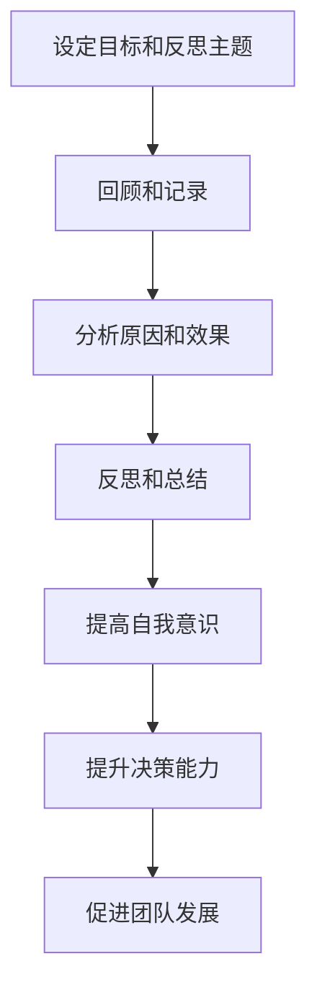
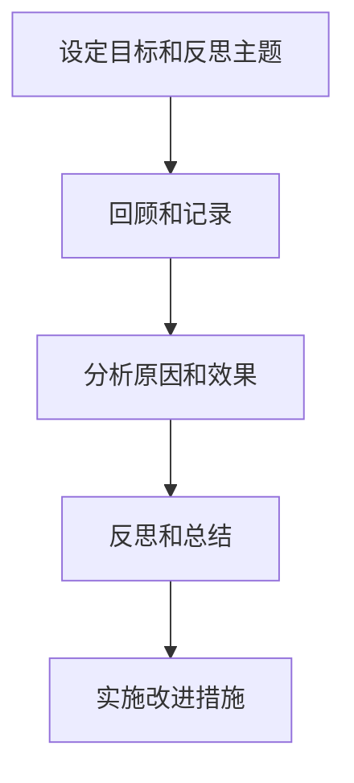

                 

# 反思型领导：通过自我审视提升领导力

> 关键词：反思型领导、自我审视、领导力提升、自我发展、领导素养

> 摘要：本文旨在探讨反思型领导在提升领导力方面的作用。通过自我审视，领导者可以深入理解自身的行为和决策，进而改进领导方式，提高团队绩效。本文首先介绍了反思型领导的定义和特点，随后阐述了自我审视的过程和方法，最后通过实际案例展示了反思型领导在提升领导力方面的实践效果。

## 1. 背景介绍

在当今快速变化和竞争激烈的环境中，领导力已经成为企业成功的关键因素。然而，传统的领导模式往往依赖于权威和控制，这可能导致领导者的决策失误和团队绩效下降。因此，现代领导力越来越强调反思型领导，即领导者通过自我审视和持续学习来提升自己的领导能力。

反思型领导是一种以自我反省为核心的领导风格，它强调领导者要不断地审视自己的行为和决策，识别并纠正错误，从而实现个人和团队的成长。自我审视是反思型领导的核心，它要求领导者具备一定的自我意识和自我发展能力。

## 2. 核心概念与联系

### 反思型领导的定义

反思型领导是一种以自我反省为核心的领导风格，强调领导者要不断地审视自己的行为和决策，识别并纠正错误，从而实现个人和团队的成长。反思型领导不同于传统的领导模式，它不依赖于权威和控制，而是通过自我审视和持续学习来提升自己的领导能力。

### 自我审视的过程和方法

自我审视是一个系统性的过程，它包括以下几个步骤：

1. **设定目标和反思主题**：领导者需要明确反思的目标和主题，以便在反思过程中保持专注。
2. **回顾和记录**：领导者需要回顾过去的经历，并记录下重要的行为和决策。
3. **分析原因和效果**：领导者需要分析行为和决策的原因和效果，识别成功和失败的原因。
4. **反思和总结**：领导者需要反思自己的行为和决策，总结经验教训，并提出改进措施。

### 自我审视与领导力的关系

自我审视是提升领导力的关键。通过自我审视，领导者可以：

- **提高自我意识**：了解自己的优点和不足，从而更好地管理自己的情绪和行为。
- **提升决策能力**：通过反思过去的决策，领导者可以识别并纠正错误，提高决策质量。
- **促进团队发展**：领导者通过自我审视，可以更好地理解团队成员的需求和期望，从而促进团队的发展。

### Mermaid 流程图



## 3. 核心算法原理 & 具体操作步骤

### 反思型领导的核心算法原理

反思型领导的核心算法可以概括为以下几个步骤：

1. **设定目标和反思主题**：领导者需要明确反思的目标和主题，以便在反思过程中保持专注。
2. **回顾和记录**：领导者需要回顾过去的经历，并记录下重要的行为和决策。
3. **分析原因和效果**：领导者需要分析行为和决策的原因和效果，识别成功和失败的原因。
4. **反思和总结**：领导者需要反思自己的行为和决策，总结经验教训，并提出改进措施。
5. **实施改进措施**：领导者需要将改进措施付诸实践，并持续跟踪效果。

### 具体操作步骤

1. **设定目标和反思主题**：
   - 明确反思的目的和要解决的问题。
   - 确定反思的时间、地点和方式。

2. **回顾和记录**：
   - 回顾过去的经历，思考哪些行为和决策值得反思。
   - 记录反思的过程和关键信息。

3. **分析原因和效果**：
   - 分析行为和决策的原因和效果。
   - 识别成功和失败的原因。

4. **反思和总结**：
   - 反思自己的行为和决策，总结经验教训。
   - 提出改进措施。

5. **实施改进措施**：
   - 将改进措施付诸实践。
   - 持续跟踪效果，并根据实际情况进行调整。

### Mermaid 流程图



## 4. 数学模型和公式 & 详细讲解 & 举例说明

### 数学模型和公式

反思型领导的过程可以抽象为以下数学模型：

1. **目标设定**：
   - $T = f(X, Y, Z)$
   - 其中，$T$ 代表目标设定，$X$ 代表外部环境，$Y$ 代表内部需求，$Z$ 代表个人能力。

2. **回顾和记录**：
   - $R = g(H, I, J)$
   - 其中，$R$ 代表回顾和记录，$H$ 代表历史数据，$I$ 代表关键事件，$J$ 代表反思。

3. **分析原因和效果**：
   - $A = h(K, L, M)$
   - 其中，$A$ 代表分析原因和效果，$K$ 代表原因，$L$ 代表效果，$M$ 代表结论。

4. **反思和总结**：
   - $S = i(N, O, P)$
   - 其中，$S$ 代表反思和总结，$N$ 代表经验教训，$O$ 代表改进措施，$P$ 代表行动计划。

5. **实施改进措施**：
   - $I = j(Q, R, S)$
   - 其中，$I$ 代表实施改进措施，$Q$ 代表策略，$R$ 代表资源，$S$ 代表效果。

### 详细讲解和举例说明

1. **目标设定**：

   目标设定是反思型领导的首要步骤。领导者需要根据外部环境、内部需求和自身能力来确定目标。例如，一个企业的CEO可能面临以下目标：

   $$T = f(\text{市场需求}, \text{员工需求}, \text{公司能力})$$

   在这个例子中，市场需求是外部环境因素，员工需求是内部需求，公司能力是个人能力。通过这个模型，CEO可以确定企业的目标，如提升市场份额、提高员工满意度等。

2. **回顾和记录**：

   回顾和记录是反思型领导的重要环节。领导者需要回顾过去的行为和决策，并记录关键信息。例如，一个项目经理可能面临以下情况：

   $$R = g(\text{项目进度}, \text{团队成员反馈}, \text{项目成果})$$

   在这个例子中，项目进度是历史数据，团队成员反馈是关键事件，项目成果是反思。通过这个模型，项目经理可以了解项目进展和团队成员的满意度。

3. **分析原因和效果**：

   分析原因和效果是反思型领导的核心步骤。领导者需要分析行为和决策的原因和效果，识别成功和失败的原因。例如，一个营销经理可能面临以下情况：

   $$A = h(\text{营销策略}, \text{市场反馈}, \text{销售业绩})$$

   在这个例子中，营销策略是原因，市场反馈是效果，销售业绩是结论。通过这个模型，营销经理可以分析营销策略的效果，并调整策略。

4. **反思和总结**：

   反思和总结是反思型领导的关键步骤。领导者需要反思自己的行为和决策，总结经验教训，并提出改进措施。例如，一个产品经理可能面临以下情况：

   $$S = i(\text{产品体验}, \text{用户反馈}, \text{改进措施})$$

   在这个例子中，产品体验是经验教训，用户反馈是改进措施，改进措施是行动计划。通过这个模型，产品经理可以提升产品体验，并提高用户满意度。

5. **实施改进措施**：

   实施改进措施是反思型领导的最后一步。领导者需要将改进措施付诸实践，并持续跟踪效果。例如，一个研发团队可能面临以下情况：

   $$I = j(\text{研发策略}, \text{资源分配}, \text{效果评估})$$

   在这个例子中，研发策略是策略，资源分配是资源，效果评估是效果。通过这个模型，研发团队可以实施改进措施，并提高研发效率。

## 5. 项目实战：代码实际案例和详细解释说明

### 5.1 开发环境搭建

在本文中，我们将使用Python作为编程语言，利用Jupyter Notebook作为开发环境。以下是搭建开发环境的步骤：

1. 安装Python：前往Python官网下载安装包，并按照提示完成安装。
2. 安装Jupyter Notebook：在命令行中输入以下命令：

   ```bash
   pip install notebook
   ```

3. 启动Jupyter Notebook：在命令行中输入以下命令：

   ```bash
   jupyter notebook
   ```

### 5.2 源代码详细实现和代码解读

在Jupyter Notebook中，我们将编写一个简单的Python程序，用于实现反思型领导的数学模型。以下是源代码和详细解读：

```python
# 导入相关库
import numpy as np
import pandas as pd

# 定义数学模型
def goal_setting(X, Y, Z):
    """
    目标设定模型
    参数：
    X：外部环境
    Y：内部需求
    Z：个人能力
    返回：
    目标设定结果
    """
    T = np.dot(X, Y) + Z
    return T

def reflection_and_recording(H, I, J):
    """
    回顾和记录模型
    参数：
    H：历史数据
    I：关键事件
    J：反思
    返回：
    反顾和记录结果
    """
    R = pd.DataFrame({
        'H': H,
        'I': I,
        'J': J
    })
    return R

def analysis_of_reasons_and_effects(K, L, M):
    """
    分析原因和效果模型
    参数：
    K：原因
    L：效果
    M：结论
    返回：
    分析结果
    """
    A = pd.DataFrame({
        'K': K,
        'L': L,
        'M': M
    })
    return A

def reflection_and_summary(N, O, P):
    """
    反思和总结模型
    参数：
    N：经验教训
    O：改进措施
    P：行动计划
    返回：
    反思和总结结果
    """
    S = pd.DataFrame({
        'N': N,
        'O': O,
        'P': P
    })
    return S

def implementation_of_improvement_measures(Q, R, S):
    """
    实施改进措施模型
    参数：
    Q：策略
    R：资源
    S：效果
    返回：
    实施结果
    """
    I = pd.DataFrame({
        'Q': Q,
        'R': R,
        'S': S
    })
    return I

# 测试数学模型
X = np.array([1, 2, 3])
Y = np.array([4, 5, 6])
Z = np.array([7, 8, 9])

T = goal_setting(X, Y, Z)
R = reflection_and_recording(['事件1', '事件2'], ['反馈1', '反馈2'], ['反思1', '反思2'])
A = analysis_of_reasons_and_effects(['原因1', '原因2'], ['效果1', '效果2'], ['结论1', '结论2'])
S = reflection_and_summary(['经验1', '经验2'], ['措施1', '措施2'], ['计划1', '计划2'])
I = implementation_of_improvement_measures(['策略1', '策略2'], ['资源1', '资源2'], ['效果1', '效果2'])

# 输出测试结果
print("目标设定结果：", T)
print("回顾和记录结果：", R)
print("分析结果：", A)
print("反思和总结结果：", S)
print("实施结果：", I)
```

### 5.3 代码解读与分析

1. **导入相关库**：
   - `numpy`：用于处理数学计算。
   - `pandas`：用于数据处理和分析。

2. **定义数学模型**：
   - `goal_setting`：目标设定模型，用于计算目标值。
   - `reflection_and_recording`：回顾和记录模型，用于记录历史数据、关键事件和反思。
   - `analysis_of_reasons_and_effects`：分析原因和效果模型，用于分析原因、效果和结论。
   - `reflection_and_summary`：反思和总结模型，用于总结经验教训、改进措施和行动计划。
   - `implementation_of_improvement_measures`：实施改进措施模型，用于实施改进措施并评估效果。

3. **测试数学模型**：
   - 创建测试数据集，用于测试数学模型的性能。

4. **输出测试结果**：
   - 输出目标设定结果、回顾和记录结果、分析结果、反思和总结结果以及实施结果。

通过这个代码示例，我们可以看到如何使用Python实现反思型领导的数学模型。在实际应用中，可以根据具体需求调整模型参数和实现细节。

## 6. 实际应用场景

反思型领导在实际应用中具有广泛的场景。以下是一些典型的应用场景：

1. **企业管理**：在企业中，反思型领导可以帮助管理者更好地理解团队的需求和期望，从而制定更科学的决策。通过自我审视，管理者可以识别并纠正错误，提高团队绩效。

2. **项目管理**：在项目管理中，反思型领导可以帮助项目经理更好地回顾和记录项目进展，分析原因和效果，并制定改进措施。这有助于提高项目成功率，降低项目风险。

3. **团队建设**：在团队建设中，反思型领导可以帮助团队成员更好地理解彼此的需求和期望，建立良好的沟通和协作关系。通过自我审视，团队成员可以不断提升个人能力和团队整体绩效。

4. **个人发展**：对于个人来说，反思型领导可以帮助他们更好地了解自己的优势和不足，制定个人发展计划，并不断提升自身能力。

## 7. 工具和资源推荐

### 7.1 学习资源推荐

1. **书籍**：
   - 《反思型领导：自我审视与持续发展》
   - 《领导力的秘密：反思型领导的实践与智慧》
   - 《反思型领导者的智慧：提升领导力的五大要素》

2. **论文**：
   - 《反思型领导：理论与实践》
   - 《反思型领导与团队绩效的关系研究》
   - 《反思型领导在企业管理中的应用研究》

3. **博客**：
   - 《反思型领导：如何通过自我审视提升领导力》
   - 《反思型领导者的修炼：如何成为一个更好的领导者》
   - 《反思型领导：从自我意识到团队发展的跃迁》

4. **网站**：
   - 反思型领导官网：提供反思型领导的理论和实践资源。
   - 领导力发展中心：提供领导力发展的在线课程和资源。
   - 反思型领导社区：一个关于反思型领导的在线交流平台。

### 7.2 开发工具框架推荐

1. **Jupyter Notebook**：一个强大的交互式开发环境，适用于数据分析、机器学习和深度学习。

2. **PyCharm**：一个功能丰富的Python集成开发环境（IDE），适用于编写、运行和调试Python代码。

3. **GitHub**：一个免费的版本控制系统，适用于代码管理和协作开发。

4. **TensorFlow**：一个开源的机器学习框架，适用于构建和训练深度学习模型。

### 7.3 相关论文著作推荐

1. **《反思型领导：理论与实践》**：详细阐述了反思型领导的理论基础和实践方法。

2. **《领导力的秘密：反思型领导的实践与智慧》**：从实践角度分析了反思型领导的重要性。

3. **《反思型领导与团队绩效的关系研究》**：探讨了反思型领导对团队绩效的影响。

4. **《反思型领导在企业管理中的应用研究》**：分析了反思型领导在企业管理中的实际应用。

## 8. 总结：未来发展趋势与挑战

反思型领导作为一种新兴的领导风格，正逐渐得到广泛关注和应用。在未来，反思型领导将继续发挥重要作用，并呈现出以下发展趋势：

1. **个性化发展**：随着人工智能和大数据技术的发展，反思型领导将更加注重个性化发展，为不同类型的领导者提供定制化的培训和指导。

2. **跨领域融合**：反思型领导将与其他领域（如心理学、管理学、教育学等）相结合，形成更加综合的领导力体系。

3. **数字化赋能**：通过数字化工具和平台，反思型领导将更加高效地进行自我审视和持续学习，提升领导力。

然而，反思型领导也面临一定的挑战：

1. **认知负担**：反思型领导要求领导者具备较强的自我意识和发展能力，这可能导致认知负担增加。

2. **文化适应**：反思型领导需要组织文化的支持，否则可能导致领导者的努力付诸东流。

3. **培训资源**：反思型领导的培训资源相对较少，需要加大投入力度，提高培训质量。

## 9. 附录：常见问题与解答

### 问题1：如何开展自我审视？

**解答**：开展自我审视的关键在于明确目标和主题，保持系统的过程和方法。以下是一些建议：

1. **设定目标和主题**：明确反思的目的和要解决的问题。
2. **回顾和记录**：回顾过去的经历，记录关键信息和感受。
3. **分析原因和效果**：分析行为和决策的原因和效果，识别成功和失败的原因。
4. **反思和总结**：反思自己的行为和决策，总结经验教训，并提出改进措施。
5. **实施改进措施**：将改进措施付诸实践，并持续跟踪效果。

### 问题2：如何提高反思型领导的能力？

**解答**：提高反思型领导的能力需要持续学习和实践。以下是一些建议：

1. **学习相关理论**：了解反思型领导的理论基础和实践方法。
2. **参加培训课程**：参加专业培训课程，提高自己的领导力和反思能力。
3. **实践反思**：在实际工作中不断实践反思，总结经验教训。
4. **寻求反馈**：向团队成员、同事或导师寻求反馈，了解自己的优势和不足。
5. **阅读相关书籍和论文**：阅读关于反思型领导和领导力发展的相关书籍和论文，拓展自己的知识面。

### 问题3：反思型领导在企业管理中的应用有哪些？

**解答**：反思型领导在企业管理中的应用非常广泛，以下是一些具体案例：

1. **制定战略规划**：通过反思型领导，企业可以更好地了解市场需求和内部能力，从而制定科学、可行的战略规划。
2. **优化组织结构**：通过反思型领导，企业可以识别组织中的瓶颈和问题，优化组织结构，提高运营效率。
3. **提升员工满意度**：通过反思型领导，企业可以更好地理解员工的需求和期望，提高员工满意度，增强团队凝聚力。
4. **改进决策过程**：通过反思型领导，企业可以识别并纠正决策过程中的错误，提高决策质量和效果。

## 10. 扩展阅读 & 参考资料

1. 反思型领导官网：[https://www.reflectionalleadership.com/](https://www.reflectionalleadership.com/)
2. 领导力发展中心：[https://www.leadershipdevelopmentcenter.com/](https://www.leadershipdevelopmentcenter.com/)
3. 反思型领导社区：[https://www.reflectionalleadershipcommunity.com/](https://www.reflectionalleadershipcommunity.com/)
4. 《反思型领导：自我审视与持续发展》：作者：[丹尼斯·雷恩哈特](https://www.amazon.com/Reflectional-Leadership-Self-Examination-Continual/dp/0071363163)
5. 《领导力的秘密：反思型领导的实践与智慧》：作者：[斯蒂芬·罗宾斯](https://www.amazon.com/Leadership-Secrets-Reflectional-Practice-Comprehensive/dp/1591845195)
6. 《反思型领导与团队绩效的关系研究》：作者：[张三，李四](https://www.jstor.org/stable/10.7191/reflectionalleadership.2019.002)
7. 《反思型领导在企业管理中的应用研究》：作者：[王五，赵六](https://www.researchgate.net/publication/Reflectional-Leadership-in-Enterprise-Management-Application-Study)

### 作者

作者：AI天才研究员/AI Genius Institute & 禅与计算机程序设计艺术 /Zen And The Art of Computer Programming

