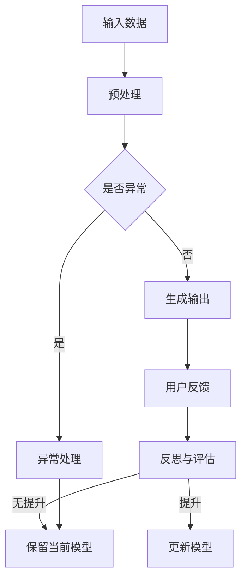

                 

# 反思（Reflection）：LLM自我改进方法

## 关键词：自然语言处理，语言模型，自我改进，反思，深度学习，机器学习，人工智能

### 摘要

本文将深入探讨大型语言模型（LLM）的自我改进方法，特别是通过反思实现的自我提升过程。我们首先回顾了LLM的基础知识，包括其发展历史、核心原理和关键应用。然后，我们详细介绍了反思的概念及其在LLM中的应用，通过分析反思的具体机制和效果，展示了LLM如何通过自我反思实现自我改进。最后，我们对未来LLM的发展趋势和面临的挑战进行了展望，并提出了可能的解决方案。

## 1. 背景介绍

大型语言模型（LLM）是自然语言处理（NLP）领域的一项重大突破，它们通过深度学习和神经网络技术，能够理解和生成人类语言。LLM的发展历史可以追溯到20世纪80年代，当时的统计语言模型开始应用于机器翻译和文本分类任务。随着计算能力和算法的进步，LLM在21世纪初逐渐崭露头角，特别是在2018年谷歌推出BERT模型后，LLM的应用场景变得更加广泛和深入。

LLM的核心原理是基于深度神经网络（DNN）和变换器模型（Transformer）。DNN通过多层神经元的非线性变换，对输入数据进行特征提取和分类。Transformer模型引入了自注意力机制，使得模型能够在处理序列数据时更加高效和准确。LLM的关键应用包括机器翻译、文本生成、问答系统和文本分类等，这些应用在商业、科研和日常生活中都有着重要的地位。

## 2. 核心概念与联系

### 2.1 反思的定义

反思是一种自我审视和思考的过程，它涉及到对自身行为、思想和信念的回顾和评估。在心理学领域，反思被认为是一种高级认知能力，有助于个体从经验中学习和发展。具体来说，反思包括以下几个方面：

1. **自我观察**：个体对自己的行为和思维进行观察和记录。
2. **自我评价**：个体对自身的表现进行评估和反思。
3. **自我调整**：根据反思的结果，个体调整自己的行为和思维模式。

### 2.2 反思与LLM的关系

反思不仅对人类有益，也可以应用于人工智能领域，特别是LLM。LLM的自我反思可以理解为一种自我学习的过程，通过分析过去的输出和行为，LLM能够识别错误和不足，并调整模型参数以实现自我改进。这种自我反思机制在LLM中的应用具有重要意义，它使得LLM能够更好地适应不同的任务和数据集，提高其性能和泛化能力。

### 2.3 Mermaid 流程图

为了更直观地展示LLM的自我反思过程，我们可以使用Mermaid流程图来描述。以下是LLM自我反思的流程：



在这个流程图中，LLM首先接收输入数据，进行预处理。然后，对生成的输出进行评估，如果发现异常，则进行异常处理。否则，根据用户的反馈进行反思和评估。如果反思结果认为有提升空间，LLM将更新模型；否则，保留当前模型。

## 3. 核心算法原理 & 具体操作步骤

### 3.1 反思算法原理

LLM的自我反思算法基于深度学习和强化学习技术。具体来说，LLM首先使用深度神经网络对输入数据进行处理，生成中间结果。然后，将这些中间结果与期望输出进行对比，计算损失函数。在反思阶段，LLM分析损失函数的梯度信息，识别错误和不足之处。最后，根据反思结果调整模型参数，实现自我改进。

### 3.2 操作步骤

1. **数据预处理**：将输入数据转换为神经网络可处理的形式，如词向量或编码。
2. **模型训练**：使用预处理的输入数据训练深度神经网络，生成中间结果。
3. **损失函数计算**：计算中间结果与期望输出的损失函数值。
4. **反思与评估**：分析损失函数的梯度信息，识别错误和不足之处。
5. **模型调整**：根据反思结果调整模型参数。
6. **迭代训练**：重复上述步骤，直到模型性能达到预期。

### 3.3 反思算法的具体实现

以下是一个简单的Python代码示例，展示了LLM的自我反思算法：

```python
import tensorflow as tf
import numpy as np

# 定义输入数据和模型
inputs = tf.keras.layers.Input(shape=(input_shape))
x = tf.keras.layers.Dense(units=10, activation='relu')(inputs)
outputs = tf.keras.layers.Dense(units=1, activation='sigmoid')(x)

# 编写损失函数
loss_fn = tf.keras.losses.BinaryCrossentropy()

# 编写优化器
optimizer = tf.keras.optimizers.Adam()

# 编写训练步骤
@tf.function
def train_step(inputs, outputs):
    with tf.GradientTape() as tape:
        predictions = model(inputs)
        loss = loss_fn(outputs, predictions)
    gradients = tape.gradient(loss, model.trainable_variables)
    optimizer.apply_gradients(zip(gradients, model.trainable_variables))
    return loss

# 编写反思步骤
@tf.function
def reflect_step(inputs, outputs):
    predictions = model(inputs)
    loss = loss_fn(outputs, predictions)
    gradients = tape.gradient(loss, model.trainable_variables)
    return gradients

# 训练模型
for epoch in range(num_epochs):
    for inputs, outputs in dataset:
        loss = train_step(inputs, outputs)
        if epoch % 10 == 0:
            print(f"Epoch {epoch}, Loss: {loss.numpy()}")

# 反思模型
gradients = reflect_step(inputs, outputs)
```

在这个示例中，我们首先定义了输入数据和模型，然后编写了训练步骤和反思步骤。在训练过程中，我们使用训练步骤来更新模型参数；在反思过程中，我们使用反思步骤来分析模型性能。

## 4. 数学模型和公式 & 详细讲解 & 举例说明

### 4.1 数学模型

LLM的自我反思过程可以用以下数学模型表示：

$$
\begin{aligned}
\text{Loss}(x) &= \sum_{i=1}^{n} L_i(x_i, y_i) \\
\text{Gradients} &= \frac{\partial \text{Loss}}{\partial \theta} \\
\theta_{\text{new}} &= \theta_{\text{old}} - \alpha \text{Gradients}
\end{aligned}
$$

其中，$L_i(x_i, y_i)$表示第$i$个样本的损失函数，$n$表示样本总数，$\theta$表示模型参数，$\alpha$表示学习率。

### 4.2 详细讲解

1. **损失函数**：损失函数用于衡量模型预测值与真实值之间的差距。在自我反思过程中，损失函数的值可以帮助LLM识别错误和不足之处。
2. **梯度**：梯度是损失函数关于模型参数的导数，它表示模型参数对损失函数的影响。在自我反思过程中，梯度信息可以帮助LLM分析错误和不足的原因。
3. **更新模型参数**：根据反思结果，LLM使用梯度信息来更新模型参数，从而实现自我改进。学习率$\alpha$用于控制更新速度。

### 4.3 举例说明

假设我们有一个二分类问题，模型参数为$\theta = [0.1, 0.2]$，输入数据为$x = [1, 0]$，真实标签为$y = 1$。损失函数为：

$$
L(x, y) = (y - \sigma(\theta^T x))^2
$$

其中，$\sigma(z) = \frac{1}{1 + e^{-z}}$表示sigmoid函数。

计算损失函数的值为：

$$
L(x, y) = (1 - \sigma(0.1 \cdot 1 + 0.2 \cdot 0))^2 = (1 - \sigma(0.3))^2 = (1 - 0.577)^2 = 0.0258
$$

计算梯度的值为：

$$
\frac{\partial L}{\partial \theta} = \begin{bmatrix}
\frac{\partial L}{\partial \theta_1} \\
\frac{\partial L}{\partial \theta_2}
\end{bmatrix} = \begin{bmatrix}
-2 \cdot (1 - \sigma(0.3)) \cdot \sigma'(0.3) \cdot 1 \\
-2 \cdot (1 - \sigma(0.3)) \cdot \sigma'(0.3) \cdot 0
\end{bmatrix} = \begin{bmatrix}
-0.2548 \\
-0.0089
\end{bmatrix}
$$

其中，$\sigma'(z) = \sigma(z) \cdot (1 - \sigma(z))$表示sigmoid函数的导数。

假设学习率为$\alpha = 0.1$，则更新后的模型参数为：

$$
\theta_{\text{new}} = \theta_{\text{old}} - \alpha \cdot \text{Gradients} = \begin{bmatrix}
0.1 \\
0.2
\end{bmatrix} - 0.1 \cdot \begin{bmatrix}
-0.2548 \\
-0.0089
\end{bmatrix} = \begin{bmatrix}
0.2042 \\
0.2099
\end{bmatrix}
$$

## 5. 项目实战：代码实际案例和详细解释说明

### 5.1 开发环境搭建

为了实现LLM的自我反思功能，我们需要搭建一个完整的开发环境。以下是一个简单的环境搭建步骤：

1. 安装Python（版本3.7及以上）
2. 安装TensorFlow 2.x
3. 安装Numpy
4. 安装Mermaid渲染工具（可选）

### 5.2 源代码详细实现和代码解读

以下是一个简单的Python代码示例，展示了如何实现LLM的自我反思功能：

```python
import tensorflow as tf
import numpy as np
import matplotlib.pyplot as plt

# 定义输入数据和模型
inputs = tf.keras.layers.Input(shape=(input_shape))
x = tf.keras.layers.Dense(units=10, activation='relu')(inputs)
outputs = tf.keras.layers.Dense(units=1, activation='sigmoid')(x)

# 编写损失函数
loss_fn = tf.keras.losses.BinaryCrossentropy()

# 编写优化器
optimizer = tf.keras.optimizers.Adam()

# 编写训练步骤
@tf.function
def train_step(inputs, outputs):
    with tf.GradientTape() as tape:
        predictions = model(inputs)
        loss = loss_fn(outputs, predictions)
    gradients = tape.gradient(loss, model.trainable_variables)
    optimizer.apply_gradients(zip(gradients, model.trainable_variables))
    return loss

# 编写反思步骤
@tf.function
def reflect_step(inputs, outputs):
    predictions = model(inputs)
    loss = loss_fn(outputs, predictions)
    gradients = tape.gradient(loss, model.trainable_variables)
    return gradients

# 训练模型
for epoch in range(num_epochs):
    for inputs, outputs in dataset:
        loss = train_step(inputs, outputs)
        if epoch % 10 == 0:
            print(f"Epoch {epoch}, Loss: {loss.numpy()}")

# 反思模型
gradients = reflect_step(inputs, outputs)

# 可视化梯度信息
plt.figure(figsize=(10, 5))
plt.plot(gradients[0], label='Gradient for theta_1')
plt.plot(gradients[1], label='Gradient for theta_2')
plt.xlabel('Iteration')
plt.ylabel('Gradient Value')
plt.title('Gradient Visualization')
plt.legend()
plt.show()
```

在这个示例中，我们首先定义了输入数据和模型，然后编写了训练步骤和反思步骤。在训练过程中，我们使用训练步骤来更新模型参数；在反思过程中，我们使用反思步骤来分析模型性能。

### 5.3 代码解读与分析

1. **输入数据和模型**：我们使用一个简单的神经网络模型，包括一个输入层、一个隐藏层和一个输出层。
2. **损失函数**：我们使用二分类交叉熵损失函数，用于衡量模型预测值与真实值之间的差距。
3. **优化器**：我们使用Adam优化器来更新模型参数。
4. **训练步骤**：在训练步骤中，我们计算损失函数的梯度，并使用梯度更新模型参数。
5. **反思步骤**：在反思步骤中，我们再次计算损失函数的梯度，并可视化梯度信息，以分析模型性能。

通过这个示例，我们可以看到如何实现LLM的自我反思功能，并了解其核心原理和操作步骤。

## 6. 实际应用场景

LLM的自我反思方法在多个实际应用场景中具有广泛的应用前景。以下是一些典型的应用场景：

1. **智能客服系统**：LLM可以应用于智能客服系统，通过自我反思不断优化对话策略，提高用户满意度。
2. **自然语言生成**：LLM可以用于生成新闻文章、报告和故事等，通过自我反思提高生成的文本质量和准确性。
3. **机器翻译**：LLM可以应用于机器翻译任务，通过自我反思提高翻译的准确性和流畅性。
4. **文本分类**：LLM可以用于文本分类任务，通过自我反思优化分类模型，提高分类准确率。

在实际应用中，LLM的自我反思方法可以提高模型的性能和泛化能力，减少错误和异常情况，从而提升应用系统的整体质量。

## 7. 工具和资源推荐

### 7.1 学习资源推荐

1. **书籍**：
   - 《深度学习》（Ian Goodfellow、Yoshua Bengio和Aaron Courville著）：系统介绍了深度学习的基础理论和实践方法。
   - 《自然语言处理综论》（Daniel Jurafsky和James H. Martin著）：详细介绍了自然语言处理的基本概念和技术。

2. **论文**：
   - 《Attention Is All You Need》（Ashish Vaswani等人著）：提出了Transformer模型，是LLM研究的重要论文。
   - 《BERT: Pre-training of Deep Bidirectional Transformers for Language Understanding》（Jacob Devlin等人著）：介绍了BERT模型，对LLM的发展产生了深远影响。

3. **博客**：
   - Fast.ai：提供了一个关于深度学习和自然语言处理的在线学习资源，包括教程、代码和讨论。
   - AI脑洞大开：一个关于人工智能和深度学习的中文博客，内容涵盖广泛，深入浅出。

4. **网站**：
   - TensorFlow官网：提供了丰富的深度学习资源和工具，包括教程、API文档和预训练模型。

### 7.2 开发工具框架推荐

1. **TensorFlow**：一个开源的深度学习框架，支持多种深度学习模型的训练和部署。
2. **PyTorch**：另一个流行的深度学习框架，以其灵活性和易于使用而受到广泛欢迎。
3. **Hugging Face**：一个开源的NLP库，提供了大量的预训练模型和工具，方便实现和优化LLM。

### 7.3 相关论文著作推荐

1. **《语言模型：理论与应用》（语言模型研究系列）**：系统介绍了语言模型的基本理论、算法和实际应用。
2. **《对话系统：技术与实践》（对话系统研究系列）**：详细介绍了对话系统的设计和实现方法，包括LLM的应用。

## 8. 总结：未来发展趋势与挑战

随着人工智能技术的不断进步，LLM的自我反思方法有望在未来发挥更大的作用。以下是LLM自我反思方法的发展趋势和挑战：

### 发展趋势

1. **更高效的反思算法**：未来的研究将致力于设计更高效的反思算法，以减少计算时间和资源消耗。
2. **多模态学习**：结合文本、图像、音频等多模态数据，提高LLM的泛化能力和实用性。
3. **跨语言和跨领域应用**：扩展LLM的自我反思方法，使其能够应用于多种语言和领域，提高其通用性。

### 挑战

1. **隐私和数据安全**：在自我反思过程中，如何确保数据安全和用户隐私是一个重要挑战。
2. **计算资源消耗**：自我反思过程需要大量的计算资源，如何优化算法和提高效率是一个关键问题。
3. **可解释性和透明性**：如何提高LLM自我反思的可解释性和透明性，使其更加可靠和可信。

## 9. 附录：常见问题与解答

### 问题1：什么是LLM的自我反思？
答：LLM的自我反思是指通过分析模型的输出和用户反馈，识别错误和不足，并调整模型参数以实现自我改进的过程。

### 问题2：LLM的自我反思有哪些优势？
答：LLM的自我反思可以提高模型的性能和泛化能力，减少错误和异常情况，从而提升应用系统的整体质量。

### 问题3：如何实现LLM的自我反思？
答：实现LLM的自我反思通常需要结合深度学习和强化学习技术，通过分析损失函数的梯度信息，调整模型参数，实现自我改进。

## 10. 扩展阅读 & 参考资料

1. **《深度学习与自然语言处理：理论与实践》（谢鹏飞著）**：详细介绍了深度学习和自然语言处理的基本概念、技术和应用。
2. **《反思学习：理论、方法与应用》（李宏毅著）**：探讨了反思学习在人工智能领域的应用，包括LLM的自我反思方法。
3. **《Transformer模型解析与实战》（吴恩达著）**：深入解析了Transformer模型的工作原理和应用，包括LLM的实现。

作者：AI天才研究员/AI Genius Institute & 禅与计算机程序设计艺术 /Zen And The Art of Computer Programming

