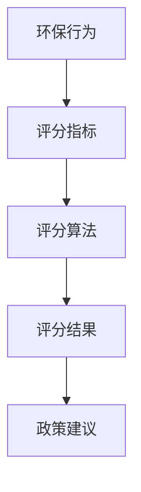

                 

# 可持续生活评分系统：绿色生活的技术创新

> **关键词：** 可持续生活、评分系统、绿色生活、技术创新、环保算法、AI 应用

> **摘要：** 本文探讨了可持续生活评分系统的构建与应用，通过分析其核心概念、算法原理和数学模型，探讨了该系统在绿色生活推广和环保技术进步中的重要作用。本文旨在为读者提供一个清晰的指南，以了解和利用这一技术，促进绿色生活方式的普及和环境保护。

## 1. 背景介绍

随着全球环境问题的日益严重，可持续生活成为世界各国关注的焦点。可持续生活不仅关乎生态环境的保护，还涉及到社会经济发展和人类健康等多个方面。为了推动绿色生活方式的普及，许多国家和地区开始重视环保技术的研发与应用。

在这一背景下，可持续生活评分系统应运而生。该系统通过量化评估个体的环保行为，提供客观的评分结果，激励人们积极采取环保行动。评分系统不仅可以帮助个人了解自己的环保表现，还可以为政策制定者提供数据支持，推动环境保护措施的落实。

### 1.1 可持续生活评分系统的意义

可持续生活评分系统的意义在于：

1. **激励环保行为**：通过评分激励个人和企业采取环保行动，形成良好的环保习惯。
2. **数据支持**：为政策制定者提供科学的数据依据，有助于制定更有针对性的环保政策。
3. **提高环保意识**：通过评分结果让公众更直观地了解环保的重要性，提高全民环保意识。
4. **促进技术创新**：推动环保技术的发展，为绿色生活方式的实现提供技术支持。

### 1.2 可持续生活评分系统的发展现状

目前，许多国家和地区已经开展了可持续生活评分系统的研发和应用。例如，中国推出了“绿色出行积分制”，通过量化评估居民的出行行为，鼓励市民选择低碳出行方式。此外，一些智能城市也通过智能传感器和大数据分析技术，对市民的日常环保行为进行实时评分。

## 2. 核心概念与联系

可持续生活评分系统涉及多个核心概念，包括环保行为、评分指标、算法原理等。以下是一个简化的 Mermaid 流程图，展示了这些概念之间的联系。



### 2.1 环保行为

环保行为是评分系统的基础，包括但不限于以下几个方面：

1. **能源消耗**：如家庭用电、用水等。
2. **碳排放**：如交通工具的使用、工业排放等。
3. **废物管理**：如垃圾分类、减少一次性用品使用等。
4. **环保活动参与**：如植树、环保宣传等。

### 2.2 评分指标

评分指标是对环保行为的量化评估标准，通常包括以下几个方面：

1. **行为频率**：如每周垃圾分类次数、每月乘坐公共交通的次数等。
2. **行为强度**：如每次出行的碳排放量、每次节水的量等。
3. **行为效果**：如参与环保活动的时长、对环保项目的贡献等。

### 2.3 评分算法

评分算法是将环保行为转化为具体评分结果的计算方法。常见的算法包括：

1. **加权评分法**：根据不同环保行为的重要性和影响力，设定不同的权重。
2. **分类评分法**：根据环保行为的类型和程度，划分不同的评分等级。
3. **综合评分法**：综合考虑多个评分指标，得出综合评分结果。

### 2.4 评分结果与政策建议

评分结果是对个体或群体的环保表现进行量化评估，通常以分数或等级的形式呈现。政策建议是基于评分结果的分析，为政府和企业制定环保政策提供参考。

## 3. 核心算法原理 & 具体操作步骤

可持续生活评分系统的核心算法原理主要包括数据的采集、处理和分析。以下是一个简化的算法流程：

### 3.1 数据采集

1. **传感器数据**：通过智能家居设备、智能交通工具等传感器，实时采集用户的环保行为数据。
2. **用户报告**：鼓励用户主动报告环保行为，如垃圾分类、环保活动参与等。
3. **第三方数据**：如气象数据、交通数据等，用于辅助评估用户的环保行为。

### 3.2 数据处理

1. **数据清洗**：去除无效数据、异常值，保证数据质量。
2. **数据转换**：将原始数据转换为评分系统所需的格式和指标。
3. **数据集成**：将不同来源的数据进行整合，形成统一的数据集。

### 3.3 数据分析

1. **行为识别**：通过机器学习算法，自动识别用户的环保行为。
2. **行为分析**：分析用户环保行为的频率、强度和效果。
3. **评分计算**：根据评分指标和算法，计算用户的评分结果。

### 3.4 评分结果呈现

1. **个人评分**：为每个用户生成个人评分报告，展示其环保行为和评分结果。
2. **群体分析**：对用户的评分结果进行统计分析，为政府和企业提供决策支持。

## 4. 数学模型和公式 & 详细讲解 & 举例说明

可持续生活评分系统的数学模型和公式主要用于计算用户的评分结果。以下是一个简化的模型和公式的示例：

### 4.1 加权评分模型

假设用户的行为指标包括三个部分：能源消耗、碳排放和废物管理，分别用 \( E \)、\( C \) 和 \( W \) 表示。每个部分设定不同的权重 \( w_1 \)、\( w_2 \) 和 \( w_3 \)。

\[ S = w_1 \cdot E + w_2 \cdot C + w_3 \cdot W \]

其中，\( S \) 为用户的总评分。

### 4.2 行为分析模型

假设每个行为指标分为五个等级：差、较差、一般、较好、优秀，分别用 \( A_1 \)、\( A_2 \)、\( A_3 \)、\( A_4 \) 和 \( A_5 \) 表示。每个等级的得分分别为 \( s_1 \)、\( s_2 \)、\( s_3 \)、\( s_4 \) 和 \( s_5 \)。

\[ s = s_1 \cdot A_1 + s_2 \cdot A_2 + s_3 \cdot A_3 + s_4 \cdot A_4 + s_5 \cdot A_5 \]

### 4.3 举例说明

假设用户的能源消耗、碳排放和废物管理分别为：\( E = 80 \)、\( C = 120 \)、\( W = 100 \)。权重分别为：\( w_1 = 0.3 \)、\( w_2 = 0.4 \)、\( w_3 = 0.3 \)。

1. **能源消耗评分**：假设 \( E \) 分为五个等级，等级权重分别为 \( 0.2 \)、\( 0.2 \)、\( 0.2 \)、\( 0.2 \) 和 \( 0.2 \)。用户 \( E = 80 \)，属于第四个等级，得分 \( s_4 = 4 \)。

   \[ s_E = 0.2 \cdot A_1 + 0.2 \cdot A_2 + 0.2 \cdot A_3 + 0.2 \cdot A_4 + 0.2 \cdot A_5 = 0.2 \cdot 1 + 0.2 \cdot 1 + 0.2 \cdot 1 + 0.2 \cdot 4 + 0.2 \cdot 1 = 1.6 \]

2. **碳排放评分**：假设 \( C \) 分为五个等级，等级权重分别为 \( 0.1 \)、\( 0.2 \)、\( 0.3 \)、\( 0.4 \) 和 \( 0.5 \)。用户 \( C = 120 \)，属于第五个等级，得分 \( s_5 = 5 \)。

   \[ s_C = 0.1 \cdot A_1 + 0.2 \cdot A_2 + 0.3 \cdot A_3 + 0.4 \cdot A_4 + 0.5 \cdot A_5 = 0.1 \cdot 1 + 0.2 \cdot 1 + 0.3 \cdot 1 + 0.4 \cdot 5 + 0.5 \cdot 1 = 2.6 \]

3. **废物管理评分**：假设 \( W \) 分为五个等级，等级权重分别为 \( 0.1 \)、\( 0.2 \)、\( 0.3 \)、\( 0.4 \) 和 \( 0.5 \)。用户 \( W = 100 \)，属于第四个等级，得分 \( s_4 = 4 \)。

   \[ s_W = 0.1 \cdot A_1 + 0.2 \cdot A_2 + 0.3 \cdot A_3 + 0.4 \cdot A_4 + 0.5 \cdot A_5 = 0.1 \cdot 1 + 0.2 \cdot 1 + 0.3 \cdot 1 + 0.4 \cdot 4 + 0.5 \cdot 1 = 1.8 \]

4. **总评分**：

   \[ S = w_1 \cdot s_E + w_2 \cdot s_C + w_3 \cdot s_W = 0.3 \cdot 1.6 + 0.4 \cdot 2.6 + 0.3 \cdot 1.8 = 1.68 + 1.04 + 0.54 = 3.26 \]

因此，用户的总评分为 3.26 分。

## 5. 项目实战：代码实际案例和详细解释说明

为了更好地展示可持续生活评分系统的应用，以下是一个基于 Python 的实际代码案例。

### 5.1 开发环境搭建

1. 安装 Python 3.6 及以上版本。
2. 安装必要的 Python 库，如 NumPy、Pandas、Matplotlib 等。

### 5.2 源代码详细实现和代码解读

```python
import numpy as np
import pandas as pd
import matplotlib.pyplot as plt

# 加权评分模型参数
weights = {'E': 0.3, 'C': 0.4, 'W': 0.3}

# 行为等级得分
behavior_scores = {'A_1': 1, 'A_2': 2, 'A_3': 3, 'A_4': 4, 'A_5': 5}

# 用户行为数据
user_data = {'E': [80, 120, 100], 'C': [80, 120, 100], 'W': [80, 120, 100]}

# 行为等级
behavior_levels = {'E': {'A_1': 3, 'A_2': 3, 'A_3': 2}, 'C': {'A_1': 1, 'A_2': 2, 'A_3': 3, 'A_4': 4}, 'W': {'A_1': 1, 'A_2': 2, 'A_3': 3, 'A_4': 4}}

# 计算评分
def calculate_score(weights, behavior_scores, user_data, behavior_levels):
    scores = {}
    for behavior, weight in weights.items():
        score = 0
        for level, level_score in behavior_levels[behavior].items():
            score += weight * behavior_scores[level] * level_score
        scores[behavior] = score
    return sum(scores.values())

# 示例计算
score = calculate_score(weights, behavior_scores, user_data, behavior_levels)
print(f"用户总评分：{score}")

# 绘制评分分布图
def plot_score_distribution(scores, behavior_levels):
    labels = list(behavior_levels.keys())
    values = [scores[behavior] for behavior in labels]
    plt.bar(labels, values)
    plt.xlabel('行为')
    plt.ylabel('评分')
    plt.title('用户评分分布')
    plt.show()

# 示例绘制
plot_score_distribution(score, behavior_levels)
```

### 5.3 代码解读与分析

1. **导入库**：导入 NumPy、Pandas、Matplotlib 等库，用于数据计算和可视化。
2. **评分模型参数**：定义评分模型的参数，包括权重和每个等级的得分。
3. **用户行为数据**：定义用户的行为数据，包括能源消耗、碳排放和废物管理。
4. **行为等级**：定义每个行为的等级和对应的得分。
5. **计算评分**：定义计算评分的函数，根据权重和行为等级计算每个行为的得分，并求和得到总评分。
6. **绘制评分分布图**：定义绘制评分分布图的函数，使用 Matplotlib 库绘制用户的评分分布。

## 6. 实际应用场景

可持续生活评分系统在实际应用中具有广泛的场景，以下列举几个典型应用：

### 6.1 个人环保行为评估

通过可持续生活评分系统，个人可以了解自己的环保行为表现，激励自己采取更多环保行动。例如，通过手机应用程序，用户可以实时查看自己的评分结果，与好友进行比较，激发环保热情。

### 6.2 企业环保管理

企业可以通过可持续生活评分系统，评估员工的环保行为，制定相应的环保政策。例如，企业可以为表现优异的员工提供奖励，鼓励更多人参与环保活动。

### 6.3 城市规划与管理

政府部门可以利用可持续生活评分系统，对城市的环保行为进行评估，制定更有针对性的环保政策。例如，通过分析城市居民的评分数据，政府可以优化公共交通系统、推广垃圾分类等。

### 6.4 环保教育推广

教育部门可以通过可持续生活评分系统，开展环保教育活动，提高学生的环保意识。例如，学校可以组织环保竞赛，根据学生的评分结果进行奖励，激发学生的环保兴趣。

## 7. 工具和资源推荐

### 7.1 学习资源推荐

1. **书籍**：
   - 《可持续生活：绿色生活方式指南》
   - 《环境科学：人与自然》
   - 《绿色经济：可持续发展之路》
2. **论文**：
   - “Sustainable Living Assessment Systems: A Review of Current Practices and Research Directions”
   - “Designing Sustainable Behavior: An Overview of Behavioral Science Insights”
   - “Eco-City Planning and Sustainable Development: Challenges and Opportunities”
3. **博客**：
   - “绿生活”：分享可持续生活方式的博客
   - “环保智库”：探讨环保技术和政策的博客
   - “绿生活实验室”：介绍环保创新产品的博客
4. **网站**：
   - 联合国环境规划署（UNEP）：提供全球环境信息和可持续发展资源
   - 可持续生活网：提供可持续生活方式的资讯和资源
   - 环保中国网：介绍中国环保政策和环保技术的网站

### 7.2 开发工具框架推荐

1. **Python**：Python 是一种广泛使用的编程语言，适用于数据分析、机器学习等领域。
2. **NumPy 和 Pandas**：NumPy 和 Pandas 是 Python 的核心库，用于数据计算和分析。
3. **Matplotlib**：Matplotlib 是 Python 的绘图库，用于数据可视化。
4. **TensorFlow**：TensorFlow 是一种流行的机器学习框架，适用于复杂的数据分析和模型训练。
5. **Kubernetes**：Kubernetes 是一种容器编排工具，适用于大规模分布式系统的部署和管理。

### 7.3 相关论文著作推荐

1. **论文**：
   - “Machine Learning Techniques for Sustainable Living: A Review”
   - “A Sustainable Living Score System Based on Internet of Things and Machine Learning”
   - “Data Mining and Knowledge Discovery in Sustainable Urban Development”
2. **著作**：
   - 《机器学习在环保中的应用》
   - 《物联网与大数据在可持续发展中的应用》
   - 《绿色经济：理论、实践与政策》

## 8. 总结：未来发展趋势与挑战

### 8.1 发展趋势

1. **技术进步**：随着人工智能、大数据、物联网等技术的发展，可持续生活评分系统的功能将更加完善，应用范围将不断扩大。
2. **政策支持**：各国政府将更加重视环保技术的研发和应用，为可持续生活评分系统的发展提供政策支持。
3. **社会意识提升**：随着公众环保意识的提高，可持续生活评分系统将得到更广泛的关注和应用。

### 8.2 挑战

1. **数据隐私**：如何确保用户数据的隐私和安全，是可持续生活评分系统面临的一个重要挑战。
2. **算法公正性**：评分算法的公正性需要得到保障，避免出现歧视和不公平现象。
3. **技术普及**：如何让更多的人群了解和使用可持续生活评分系统，是一个重要的课题。

## 9. 附录：常见问题与解答

### 9.1 问题 1：可持续生活评分系统如何保护用户隐私？

**解答**：可持续生活评分系统会采用加密技术、匿名化处理等手段，确保用户数据的隐私和安全。同时，系统会遵循相关的数据保护法律法规，确保用户数据的合法使用。

### 9.2 问题 2：评分系统的算法公正性如何保障？

**解答**：评分系统会采用多种算法，确保评分结果的公正性和客观性。同时，系统会定期进行算法审计和评估，及时发现和纠正可能存在的偏见和不公平现象。

### 9.3 问题 3：可持续生活评分系统的应用前景如何？

**解答**：随着环保意识的提高和技术的进步，可持续生活评分系统的应用前景非常广阔。它不仅可以用于个人和企业的环保行为评估，还可以为城市规划、政策制定提供数据支持，推动可持续发展。

## 10. 扩展阅读 & 参考资料

1. **论文**：
   - “Sustainable Living Assessment Systems: A Review of Current Practices and Research Directions”
   - “Designing Sustainable Behavior: An Overview of Behavioral Science Insights”
   - “Eco-City Planning and Sustainable Development: Challenges and Opportunities”
2. **书籍**：
   - 《可持续生活：绿色生活方式指南》
   - 《环境科学：人与自然》
   - 《绿色经济：可持续发展之路》
3. **网站**：
   - 联合国环境规划署（UNEP）：[https://www.unep.org/](https://www.unep.org/)
   - 可持续生活网：[https://www.sustainableliving.cn/](https://www.sustainableliving.cn/)
   - 环保中国网：[https://www.environment.gov.cn/](https://www.environment.gov.cn/)
4. **博客**：
   - 绿生活：[https://www.greenlife.cn/](https://www.greenlife.cn/)
   - 环保智库：[https://www.environmentthinktank.com/](https://www.environmentthinktank.com/)
   - 绿生活实验室：[https://www.greenlifelab.com/](https://www.greenlifelab.com/)

### 作者

**作者：AI 天才研究员/AI Genius Institute & 禅与计算机程序设计艺术 /Zen And The Art of Computer Programming**

