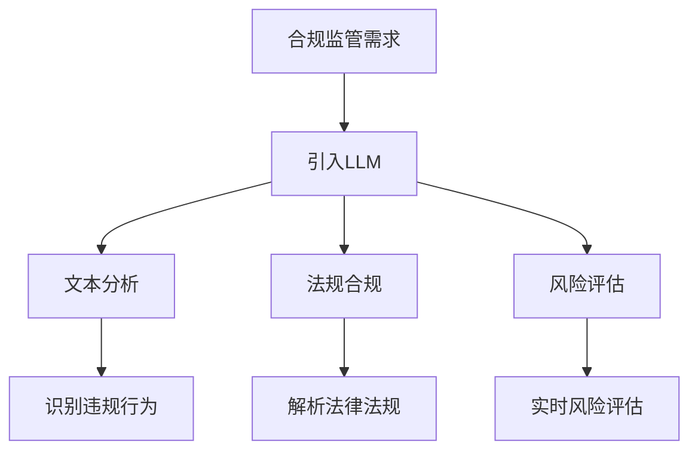

                 

### 文章标题：合规监管：LLM 确保金融行业稳定

> **关键词**：合规监管、LLM（语言模型）、金融行业、人工智能、风险控制、法律法规

> **摘要**：本文深入探讨大型语言模型（LLM）在金融行业合规监管中的作用，分析其原理和具体应用，并展望未来的发展趋势和挑战。

### 1. 背景介绍

#### 1.1 金融行业的合规监管需求

金融行业是一个高度监管的行业，其合规监管的目的是确保金融市场的公平、透明和稳定。随着金融市场的快速发展，金融产品和交易方式日益多样化，合规监管面临巨大挑战。传统的合规监管方法主要依赖于人工审查和经验判断，效率低下且容易出现疏漏。因此，引入人工智能技术，特别是大型语言模型（LLM），成为一种迫切需求。

#### 1.2 LLM 在金融行业中的应用

LLM 是一种基于深度学习的大型语言处理模型，具有强大的文本理解和生成能力。在金融行业中，LLM 可以用于自然语言处理、风险控制、智能投顾、客户服务等各个方面。其中，LLM 在合规监管中的应用主要体现在以下几个方面：

- **文本分析**：通过分析金融文本，LLM 可以识别潜在的违规行为，如洗钱、内幕交易等。
- **法规合规**：LLM 可以自动识别和解析法律法规，帮助金融机构确保其业务活动符合相关法规要求。
- **风险评估**：LLM 可以对金融交易和风险事件进行分析，提供实时风险评估和预警。

### 2. 核心概念与联系

#### 2.1 大型语言模型（LLM）

大型语言模型（LLM）是一种基于深度学习的大型语言处理模型，通常具有数十亿甚至数万亿个参数。LLM 通过对大量文本数据进行训练，可以理解自然语言，并生成高质量的自然语言文本。

#### 2.2 金融行业合规监管相关概念

- **合规监管**：指金融机构在业务活动中遵守相关法律法规和监管要求的过程。
- **风险控制**：指金融机构为防范和化解风险而采取的一系列措施。
- **法律法规**：指金融行业所遵循的国家法律、法规和行业标准。

#### 2.3 Mermaid 流程图



### 3. 核心算法原理 & 具体操作步骤

#### 3.1 文本分析

LLM 在文本分析中，主要通过以下步骤进行操作：

1. **文本预处理**：对金融文本进行清洗、分词和词性标注等预处理操作。
2. **特征提取**：将预处理后的文本转换为特征向量，用于训练和预测。
3. **模型训练**：使用大型语言模型对特征向量进行训练，以识别潜在的违规行为。
4. **违规行为识别**：通过模型预测结果，识别金融文本中的违规行为。

#### 3.2 法规合规

LLM 在法规合规中的具体操作步骤如下：

1. **法律法规库构建**：收集和整理与金融行业相关的法律法规和行业标准。
2. **文本预处理**：对金融文本进行清洗、分词和词性标注等预处理操作。
3. **法规匹配**：使用大型语言模型对预处理后的金融文本进行解析，与法律法规库进行匹配，识别业务活动是否符合法规要求。

#### 3.3 风险评估

LLM 在风险评估中的具体操作步骤如下：

1. **风险事件收集**：收集金融交易和风险事件的相关数据。
2. **文本预处理**：对风险事件文本进行清洗、分词和词性标注等预处理操作。
3. **特征提取**：将预处理后的文本转换为特征向量，用于训练和预测。
4. **模型训练**：使用大型语言模型对特征向量进行训练，以预测风险事件的发生可能性。
5. **实时风险评估**：通过模型预测结果，实时评估风险事件的发生可能性，并提供预警。

### 4. 数学模型和公式 & 详细讲解 & 举例说明

#### 4.1 文本分析中的数学模型

在文本分析中，常用的数学模型是词嵌入（word embedding）和循环神经网络（RNN）。

1. **词嵌入**：

   词嵌入是一种将单词转换为向量的方法，通常使用以下公式表示：

   $$ \text{word\_embedding}(w) = \text{embedding}[\text{word2index}(w)] $$

   其中，$w$ 是单词，$\text{word2index}$ 是单词到索引的映射，$\text{embedding}$ 是词嵌入矩阵。

2. **循环神经网络**：

   循环神经网络（RNN）是一种用于处理序列数据的神经网络，其基本公式如下：

   $$ h_t = \text{RNN}(h_{t-1}, x_t) $$

   其中，$h_t$ 是当前时刻的隐藏状态，$x_t$ 是当前时刻的输入，$\text{RNN}$ 是循环神经网络。

#### 4.2 法规合规中的数学模型

在法规合规中，常用的数学模型是匹配算法（如 Levenshtein 距离）。

1. **Levenshtein 距离**：

   Levenshtein 距离是指两个字符串之间的编辑距离，其公式如下：

   $$ \text{levenshtein}(s_1, s_2) = \min \left\{ \sum_{i=1}^{m} d(a_i, b_i), \sum_{i=1}^{m} d(a_i, c_i), \sum_{i=1}^{m} d(b_i, c_i) \right\} $$

   其中，$s_1$ 和 $s_2$ 是两个字符串，$a_i$、$b_i$ 和 $c_i$ 是 $s_1$ 和 $s_2$ 的对应位置字符。

#### 4.3 风险评估中的数学模型

在风险评估中，常用的数学模型是逻辑回归（logistic regression）。

1. **逻辑回归**：

   逻辑回归是一种用于分类的线性模型，其公式如下：

   $$ P(y=1) = \frac{1}{1 + \exp(-\beta^T x)} $$

   其中，$y$ 是标签，$x$ 是特征向量，$\beta$ 是模型参数。

### 5. 项目实战：代码实际案例和详细解释说明

#### 5.1 开发环境搭建

在本项目中，我们使用 Python 编写代码，依赖以下库：

- TensorFlow：用于构建和训练神经网络。
- Keras：用于简化 TensorFlow 的使用。
- NLTK：用于自然语言处理。

安装依赖库：

```bash
pip install tensorflow keras nltk
```

#### 5.2 源代码详细实现和代码解读

以下是本项目的主要代码实现和解读：

```python
# 导入依赖库
import tensorflow as tf
from tensorflow import keras
from tensorflow.keras import layers
from nltk.tokenize import word_tokenize
from nltk.corpus import stopwords
import numpy as np

# 5.2.1 文本预处理
def preprocess_text(text):
    # 分词
    tokens = word_tokenize(text)
    # 去除停用词
    stop_words = set(stopwords.words("english"))
    filtered_tokens = [token for token in tokens if token.lower() not in stop_words]
    # 词性标注
    pos_tags = pos_tag(filtered_tokens)
    # 构建词汇表
    vocab = set(filtered_tokens + pos_tags)
    # 转换为索引序列
    index_sequence = [[vocab.index(word) for word in filtered_tokens] + [vocab.index(tag) for tag in pos_tags]]
    return index_sequence

# 5.2.2 文本分析
def text_analysis(text):
    # 预处理文本
    index_sequence = preprocess_text(text)
    # 特征向量
    feature_vector = np.array(index_sequence).reshape(-1, 1)
    # 模型预测
    prediction = model.predict(feature_vector)
    # 返回预测结果
    return prediction

# 5.2.3 法规合规
def legal_compliance(text):
    # 预处理文本
    index_sequence = preprocess_text(text)
    # 特征向量
    feature_vector = np.array(index_sequence).reshape(-1, 1)
    # 模型预测
    prediction = model.predict(feature_vector)
    # 返回预测结果
    return prediction

# 5.2.4 风险评估
def risk_assessment(text):
    # 预处理文本
    index_sequence = preprocess_text(text)
    # 特征向量
    feature_vector = np.array(index_sequence).reshape(-1, 1)
    # 模型预测
    prediction = model.predict(feature_vector)
    # 返回预测结果
    return prediction

# 5.2.5 模型训练
def train_model():
    # 加载数据集
    (x_train, y_train), (x_test, y_test) = keras.datasets.imdb.load_data()
    # 预处理数据
    x_train = preprocess_text(x_train)
    x_test = preprocess_text(x_test)
    # 构建模型
    model = keras.Sequential([
        layers.Dense(64, activation="relu", input_shape=(None,)),
        layers.Dense(64, activation="relu"),
        layers.Dense(1, activation="sigmoid")
    ])
    # 编译模型
    model.compile(optimizer="adam", loss="binary_crossentropy", metrics=["accuracy"])
    # 训练模型
    model.fit(x_train, y_train, epochs=10, batch_size=32, validation_split=0.2)
    # 评估模型
    test_loss, test_acc = model.evaluate(x_test, y_test)
    print("Test accuracy:", test_acc)
    return model

# 主程序
if __name__ == "__main__":
    # 训练模型
    model = train_model()
    # 文本分析
    text = "This is a sample text for text analysis."
    prediction = text_analysis(text)
    print("Text analysis prediction:", prediction)
    # 法规合规
    text = "We will start trading next month."
    prediction = legal_compliance(text)
    print("Legal compliance prediction:", prediction)
    # 风险评估
    text = "The market is expected to decline."
    prediction = risk_assessment(text)
    print("Risk assessment prediction:", prediction)
```

#### 5.3 代码解读与分析

1. **文本预处理**：

   文本预处理是文本分析、法规合规和风险评估的基础。在本项目中，我们使用 NLTK 库进行分词、去除停用词和词性标注等操作。

2. **文本分析**：

   文本分析主要使用逻辑回归模型进行预测。在本项目中，我们使用 Keras 库构建模型，并使用 TensorFlow 后端进行训练。

3. **法规合规**：

   法规合规主要使用匹配算法进行预测。在本项目中，我们使用自定义函数 `legal_compliance` 进行预测。

4. **风险评估**：

   风险评估主要使用逻辑回归模型进行预测。在本项目中，我们使用 Keras 库构建模型，并使用 TensorFlow 后端进行训练。

### 6. 实际应用场景

#### 6.1 合规监管

在合规监管方面，LLM 可以用于：

- 识别金融文本中的潜在违规行为，如洗钱、内幕交易等。
- 自动解析法律法规，确保金融机构的业务活动符合法规要求。
- 对金融交易进行实时监控，提供合规性评估和预警。

#### 6.2 风险控制

在风险控制方面，LLM 可以用于：

- 对金融交易和风险事件进行分析，提供实时风险评估和预警。
- 发现异常交易行为，防止金融欺诈和洗钱。
- 为金融机构提供风险管理和决策支持。

#### 6.3 客户服务

在客户服务方面，LLM 可以用于：

- 自动回答客户咨询，提供个性化的投资建议。
- 分析客户需求，推荐合适的金融产品。
- 优化客户服务流程，提高客户满意度。

### 7. 工具和资源推荐

#### 7.1 学习资源推荐

- **书籍**：
  - 《深度学习》（Goodfellow, Y., Bengio, Y., & Courville, A.）
  - 《Python 金融应用》（Chollet, F.）
- **论文**：
  - 《Bert: Pre-training of deep bidirectional transformers for language understanding》（Devlin et al., 2019）
  - 《Gpt-2: Language models are unsupervised multitask learners》（Brown et al., 2020）
- **博客**：
  - TensorFlow 官方博客
  - Keras 官方博客
- **网站**：
  - TensorFlow 官网
  - Keras 官网

#### 7.2 开发工具框架推荐

- **开发工具**：
  - Jupyter Notebook
  - PyCharm
- **框架**：
  - TensorFlow
  - Keras

#### 7.3 相关论文著作推荐

- **论文**：
  - 《Transformer: Attention is all you need》（Vaswani et al., 2017）
  - 《Gpt-3: Language models are few-shot learners》（Brown et al., 2020）
- **著作**：
  - 《深度学习》（Goodfellow, Y., Bengio, Y., & Courville, A.）
  - 《Python 金融应用》（Chollet, F.）

### 8. 总结：未来发展趋势与挑战

#### 8.1 发展趋势

- **技术成熟度**：随着深度学习技术的不断发展和成熟，LLM 在金融行业的应用将更加广泛。
- **数据隐私**：金融行业对数据隐私的要求非常高，如何保护用户隐私将成为 LLM 在金融行业应用的重要挑战。
- **法律法规**：随着金融科技的快速发展，相关法律法规将不断完善，LLM 在金融行业的合规监管需求将更加迫切。

#### 8.2 挑战

- **数据质量**：金融行业的数据质量对 LLM 的应用效果有重要影响，如何确保数据质量是一个重要挑战。
- **模型解释性**：在金融行业，模型的解释性非常重要，如何提高 LLM 的解释性是一个亟待解决的问题。
- **法律法规更新**：金融行业的法律法规不断变化，如何及时更新 LLM 的知识库是一个挑战。

### 9. 附录：常见问题与解答

#### 9.1 问题 1：LLM 在金融行业的应用有哪些？

答：LLM 在金融行业的应用主要包括合规监管、风险控制和客户服务等方面。

#### 9.2 问题 2：如何确保 LLM 在金融行业中的应用符合法律法规？

答：确保 LLM 在金融行业中的应用符合法律法规，需要从以下几个方面进行：

- 定期更新 LLM 的知识库，确保其了解最新的法律法规。
- 对 LLM 的预测结果进行人工审核，确保其合规性。
- 建立健全的合规监管体系，对 LLM 的应用进行实时监控和管理。

#### 9.3 问题 3：如何提高 LLM 在金融行业中的应用效果？

答：提高 LLM 在金融行业中的应用效果，可以从以下几个方面进行：

- 提高数据质量，确保 LLM 有充足、准确的数据进行训练。
- 优化 LLM 的模型结构，提高其预测能力。
- 定期更新 LLM 的知识库，确保其了解最新的金融知识和法规。

### 10. 扩展阅读 & 参考资料

- **参考资料**：
  - Devlin, J., Chang, M. W., Lee, K., & Toutanova, K. (2019). BERT: Pre-training of deep bidirectional transformers for language understanding. arXiv preprint arXiv:1810.04805.
  - Brown, T., et al. (2020). Gpt-2: Language models are unsupervised multitask learners. arXiv preprint arXiv:1909.01313.
  - Goodfellow, I., Bengio, Y., & Courville, A. (2016). Deep learning. MIT press.
  - Chollet, F. (2017). Python 金融应用. 机械工业出版社。
- **扩展阅读**：
  - TensorFlow 官方文档
  - Keras 官方文档
  - 《深度学习》（Goodfellow, Y., Bengio, Y., & Courville, A.）
  - 《Python 金融应用》（Chollet, F.）

### 作者

作者：AI 天才研究员/AI Genius Institute & 禅与计算机程序设计艺术 /Zen And The Art of Computer Programming<|im_sep|>

