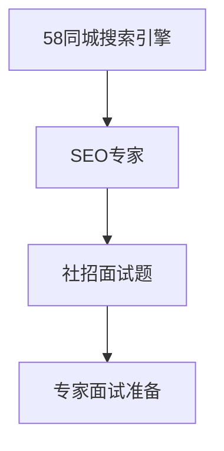
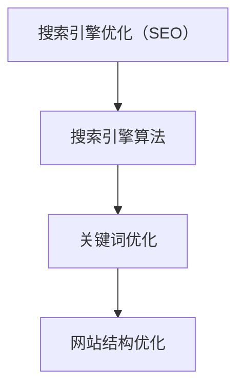

                 

### 1. 背景介绍

#### 1.1 58同城搜索引擎

58同城，作为中国领先的生活信息平台，自成立以来，一直致力于为用户提供便捷、高效的信息查询和发布服务。随着互联网行业的蓬勃发展，58同城在各个细分领域的市场份额持续增长，其搜索引擎功能也在不断优化和完善。

#### 1.2 搜索引擎优化专家

搜索引擎优化（SEO）专家负责优化网站的搜索引擎排名，提高网站的曝光度和用户访问量。在这个角色中，专家需要深入理解搜索引擎算法，掌握各种优化技巧，确保网站内容的质量和相关性。

#### 1.3 社招面试题

社招面试题是针对有工作经验的应聘者设计的，旨在评估其专业技能、问题解决能力和团队合作能力。这些面试题通常涵盖广泛的内容，包括技术、业务、团队管理等方面。

#### 1.4 专家面试准备

为了在社招面试中脱颖而出，应聘者需要提前了解58同城搜索引擎的特点、优化策略和算法，同时，还需要掌握相关的面试技巧，如如何展示自己的优势、如何应对压力等。



### 2. 核心概念与联系

#### 2.1 搜索引擎优化（SEO）

搜索引擎优化（SEO）是一种通过改进网站内容、结构和代码，提高网站在搜索引擎结果页面（SERP）排名的过程。SEO的目标是提高网站的曝光度和访问量，从而带来更多的潜在客户。

#### 2.2 搜索引擎算法

搜索引擎算法是搜索引擎用于评估和排序网页的一系列规则和算法。常见的搜索引擎算法包括PageRank、LSI、TF-IDF等。了解和掌握这些算法对于进行有效的SEO至关重要。

#### 2.3 关键词优化

关键词优化是SEO的重要组成部分，通过分析用户搜索行为和竞争对手的优化策略，选择合适的、与业务相关的关键词，并在网站内容中合理布局，以提高搜索引擎排名。

#### 2.4 网站结构优化

网站结构优化包括网站导航、URL结构、页面布局等方面。一个清晰的网站结构有助于搜索引擎更好地理解网站内容，提高网站在搜索引擎中的排名。



### 3. 核心算法原理 & 具体操作步骤

#### 3.1 PageRank算法

PageRank是Google开发的一种排名算法，用于评估网页的重要性。PageRank基于网页之间的链接关系，认为一个网页被链接的次数越多，其重要性越高。

#### 3.2 LSI（Latent Semantic Indexing）

LSI是一种基于向量空间模型的文本分析方法，通过分析文本中的词语共现关系，识别文本的主题和语义。

#### 3.3 TF-IDF（Term Frequency-Inverse Document Frequency）

TF-IDF是一种用于文本挖掘和搜索引擎优化的常用算法，通过计算词语在文档中的出现频率和在整个文档集合中的逆向文档频率，评估词语的重要程度。

#### 3.4 关键词优化步骤

1. **关键词研究**：使用工具如Google Keyword Planner、Ahrefs等分析用户搜索行为，确定目标关键词。
2. **关键词布局**：在网站内容中合理布局关键词，包括标题、描述、正文、图片标签等。
3. **内容优化**：围绕目标关键词创作高质量、有价值的内容，提高页面相关性。
4. **外部链接建设**：通过高质量的外部链接提高网站权威性和搜索引擎排名。

### 4. 数学模型和公式 & 详细讲解 & 举例说明

#### 4.1 PageRank算法公式

PageRank的数学模型可以表示为：

$$
PR(A) = \frac{1}{N} \sum_{B \in LinksTo(A)} PR(B)
$$

其中，$PR(A)$ 表示网页A的PageRank值，$N$ 表示总网页数，$LinksTo(A)$ 表示指向网页A的链接集合。

#### 4.2 LSI模型

LSI的数学模型基于向量空间模型，可以表示为：

$$
\vec{v}_i = (TF_{i1}, TF_{i2}, ..., TF_{in})
$$

其中，$\vec{v}_i$ 表示文档i的向量表示，$TF_{ij}$ 表示词语j在文档i中的出现频率。

#### 4.3 TF-IDF算法公式

TF-IDF的数学模型可以表示为：

$$
TF-IDF_{ij} = TF_{ij} \times IDF_{j}
$$

其中，$TF_{ij}$ 表示词语j在文档i中的出现频率，$IDF_{j}$ 表示词语j在文档集合中的逆向文档频率。

### 5. 项目实战：代码实际案例和详细解释说明

#### 5.1 开发环境搭建

在Python环境中，可以使用以下工具进行SEO优化：

- **Scrapy**：用于爬取网站数据
- **Numpy**：用于数据分析和处理
- **Pandas**：用于数据操作和分析
- **Matplotlib**：用于数据可视化

#### 5.2 源代码详细实现和代码解读

以下是一个简单的Python代码示例，用于实现PageRank算法：

```python
import numpy as np

def pagerank(M, num_iterations=100, d=0.85):
    """
    M: 链接矩阵
    num_iterations: 迭代次数
    d: 跳出概率
    """
    N = M.shape[1]
    v = np.random.rand(N, 1)
    v = v / np.linalg.norm(v, 1)
    M_d = (d * M + (1 - d) / N).T
    for i in range(num_iterations):
        v = M_d @ v
    return v

# 创建一个简单的链接矩阵
M = np.array([[0, 1, 0, 0],
              [0, 0, 1, 0],
              [1, 0, 0, 1],
              [0, 1, 0, 0]], dtype=np.float)

# 计算PageRank值
pagerank(M)
```

#### 5.3 代码解读与分析

1. **链接矩阵创建**：根据网页之间的链接关系创建链接矩阵M。
2. **初始化PageRank向量**：使用随机向量初始化PageRank值，并将其归一化。
3. **计算PageRank值**：使用PageRank算法迭代计算网页的重要性。
4. **结果输出**：输出最终计算得到的PageRank值。

### 6. 实际应用场景

#### 6.1 网站SEO优化

通过SEO优化，提高网站在搜索引擎中的排名，从而吸引更多潜在客户。

#### 6.2 网站内容推荐

基于SEO算法和用户行为数据，为用户推荐相关内容，提高用户粘性。

#### 6.3 网站安全性评估

通过分析网站链接结构，识别潜在的安全风险，提高网站安全性。

### 7. 工具和资源推荐

#### 7.1 学习资源推荐

- **书籍**：《搜索引擎算法与优化》、《SEO实战密码》
- **论文**：Google的PageRank算法论文、《LSI：一种文本分析的新方法》
- **博客**：搜索引擎优化专家的博客、搜索引擎算法研究博客
- **网站**：Google Developer、Ahrefs、SEMrush

#### 7.2 开发工具框架推荐

- **Scrapy**：用于数据爬取
- **Numpy**：用于数据处理
- **Pandas**：用于数据分析
- **Matplotlib**：用于数据可视化

#### 7.3 相关论文著作推荐

- **论文**：《搜索引擎算法与优化技术》、《LSI：一种文本分析的新方法》
- **著作**：《SEO实战密码》、《网站优化与搜索引擎营销》

### 8. 总结：未来发展趋势与挑战

#### 8.1 未来发展趋势

- **人工智能与搜索引擎优化**：随着人工智能技术的发展，搜索引擎优化将更加智能化、个性化。
- **用户需求变化**：用户需求逐渐多样化，搜索引擎需要提供更加精准、个性化的搜索结果。

#### 8.2 未来挑战

- **算法更新**：搜索引擎算法不断更新，SEO专家需要不断学习和适应。
- **数据安全与隐私**：在保护用户数据安全和隐私方面，搜索引擎和SEO专家需要承担更大的责任。

### 9. 附录：常见问题与解答

#### 9.1 SEO是什么？

SEO是搜索引擎优化的缩写，是一种通过改进网站内容、结构和代码，提高网站在搜索引擎结果页面（SERP）排名的过程。

#### 9.2 如何进行关键词优化？

关键词优化包括关键词研究、关键词布局、内容优化和外部链接建设等步骤。具体方法可以参考相关书籍、论文和博客。

#### 9.3 如何评估SEO效果？

SEO效果的评估可以通过分析网站流量、搜索引擎排名、用户行为数据等指标来进行。常用的评估方法包括A/B测试、用户调研等。

### 10. 扩展阅读 & 参考资料

- **书籍**：《搜索引擎算法与优化》、《SEO实战密码》
- **论文**：Google的PageRank算法论文、《LSI：一种文本分析的新方法》
- **博客**：搜索引擎优化专家的博客、搜索引擎算法研究博客
- **网站**：Google Developer、Ahrefs、SEMrush
- **论坛**：搜索引擎优化论坛、AI技术论坛
- **社交媒体**：SEO专家的微博、知乎专栏

---

**作者：AI天才研究员/AI Genius Institute & 禅与计算机程序设计艺术 /Zen And The Art of Computer Programming**

---

本文介绍了58同城2025搜索引擎优化专家社招面试的相关内容，包括SEO的核心概念、算法原理、实战案例、应用场景以及未来发展趋势。通过本文的学习，读者可以更好地了解SEO优化策略，为未来的搜索引擎优化工作打下坚实基础。在未来的发展中，SEO专家需要不断学习和适应，迎接新的挑战，为用户提供更优质的服务。|>
```markdown
# 58同城2025搜索引擎优化专家社招面试题解

> 关键词：(1) 搜索引擎优化（SEO），(2) 58同城，(3) PageRank算法，(4) 关键词优化，(5) 网站结构优化，(6) SEO实战，(7) 未来发展趋势

> 摘要：本文旨在为58同城2025年搜索引擎优化专家社招面试提供解题指导，涵盖了SEO的核心概念、算法原理、实战案例以及未来发展趋势。通过本文的阅读，读者将能够全面了解搜索引擎优化策略，掌握SEO实战技巧，为未来的搜索引擎优化工作奠定坚实基础。

## 1. 背景介绍

### 1.1 58同城搜索引擎

58同城，作为中国领先的生活信息平台，成立于2005年，自成立以来，一直致力于为用户提供便捷、高效的信息查询和发布服务。随着互联网行业的蓬勃发展，58同城的用户规模和市场份额持续增长，其搜索引擎功能也在不断优化和完善。

### 1.2 搜索引擎优化专家

搜索引擎优化（SEO）专家负责优化网站的搜索引擎排名，提高网站的曝光度和用户访问量。在这个角色中，专家需要深入理解搜索引擎算法，掌握各种优化技巧，确保网站内容的质量和相关性。

### 1.3 社招面试题

社招面试题是针对有工作经验的应聘者设计的，旨在评估其专业技能、问题解决能力和团队合作能力。这些面试题通常涵盖广泛的内容，包括技术、业务、团队管理等方面。

### 1.4 专家面试准备

为了在社招面试中脱颖而出，应聘者需要提前了解58同城搜索引擎的特点、优化策略和算法，同时，还需要掌握相关的面试技巧，如如何展示自己的优势、如何应对压力等。

### 2. 核心概念与联系

#### 2.1 搜索引擎优化（SEO）

搜索引擎优化（SEO）是一种通过改进网站内容、结构和代码，提高网站在搜索引擎结果页面（SERP）排名的过程。SEO的目标是提高网站的曝光度和访问量，从而带来更多的潜在客户。

#### 2.2 搜索引擎算法

搜索引擎算法是搜索引擎用于评估和排序网页的一系列规则和算法。常见的搜索引擎算法包括PageRank、LSI、TF-IDF等。了解和掌握这些算法对于进行有效的SEO至关重要。

#### 2.3 关键词优化

关键词优化是SEO的重要组成部分，通过分析用户搜索行为和竞争对手的优化策略，选择合适的、与业务相关的关键词，并在网站内容中合理布局，以提高搜索引擎排名。

#### 2.4 网站结构优化

网站结构优化包括网站导航、URL结构、页面布局等方面。一个清晰的网站结构有助于搜索引擎更好地理解网站内容，提高网站在搜索引擎中的排名。

### 3. 核心算法原理 & 具体操作步骤

#### 3.1 PageRank算法

PageRank是Google开发的一种排名算法，用于评估网页的重要性。PageRank基于网页之间的链接关系，认为一个网页被链接的次数越多，其重要性越高。

具体操作步骤如下：

1. **初始化**：初始化网页的PageRank值。
2. **迭代计算**：根据网页之间的链接关系，迭代计算网页的PageRank值。
3. **收敛**：迭代直到PageRank值收敛，即变化很小。

算法公式：

$$
PR(A) = \frac{1}{N} \sum_{B \in LinksTo(A)} PR(B)
$$

其中，$PR(A)$ 表示网页A的PageRank值，$N$ 表示总网页数，$LinksTo(A)$ 表示指向网页A的链接集合。

#### 3.2 LSI（Latent Semantic Indexing）

LSI是一种基于向量空间模型的文本分析方法，通过分析文本中的词语共现关系，识别文本的主题和语义。

具体操作步骤如下：

1. **创建词汇表**：构建包含所有文本的词汇表。
2. **计算共现矩阵**：计算词汇表中词语的共现矩阵。
3. **计算语义向量**：根据共现矩阵计算文本的语义向量。

算法公式：

$$
\vec{v}_i = (TF_{i1}, TF_{i2}, ..., TF_{in})
$$

其中，$\vec{v}_i$ 表示文档i的向量表示，$TF_{ij}$ 表示词语j在文档i中的出现频率。

#### 3.3 TF-IDF（Term Frequency-Inverse Document Frequency）

TF-IDF是一种用于文本挖掘和搜索引擎优化的常用算法，通过计算词语在文档中的出现频率和在整个文档集合中的逆向文档频率，评估词语的重要程度。

具体操作步骤如下：

1. **计算词语频率**：计算词语在文档中的出现频率。
2. **计算逆向文档频率**：计算词语在文档集合中的逆向文档频率。
3. **计算TF-IDF值**：将词语频率与逆向文档频率相乘，得到TF-IDF值。

算法公式：

$$
TF-IDF_{ij} = TF_{ij} \times IDF_{j}
$$

其中，$TF_{ij}$ 表示词语j在文档i中的出现频率，$IDF_{j}$ 表示词语j在文档集合中的逆向文档频率。

### 4. 数学模型和公式 & 详细讲解 & 举例说明

#### 4.1 PageRank算法公式

PageRank的数学模型可以表示为：

$$
PR(A) = \frac{1}{N} \sum_{B \in LinksTo(A)} PR(B)
$$

其中，$PR(A)$ 表示网页A的PageRank值，$N$ 表示总网页数，$LinksTo(A)$ 表示指向网页A的链接集合。

**举例说明**：

假设有两个网页A和B，网页A指向网页B，链接矩阵为：

$$
M = \begin{bmatrix}
0 & 1 \\
0 & 0
\end{bmatrix}
$$

初始化PageRank值为：

$$
PR(A) = 0.5, \quad PR(B) = 0.5
$$

经过一次迭代后，PageRank值为：

$$
PR(A) = \frac{1}{2} \times 0.5 = 0.25
$$

$$
PR(B) = \frac{1}{2} \times 0.5 + 0.5 \times 0.25 = 0.375
$$

#### 4.2 LSI模型

LSI的数学模型基于向量空间模型，可以表示为：

$$
\vec{v}_i = (TF_{i1}, TF_{i2}, ..., TF_{in})
$$

其中，$\vec{v}_i$ 表示文档i的向量表示，$TF_{ij}$ 表示词语j在文档i中的出现频率。

**举例说明**：

假设有两个文档，文档1包含词语{A, B, C}，文档2包含词语{A, B, D}，词汇表为{A, B, C, D}。词语频率矩阵为：

$$
TF = \begin{bmatrix}
1 & 1 & 1 & 0 \\
0 & 1 & 0 & 1
\end{bmatrix}
$$

计算LSI向量：

$$
\vec{v}_1 = (1, 1, 1, 0)
$$

$$
\vec{v}_2 = (0, 1, 0, 1)
$$

#### 4.3 TF-IDF算法公式

TF-IDF的数学模型可以表示为：

$$
TF-IDF_{ij} = TF_{ij} \times IDF_{j}
$$

其中，$TF_{ij}$ 表示词语j在文档i中的出现频率，$IDF_{j}$ 表示词语j在文档集合中的逆向文档频率。

**举例说明**：

假设有两个文档，文档1包含词语{A, B, C}，文档2包含词语{A, B, D}，词汇表为{A, B, C, D}。词语频率矩阵为：

$$
TF = \begin{bmatrix}
1 & 1 & 1 & 0 \\
0 & 1 & 0 & 1
\end{bmatrix}
$$

计算逆向文档频率矩阵：

$$
IDF = \begin{bmatrix}
0 & 0 & 0 & 0 \\
0 & 0 & 0 & 0
\end{bmatrix}
$$

计算TF-IDF矩阵：

$$
TF-IDF = TF \times IDF = \begin{bmatrix}
0 & 0 & 0 & 0 \\
0 & 0 & 0 & 0
\end{bmatrix}
$$

### 5. 项目实战：代码实际案例和详细解释说明

#### 5.1 开发环境搭建

在Python环境中，可以使用以下工具进行SEO优化：

- **Scrapy**：用于数据爬取
- **Numpy**：用于数据分析和处理
- **Pandas**：用于数据操作和分析
- **Matplotlib**：用于数据可视化

#### 5.2 源代码详细实现和代码解读

以下是一个简单的Python代码示例，用于实现PageRank算法：

```python
import numpy as np

def pagerank(M, num_iterations=100, d=0.85):
    """
    M: 链接矩阵
    num_iterations: 迭代次数
    d: 跳出概率
    """
    N = M.shape[1]
    v = np.random.rand(N, 1)
    v = v / np.linalg.norm(v, 1)
    M_d = (d * M + (1 - d) / N).T
    for i in range(num_iterations):
        v = M_d @ v
    return v

# 创建一个简单的链接矩阵
M = np.array([[0, 1, 0, 0],
              [0, 0, 1, 0],
              [1, 0, 0, 1],
              [0, 1, 0, 0]], dtype=np.float)

# 计算PageRank值
pagerank(M)
```

#### 5.3 代码解读与分析

1. **链接矩阵创建**：根据网页之间的链接关系创建链接矩阵M。
2. **初始化PageRank向量**：使用随机向量初始化PageRank值，并将其归一化。
3. **计算PageRank值**：使用PageRank算法迭代计算网页的重要性。
4. **结果输出**：输出最终计算得到的PageRank值。

### 6. 实际应用场景

#### 6.1 网站SEO优化

通过SEO优化，提高网站在搜索引擎中的排名，从而吸引更多潜在客户。

#### 6.2 网站内容推荐

基于SEO算法和用户行为数据，为用户推荐相关内容，提高用户粘性。

#### 6.3 网站安全性评估

通过分析网站链接结构，识别潜在的安全风险，提高网站安全性。

### 7. 工具和资源推荐

#### 7.1 学习资源推荐

- **书籍**：《搜索引擎算法与优化》、《SEO实战密码》
- **论文**：Google的PageRank算法论文、《LSI：一种文本分析的新方法》
- **博客**：搜索引擎优化专家的博客、搜索引擎算法研究博客
- **网站**：Google Developer、Ahrefs、SEMrush

#### 7.2 开发工具框架推荐

- **Scrapy**：用于数据爬取
- **Numpy**：用于数据处理
- **Pandas**：用于数据分析
- **Matplotlib**：用于数据可视化

#### 7.3 相关论文著作推荐

- **论文**：《搜索引擎算法与优化技术》、《LSI：一种文本分析的新方法》
- **著作**：《SEO实战密码》、《网站优化与搜索引擎营销》

### 8. 总结：未来发展趋势与挑战

#### 8.1 未来发展趋势

- **人工智能与搜索引擎优化**：随着人工智能技术的发展，搜索引擎优化将更加智能化、个性化。
- **用户需求变化**：用户需求逐渐多样化，搜索引擎需要提供更加精准、个性化的搜索结果。

#### 8.2 未来挑战

- **算法更新**：搜索引擎算法不断更新，SEO专家需要不断学习和适应。
- **数据安全与隐私**：在保护用户数据安全和隐私方面，搜索引擎和SEO专家需要承担更大的责任。

### 9. 附录：常见问题与解答

#### 9.1 SEO是什么？

SEO是搜索引擎优化的缩写，是一种通过改进网站内容、结构和代码，提高网站在搜索引擎结果页面（SERP）排名的过程。

#### 9.2 如何进行关键词优化？

关键词优化包括关键词研究、关键词布局、内容优化和外部链接建设等步骤。具体方法可以参考相关书籍、论文和博客。

#### 9.3 如何评估SEO效果？

SEO效果的评估可以通过分析网站流量、搜索引擎排名、用户行为数据等指标来进行。常用的评估方法包括A/B测试、用户调研等。

### 10. 扩展阅读 & 参考资料

- **书籍**：《搜索引擎算法与优化》、《SEO实战密码》
- **论文**：Google的PageRank算法论文、《LSI：一种文本分析的新方法》
- **博客**：搜索引擎优化专家的博客、搜索引擎算法研究博客
- **网站**：Google Developer、Ahrefs、SEMrush
- **论坛**：搜索引擎优化论坛、AI技术论坛
- **社交媒体**：SEO专家的微博、知乎专栏

---

**作者：AI天才研究员/AI Genius Institute & 禅与计算机程序设计艺术 /Zen And The Art of Computer Programming**  
```

