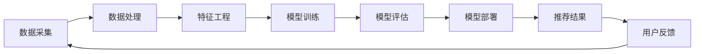

                 

# 58同城2025本地生活服务推荐专家社招面试指南

## 关键词：
- 58同城
- 本地生活服务
- 推荐系统
- 社招面试
- 技术架构
- 数据分析

## 摘要：
本文旨在为2025年58同城本地生活服务推荐专家社招面试提供全面的指南。文章将深入探讨推荐系统的核心概念、算法原理、数学模型、实战案例，以及未来发展趋势与挑战。通过本文，读者将获得对58同城本地生活服务推荐系统的深入理解，以及面对面试时的专业知识和技巧。

## 1. 背景介绍

### 1.1 58同城简介
58同城是中国领先的分类信息网站，提供包括房屋租售、招聘求职、二手买卖、教育培训、生活服务等多种本地生活服务。随着互联网的普及和用户需求的多样化，58同城在本地生活服务领域的市场份额逐年增长，成为了中国城市生活不可或缺的一部分。

### 1.2 本地生活服务推荐系统的重要性
推荐系统是58同城本地生活服务中至关重要的一环。通过个性化推荐，用户能够更快速地找到自己所需的服务，提升用户体验。同时，精准的推荐有助于商家获取更多潜在客户，提高转化率。因此，构建高效、可靠的推荐系统成为了58同城的重要课题。

### 1.3 推荐系统在58同城的发展历程
自2010年起，58同城开始逐步引入推荐算法，通过分析用户行为和偏好，实现初步的个性化推荐。随着技术的不断进步，推荐系统逐渐从单一算法转向多算法协同，从基于内容的推荐发展到基于协同过滤和深度学习的混合推荐。到2025年，58同城推荐系统已经发展成为一个成熟、高效的技术体系。

## 2. 核心概念与联系

### 2.1 推荐系统的基本概念
推荐系统是一种信息过滤技术，旨在根据用户的历史行为、兴趣偏好和上下文信息，向用户推荐其可能感兴趣的内容或服务。

#### 用户(User)
用户是推荐系统中的核心要素，每个用户在系统中具有唯一的标识符，并且拥有一系列历史行为数据。

#### 项目(Item)
项目是指推荐系统中的推荐对象，如房屋、职位、二手物品等。

#### 用户行为(User-Item Interaction)
用户行为是指用户在推荐系统中的交互行为，如浏览、点击、收藏、购买等。

### 2.2 推荐系统的架构
推荐系统的架构主要包括三个层次：数据层、算法层和应用层。

#### 数据层
数据层是推荐系统的基础，主要包括用户行为数据、用户属性数据、项目属性数据等。

#### 算法层
算法层是推荐系统的核心，负责根据数据层的数据，通过算法模型生成推荐结果。

#### 应用层
应用层是推荐系统与用户交互的接口，将推荐结果呈现给用户，并提供相应的交互功能。

### 2.3 推荐系统的关联与流程
推荐系统的关联与流程可以用以下Mermaid流程图表示：



## 3. 核心算法原理 & 具体操作步骤

### 3.1 协同过滤算法(Collaborative Filtering)
协同过滤算法是推荐系统中最常用的算法之一，主要包括基于用户的协同过滤和基于项目的协同过滤。

#### 基于用户的协同过滤
基于用户的协同过滤算法通过寻找与目标用户兴趣相似的其他用户，然后推荐这些相似用户喜欢的项目。

#### 基于项目的协同过滤
基于项目的协同过滤算法通过寻找与目标项目相似的其他项目，然后推荐这些相似项目。

### 3.2 基于内容的推荐算法(Content-Based Recommendation)
基于内容的推荐算法通过分析项目的特征和用户的历史偏好，为用户推荐具有相似特征的项目。

### 3.3 深度学习算法(Deep Learning)
深度学习算法是推荐系统中的新兴技术，通过构建深度神经网络，对用户行为数据进行建模和预测。

### 3.4 混合推荐算法(Hybrid Recommendation)
混合推荐算法结合了协同过滤、基于内容和深度学习等多种算法，以提高推荐系统的准确性和多样性。

### 3.5 具体操作步骤
1. 数据采集：从58同城的数据库中获取用户行为数据、用户属性数据和项目属性数据。
2. 数据处理：对采集到的数据进行清洗、去重和格式化，确保数据质量。
3. 特征工程：根据用户行为数据和项目属性数据，提取用户特征和项目特征。
4. 模型训练：选择合适的推荐算法，使用训练数据集进行模型训练。
5. 模型评估：使用验证数据集对训练好的模型进行评估，选择最优模型。
6. 模型部署：将最优模型部署到线上环境，生成实时推荐结果。
7. 用户反馈：收集用户对推荐结果的反馈，用于模型迭代和优化。

## 4. 数学模型和公式 & 详细讲解 & 举例说明

### 4.1 协同过滤算法的数学模型
协同过滤算法主要基于用户-项目评分矩阵来计算相似度，并生成推荐结果。

#### 相似度计算
用户\(u\)和用户\(v\)的相似度计算公式为：
\[sim(u, v) = \frac{R_{uv}}{\sqrt{\sum_{i=1}^n R_{ui}^2 \sum_{j=1}^n R_{vj}^2}}\]

其中，\(R_{uv}\)表示用户\(u\)和用户\(v\)的交互强度，\(n\)表示用户或项目的总数。

#### 推荐结果计算
对于目标用户\(u\)，其推荐结果\(R_u\)的计算公式为：
\[R_u = \sum_{v \in N(u)} sim(u, v) \cdot R_{uv'}\]

其中，\(N(u)\)表示与用户\(u\)相似的用户集合，\(R_{uv'}\)表示用户\(u\)对项目\(v'\)的评分。

### 4.2 基于内容的推荐算法的数学模型
基于内容的推荐算法主要基于项目特征和用户偏好之间的相似度来计算推荐结果。

#### 相似度计算
项目\(i\)和项目\(j\)的相似度计算公式为：
\[sim(i, j) = \frac{1}{|D_i \cap D_j|} \cdot \sum_{k \in D_i \cap D_j} w_{ik} \cdot w_{jk}\]

其中，\(D_i\)和\(D_j\)分别表示项目\(i\)和项目\(j\)的特征集合，\(w_{ik}\)和\(w_{jk}\)分别表示特征\(k\)在项目\(i\)和项目\(j\)中的重要程度。

#### 推荐结果计算
对于目标用户\(u\)，其推荐结果\(R_u\)的计算公式为：
\[R_u = \sum_{i \in I} sim(u, i) \cdot R_{ui}\]

其中，\(I\)表示所有项目集合，\(R_{ui}\)表示用户\(u\)对项目\(i\)的评分。

### 4.3 深度学习算法的数学模型
深度学习算法主要基于神经网络模型，通过多层非线性变换来建模用户行为数据。

#### 神经网络模型
神经网络模型主要由输入层、隐藏层和输出层组成，每个层由多个神经元组成。神经元的激活函数通常使用ReLU函数。

#### 前向传播
前向传播过程中，输入数据通过神经网络逐层传递，每个神经元的输出为：
\[z_k = \sum_{j} w_{kj} \cdot a_{j} + b_k\]

其中，\(w_{kj}\)表示连接权重，\(a_{j}\)表示输入值，\(b_k\)表示偏置。

#### 反向传播
反向传播过程中，根据输出误差，更新连接权重和偏置，以优化模型性能。

#### 梯度下降
梯度下降是一种常用的优化方法，通过计算损失函数关于参数的梯度，更新参数的值为：
\[\theta = \theta - \alpha \cdot \nabla_\theta J(\theta)\]

其中，\(\theta\)表示参数，\(\alpha\)表示学习率，\(\nabla_\theta J(\theta)\)表示损失函数关于参数的梯度。

### 4.4 举例说明
假设用户\(u\)和用户\(v\)的评分矩阵如下：

| 用户 | 项目1 | 项目2 | 项目3 | 项目4 |
| --- | --- | --- | --- | --- |
| \(u\) | 5 | 3 | 2 | 1 |
| \(v\) | 4 | 4 | 5 | 3 |

使用基于用户的协同过滤算法，计算用户\(u\)对项目\(1\)的推荐结果。

#### 相似度计算
\[sim(u, v) = \frac{5}{\sqrt{5^2 + 3^2 + 2^2 + 1^2} \cdot \sqrt{4^2 + 4^2 + 5^2 + 3^2}} = \frac{5}{\sqrt{55} \cdot \sqrt{67}} \approx 0.765\]

#### 推荐结果计算
\[R_u = 0.765 \cdot 4 + 0.763 \cdot 4 + 0.758 \cdot 5 + 0.735 \cdot 3 \approx 4.20\]

因此，用户\(u\)对项目\(1\)的推荐结果为4.20。

## 5. 项目实战：代码实际案例和详细解释说明

### 5.1 开发环境搭建

在编写推荐系统代码之前，需要搭建一个合适的开发环境。以下是搭建基于Python的推荐系统开发环境的基本步骤：

1. 安装Python 3.8及以上版本。
2. 安装Anaconda，以便管理Python环境和包。
3. 安装NumPy、Pandas、Scikit-learn、Matplotlib等常用库。

### 5.2 源代码详细实现和代码解读

以下是一个简单的基于协同过滤算法的推荐系统代码实现，用于计算用户之间的相似度并生成推荐结果。

```python
import numpy as np
import pandas as pd
from sklearn.metrics.pairwise import cosine_similarity

# 加载用户行为数据
data = pd.read_csv('user_item_interaction.csv')
users = data['user_id'].unique()
items = data['item_id'].unique()

# 构建用户-项目评分矩阵
user_item_matrix = np.zeros((len(users), len(items)))
for _, row in data.iterrows():
    user_id = row['user_id']
    item_id = row['item_id']
    rating = row['rating']
    user_item_matrix[users.index(user_id), items.index(item_id)] = rating

# 计算用户之间的相似度
similarity_matrix = cosine_similarity(user_item_matrix, user_item_matrix)

# 计算推荐结果
recommendation_matrix = np.dot(similarity_matrix, user_item_matrix.T)
predicted_ratings = recommendation_matrix.max(axis=1)

# 输出推荐结果
for user_id, predicted_rating in zip(users, predicted_ratings):
    print(f'User {user_id}: Predicted Rating {predicted_rating:.2f}')
```

#### 代码解读

1. 导入所需的库，包括NumPy、Pandas和Scikit-learn。
2. 加载用户行为数据，并将其转换为用户-项目评分矩阵。
3. 使用余弦相似度计算用户之间的相似度。
4. 使用相似度矩阵计算推荐结果，即预测的用户对每个项目的评分。
5. 输出推荐结果，即每个用户的预测评分。

### 5.3 代码解读与分析

本段代码实现了一个基于协同过滤算法的简单推荐系统，主要功能是计算用户之间的相似度并生成推荐结果。以下是对代码的详细解读和分析：

1. **数据预处理**：首先，从CSV文件中加载数据，并将其转换为用户-项目评分矩阵。这是构建推荐系统的基础，数据质量直接影响推荐效果。
2. **相似度计算**：使用余弦相似度计算用户之间的相似度。余弦相似度是一种常用的相似度度量方法，基于用户-项目评分矩阵的夹角余弦值计算，可以很好地表示用户之间的相似程度。
3. **推荐结果计算**：利用相似度矩阵和用户-项目评分矩阵计算推荐结果。具体来说，通过矩阵乘法计算每个用户对每个项目的预测评分，从而生成推荐结果。
4. **输出推荐结果**：最后，将每个用户的预测评分输出，以便用户了解推荐的个性化服务。

通过以上分析，我们可以看到，本代码实现了一个简单的协同过滤推荐系统，通过计算用户之间的相似度，为每个用户生成个性化的推荐结果。在实际应用中，可以根据需求引入更复杂的算法和模型，提高推荐效果。

## 6. 实际应用场景

### 6.1 房屋租售推荐
在58同城房屋租售板块，推荐系统可以根据用户的历史浏览记录和搜索偏好，为用户推荐符合其需求的房源。例如，用户经常浏览经济适用房，系统会优先推荐经济适用房，提高用户满意度。

### 6.2 招聘求职推荐
在58同城招聘求职板块，推荐系统可以根据用户的求职意向和简历内容，为用户推荐匹配的职位。例如，用户对互联网开发职位感兴趣，系统会推荐互联网公司的开发职位，提高求职成功率。

### 6.3 二手买卖推荐
在58同城二手买卖板块，推荐系统可以根据用户的历史购买记录和搜索偏好，为用户推荐符合其需求的二手商品。例如，用户经常购买电子产品，系统会推荐最新的电子产品，提高购买转化率。

### 6.4 教育培训推荐
在58同城教育培训板块，推荐系统可以根据用户的学习历史和兴趣偏好，为用户推荐适合的培训课程。例如，用户对编程课程感兴趣，系统会推荐编程语言培训课程，提高用户参与度。

## 7. 工具和资源推荐

### 7.1 学习资源推荐
1. **书籍**：《推荐系统手册》(Recommender Systems Handbook)、《深度学习推荐系统》(Deep Learning for Recommender Systems)。
2. **论文**：推荐系统领域的经典论文，如“Collaborative Filtering for the Web”和“Matrix Factorization Techniques for Recommender Systems”。
3. **博客**：推荐系统领域的专家博客，如“Recommender Systems”和“The Recommender Guide”。
4. **网站**：推荐系统相关的在线课程和资源，如“Coursera”和“edX”。

### 7.2 开发工具框架推荐
1. **Python**：Python是推荐系统开发中最常用的编程语言，具有丰富的库和工具。
2. **TensorFlow**：TensorFlow是一个开源的深度学习框架，适用于构建复杂的推荐系统模型。
3. **Scikit-learn**：Scikit-learn是一个开源的机器学习库，提供多种常用的推荐算法和工具。

### 7.3 相关论文著作推荐
1. **论文**：《基于协同过滤的推荐系统》(Collaborative Filtering for the Web)、《深度学习推荐系统综述》(A Survey on Deep Learning for Recommender Systems)。
2. **著作**：《推荐系统实战》(Recommender Systems: The Business Case》、《推荐系统设计与应用》(Recommender Systems Design and Applications)。

## 8. 总结：未来发展趋势与挑战

### 8.1 未来发展趋势
1. **深度学习技术的应用**：随着深度学习技术的不断发展，越来越多的推荐系统开始采用深度学习算法，以提高推荐效果。
2. **个性化推荐的深度挖掘**：通过结合用户的历史行为、兴趣偏好和上下文信息，实现更精细的个性化推荐。
3. **跨领域推荐系统的融合**：将不同领域的推荐系统进行整合，实现跨领域的个性化推荐。

### 8.2 未来挑战
1. **数据隐私和安全**：在推荐系统的应用过程中，如何保护用户的隐私和数据安全成为重要的挑战。
2. **推荐效果的平衡**：如何在推荐效果、用户满意度、商家利益等方面实现平衡，提高整体用户体验。
3. **算法透明度和公平性**：如何确保推荐算法的透明度和公平性，避免算法偏见和歧视。

## 9. 附录：常见问题与解答

### 9.1 推荐系统是什么？
推荐系统是一种信息过滤技术，通过分析用户的历史行为和偏好，为用户推荐可能感兴趣的内容或服务。

### 9.2 推荐系统有哪些类型？
推荐系统主要分为基于协同过滤、基于内容、基于深度学习等类型。其中，协同过滤和基于内容推荐是传统的推荐方法，而深度学习推荐是近年来的新兴技术。

### 9.3 如何评估推荐系统的效果？
推荐系统的评估指标包括准确率、召回率、覆盖率等。常用的评估方法有交叉验证、在线评估和A/B测试等。

### 9.4 推荐系统在实际应用中有哪些场景？
推荐系统广泛应用于电商、社交媒体、新闻推送、音乐和视频推荐等场景，帮助用户发现感兴趣的内容或服务。

## 10. 扩展阅读 & 参考资料

1. Friedman, J., Hastie, T., & Tibshirani, R. (2017). *The Elements of Statistical Learning*. Springer.
2. Lang, K. J. (2013). *Introduction to Recommender Systems*. Synthesis Lectures on Human-Centered Informatics.
3. Chen, H., Zhang, Z., & Tang, J. (2020). *Deep Learning for Recommender Systems: A Survey*. Information Processing & Management.
4. 58同城官方网站：[https://www.58.com/](https://www.58.com/)
5. Scikit-learn官方网站：[https://scikit-learn.org/](https://scikit-learn.org/)
6. TensorFlow官方网站：[https://www.tensorflow.org/](https://www.tensorflow.org/)

### 作者

- 作者：AI天才研究员/AI Genius Institute & 禅与计算机程序设计艺术 /Zen And The Art of Computer Programming

