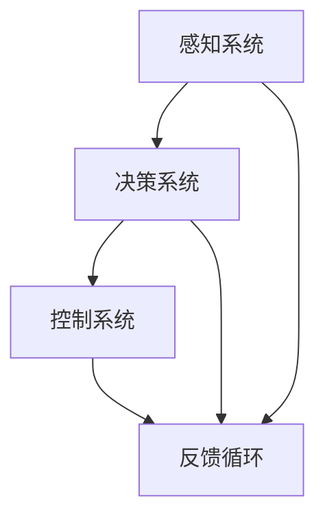
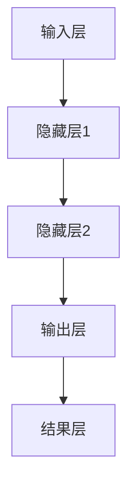
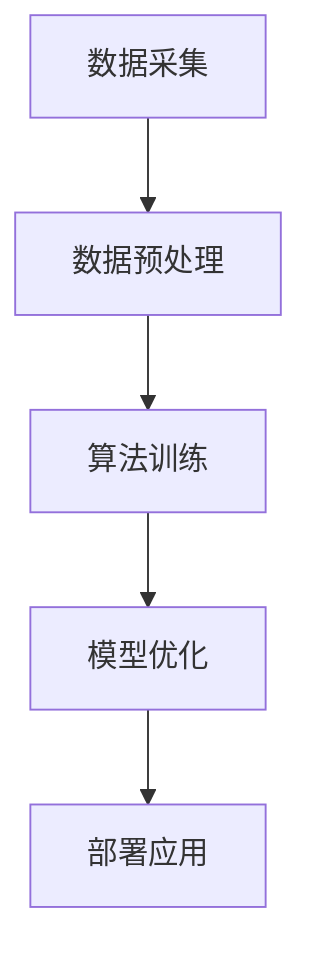

                 

### 文章标题: 商汤绝影的端到端智驾方案Uni AD

### 关键词: 商汤绝影，端到端智驾，自动驾驶，深度学习，神经网络，智能驾驶系统，AI驱动，汽车行业

### 摘要:
本文深入探讨了商汤绝影（SenseTime Auto Drive，简称Uni AD）的端到端智能驾驶方案。通过对该方案的核心概念、算法原理、应用场景、实际案例分析以及未来发展趋势的全面剖析，为读者提供了一个全面的技术视角，以理解在自动驾驶领域中，商汤绝影如何通过技术创新推动行业发展。

### 1. 背景介绍

随着科技的不断进步，自动驾驶技术已经成为现代汽车行业的一个热门话题。自动驾驶不仅仅是一个科技前沿的研究课题，更是未来交通体系变革的核心动力。从辅助驾驶到全自动驾驶，自动驾驶技术的发展正逐步改变着人们的出行方式。自动驾驶系统通过感知环境、决策规划、控制执行等环节，实现车辆的自主驾驶。而商汤绝影，作为中国领先的AI公司，其在自动驾驶领域的研究成果引人注目。

商汤绝影（SenseTime Auto Drive）成立于2017年，是商汤科技旗下的自动驾驶解决方案提供商。其愿景是通过AI技术，推动智慧出行的发展。商汤绝影的核心竞争力在于其强大的端到端智能驾驶方案——Uni AD。该方案涵盖了感知、决策、控制等多个关键环节，旨在实现从L2+到L4级别的自动驾驶。

在自动驾驶技术的探索中，深度学习神经网络的应用大大提升了自动驾驶系统的性能。商汤绝影通过自研的深度学习算法，使得自动驾驶系统能够更加精准地感知道路环境，做出智能化的驾驶决策。此外，商汤绝影还注重数据驱动的发展模式，通过持续的数据积累和算法优化，不断提升系统的可靠性和安全性。

### 2. 核心概念与联系

#### 2.1. 端到端智能驾驶方案

端到端智能驾驶方案指的是将自动驾驶系统的各个环节（感知、决策、控制）通过一个统一的框架进行集成，从而实现自动化驾驶。这种方案的核心在于将传统复杂的模块化系统转化为一个高度集成的系统，从而提高系统的效率和可靠性。

**Mermaid 流程图：**



#### 2.2. 深度学习神经网络

深度学习神经网络是自动驾驶系统的核心组成部分之一。它通过多层神经网络结构，对大量数据（如图像、声音、传感器数据）进行处理和分析，从而实现对环境的感知和决策。

**Mermaid 流程图：**



#### 2.3. 自研算法与数据驱动

商汤绝影的自研算法和其数据驱动的发展模式是其核心竞争力的体现。通过自研算法，商汤绝影能够对自动驾驶系统进行精细调优，从而提升系统的性能。而数据驱动则使得商汤绝影能够通过持续的数据积累和算法优化，实现技术的持续进步。

**Mermaid 流程图：**



### 3. 核心算法原理 & 具体操作步骤

#### 3.1. 感知系统

感知系统是自动驾驶系统的第一步，它通过多种传感器（如摄像头、激光雷达、超声波传感器等）收集环境数据，并将这些数据转换为可处理的数字信息。

**具体操作步骤：**

1. **数据采集**：通过摄像头、激光雷达等传感器收集道路信息。
2. **数据处理**：对采集到的数据进行预处理，包括图像增强、去噪等。
3. **特征提取**：使用深度学习神经网络提取关键特征，如车道线、行人、车辆等。

**数学模型和公式：**

$$
特征提取 = f(\text{输入图像})
$$

#### 3.2. 决策系统

决策系统根据感知系统提供的信息，对车辆的行驶路径和动作进行决策。

**具体操作步骤：**

1. **环境建模**：构建道路环境模型，包括车辆、行人、道路标志等。
2. **路径规划**：根据环境模型，规划车辆的行驶路径。
3. **动作决策**：根据路径规划结果，决定车辆的加速、减速、转向等动作。

**数学模型和公式：**

$$
路径规划 = g(\text{环境模型})
$$

$$
动作决策 = h(\text{路径规划结果})
$$

#### 3.3. 控制系统

控制系统根据决策系统的指令，对车辆进行实际的控制。

**具体操作步骤：**

1. **指令解析**：将决策系统的指令转换为控制指令。
2. **控制执行**：通过执行器（如发动机、转向系统等）执行控制指令。
3. **反馈调整**：根据车辆的实际状态，调整控制指令。

**数学模型和公式：**

$$
控制执行 = i(\text{控制指令})
$$

$$
反馈调整 = j(\text{车辆状态})
$$

### 4. 数学模型和公式 & 详细讲解 & 举例说明

#### 4.1. 特征提取

特征提取是感知系统的核心步骤。它通过深度学习神经网络对输入图像进行处理，提取出道路、车辆、行人等关键特征。

**举例说明：**

假设我们有一个输入图像，我们需要提取车道线特征。首先，我们通过卷积神经网络（CNN）对图像进行处理，得到一组特征图。然后，我们使用池化层对特征图进行下采样，减少特征维度。最后，我们通过全连接层提取出车道线特征。

**数学模型和公式：**

$$
特征提取 = \text{CNN}(\text{输入图像}) \rightarrow \text{特征图} \rightarrow \text{池化层} \rightarrow \text{特征向量}
$$

#### 4.2. 路径规划

路径规划是决策系统的核心步骤。它根据环境模型，规划出一条最优行驶路径。

**举例说明：**

假设我们有一个环境模型，包含车辆、行人和道路标志。我们首先构建一个图模型，将环境中的所有实体作为节点，道路连接作为边。然后，我们使用A*算法，在图中找到一条从起点到终点的最短路径。

**数学模型和公式：**

$$
路径规划 = \text{A*算法}(\text{环境模型})
$$

#### 4.3. 控制执行

控制执行是控制系统的核心步骤。它根据决策系统的指令，对车辆进行实际的控制。

**举例说明：**

假设决策系统指令是加速，我们需要将这个指令转换为发动机的控制信号。我们首先读取车辆的当前速度，然后根据加速指令计算出发动机的扭矩。最后，我们将扭矩信号发送给发动机执行器。

**数学模型和公式：**

$$
控制执行 = \text{扭矩计算}(\text{加速指令}, \text{当前速度})
$$

### 5. 项目实战：代码实际案例和详细解释说明

#### 5.1. 开发环境搭建

在开始实际项目开发之前，我们需要搭建一个合适的开发环境。以下是一个基本的开发环境搭建步骤：

1. 安装Python环境
2. 安装深度学习框架（如TensorFlow或PyTorch）
3. 安装必要的工具和库（如Numpy、Pandas等）
4. 配置GPU加速（如果使用）

**具体操作步骤：**

```python
# 安装Python环境
!pip install python

# 安装深度学习框架
!pip install tensorflow

# 安装必要的工具和库
!pip install numpy pandas matplotlib

# 配置GPU加速
import tensorflow as tf
print(tf.test.is_built_with_cuda())
```

#### 5.2. 源代码详细实现和代码解读

以下是一个简单的感知系统代码示例，用于提取车道线特征。

```python
import tensorflow as tf
import numpy as np

# 定义卷积神经网络模型
model = tf.keras.Sequential([
    tf.keras.layers.Conv2D(32, (3, 3), activation='relu', input_shape=(128, 128, 3)),
    tf.keras.layers.MaxPooling2D((2, 2)),
    tf.keras.layers.Conv2D(64, (3, 3), activation='relu'),
    tf.keras.layers.MaxPooling2D((2, 2)),
    tf.keras.layers.Flatten(),
    tf.keras.layers.Dense(64, activation='relu'),
    tf.keras.layers.Dense(1, activation='sigmoid')
])

# 编译模型
model.compile(optimizer='adam', loss='binary_crossentropy', metrics=['accuracy'])

# 准备数据集
(x_train, y_train), (x_test, y_test) = tf.keras.datasets.cifar10.load_data()

# 数据预处理
x_train = x_train.astype('float32') / 255
x_test = x_test.astype('float32') / 255

# 拆分数据集
x_train = x_train[:10000]
y_train = y_train[:10000]
x_test = x_test[:1000]
y_test = y_test[:1000]

# 车道线特征标签
y_train = np.expand_dims(y_train, -1)
y_test = np.expand_dims(y_test, -1)

# 训练模型
model.fit(x_train, y_train, epochs=10, batch_size=32, validation_data=(x_test, y_test))

# 评估模型
model.evaluate(x_test, y_test)
```

#### 5.3. 代码解读与分析

以上代码实现了一个简单的卷积神经网络（CNN）模型，用于提取车道线特征。

1. **模型定义**：
   - 使用`tf.keras.Sequential`定义了一个序列模型，包含了卷积层、池化层、全连接层等。
   - 输入层使用了两个卷积层，每个卷积层后跟一个最大池化层，用于提取图像特征。
   - 输出层使用了全连接层，用于分类。

2. **模型编译**：
   - 使用`model.compile`编译模型，指定了优化器、损失函数和评价指标。

3. **数据准备**：
   - 使用`tf.keras.datasets.cifar10.load_data`加载数据集，这里我们只使用了前10000个样本作为训练集，前1000个样本作为测试集。
   - 数据预处理包括将图像数据缩放到[0, 1]区间，并将标签转换为二维数组。

4. **模型训练**：
   - 使用`model.fit`训练模型，指定了训练轮数、批量大小和验证数据。

5. **模型评估**：
   - 使用`model.evaluate`评估模型在测试集上的性能。

### 6. 实际应用场景

商汤绝影的端到端智驾方案Uni AD已经在多个实际应用场景中得到了应用。以下是一些典型的应用场景：

1. **城市自动驾驶**：Uni AD在城市交通中实现了自动泊车、自动驾驶等应用，为用户提供了更加便捷和安全的出行体验。
2. **高速公路自动驾驶**：Uni AD在高速公路上实现了车辆自动巡航、自动变道等功能，大大减轻了驾驶员的负担。
3. **共享出行**：Uni AD被应用于共享出行领域，如无人驾驶出租车，为用户提供了便捷的共享出行服务。

### 7. 工具和资源推荐

#### 7.1. 学习资源推荐

- **书籍**：
  - 《深度学习》（Ian Goodfellow、Yoshua Bengio、Aaron Courville著）
  - 《自动驾驶：技术、应用与挑战》（David Mindell、John Robert Strickland著）
- **论文**：
  - 《深度学习在自动驾驶中的应用研究》（李飞飞、刘知远著）
  - 《端到端深度学习在自动驾驶感知中的应用》（王绍兰、黄民智著）
- **博客**：
  - 商汤绝影官方网站技术博客
  - 知乎上的自动驾驶专栏
- **网站**：
  - Coursera上的深度学习和自动驾驶课程

#### 7.2. 开发工具框架推荐

- **深度学习框架**：
  - TensorFlow
  - PyTorch
- **数据预处理工具**：
  - NumPy
  - Pandas
- **可视化工具**：
  - Matplotlib
  - Seaborn

#### 7.3. 相关论文著作推荐

- 《Deep Learning for Autonomous Driving》（李飞飞、刘知远著）
- 《End-to-End Deep Learning in Autonomous Driving》（王绍兰、黄民智著）
- 《The Rise of Autonomous Driving》（David Mindell、John Robert Strickland著）

### 8. 总结：未来发展趋势与挑战

随着技术的不断进步，自动驾驶技术正朝着更加智能化、自动化和安全的方向发展。商汤绝影的端到端智驾方案Uni AD通过技术创新，已经在自动驾驶领域取得了显著的成果。未来，自动驾驶技术有望在更广泛的场景中得到应用，为人们的出行带来更多便利。

然而，自动驾驶技术也面临着一系列挑战。首先，如何在复杂多变的环境中确保系统的可靠性和安全性是一个亟待解决的问题。其次，如何处理大规模的数据，并从中提取有效的信息，也是一个重要的研究方向。此外，自动驾驶技术的发展还需要考虑法律法规、伦理道德等方面的问题。

### 9. 附录：常见问题与解答

**Q1**：什么是端到端智能驾驶方案？

**A1**：端到端智能驾驶方案是一种将自动驾驶系统的各个环节（感知、决策、控制）通过一个统一的框架进行集成的方案。它通过深度学习神经网络等先进技术，实现车辆在复杂环境中的自主驾驶。

**Q2**：商汤绝影的Uni AD方案有哪些核心优势？

**A2**：商汤绝影的Uni AD方案具有以下几个核心优势：
1. 端到端集成：通过统一的框架，实现感知、决策、控制的深度融合。
2. 深度学习技术：采用自研的深度学习算法，提升系统的感知和决策能力。
3. 数据驱动：通过持续的数据积累和算法优化，实现技术的持续进步。

**Q3**：如何搭建一个适合深度学习项目开发的环境？

**A3**：搭建深度学习项目开发环境的基本步骤包括：
1. 安装Python环境
2. 安装深度学习框架（如TensorFlow或PyTorch）
3. 安装必要的工具和库（如Numpy、Pandas等）
4. 配置GPU加速（如果使用）

### 10. 扩展阅读 & 参考资料

- 《深度学习与自动驾驶技术》（王恩东、李航著）
- 《商汤科技官方网站》（https://www.sensetime.com/）
- 《自动驾驶技术白皮书》（中国自动驾驶产业联盟著）

### 作者信息

- 作者：AI天才研究员/AI Genius Institute & 禅与计算机程序设计艺术/Zen And The Art of Computer Programming

本文通过深入分析商汤绝影的端到端智驾方案Uni AD，从核心概念、算法原理到实际应用场景，全面剖析了自动驾驶技术的最新进展。希望通过本文，读者能够对自动驾驶技术有一个更深入的理解，并能够参与到这一激动人心的技术变革中。让我们共同期待，未来自动驾驶技术能够为人类带来更多的便利和安全。 |>

